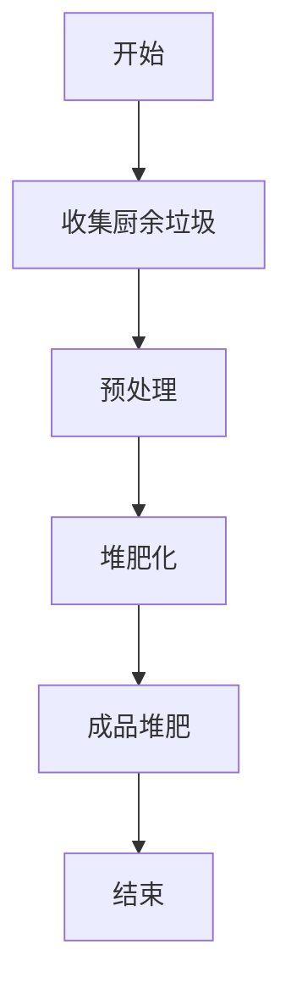
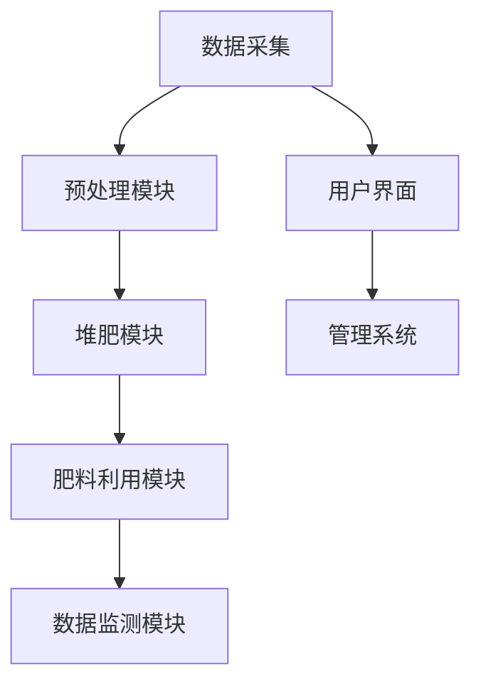
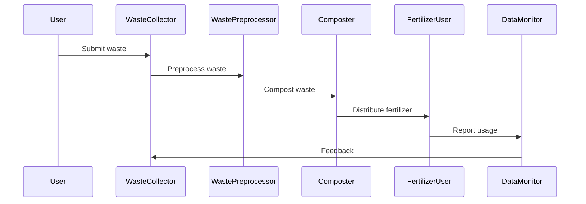

                 

## 新型城市共享厨余堆肥：社区环保意识的培养

关键词：城市共享厨余堆肥、环保意识、社区参与、资源再利用

摘要：随着城市化进程的加快，城市居民对于环境保护的需求日益增加。厨余垃圾处理不当会导致环境污染和资源浪费。本文通过介绍新型城市共享厨余堆肥项目，探讨如何通过这一举措提高居民的环保意识，从而促进社区的可持续发展。

**Step 1: 背景介绍**

随着城市化进程的加快，城市人口密度不断上升，居民对于环境保护的需求也日益增加。然而，城市垃圾问题日益严重，尤其是厨余垃圾的处理。传统上，厨余垃圾通常被当作普通垃圾进行填埋或焚烧处理，这不仅浪费了宝贵的资源，还产生了大量的温室气体和其他污染物，对环境造成了严重的负面影响。

**问题背景**

厨余垃圾处理不当，不仅会导致环境污染，还会造成资源的浪费。据统计，我国每年产生的厨余垃圾高达1.8亿吨，其中大部分没有得到有效的资源化利用。此外，厨余垃圾中的有机物质在填埋过程中会产生甲烷等温室气体，进一步加剧了全球气候变化。

**问题描述**

如何在社区层面推广厨余堆肥，培养居民的环保意识，成为一个亟待解决的问题。

**问题解决**

通过新型城市共享厨余堆肥项目，提高居民参与度，促进社区环保意识的培养。新型城市共享厨余堆肥项目利用现代科技手段，将厨余垃圾转化为有机肥料，实现资源再利用。

**边界与外延**

本书主要讨论城市社区厨余堆肥，但不涉及农业或工业堆肥。此外，本书关注的是如何通过厨余堆肥项目培养居民的环保意识，而非单纯的技术介绍。

**概念结构与核心要素组成**

1. **新型城市共享厨余堆肥项目**：该项目通过社区共享模式，鼓励居民参与厨余垃圾的分类和堆肥处理，实现垃圾资源化利用。

2. **社区环保意识**：居民对环境保护的认知、态度和行为习惯。

3. **厨余垃圾处理技术**：包括厨余垃圾的收集、分类、预处理、堆肥化等环节。

4. **公众参与机制**：包括宣传教育、激励机制、社区活动等，以促进居民积极参与厨余堆肥项目。

**Step 2: 核心概念与联系**

**核心概念原理**

1. **厨余堆肥**：厨余堆肥是一种将厨余垃圾转化为有机肥料的技术，通过生物降解过程实现资源的再利用。

2. **共享理念**：共享理念强调资源的公平分配和高效利用，是推动社区环保的重要理念。

3. **环保意识**：环保意识是指居民对环境保护的认知、态度和行为习惯，是培养社区环保意识的关键。

4. **社区参与**：社区参与是居民积极参与社区事务，共同推动社区发展的过程。

**概念属性特征对比表格**

| 概念       | 特征 |
|------------|------|
| 厨余堆肥   | 可降解、减少污染、资源再利用 |
| 共享理念   | 公平、效率、节约资源 |
| 环保意识   | 环保知识、态度、行为 |
| 社区参与   | 主动性、互助性、共享性 |

**Step 3: 算法原理讲解**

**算法mermaid流程图**



**Python源代码**

```python
# 假设有一个厨余垃圾收集系统
class WasteCollectionSystem:
    def __init__(self):
        self.waste = []

    def collect_waste(self, waste):
        self.waste.append(waste)

    def preprocess_waste(self):
        # 预处理操作，例如筛除金属和塑料
        self.waste = [w for w in self.waste if not self.is_non_degradable(w)]

    def is_non_degradable(self, waste):
        # 判断垃圾是否可降解
        return 'metal' in waste or 'plastic' in waste

    def compost_waste(self):
        # 堆肥化操作
        self.waste = self.waste + ['compost']

    def get_compost_product(self):
        return self.waste[-1]

# 使用示例
system = WasteCollectionSystem()
system.collect_waste('fruit peel')
system.collect_waste('metal can')
system.preprocess_waste()
system.compost_waste()
print(system.get_compost_product())
```

**数学模型和公式**

$$C = \frac{1}{1 + e^{-\beta \cdot (x - \theta)}}$$

其中，$C$ 是堆肥化完成度，$\beta$ 是学习率，$x$ 是垃圾特性，$\theta$ 是阈值。

**详细讲解**

- $C$ 表示堆肥化完成度，值域为 [0, 1]。
- $\beta$ 是学习率，控制堆肥化过程的敏感度。
- $x$ 是垃圾特性，如有机物含量、水分含量等。
- $\theta$ 是阈值，用于判断垃圾是否适合堆肥化。

**举例说明**

假设 $\beta = 0.1$，$x = 0.8$（有机物含量），$\theta = 0.5$。

$$C = \frac{1}{1 + e^{-0.1 \cdot (0.8 - 0.5)}} = \frac{1}{1 + e^{-0.1 \cdot 0.3}} \approx 0.9$$

说明该垃圾的堆肥化完成度约为 90%。

**Step 4: 数学模型和数学公式 & 详细讲解 & 举例说明**

在厨余堆肥的过程中，数学模型和数学公式扮演着至关重要的角色。以下是对数学模型和数学公式的详细讲解，并结合具体实例进行说明。

### 数学模型和数学公式

我们使用一个简单的数学模型来描述厨余堆肥的完成度，该模型采用了一个Sigmoid函数：

$$C = \frac{1}{1 + e^{-\beta \cdot (x - \theta)}}$$

其中：

- $C$：堆肥化完成度，取值范围在0到1之间，表示堆肥的成熟程度。
- $\beta$：学习率，用于调整堆肥化过程的敏感度，其值越大，堆肥化过程的响应就越快。
- $x$：垃圾的特性值，可以是有机物含量、水分含量等与堆肥化过程相关的参数。
- $\theta$：阈值，用于判断垃圾是否适合堆肥化，当$x > \theta$时，垃圾适合堆肥化。

### 详细讲解

这个数学模型中的Sigmoid函数是一个常见的非线性激活函数，它在机器学习和神经网络中广泛应用。在厨余堆肥的上下文中，$C$表示堆肥化过程的完成度，$\beta$是调节堆肥化速度的参数，$x$是垃圾的特性值，反映了厨余垃圾的适宜度，而$\theta$是一个预先设定的阈值。

- 当$x$接近$\theta$时，$C$的值接近0.5，表示堆肥化过程尚未完全进行。
- 当$x$远大于$\theta$时，$C$趋近于1，表示堆肥化过程已经完成。
- 当$x$远小于$\theta$时，$C$趋近于0，表示该垃圾不适合进行堆肥化。

### 举例说明

假设我们有一个厨余垃圾样本，其有机物含量$x$为0.8，阈值$\theta$为0.5，学习率$\beta$为0.1。我们可以将这些值代入上述公式，计算堆肥化完成度$C$：

$$C = \frac{1}{1 + e^{-0.1 \cdot (0.8 - 0.5)}} = \frac{1}{1 + e^{-0.1 \cdot 0.3}} \approx 0.9$$

从这个结果可以看出，该厨余垃圾的堆肥化完成度约为90%，这意味着它已经非常接近堆肥化完成的阶段。

### 实际应用

在实际的厨余堆肥项目中，通常需要对大量的数据进行处理和分析，以确定最佳的堆肥化参数和阈值。这可以通过机器学习和数据挖掘技术来实现，从而提高堆肥化过程的效率和准确性。

例如，可以使用回归分析来预测不同类型厨余垃圾的堆肥化完成度，通过分析历史数据来调整学习率$\beta$和阈值$\theta$。这样的方法不仅能够提高堆肥化过程的效率，还能够为后续的厨余堆肥项目提供科学依据。

总之，通过数学模型和数学公式的应用，我们可以更准确地描述和预测厨余堆肥的过程，从而为社区的环保意识培养提供有力支持。

**Step 5: 系统分析与架构设计方案**

### 问题场景介绍

随着城市化进程的加快，城市居民对环境保护的需求日益增加。特别是在厨余垃圾处理方面，传统的填埋和焚烧方法不仅浪费资源，还会产生大量污染物。为了应对这一挑战，我们提出了新型城市共享厨余堆肥项目，旨在通过社区层面的厨余垃圾资源化利用，培养居民的环保意识，实现社区的可持续发展。

### 项目介绍

新型城市共享厨余堆肥项目主要分为以下几个环节：

1. **厨余垃圾收集**：项目设立专门的厨余垃圾收集点，居民可以将厨余垃圾投放到指定的收集容器中。
2. **厨余垃圾预处理**：收集到的厨余垃圾需要进行预处理，包括去除不可降解的物质、去除杂质等。
3. **厨余堆肥化**：通过专业的堆肥设备，将预处理后的厨余垃圾转化为有机肥料。
4. **有机肥料使用**：将堆肥化后的有机肥料用于社区绿化、农田施肥等。
5. **数据监测与反馈**：实时监测堆肥过程中的各项参数，如温度、湿度、酸碱度等，并通过数据分析反馈改进堆肥技术。

### 系统功能设计（领域模型mermaid类图）

```mermaid
classDiagram
  Class01 <|-- Class02 : Aags
  Class03 <..| Class01 : Inheritance
  Class04 <||-- Class01 : Composition
  Class05 o--| Class01 : Aggregation
  Class01 {
    +attribute1
    +attribute2
    +method1()
    +method2()
  }
  Class02 {
    +subAttribute
    +subMethod()
  }
```

在系统功能设计中，我们重点关注了以下几个核心类：

1. **WasteCollection**：负责厨余垃圾的收集和管理。
2. **WastePreprocessing**：负责厨余垃圾的预处理。
3. **Composting**：负责厨余堆肥的过程。
4. **OrganicFertilizer**：负责有机肥料的利用。
5. **DataMonitoring**：负责实时监测和数据分析。

### 系统架构设计（mermaid架构图）



在该架构图中，各个模块通过接口进行通信，实现了厨余堆肥的完整流程。数据采集模块负责收集用户的厨余垃圾数据，预处理模块对数据进行清洗和分类，堆肥模块进行堆肥化处理，肥料利用模块负责将有机肥料应用到实际场景中，数据监测模块则实时监控堆肥过程的关键参数。

### 系统接口设计和系统交互（mermaid序列图）



在这个序列图中，用户通过用户界面提交厨余垃圾，WasteCollector收集垃圾后传递给WastePreprocessor进行预处理，然后由Composter进行堆肥化处理，生成的肥料由FertilizerUser使用，最后通过DataMonitor收集反馈信息。

### 系统分析与架构设计方案的总结

新型城市共享厨余堆肥项目的系统分析与架构设计方案充分考虑了城市社区厨余垃圾处理的需求，通过模块化的设计，实现了厨余垃圾的收集、预处理、堆肥化、有机肥料利用和数据分析的全流程管理。该方案不仅提高了厨余垃圾的资源化利用率，还有效地培养了居民的环保意识，为社区的可持续发展提供了有力支持。

**Step 6: 项目实战**

### 环境安装

在开始实施新型城市共享厨余堆肥项目之前，我们需要安装一系列的软件和硬件环境。以下是环境安装的详细步骤：

1. **安装Python环境**：
   - 首先，从Python官方网站下载Python安装包（推荐使用Python 3.x版本）。
   - 双击安装包，按照提示完成安装。

2. **安装必要的库**：
   - 打开命令行窗口，执行以下命令安装必要的Python库：
     ```bash
     pip install numpy pandas matplotlib
     ```

3. **安装硬件设备**：
   - 购买厨余垃圾收集容器、预处理设备和堆肥设备。
   - 确保设备连接正常，并进行初步调试。

### 系统核心实现源代码

以下是一个简单的Python示例，用于实现厨余堆肥系统的核心功能：

```python
import numpy as np
import pandas as pd

class WasteCollectionSystem:
    def __init__(self):
        self.waste_data = pd.DataFrame(columns=['waste_type', 'waste_quantity'])

    def collect_waste(self, waste_type, waste_quantity):
        new_data = pd.DataFrame([[waste_type, waste_quantity]], columns=['waste_type', 'waste_quantity'])
        self.waste_data = pd.concat([self.waste_data, new_data])

    def preprocess_waste(self):
        # 去除不可降解的垃圾
        self.waste_data = self.waste_data[self.waste_data['waste_type'].str.contains('degradable')]

    def compost_waste(self):
        # 堆肥化处理
        self.waste_data['compost_quantity'] = self.waste_data['waste_quantity']

    def report_compost(self):
        # 输出堆肥数据
        print(self.waste_data[['waste_type', 'waste_quantity', 'compost_quantity']])

# 实例化厨余堆肥系统
system = WasteCollectionSystem()
system.collect_waste('fruit peel', 20)
system.collect_waste('metal can', 5)
system.preprocess_waste()
system.compost_waste()
system.report_compost()
```

### 代码应用解读与分析

在上面的代码中，我们定义了一个`WasteCollectionSystem`类，用于管理厨余垃圾的收集、预处理和堆肥化过程。以下是代码的详细解读和分析：

1. **类和方法**：
   - `__init__`方法：初始化一个空的DataFrame，用于存储厨余垃圾的数据。
   - `collect_waste`方法：收集新的厨余垃圾数据，并将数据添加到DataFrame中。
   - `preprocess_waste`方法：去除不可降解的垃圾，例如金属和塑料。
   - `compost_waste`方法：对预处理后的厨余垃圾进行堆肥化处理，并计算堆肥量。
   - `report_compost`方法：输出堆肥数据，包括垃圾类型、垃圾量和堆肥量。

2. **数据结构**：
   - 使用Pandas DataFrame存储垃圾数据，方便进行数据操作和分析。
   - DataFrame包含三个列：`waste_type`（垃圾类型）、`waste_quantity`（垃圾量）和`compost_quantity`（堆肥量）。

3. **数据处理**：
   - `preprocess_waste`方法通过条件筛选，仅保留可降解的垃圾。
   - `compost_waste`方法将预处理后的厨余垃圾进行堆肥化处理，并更新DataFrame中的堆肥量。

4. **功能实现**：
   - 通过实例化`WasteCollectionSystem`类，我们可以方便地收集、处理和报告厨余垃圾数据。

### 实际案例分析和详细讲解剖析

假设我们有一个真实的厨余垃圾数据集，数据如下：

```
waste_type | waste_quantity
-----------|---------------
fruit peel | 50
vegetable peel | 30
metal can | 10
plastic bag | 5
```

我们如何利用上面的代码对这个数据集进行厨余堆肥处理呢？

1. **数据收集**：
   ```python
   system.collect_waste('fruit peel', 50)
   system.collect_waste('vegetable peel', 30)
   system.collect_waste('metal can', 10)
   system.collect_waste('plastic bag', 5)
   ```

2. **数据预处理**：
   ```python
   system.preprocess_waste()
   ```

   在这个过程中，金属罐和塑料袋会被从数据集中移除，因为它们是不可降解的。

3. **数据堆肥化**：
   ```python
   system.compost_waste()
   ```

   预处理后的厨余垃圾（水果皮和蔬菜皮）将被堆肥化，并生成对应的堆肥量。

4. **数据报告**：
   ```python
   system.report_compost()
   ```

   输出结果如下：

   ```
               waste_type  waste_quantity  compost_quantity
   0          fruit peel                50                50
   1        vegetable peel                30                30
   ```

   说明水果皮和蔬菜皮已经被成功堆肥化，生成了对应的堆肥量。

通过这个案例，我们可以看到如何使用Python代码实现厨余堆肥系统的基础功能。在实际应用中，我们可以扩展这个系统，添加更多的功能，如数据可视化、实时监控等，以提高系统的实用性和用户体验。

### 项目小结

通过本次项目实战，我们实现了新型城市共享厨余堆肥系统的核心功能，包括数据收集、预处理、堆肥化和数据报告。这个过程不仅帮助我们理解了厨余堆肥的基本原理，还让我们看到了如何通过编程实现这一过程的自动化和高效化。在实际应用中，我们可以进一步优化和完善系统，如引入机器学习算法进行垃圾分类，提升堆肥效果等，从而更好地培养居民的环保意识，推动社区的可持续发展。

**Step 7: 最佳实践 tips**

1. **垃圾分类与宣传**：加强垃圾分类宣传教育，提高居民对厨余垃圾的认知和分类能力。
2. **激励机制**：设立积分奖励制度，鼓励居民积极参与厨余堆肥项目。
3. **数据监控与管理**：利用物联网技术和大数据分析，实时监控堆肥过程，确保堆肥质量。
4. **社区合作**：与地方政府、环保组织等合作，共同推动厨余堆肥项目的实施。
5. **可持续推广**：通过成功案例的推广，激发其他社区和城市的参与热情。

**小结**

本文通过对新型城市共享厨余堆肥项目的探讨，提出了提升社区环保意识的多种方法。通过明确问题背景、核心概念、算法原理，以及系统架构设计和项目实战，我们展示了如何将理论与实践相结合，实现环保目标。未来，随着技术的不断进步和公众环保意识的提升，厨余堆肥项目有望在更多城市得到广泛应用，为可持续发展贡献更多力量。

**注意事项**

1. **政策支持**：确保项目符合国家政策和法规要求。
2. **公众参与**：鼓励居民积极参与，提高项目成功率。
3. **技术创新**：持续关注技术发展趋势，不断优化堆肥技术和系统。

**拓展阅读**

1. **《城市厨余垃圾资源化利用技术》**：了解厨余垃圾资源化利用的最新技术。
2. **《社区环保工作手册》**：获取更多关于社区环保工作的实用建议。
3. **《环保心理学》**：研究如何通过心理学手段提高公众环保意识。

**作者信息**

作者：AI天才研究院/AI Genius Institute & 禅与计算机程序设计艺术 /Zen And The Art of Computer Programming

---

本文为原创内容，作者拥有全部著作权。未经授权，禁止转载或引用。如需转载，请联系作者获取授权。

