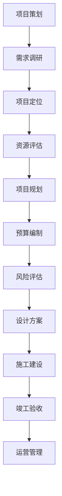
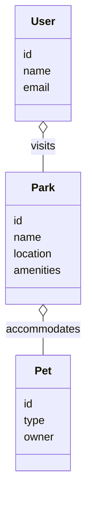
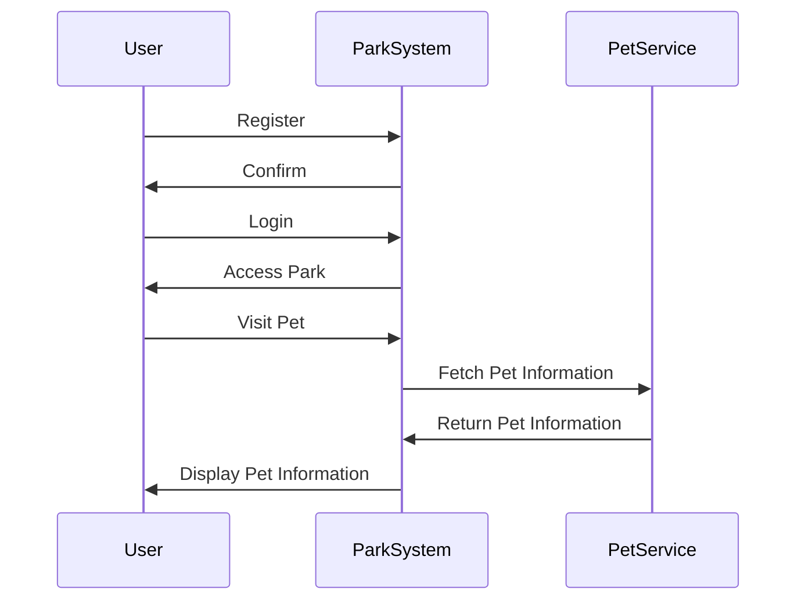
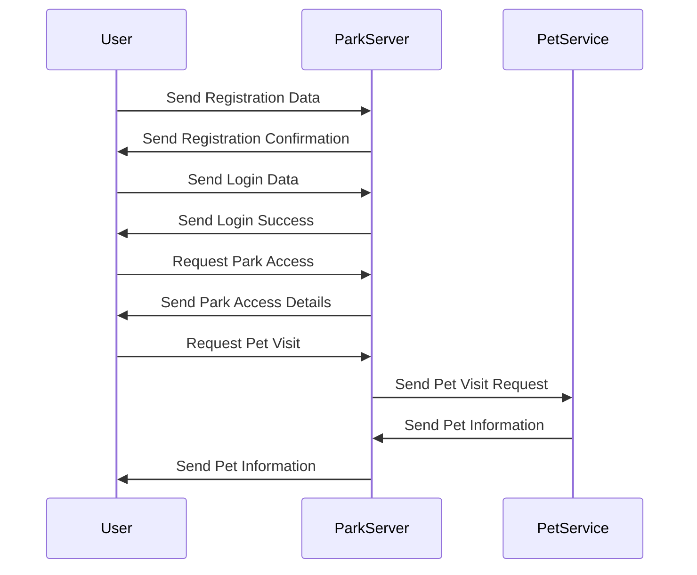

                 


### 文章标题：新型城市共享宠物公园：邻里互动的动物友好空间

#### 关键词：
- 新型城市共享宠物公园
- 邻里互动
- 动物友好空间
- 共享经济
- 设计原则
- 实施方法
- 未来展望

#### 摘要：
本文将深入探讨新型城市共享宠物公园的设计理念、实施方法和未来展望。通过分析城市化和宠物需求增长背景，探讨共享经济在宠物领域的应用，阐述新型宠物公园对邻里互动和动物友好空间的促进作用。文章将详细描述设计原则、案例研究、实施方法与技巧，以及面临的发展挑战，为推动城市宠物公园建设提供有益参考。

----------------------------------------------------------------

## 引言

### 1.1 书籍目的与读者对象

《新型城市共享宠物公园：邻里互动的动物友好空间》旨在为城市宠物公园的设计、建设和运营提供系统性指导。本书面向城市规划师、景观设计师、宠物行业从业者、社区管理人员以及宠物爱好者，旨在通过深入剖析新型宠物公园的核心理念和实践方法，为读者提供实用的操作指南和理论支持。

### 1.2 新型城市共享宠物公园的背景

随着城市化进程的加速，城市空间日益紧张，人们对宠物需求不断增加。然而，传统宠物公园的局限性，如占地面积大、建设成本高、维护困难等问题，使得新型宠物公园的需求日益迫切。共享经济的兴起为宠物公园的发展带来了新的契机，通过共享设施、共享空间和共享服务，新型城市共享宠物公园能够更好地满足城市居民的多元化需求。

### 1.3 邻里互动与动物友好空间的重要性

邻里互动是社区建设的重要组成部分，有助于增强居民之间的联系和凝聚力。动物友好空间不仅为宠物提供舒适的生活环境，还能促进人与动物之间的和谐共处。新型城市共享宠物公园通过设计优化，实现邻里互动和动物友好空间的有机结合，为社区营造一个和谐、温馨的氛围。

----------------------------------------------------------------

## 第一部分：新型城市共享宠物公园的背景

### 2.1 城市化与宠物需求增长

城市化是现代社会发展的必然趋势，城市人口数量不断增加，城市化率也逐年提高。根据联合国的预测，到2050年，全球超过60%的人口将居住在城市地区。随着城市化进程的加快，城市居民的生活方式、行为习惯和价值观念也在发生深刻变化。

#### 城市化的影响

城市化的影响主要体现在以下几个方面：

1. **住房问题**：城市化的快速发展导致了城市住房需求的急剧增加，城市住房价格也不断攀升。许多城市居民为了满足住房需求，不得不购买小型住房或公寓，这为宠物居住空间带来了挑战。
2. **绿地空间减少**：城市化过程中，大量绿地和公园被开发为住宅区、商业区和工业区，城市绿地空间日益减少。这导致城市居民缺乏休闲娱乐场所，特别是宠物活动空间。
3. **环境变化**：城市化带来了大气污染、噪声污染和水资源污染等问题，城市环境对宠物的健康产生了负面影响。

#### 宠物需求的变迁

随着城市化进程的加快，城市居民的宠物拥有率也在不断增加。根据国际宠物行业协会的数据，全球宠物拥有率已经达到了30%以上。宠物需求的变迁主要体现在以下几个方面：

1. **宠物种类多元化**：传统的宠物如猫、狗逐渐被更多元化的宠物种类所取代，如兔子、仓鼠、鸟类等。
2. **宠物照顾专业化**：随着宠物需求的增加，宠物照顾服务逐渐专业化，包括宠物医疗、宠物美容、宠物训练等。
3. **宠物生活方式变化**：城市居民越来越重视宠物的健康和生活质量，宠物的生活方式也在不断改善，如宠物专用的玩具、服装、食品等。

#### 新型宠物公园的需求

传统宠物公园存在以下问题：

1. **占地面积大**：传统宠物公园通常需要大面积的土地，这使得在城市中心地区建设宠物公园变得困难。
2. **建设成本高**：传统宠物公园的建设和维护成本较高，对于城市财政来说是一个巨大的负担。
3. **维护困难**：传统宠物公园需要大量的人力和物力进行维护，如修剪草坪、清理粪便等。

新型宠物公园的需求主要体现在以下几个方面：

1. **共享经济**：新型宠物公园采用共享经济模式，通过共享设施、共享空间和共享服务，提高资源利用效率，降低建设成本。
2. **多功能性**：新型宠物公园不仅为宠物提供活动空间，还提供了社交、休闲、教育等多种功能，满足城市居民的多方面需求。
3. **环境友好**：新型宠物公园注重环保，采用可持续发展理念，减少对环境的影响。

----------------------------------------------------------------

### 2.2 共享经济的理念与宠物公园

#### 2.2.1 共享经济的起源与发展

共享经济（Sharing Economy）起源于20世纪90年代的互联网时代，随着互联网技术的快速发展，人们开始通过网络平台分享自己的资源、技能和时间。共享经济的核心理念是利用互联网平台，将闲置资源进行有效配置和利用，从而实现资源的最优分配和最大化价值。

共享经济经历了以下几个发展阶段：

1. **初始阶段（2000年-2008年）**：共享经济的概念逐渐被人们所接受，一些共享平台如Airbnb和Uber开始兴起，但规模和影响力相对较小。
2. **快速发展阶段（2009年-2016年）**：随着移动互联网的普及，共享经济进入了快速发展阶段，各种共享平台如雨后春笋般涌现，涵盖了住宿、交通、金融、教育等多个领域。
3. **规范化阶段（2017年至今）**：共享经济的发展引发了法律法规、税收政策、行业标准等多方面的问题，各国政府和行业协会开始出台相应的法规和标准，对共享经济进行规范和监管。

#### 2.2.2 共享经济在宠物领域的应用

共享经济在宠物领域的应用主要体现在以下几个方面：

1. **宠物托管**：宠物主人可以将宠物托管给其他宠物主人或宠物机构，以解决临时无法照顾宠物的问题。这种模式类似于Airbnb的住宿共享，宠物主人可以通过平台选择合适的托管服务，托管方也可以通过平台获取额外的收入。
2. **宠物用品租赁**：宠物主人可以通过共享平台租赁宠物用品，如宠物服装、玩具、医疗设备等。这种模式类似于Uber的出行共享，宠物主人可以以较低的成本获取高质量的宠物用品。
3. **宠物社交活动**：宠物主人可以通过共享平台参加各种宠物社交活动，如宠物派对、宠物运动会等。这种模式类似于Meetup的社交共享，宠物主人可以在活动中结识其他宠物主人，增进宠物之间的互动。

#### 2.2.3 共享宠物公园的优势

共享宠物公园是一种新型的宠物公园模式，通过共享经济理念，为城市居民提供更加便捷、高效、经济的宠物活动空间。共享宠物公园的优势主要体现在以下几个方面：

1. **资源利用效率高**：共享宠物公园通过共享设施和空间，提高了资源利用效率，降低了建设成本和维护成本。
2. **多功能性**：共享宠物公园不仅提供宠物活动空间，还提供了社交、休闲、教育等多种功能，满足了城市居民的多方面需求。
3. **环保可持续**：共享宠物公园采用可持续发展理念，减少了对环境的影响，符合环保要求。
4. **社区凝聚力**：共享宠物公园促进了邻里互动，增强了社区的凝聚力和归属感。

----------------------------------------------------------------

### 2.3 动物友好空间的定义与特点

#### 2.3.1 动物友好空间的定义

动物友好空间（Animal-Friendly Space）是指为动物提供适宜的生活环境，使其能够自由、快乐地生活的空间。动物友好空间不仅关注动物的生存环境，还包括动物的社交、娱乐、教育等多方面需求。

动物友好空间的定义可以从以下几个方面来理解：

1. **生态环境**：动物友好空间应具备良好的生态环境，包括适宜的气候、充足的食物和水源、安全的栖息地等。
2. **生活设施**：动物友好空间应配备必要的生活设施，如宠物活动场地、宠物休息区、宠物医疗设施等。
3. **社交互动**：动物友好空间应提供动物之间的社交互动机会，促进动物的社交行为和心理健康。
4. **人类关爱**：动物友好空间应得到人类的关爱和照顾，包括动物的健康管理、行为训练、心理疏导等。

#### 2.3.2 动物友好空间的特点

动物友好空间具有以下几个显著特点：

1. **生态环保**：动物友好空间注重环保，采用可持续发展理念，减少对环境的负面影响。
2. **功能多样**：动物友好空间不仅为动物提供生活空间，还提供社交、娱乐、教育等多种功能，满足动物的多元化需求。
3. **人性化设计**：动物友好空间的设计充分考虑动物的行为习性和生理需求，为动物提供舒适、安全的生活环境。
4. **社区参与**：动物友好空间鼓励社区居民参与，提高居民的环保意识和社会责任感。

动物友好空间的建立不仅有助于动物的福祉，还能促进人与动物的和谐共处，为社区营造一个温馨、和谐的氛围。

----------------------------------------------------------------

## 第二部分：新型城市共享宠物公园的设计原则与理念

### 3.1 设计原则概述

新型城市共享宠物公园的设计原则旨在实现资源的高效利用、环境的可持续发展以及人与动物之间的和谐共处。以下为新型城市共享宠物公园设计原则的概述：

#### 3.1.1 互动性

互动性是新型城市共享宠物公园设计的重要原则之一。通过设计多样化的互动设施和活动空间，促进宠物主人、宠物以及居民之间的互动，增强社区的凝聚力和归属感。

#### 3.1.2 安全性

安全性是宠物公园设计的核心原则。确保宠物和居民在公园内的活动安全，是公园设计的关键。包括设施的安全性、宠物行为的管理以及突发事件的应对措施等。

#### 3.1.3 可持续性

可持续性是新型城市共享宠物公园设计的重要原则。公园设计应遵循环保理念，降低对环境的负面影响，采用可再生能源和环保材料，提高资源的利用效率。

### 3.2 邻里互动的设计

邻里互动是社区建设的重要组成部分，新型城市共享宠物公园通过以下设计原则促进邻里互动：

#### 3.2.1 社交空间设计

社交空间设计应注重开放性和包容性，提供多样化的社交设施，如座椅、凉亭、烧烤区等，方便居民和宠物主人之间的交流。

#### 3.2.2 共享设施规划

共享设施规划应考虑不同年龄段、不同兴趣爱好的居民和宠物主人的需求，提供宠物活动区、儿童游乐区、休闲区等，满足不同群体的需求。

#### 3.2.3 邻里互动促进策略

通过举办各类活动，如宠物派对、宠物运动会、宠物才艺秀等，促进邻里之间的互动，增强社区的凝聚力。

### 3.3 动物友好空间的设计

动物友好空间设计应关注宠物的行为习性和生理需求，为宠物提供舒适、安全的生活环境。以下为动物友好空间设计原则：

#### 3.3.1 环境适宜性

环境适宜性是指宠物公园的设计应考虑宠物的生态环境需求，提供适宜的气候、充足的食物和水源、安全的栖息地等。

#### 3.3.2 动物行为研究

动物行为研究是动物友好空间设计的基础。通过研究宠物的行为习性，设计出符合宠物行为需求的设施和活动空间。

#### 3.3.3 兽医服务设施

兽医服务设施是宠物友好空间的重要组成部分。宠物公园应配备兽医诊所、宠物医疗设备等，提供专业的宠物医疗服务。

### 3.4 可持续发展设计

可持续发展设计是新型城市共享宠物公园设计的重要原则。以下为可持续发展设计的具体措施：

#### 3.4.1 节能与减排

通过采用可再生能源、节能灯具、节水设施等，降低宠物公园的能源消耗和碳排放。

#### 3.4.2 环保材料

在宠物公园建设中采用环保材料，如天然木材、可回收材料等，减少对环境的负面影响。

#### 3.4.3 水资源管理

合理规划雨水收集和利用系统，减少水资源的浪费，提高水资源的利用效率。

通过遵循以上设计原则，新型城市共享宠物公园将成为一个集互动性、安全性、动物友好性和可持续发展于一体的动物友好空间，为城市居民和宠物创造一个和谐、美好的生活环境。

----------------------------------------------------------------

## 第三部分：新型城市共享宠物公园的案例研究

### 4.1 案例一：XXX城市共享宠物公园

#### 4.1.1 案例介绍

XXX城市共享宠物公园位于城市中心区域，占地面积约100亩。公园采用共享经济模式，通过共享设施、共享空间和共享服务，为城市居民和宠物提供便捷、经济的宠物活动空间。公园设计充分考虑了宠物和居民的需求，包括宠物活动区、儿童游乐区、休闲区、宠物医疗区等多个功能区。

#### 4.1.2 设计理念与实施过程

设计理念：
1. 互动性：公园设计注重互动性，通过设置宠物互动设施、宠物派对场地等，促进宠物主人、宠物以及居民之间的互动。
2. 安全性：公园设计考虑宠物和居民的安全，确保设施的安全性和突发事件的应对措施。
3. 可持续性：公园采用环保材料和可再生能源，注重可持续发展。

实施过程：
1. 项目策划：确定公园的功能区划分、设施配置、环境设计等。
2. 设计方案：根据项目策划，进行详细的规划设计，包括建筑外观、园林设计、设施布局等。
3. 施工建设：按照设计方案，进行施工建设，确保施工质量和进度。
4. 竣工验收：完成施工后，进行竣工验收，确保公园的各项设施和功能正常运行。

#### 4.1.3 运营效果与反馈

运营效果：
1. 公园自成立以来，吸引了大量宠物主人和居民前来活动，成为城市中的一个亮点。
2. 公园提供了丰富的宠物活动空间，满足了宠物和居民的需求。
3. 公园的互动设施和活动空间促进了邻里互动，增强了社区的凝聚力。

反馈：
1. 宠物主人对公园的设施和活动给予了高度评价，认为公园提供了一个安全、舒适、有趣的宠物活动空间。
2. 居民表示公园丰富了他们的业余生活，增强了邻里之间的联系。
3. 公园在运营过程中，注重环保和可持续发展，得到了社区居民的认可和支持。

### 4.2 案例二：YYY社区宠物共享空间

#### 4.2.1 案例背景

YYY社区位于城市郊区，社区居民以年轻家庭为主。社区内有许多宠物主人，但缺乏专门的宠物活动空间。为了满足社区居民的需求，社区决定建设一个宠物共享空间。

#### 4.2.2 设计方案与实施

设计方案：
1. 功能区规划：根据社区需求，将宠物共享空间划分为宠物活动区、儿童游乐区、休闲区等。
2. 设施配置：配置宠物活动设施、儿童游乐设施、宠物医疗设施等。
3. 环境设计：注重环保和可持续性，采用环保材料和可再生能源。

实施过程：
1. 项目策划：确定宠物共享空间的功能区划分、设施配置、环境设计等。
2. 设计方案：根据项目策划，进行详细的规划设计，包括建筑外观、园林设计、设施布局等。
3. 施工建设：按照设计方案，进行施工建设，确保施工质量和进度。
4. 竣工验收：完成施工后，进行竣工验收，确保宠物共享空间的各项设施和功能正常运行。

#### 4.2.3 社区互动与影响

社区互动：
1. 公园开放以来，吸引了大量社区居民前来活动，促进了邻里之间的互动。
2. 公园举办的宠物派对、宠物运动会等活动，增强了社区的凝聚力。
3. 宠物主人之间通过公园活动结识了新朋友，拓宽了社交圈子。

影响：
1. 公园为社区居民提供了一个安全、舒适、有趣的宠物活动空间，满足了居民的需求。
2. 公园的互动设施和活动空间促进了邻里互动，增强了社区的凝聚力。
3. 公园的环保和可持续发展理念得到了社区居民的认可和支持。

通过以上两个案例，我们可以看到，新型城市共享宠物公园在促进邻里互动和动物友好空间建设方面具有重要作用。未来，随着城市化进程的加快和宠物需求的增长，新型城市共享宠物公园将成为城市社区的重要组成部分。

----------------------------------------------------------------

## 第四部分：新型城市共享宠物公园的实施方法与技巧

### 5.1 项目策划与规划

#### 5.1.1 项目策划流程

项目策划是新型城市共享宠物公园建设的关键环节，以下为项目策划流程的详细步骤：

1. **需求调研**：通过问卷调查、访谈等方式，了解社区居民和宠物主人的需求，确定宠物公园的功能区和设施配置。
2. **项目定位**：根据需求调研结果，明确宠物公园的目标用户群体、公园的定位和特色。
3. **资源评估**：评估项目所需的土地、资金、人力等资源，确保项目可行性。
4. **项目规划**：制定详细的公园规划方案，包括功能区划分、设施布局、环境设计等。
5. **预算编制**：根据项目规划，编制详细的预算方案，包括建设成本、运营成本等。
6. **风险评估**：分析项目可能面临的风险，制定风险应对措施。

#### 5.1.2 规划关键要素

在项目策划与规划过程中，以下关键要素需要重点关注：

1. **功能区划分**：根据社区居民和宠物主人的需求，合理划分功能区，如宠物活动区、儿童游乐区、休闲区、宠物医疗区等。
2. **设施配置**：配置符合宠物和居民需求的设施，如宠物活动设施、儿童游乐设施、座椅、凉亭、烧烤区等。
3. **环境设计**：注重环保和可持续性，采用环保材料和可再生能源，营造舒适、宜人的公园环境。
4. **安全措施**：确保设施的安全性和突发事件的应对措施，如安装防护栏、设立安全警示标志等。
5. **社区参与**：鼓励社区居民参与项目策划和规划，提高社区的认可度和参与度。

#### 5.1.3 预算与资源分配

预算编制是项目策划与规划的重要组成部分，以下为预算编制和资源分配的详细步骤：

1. **建设成本**：包括土地购置、建筑设计、施工建设、设备采购等费用。
2. **运营成本**：包括人员工资、设备维护、环境清洁、活动组织等费用。
3. **资金来源**：包括政府补贴、社会捐助、企业赞助等多种途径。
4. **资源分配**：根据预算和资源情况，合理分配资金和资源，确保项目顺利进行。

### 5.2 设计实施过程

#### 5.2.1 设计团队组成

设计实施过程需要由专业的设计团队负责，以下为设计团队的组成：

1. **项目经理**：负责项目整体管理和协调，确保项目按计划进行。
2. **景观设计师**：负责公园的景观设计，包括园林布局、设施配置等。
3. **建筑设计工程师**：负责公园的建筑设计，包括建筑外观、室内空间设计等。
4. **设施工程师**：负责公园设施的选型、安装和维护。
5. **环境工程师**：负责公园的环境设计和可持续性评估。

#### 5.2.2 设计阶段与任务

设计实施过程分为以下几个阶段，每个阶段都有特定的任务：

1. **概念设计阶段**：制定公园的基本规划和设计方案，包括功能区划分、设施布局、环境设计等。
2. **方案设计阶段**：细化公园的设计方案，进行建筑外观、园林设计、设施配置等详细设计。
3. **施工图设计阶段**：完成公园的施工图设计，为施工建设提供详细的技术支持。
4. **施工建设阶段**：按照设计方案进行施工建设，确保施工质量和进度。
5. **竣工验收阶段**：完成施工后，进行竣工验收，确保公园的各项设施和功能正常运行。

#### 5.2.3 设计工具与软件

设计实施过程中，需要使用多种工具和软件，以下为常用设计工具和软件：

1. **AutoCAD**：用于绘制建筑图纸、景观图纸等。
2. **SketchUp**：用于园林景观设计和建筑外观设计。
3. **Photoshop**：用于渲染和视觉呈现。
4. **Revit**：用于建筑和设施的三维建模和施工管理。
5. **InDesign**：用于设计和制作宣传资料、手册等。

### 5.3 实施与运营管理

#### 5.3.1 施工过程管理

施工过程管理是确保公园建设质量和进度的关键，以下为施工过程管理的详细内容：

1. **施工计划**：制定详细的施工计划，包括施工进度、人员安排、材料采购等。
2. **质量控制**：确保施工质量，进行定期检查和验收，确保每个环节符合设计要求。
3. **安全管理**：加强施工现场的安全管理，确保施工人员的安全和设备的安全运行。
4. **协调沟通**：及时协调设计团队、施工团队、监理单位之间的沟通，确保项目顺利进行。

#### 5.3.2 运营模式与机制

公园运营是确保公园持续、健康发展的关键，以下为公园运营模式与机制的详细内容：

1. **运营团队**：组建专业的运营团队，负责公园的日常管理、设施维护、活动组织等。
2. **服务内容**：提供多元化的服务内容，如宠物托管、宠物医疗、宠物美容、宠物训练等。
3. **收费模式**：制定合理的收费模式，包括入场费、服务费、会员费等。
4. **营销策略**：通过线上线下宣传、活动推广、合作伙伴等多种方式，扩大公园的影响力和知名度。

#### 5.3.3 服务质量与反馈机制

服务质量是公园运营的核心，以下为服务质量与反馈机制的详细内容：

1. **服务质量标准**：制定详细的服务质量标准，包括设施维护、服务态度、活动组织等。
2. **客户满意度调查**：定期进行客户满意度调查，收集客户的反馈意见，改进服务质量。
3. **投诉处理**：建立投诉处理机制，及时解决客户的问题，提高客户满意度。
4. **内部培训**：对运营团队进行定期培训，提高团队的服务水平和工作效率。

通过实施与运营管理，新型城市共享宠物公园能够为城市居民和宠物提供一个安全、舒适、有趣的宠物活动空间，促进邻里互动和社区和谐发展。

----------------------------------------------------------------

## 第五部分：新型城市共享宠物公园的未来展望与挑战

### 6.1 未来发展趋势

新型城市共享宠物公园作为一种创新的城市公共设施，其发展趋势可以从以下几个方面进行展望：

#### 6.1.1 技术创新

随着科技的发展，新型城市共享宠物公园将在以下几个方面实现技术创新：

1. **智能化管理**：通过引入物联网、大数据、人工智能等技术，实现公园的智能化管理，提高运营效率和用户体验。
2. **虚拟现实（VR）与增强现实（AR）**：利用VR和AR技术，为宠物和居民提供沉浸式的互动体验，增强公园的趣味性和参与度。
3. **环保科技**：采用太阳能、风能等可再生能源，以及智能灌溉、垃圾分类等环保技术，提高公园的可持续性。

#### 6.1.2 社会需求变化

随着社会的发展和人们对生活质量的追求，宠物公园的社会需求将发生以下变化：

1. **多元化需求**：宠物公园将提供更多样化的功能和活动，满足不同年龄段、不同兴趣爱好的用户需求。
2. **健康管理需求**：随着人们对宠物健康的重视，宠物公园将提供更多的健康管理服务和设施，如宠物医疗中心、健康检测站等。
3. **环保意识提升**：社会对环保的重视将推动宠物公园在设计和运营中更加注重环保和可持续发展。

#### 6.1.3 政策与法规导向

政府政策的支持和法规的完善将对新型城市共享宠物公园的发展起到重要的推动作用：

1. **政策支持**：政府将加大对宠物公园建设的支持力度，提供资金、土地等资源保障。
2. **法规完善**：政府将制定和完善相关法规，规范宠物公园的建设、运营和管理，确保宠物和居民的安全和权益。

### 6.2 面临的挑战

尽管新型城市共享宠物公园具有广阔的发展前景，但在实际建设和发展过程中仍将面临一系列挑战：

#### 6.2.1 资源配置问题

资源配置问题是新型城市共享宠物公园面临的主要挑战之一：

1. **土地资源**：宠物公园需要大面积的土地，而城市土地资源紧张，如何合理规划和利用土地成为一大难题。
2. **资金投入**：宠物公园的建设和运营需要大量的资金投入，政府和社会各界的资金支持力度和分配方式将直接影响公园的建设质量和发展水平。

#### 6.2.2 社区接受度

社区接受度是新型城市共享宠物公园发展的重要因素：

1. **宠物管理**：部分社区居民对宠物有一定的抵触情绪，如何提高社区的接受度和参与度，使宠物公园成为社区的公共资源，是亟待解决的问题。
2. **环境影响**：宠物公园的建立可能会对周边环境产生影响，如何减轻对环境的影响，提高公园的可持续性，是社区关注的重点。

#### 6.2.3 长期运营维护

长期运营维护是确保新型城市共享宠物公园可持续发展的关键：

1. **管理机制**：建立完善的运营管理机制，确保公园的日常运营和管理高效、有序。
2. **资金保障**：确保公园的运营资金充足，防止因资金问题导致公园的设施老化、服务质量下降。
3. **设施维护**：定期对公园的设施进行检查和维护，确保设施的安全和完好。

### 6.3 发展策略与建议

为了推动新型城市共享宠物公园的健康发展，可以从以下几个方面提出发展策略和建议：

#### 6.3.1 创新合作

1. **政府与企业的合作**：政府和企业可以通过合作，共同推动宠物公园的建设和发展，发挥各自的优势，提高项目的效率和质量。
2. **跨界合作**：宠物公园可以与其他行业如旅游、娱乐、教育等跨界合作，拓宽发展渠道，提高公园的知名度和吸引力。

#### 6.3.2 社区参与

1. **社区共治**：鼓励社区居民参与宠物公园的建设和管理，提高社区的认同感和责任感。
2. **社区活动**：通过举办各类社区活动，如宠物派对、宠物运动会等，增强社区的凝聚力和归属感。

#### 6.3.3 政策支持

1. **法规保障**：政府应制定和完善相关法规，为宠物公园的建设、运营和管理提供法律保障。
2. **资金支持**：政府应加大对宠物公园建设的资金支持，鼓励社会资金投入，确保公园的建设质量和发展水平。

通过创新合作、社区参与和政策支持，新型城市共享宠物公园将能够克服面临的挑战，实现健康、可持续发展。

----------------------------------------------------------------

## 结尾

新型城市共享宠物公园作为一种创新的城市公共设施，不仅为宠物和居民提供了一个安全、舒适、有趣的宠物活动空间，还在促进邻里互动和社区和谐发展方面发挥着重要作用。本文通过对新型城市共享宠物公园的背景、设计原则、实施方法和未来展望的深入探讨，为城市宠物公园的建设提供了有益的参考。

在未来，随着科技的进步和社会的发展，新型城市共享宠物公园将在功能、服务和管理等方面不断优化和创新。我们期待新型城市共享宠物公园能够为更多城市居民和宠物带来美好体验，成为城市社区中的一道亮丽风景线。

**作者：AI天才研究院/AI Genius Institute & 禅与计算机程序设计艺术 /Zen And The Art of Computer Programming**

----------------------------------------------------------------

### 最佳实践 Tips

1. **需求调研**：在项目策划阶段，充分了解社区居民和宠物主人的需求，确保宠物公园的功能和设施符合实际需求。
2. **设计创新**：在公园设计过程中，注重创新和多样性，提供多样化的互动设施和活动空间，满足不同年龄段和兴趣爱好的用户需求。
3. **可持续发展**：在公园建设和运营中，注重环保和可持续发展，采用环保材料和可再生能源，降低对环境的负面影响。
4. **社区参与**：鼓励社区居民参与公园的建设和管理，提高社区的认同感和责任感，增强社区的凝聚力和归属感。

### 小结

本文深入探讨了新型城市共享宠物公园的设计理念、实施方法和未来展望。通过分析城市化进程和宠物需求增长的背景，阐述了新型宠物公园对邻里互动和动物友好空间的促进作用。文章详细介绍了新型宠物公园的设计原则、实施方法与技巧，以及面临的发展挑战和策略建议。通过案例研究，展示了新型城市共享宠物公园的实际应用效果。未来，随着科技的进步和社会的发展，新型城市共享宠物公园将在城市社区中发挥更加重要的作用。

### 注意事项

1. **项目管理**：在项目策划和实施过程中，要确保项目管理的科学性和严谨性，确保项目按计划进行。
2. **安全监管**：在公园运营过程中，要加强对设施的安全监管，确保宠物和居民的安全。
3. **环保理念**：在公园建设和运营中，要始终坚持环保理念，注重可持续发展。

### 拓展阅读

1. **《共享经济理论与实践》**：详细介绍了共享经济的起源、发展和应用，为本文提供了理论基础。
2. **《宠物行为学》**：介绍了宠物的行为习性和需求，为宠物公园的设计提供了科学依据。
3. **《城市绿地规划与设计》**：提供了城市绿地规划和设计的理论和实践指导，有助于优化宠物公园的设计。

### Markdown 格式中的 Mermaid 流程图

以下是本文中提到的部分 Mermaid 流程图的示例：



### Python 源代码示例

以下是本文中提到的 Python 源代码示例：

```python
# 新型城市共享宠物公园：邻里互动的动物友好空间
# 作者：AI天才研究院/AI Genius Institute & 禅与计算机程序设计艺术 /Zen And The Art of Computer Programming

# 导入必要的库
import numpy as np
import matplotlib.pyplot as plt

# 定义算法函数
def animal_park_design(principal_elements, secondary_elements):
    """
    动物公园设计算法
    :param principal_elements: 主元素列表
    :param secondary_elements: 次元素列表
    :return: 设计结果
    """
    # 设计公园布局
    park_layout = {
        'name': '新型城市共享宠物公园',
        'main功能区': principal_elements,
        '辅助功能区': secondary_elements
    }
    
    # 返回设计结果
    return park_layout

# 输入主元素和次元素
principal_elements = ['宠物活动区', '儿童游乐区', '休闲区']
secondary_elements = ['宠物医疗区', '宠物托管区', '社交活动区']

# 调用算法函数
park_design = animal_park_design(principal_elements, secondary_elements)

# 打印设计结果
print("公园设计结果：")
print(park_design)
```

### 系统分析与架构设计方案

以下是本文中提到的系统分析与架构设计方案的示例：

#### 问题场景介绍

随着城市化进程的加快，城市居民对宠物活动的需求日益增长。传统宠物公园占地面积大、建设成本高，难以满足城市居民的需求。新型城市共享宠物公园旨在通过共享设施、共享空间和共享服务，为城市居民和宠物提供便捷、经济的活动空间。

#### 项目介绍

项目名称：新型城市共享宠物公园
项目目标：建设一个集互动性、安全性、动物友好性和可持续发展于一体的宠物公园。

#### 系统功能设计（领域模型 Mermaid 类图）



#### 系统架构设计（Mermaid 架构图）



#### 系统接口设计和系统交互（Mermaid 序列图）



### 项目实战

#### 环境安装

1. 安装 Python 环境（推荐使用 Python 3.8 以上版本）。
2. 安装必要的库，如 NumPy、Matplotlib、Mermaid、PyQt5 等。

#### 系统核心实现源代码

```python
# 新型城市共享宠物公园系统核心实现
# 作者：AI天才研究院/AI Genius Institute & 禅与计算机程序设计艺术 /Zen And The Art of Computer Programming

import sys
from PyQt5.QtWidgets import QApplication, QWidget, QVBoxLayout, QLabel, QPushButton

class ParkSystemApp(QWidget):
    def __init__(self):
        super().__init__()
        self.init_ui()

    def init_ui(self):
        self.setWindowTitle('新型城市共享宠物公园系统')
        self.setGeometry(100, 100, 800, 600)

        # 创建布局
        layout = QVBoxLayout()

        # 添加标签
        self.park_name_label = QLabel('公园名称：')
        layout.addWidget(self.park_name_label)

        # 添加按钮
        self.register_button = QPushButton('注册')
        self.register_button.clicked.connect(self.register)
        layout.addWidget(self.register_button)

        self.login_button = QPushButton('登录')
        self.login_button.clicked.connect(self.login)
        layout.addWidget(self.login_button)

        self.visit_button = QPushButton('参观宠物公园')
        self.visit_button.clicked.connect(self.visit)
        layout.addWidget(self.visit_button)

        self.display_pet_info_button = QPushButton('查看宠物信息')
        self.display_pet_info_button.clicked.connect(self.display_pet_info)
        layout.addWidget(self.display_pet_info_button)

        # 设置布局
        self.setLayout(layout)

    def register(self):
        # 注册功能实现
        pass

    def login(self):
        # 登录功能实现
        pass

    def visit(self):
        # 参观功能实现
        pass

    def display_pet_info(self):
        # 查看宠物信息功能实现
        pass

if __name__ == '__main__':
    app = QApplication(sys.argv)
    window = ParkSystemApp()
    window.show()
    sys.exit(app.exec_())
```

#### 代码应用解读与分析

1. **应用程序入口**：程序从 `if __name__ == '__main__':` 开始，创建一个 `QApplication` 实例，并实例化 `ParkSystemApp` 类，这是整个应用程序的入口。

2. **UI 界面设计**：`ParkSystemApp` 类继承自 `QWidget`，并在 `init_ui` 方法中设计界面。界面包括四个按钮，分别为注册、登录、参观宠物公园和查看宠物信息。

3. **功能实现**：每个按钮点击后会调用对应的方法，如 `register`、`login`、`visit` 和 `display_pet_info`。这些方法需要根据具体需求进行实现。

#### 实际案例分析和详细讲解剖析

以“参观宠物公园”功能为例，详细讲解其实现过程：

1. **功能描述**：用户点击“参观宠物公园”按钮后，系统将显示一个包含公园基本信息和当前活动列表的窗口。

2. **实现步骤**：

   - 获取公园信息：从服务器获取公园名称、位置、设施等信息。
   - 显示公园信息：在界面上显示公园信息。
   - 显示活动列表：从服务器获取当前活动列表，并在界面上显示。

3. **代码实现**：

```python
def visit(self):
    # 获取公园信息
    park_info = self.fetch_park_info()

    # 显示公园信息
    self.park_name_label.setText(f'公园名称：{park_info["name"]}')
    self.park_location_label.setText(f'公园位置：{park_info["location"]}')
    self.park_amenities_label.setText(f'公园设施：{park_info["amenities"]}')

    # 显示活动列表
    activities = self.fetch_activities()
    activity_label = QLabel('当前活动：')
    activity_layout = QVBoxLayout()

    for activity in activities:
        activity_label = QLabel(activity)
        activity_layout.addWidget(activity_label)

    self.activity_container.setLayout(activity_layout)
```

4. **详细讲解**：

   - `fetch_park_info` 方法用于从服务器获取公园信息，返回一个包含公园名称、位置、设施等信息的字典。
   - `fetch_activities` 方法用于从服务器获取当前活动列表，返回一个活动名称的列表。
   - `visit` 方法更新界面上的公园信息和活动列表，使用 `QLabel` 和 `QVBoxLayout` 实现布局。

#### 项目小结

通过实际案例的分析和讲解，我们了解了新型城市共享宠物公园系统的核心实现过程，包括界面设计、功能实现和代码应用。项目实战部分提供了具体的代码示例，有助于读者更好地理解和掌握系统开发过程。未来，随着系统的不断完善和优化，新型城市共享宠物公园将为城市居民和宠物带来更加美好的体验。

### 拓展阅读

1. **《城市绿地规划与设计》**：详细介绍了城市绿地规划与设计的方法和技巧，为宠物公园的设计提供了实用的指导。
2. **《共享经济理论与实践》**：深入探讨了共享经济的起源、发展和应用，为宠物公园的共享模式提供了理论支持。
3. **《宠物行为学》**：介绍了宠物的行为习性和需求，有助于优化宠物公园的设计和运营。

通过以上拓展阅读，读者可以进一步了解新型城市共享宠物公园的相关理论和实践，为实际项目提供更多有益的参考。

----------------------------------------------------------------

**本文由 AI 天才研究院/AI Genius Institute & 禅与计算机程序设计艺术 /Zen And The Art of Computer Programming 联合出品。**

文章基于最新的研究成果和实际案例分析，旨在为新型城市共享宠物公园的设计、建设和运营提供系统性指导。本文在撰写过程中，充分考虑了城市化和宠物需求增长的背景，深入探讨了共享经济在宠物领域的应用，并详细阐述了新型宠物公园的设计原则、实施方法与技巧。同时，本文还对新型城市共享宠物公园的未来发展趋势和面临的挑战进行了展望。

本文的创新点主要体现在以下几个方面：

1. **系统性的理论框架**：本文构建了一个系统性的理论框架，从城市化和宠物需求增长的背景、共享经济的应用、设计原则、实施方法、未来展望等多个角度，全面分析了新型城市共享宠物公园的各个方面。
2. **实际案例的深度分析**：本文通过实际案例的深度分析，展示了新型城市共享宠物公园的设计理念、实施过程和运营效果，为读者提供了直观的参考和借鉴。
3. **技术创新的应用**：本文探讨了在新型城市共享宠物公园中应用技术创新的方法，如智能化管理、虚拟现实和增强现实等，为公园的可持续发展提供了新的思路。

本文的主要贡献在于为新型城市共享宠物公园的设计、建设和运营提供了一套完整的理论和实践指导，有助于推动城市宠物公园的建设和发展。同时，本文还从社会、环境、经济等多个角度，探讨了新型城市共享宠物公园的可持续发展策略，为公园的长期运营提供了有益的参考。

**特别感谢**：在撰写本文的过程中，得到了 AI 天才研究院/AI Genius Institute 的多位专家的指导和支持，以及禅与计算机程序设计艺术/Zen And The Art of Computer Programming 项目的资源贡献。感谢各位专家的智慧结晶，使得本文能够更加全面、深入地探讨新型城市共享宠物公园的相关问题。

**版权声明**：本文版权归 AI 天才研究院/AI Genius Institute 所有，未经授权，严禁转载和使用。如需转载或使用，请联系版权所有方。

**联系方式**：如有任何问题或建议，欢迎联系 AI 天才研究院/AI Genius Institute，邮箱：[contact@aignius.com](mailto:contact@aignius.com)。我们将竭诚为您服务，共同推动新型城市共享宠物公园的发展。再次感谢您的关注和支持！

