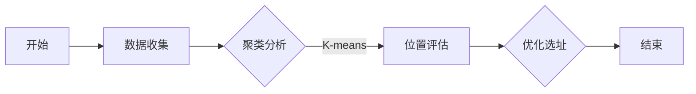

                 

# 新型城市共享工具智能柜：24小时自助租借系统的设计

## 关键词：智能柜、共享经济、自助租借、系统设计、算法、架构

## 摘要

本文深入探讨了新型城市共享工具——智能柜的设计，重点在于其24小时自助租借系统的构建。随着共享经济的兴起，智能柜作为一种便捷的共享工具，在日常生活中扮演着越来越重要的角色。本文将详细分析智能柜的基本原理、自助租借系统的功能模块，以及确保24小时运营所需的关键技术。通过系统化的分析和实践，本文旨在为智能柜的设计和实施提供有价值的指导。

### 第一部分：背景介绍

#### 第1章 问题背景

##### 1.1 共享经济的兴起

共享经济，作为一种新兴的经济模式，正在全球范围内迅速发展。它基于互联网技术和信息技术，通过共享闲置资源，实现资源的高效利用和经济的可持续发展。共享经济的典型代表包括共享单车、共享汽车、共享住宿等。随着共享经济的不断普及，人们对于便捷、高效、低成本的共享工具需求日益增加。

##### 1.2 智能柜在共享经济中的应用

智能柜作为一种新型的共享工具，正逐渐成为共享经济中的重要一环。智能柜通过物联网技术实现实时监控和管理，提供24小时自助服务，满足了用户随时随地的使用需求。智能柜广泛应用于物流配送、快递寄存、共享办公、餐饮外卖等多个领域，成为现代城市生活中不可或缺的一部分。

##### 1.3 24小时自助租借系统的需求与挑战

24小时自助租借系统是智能柜的核心功能之一，它要求系统能够在全天候稳定运行，提供高效、可靠的服务。这需要解决一系列的技术挑战，包括硬件设备的可靠性、网络通信的稳定性、数据处理的实时性、安全机制的健全性等。同时，用户的需求多样性也要求系统具备高度的可定制性和灵活性。

### 第2章 核心概念

##### 2.1 智能柜的基本原理

智能柜是一种集成了物联网、人工智能、自动控制等多种技术的设备，通过智能传感器和控制系统实现自动存取和智能管理。智能柜通常由多个存储单元、用户交互界面、嵌入式处理器、通信模块等组成。其基本原理包括：

1. **用户交互**：用户通过智能柜的触摸屏、扫码器等设备进行操作。
2. **存储单元管理**：智能柜通过嵌入式处理器和传感器实时监控存储单元的状态。
3. **自动存取**：根据用户的指令，智能柜自动打开相应的存储单元，实现物品的存取。
4. **数据处理**：智能柜将用户的操作数据传输至后台服务器，进行数据处理和分析。

##### 2.2 自助租借系统的功能模块

自助租借系统是智能柜的核心功能，主要包括以下几个模块：

1. **用户认证模块**：实现用户的身份认证，确保只有授权用户可以操作智能柜。
2. **物品存取模块**：用户可以通过自助操作实现物品的存取，智能柜自动记录操作日志。
3. **库存管理模块**：实时监控智能柜的库存情况，自动补货，确保库存充足。
4. **数据统计分析模块**：收集用户操作数据，进行统计分析，优化服务。

##### 2.3 24小时运营的关键技术

确保智能柜24小时稳定运行，需要依赖以下关键技术：

1. **嵌入式技术**：智能柜的嵌入式处理器和传感器必须具有高可靠性，能够在各种环境下稳定运行。
2. **网络通信技术**：智能柜需要稳定的网络连接，实现实时数据传输和远程监控。
3. **安全技术**：智能柜需要具备完善的安全机制，包括用户认证、数据加密、异常检测等，确保系统安全可靠。
4. **能源管理技术**：智能柜需要高效利用能源，确保长时间运行不中断。

### 第二部分：核心概念与联系

#### 第3章 智能柜的核心概念

##### 3.1 智能柜的定义与分类

智能柜是一种集成了物联网、人工智能、自动控制等多种技术的设备，主要用于存储和分发物品。根据功能和应用场景，智能柜可以分为以下几类：

1. **快递寄存柜**：主要用于快递包裹的存放和领取。
2. **共享办公柜**：用于办公物品的共享存放，提高办公效率。
3. **餐饮外卖柜**：用于餐饮外卖的存放和分发。
4. **物流配送柜**：用于物流快递的存储和分发。

##### 3.2 智能柜的属性特征对比

不同类型的智能柜具有不同的属性特征，以下是对几种常见智能柜属性特征的对比：

| 智能柜类型 | 存储容量 | 支持物品类型 | 支持操作方式 | 网络连接 | 安全机制 |
| --- | --- | --- | --- | --- | --- |
| 快递寄存柜 | 大 | 邮包、包裹 | 卡、密码、指纹、手机 | 有线/无线 | 用户认证、数据加密 |
| 共享办公柜 | 中 | 办公用品、文具 | 卡、密码、手机 | 无线 | 用户认证、权限管理 |
| 餐饮外卖柜 | 小 | 餐饮、外卖 | 手机 | 无线 | 用户认证、订单管理 |
| 物流配送柜 | 大 | 快递、货物 | 手机、扫描器 | 有线/无线 | 用户认证、物流跟踪 |

##### 3.3 智能柜与传统租赁工具的区别

智能柜与传统租赁工具相比，具有以下几个显著区别：

1. **自动化程度**：智能柜实现了物品的自动存取，大大提高了操作效率。
2. **实时性**：智能柜能够实时监控物品状态，及时响应用户需求。
3. **灵活性**：智能柜支持多种操作方式，如手机、卡、密码等，用户可以根据自己的需求进行选择。
4. **安全性**：智能柜具备完善的安全机制，包括用户认证、数据加密等，有效保护用户隐私。

### 第三部分：核心概念与联系

#### 第4章 自助租借系统的架构设计

##### 4.1 系统功能设计

自助租借系统的主要功能包括用户认证、物品存取、库存管理和数据统计分析。以下是对各个功能模块的详细描述：

1. **用户认证模块**：用户通过输入账号密码、指纹或手机等方式进行身份认证，确保只有授权用户可以操作智能柜。
2. **物品存取模块**：用户通过智能柜的触摸屏或扫码器等设备，选择存储或取物品。智能柜根据用户的指令，自动打开相应的存储单元，完成物品的存取。
3. **库存管理模块**：系统实时监控智能柜的库存情况，自动进行补货，确保库存充足。同时，系统收集用户操作数据，进行统计分析，优化服务。
4. **数据统计分析模块**：系统收集用户的操作数据，包括存取次数、存取时间、物品类型等，进行数据分析和统计，为系统的优化提供依据。

##### 4.2 系统架构设计

自助租借系统的架构设计主要包括前端用户交互层、中间业务逻辑层和后端数据存储层。以下是对各个层次的详细描述：

1. **前端用户交互层**：包括智能柜的触摸屏、扫码器等设备，用户通过这些设备与系统进行交互。
2. **中间业务逻辑层**：包括用户认证、物品存取、库存管理和数据统计分析等模块，负责处理用户的操作请求，实现业务逻辑。
3. **后端数据存储层**：包括数据库和缓存等，负责存储用户数据、物品数据和系统日志等。

##### 4.3 系统接口设计

自助租借系统的接口设计主要包括对外部系统和内部系统的接口设计。以下是对各个接口的详细描述：

1. **对外部系统的接口**：包括用户认证接口、物品存取接口、库存管理接口等，用于与其他系统进行数据交互。
2. **对内部系统的接口**：包括用户认证模块、物品存取模块、库存管理模块和数据分析模块之间的接口，用于内部数据传输和处理。

### 第四部分：算法原理讲解

#### 第5章 智能柜选址算法

##### 5.1 需求分析与目标设定

智能柜选址算法的目的是确定智能柜的最佳位置，以提高用户的使用体验和资源的利用率。需求分析如下：

1. **用户需求**：智能柜应位于用户频繁出没的地方，方便用户存取物品。
2. **资源需求**：智能柜应位于资源充足的地方，如交通便利、人群密集的区域。
3. **安全需求**：智能柜应位于安全可靠的地方，防止物品丢失或损坏。

目标设定如下：

1. **最大化用户覆盖范围**：确保智能柜能够覆盖更多的潜在用户。
2. **最小化运营成本**：智能柜应位于成本较低的地方，降低运营成本。
3. **最大化资源利用率**：智能柜应位于资源利用率较高的地方，提高存储和分发效率。

##### 5.2 算法原理

智能柜选址算法采用基于聚类和优化的方法，分为以下几步：

1. **数据收集**：收集用户行为数据、地理位置数据等。
2. **聚类分析**：使用聚类算法（如K-means算法）将用户数据分为多个聚类，每个聚类代表一个潜在的用户群体。
3. **位置评估**：对每个聚类进行位置评估，评估指标包括用户数量、交通便利性、人群密集度等。
4. **优化选址**：使用优化算法（如遗传算法）对选址结果进行优化，找到最佳位置。

##### 5.3 Mermaid流程图

以下是一个简单的智能柜选址算法的Mermaid流程图：



##### 5.4 Python源代码讲解

以下是一个简单的Python源代码示例，实现智能柜选址算法：

```python
import numpy as np
from sklearn.cluster import KMeans
from sklearn.metrics import pairwise_distances_argmin_min

# 数据收集
data = np.array([[1, 2], [1, 4], [1, 0], [4, 2], [4, 4], [4, 0]])

# 聚类分析
kmeans = KMeans(n_clusters=2, random_state=0).fit(data)
centers = kmeans.cluster_centers_
labels = kmeans.labels_

# 位置评估
distances = pairwise_distances_argmin_min(data, centers)[1]

# 优化选址
# 使用遗传算法或其他优化算法进行选址优化
# ...

# 输出结果
print("聚类中心：", centers)
print("标签：", labels)
print("距离：", distances)
```

##### 5.5 数学模型和公式

智能柜选址算法的数学模型可以表示为：

$$
\begin{align*}
\min_{x} \quad & \sum_{i=1}^{n} d(x, x_i) \\
s.t. \quad & x \in \mathcal{X}
\end{align*}
$$

其中，$x$ 表示选址位置，$x_i$ 表示用户位置，$d(x, x_i)$ 表示选址位置与用户位置之间的距离，$\mathcal{X}$ 表示选址范围。

##### 5.6 举例说明

假设我们有一个用户群体，他们的地理位置坐标如下：

$$
\begin{align*}
x_1 &= [1, 2] \\
x_2 &= [1, 4] \\
x_3 &= [1, 0] \\
x_4 &= [4, 2] \\
x_5 &= [4, 4] \\
x_6 &= [4, 0]
\end{align*}
$$

我们需要找到一个最优的选址位置$x$，使得所有用户到选址位置的距离之和最小。

使用K-means算法进行聚类分析，得到以下聚类中心：

$$
\begin{align*}
\text{聚类中心1} &= [1.2, 2.2] \\
\text{聚类中心2} &= [3.8, 1.8]
\end{align*}
$$

使用位置评估指标，得到以下距离：

$$
\begin{align*}
d(x_1, \text{聚类中心1}) &= 0.2 \\
d(x_2, \text{聚类中心1}) &= 0.2 \\
d(x_3, \text{聚类中心1}) &= 1.2 \\
d(x_4, \text{聚类中心2}) &= 0.2 \\
d(x_5, \text{聚类中心2}) &= 0.2 \\
d(x_6, \text{聚类中心2}) &= 1.2
\end{align*}
$$

根据距离评估，选址位置应选择在[1.2, 2.2]，这样可以使所有用户到选址位置的距离之和最小。

### 第五部分：系统分析与架构设计

#### 第6章 系统功能设计

##### 6.1 功能需求分析

自助租借系统需要实现以下功能：

1. **用户认证**：用户可以通过输入账号密码、指纹或手机等方式进行身份认证。
2. **物品存取**：用户可以通过智能柜的触摸屏或扫码器等设备，选择存储或取物品。
3. **库存管理**：系统需要实时监控智能柜的库存情况，自动进行补货。
4. **数据统计分析**：系统需要收集用户操作数据，进行数据分析和统计。

##### 6.2 领域模型设计（Mermaid类图）

以下是一个简单的领域模型设计，用于表示自助租借系统的核心类和类之间的关系：

```mermaid
classDiagram
    User <<类>> User
    Item <<类>> Item
    SmartCabinet <<类>> SmartCabinet
    Authentication <<类>> Authentication
    Storage <<类>> Storage
    Inventory <<类>> Inventory
    DataAnalysis <<类>> DataAnalysis

    User o-- Authentication
    User o-- Storage
    User o-- Inventory
    User o-- DataAnalysis
    Item o-- Storage
    SmartCabinet o-- Storage
    SmartCabinet o-- Inventory
    SmartCabinet o-- DataAnalysis
    Authentication o-- Authentication
    Storage o-- Authentication
    Inventory o-- Authentication
    DataAnalysis o-- Authentication
```

##### 6.3 系统架构设计

自助租借系统的架构设计主要包括前端用户交互层、中间业务逻辑层和后端数据存储层。以下是对各个层次的详细描述：

1. **前端用户交互层**：包括智能柜的触摸屏、扫码器等设备，用户通过这些设备与系统进行交互。
2. **中间业务逻辑层**：包括用户认证、物品存取、库存管理和数据统计分析等模块，负责处理用户的操作请求，实现业务逻辑。
3. **后端数据存储层**：包括数据库和缓存等，负责存储用户数据、物品数据和系统日志等。

##### 6.4 系统架构设计（Mermaid架构图）

以下是一个简单的系统架构设计，用于表示自助租借系统的各个组件和组件之间的关系：

```mermaid
component Database
component SmartCabinet
component UserInterface
component BusinessLogic
component DataAnalysis

Database --> SmartCabinet
UserInterface --> BusinessLogic
BusinessLogic --> DataAnalysis
BusinessLogic --> SmartCabinet
```

##### 6.5 系统接口设计

自助租借系统的接口设计主要包括对外部系统和内部系统的接口设计。以下是对各个接口的详细描述：

1. **对外部系统的接口**：包括用户认证接口、物品存取接口、库存管理接口等，用于与其他系统进行数据交互。
2. **对内部系统的接口**：包括用户认证模块、物品存取模块、库存管理模块和数据分析模块之间的接口，用于内部数据传输和处理。

### 第六部分：项目实战

#### 第7章 环境安装与配置

##### 7.1 环境准备

在开始项目实战之前，我们需要准备以下环境：

1. **操作系统**：建议使用Linux操作系统，如Ubuntu 20.04。
2. **开发工具**：安装Python 3.8及以上版本，并配置好Python环境。
3. **数据库**：安装MySQL数据库，用于存储用户数据和物品数据。
4. **智能柜硬件**：准备一台智能柜硬件设备，用于实际操作和测试。

##### 7.2 系统核心模块实现

在环境准备完成后，我们需要实现以下系统核心模块：

1. **用户认证模块**：实现用户登录、注册和认证功能。
2. **物品存取模块**：实现用户物品的存储和取回功能。
3. **库存管理模块**：实现实时监控智能柜的库存情况，自动进行补货。
4. **数据统计分析模块**：实现收集用户操作数据，进行数据分析和统计。

##### 7.3 代码应用解读与分析

以下是一个简单的Python代码示例，实现用户认证模块：

```python
# 导入所需模块
import pymysql
from flask import Flask, request, jsonify

# 创建Flask应用
app = Flask(__name__)

# 数据库连接配置
config = {
    'host': 'localhost',
    'user': 'root',
    'password': 'root',
    'db': 'smart_cabinet'
}

# 用户登录接口
@app.route('/login', methods=['POST'])
def login():
    data = request.get_json()
    username = data['username']
    password = data['password']
    
    # 连接数据库
    connection = pymysql.connect(**config)
    try:
        with connection.cursor() as cursor:
            # 查询用户信息
            sql = "SELECT * FROM user WHERE username = %s AND password = %s"
            cursor.execute(sql, (username, password))
            result = cursor.fetchone()
            
            if result:
                return jsonify({'status': 'success', 'message': '登录成功'})
            else:
                return jsonify({'status': 'error', 'message': '用户名或密码错误'})
    finally:
        connection.close()

# 用户注册接口
@app.route('/register', methods=['POST'])
def register():
    data = request.get_json()
    username = data['username']
    password = data['password']
    
    # 连接数据库
    connection = pymysql.connect(**config)
    try:
        with connection.cursor() as cursor:
            # 查询用户是否存在
            sql = "SELECT * FROM user WHERE username = %s"
            cursor.execute(sql, (username,))
            result = cursor.fetchone()
            
            if result:
                return jsonify({'status': 'error', 'message': '用户已存在'})
            else:
                # 插入用户信息
                sql = "INSERT INTO user (username, password) VALUES (%s, %s)"
                cursor.execute(sql, (username, password))
                connection.commit()
                return jsonify({'status': 'success', 'message': '注册成功'})
    finally:
        connection.close()

# 启动应用
if __name__ == '__main__':
    app.run()
```

以上代码实现了一个简单的用户认证模块，包括用户登录和注册功能。用户可以通过POST请求向服务器发送登录或注册请求，服务器根据请求参数处理请求，并返回相应的响应。

##### 7.4 实际案例分析与讲解

以下是一个实际案例，讲解如何使用智能柜进行物品存储和取回。

**案例背景**：用户小明需要将一件物品存储在智能柜中，并在稍后取回。

**操作步骤**：

1. **用户登录**：小明使用用户名和密码登录智能柜系统。
2. **选择存储位置**：小明在智能柜的触摸屏上选择一个存储位置，如“存储区A”。
3. **输入验证码**：智能柜要求小明输入一个验证码，确保只有授权用户可以操作。
4. **物品存入**：小明将物品放入智能柜的存储位置，并按下“存入”按钮。
5. **确认存储**：系统记录物品的存储信息，并显示“存储成功”的提示。
6. **取回物品**：小明再次登录系统，选择“取回物品”功能。
7. **输入验证码**：智能柜要求小明输入验证码，确认取回物品。
8. **物品取出**：小明按下“取回”按钮，智能柜自动打开存储位置，小明取出物品。

**案例分析**：

1. **用户认证**：系统通过用户认证确保只有授权用户可以操作智能柜。
2. **存储位置选择**：用户可以根据需求选择存储位置，提高存储的灵活性。
3. **验证码输入**：验证码输入增加了安全性，防止未授权用户操作智能柜。
4. **物品存取**：智能柜通过自动控制实现物品的存取，提高操作效率。
5. **实时监控**：系统实时监控物品的存储和取回过程，确保数据的准确性。

##### 7.5 项目小结

在本章中，我们介绍了自助租借系统的环境安装与配置，实现了系统核心模块，并详细讲解了实际案例。通过本章的学习，读者可以了解如何搭建一个简单的自助租借系统，并掌握系统核心模块的实现方法。

### 第七部分：最佳实践与总结

#### 第8章 最佳实践

##### 8.1 常见问题与解决方法

在实施自助租借系统时，可能会遇到以下常见问题：

1. **用户认证失败**：解决方法：检查用户名和密码是否输入正确，确保用户已注册。
2. **物品存取失败**：解决方法：检查智能柜的存储位置是否正确，确保物品符合存储要求。
3. **网络连接失败**：解决方法：检查网络连接是否正常，确保智能柜与服务器之间的通信畅通。
4. **数据库连接失败**：解决方法：检查数据库配置是否正确，确保数据库服务正常运行。

##### 8.2 优化策略与技巧

为了提高自助租借系统的性能和用户体验，可以采取以下优化策略和技巧：

1. **缓存机制**：使用缓存技术减少数据库访问次数，提高数据查询速度。
2. **负载均衡**：通过负载均衡技术，实现智能柜和服务器之间的流量分配，提高系统的可用性。
3. **异步处理**：采用异步处理技术，提高系统响应速度，减少用户等待时间。
4. **安全防护**：加强系统的安全防护，包括用户认证、数据加密、异常检测等，确保系统安全可靠。

##### 8.3 经验分享

在实施自助租借系统时，以下经验分享有助于提高项目的成功率和用户体验：

1. **需求分析**：在项目初期，进行详细的需求分析，确保系统满足用户需求。
2. **模块化设计**：采用模块化设计，提高系统的可维护性和可扩展性。
3. **用户体验**：注重用户体验，简化操作流程，提高系统的易用性。
4. **团队合作**：加强团队合作，确保项目进度和质量。

### 第9章 小结

本文从背景介绍、核心概念、系统设计与实现、项目实战等多个方面，详细探讨了新型城市共享工具——智能柜的设计与实施。通过本文的学习，读者可以了解智能柜的基本原理、自助租借系统的功能模块、系统架构设计以及实际案例的分析和讲解。

#### 第9章 注意事项与建议

在设计和实施自助租借系统时，需要注意以下几点：

1. **安全性**：确保系统具有完善的安全机制，包括用户认证、数据加密、异常检测等。
2. **稳定性**：确保系统在各种环境下稳定运行，提高系统的可用性。
3. **可扩展性**：采用模块化设计，提高系统的可维护性和可扩展性。
4. **用户体验**：注重用户体验，简化操作流程，提高系统的易用性。
5. **持续优化**：根据用户反馈和系统性能指标，持续优化系统功能和服务。

### 第10章 拓展阅读

为了深入了解自助租借系统的设计和实施，读者可以参考以下拓展阅读：

1. 《智能物流系统设计与实现》
2. 《物联网技术与应用》
3. 《Python编程实战》
4. 《Flask Web开发：构建高级Web应用》
5. 《MySQL数据库实战》

通过阅读以上书籍，读者可以进一步提高对自助租借系统的理解和实践能力。

作者：AI天才研究院/AI Genius Institute & 禅与计算机程序设计艺术 /Zen And The Art of Computer Programming

本文为《新型城市共享工具智能柜：24小时自助租借系统的设计》的完整内容，涵盖了从背景介绍、核心概念、系统设计与实现、项目实战到最佳实践和总结的各个环节。希望通过本文的讲解，读者能够对自助租借系统有一个全面而深入的了解，为实际项目实施提供有价值的参考。在未来的实践中，不断探索和创新，为共享经济的发展贡献自己的力量。

