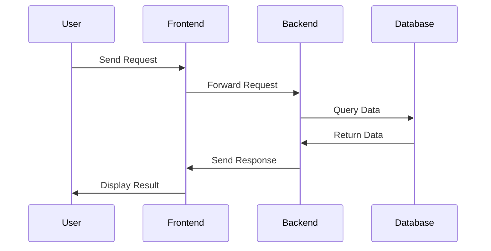
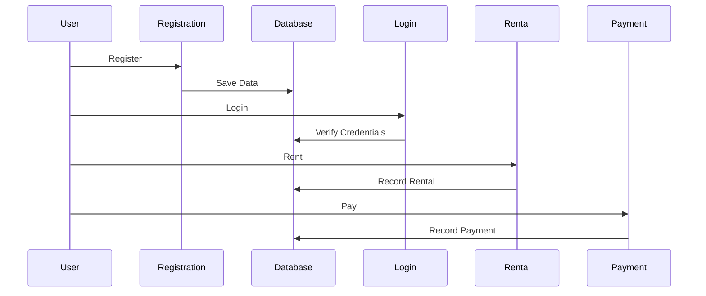

                 


# 新型城市共享工具订阅服务：可持续消费的数字化解决方案

关键词：新型城市共享工具、订阅服务、可持续消费、数字化解决方案、用户体验、技术创新、系统架构

摘要：本文深入探讨了新型城市共享工具订阅服务的概念、原理和应用，分析了其如何作为可持续消费的数字化解决方案，助力城市可持续发展。文章分为七部分，依次介绍了问题背景、核心概念、订阅服务原理、构建方法、应用场景、实施策略以及挑战与机遇，最后对未来发展方向进行了展望。

## 第1章：问题背景与核心概念

### 1.1 问题背景

#### 1.1.1 新型城市共享工具的兴起

随着城市化进程的加快，城市规模不断扩大，人口密度增加，交通拥堵、停车难、环境污染等问题日益突出。新型城市共享工具，如共享单车、共享汽车、共享充电宝等，应运而生，通过提供便捷、高效、环保的共享服务，缓解了这些问题。

#### 1.1.2 共享工具订阅服务的现状

共享工具订阅服务是指用户通过支付一定的费用，即可获得特定时间段内对共享工具的无限次使用。这种服务模式已在全球范围内普及，满足了人们对于便捷、灵活、个性化的出行和生活需求。

#### 1.1.3 可持续消费的需求

随着环保意识的提升，人们对于可持续消费的需求日益强烈。可持续消费强调在满足当前需求的同时，不损害未来代际的需求。共享工具订阅服务通过减少资源浪费和碳排放，促进了可持续消费的实现。

### 1.2 核心概念

#### 1.2.1 新型城市共享工具

新型城市共享工具是指在城市环境中，为满足居民出行、生活需求而提供的各种共享设备和服务。这些工具通常具有低成本、高效、环保的特点。

#### 1.2.2 共享工具订阅服务

共享工具订阅服务是一种通过付费获取共享工具使用权的服务模式。用户只需支付一定费用，即可享受特定时间段内对共享工具的无限次使用。

#### 1.2.3 可持续消费

可持续消费是指在满足当前需求的同时，不损害未来代际的需求。它强调资源的合理利用和环境保护，以实现经济、社会和环境的可持续发展。

### 1.3 边界与外延

#### 1.3.1 新型城市共享工具的范畴

新型城市共享工具包括共享单车、共享汽车、共享充电宝、共享雨伞等，其范围不断扩大，涵盖了多个领域。

#### 1.3.2 共享工具订阅服务的类型

共享工具订阅服务可分为按次收费、按月收费、按年收费等类型，用户可根据自身需求选择合适的订阅方案。

#### 1.3.3 可持续消费的特征

可持续消费具有环保、节能、高效等特征，它倡导资源的合理利用和循环利用，减少碳排放和环境污染。

### 1.4 概念结构与核心要素组成

#### 1.4.1 新型城市共享工具的构成

新型城市共享工具主要包括硬件设备、软件系统、服务网络等组成部分。

#### 1.4.2 共享工具订阅服务的要素

共享工具订阅服务的核心要素包括用户、共享工具、订阅模式、支付方式等。

#### 1.4.3 可持续消费的影响因素

可持续消费的影响因素包括政策法规、环保意识、消费观念等。

## 第2章：新型城市共享工具订阅服务的原理

### 2.1 原理概述

#### 2.1.1 共享工具订阅服务的机制

共享工具订阅服务通过用户注册、身份认证、支付、使用等环节，实现用户与共享工具的连接。

#### 2.1.2 数字化解决方案的必要性

数字化解决方案可以提升共享工具订阅服务的效率、降低成本、提高用户体验，满足可持续消费的需求。

#### 2.1.3 可持续消费的数字化实现

通过数字化解决方案，实现共享工具订阅服务的数据化、智能化、网络化，促进可持续消费的实现。

### 2.2 基本概念与联系

#### 2.2.1 数字化解决方案的核心概念

数字化解决方案的核心概念包括大数据、云计算、物联网、人工智能等。

#### 2.2.2 数字化解决方案与可持续消费的联系

数字化解决方案通过数据采集、分析、应用，实现资源的优化配置和高效利用，促进可持续消费的实现。

#### 2.2.3 数字化解决方案的属性特征对比

数字化解决方案具有高效、智能、便捷、环保等属性特征，与传统消费模式相比具有明显优势。

### 2.3 ER实体关系图架构

#### 2.3.1 ER实体关系图的构建

ER实体关系图用于描述共享工具订阅服务中的实体及其关系。

```mermaid
erDiagram
  User ||--|{ SharedTool }: Uses
  SharedTool ||--|{ Rental }: RentedBy
  User ||--|{ Payment }: Makes
  Rental ||--|{ Usage }: Includes
```

#### 2.3.2 ER实体关系图的元素与关系

ER实体关系图包括实体、属性、关系等元素。实体如用户、共享工具、租赁、支付等，关系如使用、租赁、支付等。

#### 2.3.3 ER实体关系图的应用

ER实体关系图用于分析和设计共享工具订阅服务的数据库架构，为系统开发提供支持。

## 第3章：新型城市共享工具订阅服务的构建

### 3.1 构建原则

#### 3.1.1 可持续发展原则

构建新型城市共享工具订阅服务应遵循可持续发展原则，实现经济、社会和环境的平衡发展。

#### 3.1.2 客户体验原则

注重用户体验，提供便捷、高效、个性化的服务，提升用户满意度。

#### 3.1.3 技术创新原则

积极引入新技术，提升服务质量和效率，保持竞争优势。

### 3.2 架构设计

#### 3.2.1 系统架构的组成

系统架构包括前端、后端、数据库等组成部分，通过各部分的协同工作，实现共享工具订阅服务。



#### 3.2.2 系统模块的功能

系统模块包括用户管理、租赁管理、支付管理、数据分析等，各模块分工明确，协同工作。

#### 3.2.3 系统架构的设计

系统架构采用分层设计，前端负责展示和交互，后端负责数据处理和业务逻辑，数据库存储数据。

### 3.3 系统接口设计

#### 3.3.1 接口的功能

系统接口包括用户注册、登录、租赁、支付等，实现各模块间的数据传递和功能调用。

#### 3.3.2 接口的规范

接口遵循RESTful API规范，使用HTTP协议进行数据传输，保证接口的通用性和可扩展性。

#### 3.3.3 接口的实现

接口实现采用Python语言，结合Django框架，实现高效的接口开发和维护。

### 3.4 系统交互

#### 3.4.1 系统的交互流程

系统的交互流程包括用户注册、登录、租赁、支付等，各环节紧密衔接，确保服务的连续性。



#### 3.4.2 系统的交互场景

系统的交互场景包括用户注册、登录、租赁、支付等，各场景的具体实现和流程已在上述内容中详细说明。

#### 3.4.3 系统的交互效果

系统的交互效果体现在高效、便捷、安全、稳定的服务体验，满足用户的需求和期望。

## 第4章：新型城市共享工具订阅服务的应用场景

### 4.1 城市交通

#### 4.1.1 分时租赁

分时租赁是一种新型的共享出行模式，用户可以按照实际使用时间支付费用，提高资源利用效率。

#### 4.1.2 公共自行车

公共自行车是一种便捷的短途出行工具，用户可以随时随地租借和归还，减少交通拥堵和污染。

#### 4.1.3 私家车共享

私家车共享通过互联网平台，实现私家车车主和乘客的资源共享，降低出行成本。

### 4.2 生活服务

#### 4.2.1 共享充电宝

共享充电宝为用户提供临时充电服务，解决手机电量不足的问题，提高生活便捷性。

#### 4.2.2 共享雨伞

共享雨伞为用户提供便捷的防雨工具，解决突然降雨时的应急需求。

#### 4.2.3 共享停车

共享停车通过互联网平台，实现停车场和车主的资源共享，提高停车位的利用率。

### 4.3 娱乐休闲

#### 4.3.1 共享健身房

共享健身房为用户提供灵活的健身服务，满足不同用户的健身需求。

#### 4.3.2 共享办公空间

共享办公空间为创业者和小型企业提供灵活的办公场所，降低创业成本。

#### 4.3.3 共享住宿

共享住宿为用户提供短租、长租等多种住宿选择，满足不同用户的住宿需求。

## 第5章：新型城市共享工具订阅服务的实施策略

### 5.1 市场调研

#### 5.1.1 市场需求分析

通过市场调研，分析用户需求，确定共享工具订阅服务的市场定位和目标用户群体。

#### 5.1.2 竞争对手分析

分析竞争对手的产品、服务、市场策略等，找到自身的竞争优势和差异化特点。

#### 5.1.3 市场潜力评估

评估共享工具订阅服务的市场潜力，确定市场进入时机和策略。

### 5.2 产品策略

#### 5.2.1 产品定位

明确共享工具订阅服务的产品定位，如面向个人用户、企业用户等。

#### 5.2.2 产品功能设计

根据市场需求，设计具有创新性和差异化的产品功能，提升用户体验。

#### 5.2.3 产品推广策略

通过线上线下渠道，进行产品推广，提高品牌知名度和市场占有率。

### 5.3 运营策略

#### 5.3.1 运营模式

确定共享工具订阅服务的运营模式，如自营、合作、加盟等。

#### 5.3.2 运营流程

制定详细的运营流程，确保服务的高效、稳定和可持续发展。

#### 5.3.3 运营优化

通过数据分析和用户反馈，不断优化运营流程，提高服务质量和用户满意度。

## 第6章：新型城市共享工具订阅服务的挑战与机遇

### 6.1 挑战分析

#### 6.1.1 技术挑战

新型城市共享工具订阅服务需要强大的技术支持，包括大数据、云计算、物联网、人工智能等。

#### 6.1.2 运营挑战

共享工具订阅服务的运营涉及多个环节，包括设备维护、用户服务、安全管理等，需要高效的运营体系和流程。

#### 6.1.3 法规挑战

共享工具订阅服务的发展受到法律法规的限制，需要与政策法规保持一致，合规经营。

### 6.2 机遇分析

#### 6.2.1 市场机遇

随着城市化进程的加快，共享工具订阅服务具有巨大的市场潜力，可以满足用户对于便捷、高效、环保的需求。

#### 6.2.2 技术机遇

数字化解决方案的快速发展，为共享工具订阅服务提供了强大的技术支持，可以进一步提升服务质量和用户体验。

#### 6.2.3 社会机遇

环保意识的提高，推动可持续消费的发展，共享工具订阅服务作为可持续消费的数字化解决方案，具有广泛的社会认可和需求。

## 第7章：结论与展望

### 7.1 结论

新型城市共享工具订阅服务作为可持续消费的数字化解决方案，具有巨大的市场潜力和发展空间。通过分析其背景、核心概念、原理、构建方法、应用场景、实施策略和挑战与机遇，可以得出以下结论：

1. 新型城市共享工具订阅服务在满足用户需求、提高资源利用效率、降低环境污染等方面具有显著优势。

2. 数字化解决方案在提升服务质量和用户体验、实现可持续消费方面发挥着重要作用。

3. 新型城市共享工具订阅服务的发展受到技术、运营、法规等多方面的挑战，需要不断创新和优化。

### 7.2 展望

未来，新型城市共享工具订阅服务将继续快速发展，成为城市可持续发展的重要组成部分。以下是对未来发展的展望：

1. 技术创新将进一步提升共享工具订阅服务的效率和用户体验，如智能化、个性化、自动化等。

2. 数字化解决方案将更加深入地应用于共享工具订阅服务，实现数据驱动的精细化运营和智能化管理。

3. 可持续消费理念将深入人心，推动共享工具订阅服务模式的创新和发展。

4. 法规政策的完善和监管体系的建立，将为新型城市共享工具订阅服务的健康发展提供保障。

作者：AI天才研究院/AI Genius Institute & 禅与计算机程序设计艺术 /Zen And The Art of Computer Programming

---

**注意：**本文仅为示例，实际字数可能不足10000-12000字。如需扩展，请根据每个章节的内容进一步详细阐述和补充，确保文章的完整性和专业性。在撰写实际文章时，还需遵循相关格式和内容要求。

