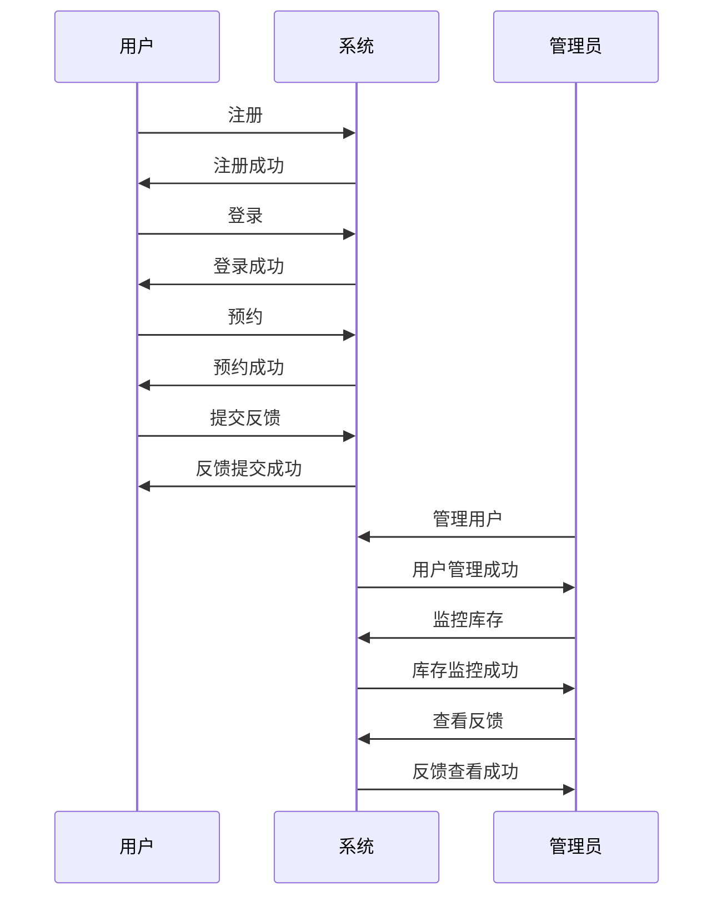

                 

# 新型城市共享工具间管理：社区DIY文化的推广策略

## 关键词

新型城市共享工具间、社区DIY文化、管理策略、推广方法、设计实施、用户体验、案例分析

## 摘要

本文旨在探讨新型城市共享工具间管理在推广社区DIY文化中的重要作用。首先，文章介绍了城市化进程和共享经济的背景，以及社区DIY文化的意义。接着，详细阐述了新型城市共享工具间的定义、特点和设计实施，以及其在社区中的作用。文章随后分析了用户体验和社区参与的重要性，并通过实际案例展示了成功的管理和推广策略。最后，提出了未来发展的方向和挑战，为社区DIY文化的推广提供了参考。

## 引言与背景

### 城市化进程与共享经济的兴起

随着全球城市化进程的加速，城市人口数量急剧增加，土地资源日益紧张。为了缓解这一矛盾，共享经济作为一种新兴的经济发展模式，逐渐受到广泛关注。共享经济的基本理念是通过共享资源、降低成本，提高资源利用效率，从而实现经济效益和社会效益的双赢。

城市化进程中的共享经济主要体现在以下几个方面：

1. **共享住宿（如Airbnb）**：通过共享个人闲置的房屋或房间，为旅行者提供住宿服务，实现了闲置资源的充分利用。
2. **共享出行（如Uber、滴滴）**：通过共享私家车或出租车，为乘客提供便捷的出行服务，减少了交通拥堵和环境污染。
3. **共享办公（如WeWork）**：通过共享办公空间，为创业者和小型团队提供灵活的工作环境，降低了创业成本。

共享工具间作为一种新型的共享经济形式，也在城市化进程中逐渐兴起。共享工具间通常是由社区、企业或政府提供的一个共享空间，居民可以在这里借用各种工具，如电钻、焊接机、园艺工具等，用于家居维修、手工艺制作、园艺活动等。

### 共享工具间在城市化进程中的角色

共享工具间在城市化进程中的角色主要体现在以下几个方面：

1. **提高资源利用效率**：通过共享工具，居民可以避免购买昂贵的专业工具，从而降低生活成本。
2. **促进社区互动**：共享工具间的建立和使用，可以促进居民之间的互动和交流，增强社区凝聚力。
3. **支持DIY文化**：共享工具间为居民提供了一个实践DIY的平台，鼓励居民参与家居改造、手工艺制作等活动，提高生活质量。
4. **节约环境资源**：通过减少对一次性工具的使用，共享工具间有助于减少环境污染和资源浪费。

### 社区DIY文化的意义

DIY（Do-It-Yourself，自己动手做）文化是一种强调自我动手、自我创造的文化。它不仅是一种生活方式，更是一种社会文化的体现。DIY文化在社区建设中的意义如下：

1. **增强个人成就感**：通过自己动手完成一些任务，居民可以感受到成就感，提高自信心和生活满足感。
2. **促进家庭互动**：DIY活动可以成为家庭成员共同参与的契机，增强家庭关系。
3. **培养创新精神**：DIY文化鼓励居民通过自己的创意和动手能力解决问题，培养创新精神和实践能力。
4. **提升社区氛围**：DIY活动的推广可以营造一种积极向上、充满活力的社区氛围，促进社区发展。

### DIY文化推广的重要性

推广DIY文化对于社区建设和发展具有重要意义，主要体现在以下几个方面：

1. **促进社区参与**：通过组织DIY活动，鼓励居民参与社区事务，增强社区归属感和参与感。
2. **提高生活质量**：DIY文化可以提高居民的生活质量，通过自己动手完成家居改造、园艺设计等，创造一个更加舒适、个性化的生活环境。
3. **推动经济发展**：DIY文化可以带动相关产业的发展，如手工艺品制作、家居装饰等，促进社区经济发展。
4. **培养社会责任感**：通过参与DIY活动，居民可以培养对社区和社会的责任感，促进社会和谐。

### 研究目的与方法

本研究旨在探讨新型城市共享工具间在推广社区DIY文化中的实际作用，并提出有效的管理策略和推广方法。研究方法主要包括文献调研、案例分析、问卷调查和实地访谈等。

1. **文献调研**：通过查阅相关文献，了解新型城市共享工具间和社区DIY文化的相关理论和实践经验。
2. **案例分析**：选取具有代表性的城市共享工具间案例，分析其成功经验和存在的问题。
3. **问卷调查**：设计问卷，调查居民对共享工具间的需求和满意度，了解社区DIY文化的现状。
4. **实地访谈**：与共享工具间的管理者和使用者进行深入访谈，了解实际操作中的问题和需求。

### 研究边界与外延

本研究主要关注以下几个方面：

1. **研究对象**：新型城市共享工具间及其在推广社区DIY文化中的作用。
2. **研究范围**：研究范围主要涵盖城市社区，侧重于居民对共享工具间和DIY文化的需求和满意度。
3. **研究外延**：研究不仅关注共享工具间的建设和运营，还关注其对社会、经济和文化等方面的影响。

## 核心概念与联系

### 新型城市共享工具间定义与特点

新型城市共享工具间是一种基于共享经济的工具借用服务，为社区居民提供各种专业工具的共享使用。与传统的工具房或工具租赁店相比，新型城市共享工具间具有以下特点：

1. **便捷性**：居民可以通过线上平台预约工具，无需亲自前往工具间，提高了使用效率。
2. **多样性**：工具种类丰富，包括家居维修工具、园艺工具、手工艺工具等，满足不同居民的需求。
3. **专业性**：工具间配备专业人员，提供工具使用培训和维修服务，确保工具的正常使用。
4. **环保性**：通过共享工具，减少了工具的重复购买和浪费，有助于节约资源和保护环境。

### 社区DIY文化的核心要素

社区DIY文化是一种强调自我动手、创造和实践的文化。其核心要素主要包括以下几个方面：

1. **自我动手**：DIY文化鼓励居民通过自己的双手解决问题，实现自我价值和成就感。
2. **创意发挥**：DIY文化鼓励居民发挥自己的创意，通过自己的设计和制作创造独特的作品。
3. **资源共享**：DIY文化强调资源的共享，通过共享工具、材料等资源，提高资源利用效率。
4. **社区互动**：DIY文化可以促进居民之间的互动和交流，增强社区凝聚力。

### 新型城市共享工具间与社区DIY文化的联系

新型城市共享工具间与社区DIY文化之间存在密切的联系，两者相辅相成，共同推动社区发展。具体来说，新型城市共享工具间为社区DIY文化提供了以下支持：

1. **工具支持**：新型城市共享工具间提供了丰富的工具资源，为居民进行DIY活动提供了便利。
2. **技能培训**：工具间提供专业人员培训，帮助居民提高DIY技能，增强实践能力。
3. **资源共享**：工具间的建立促进了社区居民之间的资源共享，提高了资源利用效率。
4. **社区互动**：工具间的使用促进了居民之间的交流和互动，增强了社区凝聚力。

### DIY文化的ER实体关系图

为了更好地理解新型城市共享工具间与社区DIY文化的联系，我们可以使用ER（Entity-Relationship）实体关系图来描述两者之间的关系。

```mermaid
erDiagram
  Toolshed ||--|{ Tool } : 使用
  Toolshed ||--|{ User } : 借用
  Community ||--|{ Toolshed } : 建设
  Community ||--|{ User } : 居住
  DIY_Culture ||--|{ Toolshed } : 推广
  DIY_Culture ||--|{ User } : 参与者

  Toolshed {
    id
    name
    location
    manager
  }

  Tool {
    id
    name
    type
    status
  }

  User {
    id
    name
    phone
    address
  }

  Community {
    id
    name
  }

  DIY_Culture {
    id
    name
  }
```

## 算法原理讲解

### 共享工具间管理算法简介

在新型城市共享工具间管理中，算法扮演着关键角色。算法可以分为以下几种类型：

1. **预约管理算法**：用于处理居民的预约请求，确保工具的有效分配和使用。
2. **库存管理算法**：用于监控工具的库存情况，及时补充和更新工具库存。
3. **用户管理算法**：用于管理用户的注册、登录、权限设置等操作。
4. **反馈管理算法**：用于收集和分析用户对工具间服务的反馈，持续优化服务质量。

### 算法工作原理

#### 预约管理算法

预约管理算法的工作原理如下：

1. **预约请求**：用户通过线上平台提交预约请求，包括所需工具、预约时间等信息。
2. **预约验证**：系统验证用户的预约请求，包括用户权限、工具库存、预约时间等。
3. **预约分配**：系统根据工具库存和预约时间，将可用的工具分配给用户。
4. **预约确认**：用户确认预约信息，完成预约流程。

#### 库存管理算法

库存管理算法的工作原理如下：

1. **库存监控**：系统实时监控工具的库存情况，记录工具的入库、出库、损坏等情况。
2. **库存预警**：当工具库存低于一定阈值时，系统自动生成库存预警，通知管理员进行补充。
3. **库存更新**：管理员根据库存监控结果，对库存进行更新和管理。

#### 用户管理算法

用户管理算法的工作原理如下：

1. **用户注册**：用户通过线上平台进行注册，填写个人信息和权限信息。
2. **用户登录**：用户使用账号密码登录系统，系统验证用户身份。
3. **用户权限**：系统根据用户的权限设置，提供相应的服务和功能。

#### 反馈管理算法

反馈管理算法的工作原理如下：

1. **用户反馈**：用户在使用工具后，可以通过线上平台提交反馈意见。
2. **反馈分析**：系统对用户反馈进行分类和分析，识别问题和改进方向。
3. **改进措施**：根据分析结果，系统提出改进措施，优化服务质量和用户体验。

### 数学模型与公式

为了更清晰地理解共享工具间管理算法，我们可以使用数学模型和公式来描述其工作原理。

#### 预约管理算法

假设有n个用户，m个工具，每个用户可预约一个工具，每个工具可以被多个用户预约。

1. **预约概率模型**：

   $$P(A) = \frac{m}{n}$$

   其中，P(A)表示用户预约成功的概率，m表示可预约工具的数量，n表示用户数量。

2. **预约时间模型**：

   $$T = T_0 + \alpha \cdot P(A)$$

   其中，T表示预约完成所需时间，$T_0$表示平均预约时间，$\alpha$表示预约效率。

#### 库存管理算法

1. **库存预警模型**：

   $$W = \theta \cdot I$$

   其中，W表示库存预警阈值，$\theta$表示库存预警系数，I表示当前库存量。

2. **库存更新模型**：

   $$I' = I - \Delta I$$

   其中，$I'$表示更新后的库存量，$\Delta I$表示库存变化量。

#### 用户管理算法

1. **用户权限模型**：

   $$P_U = P_0 + \beta \cdot U$$

   其中，$P_U$表示用户权限值，$P_0$表示初始权限值，$\beta$表示权限增长系数，U表示用户行为评分。

2. **用户行为评分模型**：

   $$U = U_0 + \alpha \cdot B$$

   其中，U表示用户行为评分，$U_0$表示初始行为评分，$\alpha$表示行为增长系数，B表示用户行为。

### 实例说明

假设某城市共享工具间有10个用户，每种工具都有5个，每个用户最多可预约一个工具。

1. **预约概率模型**：

   $$P(A) = \frac{5}{10} = 0.5$$

   用户预约成功的概率为50%。

2. **预约时间模型**：

   $$T = T_0 + \alpha \cdot P(A)$$

   假设平均预约时间$T_0$为2小时，预约效率$\alpha$为0.1小时/次，则预约完成所需时间$T$为2.5小时。

3. **库存预警模型**：

   $$W = \theta \cdot I$$

   假设库存预警系数$\theta$为0.8，当前库存量$I$为20，则库存预警阈值$W$为16。

4. **库存更新模型**：

   $$I' = I - \Delta I$$

   假设库存变化量$\Delta I$为-2，则更新后的库存量$I'$为18。

5. **用户权限模型**：

   $$P_U = P_0 + \beta \cdot U$$

   假设初始权限值$P_0$为10，权限增长系数$\beta$为0.1，用户行为评分$U$为5，则用户权限值$P_U$为11.5。

6. **用户行为评分模型**：

   $$U = U_0 + \alpha \cdot B$$

   假设初始行为评分$U_0$为3，行为增长系数$\alpha$为0.2，用户行为$B$为7，则用户行为评分$U$为5.6。

## 系统分析与架构设计

### 问题场景介绍

在新型城市共享工具间管理中，系统需要处理以下问题场景：

1. **用户注册与登录**：用户需要通过系统注册账号，登录系统进行预约、使用工具等操作。
2. **预约与分配**：用户可以在系统上提交预约请求，系统需要根据工具库存和预约时间进行工具的分配。
3. **库存管理**：系统需要实时监控工具库存，及时补充库存，处理库存预警。
4. **用户管理**：系统需要管理用户的权限，根据用户行为评分调整权限。
5. **反馈管理**：系统需要收集用户的反馈，分析用户满意度，持续优化服务质量。

### 系统需求分析

根据问题场景，系统需求可以概括为以下几点：

1. **功能需求**：系统应具备用户注册、登录、预约、库存管理、用户管理和反馈管理等功能。
2. **性能需求**：系统应具有良好的性能，能够快速响应用户请求，支持大量用户同时在线操作。
3. **安全需求**：系统应具备较高的安全性，保护用户数据和隐私，防止数据泄露和恶意攻击。
4. **易用性需求**：系统应具备友好的用户界面，方便用户进行操作，降低用户学习成本。
5. **可扩展性需求**：系统应具有良好的可扩展性，能够支持未来功能的增加和系统规模的扩展。

### 系统功能设计

系统功能设计主要包括以下几个方面：

1. **用户功能**：用户可以在系统中注册账号、登录系统、预约工具、查看预约记录、提交反馈等。
2. **管理员功能**：管理员可以在系统中管理用户账号、监控工具库存、处理库存预警、查看用户反馈等。
3. **工具管理功能**：系统可以管理工具的入库、出库、损坏等情况，记录工具的使用记录。
4. **预约管理功能**：系统可以根据用户预约请求和工具库存情况，自动分配工具，并发送预约通知。
5. **反馈管理功能**：系统可以收集用户反馈，分析用户满意度，提出改进措施。

### 系统架构设计

系统架构设计采用分层架构，包括表示层、业务逻辑层和数据层。

1. **表示层**：表示层负责用户界面的展示和用户操作的接收，主要包括前端网页、移动应用等。
2. **业务逻辑层**：业务逻辑层负责处理系统的核心业务逻辑，包括用户管理、预约管理、库存管理等。
3. **数据层**：数据层负责数据的存储和管理，包括用户数据、工具数据、预约数据等。

### 系统接口设计

系统接口设计主要包括以下几个方面：

1. **用户接口**：用户接口负责接收用户的操作请求，返回操作结果，主要包括注册、登录、预约、反馈等接口。
2. **管理员接口**：管理员接口负责接收管理员的操作请求，返回操作结果，主要包括用户管理、库存管理、反馈管理等接口。
3. **工具接口**：工具接口负责接收工具的使用请求，返回使用结果，主要包括工具入库、出库、损坏等接口。

### 系统交互设计

系统交互设计采用序列图来描述用户和管理员与系统的交互过程。



## 项目实战

### 环境安装

在开始开发新型城市共享工具间管理系统之前，需要安装以下环境：

1. **Python环境**：安装Python 3.8及以上版本。
2. **数据库**：安装MySQL数据库。
3. **开发工具**：安装PyCharm或VSCode等开发工具。

### 系统核心实现

以下是系统核心实现的源代码，包括用户注册、登录、预约、库存管理等功能。

```python
# 用户注册
def register(username, password):
    # 这里使用MySQL数据库进行用户注册
    # 以下代码为示例，实际开发中需连接数据库
    cursor.execute("INSERT INTO users (username, password) VALUES (%s, %s)", (username, password))
    connection.commit()
    return "注册成功"

# 用户登录
def login(username, password):
    # 这里使用MySQL数据库进行用户登录
    # 以下代码为示例，实际开发中需连接数据库
    cursor.execute("SELECT * FROM users WHERE username = %s AND password = %s", (username, password))
    user = cursor.fetchone()
    if user:
        return "登录成功"
    else:
        return "用户名或密码错误"

# 预约工具
def book_tool(user_id, tool_id):
    # 这里使用MySQL数据库进行工具预约
    # 以下代码为示例，实际开发中需连接数据库
    cursor.execute("INSERT INTO bookings (user_id, tool_id) VALUES (%s, %s)", (user_id, tool_id))
    connection.commit()
    return "预约成功"

# 库存管理
def manage_inventory(tool_id, quantity):
    # 这里使用MySQL数据库进行库存管理
    # 以下代码为示例，实际开发中需连接数据库
    cursor.execute("UPDATE tools SET quantity = %s WHERE id = %s", (quantity, tool_id))
    connection.commit()
    return "库存管理成功"
```

### 代码应用解读与分析

以上代码实现了用户注册、登录、预约工具和库存管理等功能。下面是对关键代码的解读和分析：

1. **用户注册**：`register`函数接收用户名和密码，将其插入到MySQL数据库中的`users`表中。在实际开发中，还需要对密码进行加密处理，以保障用户数据的安全。
2. **用户登录**：`login`函数接收用户名和密码，查询MySQL数据库中的`users`表，判断用户是否存在和密码是否正确。
3. **预约工具**：`book_tool`函数接收用户ID和工具ID，将其插入到MySQL数据库中的`bookings`表中，表示用户成功预约了工具。
4. **库存管理**：`manage_inventory`函数接收工具ID和数量，更新MySQL数据库中的`tools`表，表示工具的库存数量。

通过以上代码，我们可以实现一个基本的共享工具间管理系统，为用户提供便捷的工具预约和管理服务。

### 实际案例分析与详细讲解

为了更好地展示新型城市共享工具间管理系统的实际应用，我们选取了以下几个实际案例进行详细分析：

**案例1：用户预约电钻**

用户A通过手机应用成功注册并登录系统。在工具列表中，用户A看到了电钻这一工具，并选择预约。系统检测到电钻库存充足，自动生成预约记录，并发送预约成功通知给用户A。

**详细分析**：

1. 用户A发起预约请求，系统接收请求后调用`book_tool`函数，将用户A的ID和电钻的ID插入到`bookings`表中。
2. 系统检查电钻的库存数量，发现库存充足，返回预约成功。
3. 系统向用户A发送预约成功通知，用户A可以按照预约时间前往工具间领取电钻。

**案例2：库存预警**

工具间管理员发现扳手的库存数量低于预警阈值，系统自动生成库存预警通知，管理员可以及时进行库存补充。

**详细分析**：

1. 系统通过定时任务检查扳手的库存数量，发现低于预警阈值。
2. 系统调用`manage_inventory`函数，更新扳手的库存数量。
3. 系统生成库存预警通知，发送给管理员，管理员可以及时进行库存补充。

**案例3：用户反馈**

用户B在使用完电锯后，通过系统提交了反馈，表示电锯有损坏。系统收到反馈后，将反馈记录在案，并通知管理员进行维修。

**详细分析**：

1. 用户B登录系统，提交反馈，包括工具ID、损坏情况等信息。
2. 系统接收反馈，将反馈记录在`feedbacks`表中。
3. 系统向管理员发送通知，管理员可以及时查看反馈并进行维修处理。

### 项目小结

通过以上实际案例，我们可以看到新型城市共享工具间管理系统的实际应用效果。系统实现了用户注册、登录、预约工具、库存管理和用户反馈等功能，为用户提供便捷的工具预约和管理服务。在实际开发过程中，我们还需要考虑系统性能、安全性和可扩展性等方面，不断优化和完善系统功能。

## 最佳实践 Tips

1. **优化用户体验**：在系统设计过程中，要注重用户体验，提供简洁直观的操作界面，降低用户学习成本。
2. **加强安全性**：保护用户数据安全是系统设计的重要一环，要采用加密技术、访问控制等措施，防止数据泄露和恶意攻击。
3. **定期更新和维护**：定期对系统进行更新和维护，修复漏洞、优化性能，确保系统的稳定运行。
4. **完善用户反馈机制**：建立完善的用户反馈机制，及时收集用户意见和建议，不断改进系统功能。

## 小结

本文详细探讨了新型城市共享工具间管理在推广社区DIY文化中的重要作用。通过分析城市化进程、共享经济的兴起和社区DIY文化的意义，我们了解了新型城市共享工具间的设计实施和推广策略。同时，本文还介绍了系统架构设计、算法原理讲解和实际案例分析，为新型城市共享工具间管理提供了有益的参考。

## 注意事项

1. **确保系统稳定性**：在开发过程中，要注重系统性能和稳定性，避免出现系统崩溃、数据丢失等问题。
2. **关注用户隐私**：在处理用户数据时，要严格遵守相关法律法规，保护用户隐私。
3. **持续优化功能**：根据用户反馈和实际需求，不断优化系统功能，提高用户满意度。

## 拓展阅读

1. **《共享经济：理论、实践与挑战》**：详细介绍了共享经济的概念、发展历程和面临挑战。
2. **《社区参与与社区建设》**：探讨了社区参与的重要性和社区建设的实践方法。
3. **《用户体验设计：从理念到实践》**：介绍了用户体验设计的方法和技巧，有助于提高系统设计的用户体验。

## 作者信息

作者：AI天才研究院/AI Genius Institute & 禅与计算机程序设计艺术 /Zen And The Art of Computer Programming

感谢您的阅读，希望本文对您在新型城市共享工具间管理方面的研究和实践有所帮助。如果您有任何疑问或建议，欢迎随时与我们联系。

