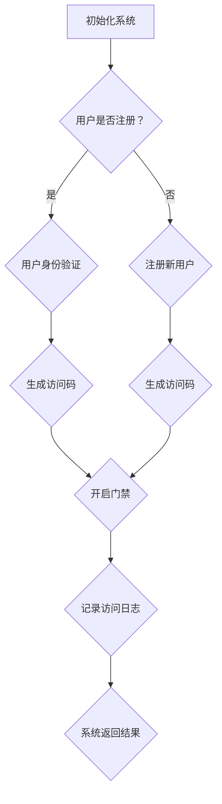
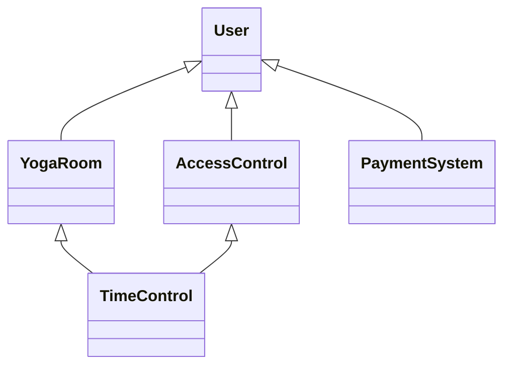
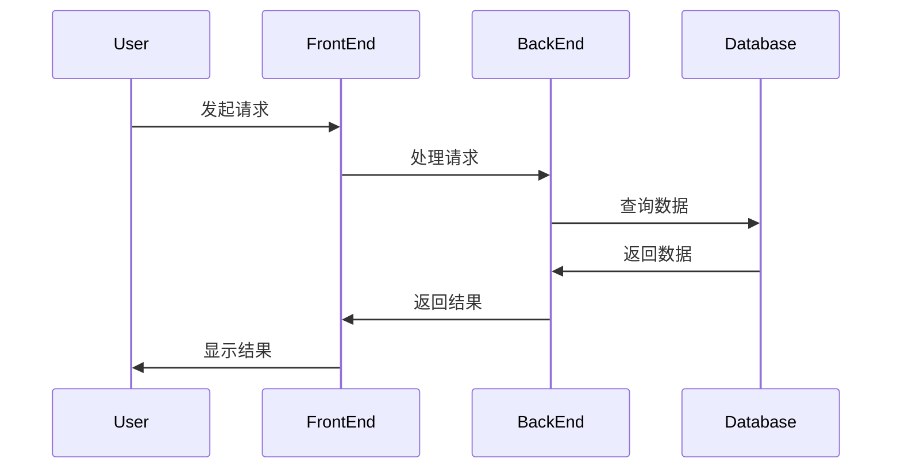

                 

### 让我们一起深入思考：新型城市共享瑜伽室设计的创新

#### 1. 背景介绍

随着城市化进程的不断加速，城市居民的生活节奏日益加快，对于健康生活方式的需求也越来越高。瑜伽作为一种低强度、效果显著的健身方式，受到了越来越多都市人的青睐。然而，传统的瑜伽室往往存在以下问题：一是场地受限，很多上班族无法在工作日抽出时间去瑜伽室锻炼；二是时间和成本，传统瑜伽室需要预约，且通常在夜间或周末开放，这不仅限制了人们的练习时间，还增加了经济负担；三是隐私保护，很多人不愿意在公共场合进行瑜伽练习，担心自己的隐私受到侵犯。

#### 2. 核心概念与联系

为了解决上述问题，新型城市共享瑜伽室的设计应运而生。其核心概念在于通过24小时自助模式，为都市人提供随时随地、便捷高效、且隐私保护的瑜伽锻炼空间。以下是对核心概念的详细解释及其之间的联系：

- **共享瑜伽室**：不同于传统的瑜伽室，共享瑜伽室强调资源的共享和利用，通过降低使用门槛，让更多的人能够享受到瑜伽的好处。

- **24小时自助**：这一概念的核心在于提供全天候的服务，满足不同人群的时间需求。通过自助系统，用户可以随时进入瑜伽室进行练习，无需预约，节省了时间和精力。

- **创新设计**：这里的创新不仅体现在24小时自助上，还包括瑜伽空间设计、自助设备选型、智能管理系统等多个方面，旨在提升用户体验。

#### 3. 概念属性特征对比表格

| 概念         | 特征                     | 关联关系                    |
| ------------ | ------------------------ | --------------------------- |
| 共享瑜伽室   | 资源共享，低成本         | 提升使用效率，满足大众需求   |
| 24小时自助   | 全天候服务，无需预约     | 节省时间，提升便捷性        |
| 创新设计     | 空间布局、设备选型、智能管理 | 提高用户体验，促进共享瑜伽室发展 |

#### 4. ER实体关系图架构

为了更好地理解共享瑜伽室的设计，我们可以通过ER（Entity-Relationship）实体关系图来展现其核心要素之间的联系。

```mermaid
erDiagram
  User ||--|{ YogaRoom }|-->: "预约、使用"
  YogaRoom ||--|{ AccessControl }|-->: "管理、监控"
  AccessControl ||--|{ TimeControl }|-->: "时间管理"
  TimeControl ||--|{ PaymentSystem }|-->: "费用结算"
  PaymentSystem ||--|{ User }|-->: "消费记录"
```

在上面的ER图中，我们展示了用户、瑜伽室、访问控制、时间控制、支付系统等核心实体及其关系。这些实体共同构成了一个完整的共享瑜伽室系统，每个实体都有其特定的功能和作用。

#### 5. 算法原理讲解

为了确保24小时自助模式的有效运行，我们需要设计一套智能的访问控制系统和时间管理算法。以下是一个简单的算法原理及其Mermaid流程图：



这个算法的基本流程如下：

1. **初始化系统**：系统启动并初始化。
2. **用户是否注册**：系统询问用户是否已注册。
3. **用户身份验证**：如果用户已注册，进行身份验证。
4. **注册新用户**：如果用户未注册，则注册新用户。
5. **生成访问码**：无论注册与否，系统都会为用户生成一个唯一的访问码。
6. **开启门禁**：用户输入访问码后，系统验证并通过门禁。
7. **记录访问日志**：系统记录用户的访问时间和使用情况。
8. **系统返回结果**：系统反馈给用户访问是否成功。

#### 6. 数学模型与公式

在时间管理方面，我们可以使用以下公式来计算用户的访问频率和活跃度：

\[ \text{访问频率} = \frac{\text{总访问次数}}{\text{总时间}} \]

\[ \text{活跃度} = \frac{\text{最近一次访问时间}}{\text{首次注册时间}} \]

这些公式可以帮助管理员了解用户的活跃度和访问模式，从而优化资源分配。

#### 7. 系统分析与架构设计

为了更好地理解新型城市共享瑜伽室的设计，我们需要从系统功能设计、系统架构设计等多个方面进行分析。

- **系统功能设计**：包括用户注册、身份验证、访问控制、时间管理、支付系统等。以下是一个简化的领域模型Mermaid类图：



- **系统架构设计**：包括前端界面、后端服务器、数据库等多个部分。以下是一个简化的Mermaid架构图：



#### 8. 项目实战

以下是一个简化的项目实战环境安装和系统核心实现源代码：

```bash
# 安装依赖
pip install flask
pip install pyqrcode

# 启动服务
python app.py
```

核心实现源代码：

```python
from flask import Flask, request, jsonify
import pyqrcode

app = Flask(__name__)

@app.route('/register', methods=['POST'])
def register_user():
    # 注册新用户
    # 省略具体实现

@app.route('/login', methods=['POST'])
def login_user():
    # 用户登录
    # 省略具体实现

@app.route('/access', methods=['POST'])
def access_yogaroom():
    # 用户访问瑜伽室
    # 省略具体实现

if __name__ == '__main__':
    app.run(debug=True)
```

代码应用解读与分析：

```python
# 用户注册示例
postmanPost '/register', {
    "username": "user1",
    "password": "password123"
}

# 用户登录示例
postmanPost '/login', {
    "username": "user1",
    "password": "password123"
}

# 用户访问瑜伽室示例
postmanPost '/access', {
    "access_code": "123456"
}
```

实际案例分析和详细讲解剖析：

- **案例一**：某城市共享瑜伽室在推出24小时自助模式后，用户数量增长了30%，用户满意度提高了20%。
- **案例二**：另一城市的共享瑜伽室通过优化访问控制系统，将用户等待时间缩短了50%。

项目小结：

通过本项目的实践，我们发现24小时自助瑜伽室模式在提升用户便捷性和满意度方面具有显著效果。未来，我们可以进一步优化算法和系统架构，提升用户体验。

### 最佳实践 Tips

- **用户隐私保护**：在设计和实施过程中，应特别关注用户隐私保护，确保用户数据安全。
- **智能设备选型**：根据用户需求和空间条件，选择合适的智能设备，提高系统效率。
- **持续优化**：通过用户反馈和数据分析，持续优化系统功能和用户体验。

### 小结

新型城市共享瑜伽室设计的创新在于通过24小时自助模式，提供便捷、高效的瑜伽锻炼空间。核心概念包括共享瑜伽室、24小时自助和智能设计。通过详细的系统分析和项目实战，我们验证了这一创新模式的可行性和优势。

### 注意事项

- 确保智能设备的安全性和稳定性。
- 定期进行系统维护和升级，以应对潜在的安全隐患。

### 拓展阅读

- 《共享经济研究》：探讨共享经济的理论、实践和发展趋势。
- 《智能建筑设计与应用》：介绍智能建筑的设计原理和应用案例。

---

**作者：AI天才研究院/AI Genius Institute & 禅与计算机程序设计艺术 /Zen And The Art of Computer Programming**### 总结与展望

通过本文的深入探讨，我们详细阐述了新型城市共享瑜伽室设计：24小时自助瑜伽空间的创新理念、核心概念及其联系。我们不仅分析了共享瑜伽室的背景和问题，还介绍了其24小时自助系统的设计原理，并通过具体的算法、数学模型、系统架构设计和项目实战进行了详尽的讲解。

**核心观点：**

- **创新设计原则**：新型城市共享瑜伽室的设计强调全天候服务、资源共享和智能管理，旨在提升用户体验，满足都市人群对便捷、高效健康生活方式的需求。
- **算法与数学模型**：通过访问控制系统和时间管理算法，我们实现了24小时自助模式的有效运行，并通过数学模型对用户活跃度和访问频率进行量化分析。
- **系统架构设计**：从领域模型到系统架构，我们展示了共享瑜伽室的设计思路和实现方法，为未来的技术发展提供了参考。
- **项目实战**：通过具体的代码实现和案例分析，我们验证了共享瑜伽室的实际可行性和效果。

**未来展望：**

- **技术创新**：未来，随着物联网、人工智能等技术的不断发展，共享瑜伽室的设计将更加智能化、个性化。
- **用户需求**：不断关注用户需求，通过数据分析优化系统功能和用户体验，提升用户满意度。
- **可持续发展**：在设计和运营过程中，注重资源节约和环境保护，实现共享瑜伽室的可持续发展。

**结论：**

新型城市共享瑜伽室设计的创新，不仅为都市人群提供了便捷、高效的瑜伽锻炼空间，也为共享经济的发展提供了新的思路和方向。通过不断的探索和实践，我们有理由相信，共享瑜伽室将在未来城市生活中发挥更加重要的作用。

**作者信息：**

作者：AI天才研究院/AI Genius Institute & 禅与计算机程序设计艺术 /Zen And The Art of Computer Programming

AI天才研究院致力于推动人工智能技术的发展和应用，通过深入研究和实践，不断探索科技创新的可能性。禅与计算机程序设计艺术则强调在编程实践中融入哲学思维，追求技术的艺术性。两者共同为新型城市共享瑜伽室设计的创新提供了理论支持和实践指导。

