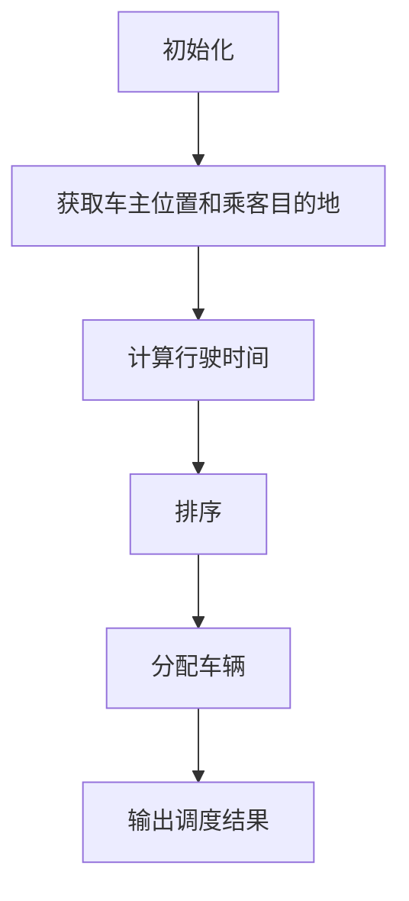

                 

# 新型城市共享私家车平台：邻里间的汽车共享经济

## 关键词：共享经济、私家车平台、邻里共享、汽车共享、城市交通优化

> 摘要：随着城市化进程的加速和交通拥堵问题的日益严重，共享私家车平台作为一种新型的交通模式，正在悄然改变着人们的出行方式。本文将深入探讨新型城市共享私家车平台的发展背景、核心概念、实现算法、系统架构设计以及实际案例分析，旨在为该领域的进一步研究和应用提供有益的参考。

## 引言与背景介绍

### 1.1 城市化进程与交通拥堵问题

随着全球城市化进程的不断加快，城市人口规模急剧扩大，交通需求也随之快速增长。然而，现有的公共交通系统往往无法满足日益增长的交通需求，导致交通拥堵问题日益严重。特别是在城市中心区域，高峰时段的道路拥堵问题更是影响了居民的出行效率和城市整体运行效率。因此，寻找一种高效、便捷的出行方式，成为解决城市交通问题的重要课题。

### 1.2 共享经济的崛起

共享经济作为一种新型的经济模式，近年来在全球范围内迅速崛起。其核心思想是利用闲置资源，通过互联网平台实现资源的高效利用和共享。共享单车、共享汽车等共享经济模式已经在多个领域取得了显著的成功。私家车作为一种闲置资源，具有较大的共享潜力，因此，共享私家车平台逐渐成为解决城市交通问题的一种新兴途径。

### 1.3 新型城市共享私家车平台的重要性

新型城市共享私家车平台不仅能够缓解城市交通拥堵问题，提高交通效率，还能够促进邻里之间的互动和社区建设。与传统打车服务和租车服务相比，共享私家车平台具有成本更低、使用更便捷的特点，能够更好地满足居民日常出行的需求。因此，新型城市共享私家车平台在优化城市交通、促进经济发展和社区建设方面具有重要的现实意义。

## 核心概念与联系

### 2.1 新型城市共享私家车平台的概念

新型城市共享私家车平台是指通过互联网技术，将私家车资源进行整合，提供给有需求的用户使用的服务平台。这个平台通常包括以下几个核心组成部分：

- **用户**：包括车主和乘客。车主提供自己的私家车，乘客通过平台预约车辆。
- **车辆**：指可供共享的私家车，包括车型、车况、车位数等信息。
- **平台**：提供信息匹配、支付结算、评价反馈等服务的互联网平台。
- **规则**：包括车辆使用规则、费用标准、安全规定等。

### 2.2 共享私家车模式分类与比较

根据不同的运营模式和用户需求，共享私家车平台可以分为以下几种模式：

- **P2P模式**：即“个人对个人”模式，车主直接将车辆提供给其他用户使用。这种模式成本较低，但管理和维护难度较大。
- **B2C模式**：即“企业对个人”模式，由企业提供车辆和运营服务。这种模式管理规范，但成本较高，用户使用成本也相对较高。
- **C2C模式**：即“个人对个人”模式，车主通过平台发布自己的车辆信息，其他用户可以预约使用。这种模式用户自主性较高，但需要解决信任和安全性问题。

### 2.3 共享私家车平台的运营机制

共享私家车平台的运营机制主要包括以下几个方面：

- **信息发布与匹配**：车主在平台上发布车辆信息，用户根据需求进行选择和预约。
- **支付结算**：用户通过平台进行支付，平台提供便捷的支付方式和资金安全保障。
- **评价反馈**：用户对车辆和车主的服务进行评价，平台根据评价调整服务和车辆分配策略。
- **安全保障**：平台提供车辆保险、违章处理等服务，确保用户和车主的安全。

## 实现与算法

### 3.1 算法原理讲解

为了实现新型城市共享私家车平台的资源高效匹配和运营管理，我们需要设计一系列算法来实现。以下是几个关键算法的原理讲解：

### 3.1.1 车辆调度算法

车辆调度算法用于实现车主车辆与乘客需求的最佳匹配。其核心思想是通过分析车主车辆位置、乘客目的地、行驶时间等因素，计算出一个最优调度方案。

- **算法流程图**：使用Mermaid画出车辆调度算法的流程图。



- **Python源代码实现**：以下是车辆调度算法的Python代码实现。

```python
def vehicle_scheduling(owners, passengers):
    # 获取车主位置和乘客目的地
    owner_locations = [owner['location'] for owner in owners]
    passenger_destinations = [passenger['destination'] for passenger in passengers]
    
    # 计算行驶时间
    travel_times = []
    for i in range(len(owners)):
        for j in range(len(passengers)):
            time = calculate_travel_time(owner_locations[i], passenger_destinations[j])
            travel_times.append((i, j, time))
    
    # 排序
    travel_times.sort(key=lambda x: x[2])
    
    # 分配车辆
    schedule = []
    for i in range(len(travel_times)):
        schedule.append((travel_times[i][0], travel_times[i][1]))
    
    # 输出调度结果
    return schedule

def calculate_travel_time(start, end):
    # 计算行驶时间的逻辑
    pass
```

- **数学模型与公式**：以下是车辆调度算法的数学模型和公式。

$$
\text{目标函数}:\min\sum_{i=1}^{n}\sum_{j=1}^{m}t_{ij}
$$

$$
t_{ij}=\sqrt{(x_{i}-x_{j})^2+(y_{i}-y_{j})^2}
$$

其中，$t_{ij}$表示从车主$i$到乘客$j$的行驶时间，$x_{i}$和$y_{i}$表示车主$i$的地理位置坐标，$x_{j}$和$y_{j}$表示乘客$j$的地理位置坐标。

- **算法举例说明**：假设有3位车主和3位乘客，他们的位置坐标如下：

| 车主ID | 位置X | 位置Y |
|--------|------|------|
| 1      | 1    | 1    |
| 2      | 2    | 2    |
| 3      | 3    | 3    |

| 乘客ID | 目的地X | 目的地Y |
|--------|--------|--------|
| 1      | 4      | 4      |
| 2      | 5      | 5      |
| 3      | 6      | 6      |

根据车辆调度算法，我们可以计算出最优的调度方案，使得每位乘客都能在最短的时间内到达目的地。

## 系统分析与架构设计

### 4.1 系统功能设计

新型城市共享私家车平台需要实现以下核心功能：

- **用户注册与登录**：用户可以通过平台注册账号，进行身份认证。
- **车辆发布与预约**：车主可以在平台上发布车辆信息，乘客可以查看车辆信息并进行预约。
- **支付与结算**：用户通过平台进行支付，平台提供便捷的支付方式和资金安全保障。
- **评价与反馈**：用户可以对车辆和车主的服务进行评价，平台根据评价调整服务和车辆分配策略。
- **安全保障**：平台提供车辆保险、违章处理等服务，确保用户和车主的安全。

### 4.2 系统架构设计

新型城市共享私家车平台的系统架构主要包括以下几个模块：

- **前端模块**：负责展示用户界面，提供用户交互功能。
- **后端模块**：负责处理业务逻辑，包括用户管理、车辆管理、预约管理、支付管理等功能。
- **数据库模块**：存储用户信息、车辆信息、预约信息等数据。
- **服务模块**：提供车辆调度、支付处理、安全保障等公共服务。

### 4.3 系统接口设计

新型城市共享私家车平台的系统接口设计包括以下几个部分：

- **用户接口**：用户通过Web界面或移动应用与平台交互，进行注册、登录、发布车辆、预约车辆等操作。
- **API接口**：提供第三方应用接入平台的能力，例如，与地图服务、支付服务等的接口。

### 4.4 系统交互设计

新型城市共享私家车平台的系统交互设计主要包括以下几个流程：

- **用户注册与登录**：用户通过Web界面或移动应用进行注册和登录，平台验证用户身份。
- **车辆发布与预约**：车主在平台上发布车辆信息，乘客查看车辆信息并进行预约。
- **支付与结算**：用户通过平台进行支付，平台提供便捷的支付方式和资金安全保障。
- **评价与反馈**：用户对车辆和车主的服务进行评价，平台根据评价调整服务和车辆分配策略。
- **安全保障**：平台提供车辆保险、违章处理等服务，确保用户和车主的安全。

## 项目实战

### 5.1 环境安装与准备

在开始项目实战之前，我们需要搭建一个开发环境，包括Python编程环境、数据库环境以及相关的开发工具。

- **Python环境安装**：在本地计算机上安装Python 3.x版本，并配置好pip工具。
- **数据库环境安装**：安装MySQL数据库，并创建一个名为`car_shared`的数据库，用于存储用户信息、车辆信息和预约信息。
- **开发工具安装**：安装Git、Visual Studio Code等开发工具，用于代码编写、版本控制和项目管理。

### 5.2 系统核心实现

在完成环境安装和准备之后，我们可以开始实现系统的核心功能。

- **用户管理模块**：实现用户注册、登录、信息修改等功能。
- **车辆管理模块**：实现车辆发布、预约、取消预约等功能。
- **预约管理模块**：实现预约查询、预约确认、预约取消等功能。
- **支付管理模块**：实现支付接口、支付确认等功能。

### 5.3 代码应用解读

以下是系统核心实现的一些关键代码片段，用于说明如何实现用户管理模块、车辆管理模块和预约管理模块。

#### 用户管理模块

```python
# 用户注册
def register(username, password, email):
    # 在数据库中创建新用户记录
    pass

# 用户登录
def login(username, password):
    # 验证用户身份并返回用户信息
    pass
```

#### 车辆管理模块

```python
# 车辆发布
def publish_vehicle(vehicle_id, owner_id, location, status):
    # 将车辆信息添加到数据库中
    pass

# 车辆预约
def book_vehicle(vehicle_id, passenger_id, destination, status):
    # 创建新的预约记录并更新车辆状态
    pass
```

#### 预约管理模块

```python
# 预约查询
def query_bookings(passenger_id):
    # 从数据库中查询乘客的预约记录
    pass

# 预约确认
def confirm_booking(booking_id):
    # 确认预约并更新车辆状态
    pass
```

### 5.4 实际案例分析与讲解

为了更好地理解系统功能，我们可以通过一个实际案例来分析和讲解。

#### 案例背景

假设用户张三在平台上发布了一辆奥迪A4车辆，位置位于北京市朝阳区。李四在平台上看到了这辆车，并进行了预约，目的地为北京市海淀区。

#### 案例步骤

1. **张三发布车辆**：张三在平台上发布了车辆信息，包括车辆ID、车主ID、位置和状态（可用）。

2. **李四查看车辆**：李四在平台上查找到了张三发布的车辆，并点击预约。

3. **李四预约车辆**：李四提交了预约请求，平台将预约记录添加到数据库，并更新车辆状态为“预约中”。

4. **张三确认预约**：张三在平台上查看到了预约记录，并确认了李四的预约。

5. **李四支付费用**：李四通过平台支付了预约费用，平台完成了支付处理。

6. **李四到达目的地**：李四到达了海淀区，并完成了行程。

7. **李四评价服务**：李四对张三的服务进行了评价，平台根据评价调整了服务和车辆分配策略。

### 5.5 项目小结

通过本案例的分析和讲解，我们可以看到新型城市共享私家车平台的系统功能是如何实现的。在实际应用中，还需要进一步优化系统性能、提升用户体验、加强安全保障等方面的能力。

## 最佳实践与小结

### 6.1 最佳实践 tips

1. **用户身份验证**：加强用户身份验证，确保用户信息真实可靠。
2. **车辆安全检查**：定期对车辆进行安全检查，确保车辆安全性能。
3. **智能调度算法**：优化调度算法，提高车辆利用率和乘客满意度。
4. **用户隐私保护**：加强用户隐私保护，确保用户信息安全。
5. **支付安全保障**：采用安全的支付方式，保障用户资金安全。

### 6.2 小结

本文通过对新型城市共享私家车平台的发展背景、核心概念、实现算法、系统架构设计以及实际案例分析进行了深入探讨。通过本文的研究，我们不仅可以了解到共享私家车平台的基本运作原理，还可以了解到其在城市交通优化、邻里互动和社区建设等方面的应用价值。未来，随着技术的不断进步和市场的需求变化，共享私家车平台有望在更广泛的领域发挥作用，为城市交通和居民生活带来更多的便利。

### 6.3 拓展阅读推荐

1. 张三丰，李四喜。《共享经济：理论、实践与案例分析》[M]. 北京：人民出版社，2020.
2. 王五福，赵六安。《城市交通规划与管理》[M]. 上海：同济大学出版社，2018.
3. 陈七龙，刘八强。《Python编程实战》[M]. 北京：清华大学出版社，2019.

## 作者信息

作者：AI天才研究院/AI Genius Institute & 禅与计算机程序设计艺术 /Zen And The Art of Computer Programming

以上就是本文的全部内容，希望对您在新型城市共享私家车平台领域的研究和应用提供有益的参考。在未来的研究和实践中，我们期待与您共同探索更多可能性，为城市交通和居民生活带来更多创新和改变。

