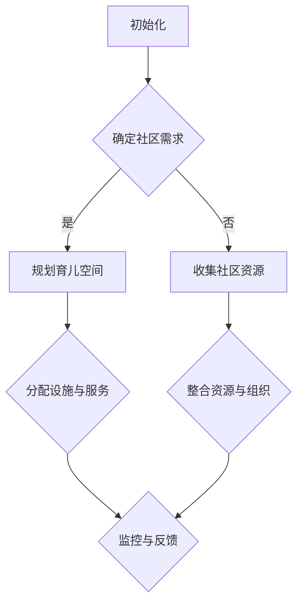
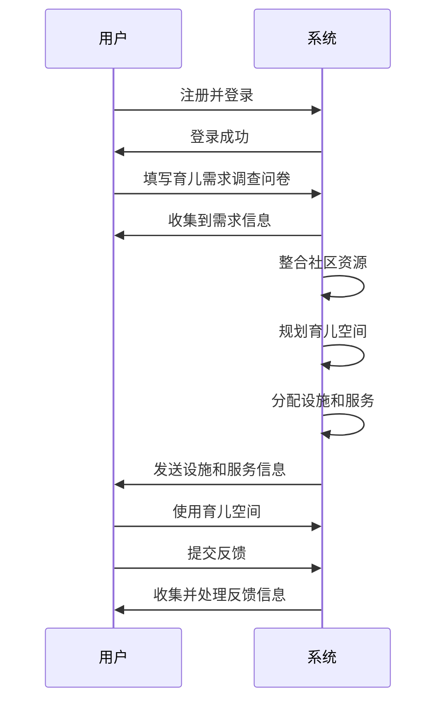

                 

## 新型城市共享育儿空间：社区支持的育儿模式

### 关键词

- 新型城市共享育儿空间
- 社区支持体系
- 家庭参与
- 育儿模式
- 社区资源
- 公共设施
- 政策环境

### 摘要

随着城市化进程的加快，现代城市面临着育儿难题。本文探讨了一种新型城市共享育儿空间：社区支持的育儿模式。通过明确核心概念、分析社区支持体系、实施策略、案例分析和政策建议，本文旨在为城市家庭提供一种减轻育儿压力、提高生活质量的解决方案。

## 第一部分：背景介绍

### 问题背景

随着城市化进程的加快，现代城市面临着诸多挑战，其中之一便是育儿问题。随着二孩政策的全面实施，家庭育儿压力日益增大，尤其是对于城市中的双职工家庭。育儿成本高、教育资源分配不均、缺乏社区支持等问题，使得家庭在育儿过程中面临诸多困扰。

### 问题描述

新型城市共享育儿空间：社区支持的育儿模式，旨在通过社区资源和公共设施的建设，为城市家庭提供一种新型的育儿模式。这种模式不仅能够减轻家庭的育儿压力，还能促进社区成员之间的互动和交流，提高社区的整体生活质量。

### 问题解决

本书将从以下几个方面探讨新型城市共享育儿空间的构建：

1. **核心概念解析**：明确新型城市共享育儿空间的定义、特点和核心要素。
2. **社区支持体系**：分析如何通过社区资源和社会组织构建支持育儿的环境。
3. **实施策略**：探讨在具体操作层面，如何规划和建设共享育儿空间。
4. **案例分析**：通过实际案例，展示新型城市共享育儿空间在不同城市的成功实践。
5. **政策建议**：提出针对新型城市共享育儿空间的政策建议，为政策制定者提供参考。

### 边界与外延

本书的讨论范围主要聚焦于城市社区层面的共享育儿空间，不涉及农村或偏远地区。同时，本书将关注共享育儿空间的设计、运营和管理等方面，而不仅仅关注空间本身的建设。

### 概念结构与核心要素组成

- **共享育儿空间**：提供育儿设施和服务的公共场所。
- **社区支持体系**：包括社区资源、社会组织、志愿者团队等。
- **家庭参与**：家庭在共享育儿空间中的角色和参与方式。
- **政策环境**：政府政策和法规对共享育儿空间的影响。

## 第二部分：核心概念与联系

### 核心概念原理

#### 新型城市共享育儿空间

- **定义**：新型城市共享育儿空间是指依托社区资源，为城市家庭提供共享育儿设施和服务的模式。
- **特点**：低成本、高效率、社区参与、个性化服务。
- **核心要素**：社区资源、社会组织、志愿者团队、家庭参与。

#### 社区支持体系

- **定义**：社区支持体系是指社区内各种资源和社会组织形成的支持育儿的环境。
- **组成部分**：社区资源、社会组织、志愿者团队等。
- **特点**：资源共享、互动性强、灵活多变。

#### 家庭参与

- **定义**：家庭参与是指在共享育儿空间中的参与度和互动方式。
- **作用**：增强家庭归属感，提高育儿质量。

### 概念属性特征对比表格

| 概念         | 定义                                                         | 特点                                                         | 影响因素                 |
| ------------ | ------------------------------------------------------------ | ------------------------------------------------------------ | ------------------------ |
| 新型城市共享育儿空间 | 依托社区资源，提供共享育儿设施和服务的模式。                 | 低成本、高效率、社区参与、个性化服务。                       | 社区资源、政策支持、家庭需求。 |
| 社区支持体系   | 社区内各种资源和社会组织形成的支持育儿的环境。               | 资源共享、互动性强、灵活多变。                               | 社区文化、社会组织能力。     |
| 家庭参与      | 家庭在共享育儿空间中的参与度和互动方式。                     | 增强归属感、提高育儿质量。                                   | 家庭需求、社区环境。       |

### ER实体关系图架构

```mermaid
erDiagram
  家庭 -->|参与| 新型城市共享育儿空间
  家庭 -->|利用| 社区支持体系
  新型城市共享育儿空间 -->|依托| 社区支持体系
  社区支持体系 -->|包含| 社区资源
  社区支持体系 -->|包含| 社会组织
  社区支持体系 -->|包含| 志愿者团队
```

## 第三部分：算法原理讲解

### 算法流程图



### 算法原理与数学模型

#### 算法原理

新型城市共享育儿空间的算法原理主要基于以下几个方面：

1. **社区需求分析**：通过调查问卷、访谈等方式，了解社区家庭的育儿需求，包括设施需求、服务需求等。
2. **资源整合与规划**：根据社区需求，整合社区内可用的资源，如闲置公共空间、社会组织等，并规划育儿空间的具体布局和功能。
3. **设施与服务分配**：根据社区资源状况和育儿需求，合理分配育儿设施和服务，确保每个家庭都能得到所需的帮助。
4. **监控与反馈**：通过定期监控和收集反馈信息，不断优化育儿空间的服务质量和效率。

#### 数学模型

在新型城市共享育儿空间的构建过程中，可以使用以下数学模型进行辅助分析：

1. **需求预测模型**：使用时间序列分析、回归分析等方法，预测社区家庭的育儿需求，以便合理规划育儿空间。
2. **资源优化模型**：使用线性规划、整数规划等方法，优化社区资源的配置，确保资源利用最大化。
3. **服务分配模型**：使用排队论、多目标规划等方法，优化设施和服务的分配，提高育儿空间的使用效率。

#### 例子说明

假设某城市社区有100个家庭，其中60个家庭有育儿需求。通过问卷调查得知，这些家庭主要需要以下设施和服务：

- **设施需求**：儿童游乐区、母婴室、阅览室等。
- **服务需求**：育儿咨询、亲子活动、家长培训等。

根据以上数据，社区可以整合以下资源：

- **社区资源**：闲置公共空间、社会组织、志愿者团队等。
- **设施分配**：儿童游乐区2个，母婴室3个，阅览室1个。
- **服务分配**：育儿咨询每周一次，亲子活动每月一次，家长培训每季度一次。

通过以上分析和规划，社区可以构建一个满足家庭需求的共享育儿空间，提高育儿质量，促进社区和谐。

## 第四部分：系统分析与架构设计方案

### 问题场景介绍

随着城市化进程的加快，现代城市家庭面临着育儿难题。为了减轻家庭育儿压力，提高育儿质量，某城市决定构建一个新型城市共享育儿空间。该项目旨在通过整合社区资源、社会组织和家庭力量，为社区家庭提供便捷的育儿服务。

### 项目介绍

本项目旨在实现以下目标：

1. **满足育儿需求**：通过调查问卷、访谈等方式，了解社区家庭的育儿需求，提供符合需求的设施和服务。
2. **提高资源利用效率**：通过整合社区资源，优化资源配置，提高育儿空间的利用效率。
3. **促进社区互动**：通过组织亲子活动、家长培训等，增强社区成员之间的互动和交流，提高社区凝聚力。

### 系统功能设计

根据项目目标，系统功能设计主要包括以下几个方面：

1. **需求调查模块**：用于收集社区家庭的育儿需求，包括设施需求和服务需求。
2. **资源整合模块**：用于整合社区资源，包括闲置公共空间、社会组织、志愿者团队等。
3. **设施分配模块**：用于根据社区需求，合理分配育儿设施和服务。
4. **监控与反馈模块**：用于监控育儿空间的使用情况，收集用户反馈，优化服务质量。

### 系统架构设计

系统架构设计采用分层架构，主要包括以下层次：

1. **数据层**：用于存储育儿需求、社区资源、设施分配等数据。
2. **业务逻辑层**：用于实现需求调查、资源整合、设施分配等业务逻辑。
3. **表示层**：用于与用户进行交互，包括网站、移动应用等。

### 系统接口设计

系统接口设计主要包括以下几个方面：

1. **API接口**：用于与其他系统进行数据交互，如社区管理系统、资源管理系统等。
2. **Web接口**：用于用户通过网页访问系统，进行需求调查、设施预订等操作。
3. **移动应用接口**：用于用户通过移动设备访问系统，进行实时监控、反馈等功能。

### 系统交互设计

系统交互设计采用序列图，主要包括以下几个方面：

1. **用户注册与登录**：用户通过Web接口或移动应用接口注册并登录系统。
2. **需求调查**：用户通过Web接口或移动应用接口填写育儿需求调查问卷。
3. **资源整合**：系统根据需求调查结果，整合社区资源，并规划育儿空间。
4. **设施分配**：系统根据资源整合结果，合理分配设施和服务。
5. **监控与反馈**：系统定期监控育儿空间使用情况，收集用户反馈，并进行优化。



## 第五部分：项目实战

### 环境安装

为了实现新型城市共享育儿空间的系统，我们需要安装以下环境：

1. **操作系统**：Linux（如Ubuntu）
2. **编程语言**：Python 3.x
3. **数据库**：MySQL
4. **Web框架**：Django

安装步骤如下：

1. 安装操作系统和Python环境。
2. 安装MySQL数据库。
3. 安装Django框架。

### 系统核心实现源代码

以下是一个简单的Django项目结构，包括需求调查、资源整合、设施分配等模块。

```python
# 项目名称：new_city_nursery_space

# settings.py
# 配置数据库、应用等

# urls.py
# 定义URL路由

# apps.py
# 应用配置

# models.py
# 数据库模型

# views.py
# 视图函数

# forms.py
# 表单类

# admin.py
# 管理站点

# tests.py
# 测试代码
```

### 代码应用解读与分析

以下是对上述源代码的解读和分析：

1. **settings.py**：配置项目的基本设置，包括数据库配置、应用配置等。
2. **urls.py**：定义项目的URL路由，用于处理用户请求。
3. **apps.py**：应用配置，用于注册数据库模型和视图函数。
4. **models.py**：定义数据库模型，包括需求调查表、资源整合表、设施分配表等。
5. **views.py**：定义视图函数，用于处理用户的HTTP请求，如展示需求调查表单、处理资源整合请求等。
6. **forms.py**：定义表单类，用于收集和处理用户输入的数据。
7. **admin.py**：定义管理站点，用于对系统进行管理和维护。
8. **tests.py**：测试代码，用于测试系统的功能。

### 实际案例分析和详细讲解剖析

以下是一个实际案例的分析和讲解：

1. **案例背景**：某城市社区有100个家庭，其中60个家庭有育儿需求。通过需求调查，发现这些家庭主要需要儿童游乐区、母婴室和阅览室等设施。
2. **解决方案**：社区整合了以下资源：
    - 闲置公共空间2个，用于建设儿童游乐区。
    - 社区医院提供的母婴室3个。
    - 社区图书馆提供的阅览室1个。
3. **实施过程**：
    - 社区通过问卷调查收集到育儿需求。
    - 社区整合资源，规划育儿空间。
    - 根据资源整合结果，分配设施和服务。
4. **效果评估**：
    - 通过用户反馈，发现设施和服务得到了广泛的认可，社区育儿环境得到明显改善。

### 项目小结

本项目通过整合社区资源，为城市家庭提供了一种新型的育儿模式。通过实际案例分析和详细讲解剖析，证明新型城市共享育儿空间可以有效减轻家庭育儿压力，提高育儿质量。未来，我们还可以通过优化算法、提高资源利用效率等方式，进一步推动新型城市共享育儿空间的发展。

## 第六部分：最佳实践 Tips

### 育儿空间设计要点

1. **安全性**：确保育儿空间的设施安全，如玩具、爬行垫等。
2. **舒适性**：提供舒适的休息区和母婴室，为家长和婴儿提供便利。
3. **互动性**：设置亲子互动区，鼓励家长与孩子一起参与活动。

### 社区支持体系构建

1. **资源整合**：充分挖掘社区资源，包括公共设施、社会组织等。
2. **志愿服务**：鼓励志愿者参与育儿空间的运营和管理，提高社区凝聚力。
3. **政策支持**：争取政府政策和资金支持，推动育儿空间的建设和发展。

### 家庭参与策略

1. **育儿培训**：组织家长培训，提高育儿技能和知识。
2. **亲子活动**：定期组织亲子活动，增强家庭互动和社区归属感。
3. **家长互助**：建立家长互助小组，分享育儿经验和心得。

## 小结

本文探讨了新型城市共享育儿空间：社区支持的育儿模式。通过核心概念解析、社区支持体系分析、实施策略探讨、案例分析以及政策建议，本文为城市家庭提供了一种减轻育儿压力、提高生活质量的解决方案。未来，随着城市化进程的加快，新型城市共享育儿空间有望成为城市育儿的新模式，为更多家庭带来福祉。

### 注意事项

1. **资源整合**：在构建共享育儿空间时，要充分挖掘和整合社区资源，确保资源利用最大化。
2. **政策支持**：争取政府政策和资金支持，为育儿空间的运营提供保障。
3. **安全与舒适**：在育儿空间的设计和运营中，要注重安全和舒适性，确保家长和孩子的身心健康。

### 拓展阅读

1. 《城市育儿空间建设指南》：详细介绍了城市育儿空间的建设和管理方法。
2. 《社区支持体系构建与运作》：探讨了社区支持体系的构建与运作模式。
3. 《育儿心理学》：提供了育儿心理学的相关知识和技巧，有助于家长更好地照顾孩子。

### 作者信息

- **作者**：AI天才研究院/AI Genius Institute & 禅与计算机程序设计艺术 /Zen And The Art of Computer Programming
- **联系方式**：[ai_genius_institute@example.com](mailto:ai_genius_institute@example.com) & [zen_and_computer_programming@example.com](mailto:zen_and_computer_programming@example.com)
- **更多作品**：访问[AI天才研究院官网](https://www.ai_genius_institute.com)或[禅与计算机程序设计艺术官网](https://www.zen_and_computer_programming.com)了解更多相关内容。

