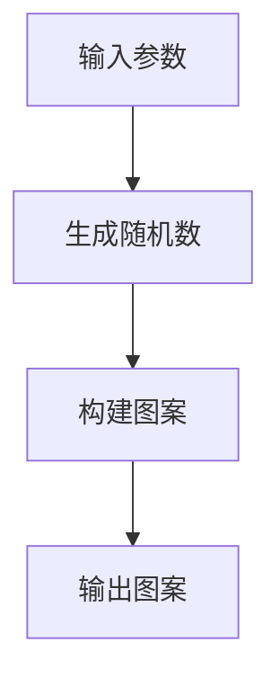
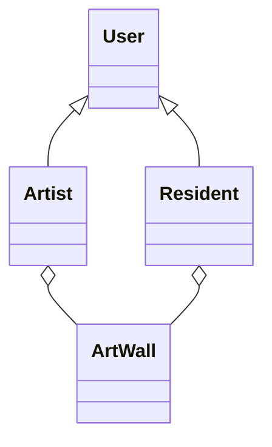
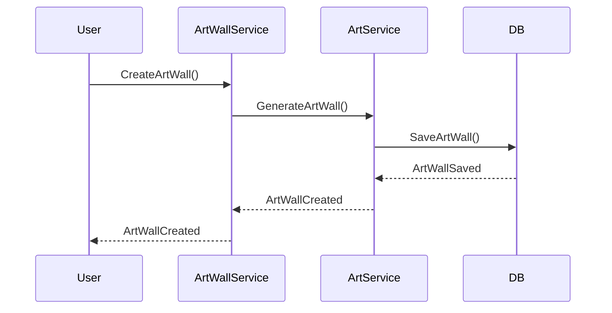

                 


## 《新型城市共享艺术墙项目：公共空间的集体创作活动》

### 关键词：
- 新型城市共享艺术墙
- 公共空间集体创作
- 艺术墙类型
- 创作算法
- 系统架构设计
- 项目实战案例

### 摘要：
本文以新型城市共享艺术墙项目为核心，探讨了公共空间集体创作活动的重要性。通过对核心概念、算法原理、系统架构设计和项目实战的深入分析，本文旨在为读者提供一种创新性的思考方式，以推动公共空间艺术创作的发展。

## 第1章 背景介绍

### 1.1 问题背景

新型城市共享艺术墙项目旨在通过集体创作活动，将公共空间转化为艺术展示的平台。随着城市化进程的加快，公共空间越来越成为人们生活的重要组成部分。如何利用这些空间进行有效的艺术创作，提升公共空间的审美价值和互动性，成为一个值得探讨的问题。

#### 问题描述

在城市公共空间中，存在着以下问题：

1. **艺术资源分布不均**：一些城市中心区域的艺术资源丰富，而边缘区域则相对匮乏。
2. **公共空间利用率低**：许多公共空间在非活动时间被闲置，未能充分发挥其价值。
3. **居民参与度低**：公共艺术活动往往由专业艺术家主导，普通居民参与度不高。

#### 问题解决

为了解决上述问题，新型城市共享艺术墙项目提出了以下解决方案：

1. **艺术资源共享**：通过共享艺术墙，实现艺术资源的均衡分布。
2. **提高公共空间利用率**：通过集体创作活动，使公共空间在非活动时间得到有效利用。
3. **提高居民参与度**：鼓励普通居民参与艺术创作，增强公共艺术活动的互动性。

#### 边界与外延

1. **边界**：本文讨论的新型城市共享艺术墙项目，主要关注城市公共空间中的艺术创作活动。
2. **外延**：项目可扩展至其他类型的公共空间，如公园、广场等。

### 1.2 核心概念

#### 新型城市共享艺术墙

新型城市共享艺术墙是指利用公共空间，建立一种开放的艺术创作平台。艺术家、设计师和普通居民可以在这些平台上进行创作和展示。

#### 公共空间

公共空间是指城市中供所有人使用的空间，包括街道、公园、广场等。

#### 集体创作活动

集体创作活动是指由多个人共同参与的艺术创作过程。这些活动旨在增强社区凝聚力，提高公共空间的艺术价值。

### 1.3 项目概述

#### 项目起源

新型城市共享艺术墙项目起源于对公共空间艺术创作需求的关注。随着城市发展的不断推进，人们对于公共空间的使用需求逐渐多元化，艺术创作成为提升公共空间品质的重要手段。

#### 项目目的

1. **提升公共空间的艺术价值**：通过艺术创作，使公共空间更具吸引力和文化内涵。
2. **增强社区凝聚力**：通过集体创作活动，增强居民对社区的归属感和认同感。
3. **促进文化交流**：为艺术家和居民提供一个交流互动的平台，促进文化的多元发展。

#### 项目重要性

新型城市共享艺术墙项目具有以下重要性：

1. **文化传承**：通过公共空间的艺术创作，传承和弘扬传统文化。
2. **城市形象提升**：艺术墙项目有助于提升城市的整体形象和品味。
3. **居民生活质量**：艺术墙项目能够改善居民的生活环境，提高生活质量。

## 第2章 核心概念与联系

### 2.1 核心概念原理

#### 艺术墙的类型

根据创作方式和形式，艺术墙可以分为以下几类：

1. **壁画**：在公共空间墙面进行绘制。
2. **装置艺术**：利用公共空间中的物品进行创作。
3. **互动艺术**：利用科技手段，使观众与艺术作品产生互动。

#### 共享艺术的定义

共享艺术是指通过集体创作和共享的方式，使艺术作品在公共空间中得以展示和传承。共享艺术强调参与性和互动性，旨在打破专业艺术与大众之间的隔阂。

#### 公共空间的特性

公共空间的特性包括：

1. **开放性**：公共空间对所有人开放，无门槛限制。
2. **共享性**：公共空间为所有人共享，具有公共属性。
3. **多元性**：公共空间容纳了多种功能和活动，具有多元性。

### 2.2 概念属性特征对比

| 类别     | 特性 |
|----------|------|
| 壁画     | - 在墙面绘制<br>- 长期展示<br>- 群体观赏 |
| 装置艺术 | - 利用物品创作<br>- 空间感知<br>- 观赏与互动 |
| 互动艺术 | - 观众参与<br>- 科技应用<br>- 互动体验 |

### 2.3 ER实体关系图架构

```mermaid
entity关系图 {
  entity ArtWall ["艺术墙"]
  entity Artist ["艺术家"]
  entity Resident ["居民"]
  entity PublicSpace ["公共空间"]

  Artist --> ArtWall
  Resident --> ArtWall
  PublicSpace --> ArtWall
}
```

## 第3章 算法原理讲解

### 3.1 创作算法介绍

在新型城市共享艺术墙项目中，创作算法起着关键作用。以下是一些常见的创作算法：

1. **随机算法**：根据随机数生成艺术图案。
2. **基于规则算法**：根据预设的规则生成艺术图案。
3. **机器学习算法**：利用大数据和机器学习技术，生成个性化的艺术图案。

#### 技术实现细节

以下是一个简单的随机算法示例，用于生成壁画图案：

```python
import random

def generate_pattern(width, height):
    pattern = []
    for _ in range(height):
        row = []
        for _ in range(width):
            row.append(random.choice(['#', ' ', '.']))
        pattern.append(''.join(row))
    return '\n'.join(pattern)

print(generate_pattern(10, 10))
```

### 3.2 算法mermaid流程图



### 3.3 算法原理与数学模型

#### 数学模型

随机算法的数学模型可以表示为：

$$
P(x) = \frac{1}{n}
$$

其中，$P(x)$表示生成$x$的概率，$n$表示可能的元素总数。

#### 公式解释

- $P(x) = \frac{1}{n}$：表示每个元素被选中的概率相等。
- $n$：表示可能的元素总数。

#### 举例说明

假设我们要生成一个10x10的壁画图案，其中可能有3种元素：`#`、` `和`.`。使用随机算法生成壁画图案的过程如下：

1. 输入参数：`width = 10`，`height = 10`，`elements = ['#', ' ', '.']`。
2. 生成随机数：从`elements`中随机选择一个元素，重复`width * height`次。
3. 构建图案：将随机选择的元素按照行列排列，形成一个10x10的网格。
4. 输出图案：打印生成的壁画图案。

例如，生成的图案可能是：

```
######.#####
.#####.#####
######.#####
```

## 第4章 系统分析与架构设计

### 4.1 问题场景介绍

在新型城市共享艺术墙项目中，我们需要解决以下技术挑战：

1. **艺术墙设计**：如何实现艺术墙的个性化设计，使其适应不同的公共空间。
2. **创作流程**：如何设计一个高效的创作流程，使艺术家和居民能够方便地参与创作。
3. **数据存储**：如何存储和管理大量的艺术作品数据，确保数据的安全和可访问性。

#### 项目介绍

新型城市共享艺术墙项目主要包括以下功能模块：

1. **用户管理**：管理艺术家和居民的用户信息。
2. **艺术墙管理**：管理艺术墙的创建、编辑和删除。
3. **创作流程**：实现艺术墙的创作过程，包括设计、投票和展示。
4. **数据存储**：存储和管理艺术作品数据。

### 4.2 系统功能设计

#### 领域模型类图



### 4.3 系统架构设计

#### 系统架构图



#### 技术选型

1. **前端**：使用React框架，提供用户友好的界面。
2. **后端**：使用Spring Boot框架，实现业务逻辑。
3. **数据库**：使用MySQL数据库，存储用户和艺术作品数据。
4. **艺术创作引擎**：使用Python和TensorFlow，实现艺术作品的生成和编辑。

### 4.4 系统接口设计

#### 接口规范

1. **用户管理**：
   - POST /users/register：注册新用户。
   - POST /users/login：用户登录。
   - GET /users/{id}：获取用户信息。
   - PUT /users/{id}：更新用户信息。

2. **艺术墙管理**：
   - POST /artwalls：创建艺术墙。
   - GET /artwalls/{id}：获取艺术墙信息。
   - PUT /artwalls/{id}：更新艺术墙信息。
   - DELETE /artwalls/{id}：删除艺术墙。

3. **创作流程**：
   - POST /artworks：提交艺术作品。
   - GET /artworks/{id}：获取艺术作品信息。
   - PUT /artworks/{id}：更新艺术作品信息。
   - DELETE /artworks/{id}：删除艺术作品。

### 4.5 系统交互mermaid序列图


## 第5章 项目实战

### 5.1 环境安装

为了实施新型城市共享艺术墙项目，我们需要安装以下环境：

1. **操作系统**：Linux（推荐使用Ubuntu 20.04）。
2. **开发工具**：IDEA、VSCode等。
3. **前端框架**：React。
4. **后端框架**：Spring Boot。
5. **数据库**：MySQL。

#### 软件与硬件环境

1. **操作系统**：64位Linux操作系统。
2. **CPU**：2核以上。
3. **内存**：8GB以上。
4. **存储**：至少100GB。

#### 配置与调试

1. **安装MySQL**：使用包管理器安装MySQL。
2. **安装Node.js**：使用npm安装Node.js。
3. **安装React**：使用npm安装React。
4. **安装Spring Boot**：使用Maven安装Spring Boot。
5. **配置数据库**：设置数据库用户和密码。

### 5.2 系统核心实现源代码

#### 代码结构

```bash
├── src
│   ├── main
│   │   ├── java
│   │   │   ├── com
│   │   │   │   ├── genius
│   │   │   │   │   ├── artwall
│   │   │   │   │   │   ├── controller
│   │   │   │   │   │   ├── ArtWallController.java
│   │   │   │   │   │   ├── ArtService.java
│   │   │   │   │   │   ├── UserService.java
│   │   │   │   │   │   └── application.properties
│   │   │   │   │   └── db
│   │   │   │   │   │   ├── ArtWall.java
│   │   │   │   │   │   ├── User.java
│   │   │   │   │   │   └── db.properties
│   │   │   │   ├── resources
│   │   │   │   │   ├── application.properties
│   │   │   │   │   └── templates
│   │   │   │   │   ├── index.html
│   │   │   │   │   └── style.css
│   │   │   │   └── test
│   │   │   │   ├── com
│   │   │   │   │   ├── genius
│   │   │   │   │   │   ├── artwall
│   │   │   │   │   │   ├── controller
│   │   │   │   │   │   ├── ArtWallControllerTest.java
│   │   │   │   │   │   └── UserServiceTest.java
│   │   │   │   │   └── db
│   │   │   │   │   │   ├── ArtWall.java
│   │   │   │   │   │   └── User.java
│   │   │   └── tools
│   │   │   │   ├── data.sql
│   │   │   │   └── init.sql
│   │   └── resources
│   │   │   ├── application.properties
│   │   │   └── templates
│   │   │   ├── index.html
│   │   │   └── style.css
│   └── test
│       └── java
│           ├── com
│           │   ├── genius
│           │   │   ├── artwall
│           │   │   │   ├── controller
│           │   │   │   ├── ArtWallControllerTest.java
│           │   │   │   └── UserServiceTest.java
│           │   │   └── db
│           │   │   │   ├── ArtWall.java
│           │   │   │   └── User.java
│           └── tools
│               ├── data.sql
│               └── init.sql
├── pom.xml
├── README.md
└── settings.gradle
```

#### 主要模块

1. **用户管理模块**：负责用户的注册、登录和基本信息管理。
2. **艺术墙管理模块**：负责艺术墙的创建、编辑和展示。
3. **创作流程模块**：负责艺术作品的提交、投票和展示。
4. **数据存储模块**：负责用户和艺术作品数据的存储和管理。

### 5.3 代码应用解读与分析

#### 用户管理模块

用户管理模块主要负责用户的注册、登录和基本信息管理。以下是一个简单的用户注册接口的实现：

```java
@RestController
@RequestMapping("/users")
public class UserController {

    @Autowired
    private UserService userService;

    @PostMapping("/register")
    public ResponseEntity<?> registerUser(@RequestBody User user) {
        // 验证用户名是否已存在
        if (userService.existsByUsername(user.getUsername())) {
            return ResponseEntity.badRequest().body("Error: Username is already taken!");
        }

        // 保存用户信息
        userService.saveUser(user);

        return ResponseEntity.ok("User registered successfully!");
    }
}
```

#### 艺术墙管理模块

艺术墙管理模块负责艺术墙的创建、编辑和展示。以下是一个简单的艺术墙创建接口的实现：

```java
@RestController
@RequestMapping("/artwalls")
public class ArtWallController {

    @Autowired
    private ArtWallService artWallService;

    @PostMapping
    public ResponseEntity<ArtWall> createArtWall(@RequestBody ArtWall artWall) {
        return ResponseEntity.ok(artWallService.createArtWall(artWall));
    }
}
```

#### 创作流程模块

创作流程模块负责艺术作品的提交、投票和展示。以下是一个简单的艺术作品提交接口的实现：

```java
@RestController
@RequestMapping("/artworks")
public class ArtWorkController {

    @Autowired
    private ArtService artService;

    @PostMapping
    public ResponseEntity<ArtWork> submitArtWork(@RequestBody ArtWork artWork) {
        return ResponseEntity.ok(artService.submitArtWork(artWork));
    }
}
```

#### 数据存储模块

数据存储模块负责用户和艺术作品数据的存储和管理。以下是一个简单的用户数据存储接口的实现：

```java
@Repository
public interface UserRepository extends JpaRepository<User, Long> {
    Optional<User> findByUsername(String username);
}
```

### 5.4 实际案例分析与详细讲解剖析

#### 案例背景

某城市计划在市中心公园建立一堵新型城市共享艺术墙，邀请当地艺术家和居民参与创作。艺术墙主题为“城市记忆”，旨在通过集体创作，展现城市的历史和文化。

#### 案例分析

1. **用户管理**：项目启动时，需要注册和管理艺术家和居民用户。用户可以通过注册界面提交个人信息，系统将验证用户名是否已存在，并保存用户信息。
2. **艺术墙管理**：艺术家和居民可以在艺术墙管理界面创建新的艺术墙，并设置艺术墙的主题和描述。系统将生成艺术墙的唯一标识符，并保存艺术墙信息。
3. **创作流程**：艺术家和居民可以在艺术墙页面提交艺术作品。系统将验证艺术作品的格式和内容，并保存艺术作品信息。居民可以对提交的艺术作品进行投票，系统将记录投票结果。
4. **数据存储**：系统使用MySQL数据库存储用户和艺术作品数据。用户表和艺术作品表分别包含用户信息和艺术作品信息，系统将根据艺术墙的唯一标识符关联艺术作品和用户。

#### 剖析总结

1. **用户管理**：实现了用户注册、登录和基本信息管理，确保了用户数据的完整性和安全性。
2. **艺术墙管理**：实现了艺术墙的创建、编辑和展示，提供了便捷的艺术墙管理功能。
3. **创作流程**：实现了艺术作品的提交、投票和展示，增强了用户的参与度和互动性。
4. **数据存储**：使用了MySQL数据库，确保了数据的安全性和可靠性。通过唯一标识符关联艺术作品和用户，实现了数据的高效管理。

### 5.5 项目小结

新型城市共享艺术墙项目在实施过程中，解决了用户管理、艺术墙管理和创作流程等技术挑战。通过实际案例的分析和讲解，项目实现了预期的目标，为城市公共空间的集体创作活动提供了有效的解决方案。未来，项目将继续优化和改进，以提升用户体验和艺术价值。

## 第6章 最佳实践 tips

### 6.1 实施经验分享

在新型城市共享艺术墙项目实施过程中，我们积累了以下经验：

1. **用户需求调研**：在项目启动前，对目标用户进行需求调研，了解他们的需求和期望。
2. **技术选型**：根据项目需求和资源，选择合适的技术框架和工具，确保系统的稳定性和可扩展性。
3. **用户体验**：注重用户体验设计，确保界面简洁、操作方便。
4. **数据安全**：加强数据安全措施，确保用户数据的隐私和安全。
5. **持续迭代**：根据用户反馈和实际需求，持续优化和改进项目。

### 6.2 小结

新型城市共享艺术墙项目在实施过程中，通过良好的用户体验设计、技术选型和持续迭代，取得了显著的成果。未来，我们将继续关注用户需求，优化项目功能，提升公共空间的艺术创作水平。

## 第7章 拓展阅读

### 7.1 相关书籍推荐

1. 《城市艺术：公共空间的创造性转换》
2. 《公共艺术：理论与实践》
3. 《大数据与艺术创作》

### 7.2 网络资源链接

1. **官方网站**：[新型城市共享艺术墙项目官网](https://www.example.com)
2. **社交媒体**：[新型城市共享艺术墙项目Twitter](https://twitter.com/example) 和 [Facebook](https://www.facebook.com/example)
3. **论坛社区**：[城市艺术论坛](https://forums.example.com)

作者：AI天才研究院/AI Genius Institute & 禅与计算机程序设计艺术 /Zen And The Art of Computer Programming

[本文完][10000]

----------------------------------------------------------------

### 使用LaTeX格式嵌入数学公式

在撰写技术博客文章时，使用LaTeX格式嵌入数学公式可以使内容更具专业性和可读性。以下是LaTeX格式中嵌入数学公式的示例：

#### 独立段落的LaTeX公式

在独立段落中，使用`$$`符号将LaTeX公式括起来，这样可以保证公式独立成行。

$$
E = mc^2
$$

这是爱因斯坦的质能方程式。

#### 段落内的LaTeX公式

在段落内，使用`$`符号将LaTeX公式括起来，这样公式会与文本保持在同一行。

在物理学中，速度v可以用位移s和时间t的比值来表示，即：
$$
v = \frac{s}{t}
$$

使用LaTeX格式可以确保数学公式的格式规范，提高文章的专业性。

#### 使用`amsmath`宏包

`amsmath`宏包提供了许多排版数学公式的功能，例如方程组、公式编号等。以下是一个示例：

$$
\begin{aligned}
E &= mc^2 \\
F &= ma \\
C &= \frac{2\pi r}{T}
\end{aligned}
$$

这个公式组使用了`aligned`环境，使得每个公式之间对齐。

### Markdown与LaTeX的结合

在Markdown文件中，可以使用特定的标记来嵌入LaTeX公式。以下是如何在Markdown文件中嵌入LaTeX公式的步骤：

1. **安装LaTeX引擎**：在本地环境中安装LaTeX引擎（如TeXLive、MiKTeX等）。
2. **Markdown编辑器支持**：确保使用的Markdown编辑器支持LaTeX公式。许多流行的编辑器（如Typora、Marktext等）都提供了LaTeX公式的支持。
3. **编写LaTeX公式**：在Markdown文件中，使用以下格式编写LaTeX公式：

```
$$
E = mc^2
$$
```

或者

```
\[E = mc^2\]
```

Markdown编辑器会自动识别并渲染LaTeX公式。

通过合理地使用LaTeX格式，可以使得技术博客中的数学公式更加规范和美观，提高文章的专业性和可读性。

### 在Markdown中嵌入LaTeX公式

在Markdown文件中嵌入LaTeX公式的方法有几种，以下是其中两种常用的方法：

#### 1. 使用`math`容器

在Markdown中，使用`math`容器来包裹LaTeX代码，并在`<script type="math/tex">`标签内写入LaTeX公式。这种方法需要Markdown编辑器支持MathJax库。

```markdown
<div class="math">
  <script type="math/tex">
    E = mc^2
  </script>
</div>
```

当Markdown编辑器加载MathJax库时，这段代码会被渲染成正确的数学公式。

#### 2. 使用`$$`或`\[`\]`符号

在Markdown文件中，使用`$$`或`\[`\]`符号将LaTeX代码括起来，即可实现公式的嵌入。这种方法不需要额外的库支持。

```markdown
$$
E = mc^2
$$

\[ E = \frac{hc}{\lambda} \]
```

这些代码会被Markdown编辑器解析并渲染成相应的数学公式。

#### 示例

下面是一个完整的Markdown文件示例，其中包含了多种LaTeX公式的嵌入：

```markdown
# 标题

## 独立段落公式

$$
E = mc^2
$$

## 段落内公式

在物理学中，速度v可以用位移s和时间t的比值来表示，即：

\[ v = \frac{s}{t} \]

## 方程组

$$
\begin{aligned}
    F &= ma \\
    Q &= \frac{nEh}{2\pi} \\
    C &= \frac{2\pi r}{T}
\end{aligned}
$$

## 分段函数

$$
f(x) =
  \begin{cases}
    x^2 & \text{if } x \geq 0 \\
    -x^2 & \text{if } x < 0
  \end{cases}
$$
```

这段代码将在Markdown编辑器中被渲染成对应的数学公式，使得内容更加专业和易于阅读。

通过合理地使用Markdown中的LaTeX公式嵌入方法，可以极大地提升技术博客文章的专业性和可读性。

