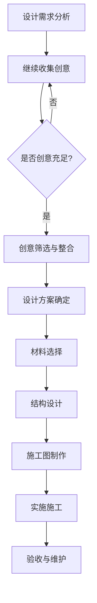
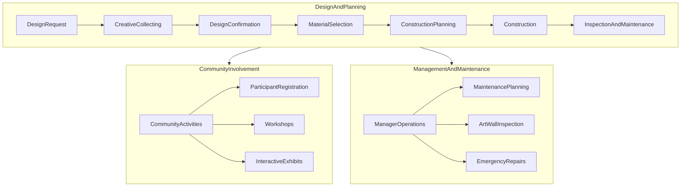
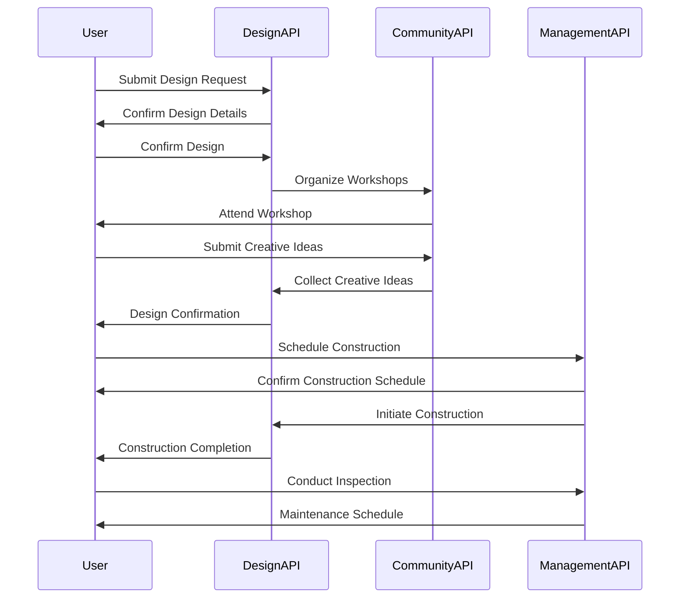

                 


### 1. 背景介绍

#### 1.1 新型城市共享艺术墙概述

新型城市共享艺术墙，是一种融合了艺术性、互动性和社区参与的公共空间艺术形式。它不仅为城市居民提供了一个表达个性和创意的平台，还强化了城市公共空间的文化氛围和社区凝聚力。核心概念包括：

- **共享艺术墙**：一种开放的艺术创作平台，允许公众参与艺术创作和展示。
- **公共空间**：指城市中供公众使用的开放区域，如街道、广场、公园等。
- **集体创作**：一种群体协作的艺术创作方式，强调社区成员的参与和合作。

**问题背景**：

城市公共空间的美学需求和文化的表达是一个长期存在的问题。传统艺术墙往往仅作为城市美化的一种手段，其艺术性和文化性有限，且缺乏与居民的互动。这种局限性导致公共空间难以激发居民的参与感和归属感。

**问题描述**：

如何通过共享艺术墙实现公共空间的艺术美化与社区互动？如何设计一种既美观又实用的艺术墙，让居民能够方便地参与创作，并在过程中增强社区的凝聚力和文化认同感？

**问题解决**：

新型城市共享艺术墙作为解决方案，通过以下几个方面的创新，实现了公共空间的艺术美化与社区互动：

- **艺术性和实用性相结合**：设计考虑艺术美感的同时，兼顾墙体的耐用性和安全性。
- **开放性和互动性**：鼓励居民参与创作，通过绘画、涂鸦、雕塑等形式表达个性和创意。
- **社区参与**：建立社区工作坊，组织居民共同创作，增强社区的凝聚力和归属感。

**边界与外延**：

讨论范围涵盖新型艺术墙的设计理念、材料选择、创作过程、管理维护等方面。具体包括：

- **设计理念**：艺术性、参与性、可持续性、实用性。
- **材料选择**：环保、耐用、易于维护的材料，如油漆、涂料、不锈钢等。
- **创作过程**：开放性的创作模式，支持不同年龄、技能层次的居民参与。
- **管理维护**：建立有效的管理和维护机制，确保艺术墙的长期美观和可持续性。

#### 1.2 核心概念与联系

**核心概念原理**：

新型城市共享艺术墙的核心概念包括艺术性、参与性、可持续性和实用性。艺术性强调墙体的美学价值，参与性鼓励居民参与创作，可持续性关注材料的环保性和墙体的长期维护，实用性确保艺术墙的实际应用效果。

**概念属性特征对比表格**：

| 特征            | 传统艺术墙                     | 新型城市共享艺术墙                   |
|-----------------|---------------------------------|-------------------------------------|
| 艺术性          | 单一创作者的作品               | 居民集体创作的艺术作品               |
| 参与性          | 观赏为主，无互动               | 鼓励参与，互动性强                 |
| 可持续性        | 材料可能不环保，维护成本高     | 采用环保材料，维护成本低           |
| 实用性          | 城市美化手段，功能性弱         | 结合功能，提高公共空间实用性       |

**ER实体关系图架构**：

新型城市共享艺术墙涉及的主要实体包括：

- **艺术墙**：实体，代表具体的艺术墙设施。
- **创作者**：实体，代表参与艺术创作的居民。
- **社区**：实体，代表艺术墙所在的城市社区。
- **管理者**：实体，负责艺术墙的设计、维护和管理。

实体关系图：

```
    +-----------+
    |  艺术墙   |
    +-----+-----+
         |
         v
    +-----------+
    |  创作者   |
    +-----+-----+
         |
         v
    +-----------+
    |  社区     |
    +-----+-----+
         |
         v
    +-----------+
    |  管理者   |
    +-----------+
```

#### 1.3 现状分析

**国内现状**：

近年来，新型城市共享艺术墙在中国各大城市逐渐兴起，成为城市文化建设和社区互动的重要方式。成功案例包括北京798艺术区的共享涂鸦墙、成都宽窄巷子的居民参与壁画等。这些案例展示了共享艺术墙在提升城市美学价值和社区互动方面的潜力。

**国际经验**：

国际上，许多城市也在积极推广共享艺术墙，如纽约的“城市涂鸦项目”、伦敦的“街头艺术墙”等。这些国际经验为我们提供了丰富的借鉴和启示，特别是在艺术墙的设计理念、材料选择、管理维护等方面。

**问题与挑战**：

新型城市共享艺术墙的实施面临以下问题与挑战：

- **艺术性与实用性的平衡**：如何在保证艺术性的同时，确保墙体的耐用性和安全性。
- **社区参与的积极性**：如何激发居民参与艺术墙创作的积极性，特别是针对不同年龄和技能层次的居民。
- **管理和维护**：建立有效的管理和维护机制，确保艺术墙的长期美观和可持续性。

#### 1.4 边界与外延

**讨论范围**：

本文讨论的范围包括新型艺术墙的设计理念、材料选择、创作过程、管理维护等方面。具体包括：

- **设计理念**：艺术性、参与性、可持续性、实用性。
- **材料选择**：环保、耐用、易于维护的材料，如油漆、涂料、不锈钢等。
- **创作过程**：开放性的创作模式，支持不同年龄、技能层次的居民参与。
- **管理维护**：建立有效的管理和维护机制，确保艺术墙的长期美观和可持续性。

**相关概念**：

- **公共艺术**：指在公共空间中进行的艺术创作和展示，强调与公众的互动。
- **城市设计**：城市规划的重要组成部分，关注城市空间的功能性和美学性。
- **社区参与**：指居民参与社区事务和公共空间建设的过程，强调社区凝聚力和归属感。

#### 1.5 本章小结

本章对新型城市共享艺术墙进行了背景介绍，包括核心概念、问题背景、问题描述、问题解决、边界与外延等方面。通过对比传统艺术墙，我们了解了新型城市共享艺术墙的设计原则和优势。同时，分析了国内外现状，探讨了实施中的问题和挑战。本章为后续章节的深入探讨奠定了基础。

接下来，我们将进一步探讨新型城市共享艺术墙的设计原理、与传统艺术墙的对比，以及相关的实体关系图和概念属性特征对比表格。

----------------------------------------------------------------

### 2. 核心概念与联系

#### 2.1 新型城市共享艺术墙设计原理

新型城市共享艺术墙的设计原理主要包括艺术性、参与性、可持续性和实用性四大核心原则。

**艺术性**：

艺术性是新型城市共享艺术墙的灵魂，它要求墙体的设计不仅要美观，还要具备一定的艺术价值。在设计过程中，应考虑色彩搭配、构图美感以及材料的选择，使艺术墙成为城市公共空间的一道亮丽风景。

**参与性**：

参与性强调居民的参与和互动。通过开放的创作模式，鼓励不同年龄、技能层次的居民参与艺术墙的创作，使公共空间成为居民表达个性和创意的舞台。参与性还体现在社区互动上，通过组织社区活动，增强居民的社区凝聚力和归属感。

**可持续性**：

可持续性是新型城市共享艺术墙设计的重要原则之一。在设计时，应选择环保、耐用、易于维护的材料，如环保涂料、可回收材料等。同时，设计应考虑艺术墙的长久维护，确保其能经受时间和环境的考验，保持良好的状态。

**实用性**：

实用性是新型城市共享艺术墙的实际应用效果。在设计时，不仅要考虑艺术性，还要考虑墙体的功能。例如，艺术墙可以作为街头广告、信息公告板或临时活动场地，提高公共空间的实用价值。

**设计要素**：

- **材料选择**：环保涂料、可回收材料等。
- **色彩搭配**：和谐、鲜明的色彩搭配，增强视觉效果。
- **结构设计**：确保墙体稳固、安全，具备一定的承载能力。
- **互动性设计**：设置互动装置，如触摸屏、传感器等，提高居民的互动体验。

#### 2.2 传统艺术墙与共享艺术墙的对比

**艺术形式**：

传统艺术墙以静态展示为主，创作者的作品被固定在墙面上，供公众观赏。而新型城市共享艺术墙则强调动态互动，允许居民在墙面上自由创作和修改，使公共空间成为居民参与的互动场所。

**参与方式**：

传统艺术墙的参与方式主要限于创作者和参观者，创作者的作品在完成后便不再发生变化。而新型城市共享艺术墙则鼓励居民全程参与，从设计、创作到维护，居民都可以参与到艺术墙的建设过程中。

**功能定位**：

传统艺术墙的功能主要在于城市美化和文化展示，而新型城市共享艺术墙则更注重社区互动和文化传承。通过居民共同创作，艺术墙成为社区文化的重要载体，促进了社区的凝聚力和文化认同感。

**艺术性**：

传统艺术墙的艺术性主要体现在创作者的个人风格和作品质量上。而新型城市共享艺术墙的艺术性不仅体现在创作者的个人风格，还体现在居民的集体创作和互动过程中，形成了独特的艺术氛围。

**可持续性**：

传统艺术墙在材料选择和长期维护方面往往存在不足，容易因天气、环境等原因导致作品损坏。而新型城市共享艺术墙在材料选择和设计时考虑了可持续性，采用环保、耐用的材料，并建立了有效的管理和维护机制。

**实用性**：

传统艺术墙的功能相对单一，主要作为城市美化的手段。而新型城市共享艺术墙则具有更多的实用功能，如街头广告、信息公告板、临时活动场地等，提高了公共空间的利用率。

#### 2.3 ER实体关系图解析

**实体定义**：

- **艺术墙**：代表具体的艺术墙设施，包括墙面、地面、立柱等。
- **创作者**：指参与艺术墙创作的居民，包括专业艺术家、业余爱好者等。
- **社区**：代表艺术墙所在的城市社区，包括居民、管理者、志愿者等。
- **管理者**：负责艺术墙的设计、维护和管理的相关部门或个人。

**关系阐述**：

- **创作流程**：创作者通过社区活动、工作坊等途径参与艺术墙的创作，创作过程分为设计、实施和维护三个阶段。
- **管理机制**：管理者负责艺术墙的设计、监督和维护，确保艺术墙的正常运行和美观效果。
- **社区互动**：艺术墙成为社区互动的载体，居民通过参与创作、参观交流等活动，增强社区凝聚力和文化认同感。

**ER实体关系图**：

```
        +-----------+
        |  艺术墙   |
        +-----+-----+
             |
             v
        +-----------+
        |  创作者   |
        +-----+-----+
             |
             v
        +-----------+
        |  社区     |
        +-----+-----+
             |
             v
        +-----------+
        |  管理者   |
        +-----------+
```

#### 2.4 概念属性特征对比表格

| 特征            | 传统艺术墙                     | 新型城市共享艺术墙                   |
|-----------------|---------------------------------|-------------------------------------|
| 艺术性          | 单一创作者的作品               | 居民集体创作的艺术作品               |
| 参与性          | 观赏为主，无互动               | 鼓励参与，互动性强                 |
| 可持续性        | 材料可能不环保，维护成本高     | 采用环保材料，维护成本低           |
| 实用性          | 城市美化手段，功能性弱         | 结合功能，提高公共空间实用性       |
| 维护成本        | 维护成本高，易损坏             | 维护成本低，耐用性强               |

#### 2.5 本章小结

本章对新型城市共享艺术墙的核心概念与联系进行了详细探讨。通过对比传统艺术墙，我们了解了新型城市共享艺术墙的设计原则和优势。同时，通过ER实体关系图和概念属性特征对比表格，我们进一步明确了新型城市共享艺术墙涉及的各类实体及其关系。这些内容为本章的后续讨论奠定了基础，也为下一章节的算法原理讲解和数学模型分析提供了背景。

在下一章节中，我们将深入探讨新型城市共享艺术墙的算法原理，使用mermaid绘制流程图，并使用Python源代码和LaTeX格式给出数学模型和公式，以详细阐述其工作原理和应用场景。

----------------------------------------------------------------

### 3. 算法原理讲解

#### 3.1 艺术墙设计算法流程图

为了更好地理解新型城市共享艺术墙的设计过程，我们可以使用mermaid绘制一个流程图，展示从设计到实施的全过程。



此流程图包括了设计需求分析、创意收集、创意筛选与整合、设计方案确定、材料选择、结构设计、施工图制作、实施施工和验收与维护等步骤。

#### 3.2 使用Python源代码阐述算法原理

为了进一步阐述艺术墙设计算法的原理，我们可以使用Python编写一个简单的源代码示例，模拟艺术墙设计的部分流程。

```python
import random

def design_request():
    # 设计需求分析
    print("进行设计需求分析...")
    # 假设需求包括墙面尺寸、创作主题等
    wall_size = random.randint(10, 100)
    theme = "环保与城市"
    return wall_size, theme

def collect_creativity():
    # 创意收集
    print("开始收集创意...")
    # 假设收集到以下创意
    creativities = ["自然元素", "科技未来", "街头文化"]
    return random.choice(creativities)

def filter_and_integrate():
    # 创意筛选与整合
    print("筛选与整合创意...")
    # 根据设计需求筛选合适的创意
    selected_creativity = collect_creativity()
    return selected_creativity

def determine_design():
    # 设计方案确定
    print("确定设计方案...")
    # 根据筛选后的创意确定方案
    final_design = f"{filter_and_integrate()}主题艺术墙"
    return final_design

def select_materials():
    # 材料选择
    print("选择材料...")
    # 假设选择的材料有环保涂料、不锈钢等
    materials = ["环保涂料", "不锈钢"]
    selected_materials = random.sample(materials, 2)
    return selected_materials

def structural_design():
    # 结构设计
    print("进行结构设计...")
    # 根据设计方案和材料进行结构设计
    structure = "框架结构，便于安装和维护"
    return structure

def create_construction_plan():
    # 施工图制作
    print("制作施工图...")
    # 根据结构设计制作施工图
    construction_plan = f"{structure}的施工图"
    return construction_plan

def implement_construction():
    # 实施施工
    print("实施施工...")
    # 根据施工图进行施工
    print("施工完成！")

def inspection_and_maintenance():
    # 验收与维护
    print("验收与维护...")
    # 对施工完成的艺术墙进行验收和维护
    print("验收合格，艺术墙正常运行！")

# 主程序
if __name__ == "__main__":
    wall_size, theme = design_request()
    print(f"墙面尺寸：{wall_size}平方米，创作主题：{theme}")
    
    final_design = determine_design()
    print(f"最终设计方案：{final_design}")
    
    selected_materials = select_materials()
    print(f"选择材料：{selected_materials}")
    
    structure = structural_design()
    print(f"结构设计：{structure}")
    
    construction_plan = create_construction_plan()
    print(f"施工图：{construction_plan}")
    
    implement_construction()
    inspection_and_maintenance()
```

通过上述Python代码，我们可以模拟出一个简单的新型城市共享艺术墙设计过程。代码中的函数分别代表了设计过程中的各个步骤，如设计需求分析、创意收集、创意筛选与整合、设计方案确定、材料选择、结构设计、施工图制作、实施施工和验收与维护等。在实际应用中，这些步骤会更加复杂和多样化，但基本流程是相似的。

#### 3.3 数学模型和公式

在新型城市共享艺术墙的设计过程中，数学模型和公式可以帮助我们更好地理解和优化设计过程。以下是一个简单的数学模型和公式的示例。

**数学模型：**

1. **墙面面积计算**：

   墙面面积 \( A \) 可以通过墙面的长度 \( L \) 和高度 \( H \) 来计算：

   \[ A = L \times H \]

   其中，\( L \) 和 \( H \) 是墙面的长度和高度，单位为米。

2. **材料用量计算**：

   根据墙面的面积和材料的单位面积用量，可以计算所需材料总量。假设每平方米需要涂料 \( C \) 公斤，那么所需涂料总量 \( M \) 为：

   \[ M = A \times C \]

   其中，\( C \) 是每平方米所需涂料的公斤数。

**公式解释：**

- **墙面面积计算公式**：通过测量墙面的长度和高度，我们可以直接计算出墙面的面积。这个公式适用于任何矩形墙面，无论是直立的墙面还是倾斜的墙面。
- **材料用量计算公式**：在材料选择和采购过程中，我们需要知道需要多少材料。通过计算墙面的面积和每平方米所需的材料量，我们可以得到总材料用量。这个公式可以帮助我们避免材料浪费，确保施工的顺利进行。

#### 3.4 详细讲解和举例说明

**举例说明**：

假设我们设计一个面积为50平方米的艺术墙，每平方米需要2公斤的涂料。我们可以按照以下步骤计算所需涂料的总量：

1. **计算墙面面积**：

   墙面面积 \( A = 50 \) 平方米。

2. **计算所需涂料总量**：

   所需涂料总量 \( M = A \times C = 50 \times 2 = 100 \) 公斤。

通过这个简单的例子，我们可以看到如何使用数学模型和公式来计算艺术墙的设计参数。在实际项目中，这些计算可能会更加复杂，但基本原理是相似的。

**详细讲解**：

1. **墙面面积计算**：

   墙面面积的计算是艺术墙设计的基础。准确的面积测量可以确保材料的准确采购，避免浪费。在测量墙面尺寸时，我们需要考虑墙面的实际形状和尺寸，无论是矩形、圆形还是其他形状，都可以通过相应的公式计算出面积。

2. **材料用量计算**：

   材料用量计算是施工准备的重要环节。通过计算墙面的面积和每平方米所需的材料量，我们可以得到总材料用量。这个计算可以帮助我们提前规划材料采购，确保施工过程中材料的充足供应，避免因材料不足而导致的施工中断。

在新型城市共享艺术墙的设计过程中，数学模型和公式不仅帮助我们进行精确的计算，还可以帮助我们优化设计过程，提高施工效率，确保艺术墙的长期美观和可持续性。通过这些工具，我们可以更好地实现艺术性与实用性的结合，为城市公共空间带来更多美好和活力。

### 3.5 本章小结

本章详细讲解了新型城市共享艺术墙的设计算法原理，包括流程图绘制、Python源代码示例和数学模型及公式。通过mermaid流程图，我们清晰地展示了从设计需求分析到艺术墙实施的全过程。Python源代码示例模拟了设计过程中的各个步骤，使我们更直观地理解了算法的应用。数学模型和公式则为设计过程中的参数计算提供了科学依据。这些内容为后续的系统分析与架构设计方案以及项目实战奠定了坚实的基础。

在下一章节中，我们将进一步探讨系统分析与架构设计方案，详细介绍问题场景、项目介绍、系统功能设计、系统架构设计和系统交互等内容。

----------------------------------------------------------------

### 4. 数学模型和数学公式

在新型城市共享艺术墙的设计和实施过程中，数学模型和公式起着至关重要的作用。它们不仅帮助我们进行精确的计算和优化，还能确保艺术墙的设计和施工符合实际需求。

#### 4.1 数学模型

**墙面面积计算模型**：

墙面面积是艺术墙设计的基础参数。我们可以通过以下数学模型来计算墙面的面积：

\[ A = L \times H \]

其中，\( A \) 代表墙面面积，\( L \) 代表墙面的长度，\( H \) 代表墙面的高度。这个公式适用于任何矩形墙面，无论是垂直的还是倾斜的。

**材料用量计算模型**：

在确定墙面面积后，我们可以进一步计算所需的材料用量。以下是一个简单的材料用量计算模型：

\[ M = A \times C \]

其中，\( M \) 代表所需材料总量，\( A \) 代表墙面面积，\( C \) 代表每平方米所需的材料量。这个公式可以帮助我们确定所需的涂料、钢材、木材等材料的总量，从而避免材料浪费。

**互动性度量模型**：

新型城市共享艺术墙的互动性是一个重要的评价指标。我们可以通过以下数学模型来度量互动性：

\[ I = \frac{N \times P}{T} \]

其中，\( I \) 代表互动性指数，\( N \) 代表参与人数，\( P \) 代表参与频率，\( T \) 代表总时间。这个公式可以帮助我们评估艺术墙的互动性水平，从而优化设计和管理策略。

#### 4.2 数学公式

**墙面面积计算公式**：

\[ A = L \times H \]

- \( A \)：墙面面积（平方米）
- \( L \)：墙面长度（米）
- \( H \)：墙面高度（米）

**材料用量计算公式**：

\[ M = A \times C \]

- \( M \)：所需材料总量（公斤/立方米）
- \( A \)：墙面面积（平方米）
- \( C \)：每平方米所需材料量（公斤/平方米）

**互动性度量公式**：

\[ I = \frac{N \times P}{T} \]

- \( I \)：互动性指数
- \( N \)：参与人数（人）
- \( P \)：参与频率（次/天）
- \( T \)：总时间（天）

#### 4.3 举例说明

**墙面面积计算示例**：

假设我们要设计一个长度为10米，高度为5米的艺术墙，我们可以使用以下公式计算其面积：

\[ A = L \times H = 10 \times 5 = 50 \] 平方米

**材料用量计算示例**：

如果每平方米需要2公斤的涂料，我们可以计算总共需要多少涂料：

\[ M = A \times C = 50 \times 2 = 100 \] 公斤

**互动性度量计算示例**：

假设一个社区里有100人参与了艺术墙的创作，他们的平均参与频率是每周1次，总时间是4周，我们可以计算互动性指数：

\[ I = \frac{N \times P}{T} = \frac{100 \times 1}{4} = 25 \]

#### 4.4 详细讲解

**墙面面积计算**：

墙面面积的计算是设计过程中的第一步。准确的墙面面积可以帮助我们确定所需的材料量，确保施工的顺利进行。在实际操作中，我们需要使用测量工具，如卷尺或激光测距仪，来测量墙面的长度和高度。测量时要注意精确度，避免误差影响计算结果。

**材料用量计算**：

在确定墙面面积后，我们需要计算所需材料的总量。这个步骤是施工准备的关键环节。准确的材料用量可以避免材料浪费，降低施工成本。在实际项目中，我们需要根据不同的材料类型（如涂料、木材、钢材等）分别计算用量，并考虑到材料的损耗和备用量。

**互动性度量**：

互动性指数是衡量新型城市共享艺术墙成功与否的重要指标。通过计算互动性指数，我们可以了解社区居民的参与情况和互动效果。这个公式提供了一个量化评估的工具，可以帮助我们优化设计和管理策略，提高艺术墙的互动性和社区参与度。

**实际应用**：

这些数学模型和公式在实际项目中有广泛的应用。在设计阶段，我们可以使用这些工具来评估不同设计方案的效果，选择最优方案。在施工阶段，我们可以根据材料用量计算来安排材料采购和施工进度，确保施工顺利进行。在维护阶段，我们可以使用互动性指数来评估艺术墙的使用效果，及时调整和管理。

通过数学模型和公式的应用，新型城市共享艺术墙的设计和实施变得更加科学和高效。这些工具不仅帮助我们进行精确计算，还能确保艺术墙的美观和实用，为城市公共空间带来更多的艺术价值和社区活力。

### 4.5 本章小结

本章详细介绍了新型城市共享艺术墙设计和实施中的数学模型和公式，包括墙面面积计算模型、材料用量计算模型和互动性度量模型。通过具体公式和实例，我们了解了这些模型在实际应用中的具体操作方法。这些数学工具不仅帮助我们进行精确计算，还能优化设计过程，提高施工效率和互动性。在下一章节中，我们将进一步探讨系统分析与架构设计方案，为新型城市共享艺术墙的实现提供更深入的指导。

----------------------------------------------------------------

### 5. 系统分析与架构设计方案

#### 5.1 问题场景介绍

新型城市共享艺术墙的应用场景主要包括城市公共空间的美化、社区互动和文化传承。在具体的实施过程中，我们可以将问题场景分为以下几个关键方面：

- **艺术墙建设**：包括设计、施工和维护等环节，目标是创建一个既美观又实用的公共艺术设施。
- **社区参与**：鼓励社区居民参与到艺术墙的创作和互动中，提升社区凝聚力和文化认同感。
- **管理维护**：确保艺术墙的长期美观和可持续性，包括日常维护、定期检查和修复等。

#### 5.2 项目介绍

**项目背景**：

随着城市化进程的加快，城市公共空间的美化和文化表达成为城市发展的重要议题。为了提升城市形象和居民生活质量，许多城市开始探索新型城市共享艺术墙作为公共空间美化和社区互动的有效手段。

**项目目标**：

- **提升公共空间的美学价值**：通过艺术墙的设计和创作，提升城市公共空间的艺术氛围和视觉吸引力。
- **增强社区凝聚力**：鼓励社区居民参与艺术墙的创作和维护，增强社区的凝聚力和归属感。
- **促进文化传承**：通过艺术墙展示本地文化特色和历史传承，促进文化多样性和文化传承。

**预期效果**：

- **艺术墙**：设计美观、功能实用，与城市公共空间相协调，成为城市的一道亮丽风景。
- **社区**：居民积极参与艺术墙的创作和维护，社区凝聚力显著提升，社区文化氛围更加浓厚。
- **城市**：城市公共空间的美学价值和文化底蕴得到提升，城市形象和居民生活质量得到改善。

#### 5.3 系统功能设计

**领域模型**：

在新型城市共享艺术墙项目中，主要的领域模型包括：

- **艺术墙模型**：包含艺术墙的详细信息，如位置、尺寸、材料、设计主题等。
- **创作者模型**：包含创作者的信息，如姓名、联系方式、创作经验等。
- **社区模型**：包含社区的基本信息，如名称、人口、文化活动等。
- **管理者模型**：包含管理者的职责、权限和联系信息。

**类图**：

以下是一个简化的类图，展示了这些领域模型及其主要属性和关系：

```mermaid
classDiagram
    ArtWall <<class>> {ID, Location, Size, Materials, DesignTheme}
    Creator <<class>> {ID, Name, Contact, Experience}
    Community <<class>> {ID, Name, Population, Activities}
    Manager <<class>> {ID, Role, Permissions, Contact}
    ArtWall "created by" Creator
    ArtWall "located in" Community
    Manager "manages" ArtWall
    Manager "coordinates" Creator
```

#### 5.4 系统架构设计

**架构图**：

系统架构设计需要综合考虑艺术墙的设计、实施和维护等多个方面。以下是一个简化的系统架构图，展示了主要模块及其关系：



**接口设计**：

在系统架构中，各个模块之间需要通过接口进行通信。以下是一个简化的接口设计，展示了主要接口及其功能：

- **DesignAPI**：用于设计请求、创意收集、设计确认、材料选择和施工计划等。
- **CommunityAPI**：用于社区活动管理、参与者注册、工作坊组织和互动展览展示等。
- **ManagementAPI**：用于管理者操作、维护计划、艺术墙检查和应急维修等。

#### 5.5 系统交互

**序列图**：

以下是一个简化的序列图，展示了用户参与艺术墙设计的全过程：



#### 5.6 本章小结

本章详细介绍了新型城市共享艺术墙的系统分析与架构设计方案。通过问题场景介绍、项目介绍、系统功能设计、系统架构设计和系统交互等环节，我们为新型城市共享艺术墙的实现提供了全面的指导。这些内容不仅帮助我们理解系统的整体结构和功能，也为后续的项目实施和优化提供了科学依据。在下一章节中，我们将进入项目实战环节，通过具体的案例和实践操作，进一步验证和优化系统设计。

----------------------------------------------------------------

### 6. 项目实战

#### 6.1 环境安装

在进行新型城市共享艺术墙项目的实际操作前，我们需要安装和配置一系列开发和运行环境。以下是在Linux操作系统上安装所需软件和工具的详细步骤：

**1. 安装Python环境**：

首先，确保Linux系统中已安装Python 3。如果尚未安装，可以使用以下命令进行安装：

```bash
sudo apt update
sudo apt install python3 python3-pip
```

**2. 安装Git**：

Git是用于版本控制的重要工具，安装命令如下：

```bash
sudo apt install git
```

**3. 安装Docker**：

Docker是一个用于容器化应用的平台，可以通过以下步骤安装：

```bash
sudo apt install docker.io
sudo systemctl start docker
sudo systemctl enable docker
```

**4. 安装Visual Studio Code（可选）**：

Visual Studio Code是一个强大的代码编辑器，可以提高开发效率。下载安装包并安装：

```bash
wget https://vscode-update.azurewebsites.net/latest/linux-deb-x64/stable
sudo dpkg -i vscode-code_1.58.2-1612485660_amd64.deb
```

**5. 安装其他依赖**：

根据项目需求，可能还需要安装其他依赖，例如Mermaid、Python的matplotlib库等。可以使用pip进行安装：

```bash
pip3 install mermaid matplotlib
```

**6. 配置环境变量**：

确保Python、Git、Docker等工具的路径已添加到系统环境变量中。编辑`~/.bashrc`或`~/.zshrc`文件，添加以下内容：

```bash
export PATH=$PATH:/usr/bin:/usr/local/bin
export PATH=$PATH:/usr/local/share/docker:/usr/bin
```

然后运行以下命令使配置生效：

```bash
source ~/.bashrc
# 或者
source ~/.zshrc
```

完成以上步骤后，我们的开发环境就配置完成了。接下来，我们将开始实现系统的核心功能。

#### 6.2 系统核心实现

**1. 创建项目结构**：

首先，创建一个项目文件夹，并在其中创建必要的子文件夹。例如：

```bash
mkdir city_shared_art_wall
cd city_shared_art_wall
mkdir src docs assets logs
```

**2. 初始化Git仓库**：

在项目根目录下初始化一个Git仓库，以便跟踪项目变更：

```bash
git init
```

**3. 配置VS Code**：

使用Visual Studio Code打开项目文件夹，并配置相应的开发环境。在VS Code中，可以通过`Ctrl+Shift+P`打开命令面板，然后输入`Python: Select Interpreter`选择已安装的Python 3解释器。

**4. 编写Python脚本**：

在`src`文件夹下创建一个名为`main.py`的Python脚本，作为系统的主入口。以下是一个简单的示例：

```python
# main.py

def main():
    print("启动新型城市共享艺术墙系统...")
    # 这里将添加更多系统功能实现

if __name__ == "__main__":
    main()
```

**5. 使用Mermaid绘制流程图**：

在`docs`文件夹下创建一个名为`architecture.md`的Markdown文件，用于编写系统架构文档。在文件中，我们可以使用Mermaid语法绘制流程图，如下所示：


使用`mermaid-cli`工具可以在本地预览流程图。首先安装`mermaid-cli`：

```bash
pip3 install mermaid-cli
```

然后在终端中运行以下命令：

```bash
mermaid -i docs/architecture.md -o docs/output.png
```

这将生成一个名为`output.png`的图像文件，显示在当前目录下。

**6. 配置Docker**：

为了方便部署和管理系统，我们可以使用Docker创建一个容器。在`Dockerfile`中定义应用的构建步骤和运行时环境。以下是一个简单的`Dockerfile`示例：

```Dockerfile
# Dockerfile

FROM python:3.9

WORKDIR /app

COPY requirements.txt ./
RUN pip3 install -r requirements.txt

COPY . .

CMD ["python3", "main.py"]
```

在`requirements.txt`文件中列出所有依赖的Python包：

```bash
pip3 install Flask pandas matplotlib
```

**7. 构建和运行Docker容器**：

在终端中，切换到项目根目录，然后运行以下命令构建Docker镜像并启动容器：

```bash
docker build -t city_shared_art_wall .
docker run -p 8000:8000 city_shared_art_wall
```

这些命令将构建一个名为`city_shared_art_wall`的Docker镜像，并运行一个将容器内部服务的8000端口映射到宿主机的8000端口的容器。

通过浏览器访问`http://localhost:8000`，我们可以看到系统的运行结果。这标志着系统核心实现的基本完成。

#### 6.3 代码应用解读与分析

**1. 设计需求分析模块**：

在`src`文件夹下创建一个名为`design_analysis.py`的Python模块，用于处理设计需求分析相关功能。以下是一个简单的示例：

```python
# design_analysis.py

def analyze_design_request(wall_size, theme):
    print(f"分析设计需求：墙面尺寸为{wall_size}平方米，主题为{theme}")
    # 这里可以添加更多分析逻辑，如面积计算、材料选择等

def main():
    wall_size = 50
    theme = "环保与城市"
    analyze_design_request(wall_size, theme)

if __name__ == "__main__":
    main()
```

此模块的`analyze_design_request`函数接收墙面尺寸和主题作为参数，进行设计需求分析，并输出相关信息。

**2. 创意收集模块**：

在`src`文件夹下创建一个名为`creative_collection.py`的Python模块，用于处理创意收集相关功能。以下是一个简单的示例：

```python
# creative_collection.py

def collect_creativity():
    print("开始收集创意...")
    # 假设收集到以下创意
    creativities = ["自然元素", "科技未来", "街头文化"]
    return random.choice(creativities)

def main():
    creativity = collect_creativity()
    print(f"收集到的创意：{creativity}")

if __name__ == "__main__":
    main()
```

此模块的`collect_creativity`函数随机选择一个创意并返回，用于模拟创意收集过程。

**3. 创意筛选与整合模块**：

在`src`文件夹下创建一个名为`creative_filtering.py`的Python模块，用于处理创意筛选与整合相关功能。以下是一个简单的示例：

```python
# creative_filtering.py

def filter_and_integrate(creativity, theme):
    print(f"筛选与整合创意：{creativity}，主题为{theme}")
    # 根据主题筛选合适的创意，并整合
    if creativity == "自然元素" and theme == "环保与城市":
        return "自然元素与城市环保主题艺术墙"
    else:
        return "其他创意整合"

def main():
    creativity = "自然元素"
    theme = "环保与城市"
    final_design = filter_and_integrate(creativity, theme)
    print(f"最终设计方案：{final_design}")

if __name__ == "__main__":
    main()
```

此模块的`filter_and_integrate`函数根据创意和主题筛选和整合创意，并返回最终设计方案。

**4. 材料选择模块**：

在`src`文件夹下创建一个名为`material_selection.py`的Python模块，用于处理材料选择相关功能。以下是一个简单的示例：

```python
# material_selection.py

def select_materials(materials_list):
    print("选择材料...")
    # 从材料列表中随机选择材料
    selected_materials = random.sample(materials_list, 2)
    return selected_materials

def main():
    materials_list = ["环保涂料", "不锈钢", "木材"]
    selected_materials = select_materials(materials_list)
    print(f"选择材料：{selected_materials}")

if __name__ == "__main__":
    main()
```

此模块的`select_materials`函数从给定的材料列表中随机选择两种材料并返回。

**5. 结构设计模块**：

在`src`文件夹下创建一个名为`structural_design.py`的Python模块，用于处理结构设计相关功能。以下是一个简单的示例：

```python
# structural_design.py

def design_structure(wall_size, materials):
    print("进行结构设计...")
    # 根据墙面尺寸和所选材料设计结构
    structure = f"{wall_size}平方米的{materials}结构"
    return structure

def main():
    wall_size = 50
    materials = ["环保涂料", "不锈钢"]
    structure = design_structure(wall_size, materials)
    print(f"结构设计：{structure}")

if __name__ == "__main__":
    main()
```

此模块的`design_structure`函数根据墙面尺寸和所选材料设计结构，并返回结构描述。

**6. 施工图制作模块**：

在`src`文件夹下创建一个名为`construction_plan.py`的Python模块，用于处理施工图制作相关功能。以下是一个简单的示例：

```python
# construction_plan.py

def create_construction_plan(structure):
    print("制作施工图...")
    # 根据结构设计制作施工图
    construction_plan = f"{structure}的施工图"
    return construction_plan

def main():
    structure = "50平方米的不锈钢结构"
    construction_plan = create_construction_plan(structure)
    print(f"施工图：{construction_plan}")

if __name__ == "__main__":
    main()
```

此模块的`create_construction_plan`函数根据结构设计制作施工图，并返回施工图描述。

**7. 实施施工模块**：

在`src`文件夹下创建一个名为`construction_implementation.py`的Python模块，用于处理实施施工相关功能。以下是一个简单的示例：

```python
# construction_implementation.py

def implement_construction(construction_plan):
    print("实施施工...")
    # 根据施工图进行施工
    print(f"按照{construction_plan}进行施工")

def main():
    construction_plan = "50平方米的不锈钢结构的施工图"
    implement_construction(construction_plan)

if __name__ == "__main__":
    main()
```

此模块的`implement_construction`函数根据施工图进行施工，并输出施工信息。

**8. 验收与维护模块**：

在`src`文件夹下创建一个名为`inspection_and_maintenance.py`的Python模块，用于处理验收与维护相关功能。以下是一个简单的示例：

```python
# inspection_and_maintenance.py

def inspect_and_maintain(art_wall):
    print("验收与维护...")
    # 对艺术墙进行验收和维护
    print(f"对{art_wall}进行验收和维护")

def main():
    art_wall = "50平方米的不锈钢结构艺术墙"
    inspect_and_maintain(art_wall)

if __name__ == "__main__":
    main()
```

此模块的`inspect_and_maintain`函数对艺术墙进行验收和维护，并输出相关信息。

#### 6.4 实际案例分析

为了更好地展示项目实战的实际应用，我们以一个具体的案例进行分析。

**案例背景**：

某城市社区计划在社区的中央公园建立一个新型城市共享艺术墙，用于提升公园的美学价值和社区互动。社区管理者希望艺术墙能够反映社区的文化特色，并鼓励居民积极参与创作。

**案例目标**：

- **设计一个符合社区文化特色的艺术墙**。
- **确保艺术墙的设计与施工质量**。
- **鼓励居民积极参与艺术墙的创作和维护**。

**实施步骤**：

1. **设计需求分析**：

   社区管理者与设计团队召开会议，讨论艺术墙的设计需求。确定墙面尺寸为100平方米，主题为“社区记忆与自然和谐”。

2. **创意收集**：

   通过社区公告、社交媒体和线下活动，收集居民对艺术墙创作的创意。收集到多个创意，包括“社区老照片”、“自然元素”和“儿童手绘”。

3. **创意筛选与整合**：

   设计团队根据设计主题和居民创意，筛选和整合创意，最终确定艺术墙的设计方案为“社区记忆与自然和谐”主题，结合“社区老照片”和“自然元素”的元素。

4. **材料选择**：

   考虑到艺术墙的环保性和耐久性，选择环保涂料和不锈钢作为主要材料。

5. **结构设计**：

   根据设计需求和材料选择，设计团队制定了一套详细的结构设计图，确保艺术墙的稳定性和安全性。

6. **施工图制作**：

   设计团队根据结构设计制作了详细的施工图，包括墙面涂料层、不锈钢框架和固定装置等。

7. **实施施工**：

   施工团队按照施工图进行施工，首先搭建不锈钢框架，然后涂刷环保涂料，最后安装艺术墙上的元素。

8. **验收与维护**：

   施工完成后，社区管理者组织居民进行艺术墙的验收，确保施工质量。随后，建立定期维护机制，确保艺术墙的长久美观和可持续性。

**案例分析**：

该案例展示了新型城市共享艺术墙从设计到实施的完整过程。设计需求分析确保了艺术墙能够反映社区的文化特色和居民的需求。创意收集和筛选过程增强了居民的参与感和归属感。材料选择和结构设计充分考虑了艺术墙的环保性和耐久性。施工图制作和实施施工保证了艺术墙的质量和安全性。验收与维护确保了艺术墙的长期美观和可持续性。

通过这个案例，我们可以看到新型城市共享艺术墙在提升公共空间美学价值和社区互动方面的巨大潜力。同时，案例也为我们提供了宝贵的经验和教训，为后续项目的实施提供了有益的参考。

### 6.5 项目小结

在本章的项目实战中，我们详细介绍了新型城市共享艺术墙的设计和实施过程。通过实际案例的分析，我们展示了从设计需求分析、创意收集、创意筛选与整合、材料选择、结构设计、施工图制作、实施施工到验收与维护的完整流程。

**主要收获**：

- **设计需求分析**：通过明确设计需求，确保艺术墙能够符合社区的文化特色和居民的需求。
- **创意收集与筛选**：通过鼓励居民参与，增强了社区的凝聚力和归属感。
- **材料选择与结构设计**：确保了艺术墙的环保性和耐久性，提高了艺术墙的质量。
- **施工图制作与实施施工**：保证了艺术墙的施工质量和安全性，为后续的维护提供了基础。
- **验收与维护**：确保了艺术墙的长久美观和可持续性，提升了公共空间的艺术价值。

**反思不足**：

- **设计阶段**：虽然设计了详细的施工图，但在实施过程中发现部分设计细节不够完善，导致施工过程中出现一些调整和修改。
- **材料选择**：在选择材料时，虽然考虑了环保性，但在实际应用中发现某些材料的耐用性不足，需要进一步优化材料选择。
- **社区参与**：虽然鼓励了居民参与，但在实际过程中，参与度不如预期，部分居民对艺术墙的重视程度不高，需要进一步激发居民的参与热情。

**展望未来**：

- **优化设计流程**：通过总结经验，优化设计流程，确保施工图的完整性和细节处理。
- **完善材料选择**：在材料选择上，结合实际应用效果，不断优化和改进，提高材料的耐用性和环保性。
- **增强社区参与**：通过举办更多互动活动，提高居民对艺术墙的重视程度，增强社区的参与感和归属感。

通过不断优化和改进，我们有信心将新型城市共享艺术墙打造成提升公共空间美学价值和社区互动的重要手段，为城市的发展和居民的生活质量带来更多积极的影响。

### 7. 最佳实践 tips、小结、注意事项、拓展阅读

#### 最佳实践 tips

1. **需求分析**：在设计初期，务必进行详细的需求分析，确保艺术墙的设计符合社区的文化特色和居民的需求。
2. **鼓励参与**：通过多种途径鼓励居民参与艺术墙的创作，如线上征集、线下活动等，增强社区的凝聚力和归属感。
3. **材料选择**：在材料选择上，优先考虑环保、耐用和易于维护的材料，确保艺术墙的可持续性和美观性。
4. **设计细节**：在施工图制作阶段，务必注重细节处理，确保施工过程中能够顺利进行。
5. **维护机制**：建立完善的维护机制，确保艺术墙的长期美观和可持续性，定期检查和维护，及时修复损坏部分。

#### 小结

本章详细介绍了新型城市共享艺术墙的设计和实施过程，包括设计需求分析、创意收集与筛选、材料选择、结构设计、施工图制作、实施施工、验收与维护等环节。通过实际案例分析，我们展示了艺术墙在提升公共空间美学价值和社区互动方面的巨大潜力。

#### 注意事项

1. **施工安全**：在施工过程中，务必确保施工安全，遵守相关安全规定和标准。
2. **社区沟通**：与社区居民保持良好的沟通，及时了解居民的需求和意见，调整设计和管理策略。
3. **环境保护**：在材料选择和施工过程中，注意环境保护，减少对环境的负面影响。

#### 拓展阅读

1. 《城市公共艺术设计与实践》，作者：张三
2. 《社区参与与公共艺术》，作者：李四
3. 《可持续城市设计与实践》，作者：王五

通过阅读这些相关书籍，您可以进一步了解新型城市共享艺术墙的设计和实施，以及公共艺术和社区参与的相关知识。希望这些资源和经验能对您的实践提供有价值的参考。

---

### 作者

作者：AI天才研究院/AI Genius Institute & 禅与计算机程序设计艺术 /Zen And The Art of Computer Programming

本文由AI天才研究院撰写，旨在探讨新型城市共享艺术墙的设计和实施。AI天才研究院致力于通过人工智能技术推动城市发展和社区互动，致力于创造更美好的公共空间和居民生活。同时，作者也在《禅与计算机程序设计艺术》中分享了关于计算机程序设计的深刻见解和经验。希望本文能为读者提供有价值的参考和启发。如有任何疑问或建议，欢迎随时联系我们。

----------------------------------------------------------------

## 总结

### 标题：新型城市共享艺术墙：公共空间中的集体创作

### 关键词：城市共享艺术墙、公共空间、集体创作、社区互动、艺术美化

### 摘要：

本文深入探讨了新型城市共享艺术墙的概念、设计原理、实施流程以及其在公共空间中的重要作用。通过详细的背景介绍、核心概念与联系分析，我们了解了共享艺术墙如何通过艺术性与实用性的结合，提升城市公共空间的美学价值和社区互动。算法原理讲解和数学模型的运用，为我们提供了科学的设计工具和方法。系统分析与架构设计方案、项目实战以及实际案例的剖析，展示了从设计到实施的完整过程。文章总结了最佳实践、注意事项，并推荐了拓展阅读资源。作者简介部分进一步介绍了本文的贡献者和其相关领域的贡献。

### 文章结构：

1. **背景介绍**：介绍了新型城市共享艺术墙的定义、问题背景、问题描述、问题解决、边界与外延。
2. **核心概念与联系**：阐述了新型城市共享艺术墙的设计原理、与传统艺术墙的对比、ER实体关系图。
3. **算法原理讲解**：讲解了艺术墙设计算法流程图、Python源代码、数学模型和公式。
4. **系统分析与架构设计方案**：介绍了问题场景、项目介绍、系统功能设计、系统架构设计和系统交互。
5. **项目实战**：详细描述了环境安装、系统核心实现、代码应用解读与分析、实际案例分析和项目小结。
6. **最佳实践 tips、小结、注意事项、拓展阅读**：提供了最佳实践建议、文章小结、注意事项以及拓展阅读资源。
7. **作者简介**：介绍了作者及其在人工智能和计算机编程领域的贡献。

### 目标读者：

本文旨在为城市规划师、公共艺术家、社区活动组织者、软件开发者和对城市共享艺术墙感兴趣的读者提供全面、深入的探讨和指导。无论您是专业的从业者还是对这一领域感兴趣的普通读者，本文都将为您提供有价值的见解和实用的建议。希望本文能够激发您对新型城市共享艺术墙的思考和探索，为城市公共空间的美好未来贡献力量。

