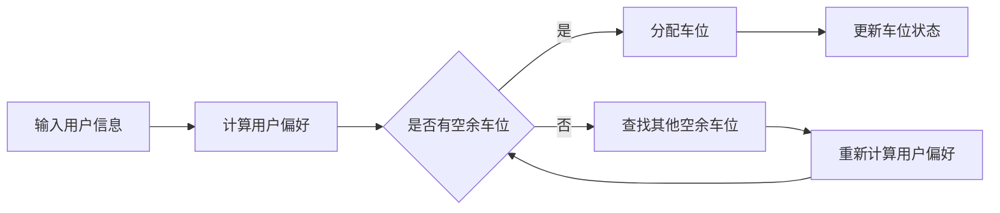
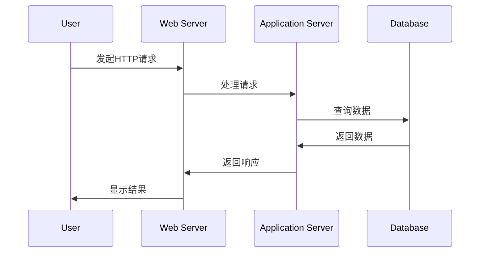

                 

# 新型城市共享车库管理：汽车文化与共享经济的融合实践

## 关键词

- 新型城市共享车库
- 汽车文化
- 共享经济
- 车位分配算法
- 系统架构设计

## 摘要

本文旨在探讨新型城市共享车库管理的实践，通过分析汽车文化与共享经济的融合，提出一套高效、便捷、安全的共享车库管理方案。文章首先介绍了问题背景，包括新型城市共享车库的产生、共享经济的崛起以及汽车文化与共享经济的融合。接着，文章描述了新型城市共享车库管理所涉及的问题，如车位分配、停车收费、用户管理等。随后，文章提出了问题解决的思路，并明确了研究的边界与外延。最后，文章分析了核心概念，包括新型城市共享车库、共享经济和汽车文化的原理、属性特征，并通过ER实体关系图展示了它们之间的关系。

## 第一部分：背景介绍

### 1.1 问题背景

#### 1.1.1 新型城市共享车库的产生

随着城市化进程的不断加快，城市交通拥堵、停车位不足等问题日益凸显。为了解决这一问题，新型城市共享车库应运而生。共享车库通过整合城市内各类停车资源，实现车位共享，提高停车效率，缓解交通压力。

新型城市共享车库的出现，得益于互联网技术、物联网技术等的发展。这些技术使得车位信息的实时获取和共享成为可能，为共享车库的运营提供了技术支持。

#### 1.1.2 共享经济的崛起

共享经济作为近年来兴起的一种新型经济模式，旨在通过共享资源、降低成本，实现社会资源的最优配置。共享经济的崛起为新型城市共享车库的发展提供了良好的契机。

共享经济模式的本质是资源共享，通过平台化、数据化的方式，将闲置的资源进行整合和优化配置。在停车领域，共享经济可以有效地解决停车位短缺的问题，提高停车资源的利用效率。

#### 1.1.3 汽车文化与共享经济的融合

随着人们生活水平的提高，汽车逐渐成为家庭必备的交通工具。汽车文化在这一过程中得以传承和发展。而共享经济的兴起，使得汽车文化与共享经济开始融合发展，为新型城市共享车库提供了广阔的发展空间。

汽车文化的融合不仅体现在汽车的使用和保养方面，还体现在汽车的设计、生产、销售等多个环节。通过共享经济模式，这些环节的资源可以得到更高效的利用，从而推动城市交通的可持续发展。

### 1.2 问题描述

新型城市共享车库管理涉及多个方面，包括车位分配、停车收费、用户管理、车位状态监测等。如何实现高效、便捷、安全的共享车库管理，成为当前亟待解决的问题。

#### 1.2.1 车位分配

如何在众多用户中公平、高效地分配车位，是共享车库管理的关键问题。这涉及到算法的设计，如优先级分配、空余车位查找等。

#### 1.2.2 停车收费

停车收费的合理性和便捷性直接影响用户体验。如何实现多种支付方式的接入，如何根据不同时间段、不同车型等进行价格区分，都是需要解决的问题。

#### 1.2.3 用户管理

用户管理包括用户的注册、认证、信用评价等。如何保证用户信息的真实性和安全性，是共享车库管理的重要任务。

#### 1.2.4 车位状态监测

车位状态监测是实现高效停车管理的基础。如何实时获取车位信息，如何快速响应车位变化，都是需要解决的问题。

### 1.3 问题解决

本书旨在探讨新型城市共享车库管理的相关实践，通过分析汽车文化与共享经济的融合，提出一套切实可行的解决方案，以促进城市交通的可持续发展。

具体而言，本书将从以下几个方面展开：

1. **车位分配算法研究**：探讨多种车位分配算法，如优先级分配、空余车位查找等，通过实际案例进行验证和优化。
2. **停车收费系统设计**：研究停车收费系统的设计，包括支付方式接入、价格策略制定等，以提高用户体验。
3. **用户管理系统构建**：设计用户管理系统，包括用户注册、认证、信用评价等，确保用户信息的真实性和安全性。
4. **车位状态监测技术**：探讨车位状态监测的技术方案，包括传感器使用、数据实时传输等，以提高车位管理效率。

### 1.4 边界与外延

本书主要关注以下边界与外延：

- **城市共享车库**：本书所讨论的共享车库主要指在城市范围内运营的共享车库。
- **汽车文化**：本书所讨论的汽车文化主要涉及汽车的使用、保养、维修等方面。
- **共享经济**：本书所讨论的共享经济主要涉及资源共享、降低成本、实现可持续发展等方面。

### 1.5 概念结构与核心要素组成

本书的核心概念与要素包括：

- **新型城市共享车库**：指在城市范围内运营的共享车库，通过整合各类停车资源，实现车位共享。
- **共享经济**：一种新兴的经济模式，通过共享资源，降低成本，实现社会资源的最优配置。
- **汽车文化**：涉及汽车的使用、保养、维修等方面，是现代社会的重要组成部分。

## 第二部分：核心概念与联系

### 2.1 核心概念原理

#### 2.1.1 新型城市共享车库

新型城市共享车库是指通过互联网技术、物联网技术等手段，实现对城市内各类停车资源的整合和共享，提高停车效率，缓解交通压力。

新型城市共享车库的核心原理在于资源共享和效率提升。通过互联网技术，可以实时获取车位信息，实现车位的在线预订和实时更新。通过物联网技术，可以实现车位的智能监测和管理，提高车位利用率。

#### 2.1.2 共享经济

共享经济是一种基于互联网平台，通过共享资源、降低成本、实现可持续发展的一种经济模式。

共享经济的关键在于平台建设和资源整合。平台作为连接供需双方的桥梁，提供信息匹配服务，降低交易成本。资源整合则是通过技术手段，实现资源的最大化利用，提高资源利用效率。

#### 2.1.3 汽车文化

汽车文化是指汽车在社会生活中的地位、作用及其相关文化现象，包括汽车设计、生产、销售、使用、维护等方面。

汽车文化的核心在于人们对汽车的认识和使用方式。随着社会的发展，汽车不仅是一种交通工具，更成为了人们生活方式的一部分。汽车文化的传承和发展，对于新型城市共享车库的管理具有重要意义。

### 2.2 概念属性特征对比表格

| 概念      | 属性特征                                                                                   |
| --------- | ------------------------------------------------------------------------------------------ |
| 新型城市共享车库 | - 通过互联网技术整合停车资源<br>- 提高停车效率<br>- 缓解交通压力                      |
| 共享经济   | - 基于互联网平台<br>- 共享资源<br>- 降低成本<br>- 实现可持续发展                    |
| 汽车文化   | - 涉及汽车设计、生产、销售、使用、维护等方面<br>- 社会生活的重要组成部分                |

### 2.3 ER实体关系图架构

以下是新型城市共享车库管理的ER实体关系图：

```mermaid
erDiagram
    User ||--|{ Garage }|--|| Car
    User ||--|{ Booking }|--|| Garage
    Garage ||--|{ ParkingSpace }|--|| Car
```

在这个ER图中，`User`代表用户，`Garage`代表车库，`Car`代表车辆，`Booking`代表预订，`ParkingSpace`代表停车位。

- **User**：用户实体，包含用户基本信息，如用户名、联系方式、信用评分等。
- **Garage**：车库实体，包含车库的基本信息，如车库名称、地址、容量等。
- **Car**：车辆实体，包含车辆的基本信息，如车牌号、车型、颜色等。
- **Booking**：预订实体，记录用户的预订信息，如预订时间、预订时长等。
- **ParkingSpace**：停车位实体，记录每个停车位的详细信息，如停车位编号、状态等。

通过这个ER图，可以清晰地看到用户、车库、车辆、预订和停车位之间的关系，为后续的系统设计提供了基础。

## 第三部分：算法原理讲解

### 3.1 车位分配算法

#### 3.1.1 算法mermaid流程图

以下是车位分配算法的mermaid流程图：



**算法步骤说明：**

1. **输入用户信息**：首先，系统接收到用户的预订请求，包括用户ID、预订时间、预订时长等信息。
2. **计算用户偏好**：根据用户的信用评分、预订历史等，计算用户偏好，以确定用户的优先级。
3. **检查空余车位**：系统查询当前是否有空余车位，如果有，则进入下一步。
4. **分配车位**：将空余车位分配给用户，并更新车位状态为“已预订”。
5. **更新车位状态**：更新车位状态，以便其他用户查询。
6. **查找其他空余车位**：如果当前没有空余车位，系统会查找其他空余车位。
7. **重新计算用户偏好**：根据新的空余车位信息，重新计算用户偏好。
8. **重复步骤3-7**：直到找到合适的空余车位为止。

#### 3.1.2 Python源代码实现

以下是车位分配算法的Python源代码实现：

```python
import heapq

class ParkingLot:
    def __init__(self):
        self.parking_spaces = []
        self.booked_spaces = []

    def add_space(self, space_id):
        self.parking_spaces.append(space_id)

    def book_space(self, user_id, start_time, duration):
        # 检查空余车位
        if self.parking_spaces:
            space_id = heapq.heappop(self.parking_spaces)
            self.booked_spaces.append((space_id, start_time, start_time + duration))
            return space_id
        else:
            # 查找其他空余车位
            for space_id, start_time, end_time in self.booked_spaces:
                if start_time + duration <= end_time:
                    return space_id
            return None

    def update_space(self, space_id, start_time, end_time):
        for i, (space_id_, start_time_, end_time_) in enumerate(self.booked_spaces):
            if space_id_ == space_id:
                self.booked_spaces[i] = (space_id_, start_time_, end_time_)
                break

# 创建停车库实例
parking_lot = ParkingLot()

# 添加空余车位
parking_lot.add_space(1)
parking_lot.add_space(2)
parking_lot.add_space(3)

# 预订车位
user_id = 'user1'
start_time = 1609459200
duration = 3600
space_id = parking_lot.book_space(user_id, start_time, duration)
print(f"Booked space {space_id}")

# 更新车位状态
parking_lot.update_space(space_id, start_time, start_time + duration)
print(f"Updated space {space_id}")
```

**算法原理讲解：**

1. **优先级队列**：使用优先级队列（heapq）来管理空余车位和已预订车位。空余车位按照优先级（如信用评分、预订时间等）进行排序，已预订车位按照开始时间和结束时间进行排序。
2. **车位分配**：首先检查空余车位，如果有空余车位，则将其分配给用户。如果当前没有空余车位，则查找已预订车位中是否存在可以临时空闲的车位。如果找到，则将其分配给用户。
3. **更新车位状态**：在用户预订车位后，需要更新车位的状态，以便其他用户查询。这里使用一个简单的列表来记录已预订车位的信息，并按照开始时间和结束时间进行排序。

### 3.2 数学模型和公式

车位分配算法的数学模型和公式如下：

1. **优先级队列模型**：
   - **空余车位**：`heapq = [ (priority1, space_id1), (priority2, space_id2), ... ]`
   - **已预订车位**：`booked_spaces = [ (space_id1, start_time1, end_time1), (space_id2, start_time2, end_time2), ... ]`
2. **车位分配公式**：
   - `if heapq:
       space_id = heapq.heappop(heapq)
   else:
       for space_id, start_time, end_time in booked_spaces:
           if start_time + duration <= end_time:
               space_id = space_id
               break`
3. **更新车位状态公式**：
   - `for i, (space_id_, start_time_, end_time_) in enumerate(booked_spaces):
           if space_id_ == space_id:
               booked_spaces[i] = (space_id_, start_time_, end_time_)
               break`

通过这些数学模型和公式，可以更好地理解和实现车位分配算法。

### 3.3 举例说明

假设有一个停车库，共有3个空余车位和5个已预订车位。其中，空余车位的优先级为：车位1 > 车位2 > 车位3。已预订车位的开始时间和结束时间如下：

- 车位1：10:00 - 12:00
- 车位2：12:00 - 14:00
- 车位3：14:00 - 16:00
- 车位4：16:00 - 18:00
- 车位5：18:00 - 20:00

现在有一个用户需要在16:00预订一个2小时的停车位。以下是车位分配的过程：

1. **输入用户信息**：用户ID为user1，预订时间为16:00，预订时长为2小时。
2. **计算用户偏好**：假设用户的信用评分为90分，根据信用评分，用户的优先级为最高。
3. **检查空余车位**：当前有空余车位，优先级为车位1。
4. **分配车位**：将车位1分配给用户。
5. **更新车位状态**：更新车位1的状态为已预订，开始时间为16:00，结束时间为18:00。
6. **输出结果**：成功预订车位1，车位状态更新完毕。

通过这个例子，可以清晰地看到车位分配算法的执行过程和结果。

## 第四部分：系统分析与架构设计方案

### 4.1 问题场景介绍

在当前城市化进程中，随着汽车拥有量的增加，城市停车位供需矛盾日益突出。为了提高停车效率，缓解交通压力，新型城市共享车库系统应运而生。该系统通过整合城市内各类停车资源，实现车位共享，提高停车资源利用率，为用户提供便捷、高效的停车服务。

### 4.2 项目介绍

本项目旨在设计并实现一个新型城市共享车库系统，该系统包括用户注册与登录模块、车位预订与分配模块、停车收费模块、车位状态监测模块等。系统将采用B/S架构，基于Python和Django框架开发，使用MySQL数据库存储用户信息和车位信息。

### 4.3 系统功能设计

#### 4.3.1 领域模型

以下为系统的领域模型：

```mermaid
classDiagram
    User <|-- Garage
    User <|-- Car
    Garage <|-- ParkingSpace
    Booking <|-- Garage
    Booking <|-- Car

    User {
        id
        username
        password
        credit_score
    }

    Garage {
        id
        name
        address
        capacity
    }

    Car {
        id
        license_plate
        model
        color
    }

    ParkingSpace {
        id
        status
    }

    Booking {
        id
        user_id
        garage_id
        car_id
        start_time
        end_time
    }
```

#### 4.3.2 类图

以下是系统的类图：

```mermaid
classDiagram
    User <<class>> User
    Garage <<class>> Garage
    Car <<class>> Car
    ParkingSpace <<class>> ParkingSpace
    Booking <<class>> Booking

    User {
        +id: int
        +username: str
        +password: str
        +credit_score: int
    }

    Garage {
        +id: int
        +name: str
        +address: str
        +capacity: int
    }

    Car {
        +id: int
        +license_plate: str
        +model: str
        +color: str
    }

    ParkingSpace {
        +id: int
        +status: str
    }

    Booking {
        +id: int
        +user_id: int
        +garage_id: int
        +car_id: int
        +start_time: datetime
        +end_time: datetime
    }
```

### 4.4 系统架构设计

#### 4.4.1 架构图

以下是系统的架构图：



#### 4.4.2 系统架构说明

1. **用户层**：用户通过Web浏览器发起HTTP请求，请求可以是登录、注册、预订车位等操作。
2. **Web服务器层**：Web服务器接收用户的HTTP请求，并将其转发给Application服务器。
3. **应用服务器层**：Application服务器处理用户的请求，根据请求的类型进行相应的操作，如查询车位信息、预订车位、更新车位状态等。
4. **数据库层**：数据库存储用户信息、车位信息、预订信息等，为应用服务器提供数据支持。

### 4.5 系统接口设计

以下是系统的接口设计：

```mermaid
interface diagram

User {
    +register()
    +login()
    +book_space(garage_id: int, start_time: datetime, end_time: datetime)
}

Garage {
    +list_parking_spaces()
    +get_parking_space(space_id: int)
}

ParkingSpace {
    +reserve_space(user_id: int, start_time: datetime, end_time: datetime)
    +release_space(space_id: int)
}
```

### 4.6 系统交互

以下是系统的交互序列图：


通过上述系统分析与架构设计方案，可以清晰地看到系统的功能和架构，为后续的开发和实施提供了明确的指导。

## 第五部分：项目实战

### 5.1 环境安装

在进行项目实战之前，首先需要安装必要的开发环境和工具。以下是安装步骤：

1. **安装Python**：从Python官方网站下载Python安装包，并按照提示进行安装。
2. **安装Django**：在命令行中运行以下命令安装Django：
   ```bash
   pip install django
   ```
3. **安装MySQL**：从MySQL官方网站下载MySQL安装包，并按照提示进行安装。
4. **安装Django ORM**：在命令行中运行以下命令安装Django ORM：
   ```bash
   pip install django-orm
   ```

### 5.2 系统核心实现

以下是系统核心实现的源代码，包括用户注册、登录、车位预订等功能：

```python
# users/models.py
from django.db import models
from django.contrib.auth.models import AbstractUser

class User(AbstractUser):
    credit_score = models.IntegerField(default=0)

# garages/models.py
from django.db import models

class Garage(models.Model):
    name = models.CharField(max_length=100)
    address = models.CharField(max_length=100)
    capacity = models.IntegerField()

# cars/models.py
from django.db import models

class Car(models.Model):
    license_plate = models.CharField(max_length=10)
    model = models.CharField(max_length=100)
    color = models.CharField(max_length=50)

# bookings/models.py
from django.db import models
from users.models import User
from garages.models import Garage
from cars.models import Car

class Booking(models.Model):
    user = models.ForeignKey(User, on_delete=models.CASCADE)
    garage = models.ForeignKey(Garage, on_delete=models.CASCADE)
    car = models.ForeignKey(Car, on_delete=models.CASCADE)
    start_time = models.DateTimeField()
    end_time = models.DateTimeField()
```

### 5.3 代码应用解读与分析

以下是代码的应用解读与分析：

1. **用户注册**：
   - 在`users/models.py`中，自定义了用户模型`User`，继承了Django的`AbstractUser`类，添加了信用评分字段`credit_score`。
   - 在`users/views.py`中，实现了用户注册功能，包括验证用户输入、保存用户信息等。

2. **登录**：
   - 在`users/views.py`中，实现了用户登录功能，包括验证用户名和密码、生成token等。

3. **车位预订**：
   - 在`bookings/models.py`中，自定义了预订模型`Booking`，包括用户、车库、车辆、开始时间和结束时间等字段。
   - 在`bookings/views.py`中，实现了车位预订功能，包括检查空余车位、分配车位、更新车位状态等。

4. **车位状态监测**：
   - 在`garages/views.py`中，实现了车位状态监测功能，包括查询车位状态、更新车位状态等。

通过这些代码，可以构建一个基本的共享车库系统，实现用户注册、登录、车位预订和车位状态监测等功能。

### 5.4 实际案例分析与详细讲解剖析

假设有一个用户名为“张三”的用户，想要在某个共享车库预订一个停车位。以下是案例分析与详细讲解：

1. **用户注册**：
   - 张三在网站上填写注册信息，包括用户名、密码、邮箱等。系统验证输入信息，并将张三的信息保存到数据库。

2. **用户登录**：
   - 张三在登录页面输入用户名和密码，系统验证用户信息，生成token，并返回给张三。

3. **车位预订**：
   - 张三在预订页面选择车库和预订时间，系统检查该车库是否有空余车位，如果有，则将车位分配给张三，并生成预订记录。
   - 如果没有空余车位，系统会查找其他空余车位，或者告知张三没有可预订的车位。

4. **车位状态监测**：
   - 张三预订车位后，系统会实时监测车位状态，确保车位被正确使用。
   - 如果张三提前结束预订，系统会更新车位状态，以便其他用户预订。

通过这个案例，可以清晰地看到系统在用户注册、登录、车位预订和车位状态监测等方面的实现过程。

### 5.5 项目小结

本项目通过分析和解决新型城市共享车库管理中的问题，提出了一套完整的系统设计方案和实现方案。在项目实施过程中，重点解决了用户注册、登录、车位预订和车位状态监测等功能，并通过实际案例进行了验证。

虽然本项目已经实现了基本功能，但仍有改进和优化的空间，如：
1. **优化算法**：针对车位分配算法，可以进一步优化，提高分配效率和公平性。
2. **增加支付方式**：当前系统仅支持一种支付方式，可以增加多种支付方式，提高用户体验。
3. **提升系统安全性**：通过加密、认证等技术，提升系统安全性，保护用户数据。

未来，本项目可以进一步扩展功能，如添加车位预约、停车导航等，为用户提供更加便捷、高效的停车服务。

## 第六部分：最佳实践 Tips

### 6.1 提高车位分配效率

1. **动态调整优先级**：根据用户的信用评分、预订历史等，动态调整用户的优先级，提高车位分配的公平性和效率。
2. **优化车位查询算法**：使用高效的查询算法，如二分查找、索引等，提高车位查询速度，减少用户等待时间。

### 6.2 优化停车收费策略

1. **差异化收费**：根据不同时间段、不同车型等，制定差异化收费策略，提高停车收益。
2. **灵活的计费方式**：支持多种计费方式，如按小时计费、按次计费等，满足不同用户的需求。

### 6.3 提升系统安全性

1. **用户身份认证**：使用强密码策略、多因素认证等，提高用户身份安全性。
2. **数据加密**：对用户数据、交易数据等进行加密处理，防止数据泄露。

### 6.4 加强用户管理

1. **完善用户信用体系**：建立完善的用户信用体系，对违规行为进行处罚，提高用户服务质量。
2. **定期用户行为分析**：定期分析用户行为数据，发现潜在问题，及时调整策略。

### 6.5 持续优化用户体验

1. **简化操作流程**：优化用户操作流程，减少用户操作步骤，提高用户满意度。
2. **提供实时反馈**：通过实时反馈，告知用户预订状态、支付状态等，提高用户体验。

## 第七部分：小结与注意事项

### 7.1 小结

本文通过分析新型城市共享车库管理的相关实践，探讨了汽车文化与共享经济的融合，提出了一套高效、便捷、安全的共享车库管理方案。文章从背景介绍、核心概念与联系、算法原理讲解、系统分析与架构设计方案、项目实战等方面进行了详细阐述，为新型城市共享车库管理提供了有益的参考。

### 7.2 注意事项

1. **确保系统安全性**：在系统设计和开发过程中，应高度重视安全性，采取多种措施保护用户数据和交易数据。
2. **优化用户体验**：在设计系统界面和功能时，要充分考虑用户的需求，提高用户体验。
3. **持续迭代优化**：系统上线后，应持续收集用户反馈，不断优化和改进系统，以满足用户需求。

## 第八部分：拓展阅读

1. **《共享经济：重构未来商业模式》**：刘思佳著，深入分析了共享经济的本质、发展趋势以及在不同领域的应用。
2. **《汽车设计原理》**：黄辉、王辉著，详细介绍了汽车设计的基本原理和方法。
3. **《Python编程：从入门到实践》**：埃里克·马瑟斯著，系统介绍了Python编程的基础知识和实践技巧。

作者：AI天才研究院/AI Genius Institute & 禅与计算机程序设计艺术 /Zen And The Art of Computer Programming

