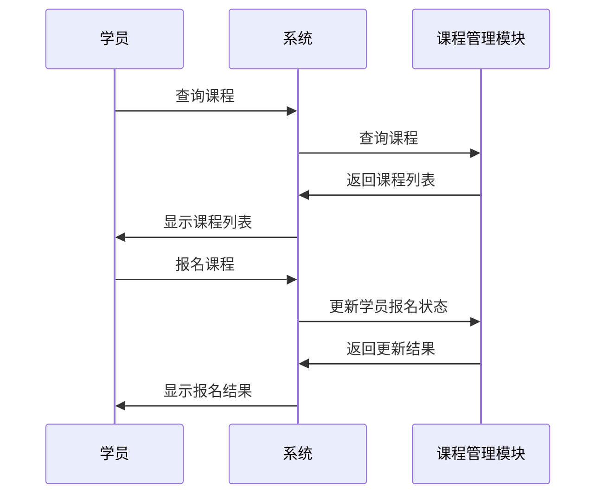
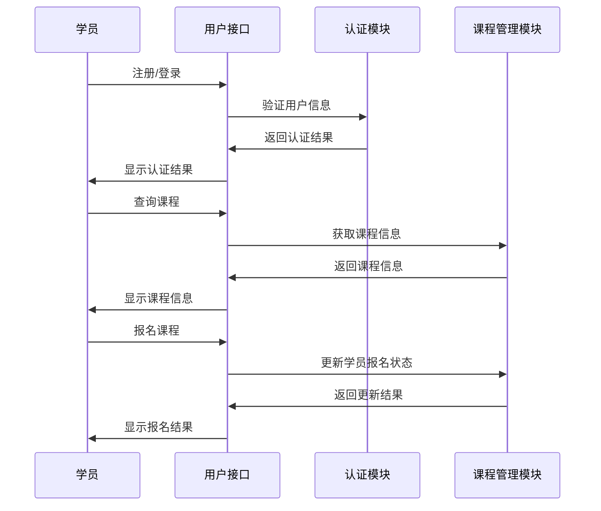

                 


### 引言

在当今数字化和共享经济迅速发展的时代，教育领域也迎来了前所未有的变革。传统的教育模式已经无法满足人们日益增长的多元化、个性化教育需求。特别是音乐教育，作为一项重要的素质教育，它不仅能够提高个人的审美能力和创造力，还能增强人与人之间的情感交流。因此，如何构建一个既具有广泛包容性，又能够提供高质量音乐教育的平台，成为了一个亟待解决的问题。

本文将深入探讨新型城市共享音乐教室这一跨代际音乐教育社区平台的构想。我们将通过逐步分析其背景、核心概念、算法原理以及系统架构设计，来阐述这一创新教育模式如何有效解决当前音乐教育的需求与挑战，并为未来的音乐教育提供新的思路和方向。

## 关键词

- 新型城市共享音乐教室
- 跨代际音乐教育
- 共享经济
- 音乐教育算法
- 社区平台
- 数学模型
- 系统架构设计

## 摘要

本文旨在探讨新型城市共享音乐教室这一创新教育模式的构建，通过分析其背景、核心概念、算法原理及系统架构设计，揭示其如何有效满足不同代际的音乐教育需求，打造一个具有包容性和多样性的音乐教育社区平台。本文首先介绍了新型城市共享音乐教室的背景和问题，接着深入探讨了核心概念及其实施方案，随后讲解了相关算法原理，并通过系统架构设计展示了这一平台的实现细节。最后，本文总结了项目实战经验，并对未来音乐教育的发展提出展望。

## 第一部分：背景介绍

### 第1章：新型城市共享音乐教室概述

#### 1.1 问题背景

#### 1.1.1 音乐教育的需求与挑战

在现代社会，音乐教育的重要性越来越被广泛认可。音乐不仅能丰富人们的精神生活，提高审美能力，还能锻炼人的思维能力、创造力和合作精神。然而，目前音乐教育面临着诸多挑战：

1. **教育资源不均衡**：城市与农村、发达地区与欠发达地区之间的教育资源存在显著差异，导致一些地区音乐教育资源匮乏，学生难以接受高质量的音乐教育。
2. **个体需求多样化**：随着社会的发展，人们对音乐教育的需求日益多样化，不仅限于专业音乐人才的培养，还涵盖了普通人群的素质提升和兴趣爱好满足。
3. **教育方式单一**：传统音乐教育多以个体教学为主，缺乏互动性和社区性，难以满足现代人对于参与感和体验感的需求。

#### 1.1.2 社区音乐教育的重要性

社区音乐教育作为一种补充传统音乐教育的形式，具有独特的优势：

1. **资源整合**：通过社区共享，可以整合分散的教育资源，提高资源利用率，使更多人享受到优质的音乐教育。
2. **互动性强**：社区音乐教育强调师生之间的互动，有利于提高学生的学习兴趣和参与度，促进学生之间的交流与合作。
3. **文化传承**：社区音乐教育能够促进不同代际之间的文化传承，增强社区的凝聚力和文化氛围。

#### 1.1.3 新型城市共享音乐教室的提出

面对上述挑战和需求，新型城市共享音乐教室应运而生。这一概念的提出旨在构建一个以社区为载体，融合共享经济理念和现代信息技术，提供多样化、个性化音乐教育的平台。其主要特点包括：

1. **资源共享**：通过共享经济模式，实现音乐教室、乐器、师资等资源的最大化利用。
2. **跨代际互动**：鼓励不同年龄段的学员和教师之间进行互动，形成知识共享和情感交流的社区。
3. **技术支持**：利用人工智能、大数据等技术手段，为用户提供个性化的学习方案和教学支持。

### 1.2 问题描述

#### 1.2.1 目标：打造一个跨代际的音乐教育社区平台

新型城市共享音乐教室的总体目标是打造一个跨代际的音乐教育社区平台，旨在满足不同代际的音乐教育需求，提升社区的文化氛围，促进音乐教育的普及与多元化。

#### 1.2.2 面临的挑战：如何满足不同代际的音乐教育需求

在实现上述目标的过程中，新型城市共享音乐教室将面临以下挑战：

1. **教育内容的多样化**：不同年龄段的学员对音乐教育的内容和形式有不同的需求，如何提供多样化的教育内容，成为首要问题。
2. **教育资源的平衡**：共享音乐教室需要平衡不同学员的资源需求，确保每位学员都能得到充足的学习资源。
3. **师生互动的管理**：在跨代际的互动过程中，如何确保师生之间、学员之间能够有效沟通和互动，也是一大挑战。

#### 1.2.3 解决方案的关键要素

为了克服上述挑战，新型城市共享音乐教室的解决方案需要包含以下几个关键要素：

1. **共享经济模式**：通过共享经济模式，实现音乐教室、乐器、师资等资源的最大化利用。
2. **个性化学习方案**：利用人工智能技术，为每位学员定制个性化的学习方案，提高学习效果。
3. **社区互动机制**：建立有效的社区互动机制，促进师生之间、学员之间的互动和交流，增强社区凝聚力。

### 1.3 问题解决

#### 1.3.1 构建共享音乐教室的概念

构建共享音乐教室是新型城市共享音乐教室的核心环节。其具体实施步骤包括：

1. **场地选择**：选择交通便利、环境宜人的社区活动中心或学校作为共享音乐教室的场地。
2. **设备采购**：采购各类音乐设备和乐器，确保教室能够满足不同学员的需求。
3. **师资招募**：招募经验丰富、教学水平高的音乐教师，提供多样化的教学服务。

#### 1.3.2 跨代际音乐教育的理念

跨代际音乐教育的理念是新型城市共享音乐教室的核心，其关键在于：

1. **年龄融合**：鼓励不同年龄段的学员共同参与音乐学习，实现知识共享和情感交流。
2. **经验传承**：通过跨代际互动，让年轻学员从年长学员身上学到丰富的音乐经验和技巧。
3. **文化传承**：强调音乐作为文化遗产的重要性，促进不同代际之间的文化传承。

#### 1.3.3 社区平台的运营与管理

为了确保新型城市共享音乐教室的正常运营，需要建立一套完善的社区平台运营和管理机制，包括：

1. **会员制度**：设立会员制度，为学员提供优惠的收费标准，鼓励更多人参与。
2. **课程安排**：根据学员需求和教师资源，科学安排课程，确保课程的多样性和实用性。
3. **反馈机制**：建立反馈机制，收集学员和教师的意见和建议，不断优化教学服务。

### 1.4 边界与外延

#### 1.4.1 教育对象的界定

新型城市共享音乐教室的教育对象包括：

1. **青少年学员**：包括中小学学生和高中生，以学习乐器演奏和音乐理论为主。
2. **成人学员**：包括大学生、职场人士和退休人员，以满足个人兴趣爱好和素质提升为主。
3. **教师**：包括专业音乐教师和有志于从事音乐教育的爱好者，以教学和交流为主。

#### 1.4.2 教育内容的范围

新型城市共享音乐教室的教育内容范围广泛，包括：

1. **乐器演奏**：各类乐器的演奏技巧和曲目学习，如钢琴、小提琴、吉他等。
2. **音乐理论**：音乐基础知识、音乐史、作曲技巧等。
3. **音乐创作**：音乐创作技巧、音乐软件使用等。

#### 1.4.3 社区参与度的提升

为了提升社区参与度，新型城市共享音乐教室需要采取以下措施：

1. **举办活动**：定期举办音乐会、音乐沙龙、音乐比赛等活动，增加学员的参与感和成就感。
2. **推广宣传**：通过线上线下多种渠道，加大对新型城市共享音乐教室的宣传力度，提高社区的知晓度和参与度。
3. **社区共建**：鼓励社区居民积极参与音乐教室的运营和管理，共同营造良好的音乐教育氛围。

### 1.5 概念结构与核心要素组成

#### 1.5.1 新型城市共享音乐教室的定义

新型城市共享音乐教室是一种以社区为载体，通过共享经济模式，提供多样化音乐教育服务的平台，旨在满足不同代际的音乐教育需求，促进音乐教育的普及与多元化。

#### 1.5.2 跨代际音乐教育的内涵

跨代际音乐教育是指不同年龄段的学员和教师之间进行互动和交流，通过音乐学习实现知识共享和情感交流，促进不同代际之间的文化传承。

#### 1.5.3 社区平台的构成与功能

新型城市共享音乐教室的社区平台主要包括以下几个部分：

1. **课程管理系统**：用于管理课程安排、学员报名、课程评价等。
2. **资源共享平台**：用于共享音乐教室、乐器、师资等资源，方便学员和教师的查询和使用。
3. **互动交流社区**：用于学员之间、学员与教师之间的互动和交流，分享学习心得和经验。
4. **数据分析系统**：用于收集学员的学习数据，为个性化学习方案提供依据。

## 第二部分：核心概念与联系

### 第2章：核心概念与联系

#### 2.1 核心概念原理

#### 2.1.1 音乐教育的理论基础

音乐教育作为一项重要的素质教育，其理论基础主要包括以下几个方面：

1. **音乐心理学**：研究音乐对人类心理和行为的影响，为音乐教育提供科学依据。
2. **音乐社会学**：研究音乐在社会文化中的角色和影响，指导音乐教育的实施。
3. **音乐美学**：研究音乐的美学价值，培养学生的审美能力和创造力。

#### 2.1.2 共享经济的理念

共享经济是指通过共享平台，将闲置资源进行有效配置和利用，实现资源最大化利用和效益最大化的一种经济模式。共享经济的理念包括：

1. **资源共享**：通过共享平台，实现音乐教室、乐器、师资等资源的共享，提高资源利用率。
2. **成本分摊**：通过共享经济模式，降低学员的学习成本，使更多人能够享受音乐教育。
3. **互动性**：共享经济强调用户之间的互动和交流，增强社区凝聚力。

#### 2.1.3 跨代际互动的心理学原理

跨代际互动的心理学原理主要包括以下几个方面：

1. **认知发展理论**：不同年龄段的个体在认知发展上存在差异，通过跨代际互动，可以促进个体认知能力的发展。
2. **情感交流理论**：跨代际互动有助于增进不同年龄段的个体之间的情感交流，增强社会支持。
3. **社会化理论**：跨代际互动有助于个体社会化的过程，促进个体的社会角色认同和角色转换。

#### 2.2 概念属性特征对比表格

| 概念        | 特征一       | 特征二       | 特征三       |
| ----------- | ------------ | ------------ | ------------ |
| 音乐教育    | 素质教育属性 | 艺术性      | 个体差异性   |
| 共享经济    | 资源共享性   | 成本分摊性   | 互动性      |
| 跨代际互动  | 认知发展性   | 情感交流性   | 社会化      |

#### 2.2.1 传统音乐教育与新型城市共享音乐教室对比

| 对比项           | 传统音乐教育                         | 新型城市共享音乐教室                       |
| ---------------- | ------------------------------------ | ----------------------------------------- |
| 教育资源         | 有限且分散                           | 共享，资源最大化利用                       |
| 教育模式         | 个体化教学                           | 社区化，跨代际互动                         |
| 教育成本         | 较高，个性化强                       | 低，成本分摊                               |
| 互动性          | 有限，主要在师生之间                 | 强，促进社区互动和情感交流                 |

#### 2.2.2 单一代际教育平台与跨代际音乐教育平台对比

| 对比项           | 单一代际教育平台                       | 跨代际音乐教育平台                       |
| ---------------- | ------------------------------------ | ----------------------------------------- |
| 教育对象         | 同一年龄段的学员                       | 不同年龄段的学员和教师                     |
| 教育内容         | 针对单一年龄段的特定需求               | 多样化，满足不同年龄段的需求和兴趣         |
| 社区互动性       | 互动性较弱，主要在个体之间             | 互动性强，促进不同代际之间的交流与合作     |
| 教育效果         | 更注重个体技能提升                     | 促进知识共享和文化传承，增强社区凝聚力     |

#### 2.3 ER实体关系图架构

```mermaid
erDiagram
  学生 ||--|{ 课程 } : 学习
  教师 ||--|{ 课程 } : 教授
  教室 ||--|{ 课程 } : 使用
  学生 ||--|{ 教室 } : 使用
  教师 ||--|{ 教室 } : 使用
```

### 第三部分：算法原理讲解

#### 第3章：算法原理讲解

#### 3.1 算法原理

##### 3.1.1 音乐教育算法概述

音乐教育算法是指用于优化音乐教育过程的计算模型，其目标是通过分析学员的学习数据，提供个性化的学习方案，提高学习效果。音乐教育算法的核心包括以下几个部分：

1. **数据收集**：收集学员的学习数据，包括学习时长、学习频率、学习方式等。
2. **数据分析**：对收集到的数据进行分析，识别学员的学习特点和需求。
3. **方案生成**：根据分析结果，为学员生成个性化的学习方案。
4. **效果评估**：评估学习方案的实际效果，持续优化算法。

##### 3.1.2 共享经济算法框架

共享经济算法框架是指用于优化共享资源分配和利用的计算模型。在新型城市共享音乐教室中，共享经济算法框架的核心包括以下几个部分：

1. **资源调度**：根据学员的需求，实时调整音乐教室、乐器等资源的分配。
2. **供需匹配**：通过算法，将学员的需求与可用资源进行匹配，最大化资源利用率。
3. **成本分摊**：根据学员的使用频率和时长，合理分摊共享资源的使用成本。
4. **效益评估**：评估共享经济的实际效益，持续优化算法。

##### 3.1.3 跨代际互动算法设计

跨代际互动算法设计旨在优化不同年龄段学员之间的互动和交流。其核心包括以下几个部分：

1. **互动频次优化**：根据学员的年龄、需求等因素，优化互动的频次，确保互动的深度和效果。
2. **互动质量提升**：通过算法，提升互动的质量，确保学员能够在互动中获得有效的知识和技能。
3. **情感交流增强**：通过算法，增强学员之间的情感交流，促进不同年龄段之间的情感共鸣。
4. **互动效果评估**：评估互动的效果，持续优化算法，提高互动的满意度。

#### 3.2 数学模型和数学公式

##### 3.2.1 音乐教育中的数学模型

音乐教育中的数学模型可以用于描述学员的学习效果。以下是一个简化的数学模型：

$$
\text{音乐学习效果} = f(\text{学习时长}, \text{学习频率}, \text{学习方法})
$$

其中，学习时长、学习频率和学习方法分别表示学员在音乐学习过程中的投入程度、学习频率和学习方法。

##### 3.2.2 共享经济的数学模型

共享经济的数学模型可以用于描述共享资源的使用效率和成本分摊。以下是一个简化的数学模型：

$$
\text{共享收益} = \text{资源利用率} \times \text{资源价值}
$$

其中，资源利用率表示共享资源被使用的比例，资源价值表示共享资源的市场价值。

##### 3.2.3 跨代际互动的数学模型

跨代际互动的数学模型可以用于描述学员之间的互动效果。以下是一个简化的数学模型：

$$
\text{互动满意度} = f(\text{互动频率}, \text{互动质量}, \text{互动时间})
$$

其中，互动频率、互动质量和互动时间分别表示学员之间的互动频次、互动效果和互动时间。

#### 3.3 详细讲解与举例说明

##### 3.3.1 音乐教育算法的举例

假设一个学生每周学习2小时，采用互动式学习方法，其音乐学习效果可以表示为：

$$
\text{音乐学习效果} = f(2\text{小时/周}, \text{互动式学习}, \text{个人学习时间})
$$

其中，个人学习时间可以根据实际情况进行调整，例如每天学习30分钟，则个人学习时间为30分钟/天。

##### 3.3.2 共享经济算法的举例

假设一个共享音乐教室每天被使用4小时，资源利用率为80%，教室的价值为200元/天，则共享收益为：

$$
\text{共享收益} = 0.8 \times 200\text{元/天} = 160\text{元/天}
$$

##### 3.3.3 跨代际互动算法的举例

假设每周互动2次，每次互动时间为2小时，互动质量高，则互动满意度可以表示为：

$$
\text{互动满意度} = f(2\text{次/周}, \text{高质量互动}, 2\text{小时/次})
$$

其中，高质量互动可以通过互动反馈、参与度等指标进行评估。

### 第四部分：系统分析与架构设计

#### 第4章：系统分析与架构设计

#### 4.1 问题场景介绍

#### 4.1.1 新型城市共享音乐教室的应用场景

新型城市共享音乐教室的应用场景主要包括以下几种：

1. **社区活动中心**：在社区活动中心设置共享音乐教室，方便社区居民参加音乐课程和学习活动。
2. **学校**：在学校内部设置共享音乐教室，为学生提供额外的音乐学习资源。
3. **文化场馆**：在文化场馆如图书馆、文化中心等地设置共享音乐教室，为公众提供音乐学习的场所。

#### 4.1.2 教育对象与教育内容的多样化需求

新型城市共享音乐教室的教育对象和内容需求多样化，主要包括：

1. **青少年学员**：包括中小学学生和高中生，以乐器演奏和音乐理论为主要学习内容。
2. **成人学员**：包括大学生、职场人士和退休人员，以兴趣爱好提升和个人素质提升为主要学习内容。
3. **教师**：包括专业音乐教师和有志于从事音乐教育的爱好者，以教学交流和研究为主要内容。

#### 4.2 项目介绍

#### 4.2.1 项目目标

新型城市共享音乐教室项目的目标主要包括：

1. **提高音乐教育的普及率**：通过共享经济模式，降低音乐教育的门槛，让更多人能够享受到音乐教育。
2. **提升音乐教育质量**：通过个性化学习方案和优质师资，提高音乐教育的质量。
3. **促进社区文化建设**：通过音乐教育和社区活动，增强社区的凝聚力和文化氛围。

#### 4.2.2 项目背景

随着社会的发展，人们对音乐教育的需求不断增加，但传统音乐教育模式存在教育资源不均衡、教育方式单一等问题。新型城市共享音乐教室项目旨在通过共享经济模式和现代信息技术，构建一个跨代际、多元化和高效的音乐教育平台，解决当前音乐教育的需求与挑战。

#### 4.2.3 项目预期成果

项目预期成果主要包括：

1. **提高音乐教育的普及率**：通过降低成本和提供多样化的学习内容，吸引更多学员参与音乐教育。
2. **提升音乐教育质量**：通过个性化学习方案和优质师资，提高学员的学习效果和满意度。
3. **促进社区文化建设**：通过音乐教育和社区活动，增强社区的凝聚力和文化氛围。
4. **提供数据支持**：通过数据分析，为音乐教育政策的制定和优化提供数据支持。

#### 4.3 系统功能设计

#### 4.3.1 功能模块划分

新型城市共享音乐教室的系统功能模块划分如下：

1. **课程管理系统**：用于管理课程的安排、学员的报名和课程的评价等。
2. **资源共享平台**：用于共享音乐教室、乐器、师资等资源，方便学员和教师的查询和使用。
3. **互动交流社区**：用于学员之间、学员与教师之间的互动和交流，分享学习心得和经验。
4. **数据分析系统**：用于收集学员的学习数据，为个性化学习方案和系统优化提供依据。

#### 4.3.2 领域模型类图

```mermaid
classDiagram
  课程 <<Entity>>
  学员 <<Entity>>
  教师 <<Entity>>
  教室 <<Entity>>

  课程 : { 课程编号，课程名称，课程描述，课程时长 }
  学员 : { 学员编号，姓名，年龄，联系方式 }
  教师 : { 教师编号，姓名，专业，教学经验 }
  教室 : { 教室编号，位置，容量，设备配置 }

  学员 :-> 课程 : 报名
  教师 :-> 课程 : 教授
  教室 :-> 课程 : 使用
```

#### 4.3.3 系统架构设计

新型城市共享音乐教室的系统架构设计包括以下几个方面：

1. **前端架构**：采用前后端分离的架构，前端负责展示和交互，后端负责数据处理和存储。
2. **后端架构**：后端采用微服务架构，将课程管理、资源共享、互动交流、数据分析等模块分离，提高系统的可扩展性和可维护性。
3. **数据库架构**：采用关系型数据库和非关系型数据库相结合的方式，存储学员信息、课程信息、互动信息等数据。



#### 4.3.4 系统接口设计

系统接口设计主要包括以下几个方面：

1. **用户接口**：提供用户注册、登录、课程查询、报名、评价等接口。
2. **教师接口**：提供课程发布、学员管理、课程评分等接口。
3. **管理员接口**：提供课程管理、资源管理、数据统计等接口。

#### 4.3.5 系统交互序列图



### 项目实战

#### 4.4.1 环境安装

在开始项目实施前，需要安装以下软件和工具：

1. **操作系统**：Linux或Windows
2. **开发工具**：Python（3.8以上版本），Visual Studio Code
3. **数据库**：MySQL或MongoDB
4. **前后端框架**：Django（后端），Vue.js（前端）
5. **版本控制**：Git

安装步骤如下：

1. 安装操作系统和开发工具。
2. 安装Python和相应的包管理工具（如pip）。
3. 安装数据库软件和驱动程序。
4. 安装前后端框架和相关依赖。
5. 配置版本控制系统。

#### 4.4.2 系统核心实现源代码

以下是系统核心实现的源代码示例：

##### 后端（Django）

```python
# Django项目设置
from django.conf import settings
from django.contrib.auth.models import User

# 用户注册
def register_user(username, password):
    user = User.objects.create_user(username=username, password=password)
    user.save()
    return user

# 课程管理
def add_course(course_name, course_description, course_duration):
    course = Course.objects.create(course_name=course_name, course_description=course_description, course_duration=course_duration)
    course.save()
    return course

# 报名课程
def enroll_course(user, course):
    enrollment = Enrollment.objects.create(user=user, course=course)
    enrollment.save()
    return enrollment
```

##### 前端（Vue.js）

```html
<!-- 用户注册表单 -->
<div>
  <h2>注册</h2>
  <form @submit.prevent="register">
    <input type="text" v-model="username" placeholder="用户名" required>
    <input type="password" v-model="password" placeholder="密码" required>
    <button type="submit">注册</button>
  </form>
</div>

<!-- 课程查询表单 -->
<div>
  <h2>查询课程</h2>
  <form @submit.prevent="search_courses">
    <input type="text" v-model="course_name" placeholder="课程名称" required>
    <button type="submit">查询</button>
  </form>
</div>

<!-- 报名课程表单 -->
<div>
  <h2>报名课程</h2>
  <form @submit.prevent="enroll">
    <select v-model="selected_course">
      <option v-for="course in courses" :value="course.id">{{ course.course_name }}</option>
    </select>
    <button type="submit">报名</button>
  </form>
</div>
```

#### 4.4.3 代码应用解读与分析

代码应用解读与分析主要包括以下几个方面：

1. **用户注册**：通过Django的User模型，实现用户的注册功能，包括用户名的唯一性和密码的加密存储。
2. **课程管理**：通过Django的Course模型，实现课程的新增、查询和更新功能。
3. **报名课程**：通过Django的Enrollment模型，实现学员的报名功能，包括学员与课程之间的关联关系。

#### 4.4.4 实际案例分析和详细讲解剖析

以下是一个实际案例分析和详细讲解剖析：

**案例：一个学员小明注册并报名了钢琴课程。**

1. **用户注册**：
   - 小明在用户注册页面填写用户名和密码，并提交注册请求。
   - 后端通过Django的User模型，验证用户名的唯一性，并对密码进行加密存储。
   - 注册成功后，返回注册结果，并提示用户登录。

2. **查询课程**：
   - 小明在课程查询页面输入钢琴课程名称，并提交查询请求。
   - 后端通过Django的Course模型，查询符合条件的课程，并返回课程列表。
   - 前端根据返回的课程列表，生成可供小明选择的课程列表。

3. **报名课程**：
   - 小明在报名课程页面选择钢琴课程，并提交报名请求。
   - 后端通过Django的Enrollment模型，创建学员与课程的关联记录，并返回报名结果。
   - 前端根据返回的报名结果，更新页面显示，提示用户报名成功。

#### 4.4.5 项目小结

新型城市共享音乐教室项目通过构建一个基于共享经济模式和现代信息技术的音乐教育平台，实现了音乐教育的普及和质量提升。项目实践过程中，通过前端和后端的紧密配合，实现了用户注册、课程查询和报名等核心功能，为用户提供了一个便捷、高效的学习体验。同时，通过数据分析，为音乐教育提供了数据支持和优化方向。

#### 4.4.6 最佳实践 tips

1. **用户隐私保护**：在用户注册和登录过程中，确保用户隐私信息的安全，如对密码进行加密存储。
2. **系统可扩展性**：在设计系统架构时，考虑系统的可扩展性，以便在后续扩展功能或增加用户时，能够灵活应对。
3. **用户体验优化**：在界面设计时，注重用户体验，确保用户能够方便地完成各项操作。

### 小结

新型城市共享音乐教室作为一种创新的跨代际音乐教育模式，通过共享经济模式和现代信息技术，有效解决了传统音乐教育面临的诸多挑战。本文从背景介绍、核心概念与联系、算法原理讲解、系统分析与架构设计以及项目实战等多个方面，详细阐述了新型城市共享音乐教室的构建过程和实现方法。通过项目实战，验证了这一模式的可行性和有效性。

### 注意事项

1. **数据安全**：在处理用户数据时，确保数据的安全性和隐私性。
2. **系统稳定**：在设计系统时，考虑系统的稳定性和可维护性。
3. **用户体验**：在界面设计时，注重用户体验，确保用户能够方便地完成各项操作。

### 拓展阅读

1. **共享经济研究**：了解共享经济的理论基础和实践案例，为新型城市共享音乐教室提供参考。
2. **音乐教育理论**：研究音乐教育理论，为音乐教育算法提供理论支持。
3. **社区教育实践**：探讨社区教育实践，为新型城市共享音乐教室的运营和管理提供经验借鉴。

### 作者信息

作者：AI天才研究院/AI Genius Institute & 禅与计算机程序设计艺术 /Zen And The Art of Computer Programming

