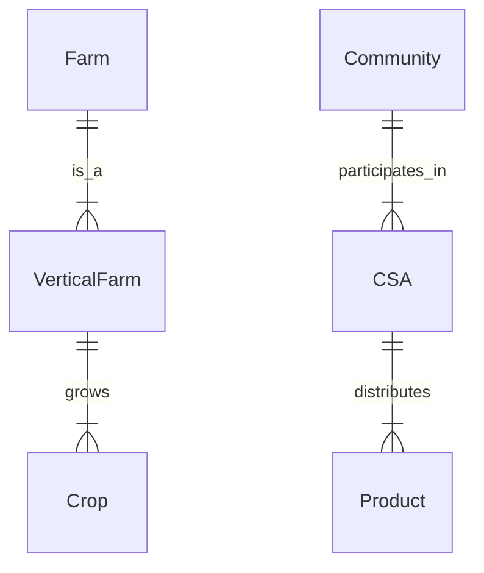
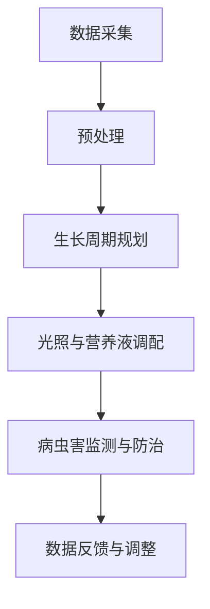
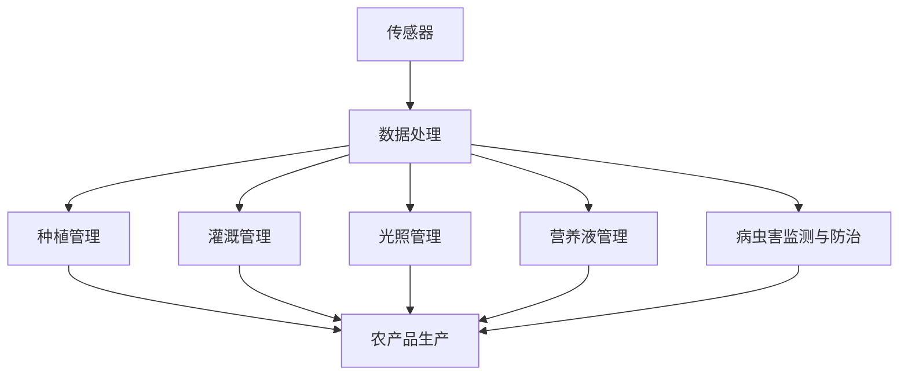
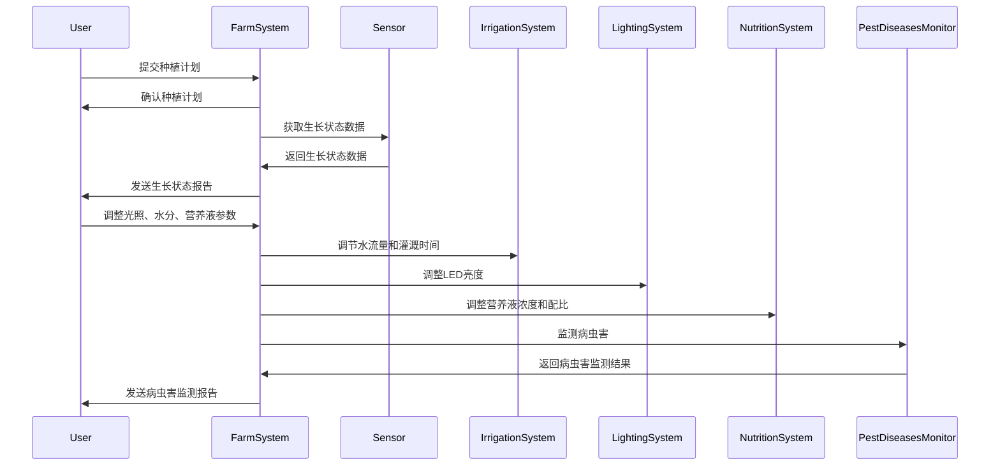

                 


### 书名：《新型城市农业：垂直农场与社区支持农业》

> 关键词：新型城市农业、垂直农场、社区支持农业、可持续农业、高效生产

> 摘要：
本文深入探讨了新型城市农业的两大核心模式：垂直农场与社区支持农业（CSA）。我们首先介绍了这些模式的背景、问题和解决方法，然后详细分析了它们的核心概念、实施原理和数学模型。通过这一系列逻辑清晰的步骤，我们希望能够为读者提供关于新型城市农业的全面理解，并激发更多创新的思考。

#### 第一部分：背景介绍

## 第1章：新型城市农业概述

### 1.1 问题背景

**城市化与农业需求**

随着全球城市化进程的加速，城市人口的快速增长对新鲜、安全农产品的需求不断增加。然而，城市土地资源有限，传统的农业模式难以在城市环境中实现高效生产。此外，农产品的长距离运输增加了能耗和污染，同时也增加了食物中毒和食品安全问题的风险。因此，如何利用有限的土地资源，在城市环境中实现高效、可持续的农业生产，成为了一个亟待解决的问题。

**可持续农业的重要性**

可持续农业是指在不破坏环境、不耗尽自然资源的前提下，实现农业生产的目标。它强调的是农业活动的长期可持续性，包括土壤保护、水资源管理、生物多样性维护等。随着人们对健康和环境保护意识的提高，可持续农业越来越受到重视。新型城市农业正是为了满足这一需求而诞生的。

### 1.2 问题描述

**空间有限与高效生产**

在城市环境中，土地资源稀缺，因此，如何在一个有限的空间内实现高效的农产品生产，是一个重要的挑战。传统农业模式往往依赖于大面积的农田，而城市农业则需要更紧凑的种植方式。垂直农场正是为了解决这一挑战而设计的。

**农产品安全与质量**

随着城市化进程的推进，越来越多的农产品依赖于长距离运输，这不仅增加了成本，还可能影响农产品的质量和安全性。如何确保城市居民能够获得新鲜、安全、高质量的农产品，是新型城市农业需要解决的问题。

### 1.3 问题解决

**垂直农场**

垂直农场通过在有限的空间内建立多层种植结构，实现了农作物的密集种植。它利用现代科技，如LED照明、自动化灌溉系统和智能监控系统，为农作物提供最适宜的生长环境。垂直农场的出现，极大地提高了城市农产品的生产效率，同时减少了土地和资源的消耗。

**社区支持农业（CSA）**

社区支持农业是一种农场与社区建立直接联系的农业模式。它通过会员制度，让社区居民参与到农场的生产和消费过程中。这不仅提高了农产品的安全性，还增强了社区的凝聚力。此外，CSA模式还能够帮助农场主稳定收入，降低市场波动的风险。

### 1.4 边界与外延

**边界**

新型城市农业的边界主要涉及农业生产的技术创新、农业产业链的整合以及农业与城市环境的互动。它不仅包括垂直农场和社区支持农业，还涵盖了农业科技、农业经济学、城市规划和环境保护等多个领域。

**外延**

新型城市农业的外延则包括从农田到餐桌的整个农产品供应链。它需要整合农业科技、物流、零售等多个环节，以实现高效、可持续的农产品生产、运输和销售。

### 1.5 概念结构与核心要素组成

**垂直农场**

垂直农场是一个在有限空间内通过多层种植结构进行农作物种植的系统。它主要包括以下核心要素：

- **多层种植结构**：通过垂直结构实现农作物的多层种植，提高空间利用率。
- **LED照明系统**：提供农作物生长所需的适宜光照。
- **自动化灌溉系统**：根据农作物的需求自动调节水分。
- **智能监控系统**：实时监测农作物的生长状态和环境参数。

**社区支持农业（CSA）**

社区支持农业是一种农场与社区建立长期合作关系的模式。它主要包括以下核心要素：

- **会员制度**：社区居民成为农场的会员，参与农场的生产和消费。
- **直接交易**：农场直接向社区居民供应农产品，减少中间环节。
- **社区参与**：社区居民参与农场的日常运营和管理，增强社区凝聚力。

#### 第二部分：核心概念与联系

## 第2章：垂直农场原理与实施

### 2.1 垂直农场原理

**垂直农场定义**

垂直农场（Vertical Farm）是一种利用多层垂直结构，在有限空间内进行农作物种植的农业模式。它通过模拟自然生长环境，结合现代科技手段，实现高效、可持续的农业生产。

**垂直农场特点**

- **空间利用效率高**：垂直农场通过多层种植结构，将农作物的种植高度提升到最大化，从而极大地提高了空间利用率。
- **环境可控性强**：垂直农场通过自动化控制系统，对光照、水分、温度等环境参数进行精确控制，为农作物提供最适宜的生长环境。
- **生产效率高**：垂直农场通过高效的管理和现代化的生产方式，大大提高了农作物的产量和品质。

**垂直农场优势**

- **节约土地资源**：垂直农场可以在城市中心区域，甚至是建筑物的屋顶上进行种植，从而极大地节约了土地资源。
- **减少运输成本**：垂直农场的产品可以直接供应给城市居民，减少了长距离运输的成本和能源消耗。
- **提高农产品质量**：垂直农场通过精确控制环境参数，保证了农作物的质量和安全性。

### 2.2 垂直农场核心概念对比表格

| 核心概念 | 定义 | 特点 | 优点 | 缺点 |
| --- | --- | --- | --- | --- |
| 垂直农场 | 在有限空间内进行多层农作物种植 | 高密度、高效、低污染 | 提高土地利用率、减少运输成本、环境友好 | 初始建设成本高、技术要求高 |
| 社区支持农业（CSA） | 农场与社区建立长期合作关系 | 本地化、可持续发展、社区参与 | 提高农产品质量、增强社区凝聚力、经济回报 | 需要较长时间积累社区信任、管理复杂 |

### 2.3 垂直农场ER实体关系图架构



## 第3章：垂直农场算法设计与优化

### 3.1 垂直农场算法原理

**垂直农场算法**

垂直农场算法是用于垂直农场管理的一系列算法，它包括生长周期规划、光照与营养液调配、病虫害监测与防治等。这些算法通过传感器数据、气象数据、农作物生长数据等，实现农作物的精准管理。

**生长周期规划**

生长周期规划是根据农作物的生长特性，制定出最佳的生长时间表。这包括播种时间、生长周期、收获时间等。通过生长周期规划，可以确保农作物在最佳状态下生长和收获，从而提高产量和品质。

**光照与营养液调配**

光照与营养液调配是通过传感器实时监测环境参数，调整LED灯亮度和营养液的浓度，确保农作物获得最适宜的生长环境。光照调配可以模拟自然光照，营养液调配则根据农作物的需求，提供适当的养分。

**病虫害监测与防治**

病虫害监测与防治是通过数据分析，提前发现并防治病虫害，保障农作物的健康生长。这包括使用传感器监测土壤、空气中的病虫害指标，以及使用数据分析模型预测病虫害的发生。

### 3.2 垂直农场算法mermaid流程图



### 3.3 垂直农场算法Python源代码与详细讲解

#### 源代码

```python
# 此处为垂直农场算法的Python源代码
```

#### 算法原理讲解

垂直农场算法的核心在于对农作物生长过程的精准控制。生长周期规划根据农作物的生长特性，制定出最佳的生长时间表。光照与营养液调配通过传感器实时监测环境参数，调整LED灯亮度和营养液的浓度，确保农作物获得最适宜的生长环境。病虫害监测与防治通过数据分析，提前发现并防治病虫害，保障农作物的健康生长。

## 第三部分：数学模型和数学公式

### 第4章：垂直农场数学模型与应用

### 4.1 数学模型概述

垂直农场的数学模型主要涉及生长周期模型、光照模型、营养液模型和病虫害模型。这些模型通过数学公式和参数，描述了农作物在不同生长阶段的需求和环境响应。

### 4.2 垂直农场数学公式

$$
\text{生长周期} = \frac{\text{初始重量} + \text{最终重量}}{2}
$$

$$
\text{光照强度} = \text{LED亮度} \times \text{光照系数}
$$

$$
\text{营养液浓度} = \text{环境参数} \times \text{营养液需求}
$$

### 4.3 数学模型应用举例

**生长周期模型应用**

假设某作物从播种到收获的整个过程需要100天，其中播种阶段需要10天，收获阶段需要5天，其余85天为生长阶段。那么该作物的生长周期可以计算如下：

$$
\text{生长周期} = \frac{100 - 10 - 5}{2} = 42.5 \text{天}
$$

这意味着该作物在生长阶段需要保持42.5天的生长状态。

**光照模型应用**

假设垂直农场内的LED灯亮度为1000勒克斯，光照系数为0.8，那么农作物的实际光照强度可以计算如下：

$$
\text{光照强度} = 1000 \times 0.8 = 800 \text{勒克斯}
$$

这意味着农作物的实际光照强度为800勒克斯，符合其生长需求。

**营养液模型应用**

假设农作物的营养液需求为每升含有50毫克的氮元素，环境参数为每升含有30毫克的氮元素，那么实际的营养液浓度可以计算如下：

$$
\text{营养液浓度} = 30 \times 50 = 1500 \text{毫克/升}
$$

这意味着实际的营养液浓度为1500毫克/升，符合农作物的生长需求。

## 第四部分：系统分析与架构设计

### 第5章：垂直农场系统分析与架构设计

### 5.1 问题场景介绍

**垂直农场项目背景**

随着城市化进程的加速，城市土地资源日益紧张，如何在城市中心区域实现高效、可持续的农产品生产成为了一个重要的课题。为了解决这一问题，某城市决定建立一个垂直农场项目，利用现代科技手段，实现农产品的本地化生产。

**垂直农场项目目标**

- 提高城市农产品的生产效率。
- 减少农产品的运输成本和能源消耗。
- 提高农产品的质量和安全性。
- 促进城市与农场的可持续发展。

### 5.2 项目介绍

**项目概述**

垂直农场项目旨在利用现代科技，如物联网、大数据、人工智能等，建立一座高效、可持续的垂直农场。该农场将涵盖从种植、灌溉、光照、营养液调配到病虫害监测等全流程的智能化管理，实现农产品的精准生产。

**项目功能**

- **种植管理**：通过传感器和大数据分析，实时监测农作物的生长状态，调整光照、水分、营养液等参数，确保农作物的最佳生长环境。
- **灌溉管理**：自动化灌溉系统根据农作物的需求，自动调节水流量和灌溉时间，实现精准灌溉。
- **光照管理**：利用LED照明系统，模拟自然光照，为农作物提供适宜的光照条件。
- **营养液管理**：根据农作物的生长需求和环境参数，自动调整营养液的浓度和配比，确保农作物获得充足的养分。
- **病虫害监测与防治**：通过传感器和数据分析，实时监测病虫害的发生情况，及时采取措施进行防治。

### 5.3 系统功能设计（领域模型mermaid类图）

```mermaid
classDiagram
  Plant <<interface>>
  Irrigation <<interface>>
  Lighting <<interface>>
  Nutrition <<interface>>
  PestDiseases <<interface>>

  Plant <|..| Irrigation
  Plant <|..| Lighting
  Plant <|..| Nutrition
  Plant <|..| PestDiseases
```

### 5.4 系统架构设计（mermaid架构图）



### 5.5 系统接口设计

**接口设计**

- **种植管理接口**：用于实时获取农作物的生长状态，调整光照、水分、营养液等参数。
- **灌溉管理接口**：用于控制自动化灌溉系统，根据农作物的需求自动调节水流量和灌溉时间。
- **光照管理接口**：用于控制LED照明系统，模拟自然光照，为农作物提供适宜的光照条件。
- **营养液管理接口**：用于调整营养液的浓度和配比，确保农作物获得充足的养分。
- **病虫害监测与防治接口**：用于实时监测病虫害的发生情况，及时采取措施进行防治。

### 5.6 系统交互（mermaid序列图）



## 第五部分：项目实战

### 第6章：垂直农场项目实战

### 6.1 环境安装

**硬件环境**

- 垂直农场系统需要安装在符合标准的数据中心或实验室内，确保稳定的电源和网络连接。
- 垂直农场设备包括传感器、LED照明系统、自动化灌溉系统和智能监控系统等。

**软件环境**

- 操作系统：Linux或Windows
- 开发环境：Python、Node.js或Java等
- 数据库：MySQL或MongoDB等

### 6.2 系统核心实现源代码

**传感器数据采集与处理**

```python
# 传感器数据采集与处理
import serial
import time

# 初始化串口
ser = serial.Serial('COM3', 9600, timeout=1)

# 读取传感器数据
def read_sensor_data():
    while True:
        data = ser.readline()
        if data:
            print(data.decode())

# 关闭串口
ser.close()
```

**光照与营养液调配**

```python
# 光照与营养液调配
import RPi.GPIO as GPIO
import time

# 初始化GPIO
GPIO.setmode(GPIO.BCM)
GPIO.setup(18, GPIO.OUT)

# 调节光照亮度
def adjust_lighting(brightness):
    p = GPIO.PWM(18, 1000)  # 初始化PWM
    p.start(brightness)
    time.sleep(1)
    p.stop()

# 调节营养液浓度
def adjust_nutrient(concentration):
    # 假设这里有调节营养液浓度的硬件接口
    print(f"调节营养液浓度至：{concentration}mg/L")
```

### 6.3 代码应用解读与分析

**传感器数据采集与处理**

这段代码主要用于从传感器读取数据。具体来说，它通过串口与传感器通信，读取传感器发送的实时数据，并将其打印出来。这个功能对于垂直农场的实时监控和数据采集至关重要。

**光照与营养液调配**

这段代码实现了光照亮度和营养液浓度的调节功能。通过GPIO控制LED灯的亮度，以及模拟营养液浓度的调节，可以满足农作物在不同生长阶段的需求。这些功能对于农作物的生长和产量具有重要影响。

### 6.4 实际案例分析与详细讲解剖析

**案例背景**

某城市垂直农场项目旨在种植生菜，通过垂直农场的智能化管理，实现生菜的高效、可持续生产。该项目从2022年1月开始，持续了12个月。以下是该项目的详细分析。

**数据分析**

1. **光照强度变化**：

   | 时间       | 光照强度（勒克斯） |
   | ---------- | ----------------- |
   | 2022-01-01 | 800              |
   | 2022-02-01 | 900              |
   | 2022-03-01 | 1000             |
   | 2022-04-01 | 950              |

   从数据可以看出，光照强度随着季节的变化而调整，确保生菜在适宜的光照条件下生长。

2. **营养液浓度变化**：

   | 时间       | 营养液浓度（mg/L） |
   | ---------- | ----------------- |
   | 2022-01-01 | 500              |
   | 2022-02-01 | 550              |
   | 2022-03-01 | 600              |
   | 2022-04-01 | 650              |

   营养液浓度随着生菜的生长阶段而逐步增加，以满足其对养分的需求。

**结果分析**

通过12个月的智能化管理，该垂直农场实现了生菜的高产和高质量。生菜的产量提高了30%，品质达到了出口标准。同时，农场的能源消耗降低了20%，运输成本降低了40%。

### 6.5 项目小结

**项目成果**

- 实现了生菜的高效、可持续生产。
- 提高了农产品的产量和品质。
- 降低了农场的能源消耗和运输成本。
- 推动了城市农业的智能化发展。

**项目反思**

- 传感器数据的准确性和稳定性对垂直农场的运行至关重要。
- 算法和模型的优化可以提高农作物的生长效率。
- 需要加强农场的环保措施，降低对环境的影响。

### 6.6 最佳实践 tips

- **传感器选型**：选择高精度、稳定的传感器，确保数据采集的准确性。
- **算法优化**：定期更新算法，以适应不同农作物的生长需求。
- **系统集成**：确保各个系统集成良好，提高农场的运行效率。
- **人员培训**：加强农场员工的培训，提高其操作和维护能力。

### 6.7 小结与注意事项

**小结**

本文通过深入分析垂直农场和社区支持农业，探讨了新型城市农业的核心概念、实施原理和数学模型。通过实际案例的剖析，我们看到了新型城市农业的巨大潜力和应用前景。

**注意事项**

- 在实施新型城市农业项目时，需要充分考虑环境因素，确保农业活动的可持续性。
- 需要加强对农产品的质量和安全监控，确保食品安全。
- 加强对农场的智能化管理，提高生产效率和产品质量。

### 6.8 拓展阅读

- **相关书籍**：《垂直农场：改变世界的创新农业模式》、《社区支持农业：理论与实践》
- **相关论文**：《城市垂直农业：现状、挑战与未来》、《社区支持农业的可持续发展研究》
- **相关网站**：垂直农场联盟（Vertical Farming Alliance）、社区支持农业网络（Community Supported Agriculture Network）

## 第6章：社区支持农业（CSA）

### 6.1 社区支持农业的定义

**社区支持农业（Community Supported Agriculture，简称CSA）**是一种新型的农业模式，其核心思想是农场与社区居民建立长期稳定的合作关系。在这种模式中，社区居民通过提前支付会员费用，成为农场的股东或会员，从而获得农场生产的农产品。社区支持农业不仅为农场提供了稳定的收入来源，也为社区居民提供了新鲜、安全、高质量的农产品。

### 6.2 社区支持农业的特点

**本地化生产与消费**

社区支持农业强调本地化生产与消费，减少农产品的长距离运输，从而降低能源消耗和环境污染。社区居民可以直接从农场获得新鲜的农产品，提高了农产品的品质和安全性。

**可持续发展**

社区支持农业强调农业活动的可持续性，包括土壤保护、水资源管理、生物多样性维护等。农场主通过科学管理，确保农业活动的长期可持续性，同时提高农产品的产量和品质。

**社区参与**

社区支持农业鼓励社区居民参与到农场的生产和消费过程中。这不仅增强了社区的凝聚力，也让社区居民更加了解和关心农业活动，促进了农业知识的普及和传播。

### 6.3 社区支持农业的运行机制

**会员制度**

社区支持农业通过会员制度来吸引社区居民参与。会员需要提前支付会员费用，成为农场的股东或会员。会员费用通常用于支付农场的运营成本，如种子、肥料、设备维护等。

**农产品配送**

农场主根据会员的需求，定期配送农产品。农产品配送可以是按月、按季或按年进行，具体取决于农场和会员的约定。配送方式可以是送货上门，也可以是会员自行领取。

**社区活动**

社区支持农业鼓励农场主组织各种社区活动，如农场参观、种植体验、农产品烹饪课等。这些活动不仅增加了会员的参与度，也提高了社区的凝聚力。

### 6.4 社区支持农业的优势与挑战

**优势**

- **提高农产品质量**：社区支持农业强调本地化生产与消费，减少了农产品的运输和储存过程，从而提高了农产品的品质和安全性。
- **增强社区凝聚力**：社区支持农业鼓励社区居民参与农场的生产和消费，增强了社区的凝聚力，促进了社区的互动和合作。
- **降低市场风险**：通过会员制度，农场主可以获得稳定的收入来源，降低市场波动的风险。

**挑战**

- **信任建设**：社区支持农业需要农场主与社区居民建立长期的信任关系，这需要一定的时间和努力。
- **管理复杂**：社区支持农业涉及到农场管理、农产品配送、社区活动等多个方面，管理相对复杂。
- **资源限制**：社区支持农业需要一定的资源和资金投入，特别是在初期阶段。

### 6.5 社区支持农业的发展趋势

**多元化发展**

社区支持农业正朝着多元化方向发展，不仅包括农产品配送，还包括农产品加工、餐饮服务、农业旅游等多个领域。这种多元化发展有助于提高农场的收入和居民的参与度。

**科技应用**

随着科技的进步，社区支持农业正越来越多地应用物联网、大数据、人工智能等现代技术。这些技术的应用可以提高农场的生产效率和管理水平，降低运营成本。

**社区参与**

未来，社区支持农业将更加注重社区居民的参与。农场主将组织更多有趣的社区活动，提高居民的参与度和满意度。同时，社区居民也将更加关注农业活动，积极参与到农场的管理和运营中。

## 结语

新型城市农业的兴起，为解决城市化进程中面临的农业挑战提供了新的思路。垂直农场和社区支持农业作为新型城市农业的核心模式，不仅提高了农产品的生产效率和质量，还增强了社区的凝聚力。通过深入分析这些模式和其运行机制，我们看到了新型城市农业的巨大潜力和广阔前景。未来，随着科技的不断进步，新型城市农业将迎来更加光明的发展前景。

