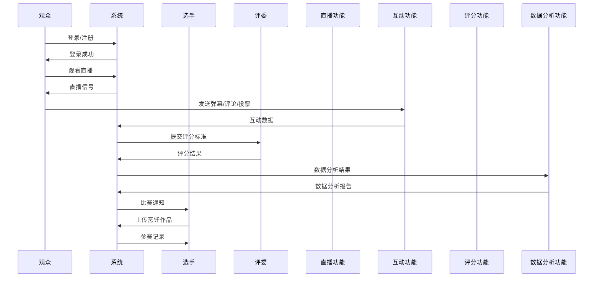
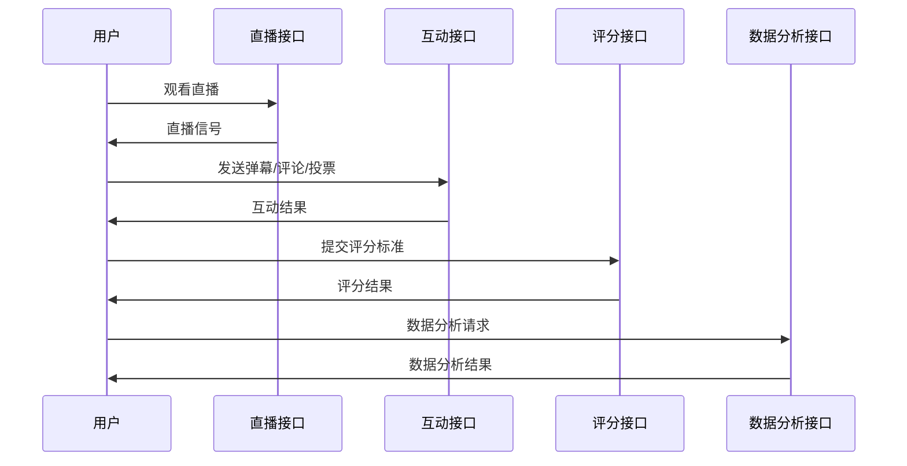

                 

## 《新型城市厨艺电竞赛：线上线下结合的烹饪竞赛模式》

> 关键词：城市厨艺电竞赛、线上线下结合、烹饪竞赛模式、系统设计、算法原理、项目实战、最佳实践

> 摘要：本文将探讨新型城市厨艺电竞赛：线上线下结合的烹饪竞赛模式。我们将从背景介绍、核心概念与联系、算法原理讲解、系统分析与架构设计方案、项目实战以及最佳实践与拓展六个部分，系统性地分析这一新型竞赛模式的设计理念、技术实现、运行流程以及未来发展方向。通过本文的阅读，读者将全面了解如何将线上和线下烹饪竞赛相结合，打造一个高效、有趣且具有竞争力的新型烹饪竞赛平台。

### 1. 背景介绍

随着互联网技术的快速发展，电子竞技逐渐成为一种新兴的文化现象。电子竞技不仅丰富了人们的娱乐生活，也为各个领域带来了新的商业机会。在厨艺领域，电子竞技也逐渐崭露头角，形成了独具特色的“厨艺电竞赛”。厨艺电竞赛将烹饪技艺与电子竞技相结合，通过线上线下的互动，为广大烹饪爱好者提供了一个展示才华、交流学习的平台。

#### 1.1 城市厨艺电竞赛的起源

城市厨艺电竞赛的起源可以追溯到20世纪末。当时，一些国家和地区开始举办线上线下的厨艺比赛，吸引了大量烹饪爱好者参与。随着互联网的普及，这些比赛逐渐向线上转移，形成了现代的厨艺电竞赛。在线上，厨艺电竞赛通过直播、视频录制等方式，将比赛过程实时呈现给观众；在线下，厨艺电竞赛则保留了传统比赛的实体环节，如选手现场烹饪、评委现场打分等。

#### 1.2 线上与线下烹饪竞赛的现状

当前，线上烹饪竞赛已经成为厨艺电竞赛的主要形式。线上竞赛具有跨地域、互动性强、参与人数多等特点，能够吸引更多烹饪爱好者的关注和参与。例如，一些国际知名的烹饪大赛，如“国际烹饪艺术大师赛”等，都采用了线上线下的结合模式，取得了良好的效果。

线下烹饪竞赛则保留了传统比赛的形式，强调选手的实际操作能力和现场表现。线下竞赛通常具有较高的观赏性，能够吸引大量观众到场观看，同时也为选手提供了一个展示自己技艺的机会。

#### 1.3 市场需求与参赛者特点

随着人们对美食的热爱和追求，厨艺电竞赛的市场需求不断增加。参赛者主要包括以下几类：

1. **专业厨师**：具有丰富的烹饪经验，追求技术精湛和创新。
2. **业余爱好者**：热爱烹饪，希望通过比赛提升自己的技能。
3. **学生和年轻厨师**：希望通过比赛锻炼自己，积累经验。

不同参赛者的特点也促使了线上和线下竞赛模式的形成。专业厨师和业余爱好者更倾向于线上竞赛，因为他们可以方便地在家中参与比赛，而学生和年轻厨师则更喜欢线下竞赛，以便在现场锻炼自己。

### 2. 核心概念与联系

为了深入探讨新型城市厨艺电竞赛：线上线下结合的烹饪竞赛模式，我们需要先了解线上和线下烹饪竞赛模式的核心概念和联系。

#### 2.1 线上烹饪竞赛模式

线上烹饪竞赛模式主要依赖于互联网技术，通过直播、视频录制等方式，将比赛过程实时呈现给观众。线上竞赛的特点包括：

1. **跨地域性**：参赛者可以来自世界各地，无需前往比赛现场。
2. **互动性强**：观众可以通过弹幕、评论等方式与选手和评委互动。
3. **参与人数多**：线上竞赛能够吸引更多烹饪爱好者参与，扩大比赛的影响力。

然而，线上竞赛也存在一定的不足，如选手的实际操作能力难以直接观察，观众对比赛的参与度可能较低等。

#### 2.2 线下烹饪竞赛模式

线下烹饪竞赛模式则保留了传统的比赛形式，强调选手的实际操作能力和现场表现。线下竞赛的特点包括：

1. **观赏性强**：观众可以近距离观看选手的操作，感受到比赛的紧张氛围。
2. **专业性高**：评委能够直接观察选手的操作，给出更准确的评分。
3. **竞争激烈**：选手需要在有限的时间内完成烹饪任务，竞争更为激烈。

线下竞赛的不足在于地域限制，参赛者和观众需要前往比赛现场，参赛门槛较高。

#### 2.3 线上线下结合的烹饪竞赛模式

线上线下结合的烹饪竞赛模式将线上和线下的优势相结合，旨在打造一个更加高效、有趣且具有竞争力的烹饪竞赛平台。该模式的特点包括：

1. **综合优势**：既能实现跨地域参赛，又能保证比赛的专业性和观赏性。
2. **互动性提升**：观众可以通过线上渠道观看比赛，并与选手和评委互动。
3. **参与门槛降低**：参赛者和观众无需前往比赛现场，降低了参赛门槛。

线上线下结合的烹饪竞赛模式还具备以下优势：

1. **提高比赛效率**：选手可以在家中完成部分任务，节省了参赛时间和成本。
2. **扩大比赛影响力**：通过线上直播和宣传，比赛能够吸引更多观众和赞助商的关注。
3. **提高选手素质**：线上线下结合的模式有助于选手在更广泛的环境中提升自己的烹饪技艺。

### 3. 算法原理讲解

在新型城市厨艺电竞赛中，算法的运用至关重要。以下我们将详细讲解直播与互动技术、评分系统算法等关键算法原理。

#### 3.1 直播与互动技术原理

直播与互动技术是线上线下结合烹饪竞赛模式的核心组成部分。直播技术通过将比赛过程实时传输到线上平台，使观众能够随时随地观看比赛。互动技术则通过弹幕、评论、投票等功能，增强观众的参与感和互动性。

**直播技术原理**：

1. **信号采集**：通过摄像头、麦克风等设备，采集选手的实时操作和语音信号。
2. **信号编码**：将采集到的信号进行编码，以适应不同平台和设备的播放需求。
3. **信号传输**：通过互联网，将编码后的信号传输到线上平台。
4. **信号播放**：线上平台接收信号后，将其解码并播放给观众。

**互动技术原理**：

1. **弹幕系统**：观众可以在观看比赛的同时，发送实时评论，与其他观众互动。
2. **评论系统**：观众可以在观看比赛后，发表对比赛和选手的看法。
3. **投票系统**：观众可以为喜欢的选手投票，影响比赛结果。

**直播与互动技术的优势与不足**：

- **优势**：直播与互动技术能够实现跨地域的实时互动，提高比赛的观赏性和参与度。
- **不足**：直播与互动技术对网络带宽和服务器性能要求较高，可能存在延迟和卡顿等问题。

#### 3.2 评分系统算法

评分系统算法是烹饪竞赛的重要组成部分，用于对选手的烹饪作品进行客观、公正的评估。评分系统通常包括以下几个方面：

1. **评分指标**：根据比赛要求，设定评分指标，如口感、外观、创意等。
2. **评分标准**：为每个评分指标设定具体的评分标准，如口感满分5分，外观满分3分等。
3. **评分算法**：根据评分指标和评分标准，计算选手的最终得分。

**评分系统算法原理**：

1. **评分指标分配**：根据比赛要求，为每个评分指标分配权重。
2. **评分标准设定**：为每个评分指标设定具体的评分标准。
3. **评分计算**：根据选手的作品，对每个评分指标进行评分，并计算最终得分。

**评分系统算法的优势与不足**：

- **优势**：评分系统能够客观、公正地评估选手的烹饪作品，提高比赛的公平性。
- **不足**：评分系统可能受到评委主观因素的影响，评分结果可能存在一定偏差。

#### 3.3 观众投票与数据统计分析

观众投票和数据统计分析是线上线下结合烹饪竞赛模式的重要组成部分，用于提高比赛的互动性和公平性。

**观众投票原理**：

1. **投票权限**：观众在观看比赛后，有权对喜欢的选手进行投票。
2. **投票机制**：投票系统通常采用匿名投票机制，确保投票的公正性。

**数据统计分析原理**：

1. **数据收集**：通过投票系统，收集观众的投票数据。
2. **数据分析**：对投票数据进行分析，评估观众的喜好和倾向。

**观众投票与数据统计分析的优势与不足**：

- **优势**：观众投票和数据统计分析能够提高比赛的互动性，让观众更加关注比赛。
- **不足**：观众投票可能受到观众个人偏见的影响，数据统计分析结果可能存在一定偏差。

### 4. 系统分析与架构设计方案

要实现新型城市厨艺电竞赛：线上线下结合的烹饪竞赛模式，我们需要进行系统分析与架构设计。以下将从问题场景介绍、项目介绍、系统功能设计、系统架构设计、系统接口设计和系统交互流程等方面进行详细阐述。

#### 4.1 问题场景介绍

在城市厨艺电竞赛中，存在以下问题场景：

1. **跨地域参赛**：参赛者来自不同地区，难以集中进行比赛。
2. **互动性不足**：线上竞赛互动性较低，观众参与度不高。
3. **评分系统不完善**：评分系统可能存在主观因素，评分结果不够客观。

为了解决上述问题，我们需要设计一个线上线下结合的烹饪竞赛系统，提高比赛的互动性和公平性。

#### 4.2 项目介绍

本项目旨在设计并实现一个线上线下结合的烹饪竞赛系统，主要包括以下功能：

1. **直播与互动**：通过直播技术，实时传输比赛现场，观众可以通过弹幕、评论、投票等功能与选手和评委互动。
2. **评分系统**：根据比赛要求，设定评分指标和评分标准，对选手的烹饪作品进行客观、公正的评估。
3. **数据分析**：通过数据统计分析，评估观众的喜好和倾向，为后续比赛提供参考。

#### 4.3 系统功能设计

系统功能设计主要包括以下几个方面：

1. **直播功能**：实现比赛现场的实时直播，确保观众能够实时观看比赛。
2. **互动功能**：实现观众与选手、评委的互动，提高比赛的参与度。
3. **评分功能**：实现评分系统的设计和实现，提高比赛的公平性。
4. **数据分析功能**：对观众的投票数据进行统计分析，为后续比赛提供参考。

**领域模型Mermaid类图**：

```mermaid
classDiagram
    系统 -> 观众
    系统 -> 选手
    系统 -> 评委
    系统 -> 直播功能
    系统 -> 互动功能
    系统 -> 评分功能
    系统 -> 数据分析功能
    观众 o--o 弹幕
    观众 o--o 评论
    观众 o--o 投票
    选手 o--o 烹饪作品
    选手 o--o 参赛记录
    评委 o--o 评分标准
    评委 o--o 评分结果
    直播功能 o--o 直播信号
    互动功能 o--o 互动数据
    评分功能 o--o 评分指标
    数据分析功能 o--o 数据分析结果
```

#### 4.4 系统架构设计

系统架构设计主要包括以下几个方面：

1. **前端架构**：采用Vue.js框架，实现用户界面的展示和交互功能。
2. **后端架构**：采用Spring Boot框架，实现业务逻辑处理和数据处理功能。
3. **数据库设计**：采用MySQL数据库，存储用户数据、比赛数据等。

**Mermaid架构图**：



#### 4.5 系统接口设计

系统接口设计主要包括以下几个方面：

1. **用户接口**：用户可以通过Web界面、移动端应用等渠道访问系统。
2. **功能接口**：系统提供直播、互动、评分、数据分析等功能接口。

**Mermaid序列图**：



#### 4.6 系统交互流程

系统交互流程主要包括以下几个方面：

1. **用户注册与登录**：用户通过注册和登录获取访问系统的权限。
2. **观看直播**：用户通过直播接口观看比赛现场。
3. **互动参与**：用户通过互动接口发送弹幕、评论、投票等互动数据。
4. **评分提交**：用户通过评分接口提交评分标准，评委进行评分。
5. **数据分析**：用户通过数据分析接口获取数据分析结果。

### 5. 项目实战

在本节中，我们将以一个实际的线上线下结合的烹饪竞赛项目为例，详细讲解项目的环境安装与配置、系统核心实现、代码应用解读与分析、实际案例分析和详细讲解剖析，以及项目小结。

#### 5.1 项目环境安装与配置

为了实现一个实际的线上线下结合的烹饪竞赛项目，我们需要搭建一个完整的技术环境。以下是一个简单的环境安装与配置步骤：

1. **前端环境**：
   - **Node.js**：用于搭建前端开发环境，版本要求为12.x或更高。
   - **Vue CLI**：用于创建和构建Vue.js项目，版本要求为4.x或更高。
   - **Vue Router**：用于实现前端路由功能，版本要求为4.x或更高。
   - **Axios**：用于实现前后端数据交互，版本要求为0.x或更高。

2. **后端环境**：
   - **Java**：用于编写后端业务逻辑，版本要求为11.x或更高。
   - **Spring Boot**：用于搭建后端框架，版本要求为2.x或更高。
   - **MySQL**：用于存储用户数据和比赛数据，版本要求为8.x或更高。

3. **直播与互动环境**：
   - **Nginx**：用于搭建直播服务器，版本要求为1.x或更高。
   - **FFmpeg**：用于处理视频和音频流，版本要求为4.x或更高。

4. **开发工具**：
   - **Visual Studio Code**：用于编写代码，版本要求为1.x或更高。
   - **IntelliJ IDEA**：用于编写后端代码，版本要求为2021.x或更高。

#### 5.2 系统核心实现

1. **前端系统核心实现**：

   前端系统核心实现主要包括以下几个方面：

   - **用户注册与登录**：通过Vue.js实现用户注册和登录功能，用户输入用户名、密码等信息，前端进行验证并提交到后端进行存储。
   - **观看直播**：通过Vue Router实现路由功能，用户可以切换到直播页面，通过Nginx服务器接收视频流并展示。
   - **互动参与**：通过Axios实现与后端的数据交互，用户可以发送弹幕、评论、投票等互动数据，前端实时更新界面显示。

2. **后端系统核心实现**：

   后端系统核心实现主要包括以下几个方面：

   - **用户管理**：通过Spring Boot实现用户注册、登录、个人信息管理等功能，用户数据存储在MySQL数据库中。
   - **比赛管理**：通过Spring Boot实现比赛信息管理、选手报名、评委管理等功能，比赛数据存储在MySQL数据库中。
   - **直播管理**：通过Nginx服务器接收前端直播请求，实时传输视频流。
   - **互动管理**：通过Spring Boot实现互动数据存储、统计和分析，实时更新互动界面。

3. **直播与互动系统核心实现**：

   直播与互动系统核心实现主要包括以下几个方面：

   - **视频直播**：通过FFmpeg实时采集摄像头和麦克风的信号，编码后传输到Nginx服务器。
   - **互动数据**：通过Nginx服务器接收前端互动数据，处理后存储到MySQL数据库中，实时更新互动界面。

#### 5.3 代码应用解读与分析

以下是一个简单的Vue.js前端代码示例，用于实现用户注册功能：

```javascript
<template>
  <div>
    <h1>用户注册</h1>
    <form @submit.prevent="register">
      <div>
        <label for="username">用户名：</label>
        <input type="text" id="username" v-model="username" required>
      </div>
      <div>
        <label for="password">密码：</label>
        <input type="password" id="password" v-model="password" required>
      </div>
      <button type="submit">注册</button>
    </form>
  </div>
</template>

<script>
export default {
  data() {
    return {
      username: '',
      password: ''
    };
  },
  methods: {
    async register() {
      try {
        const response = await axios.post('/api/users/register', {
          username: this.username,
          password: this.password
        });
        if (response.status === 200) {
          this.$router.push('/login');
        }
      } catch (error) {
        console.error(error);
      }
    }
  }
};
</script>
```

这段代码实现了一个用户注册页面，用户输入用户名和密码后，点击注册按钮，前端通过Axios向后端发送注册请求。后端验证用户信息并返回结果，前端根据后端返回的结果进行页面跳转。

#### 5.4 实际案例分析与详细讲解剖析

以下是一个实际的烹饪竞赛项目案例，我们将详细讲解该项目的搭建过程、运行流程以及关键环节的实现。

**项目背景**：

某市举办了一场线上线下结合的烹饪竞赛，共有100名选手报名参加。比赛分为两个阶段：线上选拔和线下决赛。线上选拔阶段，选手需要在规定时间内完成一道菜品，评委根据菜品的质量和创意进行评分。线下决赛阶段，20名优秀选手进行现场烹饪比赛，评委和观众共同评选出最终的获奖者。

**项目搭建过程**：

1. **前端搭建**：
   - 使用Vue CLI创建Vue.js项目，配置路由和组件。
   - 使用Vue Router实现前端路由功能，配置注册、登录、直播、互动等页面。
   - 使用Axios实现前后端数据交互，配置用户管理、比赛管理、直播管理等接口。

2. **后端搭建**：
   - 使用Spring Boot创建Java后端项目，配置Spring Security实现用户认证。
   - 使用MyBatis实现数据访问，配置用户管理、比赛管理、直播管理等数据库表。
   - 配置Nginx服务器，接收前端直播请求，实时传输视频流。

3. **直播与互动搭建**：
   - 使用FFmpeg实时采集摄像头和麦克风的信号，编码后传输到Nginx服务器。
   - 使用Nginx服务器接收前端互动数据，处理后存储到MySQL数据库中，实时更新互动界面。

**项目运行流程**：

1. **选手报名**：选手通过前端注册和登录，填写个人信息和参赛意愿，后端存储用户数据。
2. **线上选拔**：选手在规定时间内完成菜品，上传到服务器，评委在线评分。
3. **线下决赛**：20名优秀选手进行现场烹饪比赛，评委和观众共同评选出获奖者。
4. **结果公示**：后端根据评分结果和投票数据，生成获奖名单，前端展示获奖者信息。

**关键环节实现**：

1. **用户管理**：使用Spring Security实现用户认证和权限管理，确保用户数据安全。
2. **比赛管理**：使用MyBatis实现比赛信息管理，包括选手报名、评委评分等。
3. **直播管理**：使用Nginx服务器接收前端直播请求，实时传输视频流。
4. **互动管理**：使用Nginx服务器接收前端互动数据，处理后存储到MySQL数据库中，实时更新互动界面。

**项目小结**：

通过本案例的实战讲解，我们了解了如何搭建一个线上线下结合的烹饪竞赛项目。该项目实现了用户管理、比赛管理、直播管理和互动管理等功能，为选手、评委和观众提供了一个完整的烹饪竞赛体验。在实际应用中，可以根据需求进一步优化和拓展项目功能。

### 6. 最佳实践与拓展

在本文的最后，我们将总结一些最佳实践，并提出未来发展的建议。

#### 6.1 最佳实践技巧

1. **优化前端性能**：
   - 使用Vue.js的异步组件和懒加载技术，减少首屏加载时间。
   - 对CSS和JavaScript代码进行压缩和混淆，提高加载速度。
   - 使用CDN加速静态资源的加载。

2. **提升后端性能**：
   - 使用Spring Boot的异步处理和批量处理技术，提高系统并发能力。
   - 对数据库进行优化，如添加索引、分库分表等，提高查询效率。
   - 使用缓存技术，如Redis，减少数据库访问压力。

3. **保障数据安全**：
   - 使用SSL/TLS协议，加密用户数据和传输过程。
   - 定期备份数据库，防止数据丢失。
   - 实施访问控制，限制对敏感数据的访问权限。

4. **提升用户体验**：
   - 设计简洁明了的界面，确保用户能够快速上手。
   - 对用户操作进行实时反馈，提高用户互动体验。
   - 提供多种设备适配，确保在不同设备上都有良好的体验。

#### 6.2 注意事项

1. **稳定性**：确保系统在高并发场景下稳定运行，避免因服务器宕机或网络波动导致比赛中断。

2. **安全性**：保护用户隐私和数据安全，防范恶意攻击和数据泄露。

3. **可扩展性**：在设计系统时，考虑未来可能的业务扩展和功能增加，确保系统具有良好的可扩展性。

#### 6.3 拓展阅读与资源推荐

1. **直播技术**：
   - 《WebRTC实战：构建实时互动应用》
   - 《实时视频直播技术原理与实战》

2. **人工智能**：
   - 《人工智能：一种现代的方法》
   - 《深度学习：自适应计算的理论基础》

3. **系统架构**：
   - 《微服务设计：构建基于分布式系统的企业级应用》
   - 《大规模分布式存储系统：原理解析与架构实战》

通过本文的阅读，我们深入探讨了新型城市厨艺电竞赛：线上线下结合的烹饪竞赛模式。我们分析了背景、核心概念与联系、算法原理、系统设计与架构、项目实战以及最佳实践与拓展，为读者提供了一个全面的技术视角。希望本文能够为从事烹饪电竞赛领域的技术人员提供有益的参考和启示。让我们共同期待这一新兴领域的蓬勃发展！

