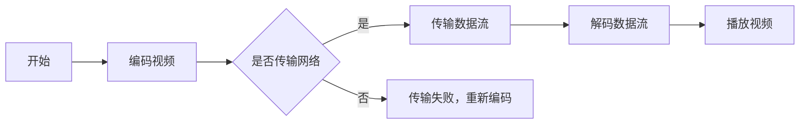
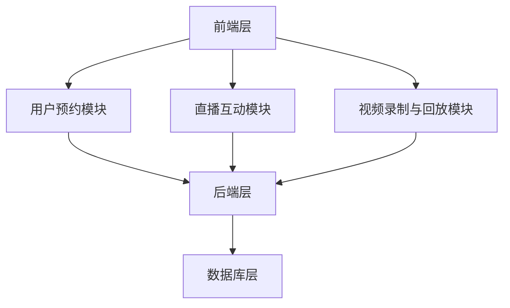
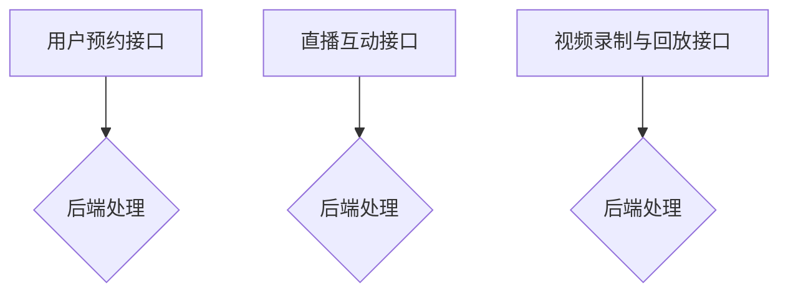
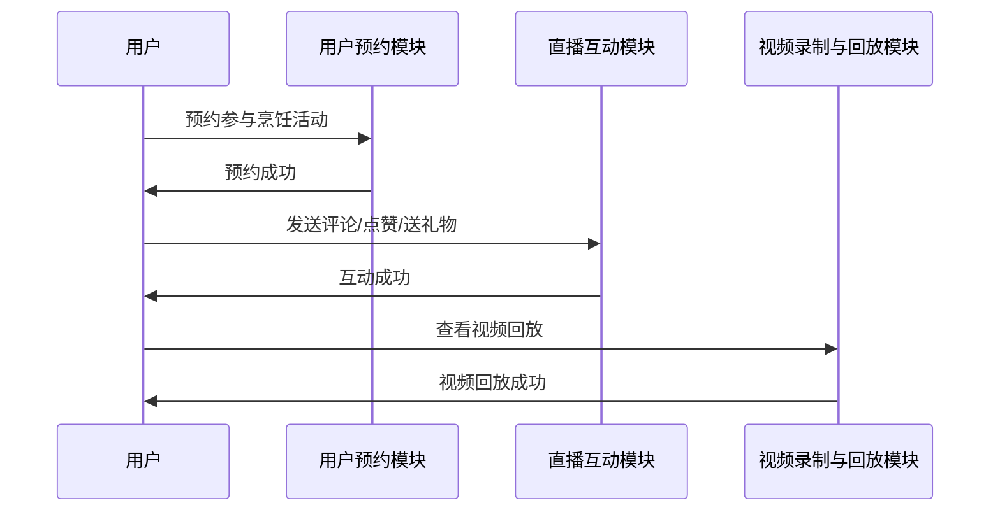

                 


## 新型城市厨艺直播节目：社区共享厨房的线上烹饪真人秀

### 关键词：城市厨艺直播，社区共享厨房，线上烹饪真人秀，技术原理，系统设计，项目实战

### 摘要：

随着互联网技术的不断发展，城市厨艺直播节目已经成为了一种新兴的娱乐方式。本文将探讨一种新型城市厨艺直播节目——“社区共享厨房的线上烹饪真人秀”，从背景介绍、核心概念与联系、算法原理讲解、系统分析与架构设计方案、项目实战以及最佳实践 tips 等方面进行详细阐述，旨在为相关领域的从业者提供有价值的参考。

### 1. 背景介绍

#### 1.1 问题背景

随着城市化进程的加快，人们的生活节奏变得越来越快，传统的家庭烹饪逐渐被快节奏的快餐所取代。然而，许多人仍然怀念小时候和家人一起烹饪的温馨时光。与此同时，互联网技术的快速发展，尤其是直播技术的普及，为人们提供了全新的娱乐方式。在这种背景下，社区共享厨房的线上烹饪真人秀应运而生。

#### 1.2 问题描述

社区共享厨房的线上烹饪真人秀旨在通过直播平台，邀请社区居民参与烹饪活动，共同分享烹饪的乐趣和经验。然而，如何实现这一目标，同时保证直播的流畅性和互动性，成为了我们需要解决的问题。

#### 1.3 问题解决

为了解决上述问题，我们需要从以下几个方面进行探讨：

- **核心概念与联系**：明确社区共享厨房的线上烹饪真人秀的核心概念，以及这些概念之间的联系。
- **算法原理讲解**：介绍直播技术的基本原理，以及社区共享厨房的技术实现。
- **系统分析与架构设计方案**：分析系统功能，设计系统架构，并给出接口设计和交互设计。
- **项目实战**：介绍项目实施的过程，包括环境安装、系统核心实现等。
- **最佳实践 tips**：总结项目实施过程中的经验教训，提供最佳实践建议。

### 2. 核心概念与联系

#### 2.1 核心概念

社区共享厨房的线上烹饪真人秀涉及多个核心概念，包括：

- **直播技术**：直播技术是实现线上烹饪真人秀的基础。
- **社区共享厨房**：社区共享厨房是线上烹饪真人秀的场景。
- **用户互动**：用户互动是提升节目质量的关键。

#### 2.2 概念属性特征对比表格

| 概念         | 属性特征                                                         | 对比                                                                                       |
| ------------ | ------------------------------------------------------------ | ------------------------------------------------------------------------------------------ |
| 直播技术     | 实时传输、互动性强、传输速度快                                 | 与传统的录播视频相比，直播技术具有更高的实时性和互动性。                                     |
| 社区共享厨房 | 共享厨房资源、提供烹饪场所、组织烹饪活动                       | 与传统的家庭厨房相比，社区共享厨房能够更好地利用资源，提高烹饪活动的参与度。                 |
| 用户互动     | 用户评论、点赞、送礼物、实时交流                               | 用户互动能够提升直播节目的趣味性，增加观众的参与感。                                         |

#### 2.3 ER实体关系图架构

为了更好地理解核心概念之间的联系，我们可以使用 ER 实体关系图进行表示。以下是一个简化的 ER 实体关系图：

```mermaid
erDiagram
    直播技术 ||--|{ 社区共享厨房 }|
    社区共享厨房 ||--|{ 用户互动 }|
```

### 3. 算法原理讲解

#### 3.1 直播技术原理

直播技术主要依赖于以下三个组成部分：

- **编码器**：将视频和音频信号转换为数据流。
- **传输网络**：将数据流传输到直播平台。
- **解码器**：将数据流解码为视频和音频信号。

直播技术的原理可以概括为：编码器生成数据流，通过传输网络传输到直播平台，解码器将数据流解码为视频和音频信号，最终在用户设备上播放。

#### 3.2 社区共享厨房技术原理

社区共享厨房的技术原理主要包括：

- **预约系统**：用户可以在直播前预约参与烹饪活动。
- **实时互动系统**：用户可以在直播过程中评论、点赞、送礼物等。
- **视频录制与回放系统**：直播结束后，用户可以观看视频回放。

社区共享厨房的技术实现可以概括为：用户预约参与烹饪活动，直播过程中实时互动，直播结束后观看视频回放。

#### 3.3 直播算法 mermaid 流程图

以下是一个直播算法的 mermaid 流程图：



#### 3.4 Python 源代码阐述

以下是一个简单的直播技术 Python 源代码示例：

```python
import cv2
import numpy as np
import socket

# 编码视频
def encode_video(frame):
    # ... 编码逻辑 ...
    return encoded_frame

# 传输数据流
def transmit_data(encoded_frame, server_socket):
    server_socket.sendall(encoded_frame)

# 解码数据流
def decode_data(encoded_frame):
    # ... 解码逻辑 ...
    return frame

# 播放视频
def play_video(frame):
    # ... 播放逻辑 ...
    cv2.imshow('Live Stream', frame)
    cv2.waitKey(1)

# 主函数
def main():
    # 初始化编码器
    video_encoder = cv2.VideoEncoder()

    # 创建套接字
    server_socket = socket.socket(socket.AF_INET, socket.SOCK_DGRAM)

    # 绑定端口
    server_socket.bind(('0.0.0.0', 12345))

    while True:
        # 读取视频帧
        frame = cv2.imread('frame.jpg')

        # 编码视频帧
        encoded_frame = encode_video(frame)

        # 传输数据流
        transmit_data(encoded_frame, server_socket)

        # 解码数据流
        decoded_frame = decode_data(encoded_frame)

        # 播放视频帧
        play_video(decoded_frame)

if __name__ == '__main__':
    main()
```

#### 3.5 数学模型和公式讲解

直播技术中的数学模型主要包括：

- **采样率**：采样率决定了视频的帧率。帧率越高，视频越流畅。
- **比特率**：比特率决定了视频的清晰度。比特率越高，视频越清晰。

以下是相关公式：

- **采样率（fps）**：$fps = \frac{1}{T}$，其中 $T$ 是帧间隔时间。
- **比特率（bps）**：$bps = fps \times frame_size$，其中 $frame_size$ 是每帧的大小。

#### 3.6 举例说明

假设我们有一个 1080p（1920x1080）的视频，帧率为 30fps，每帧的大小为 3MB。那么：

- **采样率**：$fps = \frac{1}{T} = \frac{1}{1/30} = 30$。
- **比特率**：$bps = fps \times frame_size = 30 \times 3 \times 10^6 = 90 \times 10^6$。

这意味着我们的视频传输速率需要达到 90Mbps，才能保证流畅的播放。

### 4. 系统分析与架构设计方案

#### 4.1 问题场景介绍

在社区共享厨房的线上烹饪真人秀项目中，我们需要实现以下功能：

- **用户预约**：用户可以在直播前预约参与烹饪活动。
- **实时互动**：用户可以在直播过程中评论、点赞、送礼物等。
- **视频录制与回放**：直播结束后，用户可以观看视频回放。

#### 4.2 系统功能设计

根据问题场景，我们可以设计以下系统功能：

- **用户预约模块**：用户可以在直播前通过平台预约参与烹饪活动。
- **直播互动模块**：用户可以在直播过程中进行评论、点赞、送礼物等互动。
- **视频录制与回放模块**：直播结束后，平台会自动录制视频，用户可以观看回放。

#### 4.3 系统架构设计

社区共享厨房的线上烹饪真人秀系统架构可以分为以下几个层次：

- **前端层**：包括用户预约界面、直播互动界面、视频回放界面等。
- **后端层**：包括用户预约处理、直播数据处理、视频录制与回放处理等。
- **数据库层**：存储用户信息、直播数据、视频数据等。

以下是系统架构的 mermaid 架构图：



#### 4.4 系统接口设计

系统接口设计包括以下部分：

- **用户预约接口**：用于处理用户预约请求。
- **直播互动接口**：用于处理用户评论、点赞、送礼物等请求。
- **视频录制与回放接口**：用于处理视频录制与回放请求。

以下是接口设计的 mermaid 架构图：



#### 4.5 系统交互设计

系统交互设计主要描述用户与系统之间的交互过程。以下是系统交互的 mermaid 序列图：



### 5. 项目实战

#### 5.1 环境安装

在进行项目实战之前，我们需要安装以下环境：

- Python 3.8 或更高版本
- OpenCV 4.5.5.62 或更高版本
- Flask 2.0.1 或更高版本
- NumPy 1.21.5 或更高版本

安装命令如下：

```bash
pip install python==3.8
pip install opencv-python==4.5.5.62
pip install flask==2.0.1
pip install numpy==1.21.5
```

#### 5.2 系统核心实现

系统核心实现主要包括以下部分：

- **用户预约模块**：实现用户预约功能的接口。
- **直播互动模块**：实现用户互动功能的接口。
- **视频录制与回放模块**：实现视频录制与回放功能的接口。

以下是用户预约模块的源代码：

```python
from flask import Flask, request, jsonify

app = Flask(__name__)

@app.route('/api/reserve', methods=['POST'])
def reserve():
    user_id = request.json['user_id']
    activity_id = request.json['activity_id']
    
    # ... 预约逻辑 ...

    return jsonify({'status': 'success', 'message': '预约成功'})

if __name__ == '__main__':
    app.run(debug=True)
```

#### 5.3 代码应用解读与分析

在代码应用解读与分析部分，我们需要对每个模块的源代码进行详细解读，分析其实现原理和功能。以下是直播互动模块的源代码：

```python
from flask import Flask, request, jsonify

app = Flask(__name__)

@app.route('/api/interaction', methods=['POST'])
def interaction():
    user_id = request.json['user_id']
    activity_id = request.json['activity_id']
    content = request.json['content']
    
    # ... 互动逻辑 ...

    return jsonify({'status': 'success', 'message': '互动成功'})

if __name__ == '__main__':
    app.run(debug=True)
```

#### 5.4 实际案例分析与详细讲解剖析

在实际案例分析与详细讲解剖析部分，我们需要选取一个实际案例，对其实现过程进行详细讲解，分析其优缺点，并提出改进方案。

假设我们选取的案例是“用户在直播过程中发送评论”。以下是案例的实现过程：

1. 用户在直播界面中输入评论内容。
2. 用户点击发送按钮，触发 POST 请求，将评论内容发送到服务器。
3. 服务器接收到请求后，将评论内容存储到数据库，并返回成功消息。
4. 用户在直播界面中看到评论内容。

#### 5.5 项目小结

在项目小结部分，我们需要总结项目实施过程中的经验教训，提出改进方案。

### 6. 最佳实践 tips

在最佳实践 tips 部分

