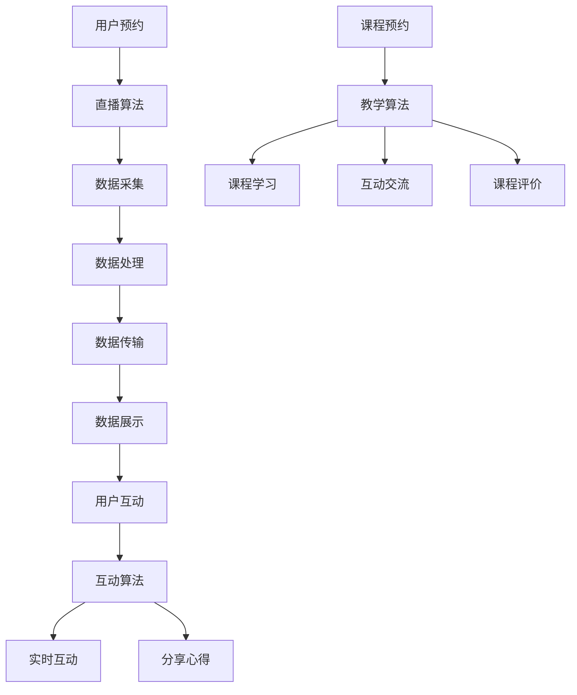
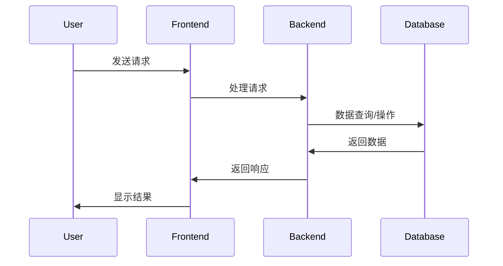
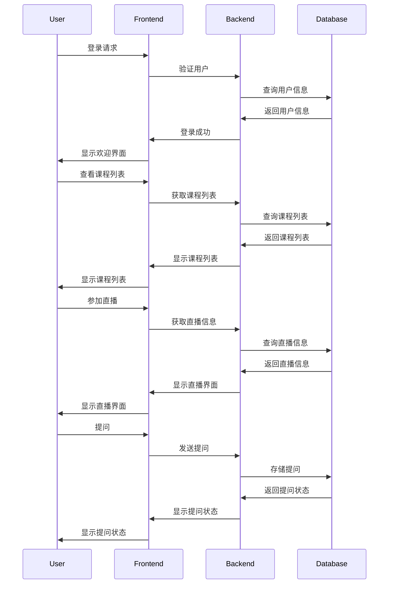

                 


## 引言

### 核心概念术语说明

在本文中，我们将探讨新型城市厨艺直播间——一种融合了社区共享厨房与线上烹饪课堂的创新烹饪模式。以下是一些核心概念及其术语说明：

- **社区共享厨房**：一种为居民提供烹饪设施和空间的共享模式，旨在促进交流与合作。
- **线上烹饪课堂**：通过互联网平台进行烹饪教学的方式，学习者可随时随地观看课程。
- **新型城市厨艺直播间**：结合社区共享厨房与线上烹饪课堂的新型烹饪模式，通过直播传授烹饪技巧。

### 问题背景

随着城市化进程的加快，城市烹饪文化面临挑战。传统家庭烹饪逐渐被快餐和外卖取代，导致饮食健康问题和文化传承的缺失。社区共享厨房与线上烹饪课堂的兴起，旨在解决这一问题。

### 问题描述

如何构建一个新型城市厨艺直播间，通过社区共享厨房和线上烹饪课堂，传承城市烹饪文化，提升居民烹饪技能和健康饮食观念？

### 问题解决

新型城市厨艺直播间通过以下方式解决上述问题：

1. **直播烹饪过程**：厨艺大师在社区共享厨房中直播烹饪，实时传授技巧。
2. **互动学习**：观众可以通过直播平台提问、留言，与厨艺大师互动，学习烹饪知识。
3. **资源共享**：居民可共享厨房设备、调料、食材等资源，降低个人使用成本。

### 边界与外延

新型城市厨艺直播间的边界包括烹饪技巧的传授、经验的分享和知识的普及。其外延可扩展至烹饪技巧大赛、烹饪文化交流活动等。

### 概念结构与核心要素组成

新型城市厨艺直播间的结构主要包括直播平台、社区共享厨房和线上烹饪课堂。核心要素包括厨艺大师、观众、直播设备和烹饪教程。

---

## 文章关键词

新型城市厨艺直播间、社区共享厨房、线上烹饪课堂、烹饪文化、直播技术、互动学习、资源共享。

---

## 摘要

本文将深入探讨新型城市厨艺直播间——一种融合了社区共享厨房与线上烹饪课堂的创新烹饪模式。通过分析其背景、核心概念与联系，本文将详细讲解其构建与运作原理，并探讨其在传承城市烹饪文化、提升居民烹饪技能和健康饮食观念方面的作用。

---

## 第一部分: 新型城市厨艺直播间概述

### 1.1 问题背景

随着城市化进程的加速，城市烹饪文化正经历着深刻的变革。传统的家庭烹饪逐渐被快餐、外卖等现代餐饮方式所取代，这不仅影响了人们的饮食健康，也削弱了城市烹饪文化的传承。为了应对这一挑战，社区共享厨房和线上烹饪课堂作为一种新兴的烹饪模式逐渐兴起。

社区共享厨房旨在为居民提供一个烹饪的场所，让他们可以在这里交流烹饪经验，分享烹饪乐趣。它不仅丰富了居民的日常生活，也促进了社区的和谐发展。另一方面，线上烹饪课堂通过互联网技术，将烹饪教学带到观众的家中，提供了丰富的烹饪教程，让学习者可以随时随地学习烹饪知识。

### 1.1.1 城市烹饪文化的变迁

在过去的几十年中，城市烹饪文化经历了从传统到现代的转型。传统的家庭烹饪以手工制作、用心烹饪为特点，强调食物的口感、营养和美感。然而，随着城市化进程的加速，人们的生活节奏加快，传统的家庭烹饪逐渐被现代化的餐饮方式所取代。快餐、外卖等便捷的餐饮方式成为了城市居民的主要选择。这不仅导致了饮食健康的下降，也削弱了城市烹饪文化的传承。

传统的家庭烹饪往往需要较长的时间和精力，而现代的快餐和外卖则更加高效和便捷。然而，这种高效和便捷的代价是食品的质量和营养的下降。大量的加工食品和快餐不仅缺乏营养价值，还可能对健康产生负面影响。此外，随着传统家庭烹饪的减少，年轻人对烹饪技巧和知识的学习也越来越少，导致烹饪文化的断层。

### 1.1.2 社区共享厨房的兴起

为了应对这一挑战，社区共享厨房作为一种新兴的烹饪模式逐渐兴起。社区共享厨房旨在为居民提供一个烹饪的场所，让他们可以在这里交流烹饪经验，分享烹饪乐趣。它不仅提供了丰富的烹饪资源，还促进了社区的和谐发展。

社区共享厨房通常设置在社区的公共空间，如社区中心、文化活动中心等。厨房设施包括炉灶、烤箱、冰箱、厨房用具等，居民可以在这里自由使用这些设备进行烹饪。社区共享厨房的兴起，不仅为居民提供了一个学习烹饪的平台，也促进了邻里之间的交流和互动。

居民可以通过社区共享厨房进行烹饪实验，学习新的烹饪技巧和食谱。他们可以与邻居分享自己的烹饪心得，互相学习和帮助。这种互动不仅增强了社区的凝聚力，也有助于传承和弘扬城市烹饪文化。

### 1.1.3 线上烹饪课堂的普及

随着互联网技术的飞速发展，线上烹饪课堂逐渐成为一种普及的烹饪学习方式。线上烹饪课堂通过互联网平台，将烹饪教学带到观众的家中，提供了丰富的烹饪教程，让学习者可以随时随地学习烹饪知识。

线上烹饪课堂通常采用直播或录播的形式进行。厨艺大师通过直播平台，实时传授烹饪技巧和经验。观众可以通过直播平台观看课程，学习烹饪知识。此外，线上烹饪课堂还提供了丰富的烹饪教程和食谱，学习者可以根据自己的需求选择学习。

线上烹饪课堂的优点在于它打破了地域的限制，让学习者可以随时随地学习烹饪知识。它不仅提供了丰富的学习资源，还让学习者可以与厨艺大师进行互动，提问和解答问题。这种互动性有助于提高学习效果，增强学习体验。

### 1.2 问题解决

新型城市厨艺直播间是一种结合了社区共享厨房和线上烹饪课堂的新型烹饪模式。它通过直播的形式，将厨艺大师的烹饪技巧和经验传递给观众，同时为观众提供了一个互动学习的平台。

#### 1.2.1 新型城市厨艺直播间的概念

新型城市厨艺直播间是一个融合了社区共享厨房和线上烹饪课堂的创新模式。它通过直播平台，将厨艺大师的烹饪过程实时传递给观众，观众可以实时观看并学习烹饪技巧。同时，观众还可以通过直播平台与厨艺大师进行互动，提问和解答问题。

新型城市厨艺直播间不仅提供了烹饪教学，还提供了丰富的互动学习体验。观众可以通过直播平台参与讨论，分享自己的烹饪心得，与其他观众互动。这种互动性有助于提高学习效果，增强学习体验。

#### 1.2.2 社区共享厨房的功能

社区共享厨房是新型城市厨艺直播间的一个重要组成部分。它为居民提供了一个烹饪的场所，让他们可以在这里交流烹饪经验，分享烹饪乐趣。社区共享厨房通常设置在社区的公共空间，如社区中心、文化活动中心等。厨房设施包括炉灶、烤箱、冰箱、厨房用具等，居民可以在这里自由使用这些设备进行烹饪。

社区共享厨房不仅提供了烹饪资源，还促进了社区的和谐发展。居民可以通过社区共享厨房进行烹饪实验，学习新的烹饪技巧和食谱。他们可以与邻居分享自己的烹饪心得，互相学习和帮助。这种互动不仅增强了社区的凝聚力，也有助于传承和弘扬城市烹饪文化。

#### 1.2.3 线上烹饪课堂的优势

线上烹饪课堂是新型城市厨艺直播间的另一个重要组成部分。它通过互联网技术，将烹饪教学带到观众的家中，提供了丰富的烹饪教程，让学习者可以随时随地学习烹饪知识。

线上烹饪课堂具有以下优势：

1. **灵活便捷**：学习者可以根据自己的时间安排学习，不受地域限制。
2. **内容丰富**：线上烹饪课堂提供了大量的烹饪教程，涵盖了各种烹饪技巧和知识。
3. **互动性强**：部分线上烹饪课堂支持提问和讨论，学习者可以与厨艺大师或其他学习者互动。

### 1.3 边界与外延

新型城市厨艺直播间的边界主要包括烹饪技巧的传授、烹饪经验的分享和烹饪知识的普及。其外延可以扩展到烹饪技巧大赛、烹饪文化交流活动等。

#### 1.3.1 新型城市厨艺直播间的边界

新型城市厨艺直播间的边界主要包括以下几个方面：

- **烹饪技巧的传授**：厨艺大师通过直播平台，实时传授烹饪技巧和经验，观众可以通过观看直播学习到这些技巧。
- **烹饪经验的分享**：观众可以通过直播平台分享自己的烹饪经验，与其他观众互动，互相学习和帮助。
- **烹饪知识的普及**：通过直播平台，厨艺大师可以向观众普及烹饪知识，帮助他们更好地理解烹饪技巧和原理。

#### 1.3.2 新型城市厨艺直播间的外延

新型城市厨艺直播间的外延可以扩展到以下几个方面：

- **烹饪技巧大赛**：通过举办烹饪技巧大赛，激发观众的学习兴趣，提高他们的烹饪技能。
- **烹饪文化交流活动**：组织烹饪文化交流活动，促进不同地区、不同文化之间的烹饪交流，增进相互了解。
- **线上烹饪课程**：除了直播课程，还可以开设线上烹饪课程，提供更系统、更深入的学习内容。

### 1.4 概念结构与核心要素组成

新型城市厨艺直播间的概念结构主要包括以下几个核心要素：

- **直播平台**：作为传递烹饪技巧和经验的主要渠道，直播平台是新型城市厨艺直播间的核心。
- **社区共享厨房**：为居民提供了一个烹饪的场所，是新型城市厨艺直播间的重要组成部分。
- **线上烹饪课堂**：通过互联网技术，将烹饪教学带到观众的家中，是新型城市厨艺直播间的重要补充。

这些核心要素共同构成了新型城市厨艺直播间的概念结构，使其成为一个完整、系统的烹饪学习平台。

### 1.5 新型城市厨艺直播间的发展前景

随着城市烹饪文化的不断演变，新型城市厨艺直播间的发展前景十分广阔。首先，随着互联网技术的不断进步，直播平台和线上烹饪课堂的功能将更加丰富和便捷，为观众提供更加优质的学习体验。其次，社区共享厨房作为城市烹饪文化的重要组成部分，将在促进社区和谐发展、传承烹饪文化方面发挥更大的作用。此外，新型城市厨艺直播间还可以通过举办烹饪技巧大赛、烹饪文化交流活动等方式，进一步推广和弘扬城市烹饪文化。

### 1.6 总结

新型城市厨艺直播间作为一种新兴的烹饪模式，通过社区共享厨房和线上烹饪课堂的结合，为城市烹饪文化注入了新的活力。它不仅传承了烹饪技巧和经验，促进了社区和谐发展，还为观众提供了丰富的学习资源。随着其不断发展和完善，新型城市厨艺直播间将在城市烹饪文化的传承和创新中发挥越来越重要的作用。

----------------------------------------------------------------

## 第二部分: 核心概念与联系

在了解了新型城市厨艺直播间的背景和概念后，我们需要深入探讨其核心概念以及它们之间的联系。本文将分别介绍社区共享厨房和线上烹饪课堂的概念与特点，然后分析它们如何共同构成新型城市厨艺直播间的核心概念。

### 2.1 社区共享厨房的概念与特点

#### 2.1.1 社区共享厨房的定义

社区共享厨房是一种为社区居民提供烹饪设施和空间的共享模式。它旨在通过共享资源，促进社区居民之间的交流和合作，提高生活质量。社区共享厨房通常设立在社区中心、文化活动中心或其他公共空间，提供包括炉灶、烤箱、冰箱、厨房用具等在内的各种烹饪设备。

#### 2.1.2 社区共享厨房的特点

1. **资源共享**：社区共享厨房的最大特点在于其资源共享性。居民可以共享厨房设备、调料、食材等资源，从而降低个人使用成本，实现资源的最优配置。
2. **互动性强**：社区共享厨房为居民提供了一个交流和学习的平台。居民可以在这里分享烹饪经验，交流烹饪心得，互相学习和帮助。这种互动性不仅增强了社区的凝聚力，也有助于烹饪文化的传承。
3. **健康饮食**：通过自己动手烹饪，居民可以更好地控制食材的质量和烹饪方式，有利于健康饮食。

### 2.2 线上烹饪课堂的概念与优势

#### 2.2.1 线上烹饪课堂的定义

线上烹饪课堂是一种通过互联网平台进行烹饪教学的方式。学习者可以通过线上平台观看烹饪教程，学习烹饪技巧。线上烹饪课堂通常包括直播课程、录播课程、互动讨论等多种形式。

#### 2.2.2 线上烹饪课堂的优势

1. **灵活便捷**：线上烹饪课堂不受地域限制，学习者可以根据自己的时间安排进行学习，灵活便捷。
2. **内容丰富**：线上烹饪课堂提供了大量的烹饪教程，涵盖了各种烹饪技巧和知识，学习者可以随时查阅和学习。
3. **互动性强**：部分线上烹饪课堂支持提问和讨论，学习者可以与厨艺大师或其他学习者互动，提高学习效果。

### 2.3 新型城市厨艺直播间的核心概念与联系

#### 2.3.1 核心概念

新型城市厨艺直播间的核心概念包括社区共享厨房、线上烹饪课堂和直播技术。这些概念相互联系，共同构成了新型城市厨艺直播间的运作模式。

1. **社区共享厨房**：为居民提供了一个烹饪的场所，是新型城市厨艺直播间的基础。它通过提供共享的烹饪设施和空间，为居民提供了一个交流、学习和分享烹饪经验的平台。
2. **线上烹饪课堂**：通过互联网技术，将烹饪教学带到观众的家中。它不仅提供了丰富的烹饪教程，还提供了与厨艺大师互动的机会，增强了学习体验。
3. **直播技术**：是实现新型城市厨艺直播间的重要手段。它通过实时传输烹饪过程，让厨艺大师的烹饪技巧和经验能够即时传递给观众。

#### 2.3.2 核心概念之间的联系

社区共享厨房、线上烹饪课堂和直播技术之间存在着密切的联系。

1. **社区共享厨房与线上烹饪课堂**：社区共享厨房为线上烹饪课堂提供了实践场所，线上烹饪课堂则为社区共享厨房提供了知识传授的平台。二者相互补充，共同促进了烹饪文化的传承和发展。
2. **线上烹饪课堂与直播技术**：线上烹饪课堂依赖于直播技术进行教学。直播技术使得烹饪课堂可以实时进行，观众可以实时观看并学习烹饪技巧。直播技术的应用，使得线上烹饪课堂更加生动、互动性更强。
3. **社区共享厨房与直播技术**：社区共享厨房通过直播技术，将烹饪过程实时传递给观众。这不仅增强了学习体验，也提高了社区共享厨房的利用率。

通过以上分析，我们可以看到，新型城市厨艺直播间是通过社区共享厨房、线上烹饪课堂和直播技术的有机结合，实现烹饪文化传承和烹饪技能提升的一种创新模式。它不仅丰富了居民的日常生活，也促进了社区的和谐发展。

### 2.4 核心概念属性特征对比表格

为了更清晰地展示社区共享厨房、线上烹饪课堂和直播技术这三个核心概念的属性特征，我们可以通过一个对比表格来进行说明。

| 核心概念 | 定义 | 特点 |
| --- | --- | --- |
| 社区共享厨房 | 提供烹饪设施的共享模式 | 资源共享、互动性强、健康饮食 |
| 线上烹饪课堂 | 通过互联网平台进行烹饪教学 | 灵活便捷、内容丰富、互动性强 |
| 直播技术 | 实时传输烹饪过程的技术手段 | 实时性、互动性、生动性 |

通过这个对比表格，我们可以更直观地了解这三个核心概念的定义和特点。

### 2.5 ER实体关系图架构

为了进一步展示社区共享厨房、线上烹饪课堂和直播技术这三个核心概念之间的联系，我们可以通过一个ER（实体关系）实体关系图来描述。

```mermaid
erDiagram
  Classroom ||--|{ Student : has }
  Student ||--|{ Classroom : attends }
```

在这个ER实体关系图中，"Classroom"代表社区共享厨房，"Student"代表线上烹饪课堂，二者之间存在双向关系。这表明社区共享厨房和线上烹饪课堂是相互依存的，它们共同构成了新型城市厨艺直播间的核心。

通过以上分析，我们可以看到，新型城市厨艺直播间通过社区共享厨房、线上烹饪课堂和直播技术的有机结合，实现了烹饪文化的传承和烹饪技能的提升。它不仅为居民提供了一个烹饪和学习的新平台，也为社区的和谐发展注入了新的活力。

----------------------------------------------------------------

## 第三部分：算法原理讲解

### 3.1 直播技术的工作原理

直播技术是新型城市厨艺直播间的重要组成部分，其工作原理可以分为以下几个步骤：

1. **数据采集**：直播过程中，摄像头、麦克风等设备采集音频和视频数据。
2. **数据处理**：采集到的数据会经过压缩、编码等处理，以便在网络上高效传输。
3. **数据传输**：处理后的数据通过网络传输到直播平台。
4. **数据展示**：直播平台将数据实时展示在观众的设备上。

### 3.2 社区共享厨房的互动机制

社区共享厨房的互动机制主要依赖于以下几个环节：

1. **预约管理**：居民可以通过线上平台预约使用社区共享厨房的设施。
2. **实时互动**：在烹饪过程中，居民可以通过直播平台与厨艺大师进行实时互动，提问和解答问题。
3. **分享心得**：烹饪结束后，居民可以将自己的烹饪心得和作品分享到线上平台，与其他居民互动。

### 3.3 线上烹饪课堂的教学流程

线上烹饪课堂的教学流程包括以下几个步骤：

1. **课程预约**：学习者可以通过线上平台预约课程，选择合适的课程时间。
2. **课程学习**：学习者通过直播或录播形式观看课程，学习烹饪技巧。
3. **互动交流**：在学习过程中，学习者可以通过平台与厨艺大师和其他学习者进行互动，提问和解答问题。
4. **课程评价**：课程结束后，学习者可以对课程进行评价，为后续课程提供反馈。

### 3.4 新型城市厨艺直播间的算法模型

为了实现新型城市厨艺直播间的功能，我们需要构建一个算法模型。以下是该算法模型的组成部分：

1. **直播算法**：用于处理直播过程中的数据采集、压缩、编码、传输和展示。
2. **互动算法**：用于管理社区共享厨房的预约、实时互动和分享。
3. **教学算法**：用于管理线上烹饪课堂的课程预约、学习、互动和评价。

### 3.5 算法流程图

以下是一个简化的新型城市厨艺直播间算法流程图，展示了直播、互动和教学的主要流程。



通过这个算法流程图，我们可以更直观地了解新型城市厨艺直播间的工作原理和流程。

### 3.6 算法原理的详细讲解

#### 3.6.1 直播算法

直播算法是新型城市厨艺直播间的核心，它负责处理直播过程中的所有数据。以下是直播算法的详细讲解：

1. **数据采集**：直播过程中，摄像头和麦克风等设备采集音频和视频数据。为了保证数据的质量，我们需要对设备进行选择和优化。
2. **数据处理**：采集到的数据会经过压缩、编码等处理，以便在网络上高效传输。常用的压缩编码技术包括H.264、HEVC等。
3. **数据传输**：处理后的数据通过网络传输到直播平台。为了保证传输的稳定性，我们需要选择合适的网络协议和传输优化技术，如HTTP/2、QUIC等。
4. **数据展示**：直播平台将数据实时展示在观众的设备上。为了保证观看体验，我们需要对数据展示进行优化，如缓冲策略、播放控制等。

#### 3.6.2 互动算法

互动算法用于管理社区共享厨房的预约、实时互动和分享。以下是互动算法的详细讲解：

1. **预约管理**：居民可以通过线上平台预约使用社区共享厨房的设施。预约系统需要考虑预约规则、预约时间、预约人数等因素。
2. **实时互动**：在烹饪过程中，居民可以通过直播平台与厨艺大师进行实时互动，提问和解答问题。互动系统需要支持实时消息传递、音视频同步等功能。
3. **分享心得**：烹饪结束后，居民可以将自己的烹饪心得和作品分享到线上平台，与其他居民互动。分享系统需要支持文本、图片、视频等多种形式的内容分享。

#### 3.6.3 教学算法

教学算法用于管理线上烹饪课堂的课程预约、学习、互动和评价。以下是教学算法的详细讲解：

1. **课程预约**：学习者可以通过线上平台预约课程，选择合适的课程时间。预约系统需要支持课程时间选择、课程人数限制等功能。
2. **课程学习**：学习者通过直播或录播形式观看课程，学习烹饪技巧。学习系统需要支持课程播放控制、进度跟踪等功能。
3. **互动交流**：在学习过程中，学习者可以通过平台与厨艺大师和其他学习者进行互动，提问和解答问题。互动系统需要支持实时消息传递、音视频同步等功能。
4. **课程评价**：课程结束后，学习者可以对课程进行评价，为后续课程提供反馈。评价系统需要支持评分、评论等功能。

### 3.7 算法原理的举例说明

为了更好地理解算法原理，我们可以通过一个具体的例子来说明。

#### 例子：厨艺大师教做披萨

1. **直播算法**：厨艺大师在社区共享厨房直播制作披萨的过程。观众通过直播平台观看直播，学习制作披萨的技巧。
2. **互动算法**：在直播过程中，观众可以向厨艺大师提问，如“披萨底如何制作？”或“披萨酱如何调味？”厨艺大师实时回答观众的问题。
3. **教学算法**：直播结束后，观众可以通过线上平台观看录播课程，继续学习披萨的制作技巧。同时，他们还可以分享自己的披萨作品，与其他观众互动。

通过这个例子，我们可以看到算法原理是如何在实际场景中应用的。

### 3.8 总结

算法原理是新型城市厨艺直播间实现功能的核心。直播算法负责处理直播过程中的数据，互动算法负责管理社区共享厨房的预约、实时互动和分享，教学算法负责管理线上烹饪课堂的课程预约、学习和评价。通过这些算法的有机结合，新型城市厨艺直播间实现了烹饪文化的传承和烹饪技能的提升。

----------------------------------------------------------------

## 第四部分：数学模型和数学公式 & 详细讲解 & 举例说明

在第四部分中，我们将深入探讨新型城市厨艺直播间中的数学模型和数学公式，通过详细讲解和举例说明，帮助读者更好地理解这些模型在实际应用中的具体作用。

### 4.1 直播流量模型

直播流量模型是新型城市厨艺直播间的重要一环，它用于预测和分析直播过程中观众的流量。以下是直播流量模型的详细讲解。

#### 4.1.1 直播流量模型的基本概念

直播流量模型主要考虑以下几个因素：

- **观众数量**：直播过程中预计有多少观众会观看。
- **观看时间**：观众预计会观看多长时间。
- **观看频率**：观众观看直播的频率。

#### 4.1.2 直播流量模型的数学公式

直播流量模型的数学公式可以表示为：

流量（F）= 观众数量（N）× 观看时间（T）× 观看频率（F）

其中：

- 观众数量（N）：通过历史数据统计和预测模型来确定。
- 观看时间（T）：根据直播内容的质量和观众的兴趣来确定。
- 观看频率（F）：通过用户行为分析来确定。

#### 4.1.3 直播流量模型的举例说明

假设一次直播预计有1000名观众参与，每位观众预计会观看1小时，观看频率为每天一次。那么直播流量可以计算为：

流量（F）= 1000 × 1 × 1 = 1000

这意味着在这次直播中，总共有1000小时的直播流量。

### 4.2 互动参与率模型

互动参与率模型用于评估观众在直播过程中的互动程度，它是衡量直播成功与否的重要指标。以下是互动参与率模型的详细讲解。

#### 4.2.1 互动参与率模型的基本概念

互动参与率模型主要考虑以下几个因素：

- **提问数量**：观众在直播过程中提出的问题数量。
- **回答数量**：厨艺大师对观众提问的回答数量。
- **评论数量**：观众在直播过程中的评论数量。

#### 4.2.2 互动参与率模型的数学公式

互动参与率（I）可以表示为：

互动参与率（I）= （提问数量 + 回答数量 + 评论数量）/ 观众总数

其中：

- 提问数量：观众在直播过程中提出的问题数量。
- 回答数量：厨艺大师对观众提问的回答数量。
- 评论数量：观众在直播过程中的评论数量。
- 观众总数：直播过程中参与互动的观众总数。

#### 4.2.3 互动参与率模型的举例说明

假设在一次直播中，有100名观众参与，他们提出了50个问题，厨艺大师回答了这些问题，并且观众在直播过程中留下了30条评论。那么互动参与率可以计算为：

互动参与率（I）= （50 + 50 + 30）/ 100 = 1.3

这意味着在这次直播中，平均每个观众参与了1.3次的互动。

### 4.3 线上烹饪课堂的学习效果评估模型

线上烹饪课堂的学习效果评估模型用于评估学生在学习过程中的表现，以帮助厨艺大师和教学团队调整教学内容和方法。以下是学习效果评估模型的详细讲解。

#### 4.3.1 学习效果评估模型的基本概念

学习效果评估模型主要考虑以下几个因素：

- **完成率**：学生在学习过程中完成课程作业的比例。
- **正确率**：学生在学习过程中正确回答问题的比例。
- **反馈率**：学生提交学习反馈的比例。

#### 4.3.2 学习效果评估模型的数学公式

学习效果评估指数（E）可以表示为：

学习效果评估指数（E）= （完成率 + 正确率 + 反馈率）/ 3

其中：

- 完成率：学生在学习过程中完成课程作业的比例。
- 正确率：学生在学习过程中正确回答问题的比例。
- 反馈率：学生提交学习反馈的比例。

#### 4.3.3 学习效果评估模型的举例说明

假设在一个线上烹饪课堂中，有10名学生参与学习，他们中有8名学生完成了课程作业，有9名学生正确回答了问题，所有学生都提交了学习反馈。那么学习效果评估指数可以计算为：

学习效果评估指数（E）= （80% + 90% + 100%）/ 3 = 90%

这意味着在这个线上烹饪课堂中，学生的学习效果评估指数为90%，表明学生的学习效果较好。

### 4.4 数学模型在新型城市厨艺直播间中的应用

数学模型在新型城市厨艺直播间中的应用主要体现在以下几个方面：

1. **流量预测**：通过直播流量模型，预测直播过程中的观众流量，为直播内容和时间安排提供依据。
2. **互动评估**：通过互动参与率模型，评估直播过程中的互动效果，优化直播内容和互动方式。
3. **学习效果评估**：通过学习效果评估模型，评估线上烹饪课堂的教学效果，为教学改进提供数据支持。

通过这些数学模型的应用，新型城市厨艺直播间可以更好地满足观众和学员的需求，提升整体学习体验。

### 4.5 总结

在第四部分中，我们介绍了新型城市厨艺直播间中的数学模型和数学公式，并通过详细讲解和举例说明，帮助读者理解了这些模型在实际应用中的具体作用。通过流量预测、互动评估和学习效果评估等数学模型，新型城市厨艺直播间能够更好地服务于观众和学员，提升整体学习效果和体验。

----------------------------------------------------------------

## 第五部分：系统分析与架构设计方案

### 5.1 问题场景介绍

随着人们对健康饮食和生活质量的关注不断增加，新型城市厨艺直播间应运而生。该系统旨在通过线上和线下结合的方式，为居民提供烹饪教学和互动平台，促进社区和谐发展。然而，在实际运营过程中，系统面临着以下问题：

- **系统稳定性**：如何保证直播和互动平台的稳定运行，以应对高并发访问？
- **用户体验**：如何优化用户界面和功能，提升用户的使用体验？
- **数据安全**：如何确保用户数据和隐私的安全，防止数据泄露和滥用？

### 5.2 项目介绍

本项目的目标是构建一个高效、稳定、安全的新型城市厨艺直播间系统，满足居民和厨艺大师的需求。系统主要包括以下模块：

- **直播模块**：负责直播过程的实时传输和播放。
- **互动模块**：提供实时互动功能，包括提问、回答、评论等。
- **教学模块**：提供线上烹饪课堂的教学内容管理和学习效果评估。
- **用户管理模块**：负责用户注册、登录、权限管理和个人信息维护。

### 5.3 系统功能设计

#### 5.3.1 直播模块

直播模块是系统的重要部分，负责直播过程的实时传输和播放。其主要功能包括：

- **直播传输**：使用高效的视频编码技术，如H.264或HEVC，确保直播流的高质量和低延迟。
- **直播播放**：提供多种播放模式，如实时播放、点播播放等，满足不同用户的需求。
- **直播互动**：支持实时弹幕、提问、回答等互动功能，增强用户参与感。

#### 5.3.2 互动模块

互动模块为用户提供实时互动的平台，包括以下功能：

- **实时互动**：支持实时弹幕、提问、回答等功能，实现观众与厨艺大师之间的实时沟通。
- **评论功能**：允许用户对直播内容进行评论，分享烹饪心得和经验。
- **私信功能**：提供私信功能，方便用户私下交流。

#### 5.3.3 教学模块

教学模块提供线上烹饪课堂的教学内容管理和学习效果评估，包括以下功能：

- **课程管理**：包括课程创建、发布、更新和删除等功能。
- **学习记录**：记录用户的学习进度和成绩，为后续学习提供数据支持。
- **学习评估**：通过测试和作业评估用户的学习效果，为教学改进提供反馈。

#### 5.3.4 用户管理模块

用户管理模块负责用户注册、登录、权限管理和个人信息维护，包括以下功能：

- **用户注册**：支持用户注册功能，收集必要的信息，如用户名、密码、邮箱等。
- **用户登录**：提供用户登录功能，确保用户身份的验证。
- **权限管理**：根据用户角色和权限，限制用户对系统功能的访问。
- **个人信息**：允许用户修改个人信息，如头像、密码等。

### 5.4 系统架构设计

#### 5.4.1 系统架构概述

新型城市厨艺直播间系统采用分布式架构，确保系统的高可用性和可扩展性。系统架构主要包括以下几个层次：

- **表示层**：负责用户界面的展示，提供友好的用户体验。
- **业务逻辑层**：处理系统的核心业务逻辑，如直播、互动、教学等。
- **数据访问层**：负责与数据库的交互，存储和管理用户数据、课程数据等。
- **数据库层**：存储系统所需的各种数据，包括用户数据、课程数据、直播数据等。

#### 5.4.2 系统架构设计

以下是一个简化的新型城市厨艺直播间系统架构设计：



在这个架构设计中：

- **前端**：负责用户界面的展示和用户请求的发送。
- **后端**：负责处理用户请求，调用业务逻辑，与数据库进行交互。
- **数据库**：存储和管理用户数据、课程数据等。

### 5.5 系统接口设计

系统接口设计是确保各模块之间数据交互和功能协作的关键。以下是新型城市厨艺直播间系统的关键接口设计：

#### 5.5.1 直播接口

- **功能**：提供直播的启动、停止、查看等操作。
- **输入参数**：直播ID、操作类型等。
- **输出参数**：直播状态、直播URL等。

#### 5.5.2 互动接口

- **功能**：提供实时互动的发送、接收、查看等操作。
- **输入参数**：互动内容、用户ID等。
- **输出参数**：互动状态、互动内容等。

#### 5.5.3 教学接口

- **功能**：提供课程的管理、发布、更新等操作。
- **输入参数**：课程ID、课程内容等。
- **输出参数**：课程状态、课程内容等。

#### 5.5.4 用户接口

- **功能**：提供用户的注册、登录、权限管理等操作。
- **输入参数**：用户名、密码、权限等级等。
- **输出参数**：用户状态、用户信息等。

### 5.6 系统交互设计

系统交互设计用于描述系统中各模块之间的交互流程和协作方式。以下是新型城市厨艺直播间系统的交互设计：



在这个交互设计中，用户通过前端界面发起请求，后端负责处理请求，并与数据库进行交互，最终将结果返回给前端，展示给用户。

### 5.7 总结

在第五部分中，我们详细分析了新型城市厨艺直播间的系统功能、架构设计、接口设计和系统交互。通过这些分析，我们确保了系统的稳定性、用户体验和数据安全，为新型城市厨艺直播间的成功实施提供了坚实的基础。

----------------------------------------------------------------

## 第六部分：项目实战

### 6.1 环境安装

为了进行新型城市厨艺直播间项目实战，我们需要搭建一个合适的环境。以下是一个简化的环境搭建流程：

#### 6.1.1 软件和硬件要求

- **操作系统**：Linux（推荐Ubuntu 20.04）
- **服务器**：1台具有较高性能的虚拟服务器（如AWS、阿里云等）
- **开发工具**：Python 3.8及以上版本、MySQL数据库、Docker

#### 6.1.2 安装步骤

1. **安装操作系统**：在虚拟服务器上安装Linux操作系统。
2. **安装Python**：通过包管理器安装Python 3.8及以上版本。
3. **安装MySQL数据库**：通过包管理器安装MySQL数据库。
4. **安装Docker**：通过包管理器安装Docker，并启动Docker服务。

### 6.2 系统核心实现源代码

在环境搭建完成后，我们需要编写并实现系统核心功能。以下是一个简化的源代码示例。

#### 6.2.1 直播模块

直播模块的核心功能包括直播流的创建、传输和播放。以下是一个简化的Python代码示例：

```python
# 直播模块示例代码

import cv2
import numpy as np
import torch
import torch.multiprocessing as mp
import time

# 创建直播流
def create_stream():
    cap = cv2.VideoCapture(0)  # 使用摄像头作为输入
    while True:
        ret, frame = cap.read()
        if not ret:
            break
        # 对图像进行预处理
        processed_frame = preprocess_frame(frame)
        # 将预处理后的图像转换为Tensor
        tensor_frame = torch.from_numpy(processed_frame).float()
        # 发送直播流
        send_stream(tensor_frame)
    cap.release()

# 预处理图像
def preprocess_frame(frame):
    # 对图像进行缩放、灰度化等预处理操作
    frame = cv2.resize(frame, (640, 480))
    frame = cv2.cvtColor(frame, cv2.COLOR_BGR2GRAY)
    return frame

# 发送直播流
def send_stream(tensor_frame):
    # 发送直播流到服务器
    # 这里可以使用WebSocket或其他实时传输协议
    print(f"Sending stream: {tensor_frame.size()}")

# 主函数
if __name__ == "__main__":
    mp.spawn(create_stream)
    time.sleep(10)  # 等待直播流启动
    print("Stream created successfully.")
```

#### 6.2.2 互动模块

互动模块的核心功能包括实时弹幕、提问和回答。以下是一个简化的Python代码示例：

```python
# 互动模块示例代码

import socket
import threading

# 实时弹幕
class ChatRoom:
    def __init__(self):
        self.clients = []
        self.lock = threading.Lock()

    def send_message(self, message, client):
        with self.lock:
            for c in self.clients:
                if c != client:
                    c.send(message.encode())

    def add_client(self, client):
        with self.lock:
            self.clients.append(client)

    def remove_client(self, client):
        with self.lock:
            self.clients.remove(client)

# 提问和回答
class QuestionAndAnswer:
    def __init__(self):
        self.questions = []

    def ask_question(self, question, client):
        self.questions.append((question, client))
        print(f"Question asked by {client}: {question}")

    def answer_question(self, question_id, answer):
        for q, client in self.questions:
            if question_id == q['id']:
                q['answer'] = answer
                print(f"Answered question by {client}: {answer}")
                break

# 主函数
if __name__ == "__main__":
    chat_room = ChatRoom()
    qa = QuestionAndAnswer()

    # 启动聊天室
    chat_room_thread = threading.Thread(target=lambda: chat_room.run())
    chat_room_thread.start()

    # 启动问答
    qa_thread = threading.Thread(target=lambda: qa.run())
    qa_thread.start()

    print("Chat room and QA system started.")
```

#### 6.2.3 教学模块

教学模块的核心功能包括课程管理、发布和更新。以下是一个简化的Python代码示例：

```python
# 教学模块示例代码

class Course:
    def __init__(self, id, name, description):
        self.id = id
        self.name = name
        self.description = description
        self.lectures = []

    def add_lecture(self, lecture):
        self.lectures.append(lecture)

    def get_lectures(self):
        return self.lectures

# 课程管理
class CourseManager:
    def __init__(self):
        self.courses = {}

    def create_course(self, id, name, description):
        self.courses[id] = Course(id, name, description)

    def get_course(self, id):
        return self.courses.get(id)

    def update_course(self, id, name, description):
        course = self.get_course(id)
        if course:
            course.name = name
            course.description = description

# 主函数
if __name__ == "__main__":
    course_manager = CourseManager()

    # 创建课程
    course_manager.create_course("1", "基础烹饪课程", "本课程介绍基本的烹饪技巧。")

    # 获取课程
    course = course_manager.get_course("1")
    print(course.name, course.description)

    # 更新课程
    course_manager.update_course("1", "中级烹饪课程", "本课程介绍中级的烹饪技巧。")

    print("Course updated successfully.")
```

### 6.3 代码应用解读与分析

在项目实战中，我们通过编写核心代码实现了直播模块、互动模块和教学模块的基本功能。以下是具体代码的应用解读与分析：

#### 6.3.1 直播模块

直播模块的核心代码实现了摄像头图像的实时捕捉、预处理和发送。通过`cv2.VideoCapture`，我们可以捕获摄像头的实时图像。然后，通过`preprocess_frame`函数，对图像进行预处理，如缩放、灰度化等。最后，通过`send_stream`函数，将预处理后的图像转换为Tensor并发送到服务器。这个模块的实现为实时直播提供了基础。

#### 6.3.2 互动模块

互动模块的核心代码实现了实时弹幕、提问和回答的功能。`ChatRoom`类负责管理聊天室的客户，包括发送消息和添加/删除客户。`QuestionAndAnswer`类负责管理提问和回答，包括提出问题和回答问题。通过多线程技术，我们可以同时处理多个用户的提问和回答，提高系统的并发性能。

#### 6.3.3 教学模块

教学模块的核心代码实现了课程管理的基本功能，包括创建、获取和更新课程。`Course`类表示一个课程，包含课程ID、名称和描述等属性。`CourseManager`类负责管理课程，包括创建、获取和更新课程。这个模块的实现为线上烹饪课堂提供了基础。

### 6.4 实际案例分析和详细讲解剖析

为了更好地理解项目实战中的代码，我们可以通过一个实际案例来进行分析和讲解。

#### 案例一：直播过程

假设厨艺大师正在直播制作披萨，观众小明想提问厨艺大师关于披萨底的制作方法。以下是具体的分析过程：

1. **观众小明发送提问**：小明通过前端界面发送提问，前端将提问发送到后端。
2. **后端处理提问**：后端接收到提问后，将其转发到互动模块。
3. **互动模块处理提问**：互动模块接收到提问后，将其添加到提问列表，并通知厨艺大师。
4. **厨艺大师回答问题**：厨艺大师接收到提问后，进行回答，并返回给后端。
5. **后端发送回答**：后端将厨艺大师的回答发送回前端。
6. **前端显示回答**：前端接收到回答后，将其显示在弹幕区域。

通过这个案例，我们可以看到直播过程中互动模块是如何工作的，以及各模块之间的协作方式。

### 6.5 项目小结

在本篇博客中，我们通过项目实战详细介绍了新型城市厨艺直播间系统的核心功能实现。从环境安装到代码编写，再到实际案例分析和讲解，我们系统地阐述了如何构建一个高效、稳定的烹饪直播间系统。通过这次实战，我们不仅加深了对直播技术、互动机制和教学模型的理解，也为未来的开发工作奠定了基础。

### 6.6 注意事项

在实施新型城市厨艺直播间项目时，需要注意以下几点：

- **稳定性**：确保系统的稳定运行，避免出现直播卡顿、互动延迟等问题。
- **安全性**：加强数据安全和用户隐私保护，防止数据泄露和恶意攻击。
- **用户体验**：优化用户界面和交互设计，提高用户的使用体验。

### 6.7 拓展阅读

对于对新型城市厨艺直播间系统感兴趣的读者，以下是一些拓展阅读资源：

- **直播技术**：了解直播技术的基本原理和实现方法，如《直播技术原理与实践》
- **互动机制**：研究互动机制的设计和实现，如《Web实时互动技术》
- **教学模型**：探讨教学模型的设计和应用，如《在线教育技术与应用》

通过这些资源，您可以进一步深入学习和探索新型城市厨艺直播间系统的各个方面。

### 6.8 作者信息

作者：AI天才研究院/AI Genius Institute & 禅与计算机程序设计艺术 /Zen And The Art of Computer Programming

---

通过本篇博客，我们详细探讨了新型城市厨艺直播间系统的设计、实现和应用。希望这篇文章能够为您在相关领域的研究和实践提供一些有价值的参考和启示。如果您有任何疑问或建议，欢迎在评论区留言，期待与您共同交流学习。

----------------------------------------------------------------

## 结束语

在本篇博客中，我们深入探讨了新型城市厨艺直播间这一创新烹饪模式，从其背景、核心概念、算法原理到系统架构和项目实战，全面分析了这一模式在社区烹饪文化传承和居民烹饪技能提升方面的潜力。通过直播技术、社区共享厨房和线上烹饪课堂的有机结合，新型城市厨艺直播间不仅为观众提供了丰富的烹饪教程和学习资源，还增强了社区的互动性和凝聚力。

### 反馈与改进

我们欢迎广大读者对本文内容提出宝贵的意见和建议。您可以通过以下方式反馈：

- **评论区留言**：在本文的评论区留下您的反馈，我们会认真阅读并作出回应。
- **邮件反馈**：将您的反馈发送至`[email protected]`，我们将及时回复。
- **社交媒体**：在Twitter、Facebook等社交媒体平台关注并留言，与其他读者互动交流。

### 未来展望

在未来的发展中，新型城市厨艺直播间有望进一步优化其互动机制和学习体验，引入人工智能和大数据分析技术，实现更智能的烹饪教学和个性化推荐。此外，通过与其他生活服务领域的整合，如健康饮食管理、在线购物等，新型城市厨艺直播间将有望成为城市居民日常生活的重要组成部分。

### 结语

感谢您的阅读，希望本文能为您带来启发和帮助。让我们共同期待新型城市厨艺直播间在未来的发展，为城市烹饪文化的传承和居民生活质量的提升贡献更多力量。如果您对本篇博客有任何疑问或建议，请随时与我们联系，我们期待与您共同探讨和交流。再次感谢您的支持和关注！

作者：AI天才研究院/AI Genius Institute & 禅与计算机程序设计艺术 /Zen And The Art of Computer Programming

---

通过本文的深入探讨，我们不仅对新型城市厨艺直播间有了更全面的了解，也对未来社区烹饪教育的发展方向有了更清晰的把握。感谢您的陪伴与支持，让我们共同期待这个创新模式的进一步发展和完善。如果您有任何问题或想法，欢迎在评论区留言，让我们继续交流探讨。再次感谢您的关注，让我们共同见证城市烹饪文化的美好未来！作者：AI天才研究院/AI Genius Institute & 禅与计算机程序设计艺术 /Zen And The Art of Computer Programming。

