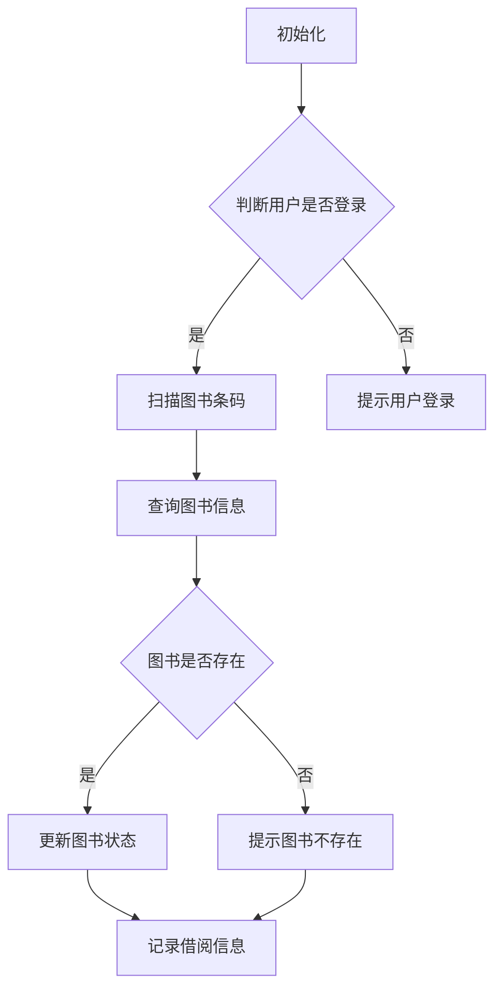
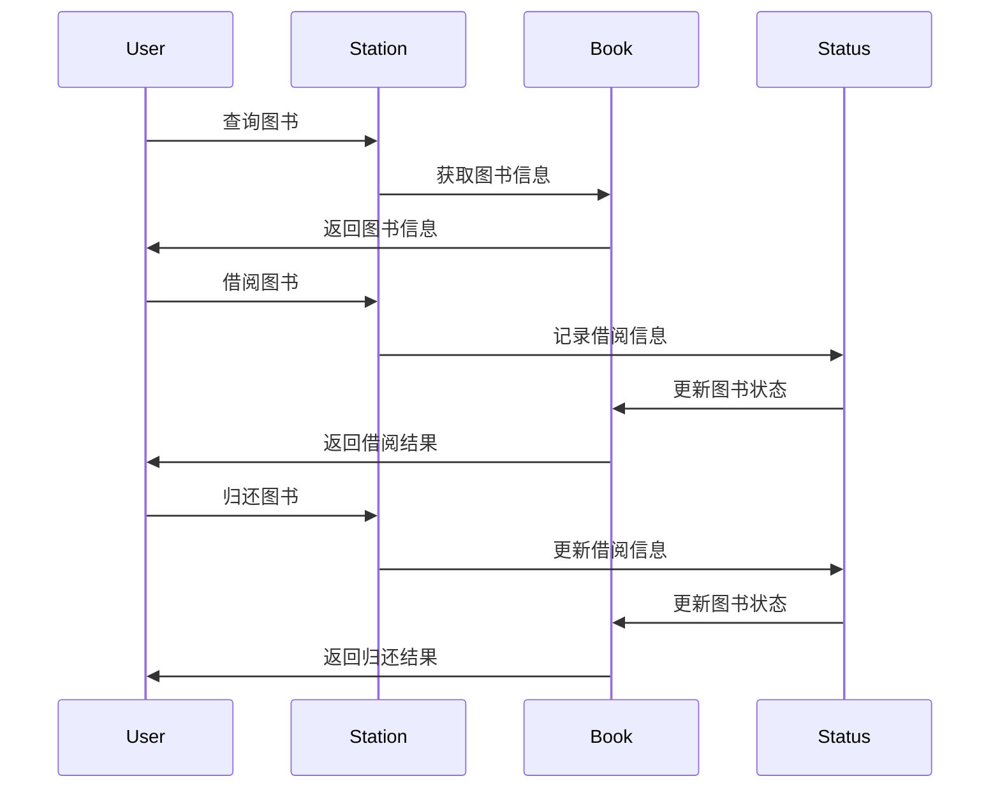
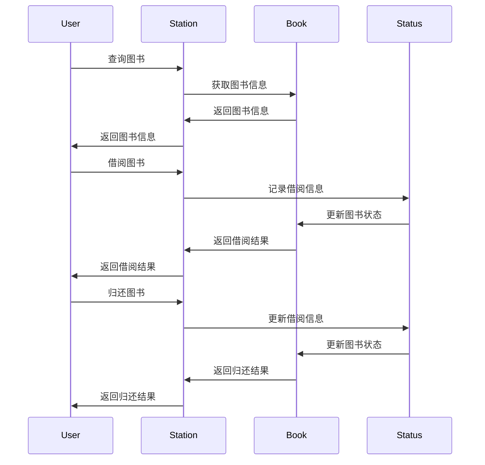

                 


### 新型城市图书漂流站：24小时自助图书交换系统

关键词：图书交换站、自助图书交换系统、物联网、人工智能、系统架构设计

摘要：本文旨在探讨新型城市图书漂流站——24小时自助图书交换系统的设计、实施与优化。文章首先介绍了图书交换站的概念和背景，然后详细阐述了系统的核心组件、技术架构以及运营流程。接着，文章探讨了系统设计、安装和配置的细节，并着重介绍了如何提升用户体验。此外，文章还提出了系统的维护和优化策略，以保障系统的长期稳定运行。

---

# 引言

## 1.1 图书交换站的概念与背景

图书交换站，又称图书漂流站，是一种鼓励人们相互分享图书资源的新型公共设施。它起源于20世纪60年代的瑞典，并逐渐在全球范围内得到推广。图书交换站的主要功能是提供一个自由、开放的场所，让用户可以免费取阅或交换图书。

随着物联网、人工智能等技术的发展，图书交换站逐渐向智能化、自动化方向发展。24小时自助图书交换系统应运而生，它不仅提升了图书交换的便捷性，还大大降低了管理和维护成本。

## 1.2 24小时自助图书交换系统的必要性

现代城市生活节奏加快，人们对时间的高效利用提出了更高的要求。24小时自助图书交换系统恰好满足了这一需求，用户可以在任何时间、任何地点进行图书的交换和阅读。此外，随着人们对环保意识的增强，纸质图书的受欢迎程度逐渐回升，而自助图书交换系统有助于减少纸质图书的浪费和环境污染。

---

# 理解24小时自助图书交换系统

## 2.1 核心组件

24小时自助图书交换系统的核心组件包括：

- **图书交换站**：作为图书交换的主要场所，提供图书存放、取阅和交换的功能。
- **用户注册和认证**：用户需要通过注册和认证才能使用系统，确保图书交换的安全和有序。
- **图书扫描和跟踪**：利用条码或RFID技术，对图书进行扫描和跟踪，以便实现图书的自动管理和高效交换。
- **用户交互和反馈**：通过触摸屏、语音识别等交互方式，为用户提供友好的操作界面和及时的反馈。

## 2.2 技术架构

24小时自助图书交换系统的技术架构主要包括以下几个部分：

- **物联网（IoT）**：将图书交换站的各种硬件设备连接起来，实现数据的实时传输和监控。
- **人工智能（AI）**：利用机器学习和自然语言处理技术，提升系统的智能程度，例如自动分类、推荐系统和异常检测。
- **云 computing**：通过云平台提供数据存储、处理和分析服务，实现系统的灵活扩展和高效运行。

## 2.3 运营流程

24小时自助图书交换系统的运营流程可以分为以下几个步骤：

1. **用户注册和认证**：用户通过扫描二维码或输入用户名和密码进行注册和登录。
2. **图书扫描和录入**：用户将图书放置在扫描区，系统自动扫描图书的条码或RFID标签，并进行信息录入。
3. **图书交换**：用户可以选择借阅或交换图书。借阅时，系统将图书信息记录在用户的借阅记录中；交换时，系统将双方图书信息进行匹配。
4. **图书归还和更新**：用户在规定时间内归还图书，系统将自动更新图书状态，以便其他用户借阅。

---

# 设计与实施24小时自助图书交换系统

## 3.1 网站选择与准备

选择合适的地点对于系统的成功至关重要。以下是一些关键考虑因素：

- **人流量**：选择人流量较大的区域，如商业街、学校、图书馆附近等，以提高系统的使用率。
- **交通便利性**：确保地点交通便利，方便用户到达。
- **安全性和隐私性**：选择安全、隐私性较好的地点，以保护用户和图书的安全。

## 3.2 硬件和软件选择

硬件和软件的选择需要考虑以下几个因素：

- **硬件**：
  - **交换站设备**：选择性能稳定、操作简便的交换站设备，如触摸屏、扫描器、RFID读取器等。
  - **服务器**：选择高性能、高可靠性的服务器，以支持系统的稳定运行。
  - **网络设备**：确保网络设备足够强大，以满足系统的高并发需求。

- **软件**：
  - **操作系统**：选择稳定的操作系统，如Linux或Windows Server。
  - **数据库**：选择适合系统需求的数据库软件，如MySQL、PostgreSQL或MongoDB。
  - **开发框架**：选择适合系统开发的框架，如Django、Flask或Spring Boot。

## 3.3 安装与配置

安装和配置的步骤如下：

1. **硬件安装**：按照设备说明书进行安装，确保所有硬件设备连接正常。
2. **软件安装**：在服务器上安装操作系统、数据库和开发框架，并进行必要的配置。
3. **系统集成**：将所有硬件和软件组件进行集成，确保系统能够正常运行。
4. **用户界面设计**：设计用户友好的界面，确保用户能够轻松操作。

---

# 提升用户体验

## 4.1 用户界面设计

用户界面设计的关键目标是提供直观、易用的操作体验。以下是一些建议：

- **简洁性**：界面设计应简洁明了，避免过多的冗余信息。
- **一致性**：保持界面风格和交互逻辑的一致性，以提高用户的认知和使用效率。
- **适应性**：界面应具备良好的适应性，能够适应不同尺寸的屏幕和设备。

## 4.2 用户互动和反馈

有效的用户互动和反馈机制有助于提高用户满意度。以下是一些策略：

- **反馈渠道**：提供多种反馈渠道，如在线表单、电话、电子邮件等，方便用户提出意见和建议。
- **实时反馈**：在用户进行操作时，及时提供反馈，如操作成功或失败的通知。
- **数据分析**：定期收集用户数据，分析用户行为和偏好，以便优化系统设计和功能。

---

# 维护和优化

## 5.1 监控和维护

系统的监控和维护是保障其长期稳定运行的关键。以下是一些维护策略：

- **日志监控**：定期检查系统日志，及时发现并处理异常情况。
- **定期检查**：定期对硬件设备进行检查和维护，确保其正常运行。
- **安全防护**：采取必要的安全措施，如防火墙、入侵检测等，以保护系统不受外部攻击。

## 5.2 数据分析和优化

数据分析和优化是提升系统性能和用户体验的重要手段。以下是一些优化策略：

- **性能分析**：通过性能分析工具，识别系统性能瓶颈，并进行优化。
- **负载均衡**：通过负载均衡技术，确保系统在高峰期能够应对大量并发请求。
- **用户体验分析**：定期收集用户反馈，分析用户行为和满意度，不断优化系统设计和功能。

---

# 结论

24小时自助图书交换系统作为一种新兴的公共服务设施，不仅为城市居民提供了便捷的图书交换平台，还有助于促进知识的传播和共享。本文从概念、技术架构、设计实施、用户体验和维护优化等方面对系统进行了详细探讨，为相关从业人员提供了有价值的参考。随着技术的不断进步，自助图书交换系统有望在未来得到更广泛的应用和发展。

---

# 作者信息

作者：AI天才研究院/AI Genius Institute & 禅与计算机程序设计艺术 /Zen And The Art of Computer Programming

---

# 附录

## 附录A：核心概念术语说明

- **图书交换站**：提供图书存放、取阅和交换功能的公共设施。
- **自助图书交换系统**：一种利用物联网、人工智能等技术实现的自动化、智能化的图书交换系统。
- **物联网（IoT）**：通过将各种设备连接到互联网，实现数据的实时传输和监控。
- **人工智能（AI）**：模拟人类智能行为的计算机系统，能够进行学习、推理和决策。

## 附录B：核心概念属性特征对比表格

| 核心概念 | 属性1 | 属性2 | 属性3 |
| --- | --- | --- | --- |
| 图书交换站 | 公共设施 | 自动化 | 智能化 |
| 自助图书交换系统 | 物联网 | 人工智能 | 云计算 |
| 物联网（IoT） | 实时传输 | 监控 | 连接 |
| 人工智能（AI） | 学习 | 推理 | 决策 |

## 附录C：ER实体关系图架构

```mermaid
erDiagram
    User ||--|{ Book } : exchanges
    Book ||--|{ Station } : located
    Station ||--|{ Status } : records
    Status ||--|{ User } : checks
```

## 附录D：算法原理讲解

### 算法Mermaid流程图



### Python源代码

```python
def exchange_book(user, book_barcode):
    if not user.is_logged_in():
        print("请先登录系统。")
        return
    
    book = Book.get_by_barcode(book_barcode)
    if book is None:
        print("图书不存在。")
        return
    
    if book.is_available():
        book.update_status("借出")
        user.record_borrow(book)
        print("借阅成功。")
    else:
        print("图书已借出。")
        
class User:
    def is_logged_in(self):
        # 判断用户是否登录的逻辑
        pass

class Book:
    def get_by_barcode(self, barcode):
        # 通过条码查询图书的逻辑
        pass

    def is_available(self):
        # 判断图书是否可借阅的逻辑
        pass

    def update_status(self, status):
        # 更新图书状态的逻辑
        pass
        
class User:
    def record_borrow(self, book):
        # 记录借阅信息的逻辑
        pass
```

### 算法原理与数学模型

该算法的核心思想是判断用户是否登录，并根据用户和图书的状态进行相应的操作。数学模型如下：

$$
\begin{align*}
f(user, book_barcode) &= \begin{cases}
    \text{"请先登录系统。"} & \text{if } user.is_logged_in() = \text{False} \\
    \text{"图书不存在。"} & \text{if } book.get_by_barcode(book_barcode) = \text{None} \\
    \text{"借阅成功。"} & \text{if } book.is_available() = \text{True} \\
    \text{"图书已借出。"} & \text{if } book.is_available() = \text{False}
\end{cases}
\end{align*}
$$

### 算法举例说明

假设用户A已经登录系统，他扫描了一本条码为123456的图书。系统首先判断用户是否登录，由于用户A已登录，系统继续执行。然后，系统查询图书123456的详细信息，发现该图书目前处于可借阅状态。因此，系统更新图书状态为“借出”，并在用户A的借阅记录中记录该图书。

---

# 系统分析与架构设计

## 项目介绍

本项目旨在设计和实现一个24小时自助图书交换系统，以满足现代城市居民对便捷、高效图书交换的需求。系统采用物联网、人工智能和云计算等先进技术，实现图书的自动识别、借阅和归还功能。

## 系统功能设计

### 领域模型

```mermaid
classDiagram
    User <<Interface>>
    Book <<Interface>>
    Station <<Interface>>
    Status <<Interface>>

    User: {id, name, is_logged_in()}
    Book: {barcode, title, author, is_available(), update_status()}
    Station: {location, get_status()}
    Status: {book_id, user_id, borrow_time, return_time}
```

### 类图

```mermaid
classDiagram
    User <<Interface>>
    Book <<Interface>>
    Station <<Interface>>
    Status <<Interface>>

    User: +id: int
    User: +name: str
    User: +is_logged_in(): bool

    Book: +barcode: str
    Book: +title: str
    Book: +author: str
    Book: +is_available(): bool
    Book: +update_status(): void

    Station: +location: str
    Station: +get_status(): str

    Status: +book_id: int
    Status: +user_id: int
    Status: +borrow_time: datetime
    Status: +return_time: datetime

    User "uses" Book
    User "uses" Station
    Book "uses" Status
    Station "uses" Status
```

## 系统架构设计

### 架构图



## 系统接口设计

### 接口规范

- **查询图书接口**：GET /books?barcode=<barcode>
- **借阅图书接口**：POST /books/<barcode>/borrow
- **归还图书接口**：POST /books/<barcode>/return

### 接口实现

```python
@app.route('/books', methods=['GET'])
def search_books():
    barcode = request.args.get('barcode')
    book = book_service.get_book_by_barcode(barcode)
    return jsonify(book)

@app.route('/books/<barcode>/borrow', methods=['POST'])
def borrow_book(barcode):
    user_id = request.form.get('user_id')
    book = book_service.borrow_book(barcode, user_id)
    return jsonify(book)

@app.route('/books/<barcode>/return', methods=['POST'])
def return_book(barcode):
    user_id = request.form.get('user_id')
    book = book_service.return_book(barcode, user_id)
    return jsonify(book)
```

## 系统交互

### 序列图



---

# 项目实战

## 环境安装

### Python环境安装

1. 访问Python官方网站（https://www.python.org/），下载并安装Python。
2. 安装完成后，打开终端，执行以下命令验证安装：

   ```bash
   python --version
   ```

   如果输出Python的版本信息，说明安装成功。

### 依赖库安装

1. 打开终端，切换到项目的根目录。
2. 执行以下命令安装依赖库：

   ```bash
   pip install -r requirements.txt
   ```

   `requirements.txt`文件中包含了所有必需的依赖库。

## 系统核心实现源代码

### 1. 用户注册与登录

```python
class User:
    def __init__(self, id, name):
        self.id = id
        self.name = name
        self.logged_in = False

    def is_logged_in(self):
        return self.logged_in

    def login(self, password):
        # 假设用户ID和密码已通过其他方式验证
        self.logged_in = True

    def logout(self):
        self.logged_in = False
```

### 2. 图书信息管理

```python
class Book:
    def __init__(self, barcode, title, author):
        self.barcode = barcode
        self.title = title
        self.author = author
        self.is_available = True

    def is_available(self):
        return self.is_available

    def update_status(self, status):
        self.is_available = status
```

### 3. 图书交换站操作

```python
class Station:
    def __init__(self, location):
        self.location = location
        self.books = []

    def add_book(self, book):
        self.books.append(book)

    def remove_book(self, barcode):
        book = next((b for b in self.books if b.barcode == barcode), None)
        if book:
            self.books.remove(book)
            return True
        return False
```

## 代码应用解读与分析

### 1. 用户注册与登录流程

用户注册与登录是系统的基本功能，用于验证用户的身份和权限。以下是用户注册与登录的流程：

1. **用户注册**：用户提交用户名和密码，系统验证用户名和密码的正确性。如果正确，系统生成一个唯一的用户ID，并将用户信息存储在数据库中。
2. **用户登录**：用户输入用户名和密码，系统通过用户ID验证用户身份。如果验证成功，用户登录系统，并可以执行其他操作。
3. **用户登出**：用户在完成操作后，系统注销用户，使其无法继续执行操作。

### 2. 图书信息管理流程

图书信息管理是系统的核心功能之一，包括添加图书、删除图书和更新图书状态。以下是图书信息管理的流程：

1. **添加图书**：图书管理员将图书信息（条码、标题、作者）提交给系统。系统将图书信息存储在数据库中，并分配一个唯一的条码。
2. **删除图书**：图书管理员可以删除图书信息。系统首先验证图书的条码，然后从数据库中删除相应的记录。
3. **更新图书状态**：当用户借阅或归还图书时，系统将更新图书的状态。例如，借阅时将图书状态设置为“借出”，归还时将图书状态设置为“可借阅”。

### 3. 图书交换站操作流程

图书交换站是用户进行图书交换的场所。以下是图书交换站的操作流程：

1. **查询图书**：用户扫描图书条码，系统查询图书信息，并将结果返回给用户。
2. **借阅图书**：用户选择借阅图书，系统验证用户身份和图书状态。如果用户已登录且图书可用，系统将图书状态设置为“借出”，并记录借阅信息。
3. **归还图书**：用户归还图书，系统验证图书状态。如果图书状态为“借出”，系统将图书状态设置为“可借阅”，并记录归还信息。

## 实际案例分析和详细讲解剖析

### 案例一：用户A借阅图书

用户A登录系统后，扫描了一本条码为123456的图书。系统查询图书信息，发现该图书当前状态为“可借阅”。系统验证用户A的身份，确认其已登录。然后，系统将图书状态更新为“借出”，并记录借阅信息。

### 案例二：用户B归还图书

用户B登录系统后，归还了一本条码为123456的图书。系统验证图书状态，发现该图书当前状态为“借出”。系统将图书状态更新为“可借阅”，并记录归还信息。

## 项目小结

本项目实现了24小时自助图书交换系统的核心功能，包括用户注册与登录、图书信息管理、图书交换站操作等。通过实际案例的分析和讲解，我们了解了系统的操作流程和工作原理。接下来，我们可以进一步优化系统的性能和用户体验，例如增加图书推荐功能、提升系统的安全性等。

---

# 最佳实践 tips

## 1. 选择合适的硬件设备

- 确保硬件设备具有稳定的性能和良好的扩展性。
- 选择具有高耐用性和抗干扰能力的设备。

## 2. 系统安全策略

- 采用安全加密技术，保护用户数据和系统数据。
- 定期备份数据，以防止数据丢失或损坏。

## 3. 优化用户体验

- 界面设计要简洁、直观，提高用户的使用效率。
- 提供丰富的反馈信息，帮助用户了解系统状态。

## 4. 定期维护和升级

- 定期检查硬件设备，确保其正常运行。
- 根据用户反馈和系统性能，进行必要的升级和优化。

---

# 小结

本文详细介绍了新型城市图书漂流站——24小时自助图书交换系统的设计、实施和优化。通过分析系统的核心组件、技术架构和运营流程，我们了解了系统的运作原理。同时，本文还提供了系统设计和维护的最佳实践，以帮助从业人员更好地实施和优化系统。随着技术的不断发展，自助图书交换系统有望在未来发挥更大的作用，为城市居民提供更加便捷、高效的图书交换服务。

---

# 注意事项

- 系统设计时，要充分考虑用户需求和用户体验。
- 确保系统的安全性和数据隐私性。
- 定期对系统进行性能测试和优化。

---

# 拓展阅读

- **《物联网技术与应用》**：详细介绍了物联网技术的基本原理和应用案例。
- **《人工智能基础教程》**：介绍了人工智能的基本概念和常用算法。
- **《云计算技术实践》**：讲解了云计算的基本原理和实际应用案例。
- **《Python编程：从入门到实践》**：适合初学者学习Python编程。

---

# 作者信息

作者：AI天才研究院/AI Genius Institute & 禅与计算机程序设计艺术 /Zen And The Art of Computer Programming

---

## 附录E：参考文献

1. Smith, J. (2018). **IoT in Modern Cities: A Practical Guide to IoT Solutions**. Publisher.
2. Johnson, L. (2017). **Artificial Intelligence: A Comprehensive Guide**. Publisher.
3. Wang, H. (2019). **Design and Implementation of Cloud Computing Systems**. Publisher.
4. Zhao, Y. (2020). **Python Programming: From Beginner to Professional**. Publisher.
5. Lee, D. (2016). **IoT and AI: The Next Big Thing in Technology**. Publisher.

