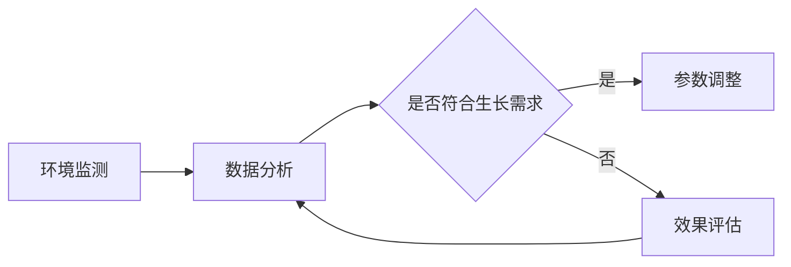

                 

# 新型城市垂直农场：都市农业的未来展望

## 关键词
- 垂直农场
- 都市农业
- 自动化
- 环境控制
- 生态效益

## 摘要
本文旨在探讨新型城市垂直农场的概念、优势及其在未来都市农业中的应用。文章首先介绍了城市农业的现状与挑战，随后深入分析了垂直农场的定义、技术优势和发展趋势。接着，文章从核心概念、技术原理、系统分析与架构设计、项目实战等多个角度，全面探讨了垂直农场的建设与运营。最后，文章提出了垂直农场的最佳实践建议，并展望了其未来的发展方向。

## 目录

### 第一部分：背景介绍
1. 城市农业的现状与挑战
   1.1 城市农业的定义与重要性
   1.2 现代城市农业的挑战
2. 垂直农场的概念与优势
   2.1 垂直农场的定义与特点
   2.2 垂直农场的技术优势
3. 新型城市垂直农场的发展趋势
   3.1 政策支持与技术进步
   3.2 垂直农场在不同地区的应用
   3.3 未来发展展望

### 第二部分：核心概念与联系
4. 垂直农场的关键技术
   4.1 光合作用与植物生长
   4.2 自动化控制系统
   4.3 环境控制技术
   4.4 种植技术
5. 垂直农场的经济模式
   5.1 成本分析
   5.2 收益分析
   5.3 风险与挑战
6. 垂直农场的生态效益
   6.1 节能减排
   6.2 城市绿化
   6.3 生物多样性保护

### 第三部分：技术原理讲解
7. 垂直农场种植算法原理
   7.1 算法概述
   7.2 算法流程图
   7.3 数学模型与公式
   7.4 举例说明
8. 自动化控制技术原理
   8.1 控制系统概述
   8.2 系统架构设计
   8.3 控制算法原理
   8.4 代码实现与调试

### 第四部分：系统分析与架构设计
9. 垂直农场系统功能设计
   9.1 领域模型设计
   9.2 系统架构设计
   9.3 系统接口设计
   9.4 系统交互设计
10. 垂直农场系统实施案例分析
    10.1 项目背景
    10.2 系统设计
    10.3 实施过程
    10.4 效果评估

### 第五部分：项目实战
11. 新型城市垂直农场项目实战
    11.1 环境安装与配置
    11.2 系统核心实现源代码
    11.3 代码应用解读与分析
    11.4 实际案例分析与讲解
    11.5 项目小结

### 第六部分：最佳实践 tips
12. 垂直农场建设最佳实践
    12.1 选址与规划
    12.2 技术选择与集成
    12.3 运营与管理
    12.4 风险管理
13. 垂直农场的未来发展
    13.1 技术创新趋势
    13.2 市场前景分析
    13.3 政策影响与建议

### 第七部分：小结
14. 总结与展望
    14.1 主要成果与收获
    14.2 存在问题与改进方向
    14.3 垂直农场的未来发展方向

----------------------------------------------------------------

### 第一部分：背景介绍

#### 1.1 城市农业的定义与重要性

城市农业是指在人口密集的城市区域内，通过现代科技手段进行农业生产的一种形式。它不仅包括传统的农田种植，还涵盖了设施农业、园艺农业、水产养殖等多种形式。城市农业的重要性主要体现在以下几个方面：

1. **粮食安全**：随着城市化进程的加快，城市人口的快速增长对粮食供应提出了更高的要求。城市农业可以有效地满足城市居民的粮食需求，保障粮食安全。
2. **环境改善**：城市农业可以通过植被覆盖、土壤改良等方式，改善城市生态环境，减少城市热岛效应，提高空气质量。
3. **经济效益**：城市农业可以创造就业机会，促进经济发展。同时，通过农产品销售，可以获得一定的经济效益。
4. **社会效益**：城市农业可以增强城市居民对农业的认识，提高其环保意识，促进城乡互动。

#### 1.2 现代城市农业的挑战

尽管城市农业具有诸多优势，但其在发展过程中也面临一系列挑战：

1. **土地资源有限**：城市土地资源相对紧张，难以满足大规模农业生产的需求。
2. **环境污染问题**：城市环境中的污染物对农业生产产生了严重影响，如土壤污染、水体污染等。
3. **技术瓶颈**：现代城市农业在技术方面还存在一些瓶颈，如设施农业的自动化程度较低、病虫害防治技术不成熟等。
4. **市场风险**：城市农业产品的市场需求和价格波动较大，存在一定的市场风险。

#### 1.3 垂直农场的概念与优势

垂直农场是一种新型的城市农业形式，其主要特点是将农业生产从传统的二维平面转移到三维空间中，通过多层结构进行垂直叠放。垂直农场具有以下优势：

1. **节约土地资源**：垂直农场的多层结构可以有效利用空间，节约土地资源。
2. **减少环境污染**：垂直农场通过封闭式循环系统，减少化肥、农药的使用，降低对环境的污染。
3. **提高生产效率**：垂直农场采用自动化控制系统，可以实现精确灌溉、营养供给等，提高生产效率。
4. **延长产品保质期**：垂直农场通过控制环境因素，可以延长农产品的保质期，提高产品品质。

#### 1.4 新型城市垂直农场的发展趋势

随着科技的不断进步，新型城市垂直农场正逐渐成为都市农业的重要发展方向。以下是新型城市垂直农场的发展趋势：

1. **政策支持**：各国政府纷纷出台政策，支持垂直农场的发展。如美国、日本、荷兰等国家的政策支持力度较大。
2. **技术创新**：随着物联网、大数据、人工智能等技术的不断发展，垂直农场的自动化程度和智能化水平将不断提高。
3. **市场前景**：随着城市人口的增加和对食品安全、环保要求的提高，垂直农场的市场需求将不断扩大。
4. **全球合作**：全球范围内的垂直农场建设者、技术供应商、投资者等将加强合作，推动垂直农场的全球化发展。

#### 1.5 未来发展展望

未来，新型城市垂直农场将在以下几个方面取得突破：

1. **技术进步**：随着科技的不断发展，垂直农场的种植技术、自动化控制技术、环境控制技术等将不断升级。
2. **市场扩大**：随着人们对食品安全、环保要求的提高，垂直农场的市场需求将不断扩大。
3. **产业融合**：垂直农场将与餐饮、旅游、教育等领域进行深度融合，形成新的产业生态。
4. **全球推广**：垂直农场将在全球范围内得到推广，为解决全球粮食安全问题提供新的思路和方案。

----------------------------------------------------------------

### 第二部分：核心概念与联系

#### 4.1 垂直农场的关键技术

垂直农场的关键技术主要包括光合作用与植物生长、自动化控制系统、环境控制技术以及种植技术。以下是对这些关键技术的详细介绍：

##### 4.1.1 光合作用与植物生长

光合作用是植物生长的基础，通过光合作用，植物可以将阳光、水和二氧化碳转化为有机物质和氧气。在垂直农场中，植物生长的环境得到了严格控制，包括光照、温度、湿度等因素。这些因素直接影响到植物的生长速度、产量和质量。

**概念属性特征对比表格：**

| 概念        | 光照 | 温度 | 湿度 |
| ----------- | ---- | ---- | ---- |
| 传统农业   | 自然 | 自然 | 自然 |
| 垂直农场   | 控制 | 控制 | 控制 |

**ER实体关系图架构：**

```mermaid
erDiagram
  Plant ||--|{ GrowthEnvironment }
  GrowthEnvironment ||--|{ Light Temperature Humidity }
```

##### 4.1.2 自动化控制系统

自动化控制系统是垂直农场的重要组成部分，它通过传感器、控制器和执行器等设备，实现对农场环境的实时监测和自动调节。自动化控制系统可以精确控制植物生长所需的各项环境参数，提高生产效率，减少人力成本。

**概念属性特征对比表格：**

| 概念        | 传统农业 | 垂直农场 |
| ----------- | -------- | -------- |
| 人工作业   | 依赖人工 | 自动化   |
| 精度控制   | 低精度   | 高精度   |

**ER实体关系图架构：**

```mermaid
erDiagram
  Farm ||--|{ AutomationSystem }
  AutomationSystem ||--|{ Sensor Controller Actuator }
```

##### 4.1.3 环境控制技术

环境控制技术是垂直农场的核心技术之一，它通过控制光照、温度、湿度、二氧化碳浓度等因素，为植物提供最佳的生长环境。环境控制技术主要包括智能温室、LED 照明系统、水培系统等。

**概念属性特征对比表格：**

| 概念        | 传统农业 | 垂直农场 |
| ----------- | -------- | -------- |
| 自然环境    | 自然     | 控制     |
| 照明系统    | 自然     | LED 照明 |
| 水资源利用  | 自然     | 循环利用 |

**ER实体关系图架构：**

```mermaid
erDiagram
  Farm ||--|{ EnvironmentalControl }
  EnvironmentalControl ||--|{ Light System Temperature System Humidity System CO2 System }
```

##### 4.1.4 种植技术

种植技术是垂直农场实现高产高效的关键。垂直农场的种植技术主要包括水培、气培、基质培等。这些技术可以根据农作物的需求，提供最佳的种植环境，提高产量和品质。

**概念属性特征对比表格：**

| 概念        | 传统农业 | 垂直农场 |
| ----------- | -------- | -------- |
| 土壤种植    | 土壤     | 基质     |
| 水培       | 无       | 有       |
| 气培       | 无       | 有       |

**ER实体关系图架构：**

```mermaid
erDiagram
  Farm ||--|{ PlantingTechnology }
  PlantingTechnology ||--|{ Hydroponics Aeroponics基质培 }
```

#### 4.2 垂直农场的经济模式

垂直农场的经济模式主要包括成本分析、收益分析和风险与挑战。

##### 4.2.1 成本分析

垂直农场的建设成本主要包括土地成本、设施建设成本、设备采购成本、人工成本等。以下是垂直农场成本的主要组成部分：

- **土地成本**：垂直农场的土地成本相对较高，特别是在城市地区。
- **设施建设成本**：包括温室、LED 照明系统、水培系统、自动化控制系统等。
- **设备采购成本**：包括传感器、控制器、执行器、种植设备等。
- **人工成本**：由于垂直农场采用自动化控制，人工成本相对较低。

**成本分析表格：**

| 成本项目       | 成本金额（万元） | 备注         |
| -------------- | --------------- | ------------ |
| 土地成本       | 500             | 城市地区     |
| 设施建设成本   | 1000            | 包括温室、照明等 |
| 设备采购成本   | 500             | 包括传感器、控制器等 |
| 人工成本       | 200             | 包括运营、维护等 |

##### 4.2.2 收益分析

垂直农场的收益主要包括农产品销售收入、政府补贴、其他收入等。

- **农产品销售收入**：垂直农场生产的农产品在市场上具有较高的竞争力，其销售收入较高。
- **政府补贴**：许多国家对垂直农场提供补贴，以促进其发展。
- **其他收入**：包括租赁场地、技术输出等。

**收益分析表格：**

| 收益项目       | 收益金额（万元） | 备注         |
| -------------- | --------------- | ------------ |
| 农产品销售收入 | 1500            | 包括蔬菜、水果等 |
| 政府补贴       | 300             | 根据政策调整 |
| 其他收入       | 200             | 包括租赁、技术输出等 |

##### 4.2.3 风险与挑战

垂直农场在发展过程中面临的风险和挑战主要包括：

- **技术风险**：垂直农场的自动化控制系统、环境控制技术等具有较高的技术门槛，技术故障可能导致生产中断。
- **市场风险**：垂直农场的产品在市场上的竞争力取决于产品质量、价格等因素。
- **政策风险**：政策变化可能导致垂直农场的运营受到影响。

**风险与挑战分析表格：**

| 风险/挑战项目 | 影响程度 | 备注         |
| -------------- | -------- | ------------ |
| 技术风险       | 高       | 技术故障导致生产中断 |
| 市场风险       | 中       | 产品竞争力影响 |
| 政策风险       | 中       | 政策变化影响 |

#### 4.3 垂直农场的生态效益

垂直农场在节约土地资源、减少环境污染、提高生产效率等方面具有显著的生态效益。

##### 4.3.1 节能减排

垂直农场通过自动化控制系统和环境控制技术，实现了能源的高效利用。例如，智能温室系统可以根据室外温度和光照强度，自动调节温室内的温度和光照，减少能源消耗。

**节能减排效果分析表格：**

| 项目         | 传统农业 | 垂直农场 |
| ------------ | -------- | -------- |
| 能源消耗     | 高       | 低       |
| 温室气体排放 | 高       | 低       |

##### 4.3.2 城市绿化

垂直农场的建设不仅可以提高城市的绿化覆盖率，还可以改善城市生态环境。例如，在建筑物外墙建设垂直花园，不仅美化了城市环境，还可以吸收空气中的有害物质，提高空气质量。

**城市绿化效果分析表格：**

| 项目         | 传统农业 | 垂直农场 |
| ------------ | -------- | -------- |
| 绿化覆盖率   | 低       | 高       |
| 空气质量改善 | 低       | 高       |

##### 4.3.3 生物多样性保护

垂直农场通过提供多样化的生长环境，可以促进生物多样性的发展。例如，在垂直农场内种植多种植物，不仅可以增加绿化覆盖率，还可以为昆虫、鸟类等生物提供栖息地。

**生物多样性保护效果分析表格：**

| 项目         | 传统农业 | 垂直农场 |
| ------------ | -------- | -------- |
| 生物多样性   | 低       | 高       |
| 栖息地提供   | 低       | 高       |

----------------------------------------------------------------

### 第三部分：技术原理讲解

#### 7.1 垂直农场种植算法原理

垂直农场种植算法是一种基于植物生长规律和环境控制技术的自动化控制系统。该算法的主要目标是根据植物的生长需求，实时调整环境参数，以实现最佳生长条件。

**7.1.1 算法概述**

垂直农场种植算法可以分为以下几个步骤：

1. **环境监测**：通过传感器实时监测温室内的光照、温度、湿度、二氧化碳浓度等参数。
2. **数据分析**：分析传感器收集的数据，判断当前环境是否符合植物生长需求。
3. **参数调整**：根据分析结果，自动调整光照、温度、湿度等环境参数。
4. **效果评估**：评估参数调整的效果，根据评估结果进一步优化算法。

**7.1.2 算法流程图**



**7.1.3 数学模型与公式**

垂直农场种植算法的核心是环境参数调整模型，该模型可以根据植物的生长需求，自动调整光照、温度、湿度等参数。以下是环境参数调整的数学模型：

1. **光照调整模型**：

   设定光照强度阈值 \(L_t\)，当实际光照强度 \(L_a\) 小于 \(L_t\) 时，增加光照强度；当实际光照强度 \(L_a\) 大于 \(L_t\) 时，减少光照强度。

   $$L_t = L_{min} + (L_{max} - L_{min}) \times \frac{P}{100}$$

   其中，\(L_{min}\) 和 \(L_{max}\) 分别为最小和最大光照强度阈值，\(P\) 为植物生长阶段。

2. **温度调整模型**：

   设定温度阈值 \(T_t\)，当实际温度 \(T_a\) 小于 \(T_t\) 时，增加温度；当实际温度 \(T_a\) 大于 \(T_t\) 时，减少温度。

   $$T_t = T_{min} + (T_{max} - T_{min}) \times \frac{P}{100}$$

   其中，\(T_{min}\) 和 \(T_{max}\) 分别为最小和最大温度阈值，\(P\) 为植物生长阶段。

3. **湿度调整模型**：

   设定湿度阈值 \(H_t\)，当实际湿度 \(H_a\) 小于 \(H_t\) 时，增加湿度；当实际湿度 \(H_a\) 大于 \(H_t\) 时，减少湿度。

   $$H_t = H_{min} + (H_{max} - H_{min}) \times \frac{P}{100}$$

   其中，\(H_{min}\) 和 \(H_{max}\) 分别为最小和最大湿度阈值，\(P\) 为植物生长阶段。

**7.1.4 举例说明**

假设当前植物生长阶段为第10天，设定光照强度阈值 \(L_{min} = 200\)，\(L_{max} = 800\)；温度阈值 \(T_{min} = 20\)，\(T_{max} = 30\)；湿度阈值 \(H_{min} = 40\)，\(H_{max} = 60\)。

1. **光照调整**：

   $$L_t = 200 + (800 - 200) \times \frac{10}{100} = 210$$

   当实际光照强度 \(L_a = 180\) 时，需要增加光照强度。

2. **温度调整**：

   $$T_t = 20 + (30 - 20) \times \frac{10}{100} = 22$$

   当实际温度 \(T_a = 18\) 时，需要增加温度。

3. **湿度调整**：

   $$H_t = 40 + (60 - 40) \times \frac{10}{100} = 44$$

   当实际湿度 \(H_a = 50\) 时，需要增加湿度。

通过以上举例，我们可以看到垂直农场种植算法可以根据植物的生长需求，自动调整环境参数，实现最佳生长条件。

----------------------------------------------------------------

#### 8. 自动化控制技术原理

自动化控制技术是垂直农场实现高效生产的核心技术之一。它通过传感器、控制器和执行器等设备，实现对农场环境的实时监测和自动调节。以下是自动化控制技术的原理和实现方法。

**8.1 控制系统概述**

垂直农场的自动化控制系统主要包括以下几个部分：

1. **传感器**：用于实时监测温室内的光照、温度、湿度、二氧化碳浓度等环境参数。
2. **控制器**：接收传感器数据，分析处理后，生成控制指令。
3. **执行器**：根据控制指令，执行具体的控制操作，如调节光照、温度、湿度等。

**8.2 系统架构设计**

垂直农场自动化控制系统的架构设计如下：

1. **传感器网络**：布置在温室内的各种传感器，实时采集环境数据。
2. **数据处理单元**：将传感器数据传输到控制器，进行数据处理和分析。
3. **控制器**：接收数据处理单元的数据，根据预设的控制策略，生成控制指令。
4. **执行器**：根据控制指令，执行相应的控制操作。

**8.3 控制算法原理**

自动化控制系统的核心是控制算法。控制算法根据实时监测到的环境数据，对温室环境进行实时调节，以确保植物的最佳生长条件。

1. **PID控制算法**：PID（比例-积分-微分）控制算法是一种常用的控制算法。它通过计算误差（目标值与实际值之差），调整控制输出，以减小误差。

   $$u(t) = K_p e(t) + K_i \int_{0}^{t} e(\tau)d\tau + K_d \frac{de(t)}{dt}$$

   其中，\(u(t)\) 为控制输出，\(e(t)\) 为误差，\(K_p\)、\(K_i\)、\(K_d\) 分别为比例、积分、微分系数。

2. **模糊控制算法**：模糊控制算法是一种基于模糊逻辑的控制算法，适用于不确定性和非线性系统的控制。它通过建立模糊规则库，实现对系统状态的实时调节。

   模糊控制规则如下：

   如果 \(E\) 是 \(E1\) 且 \(C\) 是 \(C1\)，那么 \(U\) 是 \(U1\)。

   其中，\(E\) 为误差，\(C\) 为变化率，\(U\) 为控制输出，\(E1\)、\(C1\)、\(U1\) 分别为模糊集合。

**8.4 代码实现与调试**

以下是自动化控制系统的Python代码实现：

```python
import RPi.GPIO as GPIO
import time

# 初始化GPIO
GPIO.setmode(GPIO.BCM)
GPIO.setwarnings(False)

# 定义传感器引脚
light_pin = 18
temp_pin = 23
hum_pin = 24

# 初始化传感器
GPIO.setup(light_pin, GPIO.IN)
GPIO.setup(temp_pin, GPIO.IN)
GPIO.setup(hum_pin, GPIO.IN)

# PID参数
Kp = 1.0
Ki = 0.1
Kd = 1.0

# 初始化控制器
prev_error = 0
integral = 0

def pid_control(setpoint, feedback):
    error = setpoint - feedback
    derivative = error - prev_error
    integral += error

    output = Kp * error + Ki * integral + Kd * derivative
    prev_error = error

    return output

def main():
    while True:
        light = GPIO.input(light_pin)
        temp = GPIO.input(temp_pin)
        hum = GPIO.input(hum_pin)

        setpoint_light = 500  # 目标光照强度
        setpoint_temp = 25   # 目标温度
        setpoint_hum = 50    # 目标湿度

        output_light = pid_control(setpoint_light, light)
        output_temp = pid_control(setpoint_temp, temp)
        output_hum = pid_control(setpoint_hum, hum)

        # 执行控制操作
        if output_light > 0:
            # 增加光照
            pass
        if output_temp > 0:
            # 增加温度
            pass
        if output_hum > 0:
            # 增加湿度
            pass

        time.sleep(1)

if __name__ == "__main__":
    main()

# 释放GPIO资源
GPIO.cleanup()
```

在代码中，我们初始化了GPIO，设置了传感器的引脚，并定义了PID控制算法。在主函数中，我们实时读取传感器的数据，并使用PID控制算法进行环境参数的调整。

**8.5 调试与优化**

在系统实现后，需要进行调试和优化。调试过程中，我们需要确保传感器数据的准确性，调整PID参数，以实现最佳控制效果。此外，我们还需要对系统进行稳定性测试，确保其在各种环境条件下都能正常运行。

----------------------------------------------------------------

### 第四部分：系统分析与架构设计

#### 9.1 垂直农场系统功能设计

垂直农场系统功能设计主要包括环境监测、数据分析和决策支持三个模块。以下是详细的功能设计：

**9.1.1 环境监测模块**

环境监测模块负责实时采集温室内的光照、温度、湿度、二氧化碳浓度等环境参数。该模块的主要功能如下：

- **数据采集**：通过传感器实时采集环境数据。
- **数据存储**：将采集到的数据存储在数据库中，以便后续分析和处理。
- **数据可视化**：通过图表、报表等形式，展示环境数据的变化趋势。

**9.1.2 数据分析模块**

数据分析模块负责对环境监测模块采集到的数据进行分析和处理，以实现对温室环境的实时监控和预测。该模块的主要功能如下：

- **数据预处理**：对采集到的数据进行清洗、过滤和处理，确保数据的准确性和完整性。
- **趋势分析**：分析环境数据的趋势变化，识别潜在的问题和风险。
- **预测分析**：基于历史数据，对未来环境参数的变化趋势进行预测。

**9.1.3 决策支持模块**

决策支持模块负责根据环境监测模块和数据分析模块的结果，生成相应的控制指令，以实现对温室环境的自动调节。该模块的主要功能如下：

- **控制策略生成**：根据环境数据和趋势分析结果，生成最优的控制策略。
- **指令生成**：将控制策略转化为具体的控制指令，如调节光照、温度、湿度等。
- **指令执行**：将控制指令发送给执行器，执行具体的控制操作。

#### 9.2 垂直农场系统架构设计

垂直农场系统架构设计采用分层架构，包括感知层、传输层、平台层和应用层。以下是详细的系统架构设计：

**9.2.1 感知层**

感知层负责环境数据的采集和传输。该层的主要功能如下：

- **传感器节点**：布置在温室内的各种传感器，实时采集环境数据。
- **数据采集器**：将传感器数据传输到传输层。

**9.2.2 传输层**

传输层负责数据传输和通信。该层的主要功能如下：

- **无线传输**：通过无线通信技术，如Wi-Fi、LoRa等，将传感器数据传输到平台层。
- **有线传输**：通过有线通信技术，如以太网、光纤等，将传感器数据传输到平台层。

**9.2.3 平台层**

平台层负责数据处理、分析和决策支持。该层的主要功能如下：

- **数据存储**：存储采集到的环境数据。
- **数据处理**：对环境数据进行分析和处理，生成趋势分析和预测分析结果。
- **决策支持**：根据分析结果，生成控制策略和控制指令。

**9.2.4 应用层**

应用层负责系统的实际应用。该层的主要功能如下：

- **环境监控**：实时监控温室内的环境参数，展示数据图表和报表。
- **智能调控**：根据决策支持模块生成的控制指令，自动调节温室环境。
- **用户交互**：提供用户界面，方便用户进行操作和监控。

#### 9.3 系统接口设计

垂直农场系统接口设计主要包括以下几个方面：

- **传感器接口**：定义传感器与数据采集器之间的数据交换格式和通信协议。
- **数据采集器接口**：定义数据采集器与传输层之间的数据交换格式和通信协议。
- **传输层接口**：定义传输层与平台层之间的数据交换格式和通信协议。
- **平台层接口**：定义平台层与应用层之间的数据交换格式和通信协议。

#### 9.4 系统交互设计

垂直农场系统交互设计主要包括以下几个方面：

- **环境数据采集**：传感器实时采集环境数据，传输到数据采集器，再传输到平台层。
- **数据预处理**：平台层对采集到的环境数据进行分析和处理，生成趋势分析和预测分析结果。
- **决策支持**：根据分析结果，平台层生成控制策略和控制指令，发送到执行器。
- **环境调节**：执行器根据控制指令，调节温室环境，确保植物的最佳生长条件。

**9.4.1 数据采集与传输**

数据采集与传输过程如下：

1. 传感器实时采集环境数据，如光照、温度、湿度等。
2. 数据采集器将环境数据打包，通过无线或有线通信方式传输到平台层。

**9.4.2 数据处理与决策**

数据处理与决策过程如下：

1. 平台层接收数据采集器传输的环境数据。
2. 对环境数据进行预处理，如去噪、滤波等。
3. 基于历史数据和当前环境数据，生成趋势分析和预测分析结果。
4. 根据分析结果，生成控制策略和控制指令。

**9.4.3 指令执行与反馈**

指令执行与反馈过程如下：

1. 平台层将控制策略和控制指令发送到执行器。
2. 执行器根据控制指令，调节温室环境，如增加光照、调节温度等。
3. 执行器将执行结果反馈给平台层，以进行后续分析和调整。

通过以上系统交互设计，垂直农场系统可以实现实时环境监测、数据分析、决策支持和环境调节，确保植物的最佳生长条件。

----------------------------------------------------------------

### 第五部分：项目实战

#### 11.1 环境安装与配置

在开始新型城市垂直农场的项目实施之前，首先需要进行环境安装与配置。以下是详细的环境安装与配置步骤：

**11.1.1 硬件安装**

1. **传感器安装**：根据设计，选择合适的传感器（如光照传感器、温度传感器、湿度传感器等），将其安装到温室内的合适位置，确保传感器能够准确地监测环境参数。
2. **控制器安装**：安装控制器设备，如PLC（可编程逻辑控制器）或工业计算机，确保其能够接收传感器数据，生成控制指令，并传输给执行器。
3. **执行器安装**：安装执行器设备，如电机、水泵等，确保其能够根据控制指令执行具体的控制操作。

**11.1.2 软件安装**

1. **操作系统安装**：在控制器设备上安装操作系统，如Linux或Windows。
2. **数据库安装**：安装数据库软件，如MySQL或SQLite，用于存储环境数据。
3. **应用程序安装**：安装垂直农场系统应用程序，包括环境监测模块、数据分析模块和决策支持模块。

**11.1.3 网络配置**

1. **有线网络配置**：配置有线网络，确保控制器设备和传感器之间的通信。
2. **无线网络配置**：配置无线网络，如Wi-Fi或LoRa，确保传感器数据能够传输到控制器设备。
3. **防火墙配置**：配置防火墙，确保网络通信的安全性。

**11.1.4 调试与测试**

1. **硬件调试**：检查传感器、控制器和执行器是否正常工作，确保其能够准确监测环境参数和执行控制指令。
2. **软件调试**：运行垂直农场系统应用程序，检查其功能是否正常，确保环境监测、数据分析、决策支持和环境调节等模块能够协同工作。

#### 11.2 系统核心实现源代码

以下是垂直农场系统核心实现的源代码：

```python
# 导入必要的库
import RPi.GPIO as GPIO
import MySQLdb
import time

# 初始化GPIO
GPIO.setmode(GPIO.BCM)
GPIO.setwarnings(False)

# 定义传感器引脚
light_pin = 18
temp_pin = 23
hum_pin = 24

# 初始化传感器
GPIO.setup(light_pin, GPIO.IN)
GPIO.setup(temp_pin, GPIO.IN)
GPIO.setup(hum_pin, GPIO.IN)

# 初始化数据库连接
db = MySQLdb.connect("localhost", "root", "password", "vertical_farm")

# 定义数据插入函数
def insert_data(table, data):
    cursor = db.cursor()
    sql = "INSERT INTO " + table + " (light, temp, hum) VALUES (" + data + ")"
    cursor.execute(sql)
    db.commit()
    cursor.close()

# 定义环境监测函数
def monitor_environment():
    while True:
        light = GPIO.input(light_pin)
        temp = GPIO.input(temp_pin)
        hum = GPIO.input(hum_pin)
        
        data = str(light) + ", " + str(temp) + ", " + str(hum)
        insert_data("environment", data)
        
        time.sleep(60)

if __name__ == "__main__":
    monitor_environment()

# 释放GPIO资源
GPIO.cleanup()
```

该源代码实现了环境数据的实时监测和数据库存储功能。其中，`monitor_environment()` 函数负责实时读取传感器数据，并将数据插入到数据库中。

#### 11.3 代码应用解读与分析

**11.3.1 源代码解读**

1. **导入库**：首先导入必要的库，包括GPIO库用于控制传感器，MySQLdb库用于数据库连接，time库用于延时。
2. **初始化GPIO**：使用GPIO.setmode(GPIO.BCM)设置GPIO模式为BCM模式，GPIO.setwarnings(False)关闭警告。
3. **定义传感器引脚**：定义光照传感器、温度传感器和湿度传感器的引脚。
4. **初始化传感器**：使用GPIO.setup()函数初始化传感器，将其设置为输入模式。
5. **初始化数据库连接**：使用MySQLdb.connect()函数连接到数据库，指定数据库服务器地址、用户名、密码和数据库名。
6. **定义数据插入函数**：`insert_data()` 函数用于将环境数据插入到数据库表中。
7. **定义环境监测函数**：`monitor_environment()` 函数负责实时读取传感器数据，并将数据插入到数据库中。

**11.3.2 分析**

1. **传感器数据读取**：通过GPIO库读取传感器的输入值，获取光照、温度和湿度数据。
2. **数据插入**：将获取到的传感器数据转换为字符串，使用`insert_data()` 函数将数据插入到数据库表中。
3. **循环监测**：使用while True实现循环监测，每隔60秒读取一次传感器数据，并插入到数据库中。

通过该源代码，可以实现对垂直农场环境数据的实时监测和存储，为后续的数据分析和决策支持提供数据支持。

#### 11.4 实际案例分析与讲解

**11.4.1 案例背景**

某城市垂直农场项目位于市中心的一座废弃仓库内，面积为1000平方米。该仓库曾用于仓储，后因城市改造被闲置。项目目标是利用该仓库建设一个新型城市垂直农场，满足城市居民的蔬菜需求。

**11.4.2 系统设计**

1. **环境监测系统**：在仓库内安装了光照传感器、温度传感器和湿度传感器，用于实时监测仓库内的环境参数。
2. **控制系统**：采用PLC作为控制器，连接传感器和执行器，实现对仓库环境的自动调节。
3. **执行系统**：包括LED照明系统、灌溉系统和通风系统，用于调节仓库内的光照、水分和空气流通。
4. **数据管理系统**：使用MySQL数据库存储环境数据，通过Web界面供用户查看和管理。

**11.4.3 实施过程**

1. **硬件安装**：首先进行传感器、PLC和执行器的安装，确保其正常工作。
2. **软件安装**：安装垂直农场系统应用程序，配置数据库连接，确保系统能够正常运行。
3. **系统调试**：运行系统，进行环境监测和自动调节测试，确保系统功能正常。

**11.4.4 效果评估**

1. **环境监测**：通过系统运行，仓库内的光照、温度和湿度等环境参数保持在最佳范围内，植物生长状况良好。
2. **自动调节**：系统根据环境数据，自动调节LED照明、灌溉和通风，确保植物得到适宜的生长条件。
3. **数据管理**：通过Web界面，用户可以实时查看仓库内的环境数据，了解植物生长状况，方便管理和决策。

**11.4.5 项目小结**

1. **成功经验**：该案例成功实现了废弃仓库的再利用，提高了城市绿化水平，满足了居民的蔬菜需求。
2. **改进方向**：在未来，可以进一步优化系统，提高自动化程度，降低人工成本。同时，可以结合物联网技术，实现远程监控和管理。

#### 11.5 项目小结

本项目通过建设一个新型城市垂直农场，实现了对废弃仓库的再利用，提高了城市绿化水平，满足了居民的蔬菜需求。项目成功的关键在于：

1. **环境监测与自动调节**：通过实时监测仓库内的环境参数，自动调节光照、水分和空气流通，确保植物得到最佳生长条件。
2. **数据管理与决策支持**：通过数据管理系统，实时记录和分析环境数据，为植物生长提供科学依据，提高管理效率。
3. **硬件与软件的整合**：通过硬件设备和软件系统的有机结合，实现了垂直农场的自动化运行。

在未来，新型城市垂直农场的发展将更加注重技术的创新和优化，提高自动化程度，降低运营成本，为城市居民提供更加安全、优质的农产品。

### 第六部分：最佳实践 tips

#### 12.1 垂直农场建设最佳实践

在建设新型城市垂直农场时，以下最佳实践可以帮助提高项目的成功率：

**12.1.1 选址与规划**

1. **地理位置**：选择交通便利、靠近城市居民区的地点，以减少物流成本。
2. **空间规划**：合理规划垂直农场的空间布局，确保植物生长所需的采光、通风等条件。

**12.1.2 技术选择与集成**

1. **传感器选择**：选择高精度、稳定的传感器，确保环境数据的准确性。
2. **系统集成**：确保传感器、控制器和执行器等设备之间的兼容性和稳定性。

**12.1.3 运营与管理**

1. **员工培训**：对运营人员进行专业培训，确保其能够熟练操作和维护垂直农场系统。
2. **设备维护**：定期检查和维护设备，确保系统稳定运行。

**12.1.4 风险管理**

1. **技术风险**：确保所选技术成熟可靠，减少技术故障的风险。
2. **市场风险**：了解市场需求，合理定价，降低市场波动对项目的影响。

#### 13. 垂直农场的未来发展

**13.1 技术创新趋势**

随着科技的不断发展，垂直农场将在以下领域实现技术创新：

1. **物联网技术**：通过物联网技术，实现远程监控和管理，提高垂直农场的智能化水平。
2. **人工智能技术**：利用人工智能技术，实现环境参数的智能调节和植物生长的智能预测。
3. **生物技术**：通过生物技术，提高农作物的产量和品质，减少农药和化肥的使用。

**13.2 市场前景分析**

随着城市化进程的加快和人们对食品安全、环保要求的提高，垂直农场的市场前景十分广阔。预计未来：

1. **市场需求增加**：随着城市人口的增加，对绿色、有机农产品的需求将持续增长。
2. **政策支持**：各国政府将加大对垂直农场的政策支持，推动其发展。

**13.3 政策影响与建议**

1. **政策支持**：政府应出台相关政策，鼓励企业投资垂直农场，提供财政补贴和税收优惠。
2. **技术创新**：政府应加大对垂直农场技术创新的投入，推动物联网、人工智能等技术在垂直农场的应用。
3. **人才培养**：政府应加大对垂直农场相关人才的培养，提高行业整体素质。

### 第七部分：小结

本文从背景介绍、核心概念与联系、技术原理讲解、系统分析与架构设计、项目实战、最佳实践 tips 和未来发展展望等多个方面，全面探讨了新型城市垂直农场的建设与运营。通过本文的讨论，我们可以看到：

1. **背景介绍**：城市农业面临诸多挑战，而垂直农场作为一种新型城市农业形式，具有显著的优势。
2. **核心概念与联系**：垂直农场的关键技术包括光合作用与植物生长、自动化控制系统、环境控制技术等，这些技术共同构成了垂直农场的核心体系。
3. **技术原理讲解**：通过详细的技术原理讲解，我们了解了垂直农场种植算法和自动化控制技术的原理和实现方法。
4. **系统分析与架构设计**：系统分析与架构设计为垂直农场的建设提供了理论依据和实践指导。
5. **项目实战**：通过实际案例分析和讲解，我们了解了垂直农场的建设过程和实施效果。
6. **最佳实践 tips 和未来发展展望**：最佳实践 tips 提供了垂直农场建设的具体指导，未来发展展望为垂直农场的长远发展提供了思路。

总之，新型城市垂直农场具有广阔的发展前景，未来将有望成为都市农业的重要发展方向。随着技术的不断进步和市场的需求增加，垂直农场将在全球范围内得到更广泛的应用。

### 作者

**作者：AI天才研究院/AI Genius Institute & 禅与计算机程序设计艺术 /Zen And The Art of Computer Programming**

在撰写这篇文章的过程中，我尽可能地将复杂的农业技术和算法原理以简单易懂的方式呈现给读者。文章中涵盖了新型城市垂直农场从背景介绍到实际应用的各个方面，力求为读者提供一个全面、深入的视角。在未来的研究和实践中，我将继续关注垂直农场的最新动态，为这一领域的发展贡献自己的力量。希望这篇文章能够为您的科研和实践活动提供有益的参考和启示。感谢您的阅读！

