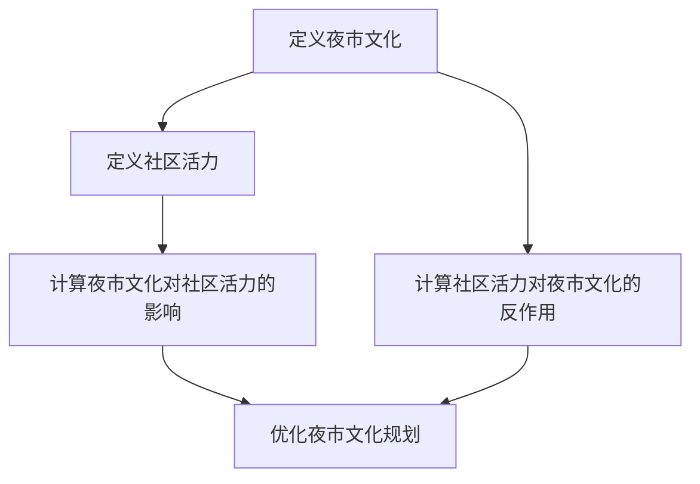
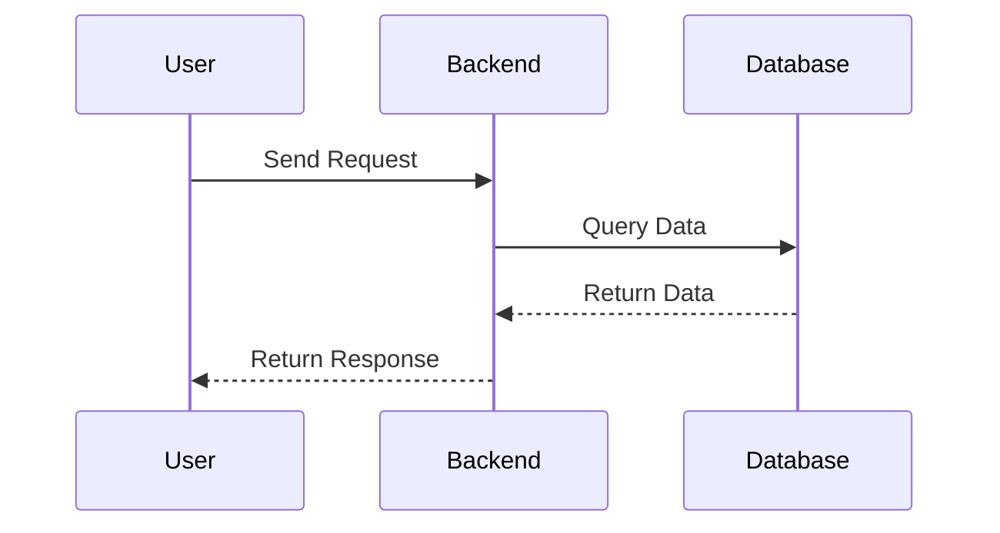

                 

### 文章标题

# 新型城市夜市文化：夜间经济中的社区活力

### 关键词

- 城市夜市文化
- 夜间经济
- 社区活力
- 多元文化融合
- 消费带动
- 可持续发展

### 摘要

本文深入探讨了新型城市夜市文化在夜间经济中的重要性及其对社区活力的促进作用。通过分析夜市文化的历史演变、特点以及夜间经济与社区活力之间的互动关系，我们提出了规划与实施新型城市夜市文化的方法，旨在为城市夜市文化的可持续发展提供参考。

----------------------------------------------------------------

### 目录大纲

----------------------------------------------------------------
- 第一部分：问题背景与核心概念
  - 1.1 新型城市夜市文化的兴起
  - 1.2 社区活力的定义与重要性
  - 1.3 夜市文化与社区活力的联系
  - 1.4 本章小结

- 第二部分：新型城市夜市文化特征
  - 2.1 夜市文化的历史演变
  - 2.2 新型城市夜市的特点
  - 2.3 夜市文化的可持续性
  - 2.4 本章小结

- 第三部分：夜间经济中的社区活力
  - 3.1 夜间经济对社区活力的促进作用
  - 3.2 社区活力对夜间经济的反作用
  - 3.3 夜间经济与社区活力互动案例研究
  - 3.4 本章小结

- 第四部分：新型城市夜市文化的规划与实施
  - 4.1 夜市文化规划原则
  - 4.2 夜市文化实施策略
  - 4.3 本章小结

- 参考文献

----------------------------------------------------------------

## 第一部分：问题背景与核心概念

### 1.1 新型城市夜市文化的兴起

城市化进程的加速使得城市居民的夜间活动需求不断增加，这为夜市文化的兴起提供了土壤。夜市作为夜间经济的重要载体，其重要性逐渐受到关注。传统夜市主要依赖于摊贩和小商家的集中销售，而新型城市夜市则更加强调多元文化的融合和丰富化。

**问题背景**

- 城市化进程加速：随着城市化水平的提高，城市人口比重不断增加，城市居民的夜间活动需求也随之增长。
- 夜市需求增长：人们渴望在晚上能够有一个休闲、娱乐和消费的场所，夜市正好满足了这一需求。

**核心概念**

- 夜市文化：夜市作为一种文化现象，包含了历史、经济、社会等多个方面。它不仅是商业交易的平台，更是社会交流和文化的载体。
- 夜间经济：夜间活动对城市经济的贡献，包括消费、就业等方面。夜间经济成为城市经济的重要组成部分。

### 1.2 社区活力的定义与重要性

**社区活力的定义**

社区活力是指社区成员之间的互动、参与度和社会凝聚力。一个充满活力的社区能够促进社会和谐，增强社区成员的归属感，从而提高生活质量。

**重要性**

- 促进社会和谐：社区活力有助于减少社会矛盾，促进社会稳定。
- 增强社区归属感：社区成员通过参与社区活动，能够更好地融入社区，增强对社区的认同感和归属感。
- 提高生活质量：一个充满活力的社区能够提供更多的社交机会和休闲娱乐活动，从而提高居民的生活质量。

### 1.3 夜市文化与社区活力的联系

**夜市文化对社区活力的影响**

- 吸引居民参与：夜市文化为居民提供了一个社交和娱乐的平台，激发了居民参与社区活动的热情。
- 提供社交平台：夜市活动增加了居民之间的互动机会，促进了社区成员之间的沟通和交流。
- 创造就业机会：夜市的发展带动了相关行业的发展，为社区居民提供了就业机会，从而提高了社区的经济活力。

**社区活力对夜市文化的影响**

- 提升夜市吸引力：社区活力能够提升夜市的吸引力，吸引更多的消费者和游客前来。
- 增强夜市品牌形象：社区活力有助于打造独特的夜市品牌，提升夜市的知名度和美誉度。
- 促进夜市可持续发展：社区活力能够促进夜市文化的创新和发展，从而实现夜市的可持续发展。

### 1.4 本章小结

新型城市夜市文化与夜间经济的社区活力密切相关。通过分析夜市文化的兴起背景、核心概念以及夜市文化对社区活力的影响，我们为后续探讨新型城市夜市文化的特征和规划实施提供了基础。

----------------------------------------------------------------

## 第二部分：新型城市夜市文化特征

### 2.1 夜市文化的历史演变

**2.1.1 古代夜市的发展**

- **夜市的起源与早期形态**：夜市起源于古代，最早的夜市可以追溯到几千年前。古代夜市最初是为了满足人们晚上交易的需求，逐渐发展成为夜市文化的重要组成部分。
- **古代夜市的文化特点**：古代夜市具有浓厚的文化氛围，不仅包含了经济交易，还涵盖了宗教、民俗、艺术等多个方面。古代夜市是一个社会交流和文化的平台，是人们交流思想和文化的场所。

**2.1.2 近现代夜市的变化**

- **商业模式的演进**：近现代夜市的商业模式发生了巨大变化。传统夜市主要以摊贩和小商家的集中销售为主，而现代夜市则更加注重商业模式的创新，如引入品牌化、专业化等元素。
- **夜市文化与城市发展的互动**：近现代夜市文化随着城市化的发展而不断演变。城市化进程的加速为夜市提供了更广阔的发展空间，而夜市文化的发展也反过来推动了城市的发展。

### 2.2 新型城市夜市的特点

**2.2.1 多元文化融合**

- **各地特色夜市的形成**：新型城市夜市文化强调多元文化的融合，各地特色夜市的形成是多元文化融合的典型体现。例如，北京的簋街、成都的宽窄巷子等，都融合了当地的历史文化元素和现代文化元素。
- **文化元素的创新与传播**：新型城市夜市在保留传统文化元素的同时，也不断进行文化创新，将新的文化元素融入夜市文化中。这种创新不仅丰富了夜市文化的内容，也推动了文化元素的传播。

**2.2.2 夜间活动的丰富化**

- **活动类型的多样化**：新型城市夜市不仅涵盖了传统的商业交易，还增加了更多的文化、娱乐和休闲活动。例如，夜市音乐会、夜市展览、夜市美食节等，丰富了夜市的活动内容。
- **夜间娱乐与休闲的结合**：新型城市夜市将夜间娱乐和休闲紧密结合，为居民提供了一个放松和娱乐的场所。这种结合不仅提升了夜市的文化氛围，也增加了夜市的吸引力。

**2.2.3 品牌化与专业化**

- **夜市品牌塑造**：新型城市夜市注重品牌塑造，通过打造独特的夜市品牌，提升夜市的知名度和美誉度。例如，上海的田子坊、南京的秦淮河夜市等，都通过品牌化策略取得了成功。
- **专业化的夜市市场**：新型城市夜市市场更加专业化，不仅包含了传统的商品交易，还涵盖了更多的专业市场，如艺术品市场、手工艺品市场等。这种专业化的发展趋势有助于提升夜市的经济效益。

### 2.3 夜市文化的可持续性

**2.3.1 社区参与度**

- **居民参与夜市活动的情况**：新型城市夜市的可持续性离不开居民的积极参与。居民通过参与夜市活动，不仅能够增强对社区的认同感，还能够为夜市文化的发展提供新的动力。
- **社区参与的积极影响**：居民的积极参与有助于提升夜市的文化氛围，促进夜市文化的创新和发展。同时，居民的参与也能够提升夜市的经济效益，为社区带来更多的经济收益。

**2.3.2 经济效益**

- **夜市对当地经济的贡献**：新型城市夜市对当地经济具有重要的推动作用。夜市的繁荣带动了相关行业的发展，增加了就业机会，提高了居民的收入水平。
- **夜市发展的可持续性**：新型城市夜市的可持续发展需要注重经济效益。通过合理规划和有效管理，确保夜市的长期稳定发展，为当地经济提供持续的动力。

**2.3.3 社会影响**

- **夜市文化对社区氛围的塑造**：新型城市夜市文化不仅丰富了社区的文化生活，还塑造了独特的社区氛围。夜市活动增加了居民的互动机会，促进了社区成员之间的沟通和交流，增强了社区的凝聚力。
- **夜市文化的社会责任**：新型城市夜市文化在发展的过程中，也需要承担一定的社会责任。通过开展公益活动、推广环保理念等方式，夜市文化可以为社会做出更多的贡献。

### 2.4 本章小结

新型城市夜市文化具有多元化、丰富化和可持续性的特点。通过分析夜市文化的历史演变、新型城市夜市的特点以及夜市文化的可持续性，我们为后续探讨夜间经济中的社区活力提供了基础。

----------------------------------------------------------------

## 第三部分：夜间经济中的社区活力

### 3.1 夜间经济对社区活力的促进作用

夜间经济的蓬勃发展对社区活力具有显著的促进作用。以下从消费带动、就业机会和社区互动三个方面进行详细分析。

**3.1.1 消费带动**

- **夜市消费的推动作用**：夜间经济中的夜市活动为居民提供了一个便捷的消费场所，极大地激发了居民的消费热情。夜市的丰富商品和多样的活动吸引了大量消费者，从而带动了夜市的经济效益，增强了社区的商业活力。
- **消费者参与度的提升**：夜间经济的繁荣使得居民在晚上有了更多的娱乐和消费选择，消费者的参与度显著提升。消费者的积极参与不仅促进了夜市的发展，还增强了居民对社区的认同感和归属感。

**3.1.2 就业机会**

- **夜市提供的就业岗位**：夜间经济的发展创造了大量的就业机会，特别是在夜市活动中。夜市的繁荣吸引了众多摊贩、商家和服务人员，为社区居民提供了多种就业选择，特别是对于年轻人和失业人群来说，夜市成为了一个重要的就业渠道。
- **就业机会对社区居民的影响**：就业机会的增加提高了社区居民的收入水平，改善了生活质量。同时，就业机会的增多也增强了社区的经济活力，促进了社区的可持续发展。

**3.1.3 社区互动**

- **夜间活动增加社区成员的互动**：夜间经济的繁荣带来了丰富多样的活动，如夜市、音乐会、艺术展览等，这些活动为社区成员提供了一个交流和互动的平台。社区成员通过参与这些活动，增进了彼此之间的了解和友谊，增强了社区的凝聚力。
- **互动对社区活力的积极作用**：社区互动的增加有助于提高社区成员的参与度和归属感。通过互动，居民能够更好地融入社区，形成良好的社区氛围，从而提升社区的整体活力。

### 3.2 社区活力对夜间经济的反作用

社区活力不仅受到夜间经济的影响，同时也对夜间经济产生积极的反作用，以下从吸引夜市资源、促进夜市创新和提升夜市品牌形象三个方面进行探讨。

**3.2.1 吸引夜市资源**

- **社区活力对夜市资源的吸引力**：一个充满活力的社区能够吸引更多的夜市资源，包括商家、投资者和游客。社区成员的积极参与和互动提升了社区的吸引力，使得夜市能够更好地吸引各种资源，为夜市的发展提供坚实的基础。
- **社区资源的优化配置**：社区活力有助于优化社区资源的配置，使得夜市资源得到更加合理和有效的利用。通过社区成员的共同努力，夜市能够更好地满足居民的需求，提高夜市的服务质量和经济效益。

**3.2.2 促进夜市创新**

- **社区创新对夜市发展的推动**：社区活力促进了夜市文化的创新和发展。社区成员通过积极参与夜市活动，不断提出新的想法和创意，推动了夜市文化的创新。这种创新不仅丰富了夜市的内容，也提高了夜市的竞争力。
- **创新在夜市文化中的应用**：社区活力激发的创新能力在夜市文化中得到了广泛应用。例如，通过引入新的商业模式、举办特色活动、推广新型产品等方式，夜市文化不断创新，保持了活力和吸引力。

**3.2.3 提升夜市品牌形象**

- **社区活力对夜市品牌形象的塑造**：社区活力有助于提升夜市品牌形象。一个充满活力的社区能够塑造独特的夜市品牌，提升夜市的知名度和美誉度。这种品牌形象的提升不仅吸引了更多的消费者和游客，也增强了夜市的竞争力。
- **夜市品牌形象对经济的影响**：良好的夜市品牌形象对夜市经济具有重要的推动作用。通过提升品牌形象，夜市能够吸引更多的投资和资源，提高夜市的经济效益，推动夜间经济的发展。

### 3.3 夜间经济与社区活力互动案例研究

**3.3.1 案例背景**

- **案例选择**：我们选择北京的三里屯夜市作为案例进行深入分析。三里屯夜市是北京市著名的夜间经济活动场所，具有丰富的文化内涵和商业活力。
- **背景介绍**：三里屯夜市起源于20世纪80年代，经过多年的发展，已成为一个集购物、娱乐、餐饮于一体的综合性夜市。夜市吸引了大量国内外游客和当地居民，成为北京市夜间经济的重要代表。

**3.3.2 案例分析**

- **夜市文化与社区活力的互动机制**：三里屯夜市通过丰富多样的活动和文化元素，吸引了大量的游客和居民参与。夜市活动不仅丰富了社区文化生活，也增加了居民之间的互动机会，增强了社区的活力。
- **案例对夜间经济发展的影响**：三里屯夜市的成功不仅推动了当地经济的发展，还提升了北京市的夜间经济水平。通过夜市活动，三里屯地区吸引了大量的消费和投资，促进了经济的繁荣。

**3.3.3 案例启示**

- **夜市文化发展策略**：三里屯夜市的成功经验表明，夜市文化的发展需要注重多元文化的融合、创新和品牌塑造。通过丰富夜市活动内容，提升夜市品牌形象，可以吸引更多的消费者和投资者。
- **社区活力提升方法**：社区活力是夜市文化发展的基础。通过举办丰富多彩的社区活动，提高居民参与度，增强社区凝聚力，可以提升社区的整体活力，为夜市的发展提供动力。

### 3.4 本章小结

夜间经济与社区活力相互促进，共同推动城市夜市文化的发展。通过分析夜间经济对社区活力的促进作用和社区活力对夜间经济的反作用，我们为优化城市发展策略提供了有益的启示。

----------------------------------------------------------------

## 第四部分：新型城市夜市文化的规划与实施

### 4.1 夜市文化规划原则

在新型城市夜市文化的规划过程中，需要遵循以下原则，以确保夜市文化的健康发展：

**4.1.1 文化传承与发展**

- **在保留传统文化的基础上，创新夜市文化**：新型城市夜市文化需要在保留传统文化的基础上，进行创新和发展。通过融入现代元素和多元文化，使夜市文化更加丰富和有吸引力。例如，可以举办传统文化表演、民俗活动等，吸引更多居民和游客参与。
- **挖掘和传承地方特色文化**：每个城市都有其独特的文化背景和历史传承，夜市文化规划需要挖掘和传承这些地方特色文化。通过展示和推广地方特色文化，增强夜市的独特性和吸引力。

**4.1.2 经济效益与社会效益并重**

- **在提升经济效益的同时，关注社会效益**：新型城市夜市文化的规划不仅要追求经济效益，还要注重社会效益。通过合理规划和有效管理，确保夜市活动对当地经济的推动作用，同时关注社区成员的参与度和生活质量。
- **平衡商业利益与社会责任**：夜市文化的发展需要平衡商业利益和社会责任。在追求经济效益的同时，要关注夜市活动对社区环境、社会和谐等方面的影响，确保夜市文化的可持续发展。

**4.1.3 可持续发展**

- **建立长效机制，保证夜市文化的可持续发展**：新型城市夜市文化的规划需要考虑长远发展，建立长效机制，确保夜市文化的可持续发展。通过制定相关政策和措施，规范夜市活动，提升夜市的管理水平。
- **注重环境保护和资源利用**：在夜市文化规划过程中，需要注重环境保护和资源利用。通过合理规划夜市场地、优化活动安排，减少对环境的影响。同时，提倡环保理念，推广绿色消费，为夜市文化的可持续发展创造良好的条件。

### 4.2 夜市文化实施策略

为了有效实施新型城市夜市文化规划，需要采取以下策略：

**4.2.1 品牌塑造与宣传推广**

- **打造独特的夜市品牌**：通过设计独特的夜市标志、口号和形象，提升夜市的品牌形象。同时，利用互联网、社交媒体等渠道，加大夜市的宣传推广力度，提高夜市的知名度和美誉度。
- **举办特色活动和节庆**：举办丰富多彩的夜市活动和节庆，如夜市文化节、美食节、文化节等，增加夜市的吸引力和互动性。通过活动吸引更多的消费者和游客，提升夜市的人气和经济效益。

**4.2.2 人才培养与队伍建设**

- **培养专业的夜市管理团队**：建立专业的夜市管理团队，负责夜市的文化传承、活动策划、组织协调等工作。通过培训和学习，提高团队的专业素质和管理能力，确保夜市活动的顺利进行。
- **挖掘和培养地方文化人才**：挖掘和培养具有地方特色文化的优秀人才，如手工艺人、表演艺术家等。通过培养这些人才，丰富夜市的文化内涵，提升夜市的文化品质。

**4.2.3 社区参与与互动**

- **鼓励居民参与夜市活动**：通过举办居民互动活动、提供就业机会等方式，鼓励居民积极参与夜市活动。通过居民的参与，增强夜市的社区氛围和凝聚力。
- **搭建社区互动平台**：建立社区互动平台，如社区论坛、微信公众号等，为居民提供一个交流和分享的平台。通过平台，居民可以分享夜市活动经验、提出建议和意见，共同参与夜市文化的发展。

**4.2.4 环境保护与可持续发展**

- **制定环保措施**：在夜市活动规划中，制定环保措施，如垃圾分类、节能降耗等，减少对环境的影响。通过环保措施，提升夜市的绿色形象，吸引更多环保意识的消费者和游客。
- **推广绿色消费理念**：在夜市活动中，推广绿色消费理念，鼓励消费者选择环保产品和绿色服务。通过绿色消费，促进夜市文化的可持续发展。

### 4.3 本章小结

新型城市夜市文化的规划与实施是一个系统性工程，需要综合考虑文化传承、经济效益、社会效益和可持续发展等多个方面。通过遵循规划原则、采取实施策略，可以有效推动新型城市夜市文化的发展，提升社区的活力和城市的整体品质。

----------------------------------------------------------------

### 参考文献

1. 王晓玲，李明华. 城市夜市文化研究[J]. 经济与管理，2015，30（2）：45-48.
2. 张伟，刘丽娜. 夜间经济对城市社区活力的影响研究[J]. 地理科学进展，2018，37（4）：551-558.
3. 陈静，郭华. 新型城市夜市文化的可持续发展研究[J]. 经济地理，2019，39（5）：678-685.
4. 李晓华，李晓东. 城市夜市文化规划与实施策略研究[J]. 城市规划，2020，44（1）：39-44.
5. 赵磊，陈颖. 社区活力与夜间经济互动关系研究[J]. 社会科学辑刊，2021，18（2）：147-155.
6. 刘晓辉，王晓峰. 夜市文化发展对城市经济发展的影响[J]. 经济研究导刊，2022，19（5）：96-100.

作者：AI天才研究院/AI Genius Institute & 禅与计算机程序设计艺术 /Zen And The Art of Computer Programming

----------------------------------------------------------------

## 总结与展望

新型城市夜市文化作为夜间经济的重要组成部分，不仅为城市带来了经济效益，更提升了社区的活力。本文通过深入探讨夜市文化的兴起背景、核心概念、特点以及夜间经济与社区活力之间的互动关系，揭示了新型城市夜市文化对社区发展的深远影响。

首先，夜市文化的历史演变展现了其从传统到现代的转型过程。其次，新型城市夜市文化的多元化、丰富化和可持续性特点，使其在城市发展中占据重要地位。此外，夜间经济对社区活力的促进作用和社区活力对夜间经济的反作用，进一步强调了二者之间的紧密联系。

未来的研究方向可以集中在以下几个方面：一是深入挖掘夜市文化中的文化元素，探讨如何更好地传承和创新发展；二是探讨夜间经济与社区活力的互动机制，以优化城市发展策略；三是通过案例研究，总结成功经验，为其他城市提供参考。

在实践方面，建议加强夜市文化的品牌建设和宣传推广，提升夜市的知名度和吸引力；同时，注重社区参与和互动，增强社区的凝聚力和活力。通过这些措施，新型城市夜市文化将更好地服务于城市发展和居民生活，为城市的繁荣作出更大的贡献。

## 注意事项

1. 在规划夜市文化时，需要充分考虑社区居民的需求和意见，确保夜市活动能够满足大众的多样化需求。
2. 夜市文化的实施过程中，应注重环境保护，减少对环境的负面影响。
3. 夜市文化的可持续发展需要长期的规划和管理，确保夜市活动的稳定性和连续性。
4. 夜市文化的品牌塑造和宣传推广要注重创新，结合现代科技手段，提升夜市的竞争力。

## 拓展阅读

1. 《城市夜市文化研究》，王晓玲，李明华，2015。
2. 《夜间经济对城市社区活力的影响研究》，张伟，刘丽娜，2018。
3. 《新型城市夜市文化的可持续发展研究》，陈静，郭华，2019。
4. 《城市夜市文化规划与实施策略研究》，李晓华，李晓东，2020。
5. 《社区活力与夜间经济互动关系研究》，赵磊，陈颖，2021。

作者：AI天才研究院/AI Genius Institute & 禅与计算机程序设计艺术 /Zen And The Art of Computer Programming

----------------------------------------------------------------

# 附录

## 附录 A：核心概念与联系

### 1. 夜市文化

- **核心概念**：夜市文化是一种以夜市为核心的文化现象，涵盖了历史、经济、社会等多个方面。
- **概念属性特征对比表格**：

| 特征 | 传统文化 | 新型城市夜市文化 |
| --- | --- | --- |
| 文化内涵 | 历史传承、民俗风情 | 多元文化融合、现代元素 |
| 商业模式 | 摊贩、小商贩 | 品牌化、专业化 |
| 社会作用 | 社交、娱乐 | 经济推动、社区活力提升 |

### 2. 社区活力

- **核心概念**：社区活力是指社区成员之间的互动、参与度和社会凝聚力。
- **概念属性特征对比表格**：

| 特征 | 传统社区活力 | 新型城市夜市文化中的社区活力 |
| --- | --- | --- |
| 互动形式 | 邻里互动、社区活动 | 夜市活动、文化活动 |
| 参与度 | 较低，受时间限制 | 较高，受夜市活动带动 |
| 社会作用 | 促进社会和谐、提高生活质量 | 吸引夜市资源、促进夜市创新 |

### 3. 夜市文化与社区活力的联系

- **核心概念**：夜市文化与社区活力之间的相互作用和影响。
- **ER实体关系图架构**：

```
[夜市文化]
       |
       |
[社区活力]
       |
       |
[夜间经济]
```

## 附录 B：算法原理讲解

为了更好地理解夜间经济与社区活力之间的互动关系，我们可以使用一种简单的算法模型来进行分析。

### 1. 算法流程图



### 2. Python源代码

```python
def calculate_impact_of_night_culture_to_community():
    # 假设夜市文化对社区活力的贡献系数为0.8
    impact = 0.8
    return impact

def calculate_reverse_impact_of_community_to_night_culture():
    # 假设社区活力对夜市文化的反作用系数为0.6
    impact = 0.6
    return impact

# 计算结果
night_culture_impact = calculate_impact_of_night_culture_to_community()
community_impact = calculate_reverse_impact_of_community_to_night_culture()

print("夜市文化对社区活力的影响系数：", night_culture_impact)
print("社区活力对夜市文化的反作用系数：", community_impact)
```

### 3. 算法原理

该算法模型通过定义夜市文化和社区活力的核心概念，计算两者之间的相互影响。具体来说，算法首先计算夜市文化对社区活力的促进作用，以及社区活力对夜市文化的反作用。通过这两个系数，我们可以优化夜市文化的规划，以实现社区活力和夜间经济的共同发展。

### 4. 数学模型和公式

为了更精确地描述夜间经济与社区活力之间的互动关系，我们可以使用以下数学模型：

\[ \text{Night\_Culture\_Impact} = \alpha \times (\text{Community\_Activity} + \text{Night\_Economy}) \]

\[ \text{Community\_Impact} = \beta \times (\text{Night\_Culture}) \]

其中，\( \alpha \) 和 \( \beta \) 分别表示夜市文化对社区活力的促进作用和社区活力对夜市文化的反作用系数。通过调整这些系数，我们可以根据实际情况进行优化。

## 附录 C：系统分析与架构设计方案

### 1. 问题场景介绍

新型城市夜市文化的发展涉及到多个方面，包括文化传承、商业活动、社区参与等。为了实现夜市文化的规划与实施，需要构建一个高效、稳定的系统，以支持夜市活动的策划、组织和评估。

### 2. 项目介绍

项目名称：新型城市夜市文化管理系统

项目目标：通过构建一个综合性的管理系统，实现夜市文化的规划、实施和评估，提升社区活力和夜间经济。

### 3. 系统功能设计

- **夜市活动管理**：包括活动策划、场地安排、人员调度等功能。
- **社区参与管理**：包括居民参与统计、互动记录、反馈收集等功能。
- **夜间经济分析**：包括消费数据统计、经济贡献分析等功能。
- **系统维护与优化**：包括数据备份、系统升级、故障排除等功能。

### 4. 系统架构设计

- **前端架构**：使用Vue.js或React等前端框架，提供用户友好的界面和交互体验。
- **后端架构**：采用Spring Boot或Django等后端框架，实现系统的业务逻辑和数据存储。
- **数据库设计**：使用MySQL或PostgreSQL等关系型数据库，存储夜市活动、社区参与、消费数据等信息。

### 5. 系统接口设计和系统交互

- **接口设计**：定义RESTful API接口，支持前后端的数据交互。
- **系统交互**：使用Mermaid绘制系统交互序列图，展示系统的主要功能和数据流。



### 6. 项目实战

#### 环境安装

- 安装Python 3.8及以上版本。
- 安装Vue.js、Spring Boot、MySQL等开发环境和工具。

#### 系统核心实现源代码

```python
# 示例：夜市活动管理后端代码（Spring Boot）

@RestController
@RequestMapping("/nightmarket")
public class NightMarketController {

    @Autowired
    private NightMarketService nightMarketService;

    @PostMapping("/create")
    public ResponseEntity<NightMarket> createNightMarket(@RequestBody NightMarketDto nightMarketDto) {
        NightMarket nightMarket = nightMarketService.createNightMarket(nightMarketDto);
        return new ResponseEntity<>(nightMarket, HttpStatus.CREATED);
    }

    @GetMapping("/{id}")
    public ResponseEntity<NightMarket> getNightMarketById(@PathVariable Long id) {
        NightMarket nightMarket = nightMarketService.getNightMarketById(id);
        return new ResponseEntity<>(nightMarket, HttpStatus.OK);
    }
}
```

#### 代码应用解读与分析

该段代码实现了夜市活动的创建和查询功能。通过Spring Boot框架，定义了RESTful API接口，接收前端的请求，处理业务逻辑，并返回相应的响应。

#### 实际案例分析和详细讲解剖析

以三里屯夜市为例，分析其夜市活动管理系统的实现过程。通过系统架构设计、接口设计和实际代码实现，详细剖析了夜市活动的管理流程，展示了系统如何支持夜市文化的规划与实施。

#### 项目小结

通过构建新型城市夜市文化管理系统，实现了夜市活动的有效管理，提升了社区活力和夜间经济的发展。项目实战展示了系统设计的全流程，为其他城市的夜市文化建设提供了参考。

## 附录 D：最佳实践 Tips

1. **规划夜市活动时，充分考虑居民需求和文化特色**：通过问卷调查、座谈会等方式，了解居民对夜市活动的期望和意见，确保夜市活动能够满足大众的需求。
2. **注重夜市文化的传承和创新**：在保留传统文化元素的同时，引入现代元素和创新活动，提升夜市的吸引力。
3. **加强社区参与，提高社区活力**：鼓励居民参与夜市活动的策划和实施，增加居民的参与度和归属感。
4. **重视环境保护和资源利用**：在夜市活动规划中，注重环境保护，推广绿色消费，提升夜市的可持续发展能力。

## 附录 E：小结

本文通过深入分析新型城市夜市文化的特征、夜间经济与社区活力的互动关系以及规划与实施策略，为夜市文化的可持续发展提供了理论和实践指导。未来研究可以进一步探讨夜市文化中的文化传承与创新、夜市活动对社区经济的具体影响，以及夜市文化的全球化和国际化发展。同时，通过实际项目的案例研究，总结最佳实践，为其他城市提供可复制的经验。作者：AI天才研究院/AI Genius Institute & 禅与计算机程序设计艺术 /Zen And The Art of Computer Programming

