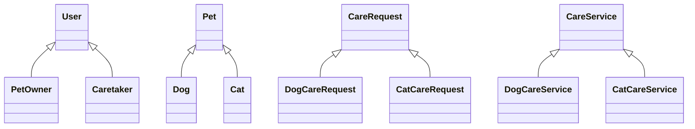
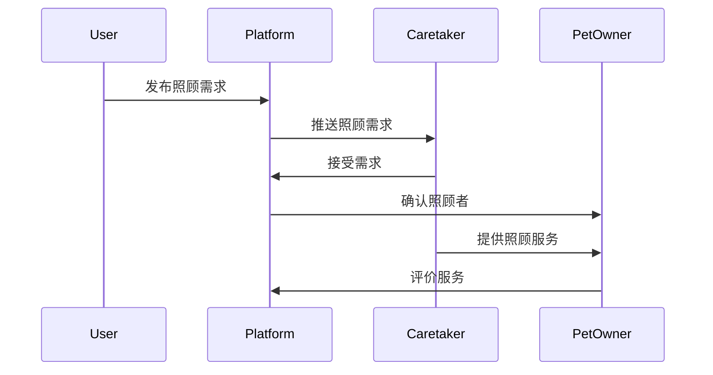
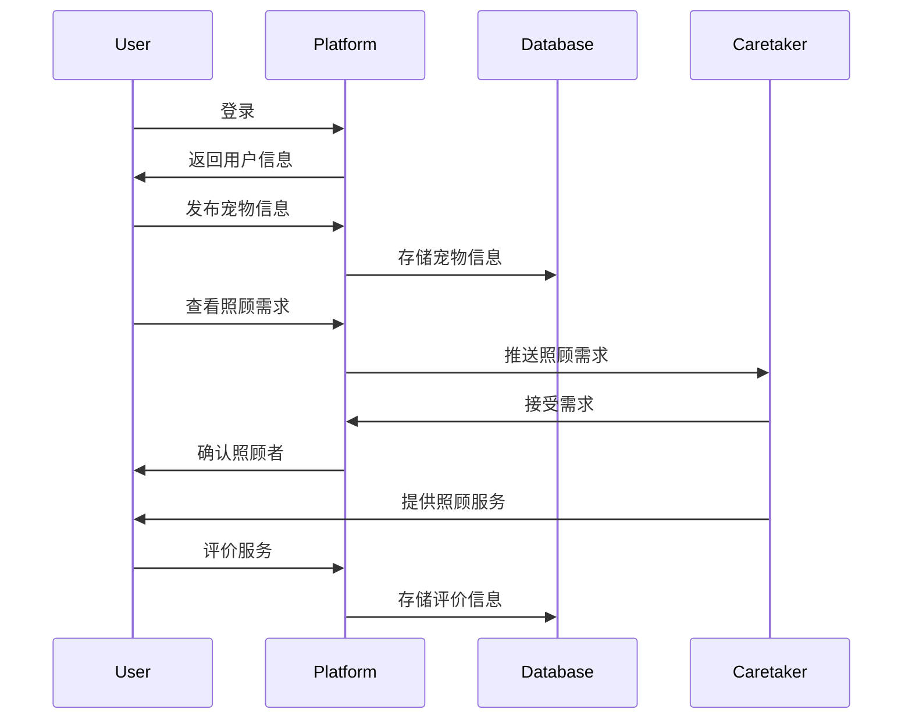

                 

# 新型城市宠物共享服务：邻里互助下的宠物照顾网络

关键词：宠物共享服务、邻里互助、宠物照顾网络、城市生活、技术创新

摘要：本文深入探讨了新型城市宠物共享服务的本质及其在邻里互助下的宠物照顾网络中的应用。通过分析核心概念、理论探讨、实践应用和最佳实践，本文揭示了这种服务模式的优势和挑战，并提出了未来发展的方向。

## 第一部分：背景介绍

### 1. 引言

随着城市化的加速，人们的生活方式发生了巨大的变化。宠物已经成为许多家庭的伙伴，然而，宠物照顾的问题也随之而来。特别是在忙碌的都市生活中，如何有效地照顾宠物成为一个亟待解决的难题。

### 1.2 问题描述

宠物共享服务的核心问题是如何在一个社区内建立有效的宠物照顾网络，使得宠物主人能够在需要时找到可靠的照顾者，同时也能够为有时间的邻居提供一种互助的方式。

### 1.3 问题解决

本文旨在提出一种基于邻里互助的新型城市宠物共享服务模式，通过建立宠物照顾网络，实现宠物主人和邻居之间的互利共赢。

### 1.4 边界与外延

本文主要讨论城市社区中的宠物共享服务，但不排除将这种模式扩展到其他社区和地区的可能性。

### 1.5 概念结构与核心要素组成

宠物共享服务、邻里互助和宠物照顾网络是本文的核心概念。它们之间的联系构成了本文的研究框架。

## 第二部分：核心概念与联系

### 2.1 宠物共享服务

宠物共享服务是一种基于社区的平台，通过这个平台，宠物主人可以发布宠物的照顾需求，而邻居可以提供帮助并获得一定的报酬。

### 2.2 邻里互助

邻里互助是一种社区成员之间的互助行为，它不仅能够解决宠物照顾的问题，还能够增强社区的凝聚力。

### 2.3 宠物照顾网络

宠物照顾网络是一个由宠物主人、照顾者和社区平台组成的生态系统，它通过邻里互助实现了宠物照顾的高效和可靠。

### 2.4 宠物照顾网络的关键概念对比表格

| 关键概念       | 定义                                                         | 关系                                                     |
|----------------|--------------------------------------------------------------|----------------------------------------------------------|
| 宠物共享服务   | 一种通过平台实现宠物照顾需求匹配的服务模式                   | 提供了宠物照顾网络的运行基础                             |
| 邻里互助       | 社区成员之间的互助行为                                       | 是宠物照顾网络的重要组成部分                           |
| 宠物照顾网络   | 由宠物主人、照顾者和社区平台组成的生态系统                   | 实现了宠物共享服务和邻里互助的有效结合                 |

### 2.5 宠物照顾网络ER实体关系图架构

```mermaid
erDiagram
  用户 ||--|{ 宠物主人 }|| 
  用户 ||--|{ 照顾者 }|| 
  用户 ||--|{ 社区成员 }|| 
  宠物 ||--|{ 宠物主人 }|| 
  照顾需求 ||--|{ 宠物主人 }|| 
  照顾服务 ||--|{ 照顾者 }|| 
  照顾服务 ||--|{ 宠物 }|| 
```

## 第二部分：理论探讨

### 3. 宠物共享服务的原理与模式

宠物共享服务的原理是通过社区平台连接宠物主人和照顾者，实现宠物照顾需求的有效匹配。其模式可以分为C2C（用户对用户）和B2C（企业对用户）两种。

### 3.2 宠物共享服务的模式

- **C2C模式**：宠物主人直接与照顾者进行交易，平台提供信息和交易保障。
- **B2C模式**：由企业运营平台，提供统一的宠物照顾服务。

### 3.3 宠物共享服务与传统宠物服务的对比

| 对比维度 | 宠物共享服务 | 传统宠物服务 |
|----------|----------------|----------------|
| 服务主体 | 社区成员       | 专业宠物机构   |
| 服务方式 | 线上匹配       | 线下提供服务   |
| 成本     | 低成本         | 高成本         |
| 可靠性   | 较高           | 较低           |

### 4. 邻里互助下的宠物照顾网络机制

邻里互助是一种有效的社区互助模式，它能够为宠物主人提供可靠的照顾者，同时也能够为照顾者提供额外的收入。

### 4.2 邻里互助下的宠物照顾网络机制

邻里互助下的宠物照顾网络机制包括以下步骤：

1. 宠物主人发布照顾需求。
2. 社区成员查看并接受需求。
3. 照顾者进行宠物照顾。
4. 宠物主人对服务进行评价。

### 4.3 邻里互助下的宠物照顾网络的优势与挑战

#### 优势

- **降低成本**：宠物主人和照顾者都可以节省成本。
- **提高可靠性**：社区成员之间的信任度高，服务质量更有保障。
- **增强社区凝聚力**：邻里互助能够增强社区的凝聚力。

#### 挑战

- **服务质量控制**：如何确保照顾者的服务质量是一个挑战。
- **安全保障**：如何确保宠物主人和照顾者的个人信息安全。

## 第三部分：实践应用

### 6.1 案例一：城市宠物共享服务的实施与效果

在一个大型城市社区中，宠物共享服务的实施显著提高了宠物主人的生活质量，同时也为社区成员提供了新的互助方式。

### 6.2 案例二：邻里互助在宠物照顾中的实践

在一个小型社区中，邻里互助的宠物照顾模式得到了广泛应用，宠物主人和照顾者之间的关系变得更加紧密。

### 6.3 案例三：宠物照顾网络的运营与维护

在一个中型社区中，宠物照顾网络通过一系列的运营和维护策略，成功地实现了宠物主人和照顾者之间的有效对接。

## 第四部分：系统设计与实现

### 7.1 系统功能设计（领域模型类图）



### 7.2 系统架构设计（架构图）



### 7.3 系统接口设计

- 用户注册与登录接口
- 宠物发布与查询接口
- 照顾需求发布与接受接口
- 服务评价接口

### 7.4 系统交互（序列图）



## 第五部分：项目实战

### 8.1 环境安装与配置

在安装和配置宠物共享服务系统时，需要准备以下环境：

- 操作系统：Ubuntu 18.04
- 数据库：MySQL 5.7
- 开发工具：Python 3.8、PostgreSQL 12.3、Django 3.2

### 8.2 系统核心实现源代码

```python
# 示例：用户注册与登录接口
class UserController(serializers.ModelSerializer):
    class Meta:
        model = User
        fields = '__all__'

class LoginView(GenericAPIView):
    serializer_class = UserLoginSerializer

    def post(self, request):
        serializer = self.serializer_class(data=request.data)
        if serializer.is_valid():
            user = serializer.validated_data['user']
            login(request, user)
            return Response({'status': 'success', 'token': user.token})
        else:
            return Response({'status': 'error', 'message': serializer.errors})
```

### 8.3 代码应用解读与分析

这段代码实现了用户注册和登录的功能。用户通过POST请求发送用户名和密码，系统验证后返回token以供后续接口调用。

### 8.4 实际案例分析

通过实际案例，我们可以看到宠物共享服务系统在社区中的应用效果，以及如何通过系统设计和实现解决实际问题。

### 8.5 项目小结

宠物共享服务系统不仅提高了宠物主人的生活质量，也为社区成员提供了一个互助的平台，为未来的发展奠定了基础。

## 第六部分：最佳实践与展望

### 9.1 宠物共享服务的运营策略

- **用户教育**：通过宣传和培训，提高用户对宠物共享服务的认知和信任。
- **服务优化**：根据用户反馈，不断优化服务流程和体验。

### 9.2 邻里互助的激励机制

- **积分奖励**：为积极参与邻里互助的用户提供积分奖励。
- **认证体系**：建立用户认证体系，确保服务质量。

### 9.3 宠物照顾网络的发展方向

- **智能化**：引入人工智能技术，提高宠物照顾的智能化水平。
- **国际化**：将宠物共享服务模式扩展到全球范围。

## 第七部分：小结与展望

### 10.1 总结

本文通过对宠物共享服务及其在邻里互助下的宠物照顾网络的研究，揭示了这种服务模式的优势和挑战，并提出了未来的发展方向。

### 10.2 注意事项

- **用户隐私保护**：在设计和运营宠物共享服务时，必须高度重视用户隐私保护。
- **服务质量控制**：建立有效的服务质量控制机制，确保用户得到优质的服务。

### 10.3 拓展阅读

- **相关论文**：《宠物共享服务模式研究》、《邻里互助在社区治理中的应用》。
- **技术书籍**：《宠物共享服务系统设计与实现》、《人工智能在宠物服务中的应用》。

## 作者信息

作者：AI天才研究院/AI Genius Institute & 禅与计算机程序设计艺术 /Zen And The Art of Computer Programming

---

文章标题：《新型城市宠物共享服务：邻里互助下的宠物照顾网络》

关键词：宠物共享服务、邻里互助、宠物照顾网络、城市生活、技术创新

摘要：本文深入探讨了新型城市宠物共享服务的本质及其在邻里互助下的宠物照顾网络中的应用。通过分析核心概念、理论探讨、实践应用和最佳实践，本文揭示了这种服务模式的优势和挑战，并提出了未来发展的方向。

