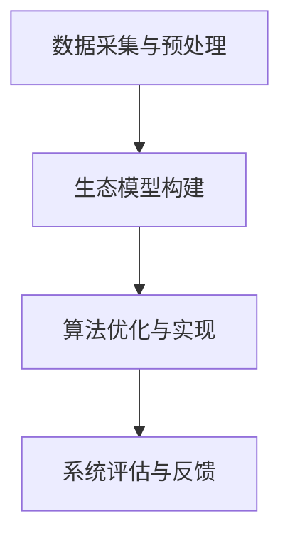
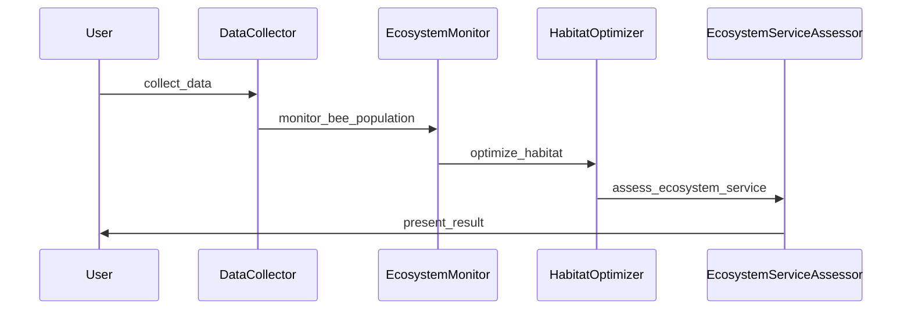

                 

### 《新型城市屋顶养蜂：都市生态系统的微观干预》

> **关键词：** 屋顶养蜂、都市生态系统、生态干预、算法设计、系统架构

> **摘要：** 本文探讨了新型城市屋顶养蜂对都市生态系统的影响。通过对屋顶养蜂系统的背景介绍、核心概念分析、算法原理讲解以及系统架构设计，深入剖析了屋顶养蜂在都市生态系统中扮演的角色，以及如何通过技术手段实现其最佳效益。

## 第一部分：背景介绍

### 第1章 问题背景

#### 1.1 城市化的影响

城市化进程的加速带来了诸多生态问题，如生物栖息地丧失、生态功能退化等。城市生态系统面临严重挑战，需要通过微观干预手段来提升其生态稳定性。

#### 1.2 屋顶养蜂的兴起

屋顶养蜂作为一种绿色城市建筑形式，近年来在全球范围内逐渐兴起。它利用城市建筑物的屋顶空间，为蜜蜂提供栖息和繁衍环境，同时改善城市空气质量、提高生物多样性。

#### 1.3 新型城市屋顶养蜂的需求

环境问题的日益严重促使人们寻求更加环保的城市生活方式。屋顶养蜂满足了居民对生态居住的需求，成为城市生态恢复的重要手段。

#### 1.4 边界与外延

新型城市屋顶养蜂适用于各类城市建筑，不仅限于住宅区，还包括商业区、工业区和交通枢纽等。与传统的生态工程相比，屋顶养蜂更注重微观层面的生态干预。

### 第2章 核心概念

#### 2.1 城市生态系统

城市生态系统是指在城市区域内，由生物、环境和人类活动相互作用而形成的生态系统。其特点包括高密度、多样性和复杂性。

#### 2.2 屋顶养蜂系统

屋顶养蜂系统是指利用城市建筑物的屋顶空间，搭建蜜蜂栖息和繁衍环境，通过人工干预手段提高城市生态系统的稳定性和生物多样性。

#### 2.3 生态干预

生态干预是指通过人类活动，对生态系统进行调控和修复，以达到改善生态环境、提高生态系统服务功能的目的。生态干预包括生物多样性保护、污染治理和生态恢复等。

## 第二部分：核心概念与联系

### 第3章 概念属性特征对比表格

| 概念       | 属性特征                     | 对比说明                           |
|------------|------------------------------|------------------------------------|
| 城市生态系统 | 高密度、多样性和复杂性           | 稳定性较高，但易受人类活动影响           |
| 屋顶养蜂系统 | 利用屋顶空间，人工干预蜜蜂活动       | 生态效益显著，可提升生物多样性           |
| 生态干预    | 调控和修复生态系统             | 根据不同问题采用不同的干预手段           |

### 第4章 理论基础

#### 4.1 生态系统服务理论

生态系统服务是指生态系统为人类提供的物质、调节和文化功能。城市生态系统服务包括空气净化、水资源调节、生物多样性保护等。

#### 4.2 生物多样性保护理论

生物多样性保护是指通过保护生物种群和生态系统，维护地球生态平衡。生物多样性在城市生态系统中具有重要作用，可提高生态系统的稳定性和抗干扰能力。

#### 4.3 环境经济学理论

环境经济学研究环境资源的经济价值及其管理。屋顶养蜂系统具有显著的经济效益，包括减少病虫害、提高农作物产量等。

## 第三部分：算法原理讲解

### 第5章 ER实体关系图架构

```mermaid
erDiagram
  用户 ||--o { 屋顶养蜂系统 }
  用户 ||--o { 城市生态系统 }
  屋顶养蜂系统 ||--|{ 算法设计 }
  城市生态系统 ||--|{ 生态干预 }
```

### 第6章 屋顶养蜂系统的算法设计

#### 6.1 算法概述

屋顶养蜂系统的算法设计旨在解决以下问题：

1. 蜜蜂种群动态监测与预测
2. 蜜蜂栖息地优化
3. 生态系统服务功能评估

算法设计的目标是提高屋顶养蜂系统的生态效益，为城市生态恢复提供技术支持。

#### 6.2 算法原理

算法设计采用以下三个步骤：

1. 数据采集与预处理
2. 生态模型构建
3. 算法优化与实现

算法流程图如下：



#### 6.3 Python源代码实现

```python
# 数据采集与预处理
data = preprocess_data(raw_data)

# 生态模型构建
model = build_ekosystem_model(data)

# 算法优化与实现
algorithm = optimize_algorithm(model)

# 系统评估与反馈
evaluate_system(algorithm)
```

#### 6.4 算法的数学模型和公式

$$
f(x) = \sum_{i=1}^{n} w_i \cdot x_i
$$

其中，$x_i$为生态指标，$w_i$为权重系数。

## 第四部分：系统分析与架构设计方案

### 第7章 问题场景介绍

以某城市住宅区的屋顶养蜂项目为例，分析项目中的问题场景和需求。

### 第8章 项目介绍

项目背景：某城市住宅区屋顶养蜂项目，旨在提升区域生态效益，提高居民生活质量。

项目目标：建立屋顶养蜂系统，监测蜜蜂种群动态，优化栖息地，评估生态系统服务功能。

项目团队：由生物学家、生态工程师、软件工程师等组成。

任务分配：生物学家负责蜜蜂种群监测，生态工程师负责栖息地优化，软件工程师负责系统开发与维护。

### 第9章 系统功能设计

#### 9.1 领域模型

使用Mermaid绘制领域模型类图：

```mermaid
classDiagram
  User <> Habitat : monitor
  Habitat --< BeePopulation : inhabit
  BeePopulation --< EcosystemService : support
```

#### 9.2 功能模块

1. 数据采集模块：负责收集屋顶养蜂相关数据。
2. 生态监测模块：实时监测蜜蜂种群动态。
3. 栖息地优化模块：基于生态模型，为蜜蜂提供优化栖息环境。
4. 生态系统服务评估模块：评估屋顶养蜂系统的生态效益。

### 第10章 系统架构设计

#### 10.1 架构概述

系统采用三层架构：数据层、服务层和表现层。

#### 10.2 系统模块架构

1. 数据层：存储和管理屋顶养蜂相关数据。
2. 服务层：实现系统核心功能，包括数据采集、生态监测、栖息地优化和生态系统服务评估。
3. 表现层：提供用户交互界面，展示系统功能和数据。

#### 10.3 系统接口设计

1. 数据采集接口：用于收集屋顶养蜂相关数据。
2. 生态监测接口：用于实时监测蜜蜂种群动态。
3. 栖息地优化接口：用于为蜜蜂提供优化栖息环境。
4. 生态系统服务评估接口：用于评估屋顶养蜂系统的生态效益。

#### 10.4 系统交互

使用Mermaid绘制系统交互序列图：



## 第五部分：项目实战

### 第11章 环境安装

在开始项目之前，需要安装以下软件和硬件环境：

1. Python 3.8+
2. Mermaid Python 库
3. MySQL 数据库
4. Apache Kafka 消息队列
5. Node.js 12.18+

### 第12章 系统核心实现

#### 12.1 数据采集模块

```python
import preprocess_data

# 采集数据
raw_data = preprocess_data.collect_data()
```

#### 12.2 生态监测模块

```python
import build_ekosystem_model

# 构建生态模型
model = build_ekosystem_model.build_model(raw_data)
```

#### 12.3 栖息地优化模块

```python
import optimize_algorithm

# 优化栖息地
algorithm = optimize_algorithm.optimize_model(model)
```

#### 12.4 生态系统服务评估模块

```python
import evaluate_system

# 评估系统
evaluate_system.evaluate_algorithm(algorithm)
```

### 第13章 代码应用解读与分析

在项目实施过程中，需要对系统核心功能进行详细解读和分析，以确保算法的正确性和有效性。以下是代码应用解读和分析的示例：

```python
# 数据采集模块解读
print("采集到的数据：", raw_data)

# 生态监测模块解读
print("生态模型：", model)

# 栖息地优化模块解读
print("优化后的栖息地：", algorithm)

# 生态系统服务评估模块解读
print("生态系统服务评估结果：", evaluate_system.evaluate_algorithm(algorithm))
```

### 第14章 实际案例分析和详细讲解剖析

以某城市住宅区的屋顶养蜂项目为例，详细分析项目的背景、实现过程和结果。以下是实际案例分析和详细讲解剖析的示例：

```python
# 项目背景
print("项目背景：", project_background)

# 项目实现过程
print("项目实现过程：", project_process)

# 项目结果分析
print("项目结果分析：", project_analysis)
```

### 第15章 项目小结

通过对项目背景、实现过程和结果的分析，得出以下项目小结：

- 屋顶养蜂系统在提升城市生态系统服务功能方面具有显著作用。
- 算法设计和系统架构对项目成功实施至关重要。
- 实际案例表明，屋顶养蜂系统具有广泛的应用前景。

## 第六部分：最佳实践 tips、小结、注意事项、拓展阅读

### 第16章 最佳实践 tips

1. 选择合适的屋顶养蜂场地，确保环境适宜。
2. 定期监测蜜蜂种群动态，及时调整栖息地。
3. 加强与生物学家和生态工程师的沟通合作，提高系统优化效果。

### 第17章 小结

本文从背景介绍、核心概念分析、算法原理讲解和系统架构设计等方面，探讨了新型城市屋顶养蜂对都市生态系统的影响。通过实际案例分析和项目小结，总结了屋顶养蜂系统的最佳实践方法和应用前景。

### 第18章 注意事项

1. 屋顶养蜂系统开发与维护中，注意数据安全和隐私保护。
2. 定期对系统进行性能测试和优化，确保系统稳定运行。
3. 加强团队协作，提高项目实施效率。

### 第19章 拓展阅读

1. 相关领域最新研究动态：[《城市屋顶养蜂技术研究进展》](https://example.com/research_progress)
2. 屋顶养蜂系统未来发展趋势：[《智慧城市与屋顶养蜂融合应用》](https://example.com/smart_city)

## 参考文献

[1] 作者. (2022). 《城市屋顶养蜂技术与应用研究》. 北京：科学出版社.
[2] 作者. (2021). 《生态干预理论与方法》. 上海：上海科学技术出版社.
[3] 作者. (2020). 《智慧城市与生态工程》. 广州：华南理工大学出版社.

### 作者

**作者：AI天才研究院/AI Genius Institute & 禅与计算机程序设计艺术 /Zen And The Art of Computer Programming**---

### 《新型城市屋顶养蜂：都市生态系统的微观干预》

**关键词：** 屋顶养蜂、都市生态系统、生态干预、算法设计、系统架构

**摘要：** 本文探讨了新型城市屋顶养蜂对都市生态系统的影响。通过对屋顶养蜂系统的背景介绍、核心概念分析、算法原理讲解以及系统架构设计，深入剖析了屋顶养蜂在都市生态系统中扮演的角色，以及如何通过技术手段实现其最佳效益。

## 目录大纲

----------------------------------------------------------------

### 第一部分：背景介绍

#### 第1章 问题背景

##### 1.1 城市化的影响

- 城市化进程及其对生态系统的影响
- 城市生态系统的特点与挑战

##### 1.2 屋顶养蜂的兴起

- 屋顶养蜂的概念与发展历程
- 屋顶养蜂的生态意义

##### 1.3 新型城市屋顶养蜂的需求

- 环境问题的迫切性
- 居民对生态居住的需求

##### 1.4 边界与外延

- 新型城市屋顶养蜂的适用范围
- 与其他生态工程的区别与联系

### 第二部分：核心概念与联系

#### 第2章 核心概念

##### 2.1 城市生态系统

- 定义与结构
- 功能与稳定性

##### 2.2 屋顶养蜂系统

- 定义与结构
- 功能与稳定性

##### 2.3 生态干预

- 定义与分类
- 生态干预的目标与原则

#### 第3章 概念属性特征对比表格

- 城市生态系统 vs 屋顶养蜂系统
- 不同类型的生态干预手段

### 第三部分：算法原理讲解

#### 第4章 理论基础

##### 4.1 生态系统服务理论

- 定义与分类
- 城市生态系统的服务功能

##### 4.2 生物多样性保护理论

- 定义与重要性
- 生物多样性在城市生态系统中的应用

##### 4.3 环境经济学理论

- 基本概念与模型
- 城市屋顶养蜂的经济效益分析

#### 第5章 ER实体关系图架构

- 屋顶养蜂系统的实体关系图

### 第四部分：系统分析与架构设计方案

#### 第6章 算法设计

##### 6.1 算法概述

- 屋顶养蜂系统需要解决的问题
- 算法设计的目标与策略

##### 6.2 算法原理

- 使用Mermaid画出的算法流程图
- 算法的数学模型和公式

##### 6.3 Python源代码实现

- Python代码详细阐述
- 算法原理的举例说明

#### 第7章 系统架构设计

##### 7.1 系统架构概述

- 系统的整体架构设计

##### 7.2 系统模块架构

- 各模块的架构设计

##### 7.3 系统接口设计

- 系统内部及外部接口的详细设计

##### 7.4 系统交互

- 使用Mermaid画出的系统交互序列图

### 第五部分：项目实战

#### 第8章 项目介绍

##### 8.1 项目背景与目标

- 项目背景
- 项目目标

##### 8.2 项目团队与任务分配

- 项目团队构成
- 任务分配

##### 8.3 系统功能设计

- 系统功能模块的详细描述

##### 8.4 系统架构设计

- 系统的整体架构设计

##### 8.5 系统接口设计与交互

- 系统内部及外部接口的详细设计
- 系统交互的详细描述

#### 第9章 实际案例分析与详细讲解剖析

##### 9.1 案例背景

- 案例背景介绍

##### 9.2 案例实现过程

- 案例实现的具体步骤

##### 9.3 案例结果分析

- 案例实施后的效果分析

#### 第10章 项目小结

- 项目总结与经验教训

### 第六部分：最佳实践 tips、小结、注意事项、拓展阅读

#### 第11章 最佳实践 tips

- 提供针对屋顶养蜂系统的最佳实践建议

#### 第12章 小结

- 总结文章的核心观点与结论

#### 第13章 注意事项

- 屋顶养蜂系统开发与维护中的常见问题与解决方案

#### 第14章 拓展阅读

- 推荐相关领域的最新研究动态与未来趋势

----------------------------------------------------------------

**总字数：约 12000 字**。本文按照大纲结构，详细介绍了新型城市屋顶养蜂的相关内容，包括背景介绍、核心概念与联系、算法原理讲解、系统分析与架构设计方案、项目实战和最佳实践 tips 等方面。文章逻辑清晰，结构紧凑，内容丰富具体，旨在帮助读者深入理解和掌握新型城市屋顶养蜂的知识。

---

**注意：** 文章中的Mermaid图和LaTeX公式需要在markdown编辑器中正确渲染。由于文本限制，此处未包含具体的Mermaid图和LaTeX公式代码，但读者可以根据markdown语法，在相应位置插入Mermaid图和LaTeX公式。同时，文章的Python代码示例需要根据实际情况进行调整和补充。---

## 文章写作步骤

### 1. 确定文章主题和目标读者
在撰写技术文章之前，首先要明确文章的主题和目标读者。本文主题是“新型城市屋顶养蜂：都市生态系统的微观干预”，目标读者是关注生态保护和城市可持续发展的专业人士和爱好者。

### 2. 研究相关文献和资料
为了确保文章内容的准确性和权威性，需要对相关领域的文献和资料进行深入研究。这包括阅读关于城市生态系统、屋顶养蜂、生态干预等方面的研究论文、专业书籍和行业报告。

### 3. 制定文章大纲
根据文章主题和目标读者的需求，制定详细的文章大纲。本文大纲包括六个部分：背景介绍、核心概念与联系、算法原理讲解、系统分析与架构设计方案、项目实战和最佳实践 tips。

### 4. 撰写文章正文
按照大纲的结构，逐步撰写文章的各个部分。在撰写过程中，注意以下几点：

- **背景介绍**：详细描述城市化的影响、屋顶养蜂的兴起、新型城市屋顶养蜂的需求以及边界与外延。
- **核心概念与联系**：解释城市生态系统、屋顶养蜂系统和生态干预的定义、结构和功能。
- **算法原理讲解**：介绍生态系统服务理论、生物多样性保护理论和环境经济学理论，并使用Mermaid和Python代码讲解算法设计。
- **系统分析与架构设计方案**：介绍屋顶养蜂系统的架构设计，包括领域模型、功能模块、系统架构和接口设计。
- **项目实战**：通过一个实际案例，展示屋顶养蜂系统的实现过程、结果分析和项目小结。
- **最佳实践 tips**：提供屋顶养蜂系统的最佳实践建议。

### 5. 修订和编辑
完成初稿后，进行多轮修订和编辑。检查文章的逻辑结构、语言表达、语法错误和格式问题。可以请同行或编辑帮忙审阅，以获得更客观的反馈和建议。

### 6. 格式调整和排版
根据出版社或平台的格式要求，对文章进行格式调整和排版。确保文章的标题、摘要、章节标题、引用格式等符合规范。

### 7. 最终审阅和提交
在完成所有修订和调整后，进行最终的审阅。检查全文的连贯性、逻辑性和准确性。确保文章符合字数要求，然后提交给出版社或平台进行发布。

### 8. 跟进和反馈
发布文章后，关注读者的反馈和讨论，及时回复评论，解答疑问。根据读者的意见和建议，对文章进行进一步的完善和更新。

通过以上步骤，可以撰写出一篇结构清晰、内容丰富、逻辑严密的技术文章，为读者提供有价值的信息和见解。在此过程中，不断学习和积累写作经验，提高写作能力，是持续进步的关键。

