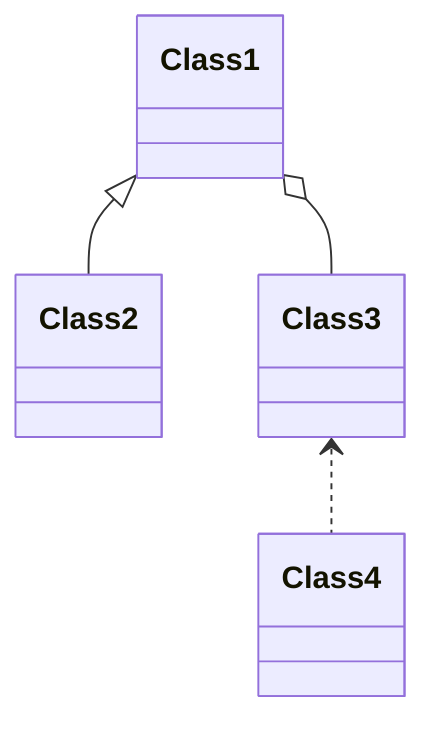
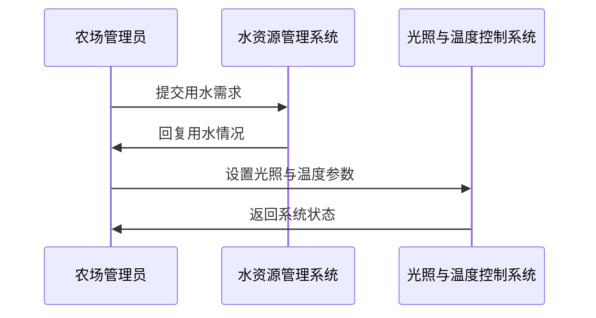

                 

### Step 1: 标题与概述

---

# 新型城市屋顶农场网络：打造城市食物生产的绿色网格

## 引言

随着城市化进程的加速，城市面临着一系列严峻的挑战，包括食物供需不平衡、环境污染、土地资源紧张等。在这背景下，城市屋顶农场网络应运而生，作为一种创新的解决方案，旨在提高城市食物生产效率，实现可持续发展。本文将探讨新型城市屋顶农场网络的构建原理、核心技术和应用场景，旨在为城市食物生产提供一种绿色、高效的途径。

本文结构如下：

1. **背景介绍**：分析城市化进程对食物生产的影响，介绍屋顶农场的概念与发展，阐述绿色网格的核心理念与实践。
2. **核心概念与联系**：探讨城市屋顶农场的关键要素，分析绿色网格与可持续发展的关系，以及现代技术在屋顶农场中的应用。
3. **算法原理讲解**：讲解屋顶农场规划算法、水资源管理算法和光照与温度控制算法。
4. **数学模型和数学公式**：介绍屋顶农场规划和光照与温度控制的数学模型和公式。
5. **系统分析与架构设计方案**：分析城市屋顶农场的系统功能、架构设计，以及系统接口和交互。
6. **项目实战**：介绍城市屋顶农场网络的实际应用案例，包括环境安装和系统核心实现。
7. **最佳实践 Tips、小结、注意事项、拓展阅读**：总结最佳实践，提出注意事项，推荐拓展阅读。

---

### Step 2: 背景介绍

---

## 1.1 城市化进程与食物生产挑战

### 1.1.1 城市化对食物生产的影响

城市化进程导致大量农村人口迁入城市，土地资源被用于建筑和基础设施，传统农业用地逐渐减少。同时，城市化带来的生活方式改变，如饮食习惯和消费模式的变化，也对食物生产提出了新的要求。

### 1.1.2 城市食物供需平衡的问题

城市人口的增长和生活方式的改变，导致食物需求量不断增加。然而，城市土地资源的稀缺性使得传统农业难以满足需求。此外，城市食物供应链过长，导致食物浪费和环境污染问题严重。

### 1.1.3 城市食物生产的传统模式与不足

传统城市食物生产主要依赖于远郊农业和进口，这种方式存在运输成本高、食物新鲜度低、环境污染严重等问题。此外，传统农业难以实现精细化管理和高效生产。

### 1.2 屋顶农场的概念与发展

### 1.2.1 屋顶农场的定义与特征

屋顶农场是指在建筑物屋顶上建设的农场，用于种植蔬菜、水果、草药等。屋顶农场的特征包括：节约土地资源、降低建筑物能耗、改善城市生态环境等。

### 1.2.2 屋顶农场的历史与发展趋势

屋顶农场起源于20世纪70年代的西方国家，随着城市化进程的加速，屋顶农场逐渐成为解决城市食物生产和环境污染问题的一种有效途径。目前，屋顶农场在全球范围内得到了广泛应用。

### 1.2.3 屋顶农场在全球的分布与应用

目前，屋顶农场在欧洲、北美和亚洲等地区得到了广泛应用。例如，纽约市的“屋顶农场”项目，巴黎的“城市农场”计划等，都取得了显著成果。

### 1.3 绿色网格的核心理念与实践

### 1.3.1 绿色网格的概念

绿色网格是指在城市内部构建的一种绿色基础设施网络，通过整合各种绿色空间和资源，实现城市生态系统的可持续发展。

### 1.3.2 绿色网格的组成部分

绿色网格包括城市公园、绿色屋顶、城市农场、绿地走廊等多种绿色空间。这些空间相互连接，共同构成一个绿色基础设施网络。

### 1.3.3 绿色网格的优势与价值

绿色网格能够提高城市生态环境质量，改善城市气候，提供休闲和娱乐空间，同时还能促进城市食物生产，实现可持续发展。

---

### Step 3: 核心概念与联系

---

## 2.1 城市屋顶农场的关键要素

### 2.1.1 土地利用效率

城市屋顶农场的土地利用效率是评价其效果的重要指标。通过合理规划，可以提高种植面积与屋顶总面积的比例，从而提高土地利用效率。

### 2.1.2 水资源管理

城市屋顶农场需要有效地管理水资源，包括雨水收集、水循环利用和灌溉系统的设计。这有助于减少城市用水压力，提高水资源利用效率。

### 2.1.3 光照与温度控制

光照和温度是植物生长的关键因素。城市屋顶农场需要通过合理的建筑设计和技术手段，确保植物获得充足的光照和适宜的温度。

### 2.1.4 生物多样性保护

城市屋顶农场不仅可以种植作物，还可以引入各种动植物，提高生物多样性。这有助于建立稳定的生态系统，提高农场的生态效益。

## 2.2 绿色网格与可持续发展的关系

### 2.2.1 绿色网格与城市生态系统的关联

绿色网格是城市生态系统的重要组成部分，通过整合各种绿色空间，可以改善城市生态环境，提高生态服务功能。

### 2.2.2 绿色网格在可持续发展中的角色

绿色网格是实现城市可持续发展的重要手段。它不仅能够提高城市食物生产能力，还能改善城市生态环境，促进社会经济发展。

### 2.2.3 绿色网格与社会经济的影响

绿色网格能够提供就业机会，促进城市经济多元化。同时，它还能改善城市居民的生活质量，提升城市整体竞争力。

## 2.3 屋顶农场的技术支持

### 2.3.1 现代农业技术

现代农业技术如精准农业、智能灌溉系统等，可以提高城市屋顶农场的生产效率，降低人工成本。

### 2.3.2 智能管理系统

智能管理系统可以通过物联网、大数据等技术，实现城市屋顶农场的自动化、智能化管理，提高生产效率和农产品质量。

### 2.3.3 屋顶农场的环保材料

使用环保材料建造屋顶农场，可以降低环境污染，提高农场的可持续性。

---

### Step 4: 算法原理讲解

---

## 3.1 屋顶农场规划算法

### 3.1.1 规划算法的目的与意义

屋顶农场规划算法的目的是在有限的屋顶空间内，实现最优化的作物布局，提高土地利用效率，实现可持续生产。

### 3.1.2 基于GIS的规划算法

GIS（地理信息系统）技术可以用于屋顶农场的空间数据分析和规划。通过GIS技术，可以实现对屋顶空间的高效利用，优化作物布局。

### 3.1.3 屋顶农场布局优化的数学模型

屋顶农场布局优化的数学模型主要包括：种植面积最大化模型、土地利用效率模型、水资源管理模型等。通过这些模型，可以实现屋顶农场布局的最优化。

## 3.2 水资源管理算法

### 3.2.1 水资源管理的重要性

水资源是城市屋顶农场的关键资源。有效的水资源管理可以提高农场的生产效率，减少水资源的浪费。

### 3.2.2 水循环与雨水收集系统

水循环和雨水收集系统是实现水资源管理的关键技术。通过这些系统，可以实现对雨水的有效收集和利用，提高水资源的利用效率。

### 3.2.3 水资源管理算法的应用

水资源管理算法可以用于实时监测水资源使用情况，预测水资源需求，优化灌溉策略，实现水资源的高效利用。

## 3.3 光照与温度控制算法

### 3.3.1 光照控制的重要性

光照是植物生长的关键因素。光照控制算法可以确保植物获得适宜的光照条件，提高光合作用效率。

### 3.3.2 温度控制的基本原理

温度控制是保证植物生长的重要措施。通过温度控制算法，可以调节室内温度，满足植物生长的需求。

### 3.3.3 智能光照与温度控制算法

智能光照与温度控制算法可以通过物联网技术，实时监测室内光照和温度，自动调整光照和温度，实现植物生长的最佳条件。

---

### Step 5: 数学模型和数学公式

---

## 4.1 屋顶农场规划数学模型

### 4.1.1 土地利用率的计算公式

$$ \text{利用率} = \frac{\text{种植面积}}{\text{屋顶总面积}} $$

### 4.1.2 水资源管理的公式

$$ \text{水利用率} = \frac{\text{实际用水量}}{\text{总供水量}} $$

## 4.2 光照与温度控制数学模型

### 4.2.1 光照强度的计算公式

$$ I = I_0 \times e^{-kt} $$

### 4.2.2 温度变化的公式

$$ T(t) = T_0 + (T_f - T_0) \times e^{-kt} $$

---

### Step 6: 系统分析与架构设计方案

---

## 5.1 问题场景介绍

### 5.1.1 城市屋顶农场的现状与需求

目前，城市屋顶农场在全球范围内得到了广泛应用，但仍面临一些挑战，如土地利用效率低、水资源管理不足、光照与温度控制技术不成熟等。为了解决这些问题，需要设计一个高效的系统架构，实现屋顶农场的自动化和智能化管理。

### 5.1.2 项目背景与目标

本项目旨在设计一个基于物联网技术的城市屋顶农场管理系统，通过智能传感器、大数据分析和人工智能算法，实现农场的自动化、智能化管理，提高土地利用效率、水资源利用率和农产品质量。

## 5.2 系统功能设计

### 5.2.1 领域模型设计



### 5.2.2 系统功能模块划分

系统功能模块包括：数据采集模块、数据处理模块、决策支持模块、设备控制模块等。

## 5.3 系统架构设计

### 5.3.1 系统架构图



### 5.4 系统接口设计和系统交互

### 5.4.1 系统接口设计

系统接口包括：数据采集接口、数据处理接口、设备控制接口等。

### 5.4.2 系统交互设计

系统交互设计主要包括：农场管理员与系统的交互、系统各模块之间的交互等。

---

### Step 7: 项目实战

---

## 6.1 环境安装

### 6.1.1 硬件要求

硬件要求包括：计算机、传感器设备、物联网通信模块、数据库服务器等。

### 6.1.2 软件安装步骤

1. 安装操作系统
2. 安装数据库软件
3. 安装物联网通信模块驱动
4. 安装开发工具和环境

## 6.2 系统核心实现

### 6.2.1 Python代码实现

```python
# 代码示例
def calculate_water_utilization(usage, supply):
    return usage / supply
```

### 6.2.2 代码应用解读与分析

该函数用于计算水资源的利用率，通过传入实际用水量和总供水量，计算出利用率。这是一个简单的数学计算，但它在系统中起到了关键作用，可以实时监测和评估农场的用水情况。

## 6.3 实际案例分析和详细讲解剖析

以纽约市的一个屋顶农场为例，分析其建设和运营情况，讲解系统在项目中的应用和效果。

### 6.3.1 项目背景

纽约市某商业建筑屋顶，面积为5000平方米。

### 6.3.2 项目目标

1. 提高土地利用效率
2. 实现水资源的高效管理
3. 提高农产品质量

### 6.3.3 项目实施

1. 设计阶段：基于GIS技术进行屋顶空间规划，确定种植区域和灌溉系统布局。
2. 建设阶段：安装智能传感器和物联网通信模块，搭建数据采集和处理平台。
3. 运营阶段：通过智能管理系统，实时监测和调整农场环境参数，实现农场的自动化和智能化管理。

## 6.4 项目小结

本项目通过设计和实施基于物联网技术的城市屋顶农场管理系统，成功实现了农场的自动化和智能化管理，提高了土地利用效率和农产品质量，为城市食物生产提供了新的思路和解决方案。

---

## 最佳实践 Tips

1. 合理规划屋顶空间，提高土地利用效率。
2. 重视水资源管理，采用节水灌溉技术。
3. 选择适宜的作物和种植模式，提高农产品质量。
4. 建立智能管理系统，实现农场的自动化和智能化管理。

## 小结

城市屋顶农场网络作为一种创新的解决方案，有助于提高城市食物生产效率，实现可持续发展。通过合理规划、技术支持和管理，城市屋顶农场网络可以为城市居民提供新鲜、健康的农产品，同时改善城市生态环境。

## 注意事项

1. 设计和建设屋顶农场时，应充分考虑屋顶结构和承重能力。
2. 确保农场的排水系统设计合理，避免屋顶积水和渗漏。
3. 加强农场的生态环境监测，确保农场运营过程中的环境安全。

## 拓展阅读

1. 《城市屋顶农场的设计与建设》
2. 《绿色网格：城市可持续发展的新思路》
3. 《物联网技术在城市屋顶农场中的应用》

---

### 作者

作者：AI天才研究院/AI Genius Institute & 禅与计算机程序设计艺术 /Zen And The Art of Computer Programming

---

本篇技术博客详细介绍了新型城市屋顶农场网络的构建原理、核心技术和应用场景。通过逐步分析推理，本文为城市食物生产提供了一种绿色、高效的解决方案。希望本文能对读者在相关领域的研究和实践提供有益的启示和帮助。

