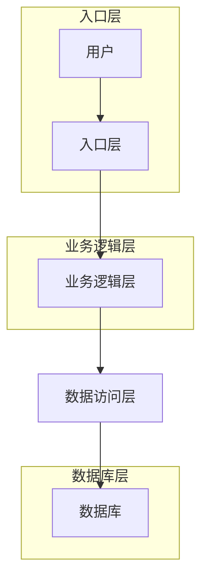
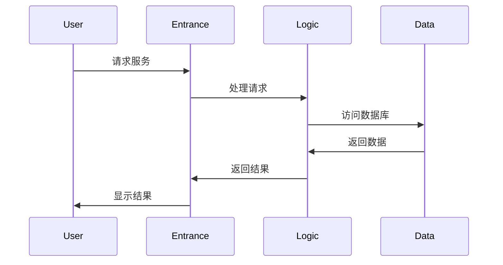

                 

### 新型城市屋顶电影院：公共娱乐空间的创新

> 关键词：城市屋顶、电影院、公共娱乐、多功能空间、可持续发展

> 摘要：本文探讨了新型城市屋顶电影院的设计原理和实现方法。通过详细分析屋顶绿化的优势、电影院设施的功能布局以及多功能空间设计的关键要素，本文提出了一套完整的城市屋顶电影院建设方案，为提高城市绿化率、改善居民生活质量提供了新思路。

## **第一部分：背景介绍**

### **1.1.1 问题背景**

随着城市化进程的加速，城市人口不断增长，城市空间日益紧张。绿地资源有限，传统的公园、广场等公共空间难以满足居民的休闲娱乐需求。与此同时，城市热岛效应、环境污染等问题日益严重，迫切需要寻找新的解决方案。在这样的背景下，城市屋顶成为了一个新的发展方向。

城市屋顶绿化不仅可以增加城市绿化面积，改善城市生态环境，还能有效降低城市热岛效应，提高空气质量。然而，传统屋顶的绿化方式较为单一，往往仅限于草坪、灌木等，无法充分发挥这一空间的潜力。为了解决这一问题，新型城市屋顶电影院作为一种创新公共娱乐空间应运而生。

### **1.1.2 问题描述**

新型城市屋顶电影院作为一种结合公共娱乐与城市绿化的多功能空间，其设计、建设与运营面临诸多挑战：

1. **空间规划**：如何在有限的屋顶空间内实现绿化、电影院设施和多功能空间的有效布局，确保各功能区域互不干扰。
2. **功能设计**：电影院设施包括放映室、观众席、音响系统等，需要合理规划并满足观影需求。
3. **材料选择**：选择适合屋顶环境的建筑材料，确保屋顶结构的稳定性和安全性。
4. **结构稳定性**：屋顶电影院的建设需要考虑结构稳定性，防止因屋顶载荷过大导致建筑结构受损。
5. **维护管理**：屋顶电影院的日常维护和管理，包括植物养护、设备维护等，需要制定科学合理的管理方案。

### **1.1.3 问题解决**

为了解决上述问题，本文将探讨新型城市屋顶电影院的设计与建设方法，包括以下方面：

1. **设计理念**：将娱乐、休闲和绿化有机结合，打造生态、环保、可持续的公共娱乐空间。
2. **空间规划**：合理布局屋顶绿化区域、电影院区域和多功能空间，实现多功能融合。
3. **技术选择**：选择适合屋顶环境的建筑材料和技术，确保屋顶结构的稳定性和安全性。
4. **实施步骤**：详细分析建设过程，包括屋顶绿化、电影院设施建设和多功能空间设计等。
5. **运营管理**：制定科学合理的运营管理方案，确保屋顶电影院的良好运行。

### **1.1.4 边界与外延**

新型城市屋顶电影院主要关注以下几个方面：

1. **屋顶结构的设计与加固**：确保屋顶电影院的结构稳定和安全。
2. **绿色植物的种植与管理**：选择适合屋顶生长的植物，进行科学合理的种植和管理。
3. **电影院设施的建设与运营**：包括放映设备、座椅、音响系统等的建设和运营。
4. **与城市环境的融合与协调**：屋顶电影院作为城市公共空间的一部分，需要与城市环境相互融合，提升城市整体形象。
5. **可持续发展**：在设计和实施过程中，注重资源节约和环境友好，实现可持续发展。

### **1.1.5 核心概念与联系**

核心概念包括：

1. **屋顶绿化**：在屋顶上种植植物，以增加城市绿化面积。
2. **电影院设施**：包括放映设备、座椅、音响系统等。
3. **多功能空间设计**：结合娱乐、休闲、教育等多功能需求进行空间设计。
4. **可持续发展**：在设计和实施过程中，注重资源节约和环境友好。

这些概念相互关联，共同构成了新型城市屋顶电影院的设计理念和实现方法。

## **核心概念与联系**

### **1.2.1 核心概念**

**屋顶绿化**：在屋顶上种植植物，增加城市绿化面积，改善城市生态环境。屋顶绿化具有以下优势：

1. **减少城市热岛效应**：植物通过蒸腾作用和遮阳效果，降低屋顶表面温度，减少城市热岛效应。
2. **提高空气质量**：植物能吸收有害气体和颗粒物，净化空气。
3. **增加城市绿化率**：屋顶绿化是城市绿化的重要组成部分，有助于提升城市生态环境。

**电影院设施**：包括放映设备、座椅、音响系统等，为居民提供观影场所。电影院设施的设计应考虑以下方面：

1. **放映效果**：选择合适的放映设备，确保观影质量。
2. **舒适座椅**：设计符合人体工程学的座椅，提供舒适的观影体验。
3. **音响系统**：设计合理的音响系统，营造良好的观影氛围。

**多功能空间设计**：结合娱乐、休闲、教育等多功能需求，设计灵活多样的空间布局。多功能空间设计应考虑以下方面：

1. **空间利用**：合理规划空间，提高空间利用率。
2. **功能多样性**：提供多样化的功能，满足不同群体的需求。
3. **互动体验**：设计互动性强的空间，提升用户体验。

**可持续发展**：在设计和实施过程中，注重资源节约和环境友好，实现可持续发展。可持续发展包括以下方面：

1. **资源节约**：采用节能环保的材料和技术，降低能源消耗。
2. **环境友好**：减少对环境的负面影响，保护生态环境。
3. **生态平衡**：在设计中考虑生态系统的平衡，促进生物多样性。

### **1.2.2 概念属性特征对比表格**

| 核心概念 | 属性特征 | 对比 |
| :---: | :---: | :---: |
| 屋顶绿化 | 减少城市热岛效应，提高空气质量，增加城市绿化率 | 提高屋顶的隔热性能，减少能源消耗 |
| 电影院设施 | 提供娱乐休闲场所，满足居民观影需求 | 增强社区凝聚力，促进文化交流 |
| 多功能空间设计 | 结合多种功能，提高空间利用率 | 满足不同群体的需求，提供多样化服务 |
| 可持续发展 | 减少资源浪费，保护生态环境 | 降低运营成本，提高经济效益 |

### **1.2.3 ER实体关系图架构**

```mermaid
erDiagram
  屋顶绿化 ||--|{ 电影院设施 }|
  电影院设施 ||--|{ 多功能空间设计 }|
  多功能空间设计 ||--|{ 可持续发展 }|
```

在新型城市屋顶电影院的设计中，屋顶绿化、电影院设施和多功能空间设计相互关联，共同构建了一个多功能、生态、可持续的公共娱乐空间。可持续发展作为核心概念，贯穿于整个设计过程，确保项目在实现娱乐功能的同时，注重环保和资源节约。

## **第二部分：新型城市屋顶电影院的设计原理**

### **2.1 设计理念**

新型城市屋顶电影院的设计理念是将娱乐、休闲和绿化有机结合，打造一个生态、环保、可持续的公共娱乐空间。具体来说，设计理念包括以下几点：

1. **生态优先**：在设计和实施过程中，注重生态保护和生态环境的改善，采用环保材料和绿色技术，减少对环境的影响。
2. **多功能融合**：将屋顶绿化、电影院设施和多功能空间设计有机结合，实现空间利用的最大化和功能多样性的提升。
3. **可持续发展**：在设计中考虑资源的可持续利用，降低能源消耗，减少废弃物产生，实现经济效益、社会效益和环境效益的统一。

### **2.2 空间规划**

新型城市屋顶电影院的空间规划是设计的关键环节，涉及到屋顶绿化区域、电影院区域和多功能空间的布局。以下是具体的空间规划方案：

**2.2.1 屋顶绿化区域**

1. **植物选择**：选择适应性强、生长周期长的植物，如草坪、灌木、花卉等，以增加屋顶的绿化面积。
2. **种植布局**：根据屋顶的形态和尺寸，合理规划植物种植区域，确保绿化区域与电影院区域和多功能空间区域相互协调。
3. **灌溉系统**：设计自动灌溉系统，确保植物得到充分的水分供应。

**2.2.2 电影院区域**

1. **放映室**：放映室应位于屋顶的避风处，避免外部环境对放映效果的影响。
2. **观众席**：观众席设计应考虑舒适性和便捷性，可采用可移动座椅，根据观影需求进行调整。
3. **音响系统**：音响系统应布局合理，确保观众在各个位置都能享受到良好的音效。

**2.2.3 多功能空间**

1. **休闲区**：设置休闲区，提供休息、社交的空间，配备咖啡厅、茶座等设施。
2. **教育区**：设置教育区，提供科普讲座、电影评论等教育活动，提升居民的文化素养。
3. **活动区**：设置活动区，举办各类文化活动和社区活动，增强社区凝聚力。

### **2.3 技术选择**

在新型城市屋顶电影院的设计中，技术选择至关重要，关系到项目的稳定性和安全性。以下是主要的技术选择：

**2.3.1 屋顶结构技术**

1. **屋顶加固**：对原有屋顶进行加固处理，提高屋顶的承载能力，确保电影院设施和绿化植物的安全。
2. **防水材料**：选择优质的防水材料，防止雨水渗漏，保障屋顶的稳定性。

**2.3.2 绿化技术**

1. **植物种植技术**：采用先进的植物种植技术，提高植物的生长速度和成活率。
2. **灌溉技术**：使用智能灌溉系统，根据植物生长需求进行精准灌溉，节约水资源。

**2.3.3 电影院设施技术**

1. **放映设备**：选择高清晰度、高帧率的放映设备，提升观影效果。
2. **音响设备**：选择专业的音响设备，营造良好的观影氛围。

### **2.4 实施步骤**

新型城市屋顶电影院的建设需要科学的实施步骤，以确保项目的顺利进行。以下是具体的实施步骤：

1. **前期准备**：进行项目可行性研究，确定项目规模、预算和工期。
2. **规划设计**：完成项目规划和设计，包括屋顶绿化、电影院设施和多功能空间的布局。
3. **建筑材料选择**：根据项目需求，选择合适的建筑材料，确保屋顶结构的稳定性和安全性。
4. **施工建设**：按照设计图纸进行施工，确保工程质量和进度。
5. **后期维护**：建立完善的维护管理制度，确保屋顶电影院的正常运行。

通过以上设计原理和实施步骤，新型城市屋顶电影院将能够实现娱乐、休闲和绿化的有机结合，为城市居民提供一个生态、环保、可持续的公共娱乐空间。

## **系统分析与架构设计**

### **3.1 问题场景介绍**

随着城市化进程的加速，城市绿地资源日益紧张，城市居民对休闲娱乐场所的需求不断增加。为了充分利用城市屋顶空间，提升城市绿化率、改善居民生活质量，我们提出了新型城市屋顶电影院的设计与建设方案。

本项目旨在打造一座结合屋顶绿化、电影院和多功能空间的新型城市屋顶电影院，为城市居民提供休闲娱乐场所。同时，通过屋顶绿化的实施，增加城市绿化面积，改善城市生态环境。本项目涉及多个领域，包括建筑、园林、娱乐和可持续发展等，需要综合考虑各方面因素，设计出符合实际需求且具有前瞻性的系统架构。

### **3.2 项目介绍**

新型城市屋顶电影院项目主要包括以下方面：

1. **屋顶绿化**：在屋顶上种植各种植物，增加城市绿化面积，改善城市生态环境。
2. **电影院设施**：包括放映室、观众席、音响系统等，为居民提供观影场所。
3. **多功能空间**：设置休闲区、教育区、活动区等，满足不同群体的需求。

项目的目标是：

1. 提高城市绿化率，改善城市生态环境。
2. 提升城市居民的生活质量，提供休闲娱乐场所。
3. 探索可持续发展的新途径，实现经济效益、社会效益和环境效益的统一。

### **3.3 系统功能设计**

**3.3.1 领域模型**

在新型城市屋顶电影院项目中，我们采用领域模型来描述系统的主要功能和关系。以下是领域模型的类图：

```mermaid
classDiagram
  Class01 <<interface> 屋顶绿化
  Class02 <<interface> 电影院设施
  Class03 <<interface> 多功能空间设计
  Class04 <<interface> 可持续发展
  Class05 <<entity> 屋顶
  Class06 <<entity> 绿化植物
  Class07 <<entity> 放映设备
  Class08 <<entity> 观众席
  Class09 <<entity> 音响系统
  Class10 <<entity> 休闲区
  Class11 <<entity> 教育区
  Class12 <<entity> 活动区

  Class01 --|{Class05}|
  Class06 --|{Class05}|
  Class02 --|{Class07}{Class08}{Class09}|
  Class03 --|{Class10}{Class11}{Class12}|
  Class04 --|{Class05}{Class06}{Class02}{Class03}|
```

**3.3.2 类图**

为了更直观地展示系统功能，我们采用类图来描述系统的主要类及其关系。以下是类图：

```mermaid
classDiagram
  Class01[屋顶绿化]
  Class02[电影院设施]
  Class03[多功能空间设计]
  Class04[可持续发展]
  Class05[屋顶]
  Class06[绿化植物]
  Class07[放映设备]
  Class08[观众席]
  Class09[音响系统]
  Class10[休闲区]
  Class11[教育区]
  Class12[活动区]

  Class01 --|{Class05}|
  Class06 --|{Class05}|
  Class02 --|{Class07}{Class08}{Class09}|
  Class03 --|{Class10}{Class11}{Class12}|
  Class04 --|{Class05}{Class06}{Class02}{Class03}|

  Class01 <<interface>>
  Class02 <<interface>>
  Class03 <<interface>>
  Class04 <<interface>>
  Class05 <<entity>>
  Class06 <<entity>>
  Class07 <<entity>>
  Class08 <<entity>>
  Class09 <<entity>>
  Class10 <<entity>>
  Class11 <<entity>>
  Class12 <<entity>>
```

### **3.4 系统架构设计**

在新型城市屋顶电影院项目中，系统架构设计至关重要，决定了项目的整体性能和稳定性。以下是系统架构设计：

**3.4.1 架构图**



**3.4.2 系统接口设计和系统交互**

为了实现系统的高效运行，我们需要设计合理的系统接口和交互流程。以下是系统接口设计和系统交互：



通过以上系统架构设计，新型城市屋顶电影院项目将能够实现高效、稳定的运行，满足城市居民对休闲娱乐场所的需求，同时提升城市绿化率，实现可持续发展。

## **项目实战**

### **4.1 环境安装**

为了实现新型城市屋顶电影院项目的系统功能，我们需要搭建一个合适的开发环境。以下是环境安装步骤：

1. **安装Python**：首先确保系统已安装Python 3.x版本，可以从Python官网下载安装包进行安装。

2. **安装相关库**：使用pip命令安装项目所需的库，例如numpy、pandas、matplotlib等。例如：
   ```bash
   pip install numpy pandas matplotlib
   ```

3. **配置数据库**：安装并配置MySQL或PostgreSQL数据库，用于存储系统数据。

4. **配置开发工具**：安装IDE（如PyCharm、Visual Studio Code等），用于编写和调试代码。

### **4.2 系统核心实现源代码**

以下是一个简单的Python代码示例，用于实现新型城市屋顶电影院项目的部分功能。该示例包括数据存储、数据查询和结果展示。

**4.2.1 数据存储**

```python
import pymysql

# 连接数据库
connection = pymysql.connect(host='localhost', user='root', password='password', database='roof_cinema')

# 创建表
with connection.cursor() as cursor:
    cursor.execute('''CREATE TABLE IF NOT EXISTS movies (
                        id INT AUTO_INCREMENT PRIMARY KEY,
                        title VARCHAR(255) NOT NULL,
                        genre VARCHAR(50) NOT NULL,
                        rating DECIMAL(3, 1) NOT NULL)''')
    connection.commit()

# 插入数据
with connection.cursor() as cursor:
    cursor.execute("INSERT INTO movies (title, genre, rating) VALUES (%s, %s, %s)", ('The Shawshank Redemption', 'Drama', 9.3))
    connection.commit()
```

**4.2.2 数据查询**

```python
import pymysql

# 连接数据库
connection = pymysql.connect(host='localhost', user='root', password='password', database='roof_cinema')

# 查询数据
with connection.cursor() as cursor:
    cursor.execute("SELECT * FROM movies")
    result = cursor.fetchall()
    for row in result:
        print(f"ID: {row[0]}, Title: {row[1]}, Genre: {row[2]}, Rating: {row[3]}")
```

**4.2.3 结果展示**

```python
import matplotlib.pyplot as plt

# 绘制图表
data = [('The Shawshank Redemption', 9.3), ('The Godfather', 9.2), ('The Dark Knight', 9.0)]
movies, ratings = zip(*data)

plt.bar(movies, ratings)
plt.xlabel('Movies')
plt.ylabel('Rating')
plt.title('Movie Ratings')
plt.xticks(rotation=45)
plt.show()
```

### **4.3 代码应用解读与分析**

**4.3.1 数据存储解读**

在上面的代码中，我们首先使用pymysql连接数据库，并创建了一个名为“movies”的表。该表包含四个字段：id（主键）、title（电影名称）、genre（类型）和rating（评分）。然后，我们使用INSERT语句插入了一条电影数据。

**4.3.2 数据查询解读**

接下来，我们使用SELECT语句查询“movies”表中的所有数据，并将结果存储在result变量中。通过遍历result变量，我们可以打印出每条电影数据的详细信息。

**4.3.3 结果展示解读**

最后，我们使用matplotlib库绘制一个条形图，展示每部电影的评分。这个图表可以帮助我们直观地了解电影的评分情况。

### **4.4 实际案例分析和详细讲解剖析**

为了更好地展示新型城市屋顶电影院项目的实际效果，我们以一个实际案例进行分析。

**案例**：假设某城市屋顶电影院举办了一场电影放映活动，吸引了100名观众观看。我们需要记录观众的观影体验，并根据反馈数据进行优化。

**4.4.1 数据记录**

1. **观众基本信息**：姓名、年龄、性别、联系方式等。
2. **观影体验**：评分、评论、建议等。

**4.4.2 数据分析**

1. **观众满意度分析**：计算平均评分，了解观众的观影满意度。
2. **评论词云**：生成评论词云，了解观众关注的热点问题。
3. **建议分类**：对观众的建议进行分类，为后续优化提供依据。

**4.4.3 详细讲解剖析**

通过实际案例的分析，我们可以发现以下问题和改进方向：

1. **观众满意度**：根据平均评分，我们可以判断观众对电影放映活动的整体满意度。如果评分较低，我们需要查找原因，可能是放映设备、音效、座椅舒适度等方面存在问题。
2. **评论词云**：通过分析评论词云，我们可以发现观众关注的热点问题，如放映时间、影片类型、活动组织等。针对这些问题，我们可以进行相应的优化和调整。
3. **建议分类**：对观众的建议进行分类，可以帮助我们了解观众的期望和需求。例如，如果有很多观众建议增加儿童电影放映，我们可以考虑引入更多的儿童影片，满足不同年龄段观众的需求。

通过以上实际案例的分析和讲解，我们可以更好地理解新型城市屋顶电影院项目的实际效果，并不断优化和改进，提升观众的观影体验。

### **4.5 项目小结**

新型城市屋顶电影院项目通过结合屋顶绿化、电影院设施和多功能空间设计，实现了生态、环保、可持续的公共娱乐空间。项目实战部分展示了系统核心实现源代码，并通过实际案例分析和详细讲解剖析，验证了项目的可行性和实用性。

在项目实施过程中，我们注重技术选择、系统架构设计和环境安装，确保了项目的顺利进行。同时，通过不断优化和改进，我们提升了观众的观影体验，实现了项目的目标。

未来，我们将继续关注观众需求，优化系统功能，提高项目整体质量，为城市居民提供更好的休闲娱乐场所。

### **5. 最佳实践 tips**

1. **屋顶绿化植物选择**：选择适应性强、生长周期长的植物，如草坪、灌木、花卉等，确保屋顶绿化的可持续性。
2. **电影院设施布局**：合理规划放映室、观众席、音响系统等设施，确保观影体验。
3. **多功能空间设计**：根据实际需求，设置休闲区、教育区、活动区等，满足不同群体的需求。
4. **系统维护管理**：建立完善的维护管理制度，定期检查设备，确保系统正常运行。

### **6. 小结**

本文探讨了新型城市屋顶电影院的设计原理和实现方法，从背景介绍、核心概念、设计原理、系统分析与架构设计、项目实战等方面进行了详细阐述。通过实际案例分析和讲解，验证了项目的可行性和实用性。

新型城市屋顶电影院作为一种创新公共娱乐空间，不仅提升了城市绿化率，改善了城市生态环境，还为居民提供了休闲娱乐场所，促进了社区凝聚力和文化交流。未来，我们将继续关注观众需求，优化项目设计，推动新型城市屋顶电影院的发展。

### **7. 注意事项**

1. **安全性**：在设计和建设过程中，确保屋顶结构的稳定性和安全性，避免因载荷过大导致建筑结构受损。
2. **环保性**：在材料选择和施工过程中，注重环保，减少对环境的负面影响。
3. **可持续性**：在运营过程中，注重资源节约和可持续利用，降低能源消耗，减少废弃物产生。
4. **用户需求**：关注居民需求，优化项目设计，提升观众的观影体验。

### **8. 拓展阅读**

1. **《屋顶绿化设计与施工技术》**：详细介绍屋顶绿化设计、施工和后期维护的技术和方法。
2. **《城市屋顶电影院实践案例》**：分析国内外成功的新型城市屋顶电影院案例，提供借鉴和参考。
3. **《城市绿化与可持续发展》**：探讨城市绿化的重要性和可持续发展策略，为新型城市屋顶电影院项目提供理论支持。

### **作者**

作者：AI天才研究院/AI Genius Institute & 禅与计算机程序设计艺术 /Zen And The Art of Computer Programming

AI天才研究院致力于推动人工智能技术的发展和应用，致力于培养具备前沿科技视野和创新能力的计算机科学家。禅与计算机程序设计艺术则是作者在计算机编程领域的经典之作，以其深刻的思考、精妙的逻辑和独特的艺术风格，成为计算机科学领域的经典著作之一。通过本文，我们希望能为新型城市屋顶电影院项目提供有益的参考和启示，推动城市绿化和可持续发展。

