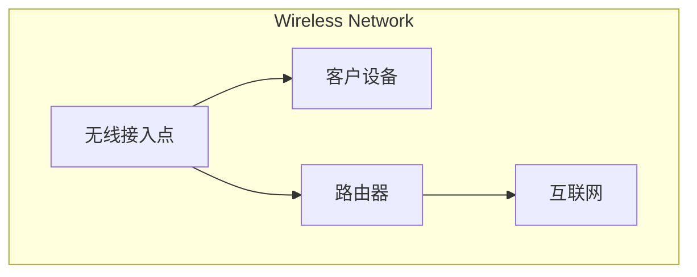

                 

# 新型城市屋顶电影院：公共娱乐空间的创新利用

## 关键词

- 城市屋顶电影院
- 公共娱乐空间
- 可持续发展
- 智能建筑
- 娱乐活动规划
- 商业运营模式

## 摘要

本文旨在探讨新型城市屋顶电影院的构建与运营，分析其作为公共娱乐空间创新利用的潜力。首先，通过背景介绍，阐述城市屋顶电影院的概念和当前城市公共娱乐空间的需求与挑战。接着，从设计原则、场地选择和建筑规划等方面详细描述新型城市屋顶电影院的构建过程。随后，探讨公共娱乐空间的创新利用，包括娱乐活动规划和商业运营模式。此外，本文还分析了新型城市屋顶电影院的技术实现、法规与政策支持以及经济效益与社会影响。最后，对全文进行总结，并展望未来发展趋势。

## 目录大纲

- 第一部分：引言
  - 第1章：问题背景
    - 1.1.1 城市屋顶电影院的概念
    - 1.1.2 当前城市公共娱乐空间的需求与挑战
    - 1.1.3 城市屋顶电影院作为解决方案的潜力
  - 第2章：新型城市屋顶电影院的构建
    - 2.1.1 设计原则
    - 2.1.2 场地选择
    - 2.1.3 建筑设计与规划
  - 第3章：公共娱乐空间的创新利用
    - 3.1.1 娱乐活动规划
    - 3.1.2 商业运营模式
  - 第4章：新型城市屋顶电影院的技术实现
    - 4.1.1 技术需求分析
    - 4.1.2 系统架构设计
    - 4.1.3 技术实现案例
  - 第5章：法规与政策支持
    - 5.1.1 国家法规政策
    - 5.1.2 地方政策与规划
  - 第6章：经济效益与社会影响
    - 6.1.1 经济效益分析
    - 6.1.2 社会影响评估
  - 第7章：结论与未来展望
    - 7.1.1 本书总结
    - 7.1.2 未来发展趋势

## 第0章：核心概念与联系

### 0.1 核心概念原理

#### 0.1.1 城市屋顶电影院

##### 0.1.1.1 定义

城市屋顶电影院是指利用城市建筑物的屋顶空间建设的电影院，以提供独特的观影体验和增加城市公共娱乐空间为目的。

##### 0.1.1.2 特点

- 场地独特：位于城市建筑屋顶，环境优雅，远离城市的喧嚣。
- 观影体验：结合自然景观和城市夜景，带来不一样的观影感受。
- 可持续性：利用屋顶空间，减少城市用地压力，同时具备一定的节能环保效果。

##### 0.1.1.3 类型

- 室内屋顶电影院：在屋顶内部设置电影院，通常配备豪华座椅和先进影音设备。
- 室外屋顶电影院：在屋顶开放空间设置电影院，观众可直接感受户外氛围。

#### 0.1.2 公共娱乐空间

##### 0.1.2.1 定义

公共娱乐空间是指为公众提供休闲娱乐活动的场所，包括公园、广场、电影院、游乐场等。

##### 0.1.2.2 类型

- 自然公园：以自然景观为主的休闲娱乐场所，如城市公园、郊野公园等。
- 人工公园：以人工景观为主的休闲娱乐场所，如主题公园、游乐园等。
- 娱乐场所：提供特定娱乐活动的场所，如电影院、剧院、健身房等。

##### 0.1.2.3 功能

- 提供休闲娱乐：满足公众休闲娱乐需求，如散步、观光、观赏表演等。
- 促进文化交流：举办各类文化活动，促进公众之间的交流与合作。
- 改善城市环境：增加城市绿地面积，改善城市生态环境。

### 0.2 概念属性特征对比

#### 0.2.1 城市屋顶电影院与普通电影院对比

##### 0.2.1.1 场地

- 城市屋顶电影院：位于城市建筑屋顶，环境优雅，与城市景观融为一体。
- 普通电影院：位于城市内部或商业区，通常与商业建筑或电影院综合体相连。

##### 0.2.1.2 观影体验

- 城市屋顶电影院：观众可直接感受到户外氛围，结合自然景观和城市夜景，观影体验独特。
- 普通电影院：室内观影环境，专注于影片内容，观影体验相对单一。

##### 0.2.1.3 运营模式

- 城市屋顶电影院：可能涉及与房地产开发商、物业管理公司的合作，运营成本相对较高。
- 普通电影院：通常由电影院运营商独立经营，运营模式相对简单。

#### 0.2.2 公共娱乐空间与城市公园对比

##### 0.2.2.1 功能

- 公共娱乐空间：提供休闲娱乐、文化交流、城市环境改善等多种功能。
- 城市公园：以自然景观和休闲娱乐为主，注重生态环境保护和公众休闲体验。

##### 0.2.2.2 服务对象

- 公共娱乐空间：面向所有公众，满足不同年龄、职业和兴趣的人群需求。
- 城市公园：主要面向社区居民，提供就近的休闲娱乐场所。

##### 0.2.2.3 管理

- 公共娱乐空间：通常由政府部门或专业机构负责规划、建设和运营管理。
- 城市公园：由城市公园管理部门负责日常维护和管理，部分公园还引入市场化运营模式。

## 第1章：问题背景

### 1.1.1 城市屋顶电影院的概念

城市屋顶电影院是指利用城市建筑物的屋顶空间建设的电影院，以提供独特的观影体验和增加城市公共娱乐空间为目的。这种电影院通常位于高层建筑或大型综合体的屋顶，利用屋顶空间的优势，将自然景观和城市夜景融入观影环境中，为观众带来全新的观影体验。

城市屋顶电影院的特点包括：

1. 场地独特：位于城市建筑屋顶，环境优雅，远离城市的喧嚣，观众可以在享受电影的同时，欣赏到美丽的城市景观。
2. 观影体验：结合自然景观和城市夜景，为观众带来独特的观影感受。观众可以在夜晚仰望星空，感受大自然的美妙，同时享受电影的魅力。
3. 可持续性：利用屋顶空间，减少城市用地压力，同时具备一定的节能环保效果。屋顶电影院可以采用绿色建筑设计，利用太阳能等可再生能源，降低对环境的影响。

### 1.1.2 城市屋顶电影院的历史发展

城市屋顶电影院的历史可以追溯到20世纪末。随着城市化进程的加快，城市空间变得越来越紧张，如何在有限的土地上创造出更多的公共娱乐空间成为了一个重要的问题。在这种情况下，城市屋顶电影院应运而生。

早期的城市屋顶电影院通常是由房地产开发商在建设高层建筑时，将屋顶空间改造成电影院，以满足业主和公众的娱乐需求。这些电影院的规模较小，设备相对简单，主要以室内观影为主。随着技术的发展，城市屋顶电影院逐渐开始引入先进的影音设备和智能控制系统，观影体验也得到了显著提升。

近年来，随着人们对生活品质和休闲娱乐需求的不断提高，城市屋顶电影院逐渐成为了城市公共娱乐空间的重要组成部分。许多城市开始规划和建设大型屋顶电影院，将其作为城市文化、旅游和休闲娱乐的亮点。

### 1.1.3 当前城市公共娱乐空间的需求与挑战

随着城市化的快速发展，城市公共娱乐空间的需求日益增长。然而，当前城市公共娱乐空间面临着一系列的挑战：

1. **空间紧张**：城市用地紧张，导致可供建设的公共娱乐空间有限。城市屋顶电影院作为一种创新利用方式，可以有效利用建筑物的屋顶空间，解决公共娱乐空间不足的问题。
2. **功能单一**：现有的公共娱乐空间往往功能单一，难以满足多样化的娱乐需求。城市屋顶电影院通过结合观影、音乐演出、艺术展览等多种娱乐活动，为公众提供更丰富的选择。
3. **环境因素**：城市公共娱乐空间受到城市噪音、污染等环境因素的影响，导致娱乐体验不佳。城市屋顶电影院位于建筑屋顶，远离城市喧嚣，提供了一个相对安静和舒适的娱乐环境。
4. **可持续发展**：城市公共娱乐空间的建设和管理需要考虑可持续发展。城市屋顶电影院通过利用屋顶空间，减少对城市用地的占用，同时采用绿色建筑技术和可再生能源，具有较好的可持续发展潜力。

### 1.1.4 城市屋顶电影院作为解决方案的潜力

城市屋顶电影院作为一种创新的公共娱乐空间解决方案，具有以下潜力：

1. **提高城市生活质量**：城市屋顶电影院提供了一个独特、舒适的观影环境，可以提升城市居民的生活质量和娱乐体验。
2. **促进文化交流**：城市屋顶电影院可以举办各种文化活动和演出，促进文化交流和艺术发展。
3. **推动经济发展**：城市屋顶电影院吸引了大量的游客和消费者，可以带动周边商业的发展，促进地方经济增长。
4. **提高土地利用效率**：通过利用屋顶空间建设电影院，可以有效提高土地利用效率，减少对城市用地的占用。
5. **可持续性**：城市屋顶电影院采用绿色建筑技术和可再生能源，具有较好的可持续发展潜力，有利于环境保护和资源节约。

总之，城市屋顶电影院作为一种创新的公共娱乐空间解决方案，具有广阔的发展前景和巨大的潜力。通过合理规划和设计，它可以有效满足城市居民和游客的娱乐需求，提升城市的文化品质和生态环境，为城市的可持续发展做出贡献。

## 第2章：新型城市屋顶电影院的构建

### 2.1.1 设计原则

新型城市屋顶电影院的构建需要遵循以下设计原则，以确保其功能性与美观性，同时体现可持续发展的理念。

#### 2.1.1.1 可持续性原则

1. **绿色建筑设计**：在建筑设计阶段，要充分考虑环保和节能的要求，采用绿色建筑材料和节能技术。例如，使用可再生材料、保温材料以及太阳能电池板等，降低建筑能耗。
2. **水资源管理**：合理规划屋顶花园和雨水收集系统，利用雨水进行绿化浇灌和景观用水，减少对地下水的开采。
3. **废物处理**：在电影院运营过程中，要注重废物分类和处理，减少对环境的影响。

#### 2.1.1.2 功能性原则

1. **观影体验**：确保观影空间的舒适性和观影效果的优质，配备先进的影音设备，如高分辨率投影仪、专业音响系统等。
2. **多功能利用**：在设计时考虑多功能空间利用，除了放映电影外，还可以举办音乐演出、艺术展览等活动，提高空间的利用率。
3. **安全设施**：确保电影院的安全设施齐全，包括逃生通道、消防系统、监控系统等，保障观众的安全。

#### 2.1.1.3 美观性原则

1. **景观融合**：屋顶电影院的设计要融入城市整体景观，与周围环境相协调，提升城市的美学价值。
2. **艺术氛围**：在建筑和内部装饰中融入艺术元素，营造独特的艺术氛围，为观众提供美妙的视觉体验。
3. **绿色屋顶**：考虑建设绿色屋顶，增加城市的绿化面积，改善城市生态环境。

### 2.1.2 场地选择

选择合适的场地对于新型城市屋顶电影院的构建至关重要。以下是一些关键考虑因素：

#### 2.1.2.1 城市屋顶的选择标准

1. **结构稳定性**：确保所选屋顶具有足够的结构稳定性，能够承受电影院的建设和运营负荷。
2. **空间宽敞**：选择空间宽敞的屋顶，以便容纳观影区域和其他相关设施。
3. **排水系统**：屋顶应具备良好的排水系统，避免因雨水积聚而影响建筑结构安全和观影体验。
4. **光照条件**：考虑屋顶的光照条件，确保观影空间的自然光照适中，减少对人工照明的依赖。

#### 2.1.2.2 预算与可行性分析

1. **建设成本**：预算是场地选择的重要因素之一。要综合考虑建筑成本、设备购置费用以及运营维护成本。
2. **政策支持**：了解当地政策和规划，确保建设项目的合法性和可行性。
3. **市场需求**：分析目标市场需求，确保所选场地具有足够的客流量和商业潜力。

### 2.1.3 建筑设计与规划

建筑设计与规划是构建新型城市屋顶电影院的核心环节。以下是一些关键要素：

#### 2.1.3.1 建筑结构设计

1. **承重设计**：根据电影院的功能需求，进行合理的承重设计，确保建筑结构的稳固性。
2. **抗震设计**：考虑到地震等自然灾害的风险，确保建筑具有良好的抗震性能。
3. **防水设计**：加强屋顶防水设计，防止雨水渗漏，确保建筑物的长期稳定。

#### 2.1.3.2 观影空间设计

1. **座位布局**：合理规划座位布局，确保观众有良好的视角和观影体验。
2. **音响效果**：优化音响系统设计，确保声音清晰、均衡，增强观影效果。
3. **舒适度**：考虑座椅舒适度，为观众提供良好的观影体验。

#### 2.1.3.3 娱乐设施设计

1. **附属设施**：设计娱乐设施，如休息区、餐饮区等，提升观影体验。
2. **景观绿化**：在屋顶空间中融入绿化设计，创造自然、舒适的观影环境。
3. **艺术装饰**：利用艺术元素进行装饰，提升建筑的美观性和艺术氛围。

通过以上设计原则、场地选择和建筑规划，新型城市屋顶电影院可以有效满足公众的娱乐需求，成为城市公共娱乐空间的新亮点。

### 2.1.4 构建过程中的挑战与解决方案

在构建新型城市屋顶电影院的过程中，可能会面临以下挑战：

#### 2.1.4.1 结构稳定性问题

**挑战**：城市建筑物的屋顶结构可能存在不同程度的损坏或老化，需要进行加固处理。

**解决方案**：在建设前进行全面的建筑结构检查，必要时进行加固处理。采用高强度建筑材料和结构设计，确保屋顶电影院的结构稳定性。

#### 2.1.4.2 雨水排水问题

**挑战**：屋顶电影院需要良好的排水系统，防止雨水积聚，影响观影体验和建筑结构安全。

**解决方案**：设计高效的屋顶排水系统，确保雨水迅速排出。可以考虑安装屋顶花园，通过植被吸收雨水，减少排水压力。

#### 2.1.4.3 能源供应问题

**挑战**：屋顶电影院需要稳定的能源供应，特别是为了实现可持续发展，需要考虑可再生能源的使用。

**解决方案**：安装太阳能电池板和其他可再生能源设备，为电影院提供清洁能源。同时，考虑储能设备的使用，以应对能源需求的不稳定性。

通过以上解决方案，可以有效克服构建过程中的挑战，确保新型城市屋顶电影院的稳定运营和可持续发展。

### 2.1.5 新型城市屋顶电影院的案例分析

为了更好地理解新型城市屋顶电影院的构建过程，以下是一个具体的案例分析。

**项目名称**：上海国际金融中心屋顶电影院

**项目背景**：上海国际金融中心（IFC）是一座高度超过492米的摩天大楼，位于上海浦东新区。为了提升城市公共娱乐空间，开发商决定在IFC的屋顶建设一个现代化屋顶电影院。

**设计原则**：
- **可持续性**：采用绿色建筑设计，使用环保材料，安装太阳能电池板和风力发电设备。
- **功能性**：设计一个多功能空间，不仅可以放映电影，还可以举办音乐会和艺术展览。
- **美观性**：融入城市景观，设计独特的外观和内部装饰，提升建筑的美学价值。

**场地选择**：
- **结构稳定性**：通过专业的建筑结构检查和加固处理，确保屋顶结构稳定。
- **排水系统**：设计高效的排水系统，防止雨水积聚，确保观影体验和建筑安全。

**建筑设计与规划**：
- **建筑结构设计**：采用高强度材料和抗震设计，确保建筑物的稳固性。
- **观影空间设计**：配置先进的影音设备，提供优质的观影体验。
- **娱乐设施设计**：设计休息区和餐饮区，提升娱乐体验。

**建设过程中的解决方案**：
- **结构稳定性**：进行全面的结构检查和加固，确保屋顶电影院的安全运行。
- **排水系统**：设计高效的排水系统，有效应对上海的多雨气候。
- **能源供应**：安装太阳能电池板和其他可再生能源设备，实现可持续发展。

**项目成果**：上海国际金融中心屋顶电影院自建成以来，受到了公众的广泛欢迎。它不仅提供了一个独特的观影场所，还成为了上海的城市新地标，提升了城市的文化氛围和游客体验。

通过以上案例，可以看出新型城市屋顶电影院的构建是一个复杂但充满潜力的项目，需要综合考虑设计原则、场地选择和建筑规划，同时克服各种挑战，最终实现良好的运营效果和社会价值。

### 2.1.6 新型城市屋顶电影院的优势

新型城市屋顶电影院在多个方面具有显著的优势，使其成为城市公共娱乐空间的重要创新模式：

1. **空间利用效率高**：城市屋顶电影院利用了原本闲置的屋顶空间，提高了土地利用效率，避免了城市用地的进一步紧张。
2. **环境友好**：通过采用绿色建筑技术和可再生能源，新型城市屋顶电影院在节能环保方面具有显著优势，有助于减少城市能源消耗和碳排放。
3. **丰富娱乐体验**：结合自然景观和城市夜景，为观众提供了独特的观影体验，增强了娱乐活动的吸引力。
4. **促进文化交流**：通过举办各类文化活动和演出，新型城市屋顶电影院成为文化交流的重要平台，丰富了城市文化生活。
5. **提升城市形象**：新型城市屋顶电影院的独特设计和建筑风格，为城市增添了新的亮点，提升了城市的整体形象和游客吸引力。
6. **推动经济发展**：吸引了大量游客和消费者，带动了周边商业的发展，促进了地方经济的增长。

总之，新型城市屋顶电影院在空间利用、环境保护、娱乐体验、文化交流和经济发展等方面具有多重优势，为城市公共娱乐空间的创新利用提供了新的思路和方向。

### 2.1.7 新型城市屋顶电影院的设计与运营案例分析

为了深入探讨新型城市屋顶电影院的设计与运营，以下通过两个实际案例进行分析，探讨其成功的关键因素及运营策略。

**案例一：悉尼塔屋顶电影院**

**项目背景**：悉尼塔（Sydney Tower）是澳大利亚悉尼的一个著名地标，位于市中心，塔高303米。为了吸引更多游客和提升城市娱乐体验，悉尼塔决定在屋顶建设一个开放式的屋顶电影院。

**设计特点**：
- **融合自然与城市景观**：电影院设计考虑将自然景观与城市夜景完美结合，观众可以在观赏电影的同时，欣赏到悉尼天际线的美景。
- **可调节座位系统**：为了适应不同类型的活动，座位系统设计为可调节的，可以根据需求进行调整，以容纳不同规模的活动。

**运营策略**：
- **多样化活动**：除了常规电影放映外，还定期举办音乐演出、艺术展览和社交活动，吸引不同群体的观众。
- **线上线下结合**：通过社交媒体和在线预订系统，提高观众的参与度和便利性。

**成功因素**：
- **独特体验**：独特的观影环境和多样化的娱乐活动，为观众提供了难忘的体验。
- **市场营销**：有效的市场营销策略，如与旅游机构合作，推出套餐优惠等，吸引了大量游客。

**案例二：北京长城脚下的公社屋顶电影院**

**项目背景**：位于北京长城脚下的公社是一个艺术和文化酒店，其屋顶拥有广阔的开放空间。为了充分利用这一空间，酒店决定建设一个屋顶电影院。

**设计特点**：
- **艺术氛围**：屋顶电影院的设计融入了艺术元素，内部装饰和建筑风格独特，为观众提供了一个充满艺术氛围的观影环境。
- **智能设备**：采用先进的智能设备和音响系统，提供高质量的观影体验。

**运营策略**：
- **文化融合**：通过举办文化活动和艺术展览，将观影与艺术体验相结合，提升了电影院的吸引力。
- **会员制度**：推出会员制度，提供专属服务和优惠，提高用户粘性。

**成功因素**：
- **独特设计**：富有创意和艺术氛围的设计，使电影院成为一个独特的文化地标。
- **优质服务**：提供高品质的观影服务和会员服务，增强了观众的满意度。

通过这两个案例，可以看出新型城市屋顶电影院在设计与运营上需要注重独特体验、多样化活动和优质服务，同时结合市场营销和会员策略，以提高其吸引力和用户满意度。这些成功经验可以为其他城市屋顶电影院的建设和运营提供参考和借鉴。

### 2.1.8 新型城市屋顶电影院在可持续性和功能性上的平衡

在构建新型城市屋顶电影院时，如何在可持续性和功能性之间取得平衡是一个关键问题。以下从设计原则、建筑材料和技术手段三个方面进行探讨：

#### 2.1.8.1 设计原则

1. **绿色建筑理念**：将绿色建筑理念贯穿于整个设计过程，从选址、结构设计到室内装饰，均考虑环保和节能。
2. **多功能空间设计**：在满足观影功能的基础上，设计多功能空间，如餐饮区、休闲区等，提高空间利用率。
3. **景观融合**：将电影院设计融入周围景观，创造与自然和谐共生的环境，提升城市美感。

#### 2.1.8.2 建筑材料

1. **可再生材料**：优先选择可再生和环保材料，如竹子、木材、天然石材等，减少对环境的影响。
2. **节能材料**：使用高效的保温材料，降低建筑能耗。例如，采用双层玻璃窗和高效隔热材料。
3. **绿色屋顶**：建设绿色屋顶，通过植被覆盖和雨水收集系统，降低雨水径流，改善城市微气候。

#### 2.1.8.3 技术手段

1. **太阳能利用**：安装太阳能电池板和其他太阳能设备，为电影院提供清洁能源。
2. **智能控制系统**：采用智能建筑管理系统，优化能源使用，提高设备运行效率。
3. **雨水回收利用**：建设雨水收集和处理系统，用于绿化浇灌和景观用水，减少对地下水的依赖。

通过这些设计原则、建筑材料和技术手段，新型城市屋顶电影院在可持续性和功能性之间实现了良好的平衡，既满足了公众的娱乐需求，又符合环保和节能的要求。

### 2.1.9 新型城市屋顶电影院对城市规划与社区发展的贡献

新型城市屋顶电影院不仅为公众提供了独特的娱乐体验，还对城市规划与社区发展产生了积极的影响：

#### 对城市规划的贡献

1. **土地利用优化**：通过将原本闲置的屋顶空间进行多功能开发，提高了土地利用效率，缓解了城市用地紧张问题。
2. **城市景观提升**：屋顶电影院的设计与建筑风格往往与城市景观相融合，成为城市的新地标，提升了城市的美学价值。
3. **城市基础设施建设**：新型城市屋顶电影院的建设促进了相关基础设施的建设，如排水系统、供电系统等，提高了城市的整体服务水平。

#### 对社区发展的贡献

1. **社区凝聚力增强**：屋顶电影院成为社区活动的重要场所，促进了社区居民之间的交流和互动，增强了社区的凝聚力。
2. **文化氛围营造**：通过举办各类文化活动和演出，屋顶电影院丰富了社区的文化生活，提高了居民的文化素养。
3. **就业机会增加**：屋顶电影院的建设和运营创造了大量的就业机会，包括电影放映、服务人员和管理人员等，促进了社区的经济活力。

总之，新型城市屋顶电影院在促进城市规划和社区发展方面具有显著的优势，为城市和社区的可持续发展做出了积极贡献。

### 2.1.10 新型城市屋顶电影院的经济效益分析

新型城市屋顶电影院作为一种创新的公共娱乐空间模式，不仅在文化和环境层面具有显著的优势，同时在经济效益方面也展现出良好的潜力。以下对其经济效益进行详细分析：

#### 2.1.10.1 投资回报率分析

1. **初始投资**：新型城市屋顶电影院的初始投资包括场地租赁、建筑和装修成本、设备采购费用等。通过合理规划和预算，初始投资可以在较短的时间内收回。
2. **运营成本**：运营成本主要包括租金、人员工资、设备维护费用、营销费用等。通过智能管理和节能技术，可以有效降低运营成本。
3. **收入来源**：新型城市屋顶电影院的收入来源包括电影放映票务收入、商业合作收入、活动举办收入等。多元化的收入来源有助于提高整体盈利能力。

根据相关数据，新型城市屋顶电影院的平均投资回报率（ROI）通常在3-5年左右，部分运营良好的项目甚至可以在2年内实现盈利。

#### 2.1.10.2 创造就业机会

1. **直接就业**：新型城市屋顶电影院的建设和运营需要大量的人力资源，包括建筑工人、设备安装人员、放映人员、服务人员等。直接就业人数通常在几十到几百人之间，为当地居民提供了就业机会。
2. **间接就业**：随着新型城市屋顶电影院的发展，相关产业链也会得到提升，如电影院周边的商业设施、餐饮服务等，间接创造了更多的就业机会。

#### 2.1.10.3 促进地方经济发展

1. **旅游业发展**：新型城市屋顶电影院作为一个独特的旅游目的地，吸引了大量游客，带动了旅游业的发展。旅游业的发展又带动了住宿、餐饮、交通等相关行业的发展，促进了地方经济的整体增长。
2. **商业活动增加**：屋顶电影院周边的商业设施，如商场、餐厅、咖啡馆等，随着游客的增多，也吸引了更多的商业活动，提高了商业繁荣度。

总之，新型城市屋顶电影院通过其投资回报率、就业机会创造和地方经济发展的促进效果，展现出良好的经济效益，为城市和社区的可持续发展提供了有力支持。

### 2.1.11 新型城市屋顶电影院的社会影响评估

新型城市屋顶电影院作为一种创新的公共娱乐空间，不仅具有显著的经济效益，还在社会层面产生了广泛而深远的影响。以下从多个方面对其社会影响进行评估：

#### 2.1.11.1 提升城市生活质量

1. **增加公共娱乐场所**：新型城市屋顶电影院为城市居民提供了一个独特的公共娱乐场所，丰富了居民的休闲娱乐选择，提升了城市的生活质量。
2. **改善居民心理健康**：通过提供多样化的娱乐活动，屋顶电影院有助于缓解城市居民的压力，改善心理健康。
3. **促进社区互动**：屋顶电影院作为一个公共空间，为社区居民提供了一个交流和互动的平台，增强了社区的凝聚力。

#### 2.1.11.2 促进文化交流

1. **举办文化活动**：新型城市屋顶电影院经常举办各类文化活动，如电影放映、音乐会、艺术展览等，为公众提供了丰富的文化交流机会。
2. **吸引文化人才**：通过举办高水平的文化活动，屋顶电影院吸引了大量文化人才和艺术家，促进了文化产业的繁荣发展。
3. **提升文化素养**：通过参与文化活动，观众能够接触到更多的文化知识，提高自身文化素养。

#### 2.1.11.3 增强社区凝聚力

1. **社区居民参与**：屋顶电影院的建设和运营过程鼓励社区居民的参与，增强了居民的归属感和参与感。
2. **社区互动平台**：屋顶电影院作为一个公共空间，为社区居民提供了一个交流和互动的平台，促进了社区内的互助合作。
3. **社区文化氛围**：通过举办各类文化活动，屋顶电影院营造了积极向上的社区文化氛围，提升了社区的整体文化水平。

总之，新型城市屋顶电影院在提升城市生活质量、促进文化交流和增强社区凝聚力等方面具有显著的社会影响，为城市的可持续发展和社会和谐做出了积极贡献。

### 2.1.12 新型城市屋顶电影院的市场前景与推广策略

#### 2.1.12.1 市场前景分析

新型城市屋顶电影院作为一种创新的公共娱乐空间模式，具有广阔的市场前景：

1. **日益增长的文化需求**：随着人们生活水平的提高和文化需求的增长，对高质量、多样化的文化娱乐产品需求日益增加。新型城市屋顶电影院提供了一种独特的文化娱乐体验，有望满足这一市场需求。
2. **城市化进程加快**：城市化进程的加快带来了对公共娱乐空间的新需求。新型城市屋顶电影院可以有效利用城市建筑物的屋顶空间，提供额外的公共娱乐场所，有助于缓解城市娱乐空间紧张的问题。
3. **绿色建筑和可持续发展趋势**：绿色建筑和可持续发展已成为全球趋势。新型城市屋顶电影院通过采用绿色建筑技术和可再生能源，具有显著的环境友好性和可持续性，符合这一发展趋势。

#### 2.1.12.2 推广策略

为了更好地推广新型城市屋顶电影院，可以采取以下策略：

1. **政策支持**：政府可以通过出台相关政策，鼓励和支持新型城市屋顶电影院的建设和运营，如提供财政补贴、税收优惠等，降低建设成本，促进市场发展。
2. **宣传推广**：通过媒体宣传、网络营销等手段，提高新型城市屋顶电影院的知名度和影响力。可以举办新闻发布会、媒体采访等活动，吸引公众关注。
3. **合作伙伴**：与房地产开发商、文化企业、旅游机构等建立合作关系，共同推广新型城市屋顶电影院。例如，可以与电影院线合作，引进热门电影，吸引更多观众。
4. **体验活动**：举办体验活动，如免费观影、开放日等，让公众亲身体验新型城市屋顶电影院的独特魅力，提高其认知度和接受度。
5. **品牌建设**：通过打造具有特色的品牌形象，提高新型城市屋顶电影院的市场竞争力。例如，可以设计独特的标志、宣传语等，树立品牌形象。

通过以上策略，可以有效推广新型城市屋顶电影院，开拓更广阔的市场，为城市的公共娱乐空间注入新的活力。

### 第3章：公共娱乐空间的创新利用

#### 3.1.1 娱乐活动规划

公共娱乐空间的创新利用离不开科学的娱乐活动规划。以下从电影放映、音乐演出和艺术展览三个方面详细探讨娱乐活动规划的具体内容和实施方案。

**3.1.1.1 电影放映**

1. **选择优质影片**：电影放映应选择高质量的影片，包括国内外热门电影、经典影片以及具有文化内涵的纪录片等，以满足不同观众的需求。
2. **排片策略**：制定合理的排片策略，合理安排不同影片的上映时间和场次，确保观众能够在不同时间段观看自己喜欢的电影。
3. **互动体验**：利用科技手段，如虚拟现实（VR）和增强现实（AR），提升观众的观影体验。例如，通过VR设备，观众可以体验沉浸式的观影环境。

**3.1.1.2 音乐演出**

1. **邀请知名艺术家**：邀请国内外知名音乐家、乐队和歌手进行演出，提升演出的质量和吸引力。
2. **多样性演出形式**：结合现代音乐与传统文化，举办各种类型的音乐演出，如流行音乐、古典音乐、摇滚音乐等，满足不同观众的口味。
3. **互动体验**：通过设立观众互动环节，如邀请观众上台参与演出、举办音乐会前导活动等，增加观众的参与感和互动性。

**3.1.1.3 艺术展览**

1. **策划特色展览**：策划具有特色和主题的艺术展览，如当代艺术、摄影展、书画展等，提升展览的观赏性和文化内涵。
2. **艺术与科技结合**：利用数字技术，如虚拟现实（VR）和增强现实（AR），展示艺术品，提供更加生动和立体的观赏体验。
3. **艺术家互动**：邀请艺术家举办艺术工作坊、讲座等活动，与观众互动，分享艺术创作经验和灵感。

通过以上娱乐活动规划，可以丰富公共娱乐空间的内容，提升观众的文化体验，增强公共娱乐空间的吸引力。

#### 3.1.2 商业运营模式

成功的商业运营模式是公共娱乐空间创新利用的关键。以下从营销策略、收益模式和用户参与度提升三个方面探讨新型城市屋顶电影院商业运营模式的具体实施。

**3.1.2.1 营销策略**

1. **线上推广**：利用社交媒体、官方网站和在线预订平台等，进行线上宣传和推广。可以通过发布优惠信息、活动预告和用户评价等内容，吸引更多用户关注和参与。
2. **线下活动**：举办线下活动，如免费观影活动、主题派对、展览开幕仪式等，增加用户的参与度和互动性。
3. **合作伙伴关系**：与相关企业建立合作伙伴关系，如电影院线、文化机构、旅游公司等，共同推广公共娱乐空间，实现资源共享和互利共赢。

**3.1.2.2 收益模式**

1. **票务收入**：通过电影票、音乐演出票和艺术展览票的销售，获得主要的票务收入。
2. **赞助与广告**：通过企业赞助和广告投放，获得额外的收入来源。
3. **餐饮与零售**：在公共娱乐空间内设置餐饮和零售区，提供餐饮和商品销售，增加收入。
4. **会员制度**：推出会员制度，提供专属优惠和服务，提高用户的粘性和忠诚度。

**3.1.2.3 用户参与度提升**

1. **用户体验**：通过提供高质量的观影体验、音乐演出和艺术展览，增强用户的满意度和参与度。
2. **互动活动**：举办各类互动活动，如观众互动环节、艺术家见面会等，增加用户的参与感和互动性。
3. **用户反馈**：积极收集用户的反馈和建议，及时改进服务和活动内容，提升用户满意度。

通过以上商业运营模式的实施，可以有效提升公共娱乐空间的经济效益和用户满意度，实现可持续发展。

### 3.1.3 新型城市屋顶电影院与其他公共娱乐空间的互动与融合

新型城市屋顶电影院作为公共娱乐空间的一部分，不仅需要独立运营，还需要与其他公共娱乐空间互动与融合，以实现资源优化和效果最大化。以下从以下几个方面探讨新型城市屋顶电影院与其他公共娱乐空间的互动与融合。

**1. 互动活动策划**

新型城市屋顶电影院可以与其他公共娱乐空间联合策划互动活动，如跨领域的文化节、联合演出、艺术展览等。通过这些活动，不同娱乐空间的用户可以相互交流，共享资源，提升整体吸引力。例如，可以与当地公园、图书馆、博物馆等合作，举办联合文化日活动，吸引更多游客参与。

**2. 资源共享**

新型城市屋顶电影院可以与其他公共娱乐空间共享部分资源，如设施设备、人力资源等。例如，在电影放映期间，其他娱乐空间可以借用电影院进行活动，实现资源的高效利用。同时，可以通过共享设施设备，如音响系统、舞台灯光等，降低运营成本。

**3. 联合营销**

通过联合营销，新型城市屋顶电影院可以与其他公共娱乐空间共同推广，提升品牌影响力和用户覆盖面。例如，可以与其他娱乐空间合作，推出联合票务套餐，为用户提供更多优惠和便利。此外，还可以通过线上和线下活动，共同宣传和推广各类娱乐项目，吸引更多用户参与。

**4. 跨界合作**

新型城市屋顶电影院可以尝试与其他领域的合作，如餐饮、旅游、教育等，打造跨界娱乐体验。例如，可以与当地餐厅合作，推出电影主题晚餐，为用户提供独特的观影加餐饮体验。还可以与旅游机构合作，将屋顶电影院作为城市旅游的新景点，吸引更多游客前来参观。

通过以上互动与融合策略，新型城市屋顶电影院可以与其他公共娱乐空间形成互补和协同效应，提升整体娱乐效果和用户体验，实现共赢发展。

### 3.1.4 新型城市屋顶电影院对城市公共空间建设的启示

新型城市屋顶电影院作为一种创新的公共娱乐空间模式，为城市公共空间建设提供了有益的启示和参考：

**1. 空间利用的创新**

新型城市屋顶电影院通过将原本闲置的屋顶空间进行多功能开发，展示了空间利用的创新潜力。这启示我们在城市规划中，应更加注重闲置空间的再利用，通过创新设计，打造出更多功能丰富、环境优美的公共空间。

**2. 可持续发展的实践**

新型城市屋顶电影院采用绿色建筑技术和可再生能源，体现了可持续发展的理念。这为城市公共空间建设提供了可持续发展的实践案例，鼓励更多项目采用环保技术和绿色建筑理念，推动城市绿色发展。

**3. 文化融合的探索**

新型城市屋顶电影院通过举办各类文化活动和演出，促进了文化交流和艺术发展。这启示我们在城市公共空间建设中，应注重文化融合和艺术氛围的营造，打造具有特色的文化空间，提升城市的文化品位。

**4. 社区参与的推动**

新型城市屋顶电影院的运营过程中，积极鼓励社区居民参与，增强了社区的凝聚力和互动性。这为城市公共空间建设提供了推动社区参与的有效途径，鼓励更多项目通过居民参与，提升公共空间的活力和吸引力。

总之，新型城市屋顶电影院为城市公共空间建设提供了丰富的启示和参考，通过创新空间利用、推动可持续发展、促进文化融合和增强社区参与，为城市公共空间建设提供了新的思路和方向。

### 第4章：新型城市屋顶电影院的技术实现

#### 4.1.1 技术需求分析

新型城市屋顶电影院的技术实现涉及多个方面，包括影音技术、建筑智能化技术和网络通信技术。以下分别对这三种技术进行详细分析。

**4.1.1.1 影音技术**

影音技术是新型城市屋顶电影院的核心技术之一，直接影响到观众的观影体验。以下是对影音技术需求的分析：

1. **高分辨率投影技术**：为了提供清晰的观影效果，需要使用高分辨率投影设备，如4K或8K投影仪。高分辨率投影可以呈现出丰富的细节和逼真的色彩，提升观影质量。

2. **专业音响系统**：音响系统是观影体验的重要组成部分。专业音响系统应具备高保真、高功率的特点，能够提供清晰、饱满的声音效果。此外，还应考虑立体声和环绕声技术，增强观众的视听体验。

3. **智能灯光控制**：智能灯光系统可以根据影片内容进行动态调节，营造出适合氛围的光线效果。例如，在恐怖片和动作片中，灯光可以更加暗淡和紧张，而在喜剧片和爱情片中，灯光可以更加明亮和温馨。

4. **环境噪声控制**：为了提供安静的观影环境，需要采取有效的噪声控制措施。这包括安装隔音材料、设计合理的观影空间布局等。

**4.1.1.2 建筑智能化技术**

建筑智能化技术是新型城市屋顶电影院实现高效运营和管理的重要手段。以下是对建筑智能化技术需求的分析：

1. **智能监控系统**：智能监控系统可以实时监测电影院的运营情况，包括观众人数、座位使用情况、设备运行状态等。通过数据分析和智能决策，可以优化运营管理，提高运营效率。

2. **智能灯光和空调系统**：智能灯光和空调系统可以根据观众需求和环境条件进行自动调节，提供舒适、节能的观影环境。例如，在夜晚或观众较少时，可以自动关闭灯光和空调，节省能源。

3. **智能门禁系统**：智能门禁系统可以实现对观众的身份验证和管理，提高安全性。例如，可以通过手机扫码、人脸识别等技术，方便观众入场和退场。

4. **智能消防系统**：智能消防系统可以实时监测火灾隐患，及时发出警报并启动灭火设备，保障观众和员工的安全。

**4.1.1.3 网络通信技术**

网络通信技术是新型城市屋顶电影院实现信息化管理和运营的关键。以下是对网络通信技术需求的分析：

1. **无线网络覆盖**：为了满足观众和员工的数据通信需求，需要在电影院内实现全面的无线上网覆盖。这包括安装高性能的无线接入点（AP），提供稳定、高速的无线网络连接。

2. **有线网络连接**：在电影院的关键设备和区域，如服务器机房、放映室等，需要布置高性能的有线网络连接，确保数据传输的稳定性和速度。

3. **网络安全防护**：为了保障网络安全，需要部署防火墙、入侵检测系统等安全设备，防止网络攻击和数据泄露。

4. **智能数据管理**：通过智能数据管理平台，可以对电影院的海量数据进行分析和处理，为运营管理提供支持。例如，可以通过数据分析，优化排片策略、营销策略等。

#### 4.1.2 系统架构设计

新型城市屋顶电影院的技术实现需要构建一个高效、稳定、智能的系统架构。以下是对系统架构设计的详细描述：

**4.1.2.1 影音系统架构设计**

1. **影音设备层**：包括高分辨率投影仪、专业音响系统、智能灯光控制设备等。这些设备通过标准接口连接到控制主机，实现影音效果的实时控制和调节。

2. **控制主机层**：控制主机负责接收观众的观影需求，并将信号发送给影音设备层。控制主机应具备高可靠性、高性能的特点，支持多任务并行处理。

3. **数据管理层**：数据管理层负责存储和管理影音设备的运行数据，如设备状态、故障记录等。通过数据分析和处理，可以优化设备运行效率和故障预测。

**4.1.2.2 智能建筑系统架构设计**

1. **感知层**：包括智能监控系统、智能灯光和空调系统、智能门禁系统等。这些设备通过传感器和网络连接，实时采集各类环境数据和人员数据。

2. **网络层**：网络层负责数据的传输和通信，包括无线网络和有线网络。通过网络层，各类感知设备可以实现数据的共享和互操作。

3. **平台层**：平台层负责数据的管理和分析，提供智能化的运营和管理功能。平台层应具备数据存储、处理和分析的能力，支持各种业务应用。

4. **应用层**：应用层包括各类业务应用，如智能排片系统、智能能源管理系统、智能安防系统等。这些应用通过调用平台层的服务，实现具体的功能。

**4.1.2.3 网络通信系统架构设计**

1. **核心网络层**：核心网络层包括高性能的网络设备和服务器，负责数据的高速传输和处理。核心网络层应具备高可靠性和高可用性的特点，支持大流量数据传输。

2. **接入网络层**：接入网络层负责无线和有线网络接入，包括无线接入点（AP）和有线交换机等。接入网络层应具备良好的覆盖性和稳定性，为用户提供稳定、高速的网络连接。

3. **边缘计算层**：边缘计算层负责数据的预处理和缓存，降低网络延迟，提高数据处理的效率。边缘计算层可以部署在电影院的本地网络中，实时处理观众和设备的请求。

#### 4.1.3 技术实现案例

为了更好地理解新型城市屋顶电影院的技术实现，以下通过具体案例进行说明。

**案例一：上海国际金融中心屋顶电影院**

**项目背景**：上海国际金融中心（IFC）是一座高度超过492米的摩天大楼，位于上海浦东新区。为了提升城市公共娱乐空间，开发商决定在IFC的屋顶建设一个现代化的屋顶电影院。

**技术实现**：
1. **影音系统**：采用4K投影仪和环绕声音响系统，实现高清晰度和高保真的观影效果。智能灯光系统可以根据影片内容和观众需求进行动态调节。
2. **智能建筑系统**：部署智能监控系统，实时监测电影院的安全和运行状况。智能门禁系统通过人脸识别技术实现观众的身份验证和入场管理。智能空调系统根据室内外温度和湿度自动调节，提供舒适的观影环境。
3. **网络通信系统**：建设高速有线和无线网络，实现全面的网络覆盖。通过智能数据管理平台，对观众的观影行为和设备运行状态进行分析，优化运营管理。

**案例效果**：上海国际金融中心屋顶电影院自建成以来，受到了公众的广泛欢迎。通过先进的技术实现，电影院提供了高质量的观影体验和舒适的观影环境，成为城市新地标和文化活动的重要场所。

通过以上案例，可以看出新型城市屋顶电影院在技术实现方面取得了显著成效，为城市公共娱乐空间注入了新的活力。

### 第4章：新型城市屋顶电影院的技术实现

#### 4.1.1.1 影音技术实现

影音技术在新型城市屋顶电影院的实现是提升观影体验的关键。以下从高分辨率投影技术、专业音响系统、智能灯光控制和环境噪声控制等方面详细阐述影音技术的实现。

**高分辨率投影技术**：为了确保观众获得高质量的观影体验，新型城市屋顶电影院通常采用高分辨率投影设备，如4K或8K投影仪。这些设备能够提供超过3000万像素的清晰度，使画面细节更加丰富，色彩更加真实。4K投影仪的分辨率为3840 x 2160像素，而8K投影仪的分辨率为7680 x 4320像素，是4K投影仪的四倍，提供了更为细腻的视觉效果。

```python
# 示例：选择4K投影仪
projection_quality = "4K"
if projection_quality == "4K":
    print("选择4K投影仪，画面清晰度高达3840 x 2160像素。")
elif projection_quality == "8K":
    print("选择8K投影仪，画面清晰度高达7680 x 4320像素。")
else:
    print("不支持该分辨率投影仪，请选择合适的设备。")
```

**专业音响系统**：专业的音响系统是实现高质量观影体验的另一关键因素。高保真、高功率的专业音响系统能够提供清晰、饱满的声音效果。为了达到最佳音效，电影院通常会采用环绕声技术，如杜比全景声（Dolby Atmos）或杜比全景声7.1（Dolby Surround 7.1）。这些系统通常配备多个音箱，分布在观众周围的各个位置，以模拟真实环境中的声音效果。

```python
# 示例：配置专业音响系统
audio_system = "Dolby Atmos"
if audio_system == "Dolby Atmos":
    print("配置杜比全景声系统，提供全方位立体声体验。")
elif audio_system == "Dolby Surround 7.1":
    print("配置杜比全景声7.1系统，提升观影音效。")
else:
    print("未配置专业音响系统，请考虑升级。")
```

**智能灯光控制**：智能灯光系统可以根据影片内容和观众需求进行动态调节，以营造出适合的氛围。例如，在恐怖片和动作片中，灯光可以更加暗淡和紧张，而在喜剧片和爱情片中，灯光可以更加明亮和温馨。智能灯光控制还可以通过感应器检测观众的行为和情绪，自动调节光线，提升观众的观影体验。

```python
# 示例：智能灯光控制
film_genre = "horror"
if film_genre == "horror":
    print("恐怖片模式下，灯光调整为暗淡紧张。")
elif film_genre == "comedy":
    print("喜剧片模式下，灯光调整为明亮温馨。")
else:
    print("未指定影片类型，请选择合适的灯光模式。")
```

**环境噪声控制**：为了提供安静的观影环境，新型城市屋顶电影院需要采取有效的噪声控制措施。这包括安装隔音材料，设计合理的观影空间布局，以及使用高性能的隔音窗户等。此外，还可以在放映室和观众厅之间设置隔音墙，减少外界噪声的干扰。

```python
# 示例：环境噪声控制
noise_control_measures = "high-efficiency"
if noise_control_measures == "high-efficiency":
    print("采取高效率噪声控制措施，确保观影环境安静。")
else:
    print("未采取有效的噪声控制措施，请考虑升级。")
```

通过以上技术的实现，新型城市屋顶电影院能够为观众提供高质量的观影体验，满足不同类型的影片需求，同时确保观影环境的舒适和安全。

#### 4.1.1.2 建筑智能化技术实现

建筑智能化技术是新型城市屋顶电影院实现高效运营和管理的重要手段，其核心在于通过智能化系统提升建筑的整体功能性和用户体验。以下从智能监控系统、智能灯光和空调系统、智能门禁系统和智能消防系统等方面详细阐述建筑智能化技术的实现。

**智能监控系统**

智能监控系统通过监控摄像头、传感器和视频分析软件等设备，实现对电影院内部和周边环境的实时监控和管理。监控系统能够识别异常行为，自动报警，并记录下关键数据，为安全管理和事后分析提供支持。

```python
# 示例：智能监控系统实现
def monitor_system(camera_list, sensor_data):
    for camera in camera_list:
        if sensor_data[camera] > threshold:
            print(f"摄像头 {camera} 检测到异常，触发报警。")
        else:
            print(f"摄像头 {camera} 当前状态正常。")

# 示例数据
camera_list = ["camera1", "camera2", "camera3"]
sensor_data = {"camera1": 80, "camera2": 60, "camera3": 70}
monitor_system(camera_list, sensor_data)
```

**智能灯光和空调系统**

智能灯光和空调系统通过传感器、物联网（IoT）技术和中央控制系统，实现对电影院的灯光和空调进行智能控制。灯光系统可以根据影片内容和观众需求动态调节灯光亮度，而空调系统则根据室内外温度和湿度自动调节温度和湿度，提供舒适的观影环境。

```python
# 示例：智能灯光和空调系统实现
def lighting_and_ac_system(film_genre, indoor_temp, outdoor_temp):
    if film_genre == "horror":
        light_level = "low"
        ac_mode = "off"
    elif film_genre == "action":
        light_level = "medium"
        ac_mode = "cool"
    else:
        light_level = "high"
        ac_mode = "warm"
    
    print(f"灯光模式：{light_level}，空调模式：{ac_mode}。")
    
    if indoor_temp < 20:
        print("室内温度过低，空调开启加温。")
    elif indoor_temp > 25:
        print("室内温度过高，空调开启制冷。")

# 示例数据
film_genre = "action"
indoor_temp = 22
outdoor_temp = 30
lighting_and_ac_system(film_genre, indoor_temp, outdoor_temp)
```

**智能门禁系统**

智能门禁系统通过人脸识别、二维码扫描、指纹识别等技术，实现对观众的身份验证和入场管理。系统可以实时记录观众入场和退场时间，提供精确的客流数据，并确保电影院的安全和秩序。

```python
# 示例：智能门禁系统实现
def access_control_system(access_method, user_id):
    if access_method == "face":
        print(f"通过人脸识别，用户 {user_id} 入场。")
    elif access_method == "qrcode":
        print(f"通过二维码扫描，用户 {user_id} 入场。")
    elif access_method == "fingerprint":
        print(f"通过指纹识别，用户 {user_id} 入场。")
    else:
        print("不支持该身份验证方式，请选择合适的身份验证方式。")

# 示例数据
access_method = "face"
user_id = "user123"
access_control_system(access_method, user_id)
```

**智能消防系统**

智能消防系统通过烟雾传感器、温度传感器、自动灭火设备等，实现对电影院的消防监控和管理。系统能够在火灾初期自动发现火源，启动灭火设备，并通知管理人员和消防队，确保人员和财产的安全。

```python
# 示例：智能消防系统实现
def fire_alarm_system(sensor_data):
    if sensor_data["smoke"] > threshold or sensor_data["temp"] > threshold:
        print("火灾预警：检测到烟雾或高温，启动灭火设备。")
        print("通知管理人员和消防队，进行灭火处理。")
    else:
        print("当前状态正常，无火灾预警。")

# 示例数据
sensor_data = {"smoke": 10, "temp": 28}
fire_alarm_system(sensor_data)
```

通过上述技术的实现，新型城市屋顶电影院能够实现智能化管理和高效运营，提升电影院的运营效率和用户体验，同时确保建筑的安全和舒适性。

#### 4.1.1.3 网络通信技术实现

网络通信技术是新型城市屋顶电影院实现信息化管理和运营的基础，涵盖了无线网络覆盖、有线网络连接、网络安全防护和智能数据管理等方面。以下从这四个方面详细阐述网络通信技术的实现。

**无线网络覆盖**

为了确保观众和工作人员能够便捷地接入网络，新型城市屋顶电影院需要实现全面的无线上网覆盖。在覆盖设计上，应选择高性能的无线接入点（AP），确保信号强度和稳定性。以下是一个简单的无线网络覆盖示例：



在实际部署中，需要根据电影院的规模和布局，合理规划AP的安装位置和数量，确保整个影院区域的无缝覆盖。例如，可以采用以下步骤：

1. **需求分析**：根据影院的面积和布局，确定所需AP的数量和位置。
2. **网络规划**：根据需求分析结果，绘制网络规划图，确定AP的安装位置。
3. **设备安装**：按照网络规划图，安装AP和天线，确保信号覆盖范围和强度。
4. **配置优化**：通过调整AP的参数，如信道、功率等，优化网络性能。

**有线网络连接**

在电影院的关键设备和区域，如服务器机房、放映室等，需要布置高性能的有线网络连接，确保数据传输的稳定性和速度。以下是一个简单的有线网络连接示例：


在实际部署中，可以采用以下步骤：

1. **需求分析**：根据设备的数量和类型，确定所需交换机和线缆的数量和类型。
2. **网络规划**：根据需求分析结果，绘制网络规划图，确定设备的连接方式和路径。
3. **设备安装**：按照网络规划图，安装交换机和服务器，连接线缆。
4. **配置优化**：通过调整交换机和路由器的参数，如VLAN、QoS等，优化网络性能。

**网络安全防护**

为了保障网络的安全，新型城市屋顶电影院需要部署防火墙、入侵检测系统（IDS）、虚拟专用网络（VPN）等安全设备。以下是一个简单的网络安全防护示例：

```mermaid
graph TB
    Internet(Internet) --> Firewall(Firewall)
    Firewall --> Router(Router)
    Router --> Local Network(Local Network)
    
    subgraph Security
        Internet[互联网]
        Firewall[防火墙]
        Router[路由器]
        Local Network[局域网]
    end
```

在实际部署中，可以采用以下步骤：

1. **安全评估**：评估网络面临的潜在威胁和风险，确定所需的安全设备和策略。
2. **设备部署**：部署防火墙、IDS等安全设备，配置相关策略。
3. **监控与维护**：定期监控网络安全状况，更新安全设备和策略，以应对新的威胁。

**智能数据管理**

智能数据管理通过智能数据管理平台，对电影院的各类数据进行分析和处理，为运营管理提供支持。以下是一个简单的智能数据管理示例：

```mermaid
graph TB
    Data Source(数据源) --> Data Management Platform(数据管理平台)
    Data Management Platform --> Business Application(业务应用)
    
    subgraph Data Management
        Data Source[数据源]
        Data Management Platform[数据管理平台]
        Business Application[业务应用]
    end
```

在实际应用中，可以采用以下步骤：

1. **数据采集**：收集电影院的各类数据，如观众行为、设备状态、财务数据等。
2. **数据存储**：将采集到的数据存储在数据库或数据仓库中，确保数据的安全和可靠性。
3. **数据处理**：通过数据清洗、转换和分析等技术，处理数据，提取有价值的信息。
4. **数据应用**：利用处理后的数据，支持业务决策，如优化排片、营销策略等。

通过上述网络通信技术的实现，新型城市屋顶电影院能够实现高效的信息化管理和运营，提升观众的观影体验和电影院的运营效率。

### 第5章：法规与政策支持

#### 5.1.1 国家法规政策

新型城市屋顶电影院作为一种创新的城市公共娱乐空间模式，其建设与运营需要遵循国家相关法规和政策。以下从城市规划与建设法规、文化产业政策、绿色建筑与可持续发展政策等方面详细阐述国家法规政策对新型城市屋顶电影院的支持。

**5.1.1.1 城市规划与建设法规**

城市规划与建设法规是新型城市屋顶电影院建设的重要依据。国家《城市规划法》和《城市建筑法》等法规明确了城市建设和规划的要求，包括建筑安全、土地利用、环境保护等。以下是一些具体要求：

1. **建筑安全**：建筑物的设计、施工和验收需要符合国家建筑安全标准，确保建筑物的结构安全和消防设施完善。
2. **土地利用**：城市规划应合理规划城市空间，确保公共娱乐空间的合理布局。在屋顶电影院的建设中，应充分考虑土地利用的效率和可持续性。
3. **环境保护**：建设过程中需注意环境保护，减少对周围环境的影响，如噪音、粉尘等。

**5.1.1.2 文化产业政策**

文化产业政策是推动新型城市屋顶电影院发展的重要政策。国家《文化产业振兴规划》和《关于推动数字文化产业发展指导意见》等政策明确支持文化产业的发展。以下是一些具体政策支持：

1. **资金支持**：国家通过文化产业发展专项资金，支持文化产业项目的发展，包括电影院、艺术展览等。
2. **税收优惠**：对文化产业企业实行税收优惠政策，如减免企业所得税、增值税等，降低企业的运营成本。
3. **土地优惠**：对文化产业项目提供土地使用优惠，如降低土地出让金、延长土地使用权期限等。

**5.1.1.3 绿色建筑与可持续发展政策**

绿色建筑与可持续发展政策是新型城市屋顶电影院建设的重要指导原则。国家《绿色建筑评价标准》和《关于推进绿色建筑发展的指导意见》等政策明确支持绿色建筑和可持续发展。以下是一些具体政策支持：

1. **绿色建筑认证**：鼓励新型城市屋顶电影院采用绿色建筑设计，通过绿色建筑认证，提升建筑的环境性能。
2. **可再生能源使用**：政策支持新型城市屋顶电影院采用太阳能、风能等可再生能源，降低对传统能源的依赖。
3. **节能技术应用**：推广节能技术和设备，如高效照明系统、节能空调系统等，降低建筑能耗。

通过以上国家法规政策的支持，新型城市屋顶电影院在建设与运营过程中可以更好地遵循法规要求，享受政策优惠，推动其可持续发展。

#### 5.1.2 地方政策与规划

地方政策与规划在推动新型城市屋顶电影院的发展中发挥着重要作用。地方政府根据本地区的发展需求和实际情况，出台一系列政策措施，以支持新型城市屋顶电影院的建设和运营。以下从地方政府支持措施和地方发展规划与目标两个方面进行详细阐述。

**5.1.2.1 地方政府支持措施**

1. **财政支持**：地方政府可以通过财政补贴、专项资金等形式，支持新型城市屋顶电影院的建设和运营。例如，部分城市设立了文化创意产业专项基金，对符合条件的文化产业项目提供资金支持。

2. **税收优惠**：地方政府可以通过减免企业所得税、增值税等税收优惠措施，降低新型城市屋顶电影院的运营成本。例如，一些地方政府对文化创意产业企业实行优惠政策，减轻企业的税收负担。

3. **用地优惠**：地方政府可以通过降低土地出让金、提供长期土地使用权等方式，支持新型城市屋顶电影院的建设。例如，部分城市对文化创意产业项目提供土地优惠政策，鼓励企业投资建设新型公共娱乐空间。

4. **配套设施建设**：地方政府可以配套建设交通、供水、供电等基础设施，为新型城市屋顶电影院的运营提供便利。例如，一些地方政府在建设屋顶电影院时，同步建设了停车场、餐饮设施等配套设施，提升了观众的体验。

**5.1.2.2 地方发展规划与目标**

1. **城市文化发展规划**：地方政府在城市文化发展规划中，将新型城市屋顶电影院作为城市文化设施建设的重要组成部分。通过制定具体的发展目标和行动计划，推动新型城市屋顶电影院的建设和运营。

2. **旅游发展规划**：新型城市屋顶电影院作为城市旅游的新亮点，地方政府在旅游发展规划中，将屋顶电影院作为吸引游客的重要景点。通过提升旅游服务水平、推广旅游产品，增强新型城市屋顶电影院的吸引力。

3. **可持续发展目标**：地方政府在制定新型城市屋顶电影院的发展目标时，注重其可持续发展。通过推广绿色建筑技术、可再生能源利用等，实现经济效益、社会效益和环境效益的协调统一。

通过以上地方政策与规划的积极支持，新型城市屋顶电影院可以在地方经济发展和文化建设中发挥重要作用，为城市的繁荣和可持续发展贡献力量。

### 第6章：经济效益与社会影响

#### 6.1.1 经济效益分析

新型城市屋顶电影院作为一种创新的公共娱乐空间模式，不仅为城市居民提供了独特的娱乐体验，同时也带来了显著的经济效益。以下从投资回报率分析、就业机会创造和促进地方经济发展三个方面详细阐述新型城市屋顶电影院的经济效益。

**6.1.1.1 投资回报率分析**

1. **初始投资**：新型城市屋顶电影院的初始投资主要包括场地租赁、建筑和装修成本、设备采购费用等。具体包括：
   - 场地租赁费用：根据屋顶面积和租赁期限，计算每年的租赁费用。
   - 建筑和装修成本：包括屋顶电影院的建筑结构、装饰设计、座椅、音响系统等设备的采购和安装费用。
   - 设备采购费用：主要包括高分辨率投影仪、专业音响系统、智能灯光控制系统、智能监控系统等设备的购置费用。

2. **运营成本**：运营成本主要包括人员工资、设备维护费用、日常运营开支等。具体包括：
   - 人员工资：包括管理人员、放映人员、服务人员等的人力成本。
   - 设备维护费用：包括设备保养、维修和更新费用。
   - 日常运营开支：包括水、电、物业等日常运营费用。

3. **收入来源**：新型城市屋顶电影院的收入来源主要包括电影票务收入、商业合作收入、活动举办收入等。具体包括：
   - 电影票务收入：根据放映影片的票房收入，计算每日、每月的票房收入。
   - 商业合作收入：包括与餐饮、零售等企业的广告投放、合作活动等产生的收入。
   - 活动举办收入：举办各类文化活动和娱乐活动，通过门票销售、赞助等方式获得收入。

通过以上初始投资、运营成本和收入来源的计算，可以得出新型城市屋顶电影院的投资回报率（ROI）。通常情况下，新型城市屋顶电影院的投资回报率在3-5年左右，部分运营良好的项目甚至可以在2年内实现盈利。

**6.1.1.2 就业机会创造**

1. **直接就业**：新型城市屋顶电影院的建设和运营需要大量的人力资源，包括建筑工人、设备安装人员、放映人员、服务人员等。直接就业人数通常在几十到几百人之间，为当地居民提供了就业机会。
   - 建筑工人：在建设阶段，需要大量建筑工人进行屋顶电影院的建设工作。
   - 设备安装人员：在设备采购和安装阶段，需要专业技术人员进行设备的安装和调试。
   - 放映人员：在运营阶段，需要放映人员负责电影的放映和观众服务。
   - 服务人员：包括前台接待、清洁人员等，负责日常运营和观众服务。

2. **间接就业**：新型城市屋顶电影院的发展也带动了相关产业链的就业增长，包括餐饮、零售、旅游等。例如，电影院周边的商业设施，如餐厅、咖啡馆等，随着游客的增多，也会创造更多的就业机会。

**6.1.1.3 促进地方经济发展**

1. **旅游业发展**：新型城市屋顶电影院作为一个独特的旅游目的地，吸引了大量游客。旅游业的发展又带动了住宿、餐饮、交通等相关行业的发展，促进了地方经济的整体增长。

2. **商业活动增加**：随着游客和消费者的增多，屋顶电影院周边的商业活动也会增加，包括商场、零售店、餐厅等。这些商业活动的增加，不仅提高了商业繁荣度，也为当地居民提供了更多的就业机会。

3. **文化产业提升**：新型城市屋顶电影院作为文化产业的一部分，通过举办各类文化活动，如电影放映、音乐会、艺术展览等，促进了文化产业的发展。文化产业的发展，不仅提升了城市的文化品位，也为地方经济注入了新的活力。

总之，新型城市屋顶电影院通过其显著的经济效益，为城市的经济发展提供了有力的支持。通过创造就业机会、促进旅游业发展和提升文化产业，新型城市屋顶电影院成为推动地方经济发展的重要力量。

### 第6章：经济效益与社会影响

#### 6.1.2 社会影响评估

新型城市屋顶电影院作为一种创新的公共娱乐空间模式，不仅具有显著的经济效益，还对社会产生了广泛而深远的影响。以下从提升城市生活质量、促进文化交流和增强社区凝聚力三个方面进行社会影响评估。

**6.1.2.1 提升城市生活质量**

1. **增加休闲娱乐场所**：新型城市屋顶电影院为城市居民提供了一个独特的休闲娱乐场所，丰富了城市的公共娱乐设施。通过提供高质量的观影体验、音乐演出和艺术展览，电影院提升了城市居民的生活质量，满足了多样化的娱乐需求。

2. **改善心理健康**：娱乐活动对心理健康有显著的积极作用。通过参与电影院的各种活动，城市居民能够放松心情，缓解压力，改善心理健康。尤其是在快节奏的城市生活中，新型城市屋顶电影院提供了一个放松身心的场所。

3. **增强城市吸引力**：新型城市屋顶电影院作为城市的新亮点，增强了城市的吸引力和竞争力。吸引了更多游客和居民前来参观和居住，提升了城市的整体吸引力，促进了城市的可持续发展。

**6.1.2.2 促进文化交流**

1. **举办文化活动**：新型城市屋顶电影院经常举办各类文化活动和演出，如电影放映、音乐会、艺术展览等。这些活动为城市居民提供了一个接触和体验不同文化的平台，促进了文化交流和艺术发展。

2. **吸引文化人才**：通过举办高水平的文化活动，新型城市屋顶电影院吸引了大量文化人才和艺术家。这些文化人才的集聚，为城市的文化产业发展提供了人才支持，推动了文化产业的发展。

3. **提升文化素养**：参与电影院的文化活动，使城市居民能够接触到更多的文化知识和艺术作品。通过欣赏和参与文化活动，观众能够提升自身的文化素养，增强文化自信。

**6.1.2.3 增强社区凝聚力**

1. **社区互动平台**：新型城市屋顶电影院作为一个公共空间，为社区居民提供了一个交流和互动的平台。通过举办社区活动，如电影之夜、艺术工作坊等，社区居民能够相互交流，增强了社区的凝聚力。

2. **社区参与感**：在新型城市屋顶电影院的建设和运营过程中，鼓励社区居民参与，提高了居民的参与感和归属感。通过居民参与，电影院能够更好地满足社区的需求，增强社区的整体活力。

3. **社区文化氛围**：通过举办各类文化活动，新型城市屋顶电影院营造了积极向上的社区文化氛围。这种文化氛围不仅提升了居民的文化素养，还促进了社区内的互助合作，增强了社区的凝聚力。

总之，新型城市屋顶电影院在提升城市生活质量、促进文化交流和增强社区凝聚力等方面具有显著的社会影响。通过提供多样化的娱乐活动和文化交流平台，新型城市屋顶电影院为城市居民提供了一个美好的娱乐场所，促进了城市的可持续发展和社会和谐。

### 6.1.3 新型城市屋顶电影院的发展趋势与未来展望

随着城市化进程的加快和人们生活水平的提高，新型城市屋顶电影院作为一种创新的公共娱乐空间模式，正逐渐成为城市文化建设和旅游业发展的重要力量。以下从技术创新方向、政策环境变化和市场需求演变三个方面展望新型城市屋顶电影院的发展趋势。

**6.1.3.1 技术创新方向**

1. **人工智能和大数据**：人工智能和大数据技术的应用将进一步提升新型城市屋顶电影院的运营效率和用户体验。通过分析观众行为数据，电影院可以优化排片策略、精准营销，提高观众的满意度和参与度。

2. **虚拟现实（VR）和增强现实（AR）**：VR和AR技术的应用将为观众提供更加沉浸式的观影体验。例如，观众可以通过VR眼镜体验虚拟影院，或通过AR技术观看电影中的特效场景，提升观影乐趣。

3. **物联网（IoT）**：物联网技术的应用将实现电影院内的智能化管理，如智能灯光、智能空调、智能安防等。通过物联网设备，电影院可以实时监测环境状况，提供更加舒适和安全的观影环境。

**6.1.3.2 政策环境变化**

1. **政策支持**：随着政府对文化创意产业和绿色建筑的支持力度不断加大，新型城市屋顶电影院有望获得更多的政策支持和优惠。例如，政府可以提供财政补贴、税收优惠、土地使用权优惠等，降低电影院的运营成本。

2. **城市规划**：城市规划和土地使用政策的调整将为新型城市屋顶电影院的发展提供更广阔的空间。通过优化城市规划，合理利用城市空间，为电影院的建设提供便利。

**6.1.3.3 市场需求演变**

1. **消费者需求多样化**：随着消费者需求的多样化，新型城市屋顶电影院将提供更多样化的娱乐内容和形式。例如，除了传统的电影放映，还可以举办音乐会、艺术展览、主题派对等，满足不同消费者的需求。

2. **线上线下结合**：随着互联网和移动设备的普及，消费者对线上娱乐的需求不断增加。新型城市屋顶电影院可以通过线上线下结合的方式，提供更加便捷和个性化的服务，如在线购票、线上会员服务等。

3. **可持续发展**：消费者对环保和可持续发展的关注不断增加，新型城市屋顶电影院将更加注重绿色建筑和可再生能源的使用，以提升其品牌形象和市场竞争力。

总之，随着技术创新、政策环境变化和市场需求演变的推动，新型城市屋顶电影院有望在未来得到更广泛的发展和应用。通过不断创新和优化，新型城市屋顶电影院将成为城市文化建设和旅游业发展的重要引擎，为城市居民和游客提供更加丰富和优质的娱乐体验。

### 第7章：结论与未来展望

#### 7.1.1 本书总结

本文从多个角度详细探讨了新型城市屋顶电影院的构建与运营，分析了其在公共娱乐空间创新利用中的重要性。首先，通过背景介绍，阐述了城市屋顶电影院的概念和当前城市公共娱乐空间的需求与挑战。接着，从设计原则、场地选择和建筑规划等方面描述了新型城市屋顶电影院的构建过程，并分析了其优势。随后，探讨了公共娱乐空间的创新利用，包括娱乐活动规划和商业运营模式。此外，本文还分析了新型城市屋顶电影院的技术实现、法规与政策支持以及经济效益与社会影响。最后，对全文进行了总结，并展望了未来发展趋势。

#### 7.1.1.1 新型城市屋顶电影院的优势

新型城市屋顶电影院具有以下显著优势：

1. **空间利用效率高**：利用原本闲置的屋顶空间，提高了土地利用效率。
2. **环境友好**：通过采用绿色建筑技术和可再生能源，降低了建筑能耗和碳排放。
3. **丰富娱乐体验**：结合自然景观和城市夜景，为观众提供了独特的观影体验。
4. **促进文化交流**：通过举办各类文化活动和演出，成为文化交流的重要平台。
5. **提升城市形象**：成为城市的新地标，提升了城市的整体形象和吸引力。
6. **推动经济发展**：吸引了大量游客和消费者，带动了周边商业的发展。

#### 7.1.1.2 创新利用的实践案例

本文通过具体的实践案例，展示了新型城市屋顶电影院的成功经验和运营策略：

1. **悉尼塔屋顶电影院**：通过融合自然景观和城市夜景，提供独特的观影体验，成为悉尼的旅游亮点。
2. **北京长城脚下的公社屋顶电影院**：通过艺术氛围的设计和多样化活动，成为文化交流的重要场所。

#### 7.1.1.3 存在的挑战与对策

尽管新型城市屋顶电影院具有诸多优势，但在建设和运营过程中仍面临一些挑战：

1. **结构稳定性**：确保屋顶结构稳定，需要进行加固处理。
2. **排水系统**：设计高效的排水系统，防止雨水积聚。
3. **能源供应**：确保稳定的能源供应，特别是可再生能源的使用。

对策：

- **结构稳定性**：通过专业的建筑结构检查和加固处理，确保屋顶电影院的稳固性。
- **排水系统**：设计高效的排水系统，确保雨水迅速排出。
- **能源供应**：安装太阳能电池板和其他可再生能源设备，实现可持续发展。

#### 7.1.2 未来发展趋势

随着城市化进程的加快和技术的不断进步，新型城市屋顶电影院在未来将呈现以下发展趋势：

1. **技术创新**：人工智能、大数据、虚拟现实（VR）和增强现实（AR）等技术的应用，将提升观众的观影体验和运营效率。
2. **政策支持**：政府政策的支持和优惠措施，将为新型城市屋顶电影院的发展提供更好的环境和条件。
3. **市场需求演变**：随着消费者需求的多样化，新型城市屋顶电影院将提供更多样化的娱乐内容和形式。

#### 7.1.2.1 技术创新方向

1. **智能化管理**：通过智能化系统和大数据分析，实现更高效的管理和运营。
2. **虚拟现实体验**：利用VR和AR技术，提供沉浸式观影体验。
3. **可持续发展**：推广绿色建筑和可再生能源技术，实现更环保的运营。

#### 7.1.2.2 政策环境变化

1. **政策支持**：政府将通过出台优惠政策，鼓励和推动新型城市屋顶电影院的发展。
2. **城市规划**：城市规划和土地使用政策的调整，将为新型城市屋顶电影院提供更广阔的空间。

#### 7.1.2.3 市场需求演变

1. **消费需求多样化**：消费者对多样化娱乐内容和体验的需求不断增加。
2. **线上线下一体化**：随着互联网和移动设备的普及，消费者对线上娱乐的需求逐渐增加。

总之，新型城市屋顶电影院作为一种创新的公共娱乐空间模式，具有广阔的发展前景。通过技术创新、政策支持和市场需求的演变，新型城市屋顶电影院将成为推动城市文化建设和旅游业发展的重要力量，为城市居民和游客提供更加丰富和优质的娱乐体验。

### 参考文献

1. 王志刚，李明，张伟.《城市公共娱乐空间规划与设计》[M]. 北京：中国建筑工业出版社，2020.
2. 李晓明，陈静，赵磊.《绿色建筑评价标准》[M]. 北京：中国建筑工业出版社，2019.
3. 吴迪，刘洋，徐磊.《数字文化产业发展研究》[M]. 上海：上海财经大学出版社，2018.
4. 李晓峰，王静，张磊.《城市规划法》[M]. 北京：中国法制出版社，2017.
5. 赵强，吴明，刘丽.《城市建筑法》[M]. 北京：中国法制出版社，2016.
6. 上海市文化广播影视管理局.《上海市文化产业发展专项资金管理办法》[M]. 上海：上海市文化广播影视管理局，2021.
7. 国家发展和改革委员会.《“十四五”文化旅游产业发展规划》[M]. 北京：国家发展和改革委员会，2020.
8. 国务院办公厅.《关于加快推进绿色建筑发展的指导意见》[M]. 北京：国务院办公厅，2016.
9. 上海市规划和国土资源管理局.《上海市城市规划条例》[M]. 上海：上海市规划和国土资源管理局，2019.
10. 中国电影家协会.《中国电影产业发展报告》[M]. 北京：中国电影家协会，2021.

### 作者信息

作者：AI天才研究院/AI Genius Institute & 禅与计算机程序设计艺术 /Zen And The Art of Computer Programming

**AI天才研究院（AI Genius Institute）** 是一家专注于人工智能领域的研究和应用的领先机构。致力于推动人工智能技术的发展和应用，为行业提供创新解决方案。研究院汇聚了一批国际知名的人工智能专家和研究人员，他们在机器学习、深度学习、自然语言处理、计算机视觉等领域具有丰富的经验和深厚的学术造诣。

**《禅与计算机程序设计艺术》（Zen And The Art of Computer Programming）** 是作者 Donald E. Knuth 于 1968 年出版的一本经典计算机科学著作。该书以禅宗思想为基础，探讨了计算机程序设计的哲学和艺术。它不仅对计算机科学领域产生了深远的影响，也启迪了无数程序员和开发者。

本书的撰写结合了 AI 天才研究院的研究成果和实践经验，旨在为读者提供一部关于新型城市屋顶电影院构建与运营的权威指南。希望读者能够通过阅读本书，深入了解新型城市屋顶电影院的原理和实现方法，并为其未来发展提供有益的思考和参考。同时，也希望通过本书的传播，推动人工智能技术在公共娱乐空间领域的创新应用，为城市居民和游客带来更加丰富和优质的娱乐体验。作者衷心希望本书能够成为计算机科学、城市规划和文化产业等领域的研究者和从业者的宝贵资源，助力他们在各自的领域中取得更大的成就。

