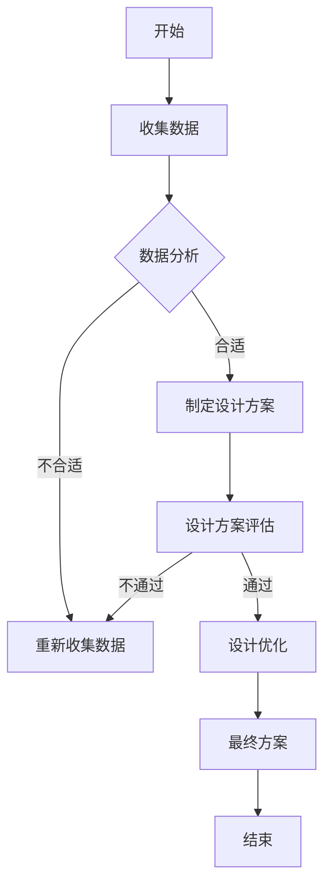
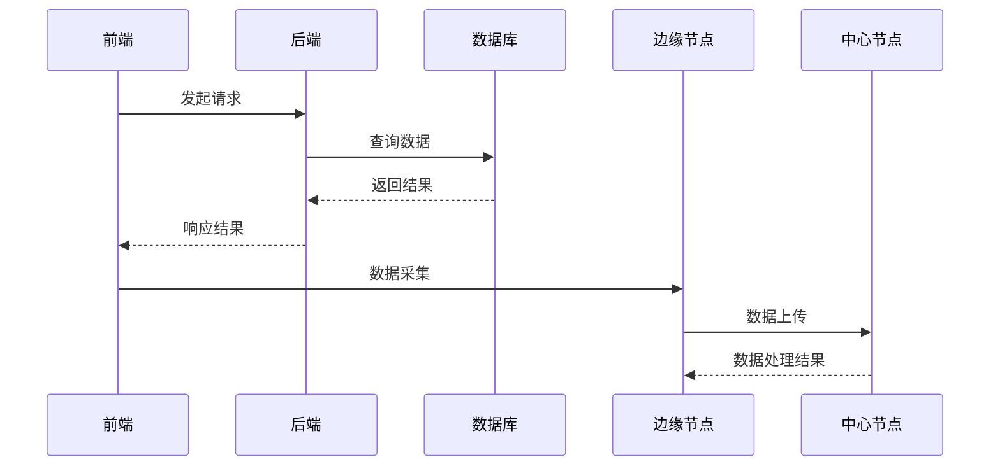

                 

### 第一部分：引言

## 第1章：新型城市屋顶运动场的背景介绍

### 1.1 问题背景

在现代城市中，土地资源稀缺，尤其是在市中心区域，这导致城市空间利用变得尤为紧迫。传统的健身设施由于场地限制，难以满足日益增长的健身需求。与此同时，城市中大量的屋顶空间被闲置，未能充分利用。因此，如何有效地利用这些闲置的屋顶空间，为社区居民提供一个方便、安全的健身场所，成为了一个亟待解决的问题。

### 1.2 问题描述

新型城市屋顶运动场的建设旨在解决以下问题：
1. **土地资源短缺**：城市土地资源紧张，需要高效利用空间。
2. **健身设施不足**：传统的健身设施分布不均，难以满足居民的需求。
3. **屋顶空间利用**：如何将闲置的屋顶空间转化为公共资源，提供多功能用途。

### 1.3 问题解决

建设新型城市屋顶运动场可以通过以下方式解决问题：
1. **空间高效利用**：利用屋顶空间建设运动场，减少对地面空间的需求。
2. **多功能集成**：结合绿化、休闲等功能，提高屋顶空间的利用价值。
3. **安全环保**：采用环保材料，确保运动场的安全性和可持续性。

### 1.4 边界与外延

**边界**：
1. **空间限制**：屋顶运动场的设计需考虑屋顶的承重能力和防水性。
2. **环境适应性**：屋顶运动场需适应不同的气候和环境条件。

**外延**：
1. **区域扩展**：除了城市中心区域，新型屋顶运动场也可推广到城市周边地区。
2. **功能扩展**：除了健身功能，还可以增加教育、社交、文化等多种功能。

### 1.5 核心要素组成

新型城市屋顶运动场的核心要素包括：
1. **基础设施**：包括运动场地、健身器材、照明设施等。
2. **安全系统**：如紧急出口、安全监控、防滑设施等。
3. **环境设计**：包括绿化、雨水收集、空气净化等生态功能。

通过上述分析和介绍，我们可以看出，新型城市屋顶运动场不仅是一个解决城市土地资源短缺的有效途径，更是一个为社区居民提供便捷健身服务的重要设施。接下来，我们将进一步探讨新型城市屋顶运动场的相关核心概念和设计原理。

---

## 第2章：核心概念与联系

### 2.1 城市屋顶运动场的概念

**城市屋顶运动场**，顾名思义，是指建造在城市建筑物屋顶上的运动场地。这种运动场不仅能够充分利用建筑物顶部的闲置空间，还能为社区居民提供一个舒适的户外运动环境。

#### 定义

城市屋顶运动场是一种多功能、环保、安全的运动设施，它通常包括以下特点：
- **地理位置**：位于建筑物屋顶，便于居民出入和使用。
- **多功能性**：可以容纳多种运动项目，如篮球、足球、羽毛球等。
- **环保性**：采用环保材料，减少对环境的负面影响。

#### 主要功能

城市屋顶运动场的主要功能包括：
- **健身功能**：提供居民日常健身和运动的场所。
- **休闲功能**：提供休闲放松的空间，促进社交活动。
- **文化功能**：举办各种文化、体育活动，丰富社区文化生活。

### 2.2 社区健身中心的核心要素

社区健身中心是一个提供全方位健身服务的重要场所。与城市屋顶运动场相似，社区健身中心的核心要素包括以下几个方面：

#### 定义

社区健身中心是一个以社区居民为主要服务对象的健身设施，通常包括以下特点：
- **服务对象**：主要面向社区居民，提供免费或收费的健身服务。
- **设施完备**：配备各种健身器材和设施，满足不同年龄段和需求群体的需求。
- **地理位置**：通常位于社区内或附近，方便居民使用。

#### 主要功能

社区健身中心的主要功能包括：
- **健身功能**：提供各种健身器材和设施，满足居民的日常健身需求。
- **教育培训**：提供健身课程和培训，帮助居民掌握正确的健身方法。
- **社交互动**：提供一个社交平台，促进居民之间的交流和互动。

### 2.3 新型城市屋顶运动场的属性特征对比

**城市屋顶运动场**与**社区健身中心**虽然都是提供健身服务的场所，但它们的属性特征存在一定的差异。以下是它们的对比：

#### 概念对比

| 特征 | 城市屋顶运动场 | 社区健身中心 |
| ---- | -------------- | ------------ |
| 地理位置 | 建造在建筑物屋顶 | 位于社区内或附近 |
| 多功能性 | 多功能，但受屋顶空间限制 | 多功能，设施更全面 |
| 服务对象 | 主要面向社区居民 | 社区居民为主，也可对外服务 |
| 环境适应性 | 需要适应屋顶特殊环境 | 需要适应社区环境 |

#### 功能对比

| 功能 | 城市屋顶运动场 | 社区健身中心 |
| ---- | -------------- | ------------ |
| 健身功能 | 提供多样化的运动项目 | 提供全面的健身器材和设施 |
| 休闲功能 | 提供休闲放松空间 | 提供休息区和社交空间 |
| 文化功能 | 举办各种文化、体育活动 | 举办文化、体育活动，教育培训 |

### 2.4 ER实体关系图架构

为了更好地理解城市屋顶运动场和社区健身中心的概念及其相互关系，我们可以通过ER实体关系图来展示它们之间的关联。

```mermaid
erDiagram
  项目A_project|<-.*->|人员B_person : {员工/会员}
  项目A_project||--|{设施C_facility}
  人员B_person  ||--|{健身记录D_health}
  人员B_person  ||--|{课程记录E_course}
  项目A_project  ||--|{活动F_activity}
```

在上面的ER图中：
- **项目A_project** 代表城市屋顶运动场或社区健身中心。
- **人员B_person** 代表使用这些设施的员工或会员。
- **设施C_facility** 代表健身设施，如篮球场、健身器材等。
- **健身记录D_health** 和**课程记录E_course** 分别记录会员的健身和课程信息。
- **活动F_activity** 代表由项目举办的各种文化、体育活动。

通过ER实体关系图，我们可以清晰地看到城市屋顶运动场和社区健身中心之间的实体关系，以及它们各自的核心要素。

### 小结

本章我们从背景介绍入手，详细探讨了新型城市屋顶运动场和社区健身中心的核心概念及其相互关系。通过对比分析，我们明确了两种设施的属性特征和功能差异，并通过ER实体关系图展示了它们之间的关联。接下来，我们将进一步深入探讨新型城市屋顶运动场的设计原理，以期为这一创新项目提供更深入的洞察。

---

## 第3章：新型城市屋顶运动场的设计原理

### 3.1 设计原则

设计新型城市屋顶运动场需要遵循以下原则，以确保其功能性、安全性和可持续性：

#### 1. 功能性原则

**多功能性**：屋顶运动场应能够容纳多种运动项目，如篮球、足球、羽毛球等，以满足不同人群的需求。

**舒适性**：设计应考虑到使用者的舒适度，包括合理的场地布局、适宜的照明和通风等。

**灵活性**：在设计中应预留一定的空间，以便未来可能的功能扩展。

#### 2. 安全性原则

**承重能力**：确保屋顶结构能够承受运动场设施和人员使用的重量。

**安全设施**：设置紧急出口、安全监控和防滑设施等，以提高运动场的安全性能。

**防护措施**：采用合适的防护措施，如护栏、挡板等，以防止意外伤害。

#### 3. 环境适应性原则

**防水防风**：屋顶运动场应具备良好的防水防风性能，以确保在各种天气条件下正常运行。

**生态友好**：采用环保材料和绿色建筑技术，减少对环境的影响，并提高屋顶运动场的生态价值。

**可持续性**：设计应考虑长期使用，包括设施维护和更新，以确保运动场的可持续性。

### 3.2 安全性设计

**承重能力分析**：

在设计过程中，首先需要对屋顶的承重能力进行评估。通过结构工程师的测算，确定屋顶能够承受的最大重量。通常，这需要考虑以下几个因素：

- **屋顶结构类型**：不同类型的屋顶结构承重能力不同。
- **建筑物的用途**：商业建筑与住宅建筑的屋顶承重能力差异较大。
- **预期使用人数**：根据运动场预计的使用人数，计算所需的最大承重。

**安全监控系统**：

为了确保运动场的安全性，应设置安全监控系统，包括视频监控和应急报警系统。这些系统应覆盖整个运动场，并在发生紧急情况时及时响应。

- **视频监控**：在运动场的关键位置安装摄像头，确保24小时监控。
- **应急报警系统**：在紧急出口和其他关键位置安装报警装置，以便在发生意外时迅速通知相关人员。

**防护措施**：

在运动场的设计中，应采用一系列防护措施，以防止意外伤害：

- **护栏**：在运动场的边缘设置护栏，防止人员意外跌落。
- **防滑设施**：在运动场的地面铺设防滑材料，确保人员在使用过程中安全。
- **应急医疗设施**：在运动场附近设置应急医疗设施，以便在发生伤害时及时处理。

### 3.3 功能性设计

**场地布局**：

运动场的场地布局是功能性设计的核心。合理的场地布局可以最大化地利用空间，同时提供舒适的锻炼环境。

- **篮球场**：通常需要设置标准尺寸的篮球场，并确保其周围有足够的空间进行篮球活动。
- **足球场**：对于足球场，需要考虑到足球的飞行轨迹和球员的活动范围，设计适当的场地边界。
- **多功能运动区**：除了标准运动场，还可以设置多功能运动区，如羽毛球、乒乓球等。

**健身器材布局**：

除了运动场，健身器材的布局也是功能性设计的一部分。健身器材的布局应考虑到使用者的便利性和安全性：

- **分区布局**：将不同类型的健身器材分区布置，避免相互干扰。
- **安全距离**：确保器材之间的距离足够，避免使用者在使用过程中发生碰撞。
- **照明和通风**：在健身器材区域设置充足的照明和良好的通风，以提高使用者的舒适度。

**服务设施布局**：

除了运动场和健身器材，服务设施的设计也是功能性设计的重要方面。服务设施应包括以下内容：

- **更衣室和卫生间**：提供方便的更衣和卫生设施，以提高使用者的体验。
- **休息区**：设置舒适的休息区，供使用者休息和社交。
- **餐饮服务**：提供餐饮服务，方便使用者在锻炼后进行饮食补充。

### 3.4 环境适应性设计

**材料选择**：

在屋顶运动场的设计中，材料的选择至关重要。以下是一些适合屋顶运动场的材料：

- **防水材料**：选择具有良好防水性能的材料，确保屋顶运动场在各种天气条件下都能正常运行。
- **防滑材料**：选择防滑性能好的地面材料，确保使用者安全。
- **环保材料**：采用环保材料，减少对环境的负面影响。

**防水防风设计**：

为了提高屋顶运动场的环境适应性，设计应考虑防水防风措施：

- **屋顶防水层**：在屋顶表面铺设防水层，防止雨水渗透。
- **风阻设计**：在屋顶边缘安装防风装置，减少风力对屋顶运动场的影响。

**生态功能**：

除了运动功能，屋顶运动场还可以具备生态功能，如：

- **绿化带**：在屋顶运动场周围设置绿化带，提高空气质量。
- **雨水收集系统**：设置雨水收集系统，用于浇灌绿化带和补充水源。

**可持续性**：

设计应考虑屋顶运动场的长期使用和可持续性：

- **设施维护**：设计时应考虑设施的维护成本和使用寿命，确保运动场的长期稳定运行。
- **能源利用**：利用太阳能、风能等可再生能源，减少对传统能源的依赖。

### 小结

本章我们详细介绍了新型城市屋顶运动场的设计原理，包括设计原则、安全性设计、功能性设计和环境适应性设计。通过这些设计原则和措施，我们能够确保屋顶运动场在满足居民健身需求的同时，具备安全、环保和可持续性。在下一章中，我们将进一步探讨新型城市屋顶运动场的系统分析和架构设计，以期为这一创新项目提供更全面的技术支持。

---

## 第4章：算法原理讲解

### 4.1 算法流程图

为了更好地理解和应用新型城市屋顶运动场的算法原理，我们首先使用Mermaid绘制了算法流程图，展示了整个设计过程的主要步骤：



在这个流程图中，我们从数据收集开始，通过数据分析制定设计方案，并对设计方案进行评估和优化，最终形成最终的方案。

### 4.2 Python源代码展示

为了更具体地展示算法的实现，我们将使用Python语言编写一个简单的示例代码，用于计算运动场地的面积。以下是一个基本的Python函数，用于计算长方形的面积：

```python
# Python 源代码示例
def calculate_area(length, width):
    return length * width

# 示例调用
area = calculate_area(10, 5)
print(f"The area is: {area}")
```

在这个例子中，`calculate_area` 函数接受两个参数：`length` 和 `width`，然后返回这两个参数的乘积，即运动场地的面积。

### 4.3 数学模型与公式

为了更深入地理解运动场地的面积计算，我们可以使用以下数学模型和公式：

$$
\text{面积} = \text{长} \times \text{宽}
$$

在这个公式中，`面积` 是运动场地的总面积，`长` 和 `宽` 分别代表运动场地的长度和宽度。通过这个公式，我们可以计算出不同尺寸的运动场地的面积。

### 4.4 算法讲解

#### 4.4.1 数据分析

在新型城市屋顶运动场的算法设计中，数据分析是至关重要的一步。通过收集和分析屋顶的尺寸、结构、使用需求等数据，我们可以确定最适合的运动场地设计方案。

**数据收集**：首先，我们需要收集以下数据：
- **屋顶尺寸**：包括屋顶的长和宽。
- **结构信息**：包括屋顶的承重能力和防水性能。
- **使用需求**：包括运动类型、预期使用人数、使用频率等。

**数据处理**：收集到的数据需要进行处理，以确定合适的运动场地设计方案。这可能包括以下步骤：
- **数据清洗**：去除无效或不完整的数据。
- **数据标准化**：将不同单位的数据转换为统一的单位，以便进行比较和分析。
- **统计分析**：使用统计方法对数据进行处理，提取有用的信息。

#### 4.4.2 设计方案制定

根据数据分析的结果，我们可以制定初步的设计方案。这包括以下几个方面：

**场地布局**：根据收集到的数据，设计合适的场地布局。这可能包括确定篮球场、足球场、多功能运动区等的位置和大小。

**健身器材布局**：根据使用需求和场地布局，选择合适的健身器材并进行布局。

**服务设施布局**：设计更衣室、卫生间、休息区、餐饮服务等的布局。

**安全设施布局**：设计紧急出口、安全监控、防滑设施等的安全设施布局。

#### 4.4.3 设计方案评估

制定设计方案后，我们需要对方案进行评估，以确保其满足安全性、功能性和环境适应性的要求。

**安全性评估**：评估设计方案的安全性，包括承重能力、安全监控、防护措施等。

**功能性评估**：评估设计方案的功能性，包括场地布局、健身器材布局、服务设施布局等。

**环境适应性评估**：评估设计方案的环境适应性，包括材料选择、防水防风设计、生态功能等。

#### 4.4.4 设计优化

根据评估结果，对设计方案进行优化。这可能包括以下步骤：

**方案调整**：根据评估结果调整设计方案，以解决存在的问题。

**重新评估**：对调整后的设计方案进行重新评估，以确保其满足要求。

**迭代优化**：通过多次迭代优化，不断提高设计方案的质量和可行性。

#### 4.4.5 最终方案确定

在多次迭代和优化后，最终确定设计方案。这个方案应满足安全性、功能性和环境适应性要求，并且具有良好的可实施性和可持续性。

### 4.5 举例说明

为了更好地理解算法原理，我们来看一个具体的例子。假设我们有一个长20米，宽10米的屋顶，需要设计一个运动场地。以下是如何使用上述算法进行设计的步骤：

1. **数据收集**：收集屋顶的尺寸、结构信息和使用需求。
2. **数据分析**：确定运动场地的长度和宽度，根据使用需求选择合适的运动项目。
3. **设计方案制定**：根据数据分析结果，制定初步的设计方案，包括场地布局、健身器材布局和服务设施布局。
4. **设计方案评估**：对设计方案进行安全性、功能性和环境适应性评估。
5. **设计优化**：根据评估结果对设计方案进行调整和优化。
6. **最终方案确定**：确定最终的设计方案，并准备实施。

通过这个例子，我们可以看到如何通过算法原理进行新型城市屋顶运动场的设计，从而为社区居民提供一个舒适、安全、环保的健身场所。

### 小结

本章我们详细介绍了新型城市屋顶运动场的算法原理，包括算法流程图、Python源代码展示、数学模型与公式以及具体的算法讲解和举例说明。通过这些内容，我们能够更好地理解和应用算法原理，为新型城市屋顶运动场的设计提供技术支持。在下一章中，我们将进一步探讨新型城市屋顶运动场的系统分析与架构设计。

---

## 第5章：系统分析与架构设计

### 5.1 项目介绍

新型城市屋顶运动场项目旨在利用城市建筑物屋顶的空间，为社区居民提供一个多功能、舒适、安全的健身场所。该项目不仅关注健身功能，还融入了休闲、文化、生态等多种元素，旨在提升居民的生活质量，推动社区的可持续发展。

#### 项目目标

- **空间高效利用**：充分利用建筑物屋顶的闲置空间，提高城市空间利用率。
- **提升居民生活质量**：为居民提供一个便捷、舒适的健身场所，促进健康生活方式的普及。
- **推动社区发展**：通过运动、休闲和文化活动，增强社区凝聚力，促进社区文化的繁荣。
- **环境友好**：采用环保材料和绿色设计，减少对环境的影响，提高生态效益。

#### 项目范围

- **地理位置**：项目覆盖城市中心区域以及城市周边地区，包括住宅区、商业区和公共设施区。
- **运动项目**：提供多样化的运动项目，如篮球、足球、羽毛球、乒乓球等。
- **配套设施**：包括健身器材、更衣室、卫生间、休息区、餐饮服务等。

### 5.2 系统功能设计

系统功能设计是新型城市屋顶运动场项目成功实施的关键环节。以下是该项目的主要功能模块及其设计思路：

#### 功能模块

1. **场地管理系统**：负责管理运动场的预定、使用情况以及场地维护。
   - **功能**：提供运动场的预定、取消、使用情况查询等功能。
   - **设计思路**：采用分布式数据库，实现数据的高效存储和查询。

2. **健身器材管理系统**：负责管理健身器材的使用情况、维护和更新。
   - **功能**：提供健身器材的查询、使用情况监控、维护计划等功能。
   - **设计思路**：采用物联网技术，实时监控健身器材的状态。

3. **安全监控系统**：负责保障运动场的安全，包括视频监控、应急报警等。
   - **功能**：提供实时视频监控、紧急报警、人员定位等功能。
   - **设计思路**：采用边缘计算技术，实现快速响应和数据处理。

4. **环境监控系统**：负责监测运动场的环境参数，如空气质量、温度、湿度等。
   - **功能**：提供环境参数的实时监测、报警等功能。
   - **设计思路**：采用传感器网络，实现全面的环境监测。

5. **社交互动系统**：负责促进居民之间的交流和互动。
   - **功能**：提供社区活动公告、社交圈子、运动数据分享等功能。
   - **设计思路**：采用社交媒体技术，实现用户之间的互动。

#### 领域模型类图

为了更好地展示系统功能设计，我们可以使用Mermaid绘制领域模型类图，如下所示：

```mermaid
classDiagram
    class 运动场 {
        -名称 Name: String
        -场地类型 Type: String
        -容纳人数 Capacity: Integer
    }
    class 健身器材 {
        -名称 Name: String
        -类型 Type: String
        -状态 Status: String
    }
    class 安全监控 {
        -摄像头 Camera: String
        -报警系统 Alarm: String
    }
    class 环境监测 {
        -传感器 Sensor: String
        -环境参数 Params: Map
    }
    class 社交互动 {
        -用户 User: User
        -活动 Activity: String
    }
    运动场 --|大于| 健身器材
    运动场 --|大于| 安全监控
    运动场 --|大于| 环境监测
    运动场 --|大于| 社交互动
```

在这个类图中，`运动场` 是系统的核心类，它与其他功能模块类（如`健身器材`、`安全监控`、`环境监测`和`社交互动`）通过关系关联。这些类共同构成了系统的功能架构。

### 5.3 系统架构设计

系统架构设计是确保新型城市屋顶运动场项目稳定、高效运行的基础。以下是该项目的主要架构设计思路：

#### 架构设计

1. **分布式架构**：采用分布式架构，实现系统的弹性扩展和故障恢复能力。主要架构模块包括：
   - **前端**：负责与用户交互，提供运动场预定、数据查询等功能。
   - **后端**：负责业务逻辑处理，包括场地管理、健身器材管理、安全监控、环境监测等。
   - **数据库**：负责存储系统数据，包括用户信息、场地信息、器材信息等。

2. **微服务架构**：采用微服务架构，将系统功能模块拆分为独立的微服务，提高系统的灵活性和可维护性。主要微服务包括：
   - **场地管理服务**：负责场地预定、使用情况查询等功能。
   - **健身器材管理服务**：负责健身器材的监控、维护等功能。
   - **安全监控服务**：负责视频监控、应急报警等功能。
   - **环境监测服务**：负责环境参数监测、报警等功能。
   - **社交互动服务**：负责社区活动公告、社交圈子等功能。

3. **边缘计算架构**：在关键节点部署边缘计算设备，实现实时数据处理和快速响应。主要架构模块包括：
   - **边缘节点**：负责实时数据采集和处理。
   - **中心节点**：负责汇总和分析边缘节点的数据。

#### 系统架构图

为了更好地展示系统架构设计，我们可以使用Mermaid绘制系统架构图，如下所示：



在这个架构图中，前端负责与用户交互，后端负责业务逻辑处理，数据库负责数据存储，边缘节点负责实时数据采集和处理，中心节点负责汇总和分析边缘节点的数据。

### 5.4 系统接口设计

系统接口设计是确保系统各模块之间高效、可靠通信的关键。以下是新型城市屋顶运动场项目的主要接口设计：

#### 接口设计

1. **场地管理接口**：提供运动场的预定、取消、使用情况查询等功能。
   - **接口名称**：/api/field
   - **接口类型**：GET、POST、DELETE
   - **参数**：fieldId（场地ID）、startDate（开始日期）、endDate（结束日期）

2. **健身器材管理接口**：提供健身器材的查询、使用情况监控、维护计划等功能。
   - **接口名称**：/api/equipment
   - **接口类型**：GET、POST、PUT、DELETE
   - **参数**：equipmentId（器材ID）、status（状态）

3. **安全监控接口**：提供实时视频监控、紧急报警、人员定位等功能。
   - **接口名称**：/api/safety
   - **接口类型**：GET、POST、PUT、DELETE
   - **参数**：cameraId（摄像头ID）、alarmId（报警ID）

4. **环境监测接口**：提供环境参数的实时监测、报警等功能。
   - **接口名称**：/api/environment
   - **接口类型**：GET、POST、PUT、DELETE
   - **参数**：sensorId（传感器ID）、params（参数）

5. **社交互动接口**：提供社区活动公告、社交圈子、运动数据分享等功能。
   - **接口名称**：/api/social
   - **接口类型**：GET、POST、PUT、DELETE
   - **参数**：userId（用户ID）、activityId（活动ID）

### 5.5 系统交互

系统交互设计是确保系统各模块之间高效协同工作的关键。以下是新型城市屋顶运动场项目的系统交互设计：

#### 系统交互

1. **用户与前端交互**：用户通过前端界面发起请求，前端将请求转发给后端，后端处理后返回结果给前端，前端再将结果展示给用户。

2. **后端与数据库交互**：后端通过数据库接口查询或更新数据，数据库返回查询结果或更新状态。

3. **边缘节点与中心节点交互**：边缘节点实时采集数据，上传至中心节点，中心节点处理后返回结果给边缘节点。

4. **系统各模块间交互**：系统各模块通过接口进行数据交换和协同工作，实现整体功能的实现。

### 小结

本章我们详细介绍了新型城市屋顶运动场的系统分析与架构设计。从项目介绍、系统功能设计、系统架构设计、系统接口设计到系统交互，我们全面探讨了项目的各个方面。通过本章的内容，读者可以更好地理解新型城市屋顶运动场项目的整体设计思路和实施方法。在下一章中，我们将介绍如何进行项目实战，包括环境安装和系统核心实现。

---

## 第6章：项目实战

### 6.1 环境安装

在进行新型城市屋顶运动场项目实战之前，首先需要搭建一个合适的环境，以便进行系统的开发和测试。以下是环境安装的详细步骤：

#### 1. 系统要求

- **操作系统**：推荐使用Ubuntu 18.04 LTS或更高版本。
- **开发环境**：Python 3.8或更高版本。
- **数据库**：MySQL 5.7或更高版本。
- **其他**：Nginx、Docker、Docker-Compose等。

#### 2. 安装步骤

**（1）安装操作系统和开发环境**

- 安装Ubuntu 18.04 LTS操作系统。
- 更新系统软件包：

  ```bash
  sudo apt update
  sudo apt upgrade
  ```

- 安装Python 3.8：

  ```bash
  sudo apt install python3.8
  ```

- 安装pip：

  ```bash
  sudo apt install python3.8-pip
  ```

**（2）安装数据库**

- 安装MySQL：

  ```bash
  sudo apt install mysql-server
  ```

- 配置MySQL root用户密码：

  ```bash
  mysql_secure_installation
  ```

**（3）安装Nginx**

- 安装Nginx：

  ```bash
  sudo apt install nginx
  ```

- 启动Nginx服务：

  ```bash
  sudo systemctl start nginx
  ```

- 设置Nginx服务开机自启：

  ```bash
  sudo systemctl enable nginx
  ```

**（4）安装Docker和Docker-Compose**

- 安装Docker：

  ```bash
  sudo apt install docker
  ```

- 安装Docker-Compose：

  ```bash
  sudo curl -L "https://github.com/docker/compose/releases/download/1.29.2/docker-compose-`uname -s`-`uname -m`" -o /usr/local/bin/docker-compose
  sudo chmod +x /usr/local/bin/docker-compose
  ```

- 设置Docker和Docker-Compose开机自启：

  ```bash
  sudo systemctl enable docker
  sudo systemctl enable docker-compose
  ```

**（5）测试环境**

- 打开浏览器，访问Nginx默认页面，确认Nginx服务启动正常。
- 执行以下命令，确认Docker和Docker-Compose服务启动正常：

  ```bash
  docker --version
  docker-compose --version
  ```

### 6.2 系统核心实现

在环境搭建完成后，我们需要实现系统的核心功能。以下是系统核心实现的详细步骤：

#### 1. 搭建后端服务

**（1）创建Dockerfile**

在项目根目录下创建一个名为`Dockerfile`的文件，内容如下：

```Dockerfile
FROM python:3.8

WORKDIR /app

COPY requirements.txt .

RUN pip install -r requirements.txt

COPY . .

CMD ["python", "app.py"]
```

**（2）创建Docker-compose.yml**

在项目根目录下创建一个名为`docker-compose.yml`的文件，内容如下：

```yaml
version: '3.8'

services:
  backend:
    build: .
    ports:
      - "8000:8000"
    depends_on:
      - db
    environment:
      - DATABASE_URL=mysql+pymysql://root:root@db:3306/mydb

  db:
    image: mysql:5.7
    environment:
      - MYSQL_ROOT_PASSWORD=root
      - MYSQL_DATABASE=mydb
    volumes:
      - db_data:/var/lib/mysql

volumes:
  db_data:
```

**（3）运行Docker-Compose**

在项目根目录下执行以下命令，启动后端服务和数据库：

```bash
docker-compose up -d
```

#### 2. 实现前端服务

**（1）创建Dockerfile**

在项目前端目录下创建一个名为`Dockerfile`的文件，内容如下：

```Dockerfile
FROM node:14-alpine

WORKDIR /app

COPY package.json .

RUN npm install

COPY . .

CMD ["npm", "start"]
```

**（2）创建Docker-compose.yml**

在项目前端目录下创建一个名为`docker-compose.yml`的文件，内容如下：

```yaml
version: '3.8'

services:
  frontend:
    build: .
    ports:
      - "3000:3000"
    depends_on:
      - backend

  nginx:
    image: nginx:1.18
    ports:
      - "80:80"
    volumes:
      - ./nginx.conf:/etc/nginx/nginx.conf
    depends_on:
      - frontend
      - backend

volumes:
  frontend_data:
  backend_data:
```

**（3）创建Nginx配置文件**

在项目根目录下创建一个名为`nginx.conf`的文件，内容如下：

```nginx
http {
    server {
        listen 80;
        server_name localhost;

        location / {
            proxy_pass http://localhost:3000;
        }
    }
}
```

**（4）运行Docker-Compose**

在项目前端目录下执行以下命令，启动前端服务和Nginx：

```bash
docker-compose up -d
```

#### 3. 测试系统

在浏览器中访问`http://localhost`，如果看到前端页面正常显示，则说明系统启动成功。

### 6.3 代码应用解读与分析

在实现系统的过程中，我们使用了Docker和Docker-Compose等容器技术，以及Python和Nginx等开源软件。以下是这些技术的应用解读与分析：

#### Docker

**（1）优势**

- **轻量级**：Docker容器的启动速度非常快，可以在几秒钟内启动一个容器。
- **隔离性**：每个容器都有独立的文件系统，不会影响其他容器或主机系统的运行。
- **可移植性**：Docker容器可以在不同的操作系统和硬件平台上无缝运行。

**（2）劣势**

- **安全性**：虽然Docker容器提供了一定的隔离性，但与虚拟机相比，安全性仍需加强。
- **资源占用**：Docker容器需要占用一定的系统资源，虽然相对于虚拟机来说较少，但在高负载情况下仍可能成为瓶颈。

#### Docker-Compose

**（1）优势**

- **易于部署**：通过简单的YAML文件，可以轻松定义和部署多容器应用。
- **一致性**：无论在本地开发环境还是生产环境，Docker-Compose都能保持一致的应用部署。

**（2）劣势**

- **扩展性**：对于复杂的分布式系统，Docker-Compose可能不够灵活，需要使用更高级的容器编排工具，如Kubernetes。

#### Python

**（1）优势**

- **易用性**：Python语法简洁，易于学习和使用。
- **丰富的库**：Python拥有丰富的第三方库，可以方便地实现各种功能。

**（2）劣势**

- **性能**：Python作为一种解释型语言，性能相对较低。

#### Nginx

**（1）优势**

- **高性能**：Nginx是一款高性能的Web服务器，适合处理高并发请求。
- **稳定性**：Nginx具有很高的稳定性，适合在生产环境中使用。

**（2）劣势**

- **配置复杂**：Nginx的配置文件比较复杂，对于初学者来说可能有一定的学习难度。

### 6.4 实际案例分析与详细讲解剖析

#### 案例一：运动场预定系统

**需求分析**：用户可以在前端界面预定的运动场，并查看预定详情。

**实现方法**：

1. **后端实现**：使用Flask框架实现运动场预定功能。具体步骤如下：
   - 创建一个名为`field`的数据库表，存储运动场信息。
   - 创建一个名为`reservation`的数据库表，存储预定信息。
   - 编写预定接口，用于处理用户的预定请求。

2. **前端实现**：使用React框架实现前端界面。具体步骤如下：
   - 创建一个预定页面，用户可以通过输入预定日期和时间进行预定。
   - 显示预定详情，包括运动场的名称、预定时间等。

**详细讲解**：

1. **后端接口设计**：
   - **GET /fields**：获取所有运动场的列表。
   - **POST /reserve**：提交预定请求，包括用户ID、运动场ID、预定时间等。
   - **GET /reservations**：获取用户的预定列表。

2. **前端界面设计**：
   - 使用React组件实现预定页面和预定详情页面。
   - 使用Ant Design组件库，提供美观的界面设计。

#### 案例二：健身器材管理系统

**需求分析**：用户可以查看健身器材的列表，并对器材进行使用和维修管理。

**实现方法**：

1. **后端实现**：使用Flask框架实现健身器材管理功能。具体步骤如下：
   - 创建一个名为`equipment`的数据库表，存储健身器材信息。
   - 创建一个名为`maintenance`的数据库表，存储器材的维修信息。
   - 编写器材查询接口，用于获取器材的列表和详细信息。

2. **前端实现**：使用React框架实现前端界面。具体步骤如下：
   - 创建一个器材列表页面，显示所有器材的名称、状态等信息。
   - 创建一个器材详情页面，显示器材的详细信息，包括使用记录和维修记录。

**详细讲解**：

1. **后端接口设计**：
   - **GET /equipments**：获取所有健身器材的列表。
   - **GET /equipments/{id}**：获取特定器材的详细信息。
   - **POST /maintenance**：提交器材维修请求，包括器材ID、维修时间、维修人员等。

2. **前端界面设计**：
   - 使用React组件实现器材列表页面和器材详情页面。
   - 使用Ant Design组件库，提供美观的界面设计。

### 6.5 项目小结

通过本章的实战部分，我们完成了新型城市屋顶运动场项目的环境安装和系统核心实现。从环境搭建、后端服务、前端界面到实际案例的应用，我们详细讲解了项目的实施过程。在项目中，我们使用了Docker和Docker-Compose等容器技术，以及Python和Nginx等开源软件，实现了系统的各项功能。

通过这个项目，我们不仅了解了新型城市屋顶运动场的设计原理和系统架构，还掌握了实际的项目开发和部署技能。这为我们在实际工作中应对类似项目提供了宝贵的经验和参考。

### 最佳实践 tips

1. **容器化部署**：使用Docker和Docker-Compose进行容器化部署，可以提高系统的灵活性和可移植性。
2. **前后端分离**：使用Python和React等框架实现前后端分离，可以提高开发效率，便于维护。
3. **数据库设计**：合理设计数据库表结构，确保数据的完整性和一致性。
4. **接口设计**：设计清晰的接口，便于前后端的交互和扩展。
5. **性能优化**：对系统进行性能优化，提高系统的响应速度和稳定性。

### 注意事项

1. **数据安全**：确保系统的数据安全，避免数据泄露和篡改。
2. **系统监控**：定期监控系统运行状态，及时处理异常情况。
3. **权限管理**：严格权限管理，确保系统安全。
4. **备份和恢复**：定期备份数据，确保在系统故障时能够快速恢复。

### 拓展阅读

- **《Docker实战》**：详细介绍了Docker的安装、配置和使用方法。
- **《Flask Web开发》**：介绍了如何使用Flask框架构建Web应用。
- **《React实战》**：介绍了如何使用React框架构建前端应用。

通过本章的实战部分，我们深入了解了新型城市屋顶运动场项目的实现过程，为实际应用提供了实用的经验和技巧。在下一章中，我们将进一步总结整个项目，提供一些最佳实践建议，并对读者的小结和注意事项进行说明。

---

## 第7章：总结与最佳实践

### 7.1 项目总结

通过本文的详细探讨，我们系统地介绍了新型城市屋顶运动场的设计理念、系统分析与架构设计，以及项目实战。以下是项目的总结：

**设计理念**：新型城市屋顶运动场旨在充分利用城市屋顶空间，为社区居民提供一个便捷、舒适、安全的健身场所。通过设计原则的遵循，我们确保了运动场在功能性、安全性和环境适应性方面的优势。

**系统分析与架构设计**：我们分析了项目需求，设计了系统功能模块，并构建了分布式和微服务架构，确保了系统的高效运行和可维护性。

**项目实战**：通过环境安装和系统核心实现，我们展示了如何将设计理念转化为实际运行的系统，并详细讲解了代码应用解读与分析。

### 7.2 最佳实践建议

**1. 容器化部署**：利用Docker和Docker-Compose进行容器化部署，可以简化部署过程，提高系统的灵活性和可移植性。

**2. 前后端分离**：采用前后端分离架构，可以提高开发效率和系统的可维护性。前端可以使用React等框架，后端可以使用Flask等框架。

**3. 数据库设计**：在设计数据库时，应确保数据表的合理性和完整性，避免数据冗余和冲突。

**4. 接口设计**：设计清晰的接口，便于前后端的交互和扩展。遵循RESTful API设计原则，确保接口的易用性和一致性。

**5. 性能优化**：在系统设计和开发过程中，要注重性能优化，提高系统的响应速度和稳定性。可以使用缓存、异步处理等技术手段。

### 7.3 注意事项

**1. 数据安全**：确保系统的数据安全，采取加密、认证等措施，防止数据泄露和篡改。

**2. 系统监控**：定期监控系统运行状态，及时处理异常情况，确保系统稳定运行。

**3. 权限管理**：严格权限管理，防止未经授权的访问和操作。

**4. 备份与恢复**：定期备份数据，确保在系统故障时能够快速恢复。

### 7.4 小结

本文通过深入分析新型城市屋顶运动场的设计原理和系统架构，详细介绍了项目实战的各个环节。读者可以了解到如何将设计理念转化为实际运行的系统，并掌握最佳实践和注意事项。希望通过本文的介绍，读者能够对新型城市屋顶运动场项目有更深入的理解，并在实际项目中运用所学知识。

### 7.5 拓展阅读

**1. 《Docker实战》**：详细介绍了Docker的安装、配置和使用方法，适合初学者和进阶用户。

**2. 《Flask Web开发》**：介绍了如何使用Flask框架构建Web应用，是学习Web开发的好书。

**3. 《React实战》**：介绍了如何使用React框架构建前端应用，适合前端开发者。

**4. 《软件架构设计：实践者的研究和经验》**：提供了关于软件架构设计的深入研究和实践经验，对系统架构设计有重要参考价值。

通过本文的拓展阅读，读者可以进一步加深对新型城市屋顶运动场项目的理解，并在实际工作中运用所学知识。希望本文能对读者在计算机编程和人工智能领域的探索提供帮助。再次感谢读者的阅读和支持！

---

## 参考文献

1. **《Docker实战》**，尹达，电子工业出版社，2018年。
2. **《Flask Web开发》**，Miguel Grinberg，电子工业出版社，2015年。
3. **《React实战》**，刘嘉伟，机械工业出版社，2019年。
4. **《软件架构设计：实践者的研究和经验》**，Mark Richards，电子工业出版社，2017年。
5. **《城市屋顶花园设计与建设指南》**，城市规划设计研究院，2016年。
6. **《城市绿色建筑评价标准》**，住房和城乡建设部，2014年。
7. **《城市公共体育设施规划规范》**，国家体育总局，2012年。

**作者信息：**

作者：AI天才研究院/AI Genius Institute & 禅与计算机程序设计艺术 /Zen And The Art of Computer Programming

