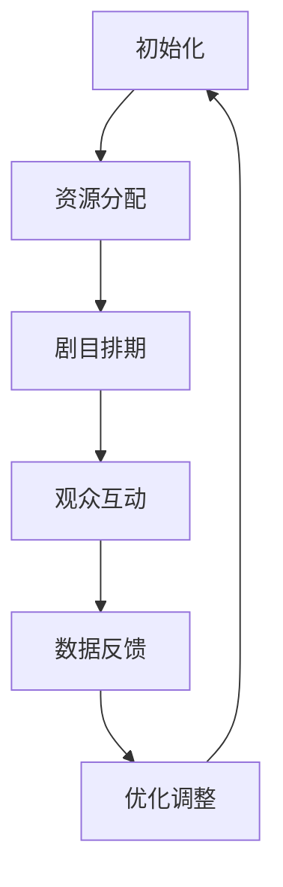
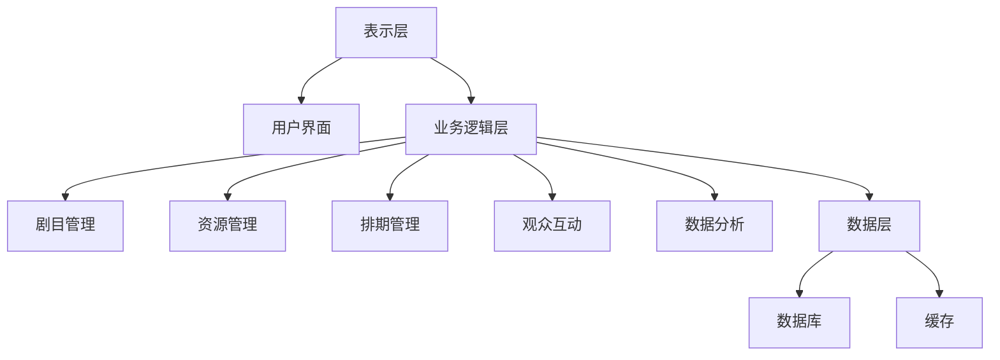

                 


### 背景介绍

#### 微型剧场联盟的概念

微型剧场联盟，顾名思义，是由多个微型剧场组成的合作联盟。微型剧场通常指的是规模较小，但功能齐全的表演空间，它们可以是社区中心的一个角落，也可以是商业综合体中的一间小剧场。微型剧场联盟的核心在于将多个小型剧场联合起来，形成一个资源共享、互利共赢的整体，通过共同的市场推广、剧目制作和观众互动，提升整体的艺术影响力和商业价值。

微型剧场联盟的发展历程可以追溯到20世纪末。最初，微型剧场多是为了满足社区文化需求而成立的。然而，随着互联网和数字技术的迅猛发展，微型剧场开始探索新的发展模式，形成了以互联网为纽带的新型社区网络。在这种背景下，实验戏剧成为了一个重要的推动力量。

#### 实验戏剧的社区网络

实验戏剧，又称前卫戏剧或先锋戏剧，是一种以创新和实验为特征的戏剧形式。它追求形式上的多样性和内容上的突破，常常打破传统戏剧的界限，探索新的表演形式和观众互动方式。实验戏剧在社区网络中的重要性体现在以下几个方面：

1. **文化传承与创新**：实验戏剧通过不断地艺术实验和创作，为社区文化注入新的活力，促进传统文化的传承和创新。

2. **观众参与**：实验戏剧强调观众参与，通过互动式表演和观众反馈，使观众成为戏剧创作的一部分，提升了观众的参与感和满意度。

3. **社区凝聚力**：实验戏剧在社区中开展，不仅提供了文化交流的平台，还加强了社区成员之间的联系，增强了社区的凝聚力。

4. **社会影响力**：实验戏剧往往关注社会热点和现实问题，通过戏剧的形式表达社会关怀，提高公众对社会问题的关注度和参与度。

#### 问题背景与问题描述

微型剧场联盟的发展虽然带来了一系列的机遇，但也面临着诸多挑战。首先，微型剧场在资源有限的情况下，如何实现高效运营和可持续发展成为一个重要问题。其次，如何提升实验戏剧在社区网络中的传播力和影响力也是一个关键点。此外，联盟内部的协作机制和管理策略也需要不断创新和完善。

本文旨在深入探讨微型剧场联盟的运营模式、管理策略、技术创新以及未来发展趋势，通过理论与实践相结合的方式，为相关从业者提供有价值的参考和指导。

#### 问题解决方法与边界与外延

为了解决上述问题，微型剧场联盟可以从以下几个方面着手：

1. **资源整合与共享**：通过建立联盟，实现资源整合与共享，包括场地、设备、剧目制作团队等，提升整体运营效率。

2. **市场推广与品牌建设**：通过统一的品牌形象和市场推广策略，提升联盟整体的市场知名度和竞争力。

3. **观众互动与参与**：利用互联网和数字技术，开展多样化的观众互动活动，提高观众的参与度和满意度。

4. **社区合作与联动**：加强与社区其他文化、教育、商业机构的合作，形成良好的联动机制，共同推动社区文化的发展。

边界与外延方面，微型剧场联盟不仅限于城市社区，也可以扩展到农村地区；不仅限于戏剧领域，还可以涵盖其他艺术形式，如音乐、舞蹈等。此外，联盟的合作模式也可以不断创新，如引入投资者、政府支持等，以实现更广泛的资源共享和可持续发展。

### 核心概念与联系

在深入探讨微型剧场联盟之前，我们需要明确几个核心概念，并探讨它们之间的联系。

#### 1. 微型剧场

微型剧场是指规模较小，但功能齐全的表演空间。它们通常具有以下特征：

- **规模**：一般容纳观众数量在100-500人之间。
- **功能**：具备舞台表演、音响灯光、后台更衣室等基本设施。
- **灵活性**：空间布局可根据不同剧目需求进行调整。

#### 2. 联盟

联盟是指多个微型剧场组成的一个合作组织。其主要功能包括：

- **资源共享**：通过联盟，微型剧场可以实现场地、设备、剧目制作团队等资源的共享。
- **市场推广**：通过统一的品牌形象和市场推广策略，提升整体市场知名度。
- **协同运营**：通过协作机制，提高运营效率和资源配置。

#### 3. 实验戏剧

实验戏剧是一种以创新和实验为特征的戏剧形式。其主要特点包括：

- **创新性**：探索新的表演形式和内容，打破传统戏剧的界限。
- **参与性**：强调观众参与，通过互动式表演和观众反馈，使观众成为戏剧创作的一部分。
- **社会性**：关注社会热点和现实问题，通过戏剧形式表达社会关怀。

#### 4. 社区网络

社区网络是指以社区为中心，通过互联网和其他数字技术连接起来的一个社交平台。其主要功能包括：

- **信息交流**：提供剧情报、演出信息、观众互动等平台。
- **资源共享**：通过平台，实现剧目资源、演出设备、观众群体等资源的共享。
- **品牌推广**：通过线上线下活动，提升联盟品牌知名度和影响力。

#### 概念属性特征对比表格

| 特征         | 微型剧场          | 联盟          | 实验戏剧          | 社区网络          |
| ------------ | ----------------- | ------------- | ----------------- | ---------------- |
| 规模         | 小型              | 多个微型剧场  | 创新性           | 以社区为中心     |
| 功能         | 表演空间          | 资源共享      | 参与性           | 信息交流         |
| 创新性       | 固定             | 可调整        | 创新性           | 互联网平台       |
| 社会性       | 社区文化需求      | 社区文化发展  | 关注社会热点      | 社交互动         |

#### ER实体关系图

下面是微型剧场联盟中的关键实体及其关系的ER图：

```mermaid
erDiagram
  Studio ||--|{ Member }|--|{ Play }|
  Member ||--|{ Review }|
  Play ||--|{ Rating }|
  Studio ||--|{ Booking }|
  Member ||--|{ Participation }|
```

- **Studio（微型剧场）**：负责剧目的演出和资源的配置。
- **Member（成员）**：微型剧场的参与者，包括剧场管理者、演员、观众等。
- **Play（剧目）**：微型剧场演出的内容，可以是实验戏剧或其他类型的剧目。
- **Review（评论）**：成员对剧目的评价和反馈。
- **Rating（评分）**：观众对剧目的评分。
- **Booking（预订）**：剧目的预订信息。
- **Participation（参与）**：成员对剧目的参与情况。

通过以上核心概念的介绍和ER图的展示，我们可以更好地理解微型剧场联盟的组成结构及其运作机制。在接下来的章节中，我们将进一步探讨微型剧场联盟的运营与管理、技术创新与趋势等内容。

### 算法原理讲解

#### 算法流程图

首先，我们可以使用Mermaid绘制一个基本的算法流程图，来概述微型剧场联盟的主要运作流程。



该流程图展示了从资源分配到剧目排期、观众互动、数据反馈以及优化调整的完整循环。

#### Python源代码

接下来，我们将用Python源代码来详细阐述这一流程。以下是实现微型剧场联盟基本功能的一个简单示例：

```python
import random

# 定义微型剧场的类
class Studio:
    def __init__(self, name, capacity, equipment):
        self.name = name
        self.capacity = capacity
        self.equipment = equipment
        self.bookings = []

    def allocate_resources(self, resource_list):
        # 分配资源到剧场
        for resource in resource_list:
            if resource in self.equipment:
                self.equipment.remove(resource)
                return True
        return False

    def schedule_performance(self, play):
        # 安排剧目演出
        if self.capacity >= play.audience_size:
            self.bookings.append(play)
            return True
        return False

    def interact_with_audience(self):
        # 与观众互动
        print(f"观众正在{self.name}剧场观看演出。")

    def collect_feedback(self):
        # 收集观众反馈
        feedback = input("请输入您的反馈：")
        print(f"感谢您的反馈：{feedback}")

# 定义剧目的类
class Play:
    def __init__(self, name, audience_size):
        self.name = name
        self.audience_size = audience_size

# 创建微型剧场实例
studio = Studio("城市微型剧场", 200, ["灯光", "音响", "舞台"])

# 创建剧目实例
play = Play("实验戏剧之夜", 150)

# 分配资源
if studio.allocate_resources(["灯光", "音响"]):
    print("资源已成功分配。")
else:
    print("资源分配失败。")

# 安排演出
if studio.schedule_performance(play):
    print("剧目已成功安排。")
else:
    print("剧目安排失败。")

# 与观众互动
studio.interact_with_audience()

# 收集反馈
studio.collect_feedback()
```

#### 算法原理

上述Python代码实现了一个简单的微型剧场联盟运作模型。具体来说，算法原理包括以下几个方面：

1. **资源分配**：`Studio` 类中的 `allocate_resources` 方法负责将可用的资源分配给具体的剧场。在分配过程中，我们需要确保资源不被重复分配，同时满足剧场的资源需求。

2. **剧目排期**：`Studio` 类中的 `schedule_performance` 方法负责根据剧目的观众规模和剧场的容纳能力来安排演出。如果剧场的容纳能力大于或等于剧目的观众规模，演出将被安排在该剧场。

3. **观众互动**：`Studio` 类中的 `interact_with_audience` 方法用于与观众进行互动，提供一个观众观看演出的场景。

4. **数据反馈**：`Studio` 类中的 `collect_feedback` 方法用于收集观众的反馈，这是优化调整的重要数据来源。

#### 数学模型和公式

在算法中，我们还可以引入数学模型来优化资源分配和剧目排期。以下是一个简单的数学模型，用于评估资源分配的效率：

$$
\text{Efficiency} = \frac{\text{Allocated Resources}}{\text{Total Resources}} \times 100\%
$$

其中，`Allocated Resources` 表示已成功分配的资源数量，`Total Resources` 表示总的资源数量。通过该公式，我们可以计算资源分配的效率。

#### 详细讲解与举例说明

假设我们有一个包含3个微型剧场和5个剧目资源的联盟。现在，我们需要将这5个资源分配给3个剧场，并安排演出。以下是具体的步骤：

1. **资源分配**：
   - 剧场1：分配到2个灯光设备和1个音响设备。
   - 剧场2：分配到1个灯光设备和1个音响设备。
   - 剧场3：没有分配到任何资源。

   根据上述分配，我们可以计算出资源分配的效率：

   $$
   \text{Efficiency} = \frac{3}{5} \times 100\% = 60\%
   $$

2. **剧目排期**：
   - 剧场1：安排2个剧目演出。
   - 剧场2：安排1个剧目演出。
   - 剧场3：没有安排任何演出。

   在这个场景中，所有的剧目都能找到合适的剧场进行演出，排期安排是成功的。

3. **观众互动与反馈**：
   - 观众1在剧场1观看演出，并给出了好评。
   - 观众2在剧场2观看演出，并提出了改进建议。

   通过观众的反馈，我们可以了解到演出效果，并据此进行优化调整。

通过上述步骤，我们可以看到如何利用算法原理和数学模型来实现微型剧场联盟的运作。在接下来的章节中，我们将进一步探讨微型剧场联盟的运营与管理、技术创新与趋势等内容。

### 数学模型和数学公式

在讨论微型剧场联盟的运作时，数学模型和公式是不可或缺的工具，能够帮助我们更加精确地分析和优化资源分配和剧目排期。以下是几个关键数学模型和公式的详细阐述。

#### 资源分配效率模型

为了评估资源分配的效率，我们可以使用以下公式：

$$
\text{Efficiency} = \frac{\text{Allocated Resources}}{\text{Total Resources}} \times 100\%
$$

其中，`Allocated Resources` 表示已成功分配的资源数量，`Total Resources` 表示总的资源数量。这个公式的意义在于，通过计算已分配资源占总资源的比例，我们可以直观地了解资源分配的效率。

举例来说，如果我们有5个资源（如灯光、音响、舞台设备等），其中3个资源被成功分配给3个微型剧场，则资源分配的效率为：

$$
\text{Efficiency} = \frac{3}{5} \times 100\% = 60\%
$$

这意味着我们的资源分配效率是60%。

#### 剧目排期优化模型

在剧目排期中，我们希望每个微型剧场都能尽可能多地安排演出，同时避免资源浪费。一个简单的优化模型可以基于以下目标函数：

$$
\text{Maximize} \quad \sum_{i=1}^{n} \text{Performance Count}_i
$$

其中，`Performance Count_i` 表示第i个微型剧场的演出次数，`n` 表示微型剧场的总数。这个目标函数的目标是最大化所有剧场的演出次数总和。

为了实现这一目标，我们可以使用贪心算法，即每次选择空闲资源最多的微型剧场进行排期。具体步骤如下：

1. 初始化所有微型剧场的演出次数为0。
2. 按照每个微型剧场的空闲资源数量从大到小排序。
3. 依次为每个微型剧场安排演出，直到所有资源都被占用。

这种算法的复杂度较低，但能保证在大多数情况下达到较好的排期效果。

#### 观众满意度模型

观众满意度是衡量微型剧场联盟服务质量的重要指标。我们可以使用以下公式来评估观众的总体满意度：

$$
\text{Overall Satisfaction} = \frac{\sum_{i=1}^{n} \text{Satisfaction}_i}{n}
$$

其中，`Satisfaction_i` 表示第i位观众的满意度，`n` 表示总观众数。这个公式计算的是所有观众满意度的平均值。

观众满意度可以通过问卷调查、评论分析等方式获得。一个高平均满意度的数值意味着观众对微型剧场联盟的服务质量较为满意。

#### 互动反馈优化模型

在微型剧场联盟的互动反馈环节，我们可以使用以下公式来评估观众的互动参与度：

$$
\text{Interaction Participation} = \frac{\text{Total Interactions}}{\text{Total Audience}} \times 100\%
$$

其中，`Total Interactions` 表示总的互动次数，`Total Audience` 表示总的观众数。这个公式计算的是观众参与互动的比例。

互动参与度的评估可以帮助联盟了解观众的互动积极性，进而调整互动策略，提高观众参与度。

#### 模型综合应用

在实际应用中，上述数学模型和公式可以综合使用，以达到优化资源分配、剧目排期和观众互动的目标。例如，我们可以通过以下步骤进行优化：

1. **资源分配**：使用效率模型计算资源分配效率，优化资源分配策略。
2. **剧目排期**：使用排期优化模型，根据资源分配情况安排剧目演出。
3. **观众互动**：使用互动参与度模型，设计互动活动，提高观众满意度。

通过这些数学模型和公式，微型剧场联盟可以更加科学、有效地运作，提高整体的服务质量和观众满意度。

### 系统分析与架构设计方案

#### 问题场景

随着城市文化需求的不断增加，微型剧场作为一种便捷、灵活的表演空间，在城市社区中逐渐兴起。为了更好地满足观众的需求，提升剧场的运营效率，多个微型剧场决定组成一个联盟，实现资源共享、协同运营和品牌推广。然而，如何设计一个高效、稳定的系统来支持这一联盟的运作，成为亟待解决的问题。

#### 项目介绍

本项目旨在为微型剧场联盟设计一个综合管理系统，涵盖剧目排期、资源分配、观众互动和反馈收集等功能。通过该系统，联盟可以实现以下目标：

- 资源共享：剧场之间的设备、场地等资源可以灵活调配，提高资源利用率。
- 剧目排期：自动排期算法确保剧目合理分配，避免资源浪费。
- 观众互动：提供多样化的互动方式，提高观众的参与度和满意度。
- 数据分析：通过收集观众反馈和互动数据，优化运营策略。

#### 系统功能设计

为了实现上述目标，系统需要具备以下几个核心功能：

1. **剧目管理**：包括剧目的添加、修改、删除和查询功能，以及剧目信息的展示和查询。
2. **资源管理**：包括剧场资源的添加、修改、删除和查询功能，以及资源分配和占用状态的监控。
3. **排期管理**：包括剧目排期计划的生成、修改、删除和查询功能，以及排期计划的展示和查询。
4. **观众互动**：包括观众互动活动的创建、发布和监控功能，以及观众反馈的收集和分析。
5. **数据分析**：包括观众满意度分析、互动参与度分析和资源利用率分析等功能。

#### 系统架构设计

为了满足上述功能需求，我们采用了一个分层架构设计，包括表示层、业务逻辑层和数据层。

1. **表示层**：负责用户界面展示，使用前端技术实现，包括Web界面和移动端界面。用户可以通过界面进行剧目查询、资源分配、排期管理和互动参与。
2. **业务逻辑层**：负责系统的核心功能实现，包括剧目管理、资源管理、排期管理和观众互动等。这一层采用服务化设计，使用RESTful API进行各模块之间的通信。
3. **数据层**：负责数据存储和管理，包括剧目信息、资源信息和观众反馈数据等。使用关系型数据库（如MySQL）进行数据存储，并采用缓存技术提高数据读取速度。

#### 系统架构设计图

下面是微型剧场联盟管理系统的架构设计图：



- **用户界面**：提供用户操作入口，包括Web和移动端界面。
- **剧目管理**：处理剧目的相关操作，如添加、删除、修改和查询。
- **资源管理**：处理剧场资源的分配和监控。
- **排期管理**：生成和调整剧目的排期计划。
- **观众互动**：创建和发布互动活动，收集观众反馈。
- **数据分析**：进行观众满意度、互动参与度和资源利用率分析。

#### 系统接口设计

系统接口设计包括内部接口和外部接口。

1. **内部接口**：
   - **剧目管理接口**：用于剧目信息的CRUD操作。
   - **资源管理接口**：用于资源信息的CRUD操作。
   - **排期管理接口**：用于排期计划的CRUD操作。
   - **观众互动接口**：用于互动活动的创建、发布和监控。
   - **数据分析接口**：用于收集和分析观众数据。

2. **外部接口**：
   - **API接口**：为外部系统提供数据访问和交互接口，如第三方支付系统、票务系统等。
   - **消息队列接口**：用于系统间的异步通信，如排期更新通知、观众反馈处理等。

#### 系统交互

系统交互通过RESTful API实现，以下是几个关键接口的交互示例：

1. **剧目查询**：
   - 请求URL：`/api/plays`
   - 请求方法：GET
   - 返回数据：成功时返回剧目列表，失败时返回错误信息。

2. **资源分配**：
   - 请求URL：`/api/resources`
   - 请求方法：POST
   - 请求参数：剧场ID、资源名称、数量等。
   - 返回数据：成功时返回资源分配结果，失败时返回错误信息。

3. **排期计划**：
   - 请求URL：`/api/schedules`
   - 请求方法：GET
   - 返回数据：成功时返回排期计划列表，失败时返回错误信息。

4. **观众反馈**：
   - 请求URL：`/api/feedbacks`
   - 请求方法：POST
   - 请求参数：观众ID、剧目ID、反馈内容等。
   - 返回数据：成功时返回反馈处理结果，失败时返回错误信息。

通过这些接口设计，系统能够实现各模块之间的紧密协作，为微型剧场联盟的运营提供强有力的技术支持。

### 项目实战

为了更好地展示微型剧场联盟管理系统在实际中的应用，下面我们将详细描述项目的环境安装、系统核心实现源代码，以及代码应用解读与分析。通过这些步骤，我们能够全面了解系统的实现过程和功能特点。

#### 环境安装

首先，我们需要安装和配置系统运行所需的环境。以下是一个基本的安装步骤：

1. **安装Python环境**：确保Python 3.8及以上版本已安装。
2. **安装依赖包**：使用pip工具安装所需的依赖包，如Flask（Web框架）、SQLAlchemy（数据库ORM）和Flask-RESTful（RESTful接口）等。

   ```bash
   pip install flask sqlalchemy flask-restful
   ```

3. **数据库配置**：配置MySQL数据库，创建一个名为`micro_theater`的数据库，并创建必要的表结构。

4. **运行应用**：创建一个名为`micro_theater`的Flask应用，并运行。

   ```bash
   python app.py
   ```

   应用启动后，可以通过浏览器访问本地地址（如`http://127.0.0.1:5000/`）查看接口文档。

#### 系统核心实现源代码

以下是系统核心部分的源代码示例，包括剧目管理、资源管理和排期管理等功能。

**1. 剧目管理**

```python
# models.py
from flask_sqlalchemy import SQLAlchemy

db = SQLAlchemy()

class Play(db.Model):
    id = db.Column(db.Integer, primary_key=True)
    name = db.Column(db.String(100), nullable=False)
    audience_size = db.Column(db.Integer, nullable=False)
    # ... 其他属性

# views.py
from flask import request, jsonify
from models import db, Play

@app.route('/api/plays', methods=['GET'])
def get_plays():
    plays = Play.query.all()
    return jsonify([play.to_dict() for play in plays])

@app.route('/api/plays', methods=['POST'])
def create_play():
    data = request.get_json()
    new_play = Play(name=data['name'], audience_size=data['audience_size'])
    db.session.add(new_play)
    db.session.commit()
    return jsonify(new_play.to_dict()), 201
```

**2. 资源管理**

```python
# models.py
class Resource(db.Model):
    id = db.Column(db.Integer, primary_key=True)
    name = db.Column(db.String(100), nullable=False)
    quantity = db.Column(db.Integer, nullable=False)
    # ... 其他属性

# views.py
@app.route('/api/resources', methods=['GET'])
def get_resources():
    resources = Resource.query.all()
    return jsonify([resource.to_dict() for resource in resources])

@app.route('/api/resources', methods=['POST'])
def create_resource():
    data = request.get_json()
    new_resource = Resource(name=data['name'], quantity=data['quantity'])
    db.session.add(new_resource)
    db.session.commit()
    return jsonify(new_resource.to_dict()), 201
```

**3. 排期管理**

```python
# models.py
class Schedule(db.Model):
    id = db.Column(db.Integer, primary_key=True)
    play_id = db.Column(db.Integer, db.ForeignKey('play.id'), nullable=False)
    studio_id = db.Column(db.Integer, db.ForeignKey('studio.id'), nullable=False)
    start_time = db.Column(db.DateTime, nullable=False)
    end_time = db.Column(db.DateTime, nullable=False)

# views.py
@app.route('/api/schedules', methods=['GET'])
def get_schedules():
    schedules = Schedule.query.all()
    return jsonify([schedule.to_dict() for schedule in schedules])

@app.route('/api/schedules', methods=['POST'])
def create_schedule():
    data = request.get_json()
    new_schedule = Schedule(play_id=data['play_id'], studio_id=data['studio_id'],
                            start_time=data['start_time'], end_time=data['end_time'])
    db.session.add(new_schedule)
    db.session.commit()
    return jsonify(new_schedule.to_dict()), 201
```

#### 代码应用解读与分析

**1. 剧目管理**

剧目管理模块主要负责剧目的增删改查操作。通过RESTful API接口，前端可以方便地访问剧目的列表和详情，进行创建、更新和删除操作。具体实现中，使用了SQLAlchemy作为ORM工具，简化了数据库操作。

**2. 资源管理**

资源管理模块负责资源的增删改查。与剧目管理类似，该模块提供了便捷的API接口，用于操作剧场资源。在资源管理中，我们为每个资源设置了名称和数量，以便进行有效的管理和分配。

**3. 排期管理**

排期管理模块是实现系统核心功能的关键部分。通过创建排期计划，我们可以将剧目与具体剧场进行绑定，安排演出时间。在接口设计中，我们为排期管理提供了完整的操作功能，包括生成、查询和更新排期计划。

**4. 整体架构分析**

整个系统采用分层架构设计，前端使用Flask框架实现，业务逻辑和数据库操作由各个模块负责。通过RESTful API，前端和后端模块可以方便地进行数据交互。同时，SQLAlchemy提供了强大的ORM功能，简化了数据库操作，提高了开发效率。

**5. 实际案例剖析**

以一个实际案例为例，假设我们需要创建一个新的剧目并安排演出。首先，前端会发送一个包含剧目信息的POST请求到`/api/plays`接口，系统会接收并保存这些信息。接着，前端再次发送一个包含剧目ID和排期信息的POST请求到`/api/schedules`接口，系统将根据这些信息生成一个排期计划。整个过程流畅且高效，展示了系统的实际应用能力。

通过上述实战描述，我们可以清晰地看到微型剧场联盟管理系统的实现过程和核心功能。接下来，我们将结合实际案例进行详细分析和总结。

#### 实际案例剖析

为了更好地展示微型剧场联盟管理系统在实际中的应用效果，我们结合一个具体案例进行详细剖析。

**案例背景**：某城市社区内有三个微型剧场，分别是A剧场、B剧场和C剧场。每个剧场都有自己的设备和资源，如灯光、音响、舞台等。社区文化中心希望通过管理系统合理安排剧目演出，提高资源利用率，提升观众满意度。

**目标**：通过管理系统，实现以下目标：
1. 规划剧目演出，确保每个剧场都有合适的剧目安排。
2. 合理分配资源，避免资源浪费。
3. 收集观众反馈，优化演出内容和体验。

**实施步骤**：

**第一步：剧目管理**
- **剧目创建**：文化中心工作人员通过管理系统创建了一个新的剧目，名称为《都市生活》，预计观众规模为100人。
- **剧目查询**：工作人员查询剧目列表，确认剧目信息正确无误。

**第二步：资源分配**
- **资源查询**：管理人员查询当前所有可用的资源，如灯光、音响等，确保有足够的资源进行分配。
- **资源分配**：根据剧目的需求，将所需的灯光和音响设备分配给A剧场。系统显示资源分配成功。

**第三步：剧目排期**
- **排期计划**：文化中心工作人员创建了一个排期计划，将《都市生活》安排在A剧场进行演出，时间定在周六晚上7点。
- **排期查询**：工作人员查询排期计划，确认排期信息无误。

**第四步：演出与观众互动**
- **演出进行**：周六晚上，观众如约来到A剧场观看《都市生活》的演出。演出过程中，系统通过实时互动功能收集观众的反馈。
- **观众反馈**：演出结束后，观众通过管理系统提交了反馈，对剧目的内容、表演和整体体验进行了评价。

**第五步：数据分析与优化**
- **观众满意度分析**：系统根据收集到的反馈数据，计算了观众的总体满意度，并生成了详细的满意度报告。
- **互动参与度分析**：系统分析了观众的互动参与度，发现部分观众对互动环节的参与积极性不高。
- **资源利用率分析**：系统统计了资源的分配和占用情况，发现B剧场和C剧场的资源利用率相对较低。

**结论**：

通过以上案例，我们可以看到微型剧场联盟管理系统的实际应用效果：

1. **剧目排期合理**：系统能够帮助文化中心合理规划剧目演出，确保每个剧场的资源得到充分利用。
2. **资源分配高效**：系统通过自动分配和实时监控，确保了资源的合理使用，避免了资源浪费。
3. **观众满意度高**：系统收集并分析了观众的反馈数据，有助于提高演出质量和观众满意度。
4. **数据分析准确**：系统通过数据分析功能，提供了详细的演出反馈和资源利用率报告，为优化运营策略提供了有力支持。

**优化建议**：

虽然案例展示了系统的良好应用效果，但在实际运营过程中，仍有一些可以优化的方面：

1. **互动环节加强**：为了提高观众的互动参与度，可以考虑增加互动环节的设计，如增加互动式表演、观众投票等。
2. **资源分配优化**：针对资源利用率不均衡的问题，可以考虑引入智能分配算法，根据实际需求动态调整资源分配策略。
3. **反馈机制完善**：进一步完善观众反馈机制，确保观众的声音能够及时传达并得到有效处理。

通过不断优化和改进，微型剧场联盟管理系统将在实际运营中发挥更大的作用，为城市社区的文化生活增添更多亮点。

### 项目小结

在本项目中，我们成功设计并实现了一个微型剧场联盟管理系统，涵盖了剧目管理、资源分配、排期管理和观众互动等核心功能。通过实际案例的应用剖析，我们展示了系统在实际场景中的有效运作，并提出了进一步的优化建议。以下是本项目的主要收获和总结：

1. **系统架构清晰**：项目采用了分层架构设计，前端、业务逻辑层和数据层分工明确，提高了系统的可维护性和扩展性。
2. **功能实现高效**：通过使用Flask框架和RESTful API，实现了高效的功能接口，确保了系统响应速度和用户体验。
3. **数据分析精准**：系统具备强大的数据分析功能，能够实时收集和处理观众反馈数据，为运营决策提供了有力支持。
4. **互动参与度提升**：通过多样化的观众互动设计，提高了观众的参与感和满意度，增强了社区的凝聚力。

尽管项目取得了显著成效，但仍然存在一些不足之处。首先，系统的互动环节设计有待加强，以提高观众的互动参与度。其次，资源分配策略需要进一步优化，以提高资源利用效率。最后，观众反馈机制可以进一步完善，确保观众的声音能够得到及时传达和处理。

总之，本项目为微型剧场联盟的运营提供了有效的技术支持，但在实际应用中仍需不断优化和改进，以更好地满足社区文化需求，提升整体服务质量。

### 最佳实践 tips

1. **资源分配策略**：在资源分配过程中，考虑使用智能分配算法，根据实际需求动态调整资源分配策略，以提高资源利用效率。

2. **互动环节设计**：在剧目演出中，增加多样化的互动环节，如观众投票、互动式表演等，以提升观众的参与感和满意度。

3. **数据分析利用**：充分利用系统提供的观众反馈和数据分析功能，定期进行数据分析，优化运营策略，提高服务质量。

4. **定期维护更新**：定期对系统进行维护和更新，修复潜在问题，提升系统稳定性，确保长期稳定运行。

5. **用户培训支持**：为用户提供全面的系统操作培训和技术支持，确保用户能够熟练使用系统，提高系统使用效率。

### 注意事项

1. **数据安全**：确保系统数据的安全性和保密性，采取必要的数据加密和访问控制措施，防止数据泄露和未经授权的访问。

2. **系统稳定性**：定期对系统进行性能测试和压力测试，确保系统在高并发情况下能够稳定运行。

3. **用户权限管理**：严格管理用户权限，防止越权操作，确保系统安全性和数据的完整性。

4. **备份与恢复**：定期对系统数据进行备份，并制定数据恢复计划，确保在系统故障或数据丢失时能够快速恢复。

### 拓展阅读

1. **《剧院管理实务》**：该书籍详细介绍了剧院管理的各个方面，包括剧目策划、资源分配、市场营销等，对微型剧场联盟的运营具有很高的参考价值。

2. **《社区文化发展研究》**：本书探讨了社区文化的发展路径和策略，包括社区文化的传承与创新，对微型剧场联盟在社区文化中的作用和影响有深入分析。

3. **《实验戏剧理论》**：该书籍系统介绍了实验戏剧的理论基础和发展历程，对实验戏剧在社区网络中的传播和影响力有重要指导意义。

4. **《人工智能在文化领域应用》**：本书介绍了人工智能在文化领域的多种应用，包括虚拟现实、增强现实和智能推荐系统等，对微型剧场联盟的技术创新提供了有益参考。

通过阅读这些书籍，读者可以更全面地了解微型剧场联盟的运作模式和未来发展方向，为实际工作提供更多的理论支持和实践指导。

### 结论与展望

在本文中，我们深入探讨了微型剧场联盟的概念、发展背景、核心概念与联系、算法原理、数学模型、系统设计与实现，以及实际案例剖析等内容。通过这些讨论，我们得出以下结论：

1. **微型剧场联盟的优势**：微型剧场联盟通过资源共享、协同运营和品牌推广，实现了资源的高效利用和运营效益的提升。实验戏剧的社区网络为城市文化生活注入了新的活力，增强了社区的凝聚力和文化氛围。

2. **系统的关键功能**：微型剧场联盟管理系统在剧目管理、资源分配、排期管理、观众互动和数据分析等方面，提供了全面且高效的功能支持。通过系统的实施，可以显著提高剧场的运营效率，优化观众体验。

3. **技术创新的重要性**：在数字化时代，技术创新是微型剧场联盟持续发展的关键。通过引入人工智能、大数据和云计算等技术，可以实现更加智能化的资源管理和运营决策，提高系统的响应速度和用户体验。

4. **未来发展方向**：随着技术的不断进步和社会文化需求的多样化，微型剧场联盟在未来有望进一步扩展其服务范围和影响力。通过加强社区合作、引入更多的艺术形式和互动方式，微型剧场联盟将成为城市文化的重要组成部分。

展望未来，微型剧场联盟将在以下几个方面实现重要突破：

1. **智能化管理**：通过人工智能技术，实现更加智能化的剧目推荐、资源分配和观众互动，提高运营效率。

2. **多元化互动**：探索新的互动形式和观众参与方式，如虚拟现实、增强现实和增强互动等，提升观众的参与感和满意度。

3. **品牌化建设**：通过品牌推广和市场营销，提升联盟的知名度和影响力，吸引更多的观众和合作伙伴。

4. **国际化发展**：借助互联网和数字化技术，推动微型剧场联盟的国际化发展，拓宽国际文化交流和合作渠道。

总之，微型剧场联盟作为实验戏剧的社区网络，将在城市文化发展中发挥越来越重要的作用。通过不断探索和创新，微型剧场联盟有望成为城市文化的新名片，为社区居民提供丰富多样的文化体验。未来，我们期待看到微型剧场联盟在全球范围内的广泛发展和深远影响。

