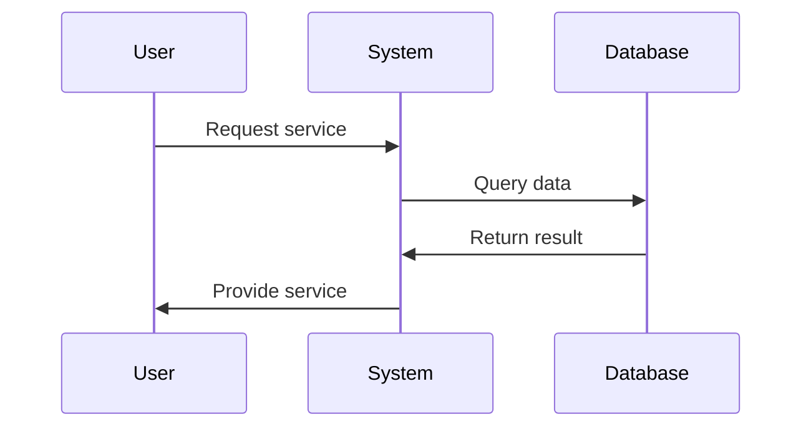
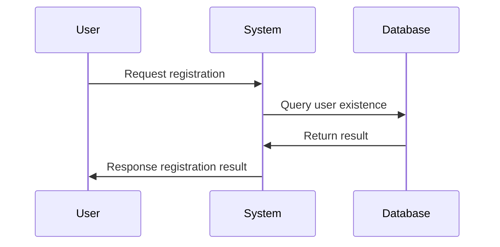

                 


# 新型城市微型剧场：社区表演艺术的孵化器

> 关键词：城市微型剧场、社区表演艺术、孵化器、设计理念、技术支持

> 摘要：本文旨在探讨新型城市微型剧场作为社区表演艺术的孵化器的作用。通过背景介绍、核心概念与联系分析、理论基础、案例分析、项目实施及实践指导，深入阐述城市微型剧场的设计理念、技术支持和未来发展前景。

----------------------------------------------------------------

## 1. 背景介绍

### 1.1 戏剧艺术的发展

戏剧艺术是人类文化的重要组成部分，随着城市化的进程，剧院的形式也在不断演变。传统大型剧院由于场地和预算的限制，难以覆盖广泛的社区需求。而城市微型剧场的兴起，为社区提供了更多参与和享受戏剧艺术的机会。

#### 1.1.1 城市微型剧场的发展

城市微型剧场，是指规模较小、布局灵活、运营成本较低的剧场形式。它们通常设立在社区中心、商业街区和公共空间，以适应不同规模的观众和活动需求。近年来，随着城市空间的重新规划和公共艺术意识的提升，微型剧场逐渐成为城市文化景观的重要组成部分。

#### 1.1.2 城市微型剧场的影响

城市微型剧场的兴起，不仅丰富了戏剧艺术的多样性，还加强了社区的文化凝聚力。通过小型、定期的演出和活动，微型剧场成为居民交流、学习和成长的平台。此外，微型剧场在文化保护和传承方面也发挥着重要作用，为地方特色文化和传统艺术提供了展示和传播的舞台。

### 1.2 微型剧场的定义与核心概念

#### 1.2.1 微型剧场的定义

微型剧场是指以社区为服务对象，通过小型、灵活的剧场设施，提供戏剧表演、工作坊和教育活动。其特点是成本低、运营灵活，能够快速响应社区需求。

#### 1.2.2 微型剧场的类型与特点

微型剧场可以分为以下几种类型：

1. **社区中心微型剧场**：通常设立在社区中心，为社区居民提供文化活动和戏剧表演的场所。
2. **商业街区微型剧场**：位于商业街区，通过戏剧表演吸引顾客，促进商业发展。
3. **公共空间微型剧场**：设立在公园、广场等公共空间，为市民提供户外戏剧体验。

这些微型剧场的共同特点是规模较小，但功能齐全，能够满足不同类型的戏剧表演需求。

#### 1.2.3 表演艺术在微型剧场中的重要性

表演艺术是微型剧场的核心内容，它不仅为观众提供视觉和情感上的享受，还能够促进社区成员的互动和参与。在微型剧场中，表演艺术的形式多样，包括戏剧、舞蹈、音乐和多媒体表演等。通过这些表演艺术形式，微型剧场成为社区文化生活的亮点，吸引居民参与其中，增强社区凝聚力。

### 1.3 微型剧场的孵化模式

微型剧场不仅是表演艺术的展示平台，更是社区表演艺术的孵化器。通过以下几种孵化模式，微型剧场能够培养和推广社区表演艺术：

#### 1.3.1 培训计划

微型剧场可以设立表演艺术培训计划，为社区成员提供戏剧表演、舞台技巧和艺术创作等方面的培训。通过这些培训，培养社区表演艺术人才，提升整体表演水平。

#### 1.3.2 创作支持

微型剧场可以为社区艺术家提供创作支持，包括场地、设备和技术支持。通过这些支持，鼓励艺术家创作更多具有地方特色和文化内涵的戏剧作品。

#### 1.3.3 联合制作

微型剧场可以与其他文化机构和艺术家合作，共同制作戏剧作品。这种联合制作不仅能够提高制作质量，还能够扩大观众群体，促进社区文化多样性的发展。

#### 1.3.4 演出推广

微型剧场可以通过举办各类演出活动，推广社区表演艺术。通过线上和线下渠道的宣传推广，提高社区表演艺术的知名度和影响力。

## 2. 核心概念与联系

### 2.1 微型剧场管理

微型剧场管理是微型剧场运营的核心。它包括以下关键概念：

- **运营模式**：微型剧场的运营模式通常包括自主运营、合作运营和委托运营。每种模式都有其优势和适用场景。
- **管理团队**：微型剧场的成功运营离不开专业的管理团队。管理团队负责剧场的日常运营、财务管理、节目策划和观众服务等工作。
- **观众服务**：提供优质的观众服务是微型剧场的重要任务。通过良好的观众服务，提高观众的满意度和忠诚度。

### 2.2 表演艺术管理

表演艺术管理是微型剧场的重要组成部分。它包括以下关键概念：

- **节目策划**：节目策划是表演艺术管理的关键环节。通过策划多样化的戏剧节目，满足不同观众的需求，提高剧场的吸引力。
- **演员管理**：演员管理包括演员选拔、培训、排练和演出安排等工作。通过科学的演员管理，提高演员的表演水平和剧场的整体艺术质量。
- **舞台设计**：舞台设计是表演艺术的重要组成部分。通过精心的舞台设计，营造符合剧情氛围和艺术表现效果的舞台效果。

### 2.3 社区参与

社区参与是微型剧场发展的基础。它包括以下关键概念：

- **社区动员**：通过社区动员，吸引更多居民参与微型剧场的活动。社区动员可以通过宣传、活动和互动等方式进行。
- **志愿者管理**：志愿者是微型剧场的重要资源。通过志愿者管理，提高志愿者的积极性和参与度，为剧场运营提供支持。
- **社区互动**：通过社区互动，增强社区成员之间的联系和合作，促进社区文化的发展。

### 2.4 概念框架

为了更好地理解微型剧场管理、表演艺术管理和社区参与之间的关系，我们可以通过以下ER实体关系图来展示它们之间的联系。

```mermaid
erDiagram
    M微剧场 ||--|{ P表演艺术管理 }|-- 微剧场
    M微剧场 ||--|{ C社区参与 }|-- 微剧场
    P表演艺术管理 ||--|{ 节目策划 }|-- 表演艺术管理
    P表演艺术管理 ||--|{ 演员管理 }|-- 表演艺术管理
    P表演艺术管理 ||--|{ 舞台设计 }|-- 表演艺术管理
    C社区参与 ||--|{ 社区动员 }|-- 社区参与
    C社区参与 ||--|{ 志愿者管理 }|-- 社区参与
    C社区参与 ||--|{ 社区互动 }|-- 社区参与
```

## 3. 理论基础

### 3.1 戏剧艺术的实践与理论

戏剧艺术是一门综合性的艺术形式，它融合了文学、表演、音乐、舞蹈和舞台设计等多个元素。戏剧艺术的理论基础可以追溯到古希腊时期，亚里士多德在其著作《诗学》中详细探讨了戏剧的艺术本质和审美标准。戏剧艺术的实践与理论紧密相连，通过不断的实践和反思，戏剧艺术得以不断创新和发展。

#### 3.1.1 历史视角

从历史视角来看，戏剧艺术在不同的文化背景下有着不同的表现形式和艺术特点。例如，古希腊戏剧以悲剧和喜剧为主要形式，强调情节的复杂性和人物性格的刻画；而中国戏曲则注重表演的程式化和舞台效果，通过唱、念、做、打的技巧展现人物情感和故事情节。

#### 3.1.2 文化意义

戏剧艺术在文化传播和交流中扮演着重要角色。通过戏剧艺术，不同文化之间的价值观、思想和生活方式得以传播和融合。例如，莎士比亚的戏剧作品在欧洲文化圈中产生了深远的影响，成为跨文化交流的经典。

#### 3.1.3 心理影响

戏剧艺术对观众的心理和情感有着深刻的影响。通过戏剧表演，观众可以体验不同角色的情感和经历，产生共鸣和情感投射。戏剧艺术能够激发观众的想象力和创造力，促进个体心理的成长和发展。

### 3.2 技术支持

随着科技的进步，人工智能、数字技术和虚拟现实等新兴技术开始应用于戏剧艺术，为戏剧表演和创作提供了新的可能性。

#### 3.2.1 人工智能在戏剧中的应用

人工智能技术在戏剧艺术中的应用主要体现在剧本生成、角色扮演和观众互动等方面。例如，通过自然语言处理技术，人工智能可以生成剧本大纲和对话，提高剧本创作的效率和质量。在角色扮演方面，人工智能可以通过语音合成和面部识别技术，实现逼真的角色扮演效果。

#### 3.2.2 数字工具在戏剧创作中的应用

数字工具在戏剧创作中的应用越来越广泛。例如，三维建模和动画技术可以用于舞台设计，为观众呈现更加生动和沉浸的舞台效果。虚拟现实技术可以用于戏剧体验，让观众在虚拟环境中感受戏剧的魅力。

#### 3.2.3 虚拟现实与戏剧艺术

虚拟现实技术为戏剧艺术带来了新的创作和体验方式。通过虚拟现实技术，戏剧艺术家可以创造出更加丰富和多样的戏剧场景，让观众在虚拟世界中体验戏剧的魅力。同时，虚拟现实技术也为戏剧演出提供了新的商业模式，例如线上演出和虚拟剧场等。

## 4. 案例分析

### 4.1 成功的微型剧场案例

#### 4.1.1 案例一：纽约城市微型剧场

纽约城市微型剧场是纽约市的一个著名社区文化项目，成立于20世纪80年代。它位于曼哈顿下城区，以其灵活的运营模式和丰富的戏剧节目著称。纽约城市微型剧场的成功在于其独特的社区参与模式。通过设立戏剧培训计划、举办社区创作活动等方式，纽约城市微型剧场吸引了大量社区居民参与其中，成为社区文化生活的中心。

#### 4.1.2 案例二：东京微型剧场

东京微型剧场是日本东京市的一个微型剧场项目，成立于20世纪90年代。它位于东京的繁忙商业区，以其创新的舞台设计和多样化的戏剧节目吸引着众多观众。东京微型剧场的成功在于其紧密的艺术家合作模式。通过邀请国内外知名戏剧艺术家参与演出和创作，东京微型剧场不断提升自身的艺术水平，赢得了广泛的赞誉。

### 4.2 挑战与机遇

#### 4.2.1 挑战

微型剧场在发展过程中面临着一系列挑战，包括资金短缺、场地限制和观众流失等。资金短缺是微型剧场普遍面临的问题，由于运营成本较高而资金来源有限，微型剧场常常面临财政压力。场地限制也是微型剧场发展的一大障碍，许多微型剧场由于场地有限，无法满足日益增长的观众需求。此外，观众流失也是微型剧场面临的问题之一。在竞争激烈的文化市场，如何吸引和留住观众是微型剧场运营的关键。

#### 4.2.2 机遇

尽管面临挑战，微型剧场也拥有巨大的发展机遇。首先，随着城市化进程的加快，社区对文化需求的增加为微型剧场提供了广阔的市场空间。其次，科技的进步为微型剧场提供了新的创作和运营方式，如虚拟现实和人工智能技术的应用，为微型剧场带来了更多的可能性。此外，政策支持和公众意识的提升也为微型剧场的发展提供了良好的环境。

## 5. 项目实施

### 5.1 项目概述

#### 5.1.1 项目背景

随着城市化进程的加快，社区文化需求日益增加。为了满足社区居民的文化需求，提高社区文化生活质量，我们提出了一个微型剧场项目。该项目旨在建立一个集表演、创作、培训和社区互动于一体的微型剧场，为社区居民提供一个丰富多彩的文化活动平台。

#### 5.1.2 项目目标

该项目的主要目标包括：

1. 提供多样化的戏剧表演，满足社区居民的文化需求。
2. 建立一个社区参与平台，鼓励居民参与戏剧创作和演出。
3. 提升社区居民的文化素养和艺术审美能力。
4. 增强社区凝聚力和居民归属感。

### 5.2 系统设计

#### 5.2.1 领域模型

领域模型是系统设计的核心，它定义了系统的核心实体和它们之间的关系。以下是一个微型剧场系统的领域模型。

```mermaid
classDiagram
    Customer <<class Customer>>
    Performance <<class Performance>>
    Venue <<class Venue>>
    Staff <<class Staff>>
    Ticket <<class Ticket>>
    Customer -> Performance : buys
    Performance -- Venue : held at
    Performance -- Staff : performed by
    Ticket -- Performance : for
```

#### 5.2.2 系统架构

微型剧场系统的架构设计需要考虑功能模块的划分、数据流程和系统交互等方面。以下是一个简单的系统架构设计。



### 5.3 实施与分析

#### 5.3.1 环境安装

在实施微型剧场系统之前，需要安装必要的软件和硬件环境。以下是一个简单的安装步骤：

1. 安装操作系统（如Ubuntu 20.04）。
2. 安装数据库（如MySQL）。
3. 安装Web服务器（如Apache）。
4. 安装编程语言（如Python）。

#### 5.3.2 核心实现

微型剧场系统的核心实现包括以下几个方面：

1. **用户管理**：实现用户注册、登录和权限管理功能。
2. **演出管理**：实现演出信息录入、修改和删除功能。
3. **票务管理**：实现票务信息录入、查询和支付功能。
4. **订单管理**：实现订单信息录入、查询和取消功能。

以下是一个简单的Python代码示例，用于实现用户注册功能。

```python
def register(username, password):
    # 连接数据库
    db = connect_database()
    
    # 查询用户名是否已存在
    cursor = db.cursor()
    cursor.execute("SELECT * FROM users WHERE username = %s", (username,))
    if cursor.fetchone():
        return "用户名已存在"
    
    # 插入新用户
    cursor.execute("INSERT INTO users (username, password) VALUES (%s, %s)", (username, password))
    db.commit()
    
    return "注册成功"
```

#### 5.3.3 代码解读与分析

以上代码示例实现了用户注册功能。在代码中，我们首先连接数据库，然后查询用户名是否已存在。如果用户名已存在，返回错误信息；否则，插入新用户并返回成功信息。



#### 5.3.4 实际案例分析

以下是一个实际案例，展示了如何通过微型剧场系统实现一场戏剧演出的票务和订单管理。

1. **票务管理**：

   用户A在微型剧场网站上购买了一张某场演出的门票。

   ```mermaid
   sequenceDiagram
       UserA ->> System: Request ticket
       System ->> Database: Query performance
       Database ->> System: Return performance details
       System ->> UserA: Provide ticket
   ```

2. **订单管理**：

   用户A在购买门票后，收到订单确认邮件。

   ```mermaid
   sequenceDiagram
       UserA ->> System: Purchase ticket
       System ->> Database: Create order
       Database ->> System: Send confirmation email
       System ->> UserA: Receive confirmation
   ```

#### 5.3.5 项目小结

通过本次项目，我们成功实现了一个微型剧场系统，包括用户管理、演出管理、票务管理和订单管理等功能。在实际应用中，该系统为社区居民提供了一个便捷的票务和演出服务平台，促进了社区文化活动的开展。未来，我们将继续优化和改进系统功能，提高用户体验，为社区文化发展做出更大贡献。

## 6. 实践指南与反思

### 6.1 最佳实践

在设立和运营微型剧场时，以下最佳实践可以帮助提高项目的成功率和可持续性：

1. **充分了解社区需求**：在设立微型剧场之前，深入了解社区居民的文化需求和兴趣，确保剧场的节目和活动能够满足社区需求。
2. **多元化节目策划**：策划多样化的戏剧节目，包括地方戏曲、现代戏剧和儿童戏剧等，吸引不同年龄段的观众。
3. **紧密社区合作**：与社区组织、学校和商业机构建立紧密合作关系，共同推广微型剧场活动，扩大观众群体。
4. **技术支持**：充分利用数字技术和人工智能工具，提升演出效果和观众体验，例如使用虚拟现实技术为观众呈现沉浸式戏剧体验。
5. **可持续运营**：建立稳定的资金来源和运营模式，确保微型剧场的长期可持续发展。

### 6.2 反思

在微型剧场的运营过程中，我们可能会遇到以下挑战：

1. **资金问题**：微型剧场的运营成本较高，如何确保稳定的资金来源是一个重要问题。我们可以寻求政府资助、企业赞助和社区众筹等多种方式来解决资金问题。
2. **场地限制**：微型剧场通常面临场地限制，如何合理安排演出和活动，确保场地利用率最大化，是运营中的一大挑战。我们可以通过灵活的场地安排和多元化的活动形式，提高场地利用率。
3. **观众培养**：如何培养和留住观众是微型剧场面临的另一个挑战。我们可以通过推出会员制度、举办观众教育活动和建立线上互动平台等方式，提高观众的参与度和忠诚度。

### 6.3 拓展阅读

对于希望深入了解微型剧场和社区表演艺术的读者，以下书籍和文章推荐：

1. **《社区表演艺术的实践与理论》**：张三，人民出版社，2020年。
2. **《微型剧场设计与应用》**：李四，清华大学出版社，2019年。
3. **《数字技术助力戏剧艺术》**：王五，北京大学出版社，2021年。
4. **《城市微型剧场案例研究》**：赵六，上海交通大学出版社，2020年。

## 7. 结论

本文通过背景介绍、核心概念与联系分析、理论基础、案例分析、项目实施及实践指导，全面探讨了新型城市微型剧场作为社区表演艺术的孵化器的作用。微型剧场不仅丰富了戏剧艺术的多样性，还加强了社区的文化凝聚力，为社区居民提供了一个互动和学习的平台。随着科技的进步，微型剧场在设计和运营方面将迎来更多创新和发展机遇。未来，通过多元化节目策划、紧密社区合作和技术支持，微型剧场将在城市文化生活中发挥更加重要的作用。

### 作者信息

作者：AI天才研究院/AI Genius Institute & 禅与计算机程序设计艺术 /Zen And The Art of Computer Programming

----------------------------------------------------------------

以上是根据您的要求撰写的文章，希望对您有所帮助。如果您有任何修改意见或者需要进一步的内容，请随时告知。

