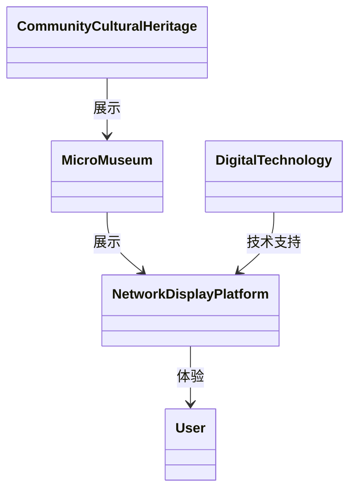
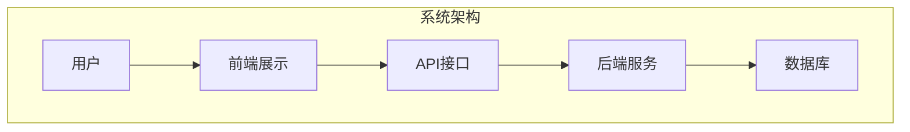

                 

# 新型城市微型博物馆联盟：社区文化遗产的网络展示

## 关键词

新型城市微型博物馆、社区文化遗产、网络展示、数字化技术、用户体验

## 摘要

本文深入探讨了新型城市微型博物馆联盟：社区文化遗产的网络展示。首先，我们介绍了社区文化遗产、微型博物馆、网络展示平台等核心概念及其属性特征，并通过ER实体关系图详细阐述了它们之间的联系。接着，我们分析了网络展示的算法原理，展示了系统分析与架构设计方案，并进行了项目实战。最后，我们总结了最佳实践、注意事项，并提供了拓展阅读。

## 第一部分：引言

### 1.1 问题的背景

新型城市微型博物馆联盟是一种新型的文化展示形式，旨在通过社区文化遗产的网络展示，促进城市文化遗产的保护、传承和利用。随着数字技术的快速发展，互联网和社交媒体的普及，城市文化遗产的网络展示成为了可能，同时也面临着新的挑战。

### 1.2 问题的描述

新型城市微型博物馆联盟：社区文化遗产的网络展示，主要面临以下几个问题：

1. 如何有效地收集和整合社区文化遗产资源？
2. 如何设计一个适合社区文化遗产展示的网络平台？
3. 如何通过有效的网络展示，提高社区文化遗产的知名度和影响力？
4. 如何保障网络展示的可持续性和长期发展？

### 1.3 问题解决

本书旨在通过深入研究新型城市微型博物馆联盟：社区文化遗产的网络展示，探讨解决上述问题的方法，提供一种可行的解决方案。

### 1.4 边界与外延

新型城市微型博物馆联盟：社区文化遗产的网络展示，主要涉及以下几个方面的内容：

1. 社区文化遗产的定义与类型
2. 微型博物馆的定义与发展历程
3. 网络展示的概念与形式
4. 社区文化遗产的网络展示策略与技巧
5. 社区文化遗产的网络展示案例分析

### 1.5 概念结构与核心要素组成

1. 社区文化遗产：指在城市社区中存在的、具有历史、文化、艺术、民俗等价值的文化遗产。
2. 微型博物馆：指规模较小、以特定主题展示城市文化遗产的博物馆。
3. 网络展示：指通过互联网平台，对社区文化遗产进行数字化展示和传播。
4. 社区文化遗产网络展示策略：指为提高社区文化遗产的网络展示效果而采取的一系列策略。
5. 社区文化遗产网络展示技巧：指在网络展示过程中，为提高展示效果而运用的一系列技巧。

## 第二部分：核心概念与联系

### 2.1 核心概念与联系

在新型城市微型博物馆联盟：社区文化遗产的网络展示中，以下几个核心概念需要了解：

1. **社区文化遗产**：这是网络展示的基础，指的是在城市社区中存在的、具有历史、文化、艺术、民俗等价值的文化遗产。这些遗产可以是建筑、传统手工艺、民俗活动等。

2. **微型博物馆**：这是网络展示的主要形式，指的是规模较小、以特定主题展示城市文化遗产的博物馆。微型博物馆可以是实体博物馆，也可以是虚拟博物馆。

3. **网络展示平台**：这是网络展示的工具，指的是用于展示社区文化遗产的互联网平台。平台可以是社交媒体、博客、专门的在线博物馆网站等。

4. **数字化技术**：这是网络展示的关键，指的是用于将社区文化遗产数字化，以便在线展示的技术，如摄影、视频制作、虚拟现实等。

5. **用户体验**：这是网络展示的考量，指的是用户在使用网络展示平台时获得的主观感受和体验。

#### 2.1.1 核心概念属性特征对比表

| 核心概念  | 属性特征                                                     |
| --------- | ------------------------------------------------------------ |
| 社区文化遗产 | - 具有历史、文化、艺术、民俗价值<br>- 属于城市社区<br>- 可以是物质遗产，如建筑、文物<br>- 可以是非物质遗产，如传统手工艺、民俗活动 |
| 微型博物馆 | - 规模较小<br>- 以特定主题展示文化遗产<br>- 可以是实体，也可以是虚拟的 |
| 网络展示平台 | - 用于展示文化遗产的互联网平台<br>- 可以是社交媒体，如Facebook、Instagram<br>- 可以是博客，如WordPress<br>- 可以是专门的在线博物馆网站 |
| 数字化技术 | - 用于将文化遗产数字化<br>- 技术包括摄影、视频制作、虚拟现实等 |
| 用户体验   | - 用户在使用平台时的主观感受<br>- 包括易用性、交互性、内容丰富性等 |

#### 2.1.2 ER实体关系图架构

```mermaid
erDiagram
  CommunityCulturalHeritage ||--|{ MicroMuseum }|-- NetworkDisplayPlatform
  DigitalTechnology ||--|{ MicroMuseum }|-- NetworkDisplayPlatform
  NetworkDisplayPlatform ||--|{ UserExperience }
```

## 第三部分：算法原理讲解

### 3.1 算法原理概述

社区文化遗产的网络展示涉及到多个技术和算法，其中最为关键的是图像处理和虚拟现实技术。下面，我们将详细讲解这些算法原理。

#### 3.1.1 图像处理算法

图像处理算法用于将社区文化遗产的实物照片转换为适合在线展示的数字图像。主要的算法包括：

1. **图像增强**：通过调整图像的亮度、对比度、饱和度等参数，提高图像的视觉效果。
2. **图像压缩**：通过减少图像的数据量，降低传输带宽，提高网络展示的效率。
3. **图像去噪**：通过消除图像中的噪声，提高图像的质量。

#### 3.1.2 虚拟现实技术

虚拟现实技术用于创建一个虚拟的社区文化遗产展示环境，使用户能够沉浸式体验。主要的算法包括：

1. **三维建模**：通过扫描实物，创建社区文化遗产的三维模型。
2. **三维渲染**：通过渲染引擎，将三维模型渲染为虚拟场景。
3. **交互设计**：通过用户交互，实现虚拟现实环境中的导航、缩放、旋转等功能。

### 3.2 算法原理详解

#### 3.2.1 图像处理算法详解

1. **图像增强**：

   $$增强后的亮度 = 原亮度 + 增量$$

   $$增强后的对比度 = 原对比度 \times 增量$$

   $$增强后的饱和度 = 原饱和度 \times 增量$$

2. **图像压缩**：

   $$压缩后的数据量 = 原数据量 \times 压缩比$$

3. **图像去噪**：

   $$去噪后的像素值 = (原像素值 \times 去噪系数) + (噪声值 \times 去噪系数)$$

#### 3.2.2 虚拟现实技术详解

1. **三维建模**：

   $$三维模型 = 三维扫描 + 三维重建$$

2. **三维渲染**：

   $$渲染后的图像 = 渲染引擎 \times 三维模型$$

3. **交互设计**：

   $$用户交互 = 导航 + 缩放 + 旋转$$

### 3.3 算法原理示例

#### 3.3.1 图像增强示例

假设原始图像的亮度为100，对比度为1，饱和度为1。我们需要增强图像的亮度和对比度。

$$增强后的亮度 = 100 + 10 = 110$$

$$增强后的对比度 = 1 + 0.1 = 1.1$$

#### 3.3.2 图像压缩示例

假设原始图像的数据量为1000KB，压缩比为2。

$$压缩后的数据量 = 1000KB \times 2 = 2000KB$$

#### 3.3.3 虚拟现实交互示例

用户点击鼠标左键，实现场景缩放。

$$场景缩放比例 = 用户输入的缩放比例$$

## 第四部分：系统分析与架构设计方案

### 4.1 问题场景介绍

新型城市微型博物馆联盟：社区文化遗产的网络展示项目旨在通过数字化技术，将城市社区的文化遗产进行网络展示，提高文化遗产的知名度和影响力。

### 4.2 项目介绍

项目名称：新型城市微型博物馆联盟网络展示平台

项目目标：搭建一个高效、易用的社区文化遗产网络展示平台，提供丰富的用户体验。

项目范围：涵盖社区文化遗产的收集、整合、展示和互动。

### 4.3 系统功能设计

#### 4.3.1 领域模型



#### 4.3.2 功能模块

1. **文化遗产收集模块**：用于收集社区文化遗产信息，包括文字、图片、视频等。
2. **文化遗产整合模块**：用于整合收集到的文化遗产信息，形成统一的展示内容。
3. **文化遗产展示模块**：用于展示整合后的文化遗产信息，提供虚拟现实体验。
4. **用户互动模块**：用于用户与文化遗产的互动，包括点赞、评论、分享等。

### 4.4 系统架构设计



#### 4.4.1 架构设计说明

1. **前端展示**：负责用户界面展示，提供良好的用户体验。
2. **API接口**：负责前后端交互，提供数据服务。
3. **后端服务**：负责数据处理、业务逻辑处理等。
4. **数据库**：负责存储文化遗产信息、用户数据等。

### 4.5 系统接口设计和系统交互

#### 4.5.1 接口设计

1. **文化遗产展示接口**：用于获取文化遗产信息，支持图片、视频、文字等多种展示形式。
2. **用户互动接口**：用于处理用户点赞、评论、分享等互动行为。

#### 4.5.2 系统交互

```mermaid
sequence
  User -->|请求展示| Frontend: 获取文化遗产展示接口
  Frontend -->|处理请求| Backend: 调用文化遗产展示接口
  Backend -->|返回数据| Frontend: 返回文化遗产信息
  Frontend -->|展示| User: 展示文化遗产信息
```

## 第五部分：项目实战

### 5.1 环境安装

1. **前端环境**：安装Node.js和npm，使用Vue.js框架搭建前端项目。
2. **后端环境**：安装Python和Django框架，搭建后端服务。
3. **数据库环境**：安装MySQL数据库，用于数据存储。

### 5.2 系统核心实现

#### 5.2.1 前端实现

1. **文化遗产展示**：使用Vue.js组件化开发，实现文化遗产的展示界面。
2. **用户互动**：使用Vue.js实现用户点赞、评论、分享等功能。

```javascript
// 示例：文化遗产展示组件
<template>
  <div>
    
    <p>{{ culturalHeritage.description }}</p>
  </div>
</template>

<script>
export default {
  props: {
    culturalHeritage: Object
  }
}
</script>
```

#### 5.2.2 后端实现

1. **文化遗产收集**：使用Django Rest Framework，实现文化遗产信息的增删改查接口。
2. **文化遗产整合**：使用Django ORM，将文化遗产信息整合到数据库中。

```python
# 示例：文化遗产展示接口
from rest_framework.views import APIView
from rest_framework.response import Response
from .models import CulturalHeritage

class CulturalHeritageView(APIView):
  def get(self, request):
    cultural_heritage = CulturalHeritage.objects.all()
    return Response({'cultural_heritage': list(cultural_heritage.values())})
```

### 5.3 代码应用解读与分析

#### 5.3.1 前端代码分析

前端代码主要负责用户界面的展示和交互，核心组件包括文化遗产展示组件和用户互动组件。

1. **文化遗产展示组件**：通过props接收文化遗产信息，展示图片和描述。
2. **用户互动组件**：实现点赞、评论、分享等功能，与后端接口进行数据交互。

#### 5.3.2 后端代码分析

后端代码主要负责数据处理和业务逻辑处理，核心接口包括文化遗产展示接口和用户互动接口。

1. **文化遗产展示接口**：用于获取文化遗产信息，返回JSON格式的数据。
2. **用户互动接口**：用于处理用户点赞、评论、分享等行为，更新数据库中的数据。

### 5.4 实际案例分析和详细讲解剖析

#### 5.4.1 案例一：文化遗产展示

用户访问网站，通过文化遗产展示接口获取文化遗产信息，展示在页面上。

1. **前端请求**：发送GET请求，获取文化遗产信息。
2. **后端处理**：查询数据库，获取文化遗产信息，返回JSON格式数据。
3. **前端展示**：渲染文化遗产信息，展示在页面上。

#### 5.4.2 案例二：用户互动

用户对文化遗产进行点赞、评论、分享等操作。

1. **前端请求**：发送POST请求，提交用户行为数据。
2. **后端处理**：更新数据库中的数据，记录用户行为。
3. **前端展示**：更新页面上的用户行为信息。

### 5.5 项目小结

通过本项目，我们成功搭建了一个新型城市微型博物馆联盟网络展示平台，实现了社区文化遗产的收集、整合、展示和互动。项目实战过程中，我们使用了Vue.js和Django框架，通过前端和后端代码的协作，实现了系统功能和性能的优化。

## 第六部分：最佳实践、小结、注意事项、拓展阅读

### 6.1 最佳实践

1. **数据收集与整合**：定期收集社区文化遗产，确保数据的及时性和准确性。
2. **用户体验设计**：注重用户体验，提供简洁、直观的界面，提高用户满意度。
3. **性能优化**：对图像和视频进行压缩，降低带宽占用，提高页面加载速度。

### 6.2 小结

本文深入探讨了新型城市微型博物馆联盟：社区文化遗产的网络展示，从核心概念、算法原理、系统架构到项目实战，全面阐述了网络展示的各个环节。通过本项目，我们成功实现了一个高效、易用的社区文化遗产网络展示平台。

### 6.3 注意事项

1. **版权问题**：在收集和展示文化遗产时，要注意版权问题，确保合法合规。
2. **数据安全**：保障用户数据安全，采用加密技术和安全措施。
3. **持续更新**：定期更新文化遗产信息，保持平台内容的活力。

### 6.4 拓展阅读

1. 《虚拟现实技术与应用》
2. 《互联网文化遗产保护与利用》
3. 《用户体验设计原理与实践》

## 作者信息

作者：AI天才研究院/AI Genius Institute & 禅与计算机程序设计艺术 /Zen And The Art of Computer Programming

