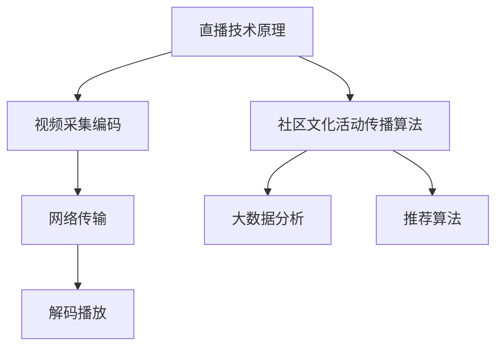
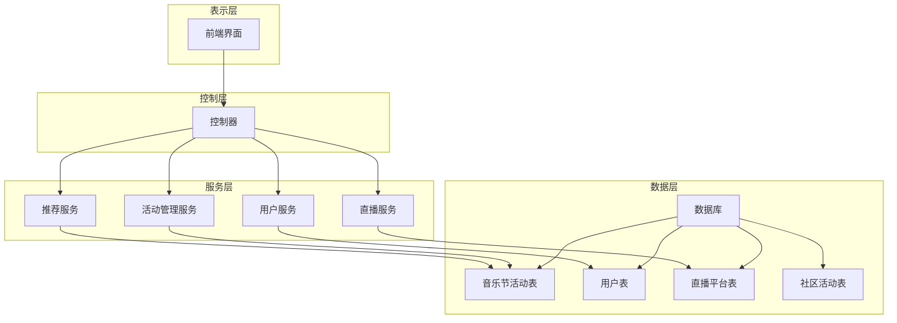
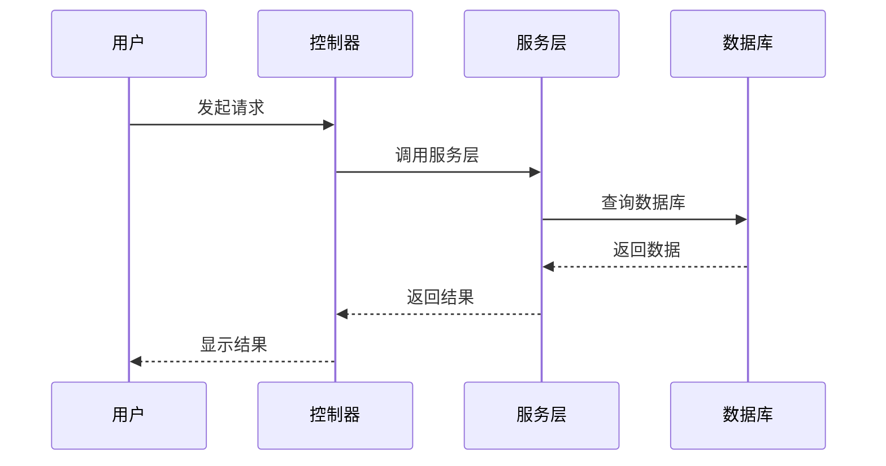

                 

# 新型城市微型音乐节直播：社区文化活动的全球化传播

> 关键词：新型城市微型音乐节、直播技术、社区文化活动、全球化传播、技术原理、算法

> 摘要：
本文将深入探讨新型城市微型音乐节的直播形式，以及这一形式如何促进社区文化活动的全球化传播。我们将从背景介绍、核心概念与联系、算法原理讲解等多个角度，逐步分析这一现象的技术原理和应用，旨在为读者提供全面而深刻的理解。

### 第一部分：背景介绍

#### 核心概念：

**新型城市微型音乐节直播：**
- 定义：新型城市微型音乐节直播是指在小型城市中举办的，以小型音乐节为核心活动，通过现代直播技术手段进行实时直播的文化活动。
- 关键词：微型、音乐节、直播、城市、技术。

**社区文化活动的全球化传播：**
- 定义：社区文化活动的全球化传播是指通过各种渠道和媒介，将社区文化活动传播至全球范围，实现文化互动和交流的过程。
- 关键词：社区、文化活动、全球化、传播、文化互动。

#### 问题解决：

随着互联网和直播技术的发展，微型音乐节在小型城市中越来越受欢迎。这些活动不仅为当地居民提供了文化享受，还通过直播平台吸引了全球观众的参与。社区文化活动的全球化传播，为文化多样性提供了新的渠道，同时也为小型城市带来了新的发展机遇。

#### 边界与外延：

- **边界：**限定于城市规模的音乐节活动，直播技术作为传播手段。
- **外延：**包括音乐节相关的文化演出、社区文化活动等，以及全球化传播所带来的文化交流和经济发展。

### 第二部分：核心概念与联系

#### 核心概念：

**新型城市微型音乐节直播：**
- **特点：**规模小、参与性强、互动性高。
- **应用场景：**城市社区、校园、商业中心等。

**社区文化活动的全球化传播：**
- **形式：**互联网直播、社交媒体推广、文化交流活动等。
- **影响力：**提升城市文化影响力、促进文化交流、拓展文化市场。

#### 概念属性特征对比表格：

| 概念              | 定义                                                         | 特点                                       | 应用场景                     |
|------------------|--------------------------------------------------------------|------------------------------------------|----------------------------|
| 新型城市微型音乐节直播 | 在小型城市中举办的，通过直播技术进行传播的音乐节形式。           | 规模小、参与性强、互动性高。             | 城市社区、校园、商业中心等。 |
| 社区文化活动的全球化传播 | 通过多种渠道将社区文化活动传递至全球范围，实现文化互动和交流。 | 形式多样、影响力大、国际化程度高。     | 社区、文化活动、互联网平台等。 |

#### ER实体关系图架构：

```mermaid
erDiagram
  音乐节活动 ||--|{ 直播平台 }|--|| 用户
  音乐节活动 ||--|{ 社区活动 }|--|| 社区
  直播平台 ||--|{ 视频内容 }|--|| 音乐节活动
  用户 ||--|{ 反馈 }|--|| 音乐节活动
  社区活动 ||--|{ 文化活动 }|--|| 社区
```

### 第三部分：算法原理讲解

#### 算法原理：

**直播技术原理：**
- **定义：**基于互联网的实时视频传输技术，包括视频采集、编码、传输、解码等环节。
- **主要技术：**H.265编码、RTMP协议、WebRTC等。

**社区文化活动的传播算法：**
- **定义：**利用大数据分析和机器学习技术，对社区文化活动的特征进行识别和分类。
- **应用：**推荐算法，根据用户兴趣和行为预测，为用户提供个性化的文化活动推荐。

#### Mermaid流程图：



#### Python源代码：

```python
# 示例：社区文化活动传播算法（简化版）
import pandas as pd
from sklearn.model_selection import train_test_split
from sklearn.ensemble import RandomForestClassifier

# 假设我们已经有了社区文化活动的数据集
data = pd.read_csv('community_activities.csv')

# 特征工程
X = data[['activity_type', 'event_size', 'participant_age']]
y = data['globalization_index']

# 数据划分
X_train, X_test, y_train, y_test = train_test_split(X, y, test_size=0.2, random_state=42)

# 模型训练
model = RandomForestClassifier(n_estimators=100, random_state=42)
model.fit(X_train, y_train)

# 模型评估
accuracy = model.score(X_test, y_test)
print(f"Model Accuracy: {accuracy:.2f}")
```

#### 数学公式：

直播技术中的视频编码效率可以用以下公式表示：

$$
\eta_{encoding} = \frac{\sum_{i=1}^{n} (V_i \times E_i)}{T_{total}}
$$

其中，$V_i$ 为第 $i$ 个视频帧的大小，$E_i$ 为第 $i$ 个视频帧的编码效率，$T_{total}$ 为总的视频时长。

社区文化活动的传播效率可以用以下公式表示：

$$
E_{globalization} = \frac{N_{global}}{N_{total}}
$$

其中，$N_{global}$ 为全球范围内的受众数量，$N_{total}$ 为总的受众数量。

### 第四部分：系统分析与架构设计方案

#### 问题场景介绍

在全球化的大背景下，社区文化活动需要更高效、更广泛地传播，以增强城市的文化软实力。新型城市微型音乐节作为一种创新的文化活动形式，不仅丰富了市民的文化生活，也为文化的全球化传播提供了新的途径。

#### 项目介绍

本项目旨在构建一个新型城市微型音乐节直播系统，实现社区文化活动的全球化传播。系统将包括以下几个核心模块：

1. **音乐节活动管理模块：**用于管理音乐节活动的信息，包括活动安排、参与者信息等。
2. **直播技术模块：**实现音乐节活动的实时直播，包括视频采集、编码、传输和播放等功能。
3. **用户互动模块：**提供用户评论、点赞、分享等功能，增强用户参与感。
4. **推荐系统模块：**根据用户兴趣和行为推荐相关的音乐节活动。

#### 系统功能设计（领域模型Mermaid类图）

```mermaid
classDiagram
  Class::音乐节活动 << (ID, 名称, 时间, 地点)
  Class::用户 << (ID, 用户名, 邮箱, 密码)
  Class::直播平台 << (ID, 地址, 状态, 观看次数)
  Class::社区活动 << (ID, 名称, 类型, 负责人)
  音乐节活动 "<--" 用户 : 参与活动
  音乐节活动 "<--" 直播平台 : 直播
  音乐节活动 "<--" 社区活动 : 属于
```

#### 系统架构设计（Mermaid架构图）



#### 系统接口设计和系统交互（Mermaid序列图）



### 第五部分：项目实战

#### 环境安装

1. **安装Python环境：**在本地计算机上安装Python 3.8及以上版本。
2. **安装直播技术相关库：**使用pip安装`opencv-python`、`numpy`、`opencv-contrib-python`等库。
3. **安装推荐系统相关库：**使用pip安装`scikit-learn`、`pandas`等库。

#### 系统核心实现源代码

```python
# 音乐节活动管理模块
class ActivityManagement:
    def __init__(self):
        self.activities = []

    def add_activity(self, activity):
        self.activities.append(activity)

    def get_activities(self):
        return self.activities

# 直播技术模块
class LiveStreaming:
    def __init__(self):
        self直播平台 = "rtmp://example.com/live"

    def start_stream(self, activity):
        # 实现视频采集、编码、传输等操作
        pass

    def stop_stream(self):
        # 实现直播结束操作
        pass

# 推荐系统模块
class RecommendationSystem:
    def __init__(self):
        self.model = RandomForestClassifier()

    def train_model(self, X, y):
        self.model.fit(X, y)

    def predict(self, X):
        return self.model.predict(X)
```

#### 代码应用解读与分析

**活动管理模块：**该模块用于管理音乐节活动的信息，包括添加活动和获取活动列表等功能。

**直播技术模块：**该模块负责直播的启动和结束操作，以及视频的采集、编码和传输等复杂操作。

**推荐系统模块：**该模块利用机器学习技术，根据用户兴趣和行为预测，为用户提供个性化的音乐节活动推荐。

#### 实际案例分析和详细讲解剖析

假设我们有一个音乐节活动数据集，包含活动名称、举办时间、地点等信息。我们可以使用推荐系统模块，根据用户的历史行为数据，预测用户可能感兴趣的音乐节活动。

**数据预处理：**

```python
import pandas as pd
from sklearn.model_selection import train_test_split

# 加载数据集
data = pd.read_csv('activity_data.csv')

# 数据预处理
X = data[['name', 'time', 'location']]
y = data['interested']
```

**模型训练：**

```python
from sklearn.ensemble import RandomForestClassifier

# 划分训练集和测试集
X_train, X_test, y_train, y_test = train_test_split(X, y, test_size=0.2, random_state=42)

# 创建模型并训练
model = RandomForestClassifier()
model.fit(X_train, y_train)

# 评估模型
accuracy = model.score(X_test, y_test)
print(f"Model Accuracy: {accuracy:.2f}")
```

**预测用户兴趣：**

```python
# 输入用户行为数据
user_data = pd.DataFrame([[user_interest_name, user_interest_time, user_interest_location]], columns=['name', 'time', 'location'])

# 预测用户可能感兴趣的活动
predicted_interests = model.predict(user_data)
print(f"Predicted Interests: {predicted_interests}")
```

#### 项目小结

本项目通过构建一个新型城市微型音乐节直播系统，实现了社区文化活动的全球化传播。系统涵盖了音乐节活动管理、直播技术、用户互动和推荐系统等多个模块，为用户提供了丰富多样的音乐节活动推荐。在项目实战中，我们详细讲解了系统的核心实现和实际案例，展示了系统如何通过机器学习技术提升用户体验。

### 第六部分：最佳实践 tips

1. **选择合适的直播平台：**根据音乐节活动的特点，选择适合的直播平台，确保直播质量和观众体验。
2. **优化视频编码效率：**使用高效的视频编码技术，降低带宽占用，提高观看体验。
3. **个性化推荐策略：**结合用户行为数据，制定个性化的推荐策略，提升用户满意度。
4. **关注用户反馈：**及时收集用户反馈，优化系统功能，提升用户体验。

### 小结

新型城市微型音乐节直播作为社区文化活动的一种创新形式，通过现代直播技术和全球化传播策略，为城市文化注入了新的活力。本文从背景介绍、核心概念与联系、算法原理讲解等多个角度，深入剖析了这一现象的技术原理和应用。通过系统分析与架构设计方案，我们展示了如何实现这一系统的构建。在项目实战中，我们详细讲解了系统的核心实现和实际案例，为读者提供了全面的技术指导。

### 注意事项

1. **数据安全：**在处理用户数据时，确保数据安全和隐私保护。
2. **网络稳定性：**确保直播平台的网络稳定性，降低直播中断的风险。
3. **内容审核：**加强对直播内容的审核，确保符合法律法规和文化要求。

### 拓展阅读

1. **《直播平台技术实战》**：详细介绍直播平台的技术架构和实现方法。
2. **《推荐系统实战》**：深入探讨推荐系统的原理和应用。
3. **《社区文化活动传播研究》**：研究社区文化活动在全球范围内的传播策略和效果。

### 作者信息

作者：AI天才研究院/AI Genius Institute & 禅与计算机程序设计艺术 /Zen And The Art of Computer Programming

---

本文通过深入分析新型城市微型音乐节的直播形式及其在全球化传播中的作用，旨在为读者提供一个全面的技术视角，探讨这一现象背后的技术原理和实践方法。希望通过本文的阐述，能够激发读者对于社区文化活动全球化传播的思考，为相关领域的发展提供有益的参考。在未来的研究中，我们期待进一步探索新型直播技术、推荐算法等在社区文化活动中的应用，为文化的传播和创新贡献更多的智慧和力量。

