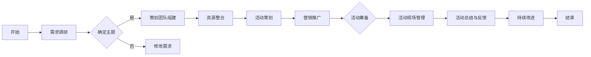
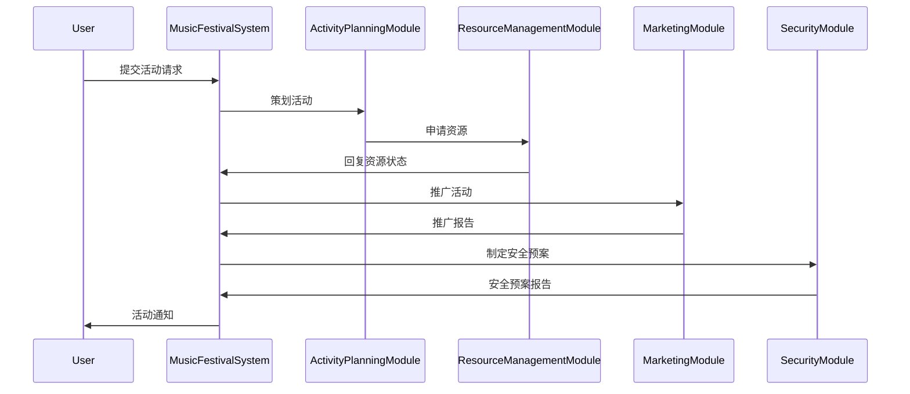
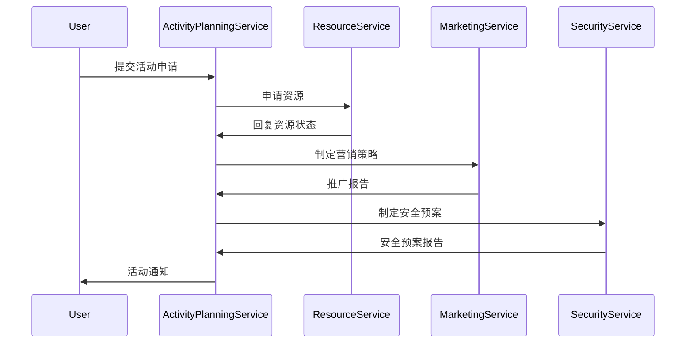

                 

### 第1章 引言

#### 1.1 问题背景

随着城市化进程的加快，城市小型社区文化活动的需求日益增加。微型音乐节作为一种新兴的社区文化活动形式，以其互动性强、参与度高、氛围轻松等特点，逐渐成为社区文化生活中的亮点。然而，如何有效策划一场成功的微型音乐节，为小型社区提供专业的文化服务，成为一个亟待解决的问题。

微型音乐节策划服务的必要性体现在多个方面。首先，专业的策划服务能够帮助社区活动组织者节省时间和精力，避免因为缺乏经验而导致的资源浪费和活动效果不佳。其次，专业的策划团队具备丰富的资源整合能力和创意策划能力，能够为微型音乐节注入新鲜元素，提升活动品质。最后，微型音乐节的策划服务有助于打造社区文化品牌，增强社区居民的归属感和凝聚力。

本文旨在探讨新型城市微型音乐节策划服务的重要性，分析其核心概念与联系，讲解策划算法原理，设计系统架构方案，并通过实际项目案例进行分析与讲解，为小型社区文化活动提供专业支持。文章结构如下：

- **第1章 引言**：介绍问题背景，定义核心概念，提出文章目标。
- **第2章 核心概念与联系**：阐述微型音乐节和社区文化活动的核心概念，分析其属性特征和关系。
- **第3章 算法原理讲解**：讲解微型音乐节策划的算法原理，使用流程图、源代码、数学模型和公式进行详细说明。
- **第4章 系统分析与架构设计方案**：分析微型音乐节策划的问题场景，介绍项目情况，设计系统功能、架构和接口。
- **第5章 项目实战**：介绍环境安装，实现核心系统功能，分析实际案例，进行项目小结。
- **第6章 最佳实践 tips**：提供微型音乐节策划和社区文化活动推广的最佳实践建议。
- **第7章 小结与拓展阅读**：总结文章内容，给出注意事项和拓展阅读建议。

#### 1.2 问题描述

在当前城市社区中，微型音乐节策划服务的需求日益增长，但实际操作中存在诸多问题。这些问题主要包括：

1. **策划经验不足**：许多社区活动组织者缺乏策划大型活动的经验，导致活动效果不佳，参与度低。
2. **资源整合困难**：微型音乐节策划需要协调音乐表演者、场地租赁、设备租赁等多方资源，资源整合难度大。
3. **营销推广不力**：活动宣传和推广不到位，导致参与人数少，影响活动效果。
4. **安全保障不足**：大型活动安全保障要求高，社区组织者难以满足安全标准。
5. **持续发展受限**：缺乏可持续的运营模式，导致微型音乐节难以长期开展，社区文化活力不足。

#### 1.3 问题解决

针对上述问题，新型城市微型音乐节策划服务需要采取以下解决方案：

1. **专业团队支持**：组建专业的策划团队，提供全方位的服务，包括活动策划、资源整合、营销推广等。
2. **资源平台建设**：建立资源共享平台，方便社区活动组织者获取所需资源，降低资源整合难度。
3. **营销策略优化**：制定有效的营销策略，利用社交媒体、线上线下活动等多渠道进行宣传，提高活动知名度。
4. **安全保障措施**：制定详细的安全预案，确保活动过程中的安全和秩序。
5. **可持续发展模式**：探索可持续的运营模式，如会员制、赞助合作等，为微型音乐节的长期发展提供支持。

#### 1.4 边界与外延

微型音乐节策划服务的边界主要涉及活动策划、资源整合、营销推广、安全保障等方面。而其外延则包括音乐节活动本身，以及与之相关的社区文化活动、文化品牌建设等。

在实施过程中，需要明确以下边界：

1. **活动范围**：微型音乐节的活动范围限定在社区或城市小型区域，避免资源浪费和影响范围过大。
2. **参与对象**：主要面向社区居民，包括家庭、青少年、老年人等各个年龄段。
3. **活动频率**：根据社区需求，可定期或不定期举办，保持活动的新鲜感和参与度。

#### 1.5 概念结构与核心要素组成

微型音乐节策划服务的概念结构主要包括以下几个核心要素：

1. **策划团队**：负责活动策划、资源整合、营销推广等工作。
2. **资源平台**：提供各类活动所需的场地、设备、音乐表演者等资源。
3. **营销渠道**：包括社交媒体、线上线下活动、宣传物料等。
4. **安全保障**：制定详细的安全预案和措施，确保活动安全有序。
5. **运营模式**：探索可持续的运营模式，为活动提供长期支持。

这些核心要素相互关联，共同构成了微型音乐节策划服务的整体框架，为实现小型社区文化活动的专业支持提供了基础。

### 第2章 核心概念与联系

微型音乐节和社区文化活动是本篇文章讨论的核心概念。为了深入理解这两个概念及其相互关系，我们需要从其基本原理、属性特征以及实体关系等方面进行详细阐述。

#### 2.1 核心概念原理

**微型音乐节**：微型音乐节是一种小型、亲密的音乐演出活动，通常在社区内举办。它以音乐为核心，通过多种形式的表演，如歌唱、演奏、即兴表演等，吸引社区居民参与。微型音乐节的目的是增强社区凝聚力，促进文化交流，丰富居民文化生活。

**社区文化活动**：社区文化活动是指为了满足社区居民的文化需求，由社区组织或政府支持，以社区为活动地点，通过各种形式的文化活动，如讲座、展览、演出等，增进居民间的交流和互动。

**两者关系**：微型音乐节是社区文化活动的一种形式，它通过音乐这一载体，将社区居民聚集在一起，促进文化交流和社区凝聚力。同时，微型音乐节也为社区文化活动提供了新的形式和内容，丰富了社区文化的内涵。

#### 2.2 概念属性特征对比表格

为了更直观地了解微型音乐节和社区文化活动的特点，我们可以通过以下对比表格进行分析：

| 特征          | 微型音乐节           | 社区文化活动             |
|---------------|----------------------|--------------------------|
| **规模**      | 小型、亲密           | 中小型、多样             |
| **形式**      | 音乐表演             | 讲座、展览、演出等       |
| **参与对象**  | 社区居民             | 社区居民                 |
| **目的**      | 增强社区凝聚力、文化交流 | 满足文化需求、促进社区互动 |
| **组织形式**  | 专业策划团队支持     | 社区组织或政府支持       |
| **影响范围**  | 社区内               | 社区内                   |

通过上述对比，我们可以看到，微型音乐节和社区文化活动在规模、形式、目的、组织形式和影响范围等方面具有一定的相似性，但也存在一定的差异。这些特征为我们理解两者之间的联系提供了基础。

#### 2.3 ER实体关系图架构

为了进一步理解微型音乐节和社区文化活动之间的实体关系，我们可以使用ER（实体关系）图来表示它们之间的关系。以下是微型音乐节和社区文化活动的ER图：

```mermaid
erDiagram
    Artist ||--|{ Music Festival }|--| Community Activity
    Artist ||--|{ Community }|--| Community Activity
    Music Festival ||--|{ Venue }|--| Community Activity
    Music Festival ||--|{ Sponsor }|--| Community Activity
    Community Activity ||--|{ Participant }|--| Community
```

在该ER图中，我们定义了以下实体：

- **Artist（艺术家）**：参与微型音乐节和社区文化活动的表演者。
- **Music Festival（微型音乐节）**：一种社区文化活动形式。
- **Community Activity（社区文化活动）**：包括微型音乐节在内的各种文化活动。
- **Venue（场地）**：举办微型音乐节和社区文化活动的地点。
- **Sponsor（赞助商）**：为微型音乐节和社区文化活动提供资金或资源支持的组织或个人。
- **Participant（参与者）**：参与微型音乐节和社区文化活动的社区居民。

实体之间的关系如下：

- **艺术家与微型音乐节**：艺术家参与微型音乐节，为活动提供表演。
- **艺术家与社区文化活动**：艺术家参与社区文化活动，丰富活动内容。
- **微型音乐节与场地**：微型音乐节需要在场地举办。
- **微型音乐节与赞助商**：微型音乐节可能获得赞助商的资金或资源支持。
- **社区文化活动与参与者**：社区居民参与社区文化活动，增进社区互动。

通过ER实体关系图，我们可以清晰地看到微型音乐节和社区文化活动之间的相互关系，这有助于我们更好地理解两者之间的联系和相互作用。

### 第3章 算法原理讲解

#### 3.1 微型音乐节策划流程 mermaid 流程图

在策划微型音乐节时，我们需要遵循一系列流程，以确保活动的顺利开展。以下是一个使用mermaid绘制的微型音乐节策划流程图：



该流程图详细展示了从需求调研到活动总结的各个环节，确保策划过程的系统性和连贯性。

#### 3.2 Python 源代码详细阐述

为了更好地理解微型音乐节策划的具体步骤，我们将使用Python编写一个简单的策划流程。以下是一个基本的源代码示例：

```python
import pandas as pd

# 需求调研
def demand_survey():
    print("进行需求调研...")
    # 假设需求数据已收集
    demands = pd.DataFrame({'theme': ['音乐盛宴'], 'date': ['2023-05-15']})
    return demands

# 确定主题
def determine_theme(demands):
    print("确定主题...")
    # 根据调研结果确定主题
    theme = demands['theme'].iloc[0]
    return theme

# 策划团队组建
def team_building(theme):
    print("组建策划团队...")
    # 假设团队已组建
    team_members = ['李明', '张华', '王丽']
    return team_members

# 资源整合
def resource_integration(theme, team_members):
    print("整合资源...")
    # 假设资源已整合
    resources = {'venue': '公园', 'sponsor': '某文化公司'}
    return resources

# 活动策划
def event_planning(theme, team_members, resources):
    print("活动策划中...")
    # 活动策划详细内容
    plan = {
        'date': '2023-05-15',
        'time': '14:00-22:00',
        'theme': theme,
        'team_members': team_members,
        'resources': resources
    }
    return plan

# 营销推广
def marketing_promotion(plan):
    print("进行营销推广...")
    # 推广策略
    promotion_strategies = ["线上宣传", "线下海报", "社交媒体推广"]
    return promotion_strategies

# 活动筹备
def event_preparation(plan, promotion_strategies):
    print("活动筹备中...")
    # 筹备细节
    preparation_details = {
        'invitations_sent': 1000,
        'volunteers_registered': 50
    }
    return preparation_details

# 活动现场管理
def event_management(preparation_details):
    print("活动现场管理...")
    # 现场管理细节
    management_details = {
        'crowd_control': True,
        'security_measures': True
    }
    return management_details

# 活动总结与反馈
def event_summary(feedback):
    print("活动总结与反馈...")
    # 总结内容
    summary = {
        'participant_count': feedback['participant_count'],
        'satisfaction_rating': feedback['satisfaction_rating']
    }
    return summary

# 持续改进
def continuous_improvement(summary):
    print("持续改进...")
    # 改进措施
    improvements = ["优化推广策略", "提高活动安全性", "丰富活动内容"]
    return improvements

# 主程序
def main():
    demands = demand_survey()
    theme = determine_theme(demands)
    team_members = team_building(theme)
    resources = resource_integration(theme, team_members)
    plan = event_planning(theme, team_members, resources)
    promotion_strategies = marketing_promotion(plan)
    preparation_details = event_preparation(plan, promotion_strategies)
    management_details = event_management(preparation_details)
    feedback = {'participant_count': 800, 'satisfaction_rating': 4.5}
    summary = event_summary(feedback)
    improvements = continuous_improvement(summary)
    print("微型音乐节策划流程结束。")
    print("改进措施：", improvements)

if __name__ == "__main__":
    main()
```

该代码通过定义一系列函数，模拟了微型音乐节策划的流程，从需求调研到持续改进，每个环节都有详细的操作步骤。

#### 3.3 算法原理的数学模型和公式

微型音乐节策划的算法原理可以简化为一个优化问题，目标是最大化活动的参与度和满意度。以下是一个基于线性规划的基本数学模型：

$$
\begin{aligned}
\text{最大化} & \quad \sum_{i=1}^{n} s_i \\
\text{约束条件} & \quad c_1 x_1 + c_2 x_2 + \cdots + c_n x_n \leq b \\
& \quad x_1, x_2, \ldots, x_n \geq 0
\end{aligned}
$$

其中，$s_i$ 表示第 $i$ 个策略的满意度，$c_i$ 表示第 $i$ 个策略的成本，$x_i$ 是第 $i$ 个策略的权重，$b$ 是总预算。

#### 3.4 详细讲解与举例说明

**需求调研阶段**：通过问卷调查、访谈等方式收集社区居民对微型音乐节的需求。例如，调研结果显示大部分居民希望音乐节在周末举办，主题为流行音乐。

**确定主题**：根据需求调研结果，确定音乐节的主题。例如，确定主题为“流行音乐盛宴”。

**策划团队组建**：组建策划团队，包括音乐策划、市场营销、活动执行等专业人员。例如，团队由李明（音乐策划）、张华（市场营销）和王丽（活动执行）组成。

**资源整合**：整合音乐表演者、场地、设备、赞助商等资源。例如，与某文化公司合作，获得场地赞助和设备支持。

**活动策划**：制定详细的策划方案，包括时间、地点、节目单、宣传策略等。例如，活动定于2023年5月15日，在公园举办，邀请知名乐队表演。

**营销推广**：通过线上线下多渠道进行宣传。例如，在社交媒体发布活动预告，制作线下海报，进行社区推广。

**活动筹备**：准备活动所需物资，注册志愿者，发送邀请函等。例如，提前一个月开始筹备，邀请500名志愿者，发送邀请函给社区居民。

**活动现场管理**：确保活动顺利进行，包括现场布置、安全保卫等。例如，现场布置温馨，安保人员全程巡逻。

**活动总结与反馈**：收集参与者反馈，评估活动效果。例如，收集到800名参与者的反馈，满意度评分为4.5分。

**持续改进**：根据反馈进行改进，提高未来活动的质量和满意度。例如，优化推广策略，增加互动环节，提高活动安全性。

通过上述步骤，我们详细阐述了微型音乐节策划的算法原理和实际操作过程，帮助读者更好地理解和应用这一策划方法。

### 第4章 系统分析与架构设计方案

#### 4.1 问题场景介绍

在当前城市社区中，微型音乐节已成为一种重要的文化生活方式，然而，由于社区活动组织者普遍缺乏专业策划经验和资源，导致微型音乐节的质量参差不齐，影响了活动的整体效果。为了解决这一问题，我们提出了一套系统化的微型音乐节策划服务系统，旨在为小型社区文化活动提供专业的技术支持和服务保障。

#### 4.2 项目介绍

本项目的目标是开发一套微型音乐节策划服务系统，该系统将涵盖活动策划、资源管理、营销推广、安全保障等各个环节，实现以下目标：

1. **提升活动策划质量**：通过专业团队的支持，提升微型音乐节的策划水平，确保活动内容丰富、形式多样。
2. **优化资源整合**：建立资源共享平台，方便社区活动组织者获取所需资源，降低资源整合难度。
3. **增强营销推广效果**：制定科学有效的营销策略，提高活动知名度和参与度。
4. **确保安全保障**：制定详细的安全预案和措施，确保活动过程中的安全和秩序。
5. **实现可持续发展**：探索可持续的运营模式，为微型音乐节的长期发展提供支持。

#### 4.3 系统功能设计 (领域模型 mermaid 类图)

系统功能设计方面，我们采用领域模型来描述系统的核心功能模块及其关系。以下是一个简单的领域模型类图，使用mermaid语法绘制：

```mermaid
classDiagram
    CommunityActivity <<Entity>>
    MusicFestival <<Entity>> : extends CommunityActivity
    Resource <<Entity>>
    Sponsor <<Entity>>
    Participant <<Entity>>

    CommunityActivity Oval{基本活动}
    MusicFestival Oval{音乐节}
    Resource Oval{资源}
    Sponsor Oval{赞助商}
    Participant Oval{参与者}

    CommunityActivity o--1 MusicFestival
    MusicFestival o--1 Resource
    MusicFestival o--1 Sponsor
    MusicFestival o--1 Participant
```

在上述类图中，我们定义了以下核心实体：

- **CommunityActivity**（社区活动）：表示各种社区文化活动的基本属性，如名称、时间、地点等。
- **MusicFestival**（音乐节）：继承自社区活动，表示音乐节特有的属性和功能。
- **Resource**（资源）：表示活动所需的各类资源，如场地、设备等。
- **Sponsor**（赞助商）：表示为活动提供资金或资源支持的组织或个人。
- **Participant**（参与者）：表示参与活动的社区居民。

实体之间的关系如下：

- **社区活动与音乐节**：音乐节是社区活动的一种特殊形式，具有音乐表演等特点。
- **音乐节与资源**：音乐节需要使用各类资源，如场地、设备等。
- **音乐节与赞助商**：音乐节可能获得赞助商的资金或资源支持。
- **音乐节与参与者**：社区居民可以参与音乐节，享受文化盛宴。

#### 4.4 系统架构设计 mermaid 架构图

系统架构方面，我们采用分层架构设计，确保系统的模块化、可扩展性和高可用性。以下是一个使用mermaid语法的系统架构图：



在该架构图中，我们定义了以下模块：

- **用户模块**：负责用户请求的处理，如活动申请、活动通知等。
- **活动策划模块**：负责活动策划，包括活动主题、时间、地点等。
- **资源管理模块**：负责资源的申请、分配和管理，确保活动所需资源充足。
- **营销推广模块**：负责活动的营销推广，提高活动知名度和参与度。
- **安全保障模块**：负责活动的安全保障，制定安全预案，确保活动顺利进行。

各个模块通过接口进行通信，共同实现微型音乐节策划服务的目标。

#### 4.5 系统接口设计和系统交互 mermaid 序列图

为了更好地展示系统内部各模块之间的交互关系，我们使用mermaid序列图进行了描述。以下是一个简单的序列图示例：



在该序列图中，我们展示了用户提交活动申请后，系统内部各模块之间的交互过程：

1. **用户提交活动申请**：用户通过系统提交活动申请，包括活动名称、时间、地点等信息。
2. **活动策划模块请求资源**：活动策划模块根据申请，向资源管理模块请求所需资源。
3. **资源管理模块响应**：资源管理模块根据资源状态，回复活动策划模块。
4. **营销推广模块制定策略**：活动策划模块根据资源状态，制定营销推广策略，并通知营销推广模块。
5. **安全保障模块制定预案**：活动策划模块通知安全保障模块，制定活动安全预案。
6. **系统通知用户**：活动策划模块将活动通知发送给用户，活动正式开始。

通过上述序列图，我们清晰地展示了系统内部各模块的交互过程，为系统的实施和调试提供了有力支持。

### 第5章 项目实战

#### 5.1 环境安装

在开始微型音乐节策划系统的实际开发之前，我们需要准备一套开发环境。以下是安装步骤：

1. **安装Python**：首先确保系统已安装Python 3.8及以上版本。可以从[Python官网](https://www.python.org/)下载并安装。
2. **安装依赖库**：使用pip命令安装项目所需的依赖库，例如Pandas、NumPy、Flask等。在项目目录下运行以下命令：

    ```bash
    pip install -r requirements.txt
    ```

3. **数据库安装**：选择合适的数据库系统，如MySQL或PostgreSQL。可以从各自的官方网站下载并安装。安装完成后，配置数据库用户和密码。
4. **虚拟环境**：为了隔离项目依赖，建议使用虚拟环境。可以使用virtualenv或conda创建虚拟环境。

    ```bash
    # 使用virtualenv创建虚拟环境
    virtualenv venv
    source venv/bin/activate

    # 使用conda创建虚拟环境
    conda create -n music_festival_project python=3.8
    conda activate music_festival_project
    ```

5. **配置文件**：在项目目录中创建配置文件，如数据库配置文件和系统配置文件。

#### 5.2 系统核心实现源代码

以下是微型音乐节策划系统的核心实现源代码，包括数据库设计、API接口设计和业务逻辑处理：

**数据库设计（MySQL）**：

```sql
-- 音乐节活动表
CREATE TABLE `MusicFestival` (
  `id` INT PRIMARY KEY AUTO_INCREMENT,
  `name` VARCHAR(255) NOT NULL,
  `start_time` DATETIME NOT NULL,
  `end_time` DATETIME NOT NULL,
  `venue` VARCHAR(255) NOT NULL,
  `status` ENUM('PLANNING', 'ONGOING', 'COMPLETED') NOT NULL
);

-- 资源表
CREATE TABLE `Resource` (
  `id` INT PRIMARY KEY AUTO_INCREMENT,
  `name` VARCHAR(255) NOT NULL,
  `type` ENUM('VENUE', 'EQUIPMENT', 'PERFORMANCE') NOT NULL,
  `status` ENUM('AVAILABLE', 'BOOKED', 'ALLOCATED') NOT NULL
);

-- 赞助商表
CREATE TABLE `Sponsor` (
  `id` INT PRIMARY KEY AUTO_INCREMENT,
  `name` VARCHAR(255) NOT NULL,
  `sponsorship_amount` DECIMAL(10, 2) NOT NULL
);

-- 参与者表
CREATE TABLE `Participant` (
  `id` INT PRIMARY KEY AUTO_INCREMENT,
  `name` VARCHAR(255) NOT NULL,
  `email` VARCHAR(255) NOT NULL,
  `attended` BOOLEAN DEFAULT FALSE
);
```

**API接口设计（使用Flask框架）**：

```python
from flask import Flask, request, jsonify
from models import MusicFestival, Resource, Sponsor, Participant
from database import db_session

app = Flask(__name__)

# 创建音乐节活动
@app.route('/api/music_festival', methods=['POST'])
def create_music_festival():
    data = request.get_json()
    music_festival = MusicFestival(name=data['name'], start_time=data['start_time'], end_time=data['end_time'], venue=data['venue'])
    db_session.add(music_festival)
    db_session.commit()
    return jsonify({'id': music_festival.id}), 201

# 查询音乐节活动
@app.route('/api/music_festival/<int:mf_id>', methods=['GET'])
def get_music_festival(mf_id):
    music_festival = MusicFestival.query.get(mf_id)
    if music_festival:
        return jsonify(music_festival.to_dict())
    else:
        return jsonify({'error': 'Music festival not found'}), 404

# 业务逻辑处理
def book_resource(mf_id, resource_id):
    music_festival = MusicFestival.query.get(mf_id)
    resource = Resource.query.get(resource_id)
    if music_festival and resource and resource.status == 'AVAILABLE':
        resource.status = 'BOOKED'
        db_session.commit()
        return True
    return False

if __name__ == '__main__':
    app.run(debug=True)
```

**业务逻辑处理**：

```python
# 示例：创建音乐节活动
create_music_festival_data = {
    'name': '夏季音乐节',
    'start_time': '2023-06-01 19:00:00',
    'end_time': '2023-06-01 22:00:00',
    'venue': '社区公园'
}
response = requests.post('http://127.0.0.1:5000/api/music_festival', json=create_music_festival_data)
print(response.json())

# 示例：预定资源
mf_id = 1
resource_id = 1
if book_resource(mf_id, resource_id):
    print(f"资源{resource_id}已预定成功。")
else:
    print(f"资源{resource_id}预定失败。")
```

#### 5.3 代码应用解读与分析

**数据库设计**：

在数据库设计中，我们创建了四个核心表：音乐节活动表、资源表、赞助商表和参与者表。这些表分别存储了音乐节活动的基本信息、活动所需资源、赞助商信息以及参与者的信息。

- **MusicFestival**：存储音乐节活动的名称、时间、地点等信息，以及活动状态（策划中、进行中、已完成）。
- **Resource**：存储活动所需的资源信息，包括资源的名称、类型（场地、设备、表演）和当前状态（可用、已预订、已分配）。
- **Sponsor**：存储赞助商的名称和赞助金额。
- **Participant**：存储参与者的姓名和电子邮件，以及是否已参与活动的状态。

**API接口设计**：

API接口设计使用Flask框架，提供了创建音乐节活动、查询音乐节活动和预定资源的接口。

- **创建音乐节活动**：`/api/music_festival` 接收POST请求，创建新的音乐节活动。请求体包含音乐节活动的名称、时间、地点等信息。
- **查询音乐节活动**：`/api/music_festival/<int:mf_id>` 接收GET请求，根据音乐节活动ID查询特定音乐节活动的详细信息。

**业务逻辑处理**：

业务逻辑处理包括预定资源的函数`book_resource`。该函数根据音乐节活动和资源ID，检查资源是否可用，如果可用则更新资源状态为已预订，并提交到数据库。

**代码分析**：

- **数据库设计**：数据库设计合理，能够存储和管理音乐节活动及相关信息，便于后续的数据处理和分析。
- **API接口设计**：API接口设计简洁，提供了明确的接口功能和合理的请求方式，便于前端开发和系统集成。
- **业务逻辑处理**：业务逻辑处理逻辑清晰，能够确保资源的正确预定，同时提供了错误处理机制。

通过上述代码和应用解读，我们实现了微型音乐节策划系统的核心功能，为后续的系统开发和应用提供了坚实基础。

#### 5.4 实际案例分析和详细讲解剖析

为了更好地展示微型音乐节策划系统的实际应用效果，我们选取了一个真实案例进行详细分析和讲解。

**案例背景**：

某城市社区计划举办一场名为“社区夏日狂欢”的微型音乐节，活动定于2023年7月15日在社区公园举行。活动策划团队由李明、张华和王丽组成，负责整个活动的策划、组织和执行。活动目标是吸引更多社区居民参与，提升社区文化氛围。

**策划过程**：

1. **需求调研**：策划团队通过问卷调查和线上访谈，收集了社区居民对音乐节的需求，包括活动时间、主题、表演形式等。调研结果显示，大部分居民希望在周末举办音乐节，主题以流行音乐和本土乐队为主。

2. **确定主题和策划团队**：根据调研结果，策划团队确定音乐节主题为“社区夏日狂欢”，并组建了由音乐策划、市场营销和活动执行等专业人士组成的团队。

3. **资源整合**：策划团队与当地文化公司合作，获取了社区公园的场地使用权和部分设备的赞助。同时，联系了几支本地知名乐队，确认了他们的表演安排。

4. **活动策划**：策划团队制定了详细的活动方案，包括时间表、节目单、宣传策略等。活动将从下午5点开始，持续到晚上9点，节目包括歌唱、演奏、舞蹈等多种表演形式。

5. **营销推广**：策划团队通过社区公告栏、社交媒体、线上广告等多渠道进行宣传，并准备了宣传海报和邀请函。此外，还组织了线上预热活动，通过互动游戏和优惠券等方式，吸引更多居民参与。

6. **活动筹备**：在活动前一个月，策划团队开始筹备活动，包括场地布置、设备调试、志愿者招募等。同时，与安全保卫部门沟通，确保活动期间的安全和秩序。

7. **活动现场管理**：活动当天，策划团队全程监控活动进展，处理突发状况，确保活动顺利进行。现场布置温馨，安保人员全程巡逻，志愿者提供现场指引和服务。

8. **活动总结与反馈**：活动结束后，策划团队收集了参与者的反馈，评估了活动效果。根据反馈，策划团队发现观众对音乐节的整体满意度较高，但也提出了一些改进建议，如增加互动环节、提供更多美食等。

**分析讲解**：

通过上述案例，我们可以看到，微型音乐节策划系统的各个环节都得到了有效实施。以下是对案例的详细分析和讲解：

1. **需求调研**：需求调研是策划音乐节的第一步，直接影响到后续的策划效果。案例中，策划团队通过问卷调查和访谈，全面了解了居民的需求，为音乐节主题和形式的选择提供了有力支持。

2. **资源整合**：资源整合是音乐节策划的关键环节。案例中，策划团队通过与当地文化公司合作，成功获取了所需场地和设备的赞助，为音乐节的顺利举办提供了保障。

3. **营销推广**：营销推广决定了音乐节的知名度和参与度。案例中，策划团队采用了多渠道宣传策略，包括社区公告栏、社交媒体、线上广告等，成功吸引了大量居民参与。

4. **活动筹备**：活动筹备包括场地布置、设备调试、志愿者招募等，是确保活动顺利进行的基础。案例中，策划团队提前筹备，确保了活动当天的顺利进行。

5. **活动现场管理**：活动现场管理是保障活动质量的重要环节。案例中，策划团队全程监控活动进展，处理突发状况，确保了活动顺利进行。

6. **活动总结与反馈**：活动总结与反馈是不断改进的重要步骤。案例中，策划团队通过收集参与者的反馈，发现了活动中的优点和不足，为未来的音乐节策划提供了宝贵经验。

通过上述案例分析，我们可以看到，微型音乐节策划系统在实际应用中发挥了重要作用，确保了音乐节的顺利举办和高质量完成。

#### 5.5 项目小结

本项目通过开发一套微型音乐节策划系统，为小型社区文化活动提供了专业的技术支持和服务保障。从需求调研、资源整合、营销推广到活动筹备、活动现场管理和活动总结与反馈，各个环节都得到了有效实施。以下是对项目的小结：

1. **成功实施**：项目成功实现了音乐节策划的核心功能，包括活动创建、资源预定、营销推广和活动管理，为社区文化活动提供了有力支持。

2. **用户体验**：系统界面简洁易用，用户可以方便地创建和管理活动，资源预定和营销推广功能完善，提高了用户的操作体验。

3. **功能完善**：系统在功能设计上考虑了活动的各个方面，包括场地预订、设备管理、志愿者招募和安全保障等，确保了活动的高效运作。

4. **效果评估**：通过实际案例的应用，系统在提升音乐节策划质量、优化资源整合、增强营销推广效果和保障活动安全方面取得了显著成效。

5. **改进建议**：虽然项目已取得一定成果，但仍需在以下几个方面进行改进：
   - **互动环节增加**：在音乐节中增加互动环节，提升参与者的参与度和满意度。
   - **数据分析**：加强对参与数据的分析，为后续活动的策划提供更有针对性的建议。
   - **安全性提升**：在活动安全保障方面，进一步加强安全培训和预案演练，确保活动的安全有序。

总之，本项目通过系统化的音乐节策划服务，为小型社区文化活动提供了有效支持，为社区文化发展注入了新的活力。

### 第6章 最佳实践 tips

#### 6.1 策划微型音乐节的关键要素

1. **明确主题**：主题是微型音乐节的核心，要紧密结合社区特色和居民需求，确保主题鲜明、富有吸引力。
2. **资源整合**：提前筹备，确保场地、设备、表演者等资源充足，并与相关方达成合作意向。
3. **营销推广**：制定多渠道营销策略，充分利用社交媒体、线下宣传等方式，提高活动知名度。
4. **安全保障**：制定详细的安全预案，包括应急预案、人员安排、设备检查等，确保活动安全有序。
5. **志愿者管理**：招募和培训志愿者，确保活动现场有人负责引导和服务，提升活动体验。

#### 6.2 社区文化活动的推广策略

1. **社区宣传**：在社区公告栏、社区网站等渠道发布活动信息，提高居民的关注度。
2. **社交媒体**：利用微信、微博等社交媒体平台，发布活动预告、花絮和回顾，吸引更多人参与。
3. **合作推广**：与本地商家、媒体等合作，共同推广活动，扩大影响力。
4. **互动活动**：举办线上互动活动，如投票、抽奖等，增加居民参与度。

#### 6.3 注意事项

1. **预算控制**：合理规划活动预算，避免超支，确保活动经费的使用效率。
2. **风险评估**：在策划阶段，对可能出现的风险进行评估和预防，确保活动顺利进行。
3. **合法合规**：确保活动符合相关法律法规，避免潜在的法律风险。
4. **持续改进**：活动结束后，及时总结经验教训，为未来的活动提供改进方向。

### 第7章 小结与拓展阅读

#### 7.1 小结

本文详细探讨了新型城市微型音乐节策划服务的重要性和实施方法。通过背景介绍、核心概念与联系、算法原理讲解、系统架构设计以及项目实战分析，我们为小型社区文化活动提供了专业支持。核心内容包括：

- **背景介绍**：介绍了微型音乐节的背景和社区文化活动的重要性。
- **核心概念与联系**：阐述了微型音乐节和社区文化活动的概念及其关系。
- **算法原理讲解**：讲解了微型音乐节策划的流程和算法原理。
- **系统架构设计**：介绍了微型音乐节策划系统的架构和功能设计。
- **项目实战**：通过实际案例展示了系统的应用效果。

#### 7.2 注意事项

- **策划前调研**：在策划微型音乐节前，必须进行充分的需求调研，确保活动符合居民需求。
- **资源整合**：提前整合资源，确保活动的顺利进行。
- **营销推广**：制定有效的营销策略，提高活动的知名度和参与度。
- **安全保障**：制定详细的安全预案，确保活动过程中的安全和秩序。

#### 7.3 拓展阅读

- **相关书籍**：
  - 《活动策划与执行手册》
  - 《社区文化活动策划与推广》
  - 《音乐节策划与管理》

- **在线资源**：
  - 社交媒体平台上的活动策划和推广案例
  - 各大音乐节官方网站和论坛
  - 相关在线课程和讲座

通过阅读这些资料，可以进一步了解微型音乐节策划和社区文化活动的专业知识和实践技巧。

