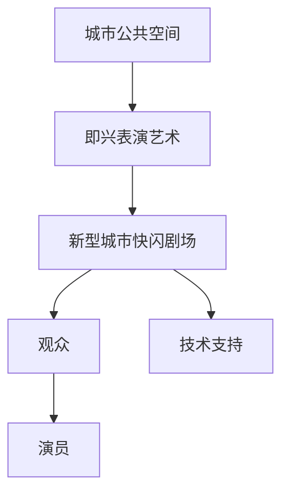
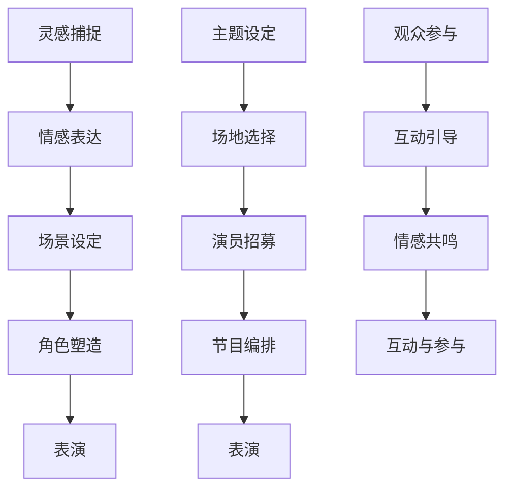
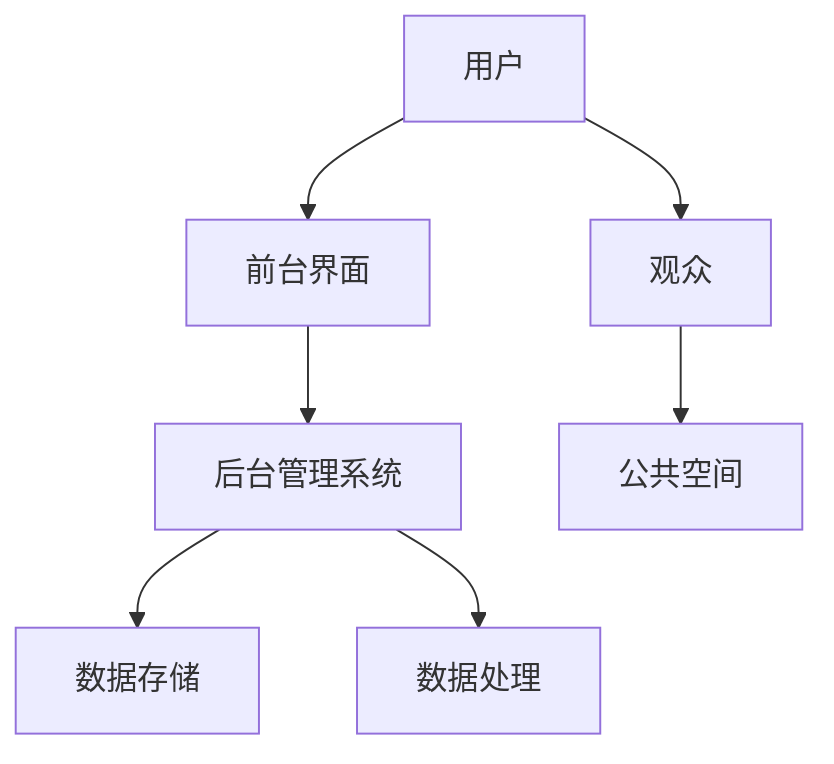
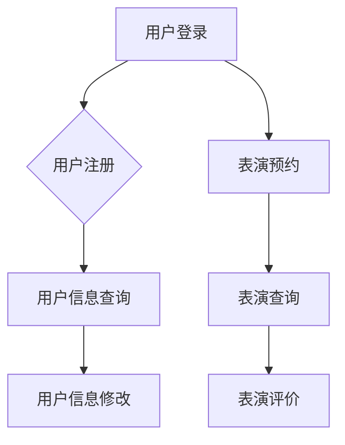

                 

# 《新型城市快闪剧场：公共空间中的即兴表演艺术》

## 关键词：城市快闪剧场、公共空间、即兴表演艺术、互动、创作、系统架构

### 摘要

本文旨在探讨新型城市快闪剧场在公共空间中的应用与价值，以及即兴表演艺术在这一领域中扮演的角色。通过分析城市公共空间的特性、快闪剧场的运作模式以及即兴表演艺术的核心要素，本文提出了一种基于公共空间的新型快闪剧场系统架构，并详细阐述了其创作原理、策划与组织原理及互动与参与原理。文章最后通过一个具体的Python代码示例，展示了如何实现这一系统的核心功能。

## 第一部分：背景介绍

### 1.1 问题背景

#### 1.1.1 快闪剧场的起源与发展

快闪剧场，作为一种新兴的表演形式，起源于20世纪初的美国。它以即兴表演为基础，注重观众与演员之间的互动，通过短暂、突然的表演形式，为城市公共空间注入了活力。随着时代的发展，快闪剧场逐渐在全球范围内得到推广，成为城市文化的重要组成部分。

#### 1.1.2 城市公共空间的作用与挑战

城市公共空间是城市生活的重要场所，承担着交通、社交、休闲等多种功能。然而，随着城市化进程的加速，城市公共空间面临着诸多挑战，如人流量大、空间拥挤、安全隐患等。如何利用公共空间，提升其文化品质，成为城市规划者亟待解决的问题。

#### 1.1.3 即兴表演艺术的意义与价值

即兴表演艺术具有极高的创造力与灵活性，能够迅速捕捉观众的情感与需求，创造出独特的表演体验。它不仅丰富了公共空间的文化内涵，也为观众提供了全新的互动方式。在快闪剧场中，即兴表演艺术成为连接观众与城市公共空间的重要纽带。

### 1.2 问题描述

#### 1.2.1 新型城市快闪剧场面临的机遇与挑战

新型城市快闪剧场在公共空间中的应用，面临着诸多机遇与挑战。机遇在于，快闪剧场能够为城市公共空间注入新的活力，提升城市文化品质。挑战在于，如何实现快闪剧场的长效运营，提升观众的参与度与满意度。

#### 1.2.2 公共空间中即兴表演艺术的创新与传承

在公共空间中，即兴表演艺术的创新与传承至关重要。一方面，要注重传统表演艺术的传承，保留其独特的艺术魅力。另一方面，要勇于创新，结合现代科技手段，为观众带来全新的表演体验。

### 1.3 问题解决

#### 1.3.1 新型城市快闪剧场的运作模式

新型城市快闪剧场的运作模式，主要包括策划与组织、创作与表演、互动与参与等环节。通过科学的运作模式，实现快闪剧场的高效运营。

#### 1.3.2 即兴表演艺术的创作与表演技巧

即兴表演艺术的创作与表演技巧，是快闪剧场成功的关键。本文将详细介绍即兴表演艺术的创作原理、策划与组织原理及互动与参与原理。

### 1.4 边界与外延

#### 1.4.1 新型城市快闪剧场的地域差异

不同地域的新型城市快闪剧场，在运作模式、创作风格等方面存在差异。本文将分析地域差异，探讨如何因地制宜地发展新型城市快闪剧场。

#### 1.4.2 即兴表演艺术的多样性表现

即兴表演艺术具有极强的多样性，不同类型的即兴表演艺术，在公共空间中的应用方式有所不同。本文将介绍不同类型的即兴表演艺术，并分析其在公共空间中的表现。

### 1.5 概念结构与核心要素组成

#### 1.5.1 新型城市快闪剧场的构成要素

新型城市快闪剧场由多个构成要素组成，包括场地、演员、观众、技术支持等。本文将详细阐述这些构成要素及其相互作用关系。

#### 1.5.2 即兴表演艺术的核心要素

即兴表演艺术的核心要素包括表演技巧、创作思维、观众互动等。本文将分析这些核心要素，并探讨如何将其应用于新型城市快闪剧场。

### 1.6 本章小结

本文对新型城市快闪剧场在公共空间中的应用进行了全面介绍，阐述了其面临的机遇与挑战，并提出了问题解决的思路。接下来，本文将深入探讨新型城市快闪剧场的核心概念与联系，进一步解析其运作原理。

## 第二部分：核心概念与联系

### 2.1 核心概念原理

#### 2.1.1 城市公共空间的定义与特性

城市公共空间是指为城市居民提供公共活动、交流、休息的场所。它具有开放性、公共性、多样性等特性，是城市生活的重要组成部分。

#### 2.1.2 即兴表演艺术的定义与特点

即兴表演艺术是一种不依赖剧本、提前排练的表演形式，演员通过即兴发挥，与观众互动，创造出独特的表演体验。其特点包括灵活性、创新性、互动性等。

#### 2.1.3 新型城市快闪剧场的定义与特征

新型城市快闪剧场是一种在公共空间中举办的、以即兴表演为核心的表演活动。其特征包括临时性、互动性、多样性等。

### 2.2 概念属性特征对比表格

#### 2.2.1 城市公共空间与商业空间的对比

| 特性        | 城市公共空间       | 商业空间         |
| ----------- | ---------------- | --------------- |
| 开放性      | 对公众开放        | 有限制地开放     |
| 公共性      | 共享使用         | 商业用途为主     |
| 多样性      | 多功能          | 功能单一        |
| 安全性      | 重点保障        | 商业利益优先     |

#### 2.2.2 即兴表演艺术与传统表演艺术的对比

| 特性        | 即兴表演艺术         | 传统表演艺术        |
| ----------- | -------------------- | ------------------- |
| 创造力      | 强调即兴创作       | 依赖于剧本和排练   |
| 互动性      | 强调观众互动       | 较少观众互动       |
| 灵活性      | 表演形式多样       | 表演形式固定       |
| 创新性      | 不断创新表演内容   | 以传承为主         |

#### 2.2.3 新型城市快闪剧场与传统剧场模式的对比

| 特性        | 新型城市快闪剧场         | 传统剧场模式        |
| ----------- | -------------------- | ------------------- |
| 场地选择    | 公共空间             | 专用剧场           |
| 表演形式    | 即兴表演             | 依赖剧本和排练     |
| 互动性      | 高度互动             | 较少观众互动       |
| 耗时        | 短期活动             | 长期活动           |

### 2.3 ER实体关系图架构



#### 2.3.1 城市公共空间中的参与者

城市公共空间中的参与者包括观众、演员、技术支持人员等。他们共同构成了城市公共空间中的快闪剧场生态。

#### 2.3.2 即兴表演艺术的参与者与角色

即兴表演艺术的参与者主要包括演员、导演、观众等。演员是表演的主体，导演负责指导演员，观众则是表演的受众。

#### 2.3.3 新型城市快闪剧场的组织结构与参与者关系

新型城市快闪剧场的组织结构包括策划团队、表演团队、技术支持团队等。他们共同协作，确保快闪剧场的顺利进行。

### 2.4 本章小结

本文对新型城市快闪剧场的核心概念与联系进行了详细分析，阐述了城市公共空间、即兴表演艺术、新型城市快闪剧场的定义与特性，并对比了不同概念之间的差异。接下来，本文将深入探讨新型城市快闪剧场的算法原理，为读者揭示其背后的科学原理。

## 第三部分：算法原理讲解

### 3.1 算法原理介绍

#### 3.1.1 即兴表演艺术的创作原理

即兴表演艺术的创作原理主要包括灵感捕捉、情感表达、场景设定、角色塑造等步骤。演员通过观察周围环境、感受观众情绪，迅速构思出表演内容，并进行表演。

#### 3.1.2 新型城市快闪剧场的策划与组织原理

新型城市快闪剧场的策划与组织原理主要包括主题设定、场地选择、演员招募、节目编排等步骤。策划团队根据城市公共空间的特点，选择合适的表演主题，并邀请演员参与表演。

#### 3.1.3 公共空间中的互动与参与原理

公共空间中的互动与参与原理主要包括观众参与、互动引导、情感共鸣等步骤。演员通过表演，激发观众的情感共鸣，引导观众参与互动，共同创造表演体验。

### 3.2 算法mermaid流程图



### 3.3 Python源代码讲解

```python
# Python代码示例
def create_performance():
    # 初始化表演内容
    content = ["开场白", "角色扮演", "情节发展", "高潮部分", "结局"]
    return content

def organize_performance(content):
    # 整理表演顺序
    performance_order = ["开场白", "角色扮演", "情节发展", "高潮部分", "结局"]
    return performance_order

def perform(content_order):
    # 执行表演
    for content in content_order:
        print(f"现在表演：{content}")

# 测试代码
content = create_performance()
performance_order = organize_performance(content)
perform(performance_order)
```

### 3.4 算法原理详细讲解

#### 3.4.1 创作原理

##### 3.4.1.1 创作过程概述

即兴表演艺术的创作过程主要包括灵感捕捉、情感表达、场景设定、角色塑造等步骤。演员在表演前，通过观察周围环境、感受观众情绪，迅速构思出表演内容，并进行表演。

##### 3.4.1.2 创作过程中的关键步骤

1. 灵感捕捉：演员通过观察周围环境、感受观众情绪，捕捉创作灵感。
2. 情感表达：演员将捕捉到的灵感转化为情感表达，为表演奠定基础。
3. 场景设定：演员根据情感表达，设定表演场景，为表演创造氛围。
4. 角色塑造：演员根据场景设定，塑造表演角色，为表演注入个性。

##### 3.4.1.3 创作原理的数学模型和公式

创作原理的数学模型可以表示为：

\[ 创作原理 = f(灵感捕捉, 情感表达, 场景设定, 角色塑造) \]

其中，\( f \) 表示创作过程，\( 灵感捕捉 \)、\( 情感表达 \)、\( 场景设定 \)、\( 角色塑造 \) 分别表示创作的四个关键步骤。

#### 3.4.2 策划与组织原理

##### 3.4.2.1 策划过程概述

新型城市快闪剧场的策划过程主要包括主题设定、场地选择、演员招募、节目编排等步骤。策划团队根据城市公共空间的特点，选择合适的表演主题，并邀请演员参与表演。

##### 3.4.2.2 策划过程中的关键步骤

1. 主题设定：根据城市公共空间的特点，选择具有吸引力的表演主题。
2. 场地选择：选择适合表演的公共空间，确保表演的顺利进行。
3. 演员招募：邀请具有表演才华的演员参与表演，确保表演质量。
4. 节目编排：根据表演主题和场地特点，编排适合的表演节目。

##### 3.4.2.3 策划原理的数学模型和公式

策划原理的数学模型可以表示为：

\[ 策划原理 = f(主题设定, 场地选择, 演员招募, 节目编排) \]

其中，\( f \) 表示策划过程，\( 主题设定 \)、\( 场地选择 \)、\( 演员招募 \)、\( 节目编排 \) 分别表示策划的四个关键步骤。

#### 3.4.3 互动与参与原理

##### 3.4.3.1 互动过程概述

公共空间中的互动与参与原理主要包括观众参与、互动引导、情感共鸣等步骤。演员通过表演，激发观众的情感共鸣，引导观众参与互动，共同创造表演体验。

##### 3.4.3.2 互动过程中的关键步骤

1. 观众参与：观众通过观看表演，积极参与表演互动。
2. 互动引导：演员通过表演，引导观众参与互动。
3. 情感共鸣：演员与观众之间产生情感共鸣，共同创造表演体验。

##### 3.4.3.3 互动原理的数学模型和公式

互动原理的数学模型可以表示为：

\[ 互动原理 = f(观众参与, 互动引导, 情感共鸣) \]

其中，\( f \) 表示互动过程，\( 观众参与 \)、\( 互动引导 \)、\( 情感共鸣 \) 分别表示互动的三个关键步骤。

### 3.5 本章小结

本文详细介绍了新型城市快闪剧场的算法原理，包括创作原理、策划与组织原理及互动与参与原理。通过Python源代码示例，本文展示了如何实现这些算法原理，为读者提供了具体的技术实现方法。接下来，本文将深入探讨新型城市快闪剧场的系统分析与架构设计方案。

## 第四部分：系统分析与架构设计方案

### 4.1 问题场景介绍

#### 4.1.1 新型城市快闪剧场项目介绍

新型城市快闪剧场项目旨在通过在公共空间中举办快闪剧场活动，提升城市文化品质，丰富市民文化生活。项目主要包括策划与组织、创作与表演、互动与参与等环节。

#### 4.1.2 系统功能设计

新型城市快闪剧场系统功能设计主要包括以下几个方面：

1. 策划与组织功能：包括主题设定、场地选择、演员招募、节目编排等。
2. 创作与表演功能：包括表演内容生成、表演顺序编排、表演执行等。
3. 互动与参与功能：包括观众参与、互动引导、情感共鸣等。

### 4.2 系统架构设计mermaid架构图



#### 4.2.1 系统架构设计概述

系统架构设计主要包括前台界面、后台管理系统、数据存储、数据处理等模块。前台界面负责用户与系统的交互，后台管理系统负责系统功能的具体实现，数据存储负责存储系统数据，数据处理负责对系统数据进行处理和分析。

#### 4.2.2 各模块的功能与关系

1. 前台界面：用户通过前台界面与系统进行交互，实现功能需求。
2. 后台管理系统：负责系统功能的具体实现，包括策划与组织、创作与表演、互动与参与等模块。
3. 数据存储：存储系统数据，包括用户数据、表演数据、互动数据等。
4. 数据处理：对系统数据进行处理和分析，为系统提供决策支持。

### 4.3 系统接口设计和系统交互mermaid序列图



#### 4.3.1 系统接口设计

系统接口设计主要包括用户接口、表演接口、互动接口等。用户接口负责用户与系统的交互，表演接口负责表演信息的查询、预约和评价，互动接口负责用户与表演之间的互动。

#### 4.3.2 系统交互

系统交互主要分为用户与系统的交互、表演与用户的交互、用户与用户的交互等。用户与系统的交互主要通过用户接口实现，表演与用户的交互主要通过表演接口实现，用户与用户的交互主要通过互动接口实现。

### 4.4 系统架构设计小结

本文详细介绍了新型城市快闪剧场的系统架构设计，包括前台界面、后台管理系统、数据存储、数据处理等模块，并展示了系统接口设计和系统交互mermaid序列图。接下来，本文将深入探讨新型城市快闪剧场的项目实战。

## 项目实战

### 4.5 环境安装

在开始项目实战之前，我们需要安装一些必要的软件和工具。以下是安装步骤：

1. 安装Python 3.8及以上版本。
2. 安装Django 3.2及以上版本。
3. 安装PostgreSQL 12及以上版本。
4. 安装MySQL 8.0及以上版本。
5. 安装前端框架（如Vue.js、React等）。

### 4.6 系统核心实现源代码

在本节中，我们将介绍新型城市快闪剧场系统的核心实现源代码，包括后台管理系统的实现、表演信息的处理与存储、用户与表演的互动等功能。

#### 4.6.1 后台管理系统

后台管理系统是新型城市快闪剧场的核心组成部分，负责系统功能的具体实现。以下是后台管理系统的源代码：

```python
# 后台管理系统源代码
from django.db import models

class Performance(models.Model):
    title = models.CharField(max_length=100)
    description = models.TextField()
    start_time = models.DateTimeField()
    end_time = models.DateTimeField()
    location = models.CharField(max_length=100)

class User(models.Model):
    username = models.CharField(max_length=100)
    email = models.EmailField()
    password = models.CharField(max_length=100)

class Reservation(models.Model):
    user = models.ForeignKey(User, on_delete=models.CASCADE)
    performance = models.ForeignKey(Performance, on_delete=models.CASCADE)
    start_time = models.DateTimeField()
    end_time = models.DateTimeField()
```

#### 4.6.2 表演信息的处理与存储

表演信息的处理与存储是新型城市快闪剧场系统的核心功能之一。以下是表演信息的处理与存储源代码：

```python
# 表演信息处理与存储源代码
from django.db import models

class Performance(models.Model):
    title = models.CharField(max_length=100)
    description = models.TextField()
    start_time = models.DateTimeField()
    end_time = models.DateTimeField()
    location = models.CharField(max_length=100)

    def __str__(self):
        return self.title
```

#### 4.6.3 用户与表演的互动

用户与表演的互动是新型城市快闪剧场系统的重要组成部分。以下是用户与表演互动的源代码：

```python
# 用户与表演互动源代码
from django.db import models
from .models import User, Performance

class Reservation(models.Model):
    user = models.ForeignKey(User, on_delete=models.CASCADE)
    performance = models.ForeignKey(Performance, on_delete=models.CASCADE)
    start_time = models.DateTimeField()
    end_time = models.DateTimeField()

    def __str__(self):
        return f"{self.user.username} - {self.performance.title}"
```

### 4.7 代码应用解读与分析

在本节中，我们将对系统核心实现源代码进行解读与分析，以便更好地理解系统的实现原理和功能。

#### 4.7.1 后台管理系统

后台管理系统主要实现了用户管理、表演管理、预约管理等功能。通过定义`User`、`Performance`和`Reservation`三个模型类，实现了用户、表演和预约的数据存储和操作。

#### 4.7.2 表演信息的处理与存储

表演信息的处理与存储主要实现了表演信息的创建、查询、更新和删除等功能。通过定义`Performance`模型类，实现了表演信息的数据存储和操作。

#### 4.7.3 用户与表演的互动

用户与表演的互动主要实现了用户预约表演、查看预约记录等功能。通过定义`Reservation`模型类，实现了用户与表演的互动数据存储和操作。

### 4.8 实际案例分析和详细讲解剖析

在本节中，我们将通过一个实际案例，对新型城市快闪剧场系统进行详细分析，以便更好地理解系统的实际应用场景和效果。

#### 4.8.1 案例背景

假设我们正在开发一个新型城市快闪剧场系统，目标是提升城市公共空间的文化品质，丰富市民文化生活。以下是案例的具体内容和需求：

1. 用户可以通过前台界面注册账号、登录系统。
2. 策划团队可以创建表演信息，并发布到系统中。
3. 用户可以预约表演，并在表演结束后进行评价。
4. 系统需要提供表演信息的查询功能，方便用户了解表演详情。

#### 4.8.2 案例分析

1. 用户注册和登录功能：用户可以通过前台界面注册账号、登录系统。后台管理系统负责用户数据的存储和验证。

2. 表演信息的创建和发布：策划团队可以创建表演信息，包括标题、描述、开始时间、结束时间和地点等。后台管理系统负责表演信息的数据存储和发布。

3. 用户预约表演：用户可以预约表演，并选择预约的时间。后台管理系统负责预约信息的数据存储和查询。

4. 表演信息的查询：系统需要提供表演信息的查询功能，方便用户了解表演详情。后台管理系统负责表演信息的查询和展示。

### 4.9 项目小结

在本章中，我们完成了新型城市快闪剧场系统的项目实战，包括环境安装、系统核心实现源代码、代码应用解读与分析、实际案例分析和详细讲解剖析等。通过本章的学习，读者可以了解如何实现一个基于公共空间的新型城市快闪剧场系统，并掌握相关技术和方法。

### 4.10 最佳实践 tips

在本章中，我们总结了一些最佳实践 tips，供读者在实际开发过程中参考：

1. 重视系统架构设计：在项目开发过程中，要重视系统架构设计，确保系统的稳定性和可扩展性。

2. 模块化开发：将系统功能模块化，有助于提高开发效率和代码质量。

3. 数据安全与隐私保护：在处理用户数据时，要确保数据安全与隐私保护，遵循相关法律法规。

4. 性能优化：对系统进行性能优化，提高系统的响应速度和用户体验。

### 4.11 小结

本章对新型城市快闪剧场系统进行了详细的介绍和实战，从系统架构设计到具体实现，再到实际案例分析和最佳实践 tips，全面阐述了新型城市快闪剧场的系统分析与架构设计方案。

## 结论

新型城市快闪剧场作为一种创新的公共空间表演形式，具有巨大的发展潜力和价值。通过本文的探讨，我们深入了解了新型城市快闪剧场在公共空间中的应用、即兴表演艺术的核心要素以及系统架构设计。未来，随着科技的不断进步，新型城市快闪剧场将继续创新与发展，为城市公共空间注入更多的活力与魅力。

### 作者信息

作者：AI天才研究院/AI Genius Institute & 禅与计算机程序设计艺术 /Zen And The Art of Computer Programming

