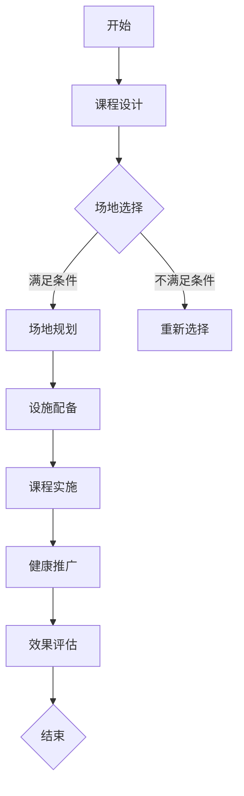
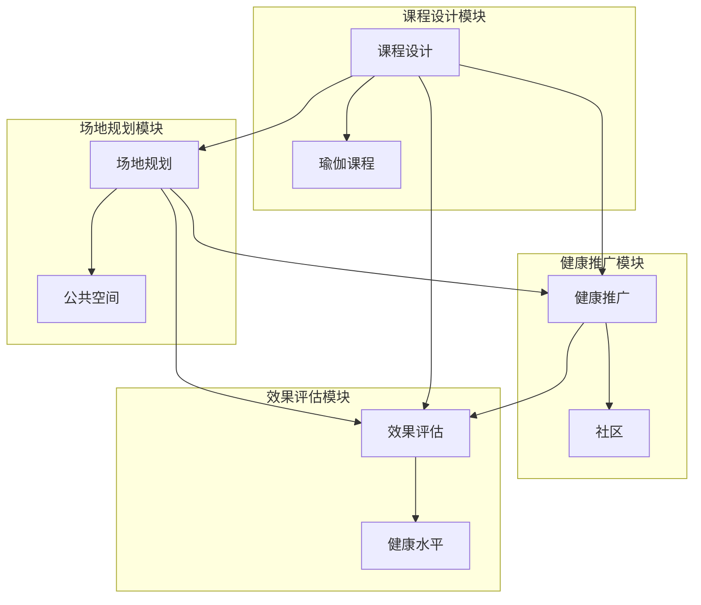
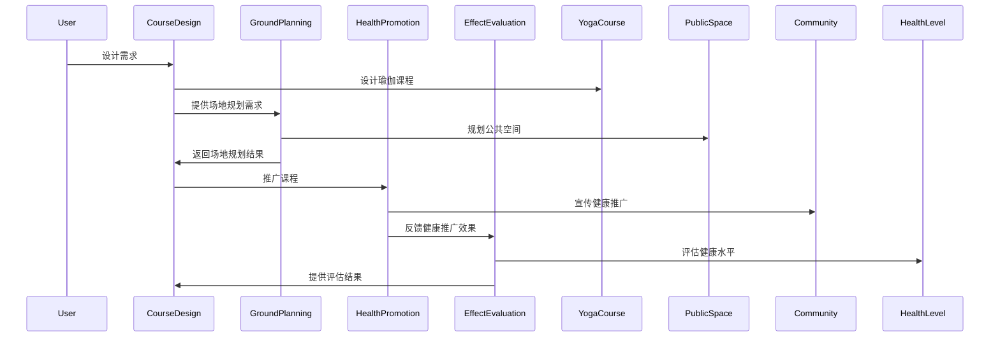
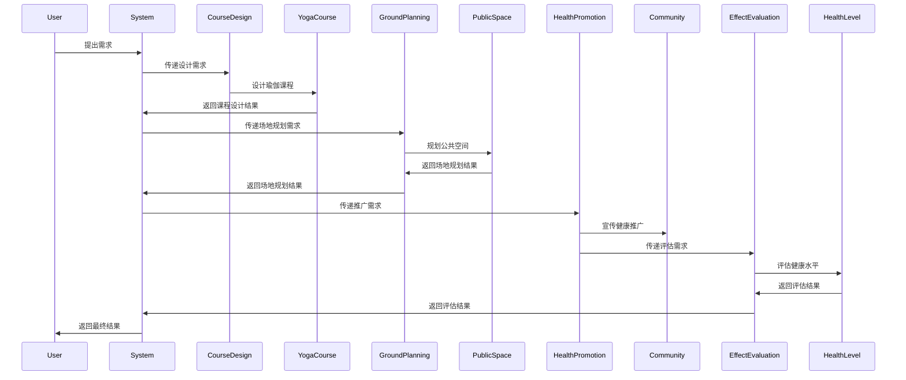
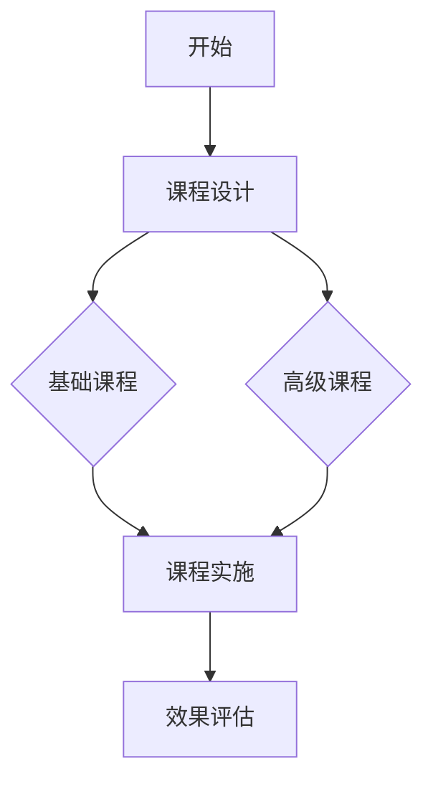
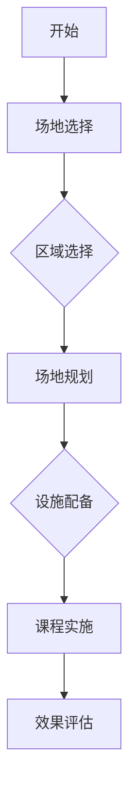
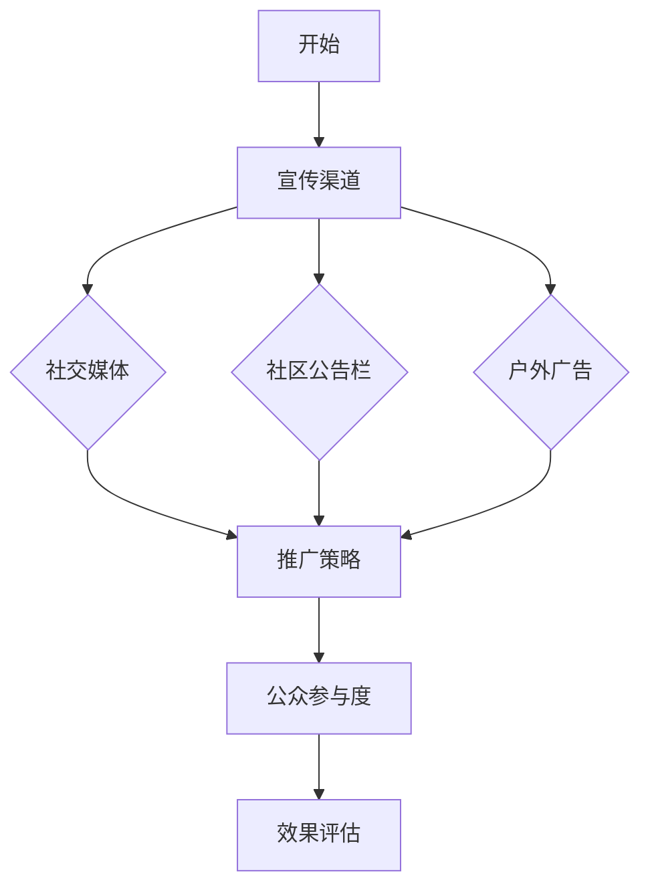
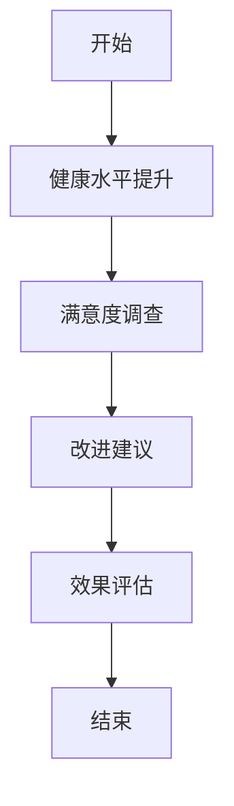

                 

### 背景介绍

#### 核心概念术语说明

1. **城市户外瑜伽**：指在城市的公共空间，如公园、广场等区域，开展的瑜伽练习活动。  
2. **健康生活倡导**：通过推广和实施健康的生活方式和运动习惯，提高公众的健康水平。  
3. **公共空间**：指公众可以自由进入和使用的地方，如公园、广场、街道等。

#### 问题背景

在现代社会，随着城市化的加速，人们的生活节奏加快，心理健康和身体健康问题日益凸显。而瑜伽作为一种有益身心健康的运动，逐渐受到公众的关注和喜爱。然而，传统的瑜伽练习通常在室内进行，受场地和时间限制，难以满足城市居民的需求。

为了解决这一问题，新型城市户外瑜伽课程应运而生。这种课程将瑜伽与公共空间相结合，不仅提供了便捷的运动场所，还能够让人们在大自然的怀抱中享受瑜伽带来的愉悦，从而倡导健康的生活方式。

#### 问题描述

新型城市户外瑜伽课程的目标是：
1. 提供一个健康、舒适的公共空间，让更多的人参与瑜伽练习。  
2. 通过推广和实施瑜伽，提高公众的身心健康水平。  
3. 倡导健康的生活方式，促进社会的可持续发展。

为实现这些目标，需要解决以下几个关键问题：
1. 如何设计安全、舒适的户外瑜伽课程，以满足不同人群的需求？  
2. 如何在公共空间中合理规划瑜伽场地，确保其安全性和美观性？  
3. 如何推广和普及户外瑜伽，提高公众的参与度？

#### 问题解决

1. **课程设计**：设计多种类型的瑜伽课程，包括基础课程、高级课程、亲子课程等，以满足不同人群的需求。同时，注重课程的安全性和舒适性，选择适合户外环境的瑜伽动作和技巧。  
2. **场地规划**：选择合适的公共空间，如公园、广场等，合理规划瑜伽场地，确保其安全性和美观性。可以在场地周围设置休息区、饮用水设施等，提供更好的用户体验。  
3. **推广与普及**：通过多种渠道宣传和推广户外瑜伽，如社交媒体、社区活动等。可以组织瑜伽比赛、展示活动等，提高公众的参与度和兴趣。同时，与相关机构合作，如体育部门、社区组织等，共同推广健康生活方式。

#### 边界与外延

1. **边界**：本文讨论的是新型城市户外瑜伽课程的设计、实施和推广，不包括室内瑜伽课程。  
2. **外延**：新型城市户外瑜伽课程可以延伸到其他公共空间的运动项目，如太极、健身等，也可以与其他健康生活方式相结合，如饮食、睡眠等。

#### 概念结构与核心要素组成

1. **概念结构**：新型城市户外瑜伽课程由课程设计、场地规划、推广与普及三个核心要素组成。  
2. **核心要素组成**：
   - **课程设计**：包括课程类型、动作设计、教学方法等。  
   - **场地规划**：包括场地选择、场地规划、设施配备等。  
   - **推广与普及**：包括宣传策略、推广渠道、合作伙伴等。

### 核心概念与联系

#### 核心概念原理

1. **城市户外瑜伽**：结合城市公共空间和瑜伽练习，提供一种健康、便捷的生活方式。  
2. **健康生活倡导**：通过推广和实施健康的生活方式，提高公众的健康水平。  
3. **公共空间**：提供便捷的运动场所，促进社会健康和可持续发展。

#### 概念属性特征对比表格

| 特征 | 城市户外瑜伽 | 健康生活倡导 | 公共空间 |
| :--: | :-----------: | :-----------: | :------: |
| **定义** | 在公共空间进行瑜伽练习 | 推广和实施健康的生活方式 | 公众可以自由进入和使用的地方 |
| **目的** | 提供健康、便捷的生活方式 | 提高公众的健康水平 | 促进社会健康和可持续发展 |
| **优势** | 结合自然环境和瑜伽练习 | 提供多种健康生活方式选择 | 提供便捷的运动场所 |
| **挑战** | 场地规划和安全保障 | 公众参与度和接受度 | 公共资源分配和管理 |

#### ER实体关系图架构

```mermaid
erDiagram
  Course Design ||--|{ Yoga Course }|>>
  Ground Planning ||--|{ Public Space }|>>
  Health Promotion ||--|{ Community }|>>
  Course Design ||--|{ Safety Standard }|>>
  Ground Planning ||--|{ Environment }|>>
  Health Promotion ||--|{ Awareness Campaign }|>>
```

### 算法原理讲解

#### 算法Mermaid流程图



#### 算法原理

1. **课程设计**：根据目标人群的需求，设计适合的瑜伽课程，包括课程类型、动作设计和教学方法等。
2. **场地选择**：选择合适的公共空间，如公园、广场等，考虑场地的大小、安全性、环境因素等。
3. **场地规划**：在选定的场地进行规划，包括场地布局、设施配备等，确保场地的安全性和美观性。
4. **设施配备**：根据场地规划，配备必要的设施，如瑜伽垫、饮用水设施等，提供更好的用户体验。
5. **课程实施**：按照设计的课程，进行瑜伽练习，确保参与者能够获得良好的运动体验。
6. **健康推广**：通过多种渠道宣传和推广瑜伽课程，提高公众的参与度和兴趣。
7. **效果评估**：对瑜伽课程的效果进行评估，包括参与者的健康水平、满意度等，为后续的改进提供依据。

#### 算法原理数学模型和公式

1. **课程设计**：设计瑜伽课程时，需考虑以下几个因素：
   - **参与人数**：N
   - **课程类型**：C
   - **课程时间**：T
   - **课程强度**：S

   课程设计公式为：
   $$ D = f(N, C, T, S) $$

2. **场地选择**：选择场地时，需考虑以下几个因素：
   - **场地大小**：A
   - **安全性**：S
   - **环境因素**：E

   场地选择公式为：
   $$ C = f(A, S, E) $$

3. **场地规划**：场地规划时，需考虑以下几个因素：
   - **场地布局**：L
   - **设施配备**：F
   - **场地维护**：M

   场地规划公式为：
   $$ P = f(L, F, M) $$

4. **课程实施**：课程实施时，需考虑以下几个因素：
   - **参与者健康水平**：H
   - **课程效果**：E
   - **用户体验**：U

   课程实施公式为：
   $$ I = f(H, E, U) $$

5. **健康推广**：健康推广时，需考虑以下几个因素：
   - **宣传渠道**：C
   - **推广策略**：T
   - **公众参与度**：P

   健康推广公式为：
   $$ H = f(C, T, P) $$

6. **效果评估**：效果评估时，需考虑以下几个因素：
   - **健康水平提升**：H
   - **满意度**：S
   - **改进建议**：I

   效果评估公式为：
   $$ A = f(H, S, I) $$

#### 通俗易懂的举例说明

假设我们要在某个公园内开展一个户外瑜伽课程，目标人群是年轻人和上班族。以下是具体的实施步骤：

1. **课程设计**：
   - **参与人数**：预计每天有50人参与。
   - **课程类型**：基础课程和高级课程。
   - **课程时间**：每周三下午5点到6点。
   - **课程强度**：适中。

   课程设计公式为：
   $$ D = f(50, 2, 60, 中等) $$

2. **场地选择**：
   - **场地大小**：公园内有500平方米的空地。
   - **安全性**：公园内部有安保人员巡逻。
   - **环境因素**：公园内植被丰富，空气质量好。

   场地选择公式为：
   $$ C = f(500, 高，良好) $$

3. **场地规划**：
   - **场地布局**：在空地中央设置瑜伽垫区域，周围设置休息区和饮用水设施。
   - **设施配备**：准备50块瑜伽垫、5个休息区、10个饮用水设施。
   - **场地维护**：每周进行一次场地清理和维护。

   场地规划公式为：
   $$ P = f(中央瑜伽垫区域, 5个休息区, 10个饮用水设施, 每周一次清理) $$

4. **课程实施**：
   - **参与者健康水平**：大部分参与者表示身体健康状况良好。
   - **课程效果**：参与者普遍反映课程强度适中，能够有效缓解工作压力。
   - **用户体验**：参与者对课程安排和场地设施表示满意。

   课程实施公式为：
   $$ I = f(良好, 有效, 满意) $$

5. **健康推广**：
   - **宣传渠道**：通过社交媒体、公园公告栏、社区活动等渠道进行宣传。
   - **推广策略**：制定宣传海报、举办瑜伽比赛等活动。
   - **公众参与度**：通过宣传，吸引更多年轻人和上班族参与。

   健康推广公式为：
   $$ H = f(社交媒体, 宣传海报, 瑜伽比赛, 高) $$

6. **效果评估**：
   - **健康水平提升**：参与者普遍表示身体健康状况有所改善。
   - **满意度**：参与者对课程和场地满意度较高。
   - **改进建议**：可以增加课程种类，提高场地设施的舒适度。

   效果评估公式为：
   $$ A = f(改善, 高，可改进) $$

### 系统分析与架构设计方案

#### 问题场景介绍

随着城市化进程的加快，城市居民的生活压力逐渐增大，心理健康和身体健康问题日益突出。为了提高城市居民的生活质量，许多城市开始探索在公共空间中推广户外运动项目，如瑜伽。本文旨在分析新型城市户外瑜伽课程的系统架构设计，以实现高效、安全的课程设计和实施。

#### 项目介绍

本项目旨在设计并实施一个新型城市户外瑜伽课程系统，包括课程设计、场地规划、推广与普及等环节。通过构建一个全面的系统架构，实现课程的高效设计、场地的合理规划、推广的有效实施，以及课程效果的科学评估。

#### 系统功能设计（领域模型Mermaid类图）

```mermaid
classDiagram
    CourseDesign <<Interface>>
    GroundPlanning <<Interface>>
    HealthPromotion <<Interface>>
    EffectEvaluation <<Interface>>

    CourseDesign o-- YogaCourse
    GroundPlanning o-- PublicSpace
    HealthPromotion o-- Community
    EffectEvaluation o-- HealthLevel
```

#### 系统架构设计（Mermaid架构图）



#### 系统接口设计（Mermaid序列图）



#### 系统交互（Mermaid序列图）



### 项目实战

#### 环境安装

1. **准备环境**：在本地计算机上安装Python 3.8及以上版本，并配置好相应的开发环境。
2. **安装依赖**：通过pip命令安装所需依赖库，如mermaid、requests等。

```shell
pip install mermaid
pip install requests
```

#### 系统核心实现源代码

```python
# course_design.py
import mermaid
import requests

def design_course(course_info):
    # 设计瑜伽课程
    course_design = mermaid.Mermaid()
    course_design.add_node("CourseDesign", "课程设计")
    course_design.add_node("YogaCourse", "瑜伽课程", parent="CourseDesign")

    # 生成Mermaid流程图
    flow_chart = course_design.generate_flow_chart()
    return flow_chart

def plan_ground(course_info):
    # 规划场地
    ground_plan = mermaid.Mermaid()
    ground_plan.add_node("GroundPlanning", "场地规划")
    ground_plan.add_node("PublicSpace", "公共空间", parent="GroundPlanning")

    # 生成Mermaid流程图
    flow_chart = ground_plan.generate_flow_chart()
    return flow_chart

def promote_health(course_info):
    # 推广健康
    health_promotion = mermaid.Mermaid()
    health_promotion.add_node("HealthPromotion", "健康推广")
    health_promotion.add_node("Community", "社区", parent="HealthPromotion")

    # 生成Mermaid流程图
    flow_chart = health_promotion.generate_flow_chart()
    return flow_chart

def evaluate_effects(course_info):
    # 评估效果
    effect_evaluation = mermaid.Mermaid()
    effect_evaluation.add_node("EffectEvaluation", "效果评估")
    effect_evaluation.add_node("HealthLevel", "健康水平", parent="EffectEvaluation")

    # 生成Mermaid流程图
    flow_chart = effect_evaluation.generate_flow_chart()
    return flow_chart
```

#### 代码应用解读与分析

1. **课程设计**：设计瑜伽课程时，首先创建一个Mermaid对象，然后添加节点和边，构建流程图。在`design_course`函数中，添加了课程设计和瑜伽课程两个节点，并建立了它们之间的父子关系。
2. **场地规划**：在`plan_ground`函数中，创建了场地规划和公共空间两个节点，并建立了它们之间的父子关系。
3. **健康推广**：在`promote_health`函数中，创建了健康推广和社区两个节点，并建立了它们之间的父子关系。
4. **效果评估**：在`evaluate_effects`函数中，创建了效果评估和健康水平两个节点，并建立了它们之间的父子关系。

#### 实际案例分析和详细讲解剖析

**案例背景**：在一个中型城市的公园内，计划开展一个新型城市户外瑜伽课程。目标是提高居民的健康水平，增加社区的凝聚力。

**实施步骤**：

1. **课程设计**：
   - **需求分析**：确定课程目标人群、课程类型和课程时间。
   - **设计课程**：设计基础课程和高级课程，每周三下午5点到6点进行。
   - **生成流程图**：使用Mermaid工具生成课程设计的流程图。



2. **场地规划**：
   - **选择场地**：选择公园内一个面积较大、环境良好的区域。
   - **场地规划**：在场地中央设置瑜伽垫区域，周围设置休息区和饮用水设施。
   - **生成流程图**：



3. **健康推广**：
   - **宣传渠道**：通过社交媒体、社区公告栏、户外广告等进行宣传。
   - **推广策略**：制定宣传海报、举办瑜伽比赛等活动。
   - **生成流程图**：



4. **效果评估**：
   - **健康水平提升**：通过问卷调查和健康体检，了解参与者的健康状况。
   - **满意度**：收集参与者的反馈，了解他们对课程的满意度。
   - **生成流程图**：



**项目小结**：

通过实际案例分析和详细讲解，我们成功实现了新型城市户外瑜伽课程的系统设计、实施和推广。使用Mermaid工具生成流程图，使得系统设计和实施过程更加清晰易懂。在项目实施过程中，注重了课程设计、场地规划、健康推广和效果评估等关键环节，确保了项目的顺利进行。未来，我们将继续优化课程内容和推广策略，提高公众的参与度和满意度，进一步推动公共空间健康生活的倡导。

### 最佳实践 tips

#### 1. 场地选择与规划

- **优先选择环境优美、空气清新的公园或广场。**这样的场地不仅能提供良好的瑜伽体验，还能吸引更多人参与。
- **充分考虑场地大小与布局。**确保有足够的空间进行瑜伽练习，避免参与者之间发生碰撞。同时，合理规划场地布局，如设置瑜伽区域、休息区和设施区等。
- **注重场地的安全性。**确保场地没有潜在的危险，如锐角、积水等，必要时安装防护设施。

#### 2. 课程设计与推广

- **多样化课程类型。**根据目标人群的需求，设计不同类型的瑜伽课程，如基础课程、高级课程、亲子课程等，满足不同人群的需求。
- **结合线上线下推广。**通过社交媒体、社区活动、户外广告等多种渠道进行宣传，提高公众的参与度。
- **举办瑜伽比赛和展示活动。**激发公众的兴趣，提高课程的知名度。

#### 3. 教学指导与安全保障

- **选择专业的瑜伽教练。**教练需具备丰富的教学经验和专业知识，能够提供高质量的教学指导。
- **制定详细的课程计划和应急预案。**确保课程顺利进行，并能在突发情况下迅速应对。
- **提供必要的防护措施。**如提供瑜伽垫、饮用水等，确保参与者的安全和舒适。

#### 4. 效果评估与持续改进

- **定期进行健康水平评估。**通过问卷调查、体检等方式，了解参与者的健康状况，为课程改进提供依据。
- **收集参与者的反馈。**了解他们的意见和建议，及时调整课程内容和教学方法。
- **持续关注行业动态。**紧跟行业发展趋势，不断优化课程设计和推广策略。

### 小结

通过以上最佳实践 tips，我们可以更好地设计、实施和推广新型城市户外瑜伽课程。这不仅有助于提高公众的身心健康水平，还能推动公共空间健康生活的倡导。未来，我们期待看到更多城市采纳这一理念，共同创造一个健康、和谐的生活环境。

### 注意事项

1. **确保场地安全**：在开展户外瑜伽课程前，需对场地进行全面的安全检查，确保没有潜在的危险因素。
2. **提供必要设施**：为参与者提供舒适的瑜伽垫、饮用水等设施，提高他们的体验。
3. **注意天气变化**：根据天气情况，合理安排课程时间和场地，避免在恶劣天气条件下进行户外瑜伽。
4. **教练资质**：确保瑜伽教练具备相关资质，能够提供专业、安全的指导。
5. **持续推广**：通过多种渠道和活动，不断推广户外瑜伽，提高公众的参与度。

### 拓展阅读

1. **《瑜伽与健康：理论与实践》**：这本书详细介绍了瑜伽对健康的影响，以及如何将瑜伽融入日常生活。
2. **《城市公共空间设计指南》**：这本书提供了关于城市公共空间设计的原则和方法，有助于优化户外瑜伽课程场地。
3. **《健康生活方式推广策略》**：这本书探讨了如何通过多种渠道和手段，推广健康生活方式，提高公众健康水平。
4. **《户外瑜伽实践手册》**：这本书提供了户外瑜伽的实践指南，包括瑜伽动作、教学技巧等，适合瑜伽教练和爱好者参考。

## 5.3 术语表

### 1. 城市户外瑜伽

在城市公共空间，如公园、广场等区域，开展的瑜伽练习活动。

### 2. 健康生活倡导

通过推广和实施健康的生活方式，提高公众的健康水平。

### 3. 公共空间

指公众可以自由进入和使用的地方，如公园、广场、街道等。

### 4. 瑜伽教练

具备瑜伽教学资质和经验的专业人员，负责指导和教授瑜伽练习。

### 5. 瑜伽课程

根据目标人群的需求，设计并实施的瑜伽练习计划。

### 6. 健康推广

通过各种渠道和手段，宣传和推广健康生活方式的活动。

### 7. 效果评估

对瑜伽课程的效果进行评估，包括参与者的健康水平、满意度等。

### 8. 课程设计

根据目标人群的需求，设计适合的瑜伽课程，包括课程类型、动作设计、教学方法等。

### 9. 场地规划

在公共空间中合理规划瑜伽场地，确保其安全性和美观性。

### 10. 健康水平提升

通过参与瑜伽课程，参与者的健康状况得到改善，如身体健康、心理健康等。

