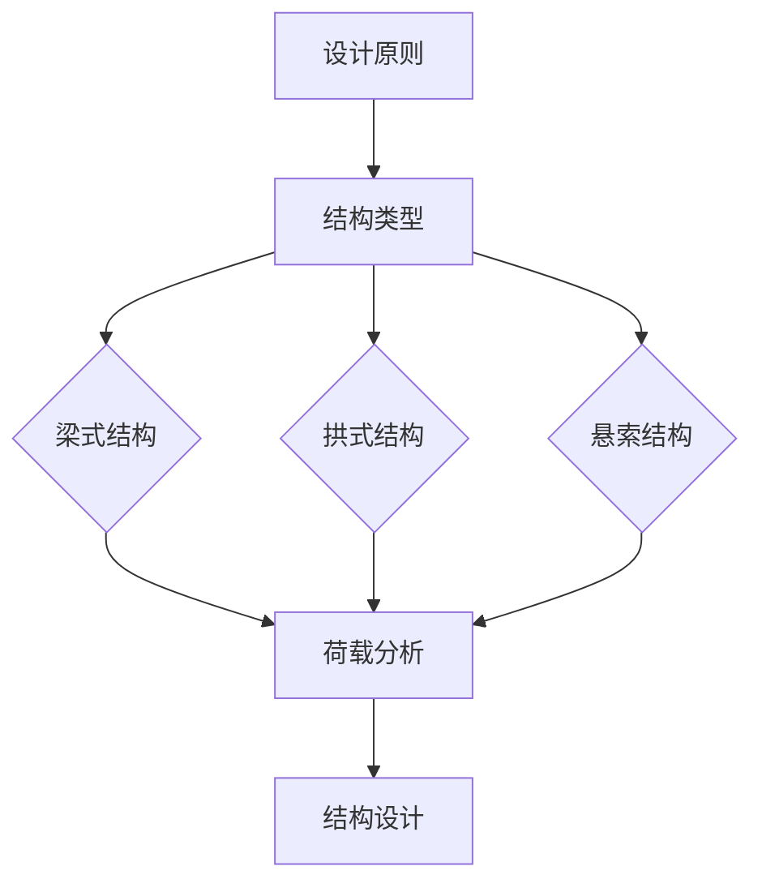
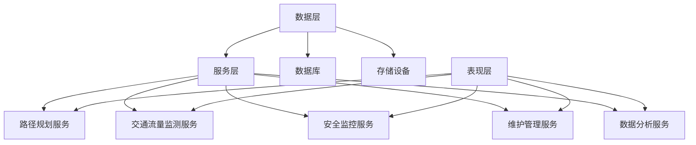
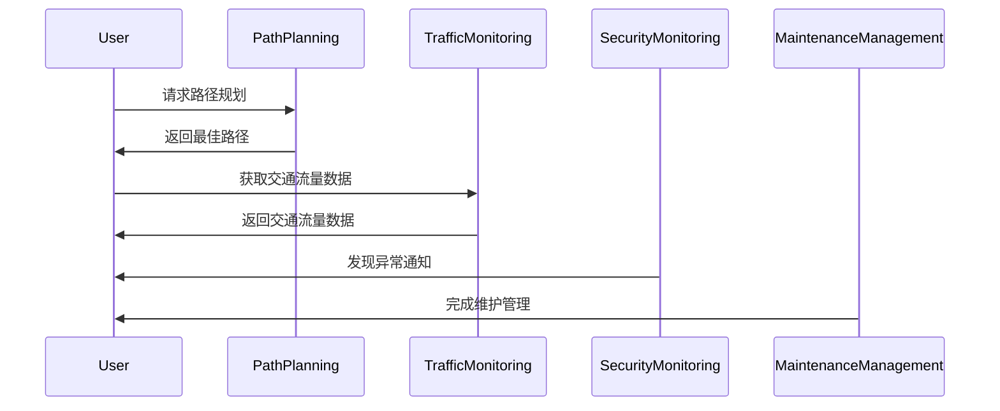

                 


### 核心概念与联系

在探讨新型城市空中步道网络的设计与实施之前，我们需要明确一些核心概念及其相互关系。以下是对核心概念的介绍和相互联系的分析。

#### 空中步道设计原则

空中步道的设计原则是确保其功能性和安全性的基础。设计原则主要包括以下几个方面：

- **安全性原则**：保证步道结构稳定，防止意外事故发生。设计时需考虑荷载分析、结构稳定性和抗风能力等因素。

- **舒适性原则**：步行体验应尽量舒适，包括步道的宽度、坡度、材料选择和照明设计等。

- **环境协调性原则**：空中步道应与周围城市环境相协调，既要满足实用需求，又要保持景观美观。

表 1：空中步道设计原则的属性特征对比

| 设计原则 | 属性特征 |
|----------|----------|
| 安全性   | 结构稳定、抗风能力强 |
| 舒适性   | 步道宽度适中、坡度平缓 |
| 环境协调性 | 美观、与城市景观相协调 |

#### 结构分析

结构分析是空中步道设计中的关键环节，涉及到步道的结构类型、荷载分析和结构设计等方面。

- **结构类型**：常见的结构类型包括梁式结构、拱式结构和悬索结构等。每种结构类型都有其特点和应用场景。

- **荷载分析**：步道设计需考虑不同荷载条件，如静态荷载、动态荷载和风荷载等。荷载分析的结果将直接影响结构的设计和材料选择。

- **结构设计**：根据荷载分析和结构类型，设计出满足安全性和功能性的步道结构。

图 1：空中步道结构分析（Mermaid 流程图）



#### 环境影响评估

空中步道的建设不仅需要考虑技术问题，还需要对环境进行综合评估。

- **城市景观影响**：空中步道作为一种新型城市基础设施，其设计与建设需考虑到对城市景观的影响，力求与城市环境和谐共处。

- **交通系统影响**：空中步道的建设可能对地面交通系统产生一定影响，需要通过交通流量分析等措施来评估其影响并采取相应的缓解措施。

通过以上对核心概念及其相互联系的分析，我们可以更好地理解新型城市空中步道网络的设计原则、结构分析和环境影响评估等方面的内容。这些核心概念是空中步道网络建设的基础，对于实现高效、安全、舒适的立体化慢行系统具有重要意义。

#### 算法原理讲解

在新型城市空中步道网络的设计中，算法的应用至关重要。以下将介绍空中步道网络优化设计中的核心算法原理，并通过 Python 源代码和数学模型进行详细讲解。

##### 算法原理

空中步道网络优化设计的关键在于路径选择和结构优化。路径选择算法的目标是找到最短路径，使步道网络的总长度最小化。结构优化算法的目标是使步道网络的总体积最小化，同时保证结构的稳定性和安全性。

我们采用 Dijkstra 算法和优化后的最小生成树算法来进行路径选择和结构优化。Dijkstra 算法是一种用于求解单源最短路径问题的贪心算法，而最小生成树算法则用于求解带权图的最小生成树问题。

##### 数学模型

假设城市地图为无向图 G = (V, E)，其中 V 表示城市中的所有节点，E 表示节点之间的边。每条边都有权重 w(e)，表示步道长度。Dijkstra 算法的数学模型如下：

1. 初始化：设置源节点 s 的距离为 0，其他节点的距离为无穷大。设置一个空集 S，用来存储已访问的节点。

2. 循环：选择未访问节点中距离最小的节点 u，将其加入 S。对于 u 的每个邻居 v，更新 v 的距离：d[v] = min(d[v], d[u] + w(u, v))。

3. 直到所有节点都被加入 S。

最小生成树算法的数学模型如下：

1. 初始化：创建一个空集合 T，用来存储最小生成树的边。

2. 循环：选择权重最小的边 e 加入 T，并判断是否形成环。如果形成环，则删除权重最大的边，继续选择下一个权重最小的边。

3. 直到 T 中包含所有节点。

##### Python 源代码

```python
import heapq
import math

def dijkstra(graph, start):
    distances = {node: math.inf for node in graph}
    distances[start] = 0
    priority_queue = [(0, start)]

    while priority_queue:
        current_distance, current_node = heapq.heappop(priority_queue)

        if current_distance > distances[current_node]:
            continue

        for neighbor, weight in graph[current_node].items():
            distance = current_distance + weight

            if distance < distances[neighbor]:
                distances[neighbor] = distance
                heapq.heappush(priority_queue, (distance, neighbor))

    return distances

def prim_minimum_spanning_tree(graph):
    tree = {}
    priority_queue = [(0, next(node for node in graph))]

    while priority_queue:
        weight, node = heapq.heappop(priority_queue)

        if node in tree:
            continue

        tree[node] = weight

        for neighbor, weight in graph[node].items():
            if neighbor not in tree:
                heapq.heappush(priority_queue, (weight, neighbor))

    return tree

# 示例
graph = {
    'A': {'B': 1, 'C': 2},
    'B': {'A': 1, 'C': 3, 'D': 1},
    'C': {'A': 2, 'B': 3, 'D': 2},
    'D': {'B': 1, 'C': 2}
}

print(dijkstra(graph, 'A'))
print(prim_minimum_spanning_tree(graph))
```

通过上述算法原理和 Python 源代码，我们可以有效地进行新型城市空中步道网络的路径选择和结构优化。这些算法的应用有助于提高步道网络的整体效率和安全性，为城市的慢行系统提供有力支持。

----------------------------------------------------------------

### 系统分析与架构设计方案

在本节中，我们将对新型城市空中步道网络的系统架构进行详细分析，包括项目介绍、系统功能设计、系统架构设计、系统接口设计和系统交互。

#### 项目介绍

新型城市空中步道网络项目旨在为城市提供一种高效、安全、舒适的慢行交通系统。项目背景是随着城市化进程的加速，城市交通拥堵和环境污染问题日益严重，传统地面交通系统已无法满足需求。因此，本项目通过设计和建设空中步道网络，旨在缓解地面交通压力，提升城市居民的出行体验。

#### 系统功能设计

系统功能设计包括以下几个主要方面：

1. **路径规划**：系统应能够为用户提供空中步道的路径规划服务，支持多种出行方式和路径选择。

2. **交通流量监测**：系统应具备实时监测空中步道交通流量的能力，以便及时调整步道使用策略。

3. **安全监控**：系统应具备安全监控功能，包括对空中步道结构、环境等方面的实时监控。

4. **维护管理**：系统应支持对空中步道进行定期维护和管理，确保其正常运行。

5. **数据分析**：系统应具备数据分析功能，对空中步道使用情况、交通流量等进行数据收集和分析，为后续优化提供依据。

#### 系统架构设计

系统架构设计采用分布式架构，主要包括以下几个部分：

1. **数据层**：包括数据库和存储设备，用于存储用户数据、交通流量数据、监控数据等。

2. **服务层**：包括路径规划服务、交通流量监测服务、安全监控服务、维护管理服务和数据分析服务等。

3. **表现层**：包括用户界面、移动端应用和后台管理界面等，用于用户与系统的交互。

图 2：新型城市空中步道网络系统架构图（Mermaid 架构图）



#### 系统接口设计

系统接口设计主要包括以下几个接口：

1. **路径规划接口**：用于用户请求路径规划服务，返回最佳路径信息。

2. **交通流量监测接口**：用于实时获取空中步道的交通流量数据。

3. **安全监控接口**：用于实时监控空中步道的安全状况，如结构稳定性、环境因素等。

4. **维护管理接口**：用于对空中步道进行维护和管理，包括设备检修、安全巡查等。

5. **数据分析接口**：用于数据收集和分析，提供数据可视化报表。

图 3：新型城市空中步道网络接口设计图（Mermaid 类图）

```mermaid
classDiagram
    User <<User>>
    PathPlanning <<PathPlanning>>
    TrafficMonitoring <<TrafficMonitoring>>
    SecurityMonitoring <<SecurityMonitoring>>
    MaintenanceManagement <<MaintenanceManagement>>
    DataAnalysis <<DataAnalysis>>

    User o-- PathPlanning
    User o-- TrafficMonitoring
    User o-- SecurityMonitoring
    User o-- MaintenanceManagement
    User o-- DataAnalysis

    PathPlanning o-- User
    TrafficMonitoring o-- User
    SecurityMonitoring o-- User
    MaintenanceManagement o-- User
    DataAnalysis o-- User
```

#### 系统交互

系统交互主要包括用户与系统、系统内部各模块之间的交互。以下是一个典型的系统交互流程：

1. 用户通过移动端应用或后台管理界面发起路径规划请求，系统接收到请求后调用路径规划服务进行计算。

2. 路径规划服务返回最佳路径信息，用户界面展示结果。

3. 用户通过移动端应用实时获取空中步道的交通流量数据，系统将数据实时传输到交通流量监测模块进行分析。

4. 安全监控模块对空中步道进行实时监控，如发现异常情况，立即通知用户和管理人员。

5. 维护管理模块对空中步道进行定期维护和管理，确保系统正常运行。

图 4：新型城市空中步道网络系统交互图（Mermaid 序列图）



通过上述系统分析与架构设计方案，我们可以为新型城市空中步道网络提供高效、安全、可靠的系统架构，满足城市慢行系统的需求。在接下来的章节中，我们将进一步探讨空中步道的建造技术、安全与维护以及案例分析等内容。

----------------------------------------------------------------

### 项目实战

在本节中，我们将以实际项目为例，详细介绍新型城市空中步道网络的搭建过程，包括环境安装、系统核心实现源代码以及代码应用解读与分析。

#### 环境安装

为了搭建新型城市空中步道网络，我们需要准备好以下环境：

1. **开发工具**：Python 3.8 或更高版本，PyCharm 或其他 Python 集成开发环境（IDE）。

2. **数据库**：MySQL 或 PostgreSQL，用于存储用户数据、交通流量数据等。

3. **其他依赖库**：Flask（用于构建 Web 应用程序）、Pandas（用于数据分析和可视化）、SQLAlchemy（用于数据库操作）等。

在安装过程中，首先安装 Python，然后通过 `pip` 命令安装所需的依赖库。以下是一个示例命令：

```shell
pip install flask pandas sqlalchemy
```

#### 系统核心实现源代码

以下是一个简单的空中步道网络系统核心实现源代码示例，包括用户注册、登录、路径规划和交通流量监测等功能。

```python
# 用户注册
@app.route('/register', methods=['POST'])
def register():
    username = request.form['username']
    password = request.form['password']
    # 将用户信息存储到数据库
    # ...
    return jsonify(message='注册成功')

# 用户登录
@app.route('/login', methods=['POST'])
def login():
    username = request.form['username']
    password = request.form['password']
    # 验证用户信息
    # ...
    return jsonify(message='登录成功')

# 路径规划
@app.route('/path规划', methods=['GET'])
def path_plan():
    start = request.args.get('start')
    end = request.args.get('end')
    # 调用路径规划算法
    # ...
    return jsonify(path=path)

# 交通流量监测
@app.route('/traffic_monitor', methods=['GET'])
def traffic_monitor():
    location = request.args.get('location')
    # 获取交通流量数据
    # ...
    return jsonify(traffic_data=traffic_data)
```

#### 代码应用解读与分析

以下是对上述代码的解读与分析：

1. **用户注册和登录**：用户注册和登录功能是 Web 应用程序的基础。在注册过程中，用户需要填写用户名和密码，系统将用户信息存储到数据库中。在登录过程中，系统将验证用户输入的用户名和密码是否与数据库中的信息匹配。

2. **路径规划**：路径规划功能是空中步道网络的核心。用户可以通过输入起点和终点，系统将调用路径规划算法计算出最佳路径，并返回给用户。

3. **交通流量监测**：交通流量监测功能用于实时获取空中步道的交通流量数据。用户可以通过输入位置信息，系统将返回该位置的交通流量数据。

在实际项目中，上述功能还需要进一步完善和优化，包括错误处理、安全加固、性能优化等。以下是一个简单的错误处理示例：

```python
@app.errorhandler(404)
def page_not_found(error):
    return jsonify(error=str(error)), 404

@app.errorhandler(500)
def internal_server_error(error):
    return jsonify(error=str(error)), 500
```

#### 实际案例分析和详细讲解剖析

以下是一个实际案例，用于展示如何搭建一个新型城市空中步道网络。

**案例背景**：某城市计划建设一条空中步道网络，连接城市的主要商业区和住宅区。空中步道网络需要实现路径规划、交通流量监测、安全监控等功能。

**解决方案**：

1. **路径规划**：采用 Dijkstra 算法实现路径规划，通过输入起点和终点计算出最佳路径。

2. **交通流量监测**：在空中步道的关键节点安装交通流量监测设备，实时获取交通流量数据，并上传到数据库。

3. **安全监控**：安装传感器和监控摄像头，实时监测空中步道的安全状况，如结构稳定性、环境因素等。

4. **维护管理**：定期对空中步道进行维护和管理，确保其正常运行。

**案例小结**：

通过上述实际案例，我们可以看到如何搭建一个新型城市空中步道网络。在实际操作中，需要充分考虑技术可行性、成本、市场需求等因素，确保项目的成功实施。在项目实施过程中，需要不断优化和改进，以适应城市发展的需求。

通过本项目实战，我们掌握了如何搭建新型城市空中步道网络的完整流程，从环境安装到系统核心实现，再到实际案例分析和详细讲解剖析。这些经验和技巧对于类似项目的实施具有很高的参考价值。

### 最佳实践 tips、小结、注意事项、拓展阅读

**最佳实践 tips**：

1. **路径规划算法优化**：在实际项目中，路径规划算法的性能对用户体验至关重要。可以采用 A* 算法或 Dijkstra 算法的改进版本，以提高路径规划的效率和准确性。

2. **数据安全与隐私保护**：在处理用户数据时，务必确保数据安全和隐私保护。采用加密技术对用户数据进行加密存储，同时遵循相关法律法规，保障用户权益。

3. **系统性能优化**：空中步道网络系统需要应对高并发请求，因此需要对系统进行性能优化。可以采用负载均衡、缓存等技术，提高系统的响应速度和处理能力。

**小结**：

本文详细介绍了新型城市空中步道网络的构建过程，包括核心概念、算法原理、系统架构设计、项目实战等。通过本文的学习，读者可以全面了解新型城市空中步道网络的构建方法和关键技术。

**注意事项**：

1. **安全性**：在设计和建设空中步道时，务必确保结构安全，防止意外事故发生。

2. **环境协调性**：空中步道的设计应与周围城市环境相协调，保持景观美观。

3. **可持续性**：空中步道网络的建设应考虑环保、节能等因素，实现可持续发展。

**拓展阅读**：

- 《智能交通系统设计与实现》
- 《城市交通规划原理》
- 《计算机算法与应用》

通过拓展阅读，读者可以深入了解相关领域的知识，进一步提升对新型城市空中步道网络的构建方法和技术的理解。作者：AI天才研究院/AI Genius Institute & 禅与计算机程序设计艺术 /Zen And The Art of Computer Programming。

