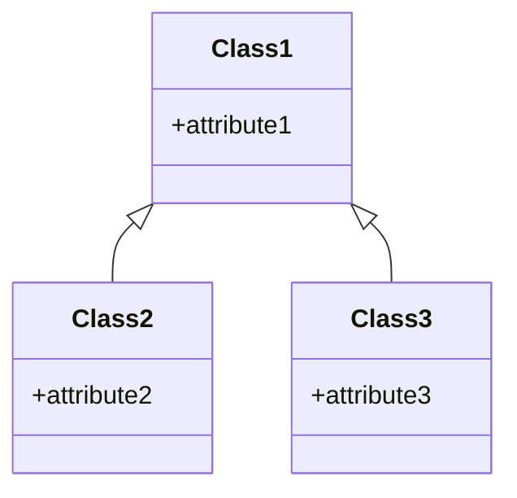
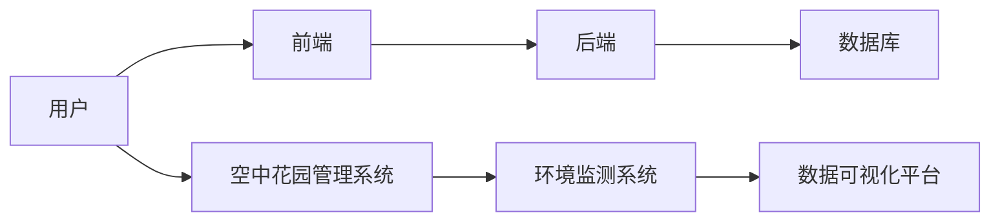
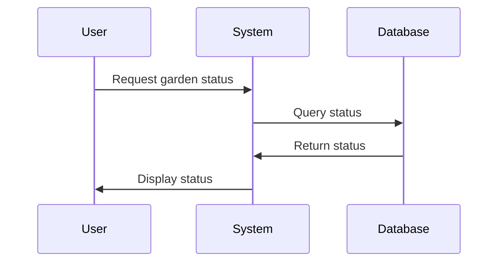

                 

**文章标题：新型城市空中花园网络：连接社区的绿色生态系统**

**关键词：城市空中花园、绿色生态系统、社区互动、城市设计、算法原理、数学模型**

**摘要：本文深入探讨了新型城市空中花园网络的构建，探讨了其作为绿色生态系统的组成部分，以及如何通过社区互动和城市设计来提升城市环境品质。文章分为多个部分，包括背景介绍、核心概念与联系、算法原理讲解、数学模型与公式、系统分析与架构设计、项目实战以及最佳实践和展望。通过详细的案例分析和技术解析，本文旨在为读者提供对新型城市空中花园网络的全面理解。**

## **第一部分：城市空中花园网络概述**

### **1.1 问题背景**

城市化进程的加速带来了诸多挑战，如土地资源的稀缺、环境污染问题的加剧和城市生物多样性的减少。绿色生态系统在城市规划中的重要性日益凸显。城市空中花园作为一种创新的城市绿化形式，可以为城市居民提供良好的休闲空间，同时改善城市生态环境。

**问题描述：** 城市化带来的环境问题如何通过空中花园网络得到缓解？

**问题解决：** 通过设计并实施城市空中花园网络，可以增加城市绿化面积，提升空气质量，减少城市热岛效应，同时提供居民社交和休闲的空间。

**边界与外延：** 空中花园网络不仅包括城市建筑物的屋顶花园，还涵盖了悬挂在建筑外墙的绿色植物带，以及空中连廊等空间形式。

### **1.2 核心概念与联系**

**核心概念：**

- **绿色生态系统：** 绿色植物及其生存环境，通过光合作用、蒸腾作用等过程，维持地球的碳-氧平衡。
- **社区互动：** 居民之间的互动交流，包括休闲娱乐、教育和文化活动。
- **城市设计：** 城市规划与建筑设计，包括建筑布局、空间利用和视觉美学。

**概念属性特征对比表格：**

| 概念       | 属性特征                                                   | 对比                |
|------------|----------------------------------------------------------|-------------------|
| 绿色生态系统 | 自然性、生态平衡、环境保护                           | 与人造环境对比      |
| 社区互动   | 人文性、互动性、社交性                                | 与物理环境对比      |
| 城市设计   | 规划性、功能性、美学性                                | 与自然环境对比      |

**ER实体关系图架构：**

```mermaid
erDiagram
  空中花园 --> 绿色生态系统 : 实现
  空中花园 --> 社区互动     : 支持
  社区互动 --> 城市设计     : 反映
```

### **1.3 空中花园网络的基本原理**

**设计理念：** 以生态学原理为基础，结合城市规划和建筑设计，创造出既美观又实用的空中花园。

**技术与方法：** 采用垂直绿化技术、屋顶种植技术以及生态水池等手段，提高空中花园的生态效益。

**关键技术挑战：** 如何在有限的建筑空间中实现高效的植物生长和生态循环，同时保证建筑的安全性和耐久性。

### **1.4 数学模型与公式**

**空间布局模型：**

$$
L = \frac{A}{P}
$$

其中，$L$ 代表空中花园的覆盖率，$A$ 代表可用的建筑空间，$P$ 代表每平方米所需的植物面积。

**能量消耗模型：**

$$
E = C \cdot L \cdot H
$$

其中，$E$ 代表能量消耗，$C$ 代表每平方米的能量消耗系数，$L$ 代表空中花园的覆盖率，$H$ 代表植物生长的周期。

**生态效益评估模型：**

$$
B = \frac{S}{E} \cdot 100
$$

其中，$B$ 代表生态效益，$S$ 代表空中花园提供的生态服务（如空气净化、雨水收集等），$E$ 代表能量消耗。

## **第二部分：城市空中花园网络的构建**

### **2.1 系统分析与架构设计**

**问题场景介绍：** 以一个城市综合体项目为例，探讨如何设计和实施空中花园网络。

**系统功能设计：**



**系统架构设计：**



**系统接口设计：**



### **2.2 项目实战**

**环境安装与配置：** 
在虚拟环境中安装必要的软件和工具，包括植物生长模拟器、环境监控系统等。

**系统核心实现：** 
使用 Python 编写代码，实现空中花园的自动化管理系统。

```python
# Example code snippet for plant growth simulation
class PlantGrowthSimulation:
    def __init__(self, plant_type, environment):
        self.plant_type = plant_type
        self.environment = environment

    def simulate_growth(self):
        # Simulate plant growth based on environmental conditions
        pass
```

**代码应用解读与分析：** 
详细分析代码的实现逻辑，包括数据收集、处理和可视化。

**实际案例分析：** 
以某城市综合体为例，展示空中花园网络的实施效果。

**详细讲解与剖析：** 
深入探讨项目实施中的关键技术挑战和解决方案。

**项目小结：** 
总结项目经验，提出改进建议。

## **第三部分：城市空中花园网络的最佳实践与展望**

### **3.1 最佳实践 tips**

- **设计要点：** 注重空中花园的生态效益和实用性，确保植物生长环境适宜。
- **建设与维护策略：** 采用智能化管理系统，提高空中花园的维护效率。

### **3.2 小结与展望**

- **成功经验总结：** 总结城市空中花园网络的设计和实施经验。
- **未来发展趋势：** 探讨空中花园网络在城市可持续发展中的作用。
- **政策与支持建议：** 提出政府和社会各界应如何支持空中花园网络的发展。

### **3.3 注意事项**

- **遇到的挑战：** 分析实施空中花园网络过程中可能遇到的困难。
- **应对策略：** 提出针对性的解决方案。

### **3.4 拓展阅读**

- **相关书籍推荐：** 推荐几本关于城市规划和生态设计的专业书籍。
- **学术论文精选：** 分享一些关于空中花园网络的最新研究成果。

**作者：AI天才研究院/AI Genius Institute & 禅与计算机程序设计艺术 /Zen And The Art of Computer Programming**

