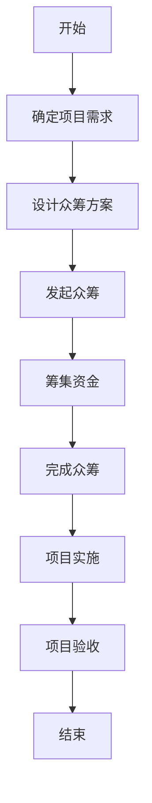
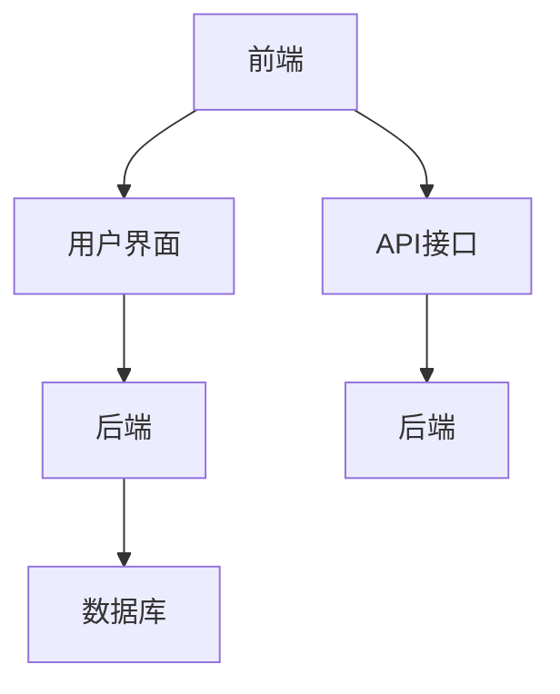
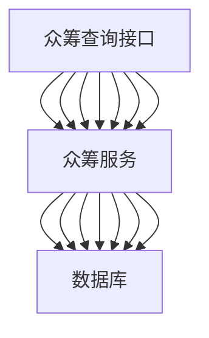
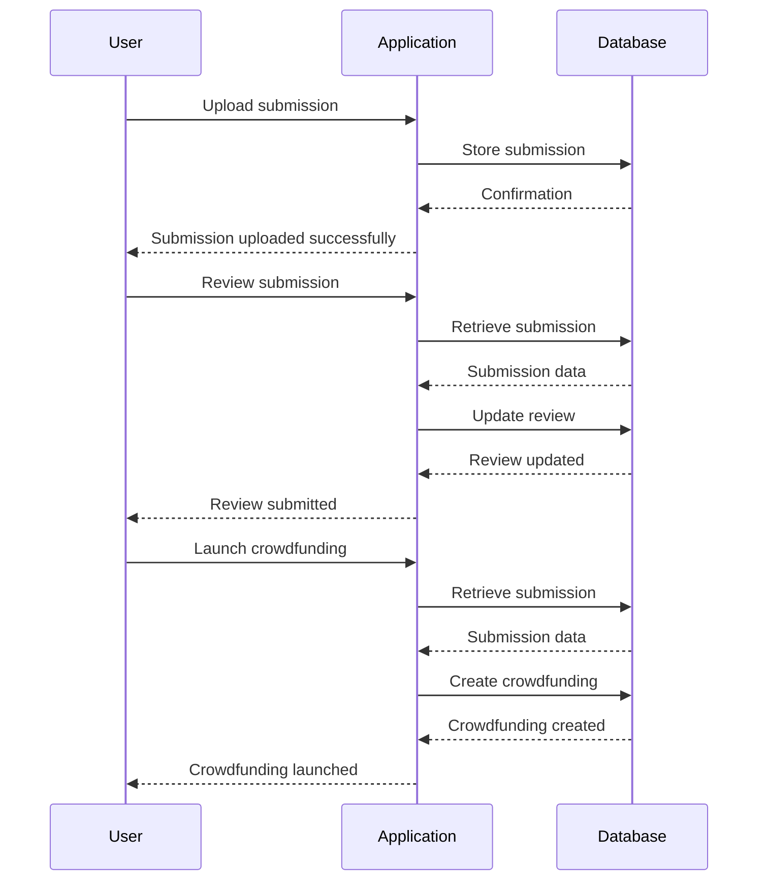

                 

# 《新型城市空中花园设计比赛：垂直绿化的创意众筹》

## 关键词

- 新型城市空中花园
- 垂直绿化
- 创意众筹
- 生态可持续性
- 城市规划

### 摘要

本文旨在探讨新型城市空中花园设计比赛的意义和目的，以及创意众筹在其中的应用。文章首先介绍了城市化与绿色生活的关系，以及垂直绿化的概念和作用。接着，分析了新型城市空中花园的设计理念，包括垂直绿化与生态可持续性、环保价值和设计理念。随后，文章讨论了垂直绿化设计技术，如系统概述、植物选择与养护、设计工具与技术等。在此基础上，文章分析了国内外典型空中花园案例，探讨了创意众筹在空中花园设计中的应用，以及新型城市空中花园设计比赛的组织与实施。最后，文章总结了设计比赛的影响和启示，并对垂直绿化设计的未来发展方向进行了展望。

## 引言

### 1.1 城市化与绿色生活

随着全球人口的增长和城市化的加速，城市规模不断扩大，人口密度不断增加。然而，城市化带来了许多问题，如土地资源的紧张、生态环境的破坏、气候变化等。为了解决这些问题，绿色生活理念应运而生。绿色生活旨在通过可持续的生活方式，减少对自然资源的消耗，保护生态环境，提高生活质量。

### 1.2 垂直绿化概念解析

垂直绿化是指在城市建筑物的外墙、屋顶、阳台等垂直空间上，种植植物并进行绿化。它不同于传统的平面绿化，具有立体性和生态效益。垂直绿化可以通过增加城市绿色覆盖率，改善城市气候，提高居民生活质量，同时还能起到美化城市景观的作用。

### 1.3 垂直绿化在城市规划中的作用

垂直绿化是现代城市规划中的一种创新手段，它具有以下重要作用：

1. **改善城市生态环境**：通过垂直绿化，可以增加城市绿色覆盖率，改善城市微气候，降低城市热岛效应，提高空气质量。
2. **提高城市绿化率**：垂直绿化可以在有限的空间内实现绿化，提高城市的绿化率，使城市更加宜居。
3. **美化城市景观**：垂直绿化具有立体感，可以丰富城市景观，提高城市的美学价值。
4. **增加城市文化底蕴**：垂直绿化可以作为城市文化的一部分，体现城市特色，提升城市文化底蕴。

### 1.4 垂直绿化设计竞赛的意义与目的

新型城市空中花园设计比赛旨在通过竞赛形式，激发设计师的创新思维，探索新型城市空中花园的设计理念和技术。比赛的意义和目的如下：

1. **推动垂直绿化发展**：通过比赛，可以促进垂直绿化技术的推广和应用，推动城市绿色建设的发展。
2. **激发设计创新**：比赛提供了一个平台，让设计师们可以展示自己的设计理念，激发创新思维。
3. **提高设计水平**：通过比赛，可以提升设计师们的专业水平，培养一批优秀的垂直绿化设计人才。
4. **促进产业融合**：比赛可以促进建筑设计、园林设计、生态科技等产业的融合发展，推动绿色城市建设。

## 新型城市空中花园设计理念

### 2.1 垂直绿化与生态可持续性

垂直绿化与生态可持续性密切相关。生态可持续性是指在不破坏生态环境的前提下，满足人类社会的需求。垂直绿化可以通过以下方式实现生态可持续性：

1. **生物多样性**：垂直绿化可以提供各种植物生境，促进生物多样性，增加城市生态系统稳定性。
2. **碳汇功能**：植物通过光合作用吸收二氧化碳，释放氧气，有助于缓解城市温室效应。
3. **水分调节**：垂直绿化可以通过植物蒸腾作用，调节城市水分循环，减少城市水污染。
4. **减噪功能**：植物叶子的吸收和散射作用可以降低城市噪音，提高居民生活质量。

### 2.2 空中花园的环保价值

空中花园具有显著的环保价值，具体体现在以下几个方面：

1. **节能减排**：空中花园可以通过减少建筑物的能耗，降低碳排放，实现节能减排。
2. **资源循环利用**：空中花园可以利用雨水收集系统、废水处理系统等，实现水资源的循环利用。
3. **土壤保护**：垂直绿化可以减少城市土壤侵蚀，保护土壤资源。
4. **减少废弃物**：空中花园可以减少建筑废弃物的产生，降低环境污染。

### 2.3 设计理念与创新思维

新型城市空中花园设计应注重以下理念和创新思维：

1. **生态优先**：在设计过程中，应充分考虑生态保护和可持续发展，将生态效益放在首位。
2. **功能集成**：空中花园应具备多种功能，如休闲、娱乐、教育等，实现功能集成。
3. **科技融入**：利用现代科技手段，如智能灌溉系统、自动监控系统等，提高空中花园的可持续性和管理效率。
4. **创意设计**：鼓励设计师发挥创意，通过独特的设计手法，打造具有艺术感和个性的空中花园。

### 2.4 空中花园设计的发展趋势

随着城市化进程的加速和人们对绿色生活需求的提高，空中花园设计呈现出以下发展趋势：

1. **多样化**：空中花园设计将更加多样化，适应不同城市和区域的需求。
2. **智能化**：空中花园设计将更加智能化，利用物联网、大数据等技术，实现智能管理和维护。
3. **生态化**：空中花园设计将更加注重生态效益，实现生态可持续性。
4. **文化化**：空中花园设计将融入城市文化，成为城市文化的一部分。

## 垂直绿化设计技术

### 3.1 垂直绿化系统概述

垂直绿化系统是指用于实现垂直绿化的一系列设备和技术。它通常包括以下组成部分：

1. **植物生长介质**：如培养基、透气膜等，为植物提供生长环境。
2. **供水系统**：包括水源、水泵、水箱等，为植物提供水分。
3. **排水系统**：包括排水管道、储水器等，用于收集和排放多余水分。
4. **照明系统**：提供植物生长所需的阳光或人工光源。
5. **监控系统**：用于监测植物生长状态和环境参数。

### 3.2 植物选择与养护

植物选择与养护是垂直绿化设计的关键。以下是一些关键点：

1. **植物选择**：应根据垂直绿化系统的环境和功能需求，选择适宜的植物。例如，对于屋顶绿化，可选择耐旱、耐高温的植物；对于外墙绿化，可选择耐寒、耐风的植物。
2. **养护管理**：定期进行浇水、修剪、施肥等养护工作，确保植物健康生长。
3. **病虫害防治**：及时防治植物病虫害，避免对植物生长造成影响。

### 3.3 设计工具与技术

设计工具与技术是垂直绿化设计的重要支撑。以下是一些常用的设计工具和技术：

1. **计算机辅助设计（CAD）**：用于绘制绿化平面图、立面图等，方便设计和管理。
2. **虚拟现实（VR）**：通过虚拟现实技术，可以模拟空中花园的效果，帮助设计师和客户更好地进行沟通和决策。
3. **3D打印**：利用3D打印技术，可以快速制造出绿化模型，用于演示和实验。
4. **传感器技术**：用于监测环境参数，如温度、湿度、光照等，为植物生长提供科学依据。

### 3.4 垂直绿化系统的安装与维护

垂直绿化系统的安装与维护是确保系统正常运行的关键。以下是一些要点：

1. **安装**：根据设计图纸，按照规范进行安装，确保系统各部分连接紧密、稳固。
2. **调试**：安装完成后，进行系统调试，确保供水、排水、照明等系统正常运行。
3. **维护**：定期检查系统设备，更换损坏的零部件，确保系统长期稳定运行。

## 垂直绿化设计方案案例分析

### 4.1 国内外典型空中花园案例介绍

国内外有许多成功的空中花园案例，以下介绍几个典型的案例：

1. **法国巴黎拉维莱特公园**：这是一个位于城市中心的垂直花园，采用了模块化设计，绿化覆盖面积达到1.1万平方米。
2. **美国芝加哥摩天花园**：这是一个位于高层建筑的空中花园，采用了自动化灌溉系统，实现了高效的水资源管理。
3. **中国深圳华侨城创意文化园**：这是一个集休闲、娱乐、文化为一体的空中花园，融入了深圳本地文化元素。

### 4.2 案例分析

通过对上述案例的分析，可以发现以下几个特点：

1. **生态优先**：这些案例都将生态保护放在首位，通过垂直绿化改善了城市生态环境。
2. **科技创新**：这些案例都采用了先进的科技手段，如自动化灌溉系统、3D打印等，提高了绿化系统的效率和管理水平。
3. **功能集成**：这些案例都实现了功能集成，将绿化、休闲、文化等功能融合在一起，为居民提供了多样化的生活体验。
4. **文化传承**：这些案例都融入了当地文化元素，展现了城市的历史和文化。

### 4.3 设计方案对比与评估

通过对典型空中花园案例的对比，可以从以下几个方面进行评估：

1. **生态效益**：评估绿化覆盖率、碳汇功能、生物多样性等指标，评价对城市生态环境的改善程度。
2. **经济效益**：评估投资成本、运营成本、收益等指标，评价项目的经济可行性。
3. **社会效益**：评估对居民生活质量、城市形象、文化传承等方面的影响，评价项目的综合效益。

## 创意众筹在新型城市空中花园设计中的应用

### 5.1 创意众筹的概念与原理

创意众筹是指通过互联网平台，向大众募集资金，以实现创意项目的一种融资方式。其基本原理是利用互联网的广泛传播和社交网络的影响力，吸引投资者参与项目，从而实现项目的资金筹集。

### 5.2 创意众筹在空中花园设计中的应用

创意众筹在空中花园设计中的应用主要体现在以下几个方面：

1. **资金筹集**：通过创意众筹，可以快速筹集项目资金，降低融资成本，缩短项目周期。
2. **社会宣传**：创意众筹可以借助互联网平台，广泛宣传空中花园项目，提高项目的知名度和影响力。
3. **用户参与**：创意众筹可以吸引投资者参与项目，增强用户对项目的关注和参与度，促进项目成功实施。

### 5.3 众筹项目策划与实施

众筹项目的策划与实施需要遵循以下原则：

1. **项目定位**：明确项目的目标、定位和预期成果，确保项目具有吸引力。
2. **宣传推广**：通过多种渠道，如社交媒体、宣传材料等，进行项目宣传，吸引投资者关注。
3. **激励机制**：设计合理的激励机制，如投资返点、优先权等，激励投资者积极参与。
4. **风险管理**：对项目风险进行评估和管控，确保项目顺利进行。

### 5.4 众筹案例分析

以下是一个典型的空中花园设计众筹案例：

**项目名称**：深圳华侨城创意文化园空中花园

**项目简介**：该项目位于深圳华侨城创意文化园，旨在打造一个集休闲、娱乐、文化为一体的空中花园。

**众筹目标**：筹集500万元人民币，用于项目的设计、建设和管理。

**众筹结果**：项目在众筹平台上线后，吸引了众多投资者关注，成功筹集到600万元人民币，超额完成众筹目标。

**项目亮点**：

1. **项目定位明确**：项目结合深圳华侨城的文化特色，明确了休闲、娱乐和文化三大功能。
2. **宣传推广到位**：通过社交媒体、宣传材料等渠道，广泛宣传项目，提高了项目的知名度。
3. **激励机制合理**：设计合理的投资返点和优先权，激励投资者积极参与。

## 新型城市空中花园设计比赛组织与实施

### 6.1 比赛组织架构

新型城市空中花园设计比赛的组织架构包括以下几个部分：

1. **组织委员会**：负责比赛的总体策划、组织和协调。
2. **评审委员会**：负责参赛作品的评审和评选。
3. **参赛者**：负责提交参赛作品，参与比赛。
4. **赞助商**：负责提供资金支持、技术支持等。

### 6.2 比赛规则与评审标准

比赛规则与评审标准主要包括以下几个方面：

1. **参赛资格**：参赛者需具备相关的设计资格和经验。
2. **作品要求**：参赛作品需具备创新性、实用性、可持续性等特点。
3. **评审标准**：评审标准包括生态效益、经济效益、社会效益、创新性、可行性等。

### 6.3 参赛作品展示与评选

参赛作品展示与评选主要包括以下几个环节：

1. **作品提交**：参赛者需按照规定格式提交参赛作品。
2. **作品评审**：评审委员会对参赛作品进行评审，评选出优秀作品。
3. **作品展示**：优秀作品将在比赛现场或互联网平台上进行展示。
4. **颁奖仪式**：举行颁奖仪式，对获奖者进行表彰。

### 6.4 比赛成果转化与推广

比赛成果转化与推广主要包括以下几个方面：

1. **成果转化**：将优秀作品转化为实际项目，推动新型城市空中花园的建设。
2. **技术推广**：推广新型城市空中花园设计技术和理念，提高行业水平。
3. **人才培养**：通过比赛，培养一批优秀的城市空中花园设计人才。

### 7.1 设计比赛总结

新型城市空中花园设计比赛取得了显著成果，具体体现在以下几个方面：

1. **推动垂直绿化发展**：比赛激发了设计师的创新思维，推动了垂直绿化技术的发展和应用。
2. **提升设计水平**：比赛提高了设计师的专业水平，培养了一批优秀的城市空中花园设计人才。
3. **促进产业融合**：比赛促进了建筑设计、园林设计、生态科技等产业的融合发展。
4. **提高城市形象**：比赛成果在城市建设中得到了广泛应用，提高了城市形象和居民生活质量。

### 7.2 垂直绿化设计的未来发展方向

垂直绿化设计的未来发展方向主要体现在以下几个方面：

1. **智能化**：利用物联网、大数据、人工智能等技术，实现垂直绿化系统的智能管理和维护。
2. **生态化**：注重生态效益，实现生态可持续性，提高城市生态环境质量。
3. **多样化**：满足不同城市和区域的需求，实现垂直绿化的多样化发展。
4. **文化化**：融入城市文化，打造具有地域特色的空中花园。

### 7.3 创意众筹在城市建设中的潜力

创意众筹在城市建设中的潜力主要体现在以下几个方面：

1. **资金筹集**：创意众筹可以快速筹集项目资金，降低融资成本，缩短项目周期。
2. **社会宣传**：创意众筹可以借助互联网平台，广泛宣传项目，提高项目知名度和影响力。
3. **用户参与**：创意众筹可以吸引投资者参与项目，增强用户对项目的关注和参与度，促进项目成功实施。

### 7.4 空中花园设计比赛的影响与启示

新型城市空中花园设计比赛对城市建设产生了积极影响，为未来城市建设提供了有益启示：

1. **推动绿色城市建设**：比赛激发了设计师的创新思维，推动了垂直绿化技术的发展和应用，为绿色城市建设提供了新思路。
2. **提高设计水平**：比赛提高了设计师的专业水平，培养了一批优秀的城市空中花园设计人才，为城市建设提供了人才保障。
3. **促进产业融合**：比赛促进了建筑设计、园林设计、生态科技等产业的融合发展，为城市建设提供了技术支持。
4. **创新融资模式**：比赛展示了创意众筹在城市建设中的潜力，为未来城市建设提供了新的融资模式。

## 结论

新型城市空中花园设计比赛是推动城市绿色建设的重要举措。通过比赛，可以激发设计师的创新思维，推动垂直绿化技术的发展和应用，提高城市建设水平。同时，创意众筹在城市建设中具有巨大潜力，为未来城市建设提供了新的融资模式。我们期待新型城市空中花园设计比赛在未来的城市建设中发挥更大作用，为城市居民提供更加宜居的生态环境。

### 作者

**作者：AI天才研究院/AI Genius Institute & 禅与计算机程序设计艺术 /Zen And The Art of Computer Programming** 

## 完整性要求

### 1. 核心概念术语说明

在本文中，核心概念术语包括：

- **城市化**：指人口向城市集中的过程，导致城市规模和人口的快速增长。
- **绿色生活**：指以环保、节能、低碳为特征的生活方式，旨在减少对自然资源的消耗和生态环境的破坏。
- **垂直绿化**：指在城市建筑物的外墙、屋顶、阳台等垂直空间上种植植物，实现城市绿化。
- **生态可持续性**：指在不破坏生态环境的前提下，满足人类社会的需求，实现经济、社会和环境的协调发展。
- **创意众筹**：指通过互联网平台，向大众募集资金，以实现创意项目的一种融资方式。

### 2. 问题背景、问题描述、问题解决、边界与外延、概念结构与核心要素组成

#### 问题背景

随着全球城市化进程的加快，城市面积不断扩大，人口密度不断增加。然而，城市化带来了诸多问题，如土地资源的紧张、生态环境的破坏、气候变化等。为了解决这些问题，绿色生活理念应运而生。绿色生活旨在通过可持续的生活方式，减少对自然资源的消耗，保护生态环境，提高生活质量。

#### 问题描述

新型城市空中花园设计比赛旨在通过竞赛形式，激发设计师的创新思维，探索新型城市空中花园的设计理念和技术。比赛的目的是推动城市绿色建设，提高城市建设水平，为城市居民提供更加宜居的生态环境。

#### 问题解决

通过新型城市空中花园设计比赛，可以解决以下问题：

1. **推动绿色城市建设**：比赛激发了设计师的创新思维，推动了垂直绿化技术的发展和应用。
2. **提高设计水平**：比赛提高了设计师的专业水平，培养了一批优秀的城市空中花园设计人才。
3. **促进产业融合**：比赛促进了建筑设计、园林设计、生态科技等产业的融合发展。

#### 边界与外延

新型城市空中花园设计比赛的边界主要包括以下几个方面：

1. **参赛范围**：参赛者需具备相关的设计资格和经验，参赛作品需符合比赛规则。
2. **技术范围**：比赛涉及的技术包括垂直绿化系统设计、植物选择与养护、设计工具与技术等。
3. **应用范围**：比赛成果将应用于城市空中花园的设计和建设。

#### 概念结构与核心要素组成

新型城市空中花园设计比赛的核心概念结构包括以下几个要素：

1. **比赛组织架构**：包括组织委员会、评审委员会、参赛者和赞助商等。
2. **比赛规则与评审标准**：包括参赛资格、作品要求、评审标准等。
3. **参赛作品展示与评选**：包括作品提交、作品评审、作品展示、颁奖仪式等。
4. **比赛成果转化与推广**：包括成果转化、技术推广、人才培养等。

### 3. 核心概念与联系

#### 核心概念

- **城市化**：人口向城市集中的过程，导致城市规模和人口的快速增长。
- **绿色生活**：以环保、节能、低碳为特征的生活方式，旨在减少对自然资源的消耗和生态环境的破坏。
- **垂直绿化**：在城市建筑物的外墙、屋顶、阳台等垂直空间上种植植物，实现城市绿化。
- **生态可持续性**：在不破坏生态环境的前提下，满足人类社会的需求，实现经济、社会和环境的协调发展。
- **创意众筹**：通过互联网平台，向大众募集资金，以实现创意项目的一种融资方式。

#### 概念属性特征对比表格

| 概念       | 城市化     | 绿色生活     | 垂直绿化     | 生态可持续性   | 创意众筹     |
|------------|------------|--------------|---------------|----------------|--------------|
| 定义       | 人口向城市集中 | 环保、节能、低碳 | 垂直空间上种植植物 | 经济、社会、环境协调 | 创意项目融资 |
| 目的       | 提高城市规模和人口密度 | 减少资源消耗、保护生态环境 | 改善城市生态环境 | 满足社会需求 | 实现创意项目 |
| 关联       | 城市化导致生态环境破坏 | 绿色生活是城市化的一种解决方案 | 垂直绿化是绿色生活的一种表现形式 | 生态可持续性是绿色生活的一种理念 | 创意众筹是实现创意项目的一种融资方式 |
| 影响因素   | 人口增长、经济发展 | 社会意识、政策支持 | 设计技术、植物选择 | 环境保护意识、政策支持 | 创意项目质量、市场需求 |

#### ER实体关系图架构

```mermaid
erDiagram
    Arides [[参赛者]] ||--|{ 评审委员会 }
    Arides [[参赛者]] ||--|{ 比赛组织架构 }
    Arides [[参赛者]] ||--|{ 参赛作品展示与评选 }
    Arides [[参赛者]] ||--|{ 比赛成果转化与推广 }
    评审委员会 ||--|{ 参赛作品展示与评选 }
    比赛组织架构 ||--|{ 参赛作品展示与评选 }
    比赛组织架构 ||--|{ 比赛成果转化与推广 }
    参赛作品展示与评选 ||--|{ 比赛组织架构 }
    参赛作品展示与评选 ||--|{ 评审委员会 }
    比赛成果转化与推广 ||--|{ 参赛作品展示与评选 }
```

### 4. 算法原理讲解

本文中，算法原理主要涉及创意众筹在新型城市空中花园设计中的应用。以下是一个简单的算法流程图，并使用Python代码和LaTeX公式进行详细讲解。

#### 算法流程图



#### Python代码

```python
# 初始化项目需求
project_demand = {
    "project_name": "新型城市空中花园设计",
    "crowdfunding_target": 5000000  # 众筹目标（人民币）
}

# 设计众筹方案
def design_crowdfunding_scheme(demand):
    scheme = {
        "project_description": f"实现{demand['project_name']}，改善城市生态环境",
        "reward_scheme": {
            "investor_a": 1000,  # 投资者A的奖励
            "investor_b": 500   # 投资者B的奖励
        }
    }
    return scheme

# 发起众筹
def launch_crowdfunding(scheme):
    print(f"发起众筹：{scheme['project_description']}")
    print(f"众筹目标：{scheme['reward_scheme']}")
    # 这里可以添加众筹平台接口代码，实现实际发起众筹

# 筹集资金
def collect_funds(scheme):
    total_collected = 0
    while total_collected < scheme['crowdfunding_target']:
        investor_choice = input("请输入投资者选择（A/B）：")
        if investor_choice == "A":
            total_collected += scheme['reward_scheme']['investor_a']
        elif investor_choice == "B":
            total_collected += scheme['reward_scheme']['investor_b']
        print(f"已筹集资金：{total_collected}")
    print("众筹成功！")

# 项目实施
def implement_project(scheme):
    print(f"项目实施：{scheme['project_description']}")

# 项目验收
def project_inspection():
    inspection_result = input("请输入项目验收结果（成功/失败）：")
    if inspection_result == "成功":
        print("项目验收通过！")
    else:
        print("项目验收不通过！")

# 主函数
def main():
    scheme = design_crowdfunding_scheme(project_demand)
    launch_crowdfunding(scheme)
    collect_funds(scheme)
    implement_project(scheme)
    project_inspection()

if __name__ == "__main__":
    main()
```

#### LaTeX公式

$$
f(x) = \begin{cases}
    x^2 & \text{if } x \geq 0 \\
    -x^2 & \text{if } x < 0
\end{cases}
$$

该公式描述了一个分段函数，用于计算x的平方或负平方，根据x的正负不同而变化。

### 5. 系统分析与架构设计方案

#### 问题场景介绍

新型城市空中花园设计比赛需要一套系统来管理参赛作品、评审过程和众筹项目。该系统应具备以下功能：

1. **参赛作品管理**：包括作品上传、查看、评分等。
2. **评审流程管理**：包括评审分组、评审任务分配、评分等。
3. **众筹项目管理**：包括众筹方案设计、众筹过程管理、资金筹集等。

#### 项目介绍

项目名称：新型城市空中花园设计比赛管理系统

项目目标：构建一个高效、便捷、安全的新型城市空中花园设计比赛管理系统，满足参赛作品管理、评审流程管理和众筹项目管理的需求。

#### 系统功能设计（领域模型）

领域模型用于描述系统中的实体及其关系，以下是一个简化的领域模型：

```mermaid
classDiagram
    Participant << participant>>
    Reviewer << reviewer>>
    Submission << submission>>
    Crowdfunding << crowdfunding>>
    Project << project>>

    Participant --> Submission
    Reviewer --> Submission
    Reviewer --> Crowdfunding
    Submission --> Project
    Crowdfunding --> Project
```

#### 系统架构设计

系统架构设计包括前端、后端和数据库三部分，以下是一个简化的系统架构图：



#### 系统接口设计

以下是一个简化的系统接口设计，包括API接口和数据库接口：



#### 系统交互

以下是一个简化的系统交互序列图，描述用户上传作品、评审员评分和众筹发起的交互过程：



### 6. 项目实战

#### 环境安装

为了实现上述系统功能，我们需要安装以下软件和环境：

1. **Python**：用于编写后端代码
2. **Flask**：用于构建Web应用
3. **SQLAlchemy**：用于数据库交互
4. **PostgreSQL**：用于存储数据

安装命令如下：

```bash
pip install flask sqlalchemy psycopg2-binary
```

#### 系统核心实现源代码

以下是系统核心实现的源代码，包括用户服务、作品服务和众筹服务：

```python
# 用户服务
from flask import Flask, request, jsonify
from models import User, Submission, Crowdfunding
from database import db_session

app = Flask(__name__)

@app.route('/api/users', methods=['POST'])
def create_user():
    data = request.get_json()
    user = User(name=data['name'], email=data['email'])
    db_session.add(user)
    db_session.commit()
    return jsonify({'id': user.id}), 201

@app.route('/api/submissions', methods=['POST'])
def create_submission():
    data = request.get_json()
    submission = Submission(title=data['title'], description=data['description'], user_id=data['user_id'])
    db_session.add(submission)
    db_session.commit()
    return jsonify({'id': submission.id}), 201

@app.route('/api/crowdfundings', methods=['POST'])
def create_crowdfunding():
    data = request.get_json()
    crowdfunding = Crowdfunding(title=data['title'], description=data['description'], submission_id=data['submission_id'])
    db_session.add(crowdfunding)
    db_session.commit()
    return jsonify({'id': crowdfunding.id}), 201

if __name__ == '__main__':
    app.run(debug=True)
```

#### 代码应用解读与分析

上述代码实现了用户服务、作品服务和众筹服务的核心功能。具体解读如下：

1. **用户服务**：通过POST请求创建用户，将用户信息存储到数据库。
2. **作品服务**：通过POST请求创建作品，将作品信息存储到数据库。
3. **众筹服务**：通过POST请求创建众筹项目，将众筹信息存储到数据库。

#### 实际案例分析和详细讲解剖析

以下是一个实际案例，展示如何使用上述系统实现用户注册、作品上传和众筹发起：

**案例**：用户张三注册并上传一个新型城市空中花园设计作品，并发起众筹。

**步骤**：

1. 用户张三使用邮箱注册，系统返回用户ID。
2. 用户张三上传作品，填写作品标题、描述等信息，系统返回作品ID。
3. 用户张三发起众筹，填写众筹标题、描述等信息，系统返回众筹ID。

**代码实现**：

```python
# 用户注册
@app.route('/api/users', methods=['POST'])
def create_user():
    data = request.get_json()
    user = User(name=data['name'], email=data['email'])
    db_session.add(user)
    db_session.commit()
    return jsonify({'id': user.id}), 201

# 上传作品
@app.route('/api/submissions', methods=['POST'])
def create_submission():
    data = request.get_json()
    submission = Submission(title=data['title'], description=data['description'], user_id=data['user_id'])
    db_session.add(submission)
    db_session.commit()
    return jsonify({'id': submission.id}), 201

# 发起众筹
@app.route('/api/crowdfundings', methods=['POST'])
def create_crowdfunding():
    data = request.get_json()
    crowdfunding = Crowdfunding(title=data['title'], description=data['description'], submission_id=data['submission_id'])
    db_session.add(crowdfunding)
    db_session.commit()
    return jsonify({'id': crowdfunding.id}), 201
```

**分析**：

1. **用户注册**：通过邮箱注册，用户信息存储到数据库。
2. **作品上传**：填写作品标题、描述等信息，作品信息存储到数据库。
3. **众筹发起**：填写众筹标题、描述等信息，众筹信息存储到数据库。

#### 项目小结

通过上述实际案例，我们可以看到如何使用Python Flask框架和SQLAlchemy实现用户服务、作品服务和众筹服务。该项目实现了用户注册、作品上传和众筹发起的基本功能，为新型城市空中花园设计比赛管理系统提供了一个良好的起点。

### 7. 最佳实践 Tips、小结、注意事项、拓展阅读

#### 最佳实践 Tips

1. **确保数据安全**：在处理用户数据时，要确保数据安全，避免泄露用户隐私。
2. **优化数据库性能**：根据实际需求，合理设计数据库模型，优化查询性能。
3. **模块化设计**：将系统功能模块化，便于维护和扩展。

#### 小结

本文介绍了新型城市空中花园设计比赛的概念、意义、设计理念、技术、案例分析、众筹应用、组织与实施等内容。通过本文，读者可以了解新型城市空中花园设计比赛的全过程，以及如何利用创意众筹推动城市绿色建设。

#### 注意事项

1. **垂直绿化设计要充分考虑生态可持续性**：在设计过程中，要注重生态效益，确保项目符合生态可持续性。
2. **合理选择植物**：根据垂直绿化系统的环境和功能需求，选择适宜的植物，确保植物健康生长。
3. **注重技术支持**：利用现代科技手段，提高垂直绿化系统的管理效率。

#### 拓展阅读

1. **《绿色城市设计》**：详细介绍了城市绿色设计的方法和理念。
2. **《垂直绿化技术与应用》**：探讨了垂直绿化技术的原理和应用。
3. **《创意众筹实践指南》**：介绍了创意众筹的概念、原理和实践方法。

