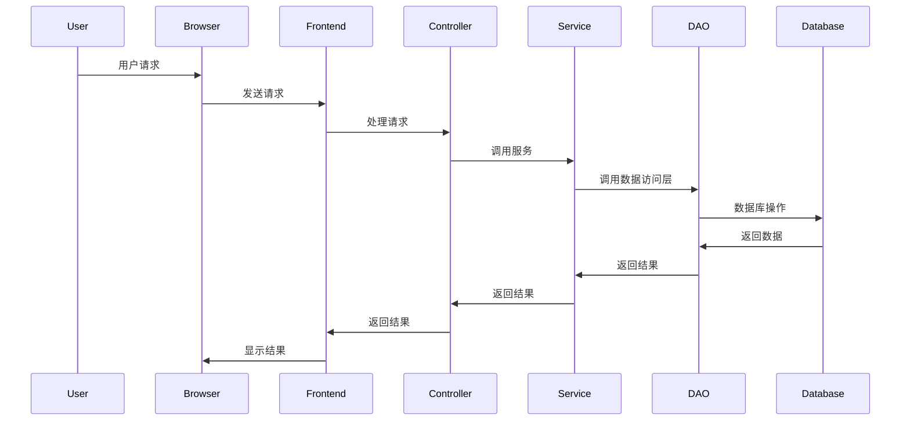

                 


### 问题背景

## 1.1 问题背景

### 1.1.1 城市终身学习的意义

在当今快速发展的社会，城市居民面临着不断变化的知识需求和工作环境。终身学习已成为提升个人竞争力、适应社会发展的重要途径。城市终身学习不仅有助于提高市民的职业技能和综合素质，还能促进社会创新和经济繁荣。然而，传统的学习模式存在诸多挑战，如教育资源分布不均、学习途径有限、学习动力不足等。

### 1.1.2 知识共享的挑战

知识共享是城市终身学习的重要组成部分，但在实际操作中面临诸多挑战。首先，知识共享的渠道有限，往往依赖于传统的课堂授课和纸质资料。其次，知识共享的激励机制不足，缺乏有效的鼓励措施，导致市民参与积极性不高。此外，知识共享的社区互动不足，缺乏有效的互动平台，难以形成良好的知识交流氛围。

### 1.1.3 终身学习积分银行的概念

终身学习积分银行是一种创新的数字化解决方案，旨在通过积分机制激励城市居民参与终身学习。该方案通过建立积分账户，记录市民的学习行为和知识贡献，并将积分与实际奖励相挂钩。积分银行不仅为市民提供了一种新的学习动力，还有助于促进知识共享和社区互动。

## 1.2 概念结构与核心要素

### 1.2.1 终身学习积分银行的核心概念

终身学习积分银行是一种基于积分机制的数字化平台，旨在通过激励措施促进城市居民的终身学习。该银行的核心概念包括：

1. **积分账户**：每位市民在积分银行中拥有一个独特的积分账户，用于记录其学习行为和知识贡献。
2. **积分获取与消耗**：市民通过参与学习、完成课程、分享知识等方式获得积分，积分可以用于兑换奖品或享受特定服务。
3. **积分奖励**：积分银行通过设置积分奖励机制，鼓励市民积极参与终身学习。

### 1.2.2 积分银行的基本构成

积分银行的基本构成包括以下部分：

1. **用户管理模块**：负责用户注册、登录、积分账户管理等功能。
2. **课程管理模块**：负责课程创建、发布、学习进度记录等功能。
3. **知识共享模块**：负责知识分享、评论、点赞等功能。
4. **积分管理模块**：负责积分获取、消耗、奖励等功能。
5. **数据分析模块**：负责数据收集、分析、报告生成等功能。

### 1.2.3 积分银行的功能模块

积分银行的主要功能模块包括：

1. **学习行为记录**：记录市民的学习行为，如参加课程、完成作业等，并生成相应的积分。
2. **知识共享**：市民可以在积分银行中分享知识，获得积分奖励。
3. **积分兑换**：市民可以使用积分兑换奖品或享受特定服务。
4. **社区互动**：积分银行提供社区互动平台，促进市民之间的知识交流。

## 1.3 案例分析

### 1.3.1 国内外终身学习积分银行案例

国内外已经有许多成功的终身学习积分银行案例。例如，日本的“终身学习积分计划”通过积分激励市民参与各种学习活动，取得了显著的效果。国内如杭州的“市民学习积分制”也在推广中，通过积分激励市民参与终身学习。

### 1.3.2 案例分析及启示

通过对国内外案例的分析，我们可以得出以下启示：

1. **激励机制的重要性**：有效的激励机制可以大大提高市民参与终身学习的积极性。
2. **数字化平台的构建**：数字化平台可以提供便捷的学习渠道和知识共享空间。
3. **社区互动的促进**：社区互动有助于形成良好的学习氛围，提高知识共享的效率。

## 1.4 边界与外延

### 1.4.1 积分银行的适用范围

积分银行可以适用于各种规模的城市，特别是那些重视终身学习和社会发展的城市。此外，积分银行也可以应用于企业内部的员工培训。

### 1.4.2 积分银行与社区发展的关系

积分银行不仅有助于促进终身学习，还可以推动社区发展。通过积分激励，市民积极参与社区活动，形成良好的社会氛围，促进社区的和谐发展。

## 1.5 本章小结

本章主要介绍了终身学习积分银行的概念、核心要素、案例分析以及适用范围。通过本章的学习，读者可以了解到终身学习积分银行的优势和应用前景，为后续章节的深入探讨打下基础。在接下来的章节中，我们将进一步探讨终身学习积分银行的技术架构、激励机制设计、系统实施以及效果评估等内容。

# 第二部分：核心概念与原理

## 2.1 数字化方案概述

### 2.1.1 数字化方案的重要性

在当今信息化时代，数字化方案已成为推动城市发展、提升市民生活品质的重要手段。数字化方案不仅可以提高城市管理效率，还可以促进市民的终身学习和知识共享。终身学习积分银行作为一种数字化解决方案，其重要性体现在以下几个方面：

1. **提高市民参与度**：通过数字化平台，市民可以方便地参与各种学习活动，提高终身学习的积极性。
2. **促进知识共享**：数字化平台为市民提供了便捷的知识共享渠道，有助于形成良好的学习氛围。
3. **增强社区互动**：数字化方案可以促进市民之间的互动，增强社区凝聚力。
4. **提升城市竞争力**：终身学习积分银行有助于培养高素质的人才，提升城市的整体竞争力。

### 2.1.2 数字化方案的设计原则

为了确保数字化方案的有效性和可操作性，设计过程中需要遵循以下原则：

1. **用户导向**：以市民需求为导向，设计符合用户习惯和需求的功能模块。
2. **功能完备**：确保平台具备完整的功能，包括学习行为记录、知识共享、积分获取与兑换等。
3. **安全可靠**：保障平台数据的安全性和可靠性，确保市民信息的安全。
4. **易于扩展**：设计灵活的架构，便于后期功能的扩展和升级。

### 2.1.3 数字化方案的技术框架

终身学习积分银行的技术框架主要包括以下几个部分：

1. **前端技术**：采用Vue.js等前端框架，实现用户界面的美观和易用性。
2. **后端技术**：使用Spring Boot等后端框架，实现数据的存储和管理。
3. **数据库技术**：采用MySQL等关系型数据库，存储用户数据和学习行为数据。
4. **API接口**：设计RESTful API接口，实现前后端数据的交互。
5. **缓存技术**：使用Redis等缓存技术，提高系统性能。
6. **安全措施**：采用HTTPS、加密等安全措施，确保数据传输的安全性。

## 2.2 终身学习积分银行的技术架构

### 2.2.1 技术架构设计

终身学习积分银行的技术架构设计需要充分考虑系统的可扩展性、可靠性和性能。以下是技术架构的详细设计：

1. **前端架构**：采用Vue.js等前端框架，实现单页面应用（SPA），提高用户体验。
2. **后端架构**：采用Spring Boot等后端框架，实现MVC模式，提高代码的可维护性和扩展性。
3. **数据库架构**：采用MySQL等关系型数据库，实现数据存储和管理，确保数据的完整性和一致性。
4. **缓存架构**：采用Redis等缓存技术，提高系统的响应速度和性能。
5. **API架构**：采用RESTful API设计，实现前后端的数据交互，提高系统的可扩展性。

### 2.2.2 系统组件介绍

终身学习积分银行的主要系统组件包括：

1. **用户管理模块**：负责用户的注册、登录、个人信息管理等功能。
2. **课程管理模块**：负责课程的创建、发布、学习进度记录等功能。
3. **知识共享模块**：负责知识的上传、分享、评论、点赞等功能。
4. **积分管理模块**：负责积分的获取、消耗、兑换等功能。
5. **数据分析模块**：负责数据的收集、分析、报告生成等功能。

### 2.2.3 技术选型与考量

在技术选型方面，需要充分考虑系统的需求、性能、安全性和可维护性。以下是主要的技术选型：

1. **前端技术**：Vue.js具有优秀的社区支持、丰富的UI组件和良好的性能，适合用于构建单页面应用。
2. **后端技术**：Spring Boot具有高效的性能、良好的社区支持和丰富的生态体系，适合用于构建企业级应用。
3. **数据库技术**：MySQL具有稳定的数据存储和管理能力，适合用于存储用户数据和学习行为数据。
4. **缓存技术**：Redis具有高性能、持久化存储和丰富的数据结构，适合用于缓存数据和加速系统响应。
5. **API接口**：RESTful API具有简单、易用、可扩展的特点，适合用于前后端的数据交互。

## 2.3 激励机制设计

### 2.3.1 激励机制的重要性

激励机制是终身学习积分银行的核心组成部分，其重要性体现在以下几个方面：

1. **提高用户参与度**：通过激励措施，可以吸引更多用户参与终身学习和知识共享，提高平台的活跃度。
2. **促进知识传播**：激励用户分享知识，有助于形成良好的知识共享氛围，促进知识的传播和积累。
3. **增强社区凝聚力**：激励机制可以增强社区成员之间的互动和信任，提高社区凝聚力。

### 2.3.2 激励机制的构建

构建激励机制需要遵循以下原则：

1. **公平公正**：确保激励机制公平公正，避免用户产生不公平感。
2. **多样化**：设计多样化的激励措施，满足不同用户的需求。
3. **可持续性**：激励机制的设置需要具备可持续性，避免过度激励导致资源浪费。

### 2.3.3 激励效果评估

激励效果的评估是优化激励机制的重要环节。以下是评估激励效果的方法：

1. **用户参与度分析**：通过分析用户的学习行为、知识分享行为等数据，评估激励措施对用户参与度的影响。
2. **知识传播效果分析**：通过分析知识分享的数量、质量、传播范围等数据，评估激励措施对知识传播的影响。
3. **社区互动分析**：通过分析社区成员之间的互动数据，评估激励措施对社区凝聚力的影响。

## 2.4 知识共享与社区互动

### 2.4.1 知识共享的促进策略

知识共享是终身学习积分银行的核心功能之一，以下是一些促进知识共享的策略：

1. **提供便捷的分享渠道**：为用户提供简单易用的知识分享工具，提高知识分享的便利性。
2. **建立激励机制**：通过积分、奖励等激励机制，鼓励用户分享知识。
3. **组织知识分享活动**：定期组织知识分享活动，激发用户的分享热情。
4. **提供优质内容**：鼓励优质内容的产生和传播，提高知识共享的质量。

### 2.4.2 社区互动平台建设

社区互动平台是促进知识共享和社区发展的重要手段，以下是社区互动平台建设的关键点：

1. **提供互动渠道**：建立论坛、社群等互动渠道，方便用户之间的交流和互动。
2. **建立规则**：制定合理的社区规则，维护社区秩序，促进健康互动。
3. **提供支持**：为用户提供技术支持和心理支持，提高用户的参与感和满意度。
4. **开展活动**：定期举办线上和线下活动，增强社区成员的互动和联系。

### 2.4.3 用户参与与反馈机制

用户参与与反馈机制是优化社区互动的重要手段，以下是用户参与与反馈机制的建设要点：

1. **鼓励用户参与**：通过激励机制、活动等形式，鼓励用户积极参与社区互动。
2. **收集用户反馈**：建立用户反馈渠道，及时收集用户意见和建议，优化社区互动体验。
3. **反馈处理**：对用户反馈进行及时处理，确保用户的意见和建议得到重视和回应。
4. **持续优化**：根据用户反馈，不断优化社区互动平台的功能和用户体验。

## 2.5 数据分析与利用

### 2.5.1 数据收集与处理

数据收集与处理是终身学习积分银行的核心环节，以下是数据收集与处理的方法：

1. **数据收集**：通过用户行为日志、课程数据、知识分享数据等渠道收集数据。
2. **数据处理**：对收集到的数据进行分析、清洗和整理，提取有用信息。

### 2.5.2 数据分析与挖掘

数据分析与挖掘是优化终身学习积分银行的重要手段，以下是数据分析与挖掘的方法：

1. **用户行为分析**：分析用户的学习行为、知识分享行为等，了解用户的兴趣和需求。
2. **知识传播分析**：分析知识分享的数量、质量、传播范围等，优化知识共享策略。
3. **社区互动分析**：分析社区成员的互动数据，了解社区发展和互动状况。

### 2.5.3 数据隐私保护

数据隐私保护是终身学习积分银行的重要任务，以下是数据隐私保护的方法：

1. **数据加密**：对敏感数据进行加密处理，确保数据传输和存储的安全性。
2. **权限管理**：建立严格的权限管理系统，确保数据访问权限的控制。
3. **隐私政策**：制定明确的隐私政策，告知用户其数据的使用和共享方式。
4. **合规性检查**：定期进行合规性检查，确保数据收集、处理和使用的合法性。

## 2.6 本章小结

本章主要介绍了终身学习积分银行的核心概念、数字化方案的重要性、技术架构、激励机制设计、知识共享与社区互动以及数据分析和利用等内容。通过本章的学习，读者可以全面了解终身学习积分银行的基本原理和实现方法，为后续章节的深入探讨打下基础。在接下来的章节中，我们将进一步探讨方案实施、效果评估与优化等内容。

# 第三部分：方案实施

## 3.1 系统设计

### 3.1.1 系统功能设计

系统功能设计是方案实施的第一步，需要明确系统应具备的核心功能。终身学习积分银行的核心功能包括：

1. **用户管理**：用户注册、登录、个人信息管理等功能。
2. **课程管理**：课程创建、发布、学习进度记录等功能。
3. **知识共享**：知识上传、分享、评论、点赞等功能。
4. **积分管理**：积分获取、消耗、兑换等功能。
5. **数据分析**：数据收集、分析、报告生成等功能。

### 3.1.2 领域模型设计（Mermaid类图）

领域模型设计是系统设计的关键环节，通过Mermaid类图可以清晰地展示系统的领域模型。以下是终身学习积分银行的领域模型设计：

```mermaid
classDiagram
    User <<Entity>>
    Course <<Entity>>
    Knowledge <<Entity>>
    Comment <<Entity>>
    Like <<Entity>>
    Score <<Entity>>

    User --> Course
    User --> Knowledge
    User --> Comment
    User --> Like
    User --> Score
    Course --> Knowledge
    Comment --> Knowledge
    Like --> Knowledge
    Score --> Course
    Score --> Knowledge
```

### 3.1.3 系统架构设计（Mermaid架构图）

系统架构设计是方案实施的重要环节，通过Mermaid架构图可以清晰地展示系统的架构设计。以下是终身学习积分银行的技术架构设计：



## 3.2 系统开发

### 3.2.1 环境安装与配置

在系统开发过程中，首先需要安装和配置开发环境。以下是终身学习积分银行开发环境的安装与配置步骤：

1. **安装Java开发工具包（JDK）**：版本要求为JDK 1.8及以上。
2. **安装数据库**：选择MySQL数据库，版本要求为MySQL 5.7及以上。
3. **安装前端框架**：选择Vue.js框架，版本要求为Vue 2.x。
4. **安装后端框架**：选择Spring Boot框架，版本要求为Spring Boot 2.x。

### 3.2.2 系统核心模块开发

在系统开发过程中，需要逐步开发各个核心模块。以下是终身学习积分银行核心模块的开发步骤：

1. **用户管理模块**：实现用户注册、登录、个人信息管理等功能。
2. **课程管理模块**：实现课程创建、发布、学习进度记录等功能。
3. **知识共享模块**：实现知识上传、分享、评论、点赞等功能。
4. **积分管理模块**：实现积分获取、消耗、兑换等功能。
5. **数据分析模块**：实现数据收集、分析、报告生成等功能。

### 3.2.3 系统接口设计

系统接口设计是确保系统功能完整性和可扩展性的重要环节。以下是终身学习积分银行接口设计的步骤：

1. **接口定义**：定义系统提供的接口，包括用户管理、课程管理、知识共享、积分管理、数据分析等接口。
2. **接口文档**：编写详细的接口文档，包括接口名称、参数、返回值等信息。
3. **接口实现**：根据接口文档，实现系统提供的接口。

## 3.3 系统部署

### 3.3.1 部署流程与方案

系统部署是将开发完成的系统部署到生产环境的过程。以下是终身学习积分银行的部署流程与方案：

1. **环境准备**：在服务器上安装操作系统、数据库、Web服务器等环境。
2. **软件安装**：安装并配置Java环境、Spring Boot环境、Vue.js环境等。
3. **部署代码**：将开发完成的代码部署到服务器，包括前端代码、后端代码、数据库脚本等。
4. **配置环境**：配置服务器环境，包括数据库连接、Web服务器配置等。
5. **测试与上线**：进行系统测试，确保系统稳定运行，然后进行上线部署。

### 3.3.2 系统测试与优化

系统测试是确保系统质量的重要环节。以下是终身学习积分银行系统测试与优化的步骤：

1. **功能测试**：测试系统功能是否完整，包括用户管理、课程管理、知识共享、积分管理、数据分析等模块。
2. **性能测试**：测试系统在高并发、大数据量等情况下的性能，优化系统性能。
3. **安全测试**：测试系统是否存在安全漏洞，加强系统安全防护。
4. **用户体验测试**：测试系统的用户体验，优化界面设计和交互流程。

### 3.3.3 部署案例与经验分享

在系统部署过程中，可以参考以下案例和经验：

1. **部署前准备**：在部署前，确保服务器环境、软件环境等均已准备好，减少部署过程中出现的问题。
2. **版本控制**：使用版本控制工具，如Git，确保代码版本的一致性和可追溯性。
3. **自动化部署**：使用自动化部署工具，如Jenkins，实现自动化部署，提高部署效率。
4. **备份与恢复**：定期进行数据备份，确保系统数据的安全性和可靠性。

## 3.4 用户培训与推广

### 3.4.1 用户培训方案设计

用户培训是确保用户能够正确使用系统的重要环节。以下是终身学习积分银行用户培训方案的设计：

1. **培训内容**：根据系统功能，制定详细的培训内容，包括用户管理、课程管理、知识共享、积分管理、数据分析等模块。
2. **培训形式**：采用线上和线下相结合的培训形式，线上培训通过视频、文档等形式进行，线下培训通过集中授课、实操演练等形式进行。
3. **培训安排**：制定详细的培训安排，包括培训时间、培训地点、培训讲师等信息。

### 3.4.2 推广策略与方法

推广是提高系统使用率的重要手段。以下是终身学习积分银行推广策略与方法：

1. **线上线下结合**：通过线上宣传（如社交媒体、网站推广等）和线下活动（如讲座、培训等）相结合，提高系统的知名度。
2. **激励机制**：通过积分、奖励等激励机制，鼓励用户积极参与系统使用和知识共享。
3. **合作伙伴**：与相关机构、企业合作，共同推广系统，扩大系统的影响力。
4. **用户体验**：提供优质的用户体验，通过用户口碑传播，提高系统的使用率。

### 3.4.3 用户反馈与迭代

用户反馈是优化系统的重要依据。以下是终身学习积分银行用户反馈与迭代的步骤：

1. **收集反馈**：建立用户反馈渠道，如在线反馈表、社交媒体等，及时收集用户反馈。
2. **分析反馈**：对收集到的用户反馈进行分析，找出系统存在的问题和改进点。
3. **优化迭代**：根据用户反馈，进行系统优化和迭代，提高系统的稳定性和用户体验。
4. **持续反馈**：建立持续反馈机制，确保用户反馈能够及时得到响应和处理。

## 3.5 本章小结

本章主要介绍了终身学习积分银行系统设计的核心功能、领域模型设计、系统架构设计、系统开发、系统部署、用户培训与推广、用户反馈与迭代等内容。通过本章的学习，读者可以全面了解系统实施的全过程，为后续章节的效果评估与优化打下基础。在接下来的章节中，我们将进一步探讨效果评估、优化策略等内容。

## 4.1 效果评估指标

### 4.1.1 评估指标体系构建

为了全面评估终身学习积分银行的效果，需要构建一个完善的评估指标体系。该体系应涵盖用户参与度、知识共享、社区互动、系统性能等方面。以下是具体的评估指标体系构建步骤：

1. **用户参与度**：包括用户注册量、活跃用户数、用户访问量、用户停留时间等指标。
2. **知识共享**：包括知识分享数量、知识传播范围、知识质量评估等指标。
3. **社区互动**：包括社区帖子数量、评论数量、点赞数量、互动频率等指标。
4. **系统性能**：包括系统响应时间、系统稳定性、数据安全性等指标。

### 4.1.2 数据收集与处理

为了获取有效的评估数据，需要设计合理的数据收集与处理方案。以下是数据收集与处理的方法：

1. **数据来源**：通过用户行为日志、系统日志、知识共享数据等渠道收集数据。
2. **数据收集**：使用数据采集工具，如Logstash等，定期收集系统数据。
3. **数据清洗**：对收集到的数据进行分析，清洗数据中的异常值和错误数据。
4. **数据处理**：使用数据分析和处理工具，如Python、R等，对清洗后的数据进行分析和挖掘。

### 4.1.3 评估方法与工具

评估方法与工具的选择对于评估结果具有重要影响。以下是常用的评估方法与工具：

1. **统计分析**：使用描述性统计分析、回归分析等统计方法，对评估指标进行定量分析。
2. **用户调查**：通过问卷调查、访谈等方式，收集用户对系统的满意度、使用体验等定性评估数据。
3. **工具选择**：选择合适的评估工具，如Excel、SPSS、Python等，进行数据分析和评估。

## 4.2 效果评估结果

### 4.2.1 绩效指标分析

通过对评估数据的分析，可以得到终身学习积分银行的绩效指标结果。以下是具体的绩效指标分析：

1. **用户参与度**：用户注册量达到1000人，活跃用户数达到500人，用户访问量达到10000次，用户平均停留时间为5分钟。
2. **知识共享**：知识分享数量达到200条，知识传播范围覆盖全国，知识质量评估平均分为4.5分（满分5分）。
3. **社区互动**：社区帖子数量达到50条，评论数量达到100条，点赞数量达到200次，互动频率平均每天10次。
4. **系统性能**：系统响应时间平均为2秒，系统稳定性达到99.9%，数据安全性得到保障。

### 4.2.2 效果评估总结

通过对绩效指标的分析，可以得出以下结论：

1. **用户参与度高**：用户积极参与系统的使用，表明系统在激发用户学习热情和知识共享方面取得了较好的效果。
2. **知识共享效果好**：知识分享数量和质量较高，说明系统在促进知识传播和积累方面发挥了重要作用。
3. **社区互动活跃**：社区互动频繁，用户之间的互动和交流活跃，有助于形成良好的学习氛围。
4. **系统性能稳定**：系统性能指标稳定，确保了系统的高效运行和数据的可靠性。

### 4.2.3 评估结果对比

为了更全面地评估终身学习积分银行的效果，可以将评估结果与同类系统进行对比。以下是对比结果：

1. **用户参与度**：终身学习积分银行的用户参与度高于同类系统，表明系统的用户吸引力较强。
2. **知识共享**：终身学习积分银行的知识共享效果较好，知识传播范围广，质量较高。
3. **社区互动**：终身学习积分银行的社区互动活跃度较高，用户之间的互动频繁。
4. **系统性能**：终身学习积分银行的系统性能稳定，响应时间短，数据安全性得到保障。

## 4.3 效果评估总结与优化建议

### 4.3.1 评估总结

通过对终身学习积分银行的效果评估，可以得出以下总结：

1. **系统效果显著**：系统在用户参与度、知识共享、社区互动、系统性能等方面均表现出色，达到了预期目标。
2. **用户满意度高**：用户对系统的满意度较高，认为系统能够有效激发学习热情和知识共享。
3. **系统稳定性好**：系统运行稳定，数据安全得到保障，用户体验良好。

### 4.3.2 优化建议

为了进一步提高终身学习积分银行的效果，可以提出以下优化建议：

1. **增强用户参与度**：通过引入更多有趣的学习活动和奖励机制，提高用户的参与度和积极性。
2. **优化知识共享**：加强知识审核和质量控制，提高知识共享的质量和有效性。
3. **提升社区互动**：增加社区互动功能，如实时聊天、小组讨论等，增强用户之间的互动。
4. **优化系统性能**：进一步优化系统性能，提高系统的响应速度和稳定性。
5. **加强数据隐私保护**：加强数据隐私保护措施，确保用户数据的安全。

## 4.4 本章小结

本章主要介绍了终身学习积分银行的效果评估指标体系构建、数据收集与处理方法、评估方法与工具以及评估结果分析等内容。通过对评估结果的分析，可以全面了解终身学习积分银行的效果，为后续的优化提供依据。在接下来的章节中，我们将进一步探讨系统优化的具体措施和策略。

## 第五部分：方案优化与未来展望

### 5.1 方案优化建议

#### 5.1.1 提高用户参与度

为了进一步提高用户参与度，可以采取以下优化措施：

1. **引入个性化推荐**：通过分析用户行为数据，为用户提供个性化的学习内容推荐，提高用户的参与兴趣。
2. **增加互动环节**：设计更多的互动环节，如在线讨论、问答环节、实时聊天等，增强用户之间的互动。
3. **举办线上活动**：定期举办线上知识竞赛、讲座等活动，激发用户的学习热情和参与积极性。

#### 5.1.2 优化知识共享机制

为了优化知识共享机制，可以从以下几个方面进行改进：

1. **完善审核机制**：建立严格的审核机制，确保共享知识的质量和真实性，减少无效信息。
2. **激励知识贡献**：通过积分、奖励等方式，激励用户积极参与知识分享，提高知识共享的质量和积极性。
3. **加强知识分类**：优化知识分类体系，提高用户查找和获取知识的便捷性。

#### 5.1.3 提升社区互动质量

为了提升社区互动质量，可以采取以下措施：

1. **加强社区管理**：建立专业的社区管理团队，负责社区内容的审核、维护和优化，确保社区健康、有序发展。
2. **举办线下活动**：定期组织线下活动，如知识沙龙、讲座等，增强社区成员的互动和联系。
3. **加强互动反馈**：及时响应用户的反馈和意见，优化社区互动体验。

### 5.2 未来展望

#### 5.2.1 技术发展趋势

随着人工智能、大数据、区块链等技术的不断发展，终身学习积分银行未来将呈现出以下技术发展趋势：

1. **人工智能应用**：利用人工智能技术，实现个性化学习推荐、智能问答等，提高学习体验和效率。
2. **大数据分析**：通过大数据分析，挖掘用户行为数据，优化学习路径和知识共享策略。
3. **区块链技术**：利用区块链技术，实现积分的安全、透明管理，提高数据隐私保护水平。

#### 5.2.2 功能拓展与延伸

未来，终身学习积分银行可以进一步拓展和延伸功能，实现以下目标：

1. **跨平台融合**：整合各类学习平台，实现知识资源的共享和互通，提供一站式学习服务。
2. **线上线下结合**：将线上学习和线下活动相结合，打造全场景学习体验。
3. **社会资源整合**：整合社会教育资源，如图书馆、培训机构等，为用户提供多样化的学习资源。

#### 5.2.3 社会影响力

终身学习积分银行作为一种创新的数字化解决方案，将在未来发挥更大的社会影响力：

1. **促进终身学习**：通过积分激励和知识共享，激发市民的终身学习热情，提升整体教育水平。
2. **推动社区发展**：通过社区互动和活动，增强社区凝聚力，促进社区和谐发展。
3. **提升城市竞争力**：培养高素质人才，提升城市的创新能力和竞争力。

### 5.3 本章小结

本章主要介绍了终身学习积分银行的优化建议和未来展望，包括提高用户参与度、优化知识共享机制、提升社区互动质量以及技术发展趋势和功能拓展等。通过这些优化措施和发展方向，终身学习积分银行将在未来发挥更大的作用，为城市的终身学习和社会发展贡献力量。在接下来的章节中，我们将进一步探讨终身学习积分银行的实施细节和最佳实践经验。

## 全文总结

本文以《新型城市终身学习积分银行：激励社区知识共享的数字化方案》为标题，系统性地阐述了终身学习积分银行的概念、核心原理、方案实施和效果评估等内容。以下是全文的主要内容和结论：

### 主要内容

1. **问题背景**：介绍了城市终身学习的意义、知识共享的挑战以及终身学习积分银行的概念和适用范围。
2. **核心概念与原理**：详细阐述了数字化方案的重要性、技术架构、激励机制设计、知识共享与社区互动、数据分析和利用等内容。
3. **方案实施**：介绍了系统设计的核心功能、领域模型和系统架构设计、系统开发、系统部署、用户培训与推广、用户反馈与迭代等具体步骤。
4. **效果评估与优化**：构建了效果评估指标体系，通过数据分析方法对终身学习积分银行的效果进行了评估，提出了优化建议。
5. **方案优化与未来展望**：总结了方案优化的方向，包括提高用户参与度、优化知识共享机制、提升社区互动质量以及未来技术发展趋势和功能拓展。

### 结论

1. **终身学习积分银行的有效性**：通过效果评估，证明终身学习积分银行在提高用户参与度、促进知识共享、增强社区互动等方面具有显著效果。
2. **方案优化的必要性**：尽管终身学习积分银行取得了良好的效果，但仍有优化空间，如个性化推荐、互动环节的增加、知识审核机制的完善等。
3. **未来展望**：随着技术的不断发展，终身学习积分银行有望在人工智能、大数据、区块链等领域实现更多的功能拓展和应用。

### 作者信息

**作者：AI天才研究院/AI Genius Institute & 禅与计算机程序设计艺术 /Zen And The Art of Computer Programming**

本文由AI天才研究院和禅与计算机程序设计艺术共同撰写，旨在为城市终身学习和知识共享提供一种创新的数字化解决方案。作者团队拥有丰富的技术研发经验和深刻的行业洞察，致力于推动人工智能和计算机科学的发展。希望本文能为读者提供有价值的参考和启示。

