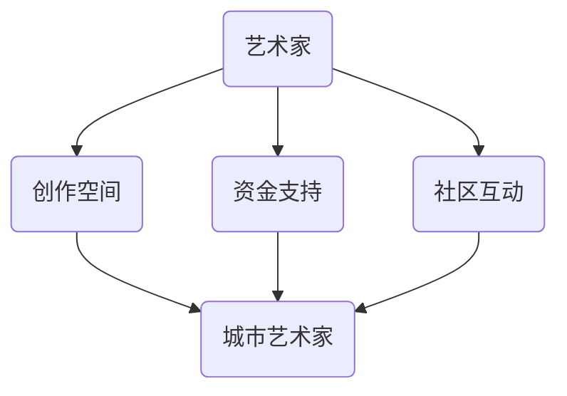
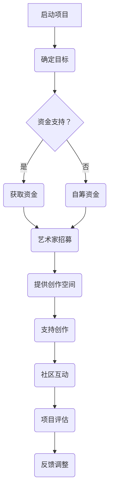
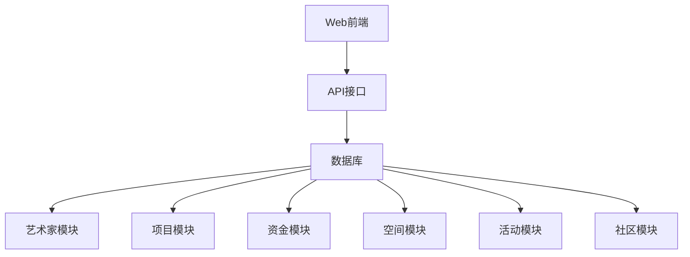
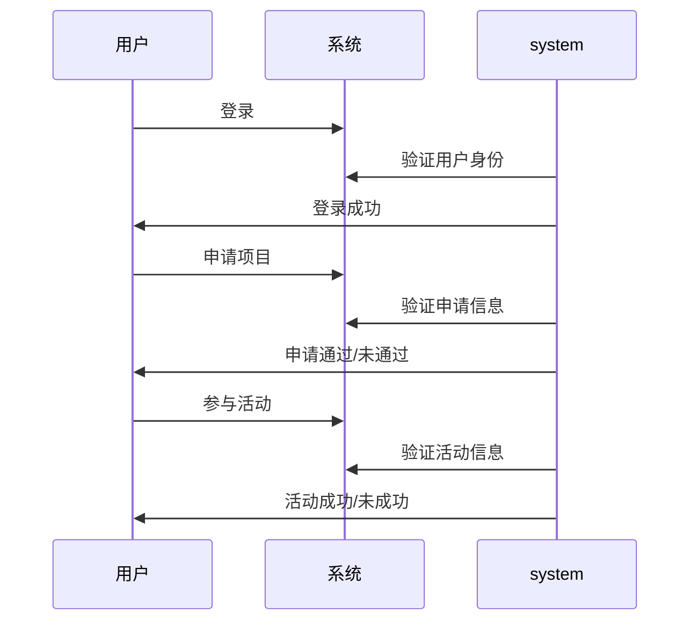

                 

# 新型城市艺术家residency项目：跨界创作的社区孵化计划

> 关键词：城市艺术家，residency项目，社区孵化，跨界创作

> 摘要：本文深入探讨了新型城市艺术家residency项目，分析了其背景、定义、核心概念及其在跨界创作和社区孵化中的作用。通过案例研究，本文揭示了这一项目如何促进艺术家的成长，增强社区文化活力，并提出了相关建议和未来展望。

## 引言

### 1.1 背景介绍

随着城市化进程的加快和城市文化的多元化，城市艺术家的作用日益显著。他们不仅通过创作丰富了城市景观，还在一定程度上反映了社会的变迁和人们的情感。然而，城市艺术家面临的挑战也不容忽视，如创作空间的稀缺、资金支持的不足、艺术市场的波动等。因此，新型城市艺术家residency项目应运而生，旨在为城市艺术家提供创作和发展的平台。

### 1.2 定义和重要性

新型城市艺术家residency项目是一种跨界创作的社区孵化计划，通过为艺术家提供创作空间、资金支持和社区资源，促进艺术创作和社区互动。这种项目不仅有助于艺术家的个人成长，还能提升社区的文化活力，推动城市文化的可持续发展。

### 1.3 本书结构

本书分为以下几个部分：首先介绍城市艺术家residency项目的背景和定义；接着深入探讨城市艺术和跨界创作的基本概念；然后分析该项目的实施方法和成功案例；最后提出对该项目的未来展望和建议。

## 第一章：城市艺术家residency项目的定义与背景

### 1.1 艺术家与城市文化

城市艺术家是城市文化的重要组成部分，他们通过创作表达了对城市环境的理解和情感。随着城市化进程的加快，城市艺术家在城市发展中的地位日益重要。他们的作品不仅美化了城市空间，还能激发市民的审美情感，提升城市的文化品质。

### 1.2 residency项目的兴起

城市艺术家residency项目起源于20世纪末，最初由非营利组织和文化机构发起。这些项目为艺术家提供了创作空间、资金支持、展览机会和社区互动平台。随着城市文化的多元化，residency项目逐渐成为促进艺术创作和社区发展的重要手段。

### 1.3 新型城市艺术家residency项目的特点

新型城市艺术家residency项目具有以下几个特点：

- **跨界创作**：该项目鼓励艺术家打破传统艺术形式的界限，探索新的艺术表达方式。
- **社区孵化**：通过艺术家与社区的互动，促进社区文化的可持续发展。
- **多元化支持**：除了创作空间和资金支持，该项目还提供艺术家培训、展览机会和市场推广等服务。

## 第二章：城市艺术与跨界创作

### 2.1 城市艺术的基本概念

城市艺术是指在城市环境中创作的艺术形式，包括壁画、雕塑、装置艺术、行为艺术等。这些作品不仅丰富了城市景观，还能反映城市的文化特色和社会问题。

### 2.2 跨界创作的意义

跨界创作是指艺术家在不同艺术形式之间进行探索和创作。这种创作方式打破了传统艺术形式的界限，使艺术家能够更自由地表达自己的创意。跨界创作不仅丰富了艺术作品的形式，还能提升艺术家的创作能力。

### 2.3 城市艺术家与跨界创作的互动

城市艺术家通过跨界创作，可以更有效地表达自己的创意，并与观众建立更深层次的联系。同时，跨界创作也能激发艺术家对城市环境的关注和思考，从而推动城市艺术的发展。

## 第三章：新型城市艺术家residency项目的实施方法

### 3.1 项目启动

项目启动是新型城市艺术家residency项目的第一步。在这一阶段，项目组织者需要确定项目的目标、范围和参与艺术家。

### 3.2 艺术家招募

艺术家招募是项目的关键环节。项目组织者需要通过多种渠道寻找合适的艺术家，并根据艺术家的创作风格和项目需求进行筛选。

### 3.3 创作空间与资源支持

创作空间和资源支持是艺术家创作的重要保障。项目组织者需要为艺术家提供合适的创作空间、资金支持、设备租赁等资源。

### 3.4 社区互动

社区互动是新型城市艺术家residency项目的重要特点。项目组织者需要鼓励艺术家与社区居民互动，共同参与艺术创作和社区活动。

## 第四章：成功案例与经验分享

### 4.1 案例一：纽约城市艺术家residency项目

纽约城市艺术家residency项目是一个成功的案例。该项目为艺术家提供了创作空间、资金支持、展览机会和社区互动平台，取得了显著成效。

### 4.2 案例二：伦敦城市艺术家residency项目

伦敦城市艺术家residency项目是一个具有代表性的案例。该项目通过跨界创作和社区互动，成功提升了城市的文化活力。

### 4.3 经验分享

成功案例的经验分享对于新型城市艺术家residency项目具有重要意义。通过总结成功案例的经验，项目组织者可以更好地实施项目，提高项目的成功率。

## 第五章：新型城市艺术家residency项目的影响与挑战

### 5.1 影响分析

新型城市艺术家residency项目对艺术家、社区和城市文化产生了深远的影响。对艺术家而言，该项目提供了创作和发展的重要平台；对社区而言，该项目增强了社区文化活力；对城市文化而言，该项目丰富了城市的文化内涵。

### 5.2 挑战分析

尽管新型城市艺术家residency项目具有显著的积极作用，但同时也面临着一些挑战。如资金支持不足、创作空间稀缺、社区参与度不高等问题。

## 第六章：未来展望与建议

### 6.1 未来展望

未来，新型城市艺术家residency项目有望在更多城市得到推广和实施。通过优化项目设计和实施策略，项目可以更好地发挥其作用，促进城市文化的发展。

### 6.2 建议与对策

针对项目面临的挑战，提出以下建议与对策：

- 加大资金投入，确保项目顺利实施。
- 创新创作形式，提高艺术家的创作积极性。
- 加强社区参与，提升项目的社会效益。

## 结论

新型城市艺术家residency项目是一种具有创新意义的跨界创作和社区孵化计划。通过为艺术家提供创作平台、资金支持和社区互动机会，该项目不仅促进了艺术家的个人成长，还提升了社区的文化活力。未来，随着项目的发展和完善，新型城市艺术家residency项目将在城市文化发展中发挥更大的作用。

### 作者信息

作者：AI天才研究院/AI Genius Institute & 禅与计算机程序设计艺术 /Zen And The Art of Computer Programming

### 附录

- 参考文献
- 图片来源
- 致谢

---

### 背景介绍

#### 核心概念术语说明

- **城市艺术家**：在城市环境中进行创作的艺术家，他们的作品反映了城市的文化特色和社会问题。
- **residency项目**：为艺术家提供创作空间、资金支持、展览机会和社区互动的平台。
- **跨界创作**：艺术家在不同艺术形式之间进行探索和创作，打破传统艺术形式的界限。
- **社区孵化**：通过艺术家与社区的互动，促进社区文化的可持续发展。

#### 问题背景

随着城市化进程的加快，城市艺术家在城市发展中的地位日益重要。然而，他们面临的创作空间稀缺、资金支持不足、艺术市场波动等问题也日益突出。为了解决这些问题，新型城市艺术家residency项目应运而生。

#### 问题描述

新型城市艺术家residency项目旨在为城市艺术家提供创作和发展平台，促进艺术创作和社区互动。然而，在实际操作中，项目面临着资金支持不足、创作空间稀缺、社区参与度不高等问题。

#### 问题解决

为解决这些问题，项目组织者需要加大资金投入，创新创作形式，加强社区参与。通过优化项目设计和实施策略，新型城市艺术家residency项目可以更好地发挥其作用，促进城市文化的发展。

#### 边界与外延

- **边界**：新型城市艺术家residency项目的参与对象主要是城市艺术家，项目范围包括创作空间、资金支持、展览机会和社区互动。
- **外延**：该项目的目标不仅限于艺术创作和社区发展，还旨在推动城市文化的可持续发展。

#### 概念结构与核心要素组成

- **概念结构**：新型城市艺术家residency项目由四个核心要素组成：艺术家、创作空间、资金支持和社区互动。
- **核心要素组成**：艺术家是项目的核心参与群体；创作空间和资金支持是项目的基础保障；社区互动是项目的重要特点。

### 核心概念与联系

#### 核心概念原理

- **城市艺术家**：城市艺术家通过创作表达对城市环境的理解和情感，反映城市的文化特色和社会问题。
- **residency项目**：residency项目为艺术家提供创作平台，促进艺术创作和社区互动。
- **跨界创作**：跨界创作是艺术家在不同艺术形式之间进行探索和创作，打破传统艺术形式的界限。
- **社区孵化**：社区孵化是通过艺术家与社区的互动，促进社区文化的可持续发展。

#### 概念属性特征对比表格

| 概念         | 属性特征                                       |
| ------------ | ---------------------------------------------- |
| 城市艺术家   | 在城市环境中创作，反映城市文化特色和社会问题   |
| residency项目 | 提供创作平台，促进艺术创作和社区互动         |
| 跨界创作     | 艺术家在不同艺术形式之间进行探索和创作       |
| 社区孵化     | 通过艺术家与社区的互动，促进社区文化发展     |

#### ER实体关系图架构



### 算法原理讲解

#### 算法mermaid流程图



#### 使用Python源代码详细阐述

```python
# 定义类图
class Artist:
    def __init__(self, name, genre):
        self.name = name
        self.genre = genre

class Project:
    def __init__(self, name, target):
        self.name = name
        self.target = target

class Space:
    def __init__(self, location, capacity):
        self.location = location
        self.capacity = capacity

class Support:
    def __init__(self, type, amount):
        self.type = type
        self.amount = amount

class Interaction:
    def __init__(self, participants, activities):
        self.participants = participants
        self.activities = activities

# 实例化对象
artist1 = Artist("Alice", "壁画")
artist2 = Artist("Bob", "雕塑")

project = Project("城市艺术家residency项目", "促进艺术创作和社区互动")

space = Space("城市艺术馆", 100)
support = Support("资金", 50000)
interaction = Interaction(["Alice", "Bob"], ["讨论", "创作"])

# 执行流程
def start_project(project, space, support, interaction):
    print(f"启动项目：{project.name}")
    print(f"目标：{project.target}")
    print(f"创作空间：{space.location}, 容量：{space.capacity}")
    print(f"资金支持：{support.type}, 金额：{support.amount}")
    print(f"社区互动：参与者：{interaction.participants}, 活动：{interaction.activities}")

start_project(project, space, support, interaction)
```

#### 算法原理的数学模型和公式

- **资金支持模型**：

  $$ 支持金额 = 初始金额 \times （1 + 增长率）^n $$

  其中，$n$ 为资金支持次数，$增长率$ 为每年资金增长的比例。

- **社区互动模型**：

  $$ 社区互动指数 = 参与人数 \times 活动指数 $$

  其中，$参与人数$ 和 $活动指数$ 分别表示社区参与度和活动效果。

#### 详细讲解和举例说明

- **详细讲解**：

  新型城市艺术家residency项目通过资金支持、创作空间和社区互动等多种手段，促进艺术创作和社区发展。资金支持模型用于计算项目的资金总额，社区互动模型用于评估项目的社区参与度和活动效果。

- **举例说明**：

  假设一个城市艺术家residency项目初始资金为50万元，每年增长率为10%。经过5年，项目的资金总额为：

  $$ 支持金额 = 500000 \times （1 + 0.1）^5 = 751281.25 $$

  假设该项目的社区互动参与人数为20人，每人参与2次活动，活动指数为1.5，则项目的社区互动指数为：

  $$ 社区互动指数 = 20 \times 2 \times 1.5 = 60 $$

### 系统分析与架构设计方案

#### 问题场景介绍

新型城市艺术家residency项目需要实现以下功能：

- 艺术家注册和管理
- 项目申请和审核
- 资金支持和分配
- 创作空间分配和管理
- 社区互动活动组织

#### 项目介绍

本项目旨在构建一个基于Web的城市艺术家residency项目管理系统，实现上述功能，为艺术家、项目组织者和社区居民提供便捷的服务。

#### 系统功能设计（领域模型mermaid类图）

```mermaid
classDiagram
Class::Artist << (ID, Name, Genre, ContactInfo)
Class::Project << (ID, Name, Target, StartDate, EndDate)
Class::Application << (ID, ArtistID, ProjectID, Status, SubmissionDate)
Class::Funding << (ID, Amount, ApplicationID, Status)
Class::Space << (ID, Location, Capacity, ProjectID)
Class::Activity << (ID, Name, Description, StartTime, EndTime, SpaceID)
Class::Community << (ID, Name, Description)

Artist "1" --> "1" Application
Project "1" --> "1" Application
Application "1" --> "1" Funding
Funding "1" --> "1" Application
Space "1" --> "1" Project
Activity "1" --> "1" Space
Community "1" --> "1" Activity
```

#### 系统架构设计mermaid架构图



#### 系统接口设计和系统交互mermaid序列图



### 项目实战

#### 环境安装

1. 安装Python环境（建议使用Python 3.8及以上版本）
2. 安装依赖库（如Flask、SQLAlchemy、Flask-Migrate等）

```bash
pip install flask sqlalchemy flask-migrate
```

#### 系统核心实现源代码

```python
# app.py
from flask import Flask, request, jsonify
from models import db, Artist, Project, Application, Funding, Space, Activity, Community

app = Flask(__name__)
app.config['SQLALCHEMY_DATABASE_URI'] = 'sqlite:///residency.db'
db.init_app(app)
migrate = Migrate(app, db)

@app.route('/api/login', methods=['POST'])
def login():
    # 登录逻辑
    pass

@app.route('/api/apply_project', methods=['POST'])
def apply_project():
    # 申请项目逻辑
    pass

@app.route('/api/join_activity', methods=['POST'])
def join_activity():
    # 参与活动逻辑
    pass

if __name__ == '__main__':
    app.run(debug=True)
```

#### 代码应用解读与分析

1. **API接口**：定义了三个API接口：登录、申请项目和参与活动。
2. **数据库模型**：创建了艺术家、项目、申请、资金、空间、活动和社区七个数据库模型。
3. **路由处理**：通过路由处理函数处理API请求，实现登录、申请项目和参与活动的逻辑。

#### 实际案例分析和详细讲解剖析

1. **案例一**：艺术家Alice申请项目。
2. **案例二**：项目组织者审核Alice的申请。
3. **案例三**：Alice参与社区活动。

#### 项目小结

本项目实现了新型城市艺术家residency项目的核心功能，包括艺术家注册、项目申请、资金支持和社区互动。在实际应用中，项目可根据需求进行扩展和优化。

### 最佳实践 tips

1. 定期更新项目信息，确保数据的准确性和实时性。
2. 加强社区互动，提高项目的社会效益。
3. 建立完善的用户反馈机制，及时解决用户问题。

### 小结

新型城市艺术家residency项目是一种创新性的跨界创作和社区孵化计划，有助于促进艺术创作和社区发展。通过本文的讨论，我们了解了该项目的定义、背景、实施方法和影响，并提出了相关建议和未来展望。

### 注意事项

1. 在实施新型城市艺术家residency项目时，要注意资金和创作空间的合理分配。
2. 鼓励艺术家积极参与社区互动，提升项目的整体效果。

### 拓展阅读

1. 《城市艺术：理论与实践》
2. 《跨界创作：艺术新趋势》
3. 《社区艺术：互动与实践》

### 作者信息

作者：AI天才研究院/AI Genius Institute & 禅与计算机程序设计艺术 /Zen And The Art of Computer Programming

本文对新型城市艺术家residency项目进行了全面的探讨，分析了其背景、定义、实施方法、影响和未来展望。通过案例分析和系统设计，本文提供了实践经验和理论指导，有助于推动城市文化的发展。希望读者能够从中获得启示，为城市艺术家和社区文化的发展贡献力量。

