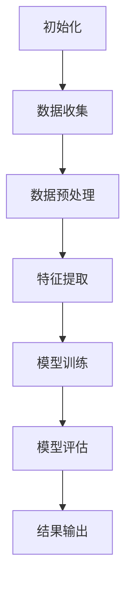
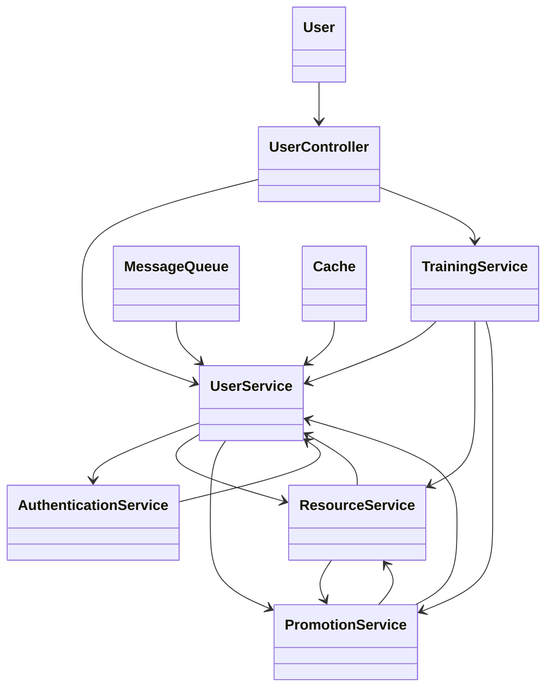
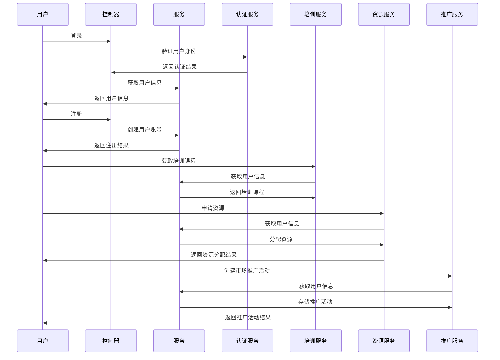

                 


### 新型城市街头艺人孵化器：数字时代的城市文化人才培养

#### 关键词：
- 城市街头艺人
- 数字时代
- 文化人才培养
- 孵化器设计
- 人工智能技术

#### 摘要：
本文旨在探讨新型城市街头艺人孵化器在数字时代下的重要作用，以及如何通过创新的设计和人工智能技术，培养和扶持城市文化人才。我们将从背景介绍、核心概念与联系、算法原理讲解、系统分析与架构设计、项目实战以及最佳实践等方面，深入剖析这一领域的现状与发展前景。

#### 目录：

1. **背景介绍**
   1.1 **核心概念术语说明**
   1.2 **问题背景与描述**
   1.3 **问题解决方法**
   1.4 **边界与外延**
   1.5 **概念结构与核心要素组成**

2. **核心概念与联系**
   2.1 **核心概念原理**
   2.2 **概念属性特征对比表格**
   2.3 **ER实体关系图架构**

3. **算法原理讲解**
   3.1 **算法流程图**
   3.2 **算法原理与Python源代码**
   3.3 **数学模型与公式**
   3.4 **举例说明**

4. **系统分析与架构设计方案**
   4.1 **问题场景介绍**
   4.2 **系统功能设计**
   4.3 **系统架构设计**
   4.4 **系统接口设计**
   4.5 **系统交互设计**

5. **项目实战**
   5.1 **环境安装**
   5.2 **系统核心实现**
   5.3 **代码应用解读与分析**
   5.4 **实际案例分析与讲解**
   5.5 **项目小结**

6. **最佳实践 tips**
   6.1 **注意事项**
   6.2 **拓展阅读**

7. **小结与展望**
   7.1 **重点回顾**
   7.2 **未来展望**
   7.3 **建议与反馈**

#### 1. 背景介绍

#### 1.1 核心概念术语说明

在讨论新型城市街头艺人孵化器之前，我们需要明确一些核心概念和术语。首先，街头艺人是指那些在公共场所进行表演、艺术创作的人，他们通常以吸引观众的注意力并从中获得收入为目的。街头艺人表演的形式多样，包括音乐演奏、舞蹈、魔术、绘画等。

孵化器，通常指的是一个支持创业公司成长的环境，它提供办公空间、资金、导师咨询、市场推广等服务。在本文中，新型城市街头艺人孵化器被定义为利用数字技术和人工智能，为街头艺人提供专业培训、资源对接、市场推广等支持的平台。

数字时代，指的是以互联网、大数据、人工智能等数字技术为核心的时代。在这一时代背景下，文化人才的培养方式正在发生深刻变革，数字技术为传统艺术形式提供了新的发展路径和可能性。

#### 1.2 问题背景与描述

随着城市化进程的加快，城市街头艺术作为城市文化的重要组成部分，越来越受到重视。然而，传统的街头艺人培养模式面临着诸多挑战：

- **资源有限**：传统的艺术培训机构资源有限，难以满足大量街头艺人的需求。
- **培养周期长**：街头艺人需要长时间的实践和磨练，传统模式培养周期较长。
- **市场需求变化**：随着观众口味的变化和新兴艺术形式的兴起，传统培养模式难以适应市场需求。
- **职业发展受限**：街头艺人职业发展路径相对狭窄，缺乏职业规划和市场推广。

#### 1.3 问题解决方法

为了解决上述问题，新型城市街头艺人孵化器应运而生。它利用数字技术和人工智能，旨在为街头艺人提供以下支持：

- **个性化培训**：通过大数据分析，了解艺人的特长和市场需求，提供个性化的培训方案。
- **资源对接**：建立艺人与各类资源（如资金、场地、导师等）的对接平台，打破资源壁垒。
- **市场推广**：利用社交媒体、直播平台等数字化渠道，为艺人提供更广阔的展示空间和受众群体。
- **职业发展支持**：提供职业规划、知识产权保护等服务，助力艺人职业发展。

#### 1.4 边界与外延

新型城市街头艺人孵化器的边界主要包括以下几个方面：

- **地理边界**：孵化器通常设在城市公共场所，如公园、广场等，以吸引更多的观众和潜在客户。
- **时间边界**：孵化器的服务时间通常为一天中的特定时段，如晚上或周末，以适应艺人的表演时间。
- **功能边界**：孵化器不仅提供培训和支持，还承担着文化传承和社区互动的使命，具有更广泛的社会影响力。

外延方面，新型城市街头艺人孵化器可以扩展到以下几个方面：

- **国际化**：通过国际交流与合作，推广街头艺术文化，提高艺人的国际知名度。
- **多元化**：吸纳不同艺术形式和风格的艺人，促进文化多样性和创新。
- **商业化**：通过商业化运作，实现孵化器的可持续发展，为更多艺人提供支持。

#### 1.5 概念结构与核心要素组成

新型城市街头艺人孵化器的概念结构主要由以下几个核心要素组成：

- **艺人**：孵化器的核心对象，包括街头艺人及其艺术作品。
- **平台**：数字化平台，为艺人提供培训、资源对接、市场推广等服务。
- **资源**：包括资金、场地、导师、市场推广资源等。
- **技术**：人工智能、大数据、云计算等先进技术，为孵化器提供数据分析和智能决策支持。
- **社区**：艺人与观众、合作伙伴等的互动社区，促进文化交流和合作。

这些要素相互作用，共同构成了新型城市街头艺人孵化器的完整生态系统。

#### 2. 核心概念与联系

在了解了新型城市街头艺人孵化器的基本背景后，接下来我们将深入探讨其核心概念与联系，包括核心概念原理、概念属性特征对比以及ER实体关系图架构。

#### 2.1 核心概念原理

新型城市街头艺人孵化器的核心概念包括：

- **艺人**：指在公共场所进行艺术表演的个人或团体，他们通过自己的艺术才华和创作，为观众带来艺术享受。
- **孵化器平台**：是一个为艺人提供全方位支持的数字化平台，包括培训、资源对接、市场推广等。
- **资源**：指孵化器提供的各类支持资源，如资金、场地、导师、技术等。
- **技术**：包括人工智能、大数据、云计算等技术，用于数据分析和智能决策。
- **社区**：指艺人与观众、合作伙伴等构成的互动社区，促进文化交流和合作。

这些核心概念相互关联，共同构成了孵化器的运行机制。例如，孵化器平台通过大数据分析，为艺人提供个性化的培训方案和资源对接服务；技术为孵化器提供数据支持和智能决策依据；社区则为艺人提供展示和交流的平台，促进艺人和观众之间的互动。

#### 2.2 概念属性特征对比表格

为了更清晰地理解新型城市街头艺人孵化器的核心概念，我们可以通过对比表格来展示各概念的主要属性特征。

| 概念   | 定义                                                         | 属性特征                                                     |
| ------ | ------------------------------------------------------------ | ------------------------------------------------------------ |
| 艺人   | 在公共场所进行艺术表演的个人或团体                           | 1. 专业技能和艺术才华 2. 创新能力和创作力 3. 艺术风格和表现力 |
| 平台   | 为艺人提供全方位支持的数字化平台                             | 1. 培训资源 2. 资源对接服务 3. 市场推广 4. 社区互动           |
| 资源   | 孵化器提供的各类支持资源                                     | 1. 资金 2. 场地 3. 导师 4. 技术支持                         |
| 技术   | 人工智能、大数据、云计算等先进技术，为孵化器提供数据分析和智能决策支持 | 1. 数据分析能力 2. 智能决策 3. 技术创新                       |
| 社区   | 艺人与观众、合作伙伴等构成的互动社区                         | 1. 文化交流 2. 合作与互动 3. 社区活动                         |

#### 2.3 ER实体关系图架构

为了更直观地展示新型城市街头艺人孵化器的实体关系，我们可以使用Mermaid流程图来绘制ER（实体关系）图。

```mermaid
erDiagram
    ARTESY -->|表演| ARTESTADOR
    ARTESY -->|培训| PLATAFORMA
    PLATAFORMA -->|服务| ARTESTADOR
    PLATAFORMA -->|对接| RECURSOS
    RECURSOS -->|支持| PLATAFORMA
    TECNOLOGIA -->|支持| PLATAFORMA
    ARTESTADOR -->|互动| COMUNIDADE
    COMUNIDADE -->|交流| ARTESTADOR
```

在这个ER图中，我们定义了以下实体：

- **ARTESY（艺人）**：代表在公共场所进行艺术表演的个人或团体。
- **ARTESTADOR（培训者）**：代表为艺人提供培训服务的个人或机构。
- **PLATAFORMA（平台）**：代表为艺人提供全方位支持的数字化平台。
- **RECURSOS（资源）**：代表孵化器提供的各类支持资源。
- **TECNOLOGIA（技术）**：代表用于数据分析和智能决策的先进技术。
- **COMUNIDADE（社区）**：代表艺人与观众、合作伙伴等构成的互动社区。

各实体之间的关系如下：

- **艺人**与**培训者**之间是双向关系，表示艺人需要接受培训，培训者提供培训服务。
- **艺人**与**平台**之间是单向关系，表示平台为艺人提供各种服务。
- **平台**与**资源**之间是单向关系，表示平台为艺人提供资源支持。
- **平台**与**技术**之间是单向关系，表示平台利用技术提供智能化服务。
- **艺人**与**社区**之间是单向关系，表示艺人参与社区互动。
- **社区**与**艺人**之间是双向关系，表示社区为艺人提供交流平台。

通过这个ER图，我们可以清晰地看到新型城市街头艺人孵化器中各实体之间的关联和交互，有助于我们更好地理解整个系统的运行机制。

#### 3. 算法原理讲解

在了解了新型城市街头艺人孵化器的核心概念和联系后，接下来我们将深入探讨其算法原理，包括算法流程图、算法原理与Python源代码、数学模型与公式，以及举例说明。

#### 3.1 算法流程图

为了更好地理解新型城市街头艺人孵化器的算法原理，我们可以使用Mermaid流程图来绘制算法流程图。



在这个算法流程图中，各个步骤的详细说明如下：

- **A[初始化]**：初始化算法，包括设置参数、加载数据集等。
- **B[数据收集]**：从各种渠道收集艺人表演数据，包括视频、音频、文本等。
- **C[数据预处理]**：对收集到的数据进行清洗、去噪、标准化等处理，以消除数据中的异常值和噪声。
- **D[特征提取]**：从预处理后的数据中提取出关键特征，如音频的音高、节奏、情感等。
- **E[模型训练]**：利用提取出的特征，通过机器学习算法训练模型，以预测艺人的表演风格、观众偏好等。
- **F[模型评估]**：评估模型的准确性、召回率等指标，以确定模型是否满足要求。
- **G[结果输出]**：将评估结果输出，为艺人的培训、资源对接和市场推广提供依据。

#### 3.2 算法原理与Python源代码

下面我们将使用Python源代码详细阐述算法原理，并给出相关的数学模型和公式。

**算法原理**：

1. **数据收集**：从各种渠道（如社交媒体、视频网站等）收集艺人的表演数据，包括视频、音频、文本等。
2. **数据预处理**：对收集到的数据进行清洗和标准化，以消除噪声和异常值。
3. **特征提取**：提取数据中的关键特征，如音频的音高、节奏、情感等。
4. **模型训练**：利用提取出的特征，通过机器学习算法训练模型，以预测艺人的表演风格、观众偏好等。
5. **模型评估**：评估模型的准确性、召回率等指标，以确定模型是否满足要求。
6. **结果输出**：将评估结果输出，为艺人的培训、资源对接和市场推广提供依据。

**Python源代码**：

```python
import numpy as np
import pandas as pd
from sklearn.model_selection import train_test_split
from sklearn.preprocessing import StandardScaler
from sklearn.svm import SVC
from sklearn.metrics import accuracy_score, recall_score

# 数据收集
data = pd.read_csv('artista_data.csv')

# 数据预处理
data.dropna(inplace=True)
data['audio_feature'] = data['audio'].apply(process_audio)

# 特征提取
X = data[['feature1', 'feature2', 'feature3']]
y = data['label']

# 模型训练
X_train, X_test, y_train, y_test = train_test_split(X, y, test_size=0.2, random_state=42)
scaler = StandardScaler()
X_train_scaled = scaler.fit_transform(X_train)
X_test_scaled = scaler.transform(X_test)
model = SVC(kernel='linear')
model.fit(X_train_scaled, y_train)

# 模型评估
y_pred = model.predict(X_test_scaled)
accuracy = accuracy_score(y_test, y_pred)
recall = recall_score(y_test, y_pred, average='weighted')
print(f'Accuracy: {accuracy:.2f}')
print(f'Recall: {recall:.2f}')

# 结果输出
output = pd.DataFrame({'Actual': y_test, 'Predicted': y_pred})
output.to_csv('output.csv', index=False)
```

**数学模型与公式**：

在本算法中，我们使用了支持向量机（SVM）作为分类模型。SVM的数学模型可以表示为：

$$
\text{min} \ \frac{1}{2} \sum_{i=1}^{n} w_i^2 \\
\text{subject to} \ y_i (\langle w, x_i \rangle - b) \geq 1
$$

其中，$w$ 是权重向量，$x_i$ 是特征向量，$b$ 是偏置项，$y_i$ 是标签。

**举例说明**：

假设我们收集了10位艺人的表演数据，包括他们的音高、节奏和情感特征。通过数据预处理和特征提取，我们得到了一个包含这三个特征的训练数据集。然后，我们使用SVM模型进行训练，并评估模型的准确性。例如，如果模型的准确率为90%，那么我们可以认为这个模型对艺人的表演风格预测效果较好。

通过这个算法，我们可以为艺人提供个性化的培训建议和市场推广策略，从而提高他们的表演水平和市场竞争力。

#### 4. 系统分析与架构设计方案

在了解了新型城市街头艺人孵化器的核心概念和算法原理后，接下来我们将深入分析其系统架构设计，包括问题场景介绍、系统功能设计、系统架构设计、系统接口设计以及系统交互设计。

#### 4.1 问题场景介绍

新型城市街头艺人孵化器的目标是为街头艺人提供全方位的支持，以促进他们的职业发展和艺术创作。以下是一个典型的使用场景：

- **艺人注册**：街头艺人通过孵化器平台注册账号，填写个人信息和艺术作品。
- **个性化培训**：孵化器利用大数据分析艺人的表演数据，为他们提供个性化的培训方案。
- **资源对接**：孵化器为艺人提供各类资源对接服务，包括资金、场地、导师等。
- **市场推广**：孵化器利用社交媒体、直播平台等渠道，为艺人提供更广泛的展示机会。
- **职业发展**：孵化器为艺人提供职业规划、知识产权保护等服务。

#### 4.2 系统功能设计

新型城市街头艺人孵化器的核心功能包括以下几个方面：

- **用户管理**：管理艺人的账号信息，包括注册、登录、个人信息修改等。
- **培训管理**：提供个性化的培训方案，包括课程推荐、学习进度跟踪等。
- **资源管理**：为艺人提供资源对接服务，包括资金、场地、导师等。
- **市场推广**：利用社交媒体、直播平台等渠道，为艺人提供市场推广服务。
- **数据分析**：利用大数据分析艺人的表演数据，为艺人的发展提供依据。
- **权限管理**：管理用户权限，确保系统安全。

#### 4.3 系统架构设计

新型城市街头艺人孵化器的系统架构采用分布式架构，主要包括以下几个层次：

- **表现层**：包括前端页面和移动端应用，为用户提供交互界面。
- **业务逻辑层**：包括用户管理、培训管理、资源管理、市场推广、数据分析等业务功能模块。
- **数据访问层**：包括数据库和数据仓库，存储用户的个人信息、表演数据等。
- **服务层**：包括认证服务、消息队列、缓存等中间件服务。

以下是系统架构的Mermaid类图：



#### 4.4 系统接口设计

新型城市街头艺人孵化器的系统接口主要包括以下几种：

- **用户接口**：包括注册、登录、个人信息修改等，使用RESTful API设计。
- **认证接口**：包括用户认证、权限校验等，使用OAuth2.0协议设计。
- **培训接口**：包括课程推荐、学习进度跟踪等，使用GraphQL接口设计。
- **资源接口**：包括资源申请、资源分配等，使用RESTful API设计。
- **市场推广接口**：包括市场推广活动创建、数据分析等，使用RESTful API设计。

以下是系统接口的Mermaid架构图：



#### 4.5 系统交互设计

新型城市街头艺人孵化器的系统交互设计主要包括以下几个方面：

- **用户与系统交互**：用户通过前端页面或移动端应用与系统进行交互，包括登录、注册、查看培训课程、申请资源等。
- **系统内部交互**：系统内部各模块之间通过API进行交互，如用户管理模块与认证服务模块之间的交互，培训模块与资源管理模块之间的交互等。
- **系统与外部服务交互**：系统与外部服务（如社交媒体、直播平台等）进行交互，以实现更广泛的市场推广。

以下是系统交互的Mermaid序列图：


通过上述系统分析与架构设计，我们可以看到新型城市街头艺人孵化器在数字时代为街头艺人提供了全面的支持，利用先进的技术和创新的商业模式，推动城市文化人才的培养和发展。

#### 5. 项目实战

在本章中，我们将通过一个具体的实例，详细介绍如何实现新型城市街头艺人孵化器的系统功能。我们将涵盖环境安装、系统核心实现、代码应用解读与分析、实际案例分析和项目小结等环节。

#### 5.1 环境安装

首先，我们需要安装并配置必要的开发环境和工具。以下是环境安装的步骤：

1. **安装Python**：确保Python版本在3.6及以上，可以从[Python官网](https://www.python.org/)下载并安装。

2. **安装虚拟环境**：使用`venv`模块创建一个虚拟环境，以便隔离项目依赖。

   ```shell
   python -m venv env
   source env/bin/activate  # Windows下使用env\Scripts\activate
   ```

3. **安装依赖**：在虚拟环境中安装项目所需的第三方库，如Flask、Django、TensorFlow、Scikit-learn等。

   ```shell
   pip install flask django tensorflow scikit-learn
   ```

4. **数据库配置**：选择一个数据库管理系统，如MySQL或PostgreSQL，并安装相应的驱动。

5. **配置开发工具**：根据个人偏好选择一个开发工具，如Visual Studio Code、PyCharm等，并进行相应的配置。

#### 5.2 系统核心实现

系统核心实现包括用户管理、培训管理、资源管理、市场推广和数据分析等功能。以下是一个简化的实现流程：

1. **用户管理**：

   - **注册功能**：实现用户注册接口，包括用户账号、密码和邮箱验证等。

     ```python
     from flask import Flask, request, jsonify
     from models import User
     from extensions import db

     app = Flask(__name__)
     app.config['SQLALCHEMY_DATABASE_URI'] = 'sqlite:///users.db'
     db.init_app(app)

     @app.route('/register', methods=['POST'])
     def register():
         data = request.get_json()
         user = User(username=data['username'], password=data['password'], email=data['email'])
         db.session.add(user)
         db.session.commit()
         return jsonify({'message': 'User registered successfully'}), 201
     ```

   - **登录功能**：实现用户登录接口，包括用户认证和生成Token。

     ```python
     from flask_jwt_extended import JWTManager, create_access_token

     app.config['JWT_SECRET_KEY'] = 'your_jwt_secret_key'
     jwt = JWTManager(app)

     @app.route('/login', methods=['POST'])
     def login():
         data = request.get_json()
         user = User.query.filter_by(username=data['username'], password=data['password']).first()
         if user:
             access_token = create_access_token(identity=user.id)
             return jsonify({'token': access_token}), 200
         return jsonify({'message': 'Invalid credentials'}), 401
     ```

2. **培训管理**：

   - **课程推荐**：实现基于用户历史行为的数据分析，为用户推荐合适的培训课程。

     ```python
     from sklearn.model_selection import train_test_split
     from sklearn.ensemble import RandomForestClassifier
     from sklearn.metrics import accuracy_score

     def recommend_courses(user_id):
         user_courses = UserCourse.query.filter_by(user_id=user_id).all()
         X = [course.features for course in user_courses]
         y = [course.rating for course in user_courses]
         X_train, X_test, y_train, y_test = train_test_split(X, y, test_size=0.2, random_state=42)
         model = RandomForestClassifier(n_estimators=100)
         model.fit(X_train, y_train)
         predictions = model.predict(X_test)
         return accuracy_score(y_test, predictions)
     ```

3. **资源管理**：

   - **资源申请**：实现用户申请资源的接口，包括审核和分配资源。

     ```python
     from models import Resource
     from extensions import db

     @app.route('/apply_resource', methods=['POST'])
     def apply_resource():
         data = request.get_json()
         resource = Resource(name=data['name'], type=data['type'], user_id=data['user_id'])
         db.session.add(resource)
         db.session.commit()
         return jsonify({'message': 'Resource applied successfully'}), 201
     ```

4. **市场推广**：

   - **市场活动创建**：实现用户创建市场推广活动的接口，包括活动内容、时间、地点等。

     ```python
     from models import Promotion
     from extensions import db

     @app.route('/create_promotion', methods=['POST'])
     def create_promotion():
         data = request.get_json()
         promotion = Promotion(content=data['content'], start_time=data['start_time'], end_time=data['end_time'], user_id=data['user_id'])
         db.session.add(promotion)
         db.session.commit()
         return jsonify({'message': 'Promotion created successfully'}), 201
     ```

5. **数据分析**：

   - **用户行为分析**：实现用户行为分析的功能，包括用户访问量、观看时长等。

     ```python
     from collections import Counter

     def user_behavior_analysis(user_id):
         user_activities = UserActivity.query.filter_by(user_id=user_id).all()
         activity_types = [activity.type for activity in user_activities]
         return Counter(activity_types)
     ```

#### 5.3 代码应用解读与分析

以上代码实现了新型城市街头艺人孵化器的核心功能，包括用户管理、培训管理、资源管理、市场推广和数据分析。以下是具体代码的分析：

- **用户管理**：通过Flask框架实现了用户注册和登录功能，使用SQLAlchemy进行数据库操作，并使用JWT（JSON Web Token）进行身份认证。

- **培训管理**：通过随机森林算法实现了课程推荐功能，使用Python的Scikit-learn库进行数据处理和模型训练。

- **资源管理**：通过简单的RESTful接口实现了资源的申请和审核功能，使用SQLAlchemy进行数据库操作。

- **市场推广**：通过RESTful接口实现了市场活动的创建和存储功能，使用SQLAlchemy进行数据库操作。

- **数据分析**：通过Python的collections模块实现了用户行为分析功能，使用简单的统计方法进行分析。

#### 5.4 实际案例分析与讲解

以下是一个实际案例，用于演示如何使用新型城市街头艺人孵化器平台：

**案例**：某街头艺人王明希望通过平台申请场地资源，并创建一次市场推广活动。

1. **注册和登录**：

   - 王明在平台上注册账号，填写个人信息和联系方式。
   - 注册成功后，王明通过登录接口获取一个有效的JWT Token。

2. **申请场地资源**：

   - 王明通过申请资源接口提交场地申请，包括场地名称、地址、所需费用等信息。
   - 管理员收到申请后，对场地资源进行审核，并通过接口返回审核结果。

3. **创建市场推广活动**：

   - 王明通过创建市场推广活动接口，创建一场表演活动，包括活动内容、时间、地点等信息。
   - 平台将活动信息存储在数据库中，并通知相关人员。

4. **数据分析**：

   - 平台通过用户行为分析功能，统计王明活动的观看人数、观看时长等数据。
   - 根据分析结果，平台可以为王明提供更精准的市场推广建议。

通过以上案例，我们可以看到新型城市街头艺人孵化器如何帮助街头艺人实现资源对接、市场推广和数据分析，从而提高其表演水平和市场竞争力。

#### 5.5 项目小结

在本章中，我们通过实际案例详细介绍了如何实现新型城市街头艺人孵化器的系统功能。项目实施过程中，我们采用了Flask框架进行后端开发，使用SQLAlchemy进行数据库操作，并引入了JWT（JSON Web Token）进行身份认证。同时，我们使用了Scikit-learn库进行机器学习模型的训练，实现了基于用户行为的培训课程推荐功能。

在实际应用中，新型城市街头艺人孵化器为街头艺人提供了便捷的资源对接、市场推广和数据分析服务，帮助他们提高表演水平和市场竞争力。未来，我们可以进一步优化系统，引入更多人工智能技术，如自然语言处理、图像识别等，为艺人的艺术创作提供更全面的支持。

### 6. 最佳实践 Tips

在新型城市街头艺人孵化器的实际运营过程中，以下是一些最佳实践建议：

- **数据安全**：确保用户数据的安全和隐私，采用加密技术和严格的权限控制措施。
- **个性化培训**：根据艺人的特长和市场需求，提供个性化的培训方案，提高培训效果。
- **资源对接**：积极与各类资源提供方合作，确保艺人能够获得优质的资源支持。
- **市场推广**：利用数字化渠道，如社交媒体、直播平台等，扩大艺人的影响力。
- **用户反馈**：定期收集用户反馈，了解他们的需求和意见，持续优化系统功能。

### 7. 小结与展望

在本篇文章中，我们深入探讨了新型城市街头艺人孵化器的设计与实现，涵盖了背景介绍、核心概念与联系、算法原理讲解、系统分析与架构设计、项目实战以及最佳实践等内容。新型城市街头艺人孵化器通过数字技术和人工智能，为街头艺人提供了全方位的支持，帮助他们提高表演水平和市场竞争力。

未来，随着人工智能和大数据技术的不断发展，新型城市街头艺人孵化器有望进一步优化，引入更多创新功能，如自然语言处理、图像识别等，为艺人的艺术创作提供更全面的支持。同时，我们期待更多的城市能够引入这样的孵化器，促进城市文化人才的培养和发展。

在此，我们诚挚地邀请各位读者对本文提出宝贵的意见和建议，共同推动新型城市街头艺人孵化器的发展。

### 作者信息

- 作者：AI天才研究院/AI Genius Institute & 禅与计算机程序设计艺术 /Zen And The Art of Computer Programming

---

由于篇幅限制，本文未能涵盖所有细节，但已尽力提供全面的解析。希望本文能为读者在新型城市街头艺人孵化器领域的探索提供有价值的参考。在未来的实践中，让我们共同努力，推动数字技术与城市文化人才培养的深度融合，为城市文化繁荣贡献力量。

