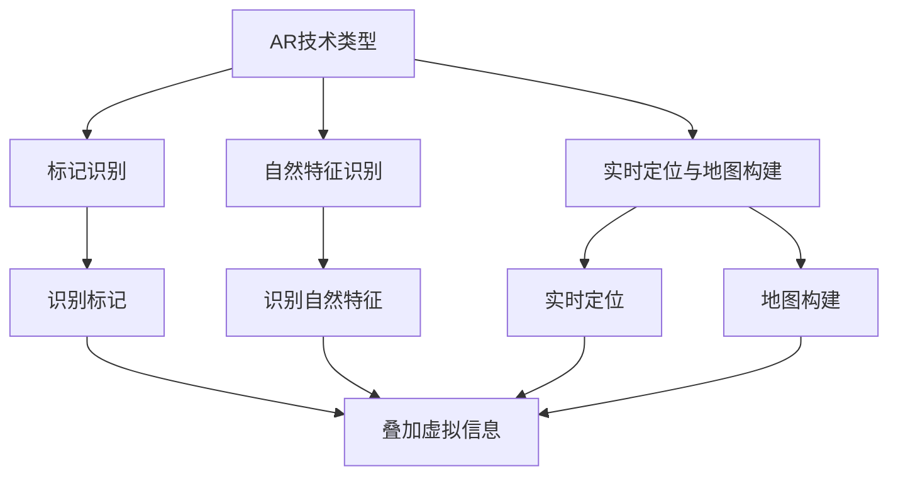
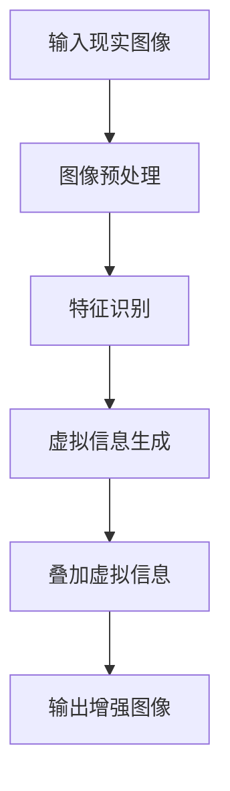
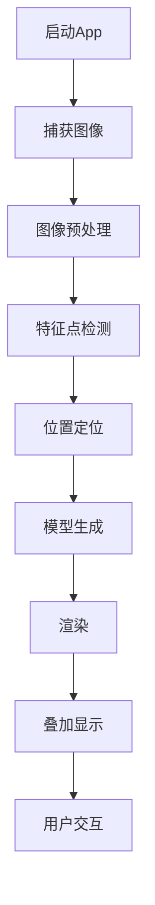

                 


## 引言：新型城市街头艺术地图App：AR增强现实技术的城市文化导览

在当今这个数字时代，科技的进步正迅速改变着我们的生活方式。尤其是智能手机和移动互联网的普及，为人们提供了丰富的数字体验。在这样一个背景下，新型城市街头艺术地图App应运而生，它利用AR（增强现实）技术为用户提供了一种全新的城市文化导览方式。本文旨在探讨这种新型App的设计原理、实现方法及其在现实世界中的应用。

### 关键词
- **新型城市街头艺术地图App**
- **AR增强现实技术**
- **城市文化导览**
- **用户需求分析**
- **系统架构设计**

### 摘要
本文首先介绍了新型城市街头艺术地图App的背景，包括街头艺术在当代城市文化中的重要性以及AR技术的基本概念。接着，分析了用户对城市文化导览的需求，并阐述了如何利用AR技术解决现有地图App的不足。随后，文章深入探讨了AR技术的基础原理，并通过具体案例展示了如何将AR技术与城市文化导览相结合。最后，文章提出了新型城市街头艺术地图App的系统设计与开发方法，并给出了开发与优化过程中的最佳实践。

## 第一部分：前言

### 1.1 书籍背景

城市街头艺术作为一种独特的文化表现形式，已经成为现代城市文化的重要组成部分。它不仅反映了城市的独特风貌和居民的生活态度，也为城市带来了浓厚的艺术氛围和独特的旅游资源。然而，传统的地图App在展示这些艺术作品时，往往只能提供文字描述或图片展示，难以让用户感受到艺术作品的真实魅力。

AR（增强现实）技术的出现，为解决这一问题提供了新的可能。AR技术通过在现实世界场景中叠加虚拟信息，使用户能够直观地感受和互动，从而大大增强了用户体验。将AR技术与城市街头艺术地图App相结合，不仅可以提供更加生动、互动的导览体验，还能更好地传达城市的文化内涵。

### 1.2 研究问题与解决

现有的街头艺术地图App存在一些明显的不足：

1. **信息展示单一**：传统地图App主要依赖文字描述和图片展示，缺乏互动性和沉浸感。
2. **艺术信息不完整**：一些艺术作品可能由于位置偏远或数量众多而未能得到充分展示。
3. **用户体验差**：用户在使用过程中往往难以找到目标艺术作品，导航体验不佳。

AR技术可以通过以下方式解决这些问题：

1. **增强信息展示**：通过AR技术，用户可以在现实环境中实时看到艺术作品的3D模型和相关信息，增加互动性和沉浸感。
2. **优化艺术信息展示**：AR技术可以动态调整展示内容，让更多的艺术作品得到展示，提高信息的完整性。
3. **提升用户体验**：通过AR导航和互动功能，用户可以更轻松地找到目标艺术作品，提升整体导航体验。

### 1.3 边界与外延

新型城市街头艺术地图App的边界主要包括：

1. **功能范围**：主要提供城市街头艺术的导览服务，包括艺术作品的展示、位置导航和互动功能。
2. **应用范围**：适用于各类城市的艺术导览，不仅限于街头艺术，还可以扩展到博物馆、历史遗址等。

### 1.4 核心概念

#### AR增强现实技术

**基本原理**：AR技术通过将虚拟信息叠加到现实环境中，使用户能够同时看到现实和虚拟内容。

**发展历程**：从早期的增强现实眼镜到如今的智能手机和平板电脑，AR技术经历了快速的发展。

**主要分类**：

- **标记识别**：通过识别现实环境中的特定标记，叠加虚拟信息。
- **自然特征识别**：通过识别现实环境中的自然特征，如形状、颜色等，叠加虚拟信息。
- **实时定位与地图构建**：通过实时定位和地图构建技术，实现精准的虚拟信息叠加。

#### 地图App设计原则

- **用户体验**：以用户为中心，提供直观、易用的界面和功能。
- **功能完善**：提供完整、详实的艺术作品信息，确保用户能够获得满意的导览体验。
- **可扩展性**：设计灵活，能够适应未来技术的更新和应用。

#### 城市文化导览

- **重要性**：城市文化导览不仅能够提升旅游经济的收益，还能增强城市的文化氛围和居民的文化认同感。
- **用户需求**：用户对城市文化导览的需求主要表现在艺术作品的深度了解、历史背景的获取以及互动体验的追求。

通过上述核心概念和设计原则，我们可以更好地理解新型城市街头艺术地图App的背景、问题和解决思路。在接下来的章节中，我们将深入探讨AR技术的原理和应用，以及如何通过具体的技术实现，打造一款成功的城市文化导览App。

## 第二部分：AR增强现实技术基础

### 2.1 AR技术概述

#### 基本原理

增强现实（Augmented Reality，简称AR）是一种将虚拟信息叠加到真实环境中的技术，使用户能够同时看到真实世界和虚拟信息。其基本原理是通过摄像设备捕捉现实环境的图像，然后利用计算机处理和识别这些图像，再将虚拟信息以图形、文字或音频等形式叠加到这些图像上，最后将叠加后的图像实时显示给用户。

#### 发展历程

AR技术的发展可以追溯到20世纪60年代。当时，AR技术的概念由波音公司的美国计算机科学家阿尔文·特夫特（Alvin M. Toffler）首次提出。早期的AR设备主要应用于军事、医学和制造业等领域。直到21世纪初，随着计算机性能的提升和智能手机的普及，AR技术才逐渐走入大众视野。近年来，AR技术得到了快速发展，各类应用场景不断涌现，如游戏、教育、医疗和旅游等。

#### 主要分类

根据实现方式的不同，AR技术主要分为以下几类：

1. **标记识别**：通过识别现实环境中的特定标记（如二维码、AR标记等），叠加虚拟信息。这种方式的优点是简单易用，但缺点是标记的存在限制了应用范围。
2. **自然特征识别**：通过识别现实环境中的自然特征（如形状、颜色等），叠加虚拟信息。这种方式不需要特定的标记，但识别难度较大，对算法的要求较高。
3. **实时定位与地图构建**：通过实时定位和地图构建技术，实现精准的虚拟信息叠加。这种方式通常结合GPS、陀螺仪、加速度计等传感器，适用于复杂环境中的AR应用。

### 2.2 AR技术核心概念

为了更好地理解AR技术的核心概念，我们可以通过以下表格对各种AR技术进行对比：

| **AR技术类型** | **基本原理** | **优点** | **缺点** | **适用场景** |
| :---: | :---: | :---: | :---: | :---: |
| 标记识别 | 通过识别特定标记叠加虚拟信息 | 简单易用，识别速度快 | 受限于标记的存在，应用范围受限 | 游戏互动、展览展示 |
| 自然特征识别 | 通过识别自然特征叠加虚拟信息 | 不受标记限制，适应性强 | 识别难度大，对算法要求高 | 室内导航、建筑展示 |
| 实时定位与地图构建 | 通过实时定位和地图构建叠加虚拟信息 | 精准度高，适应复杂环境 | 需要复杂的传感器支持，成本较高 | 户外导航、空间展示 |

#### ER实体关系图架构的Mermaid流程图

为了更直观地展示AR技术的核心概念，我们可以使用Mermaid流程图来描述ER（实体关系）图架构。以下是一个简化的示例：



这个流程图展示了AR技术的三种类型以及它们各自的核心概念和实现方式。

### 2.3 算法原理讲解

AR技术的核心在于如何将虚拟信息准确叠加到现实环境中。以下是一个简单的算法原理讲解，使用Mermaid流程图和Python源代码来详细阐述。

#### Mermaid流程图



#### Python源代码实现

```python
import cv2
import numpy as np

# 输入现实图像
image = cv2.imread('input.jpg')

# 图像预处理
gray_image = cv2.cvtColor(image, cv2.COLOR_BGR2GRAY)
blurred_image = cv2.GaussianBlur(gray_image, (5, 5), 0)

# 特征识别
corners = cv2.goodFeaturesToTrack(blurred_image, 200, 0.01, 10)

# 虚拟信息生成
if corners is not None:
    for corner in corners:
        x, y = corner.ravel()
        cv2.circle(image, (x, y), 5, (255, 0, 0), -1)

# 叠加虚拟信息
enhanced_image = cv2.add(image, np.zeros(image.shape, image.dtype))

# 输出增强图像
cv2.imwrite('output.jpg', enhanced_image)
```

这段代码首先读取现实图像，然后进行预处理和特征识别，接着生成虚拟信息并叠加到现实图像上，最后输出增强图像。通过这个简单的例子，我们可以看到AR技术的基本实现过程。

#### 算法原理的数学模型和公式

为了更深入地理解AR算法的原理，我们可以引入一些数学模型和公式。以下是几个关键概念：

1. **透视变换（Perspective Transformation）**：
   $$ T_{P} = \begin{bmatrix} a & b & c \\\ d & e & f \\\ 0 & 0 & 1 \end{bmatrix} $$
   其中，\( T_{P} \) 是透视变换矩阵，\( a, b, c, d, e, f \) 是变换参数。

2. **图像配准（Image Registration）**：
   $$ I_{out}(x, y) = I_{src}(x', y') $$
   其中，\( I_{out} \) 是输出图像，\( I_{src} \) 是输入图像，\( (x, y) \) 和 \( (x', y') \) 分别是输出图像和输入图像的坐标。

3. **虚拟信息生成（Virtual Information Generation）**：
   $$ V(x, y) = f(x, y) \cdot I_{out}(x, y) $$
   其中，\( V(x, y) \) 是生成的虚拟信息，\( f(x, y) \) 是虚拟信息的生成函数。

通过上述数学模型和公式，我们可以更好地理解AR技术的核心算法原理。在实际应用中，这些公式会通过复杂的计算和优化来实现，从而实现现实图像与虚拟信息的准确叠加。

通过这一部分的内容，我们详细介绍了AR技术的基本原理、核心概念和实现方法。在接下来的章节中，我们将进一步探讨城市文化导览的需求分析，并讨论如何利用AR技术实现新型城市街头艺术地图App。

## 第三部分：城市文化导览需求分析

### 3.1 城市文化导览的重要性

城市文化导览在当代城市生活中扮演着重要的角色。首先，它能够帮助游客和居民更好地了解城市的历史文化、艺术特色和风土人情。通过导览，游客可以体验到独特的城市魅力，增强旅游的趣味性和参与感；而对于本地居民来说，文化导览则是一种了解和反思自身城市文化的方式，有助于增强文化认同感和自豪感。

其次，城市文化导览对旅游经济的发展具有显著的促进作用。许多城市通过开发和推广文化导览线路，吸引了大量游客，从而带动了餐饮、住宿、交通等相关产业的发展。此外，文化导览也有助于提升城市的文化氛围，推动城市品牌的塑造和推广。

### 3.2 城市文化导览内容

城市文化导览的内容丰富多样，主要包括以下几类：

1. **历史遗迹导览**：介绍城市中的重要历史遗迹，如古建筑、博物馆、历史街区等。这些导览内容往往包含了丰富的历史背景和文化故事，能够帮助用户深入了解城市的历史演变和文化积淀。
   
2. **街头艺术导览**：展示城市中各种街头艺术作品，如壁画、雕塑、装置艺术等。街头艺术是城市文化的重要组成部分，反映了城市的文化活力和创意氛围。

3. **当代文化体验**：介绍城市中的当代文化场所和活动，如艺术展览、音乐节、文化节等。这些体验活动不仅丰富了城市文化生活，也为居民和游客提供了更多的文化消费选择。

4. **民俗文化导览**：介绍城市的民俗文化和传统活动，如民俗节日、传统手工艺等。这些导览内容能够帮助用户感受城市的独特民俗风情和传统文化。

### 3.3 用户画像与需求分析

为了更好地设计新型城市街头艺术地图App，我们需要对目标用户进行详细的画像和分析。以下是几个典型的用户画像及其需求：

1. **文化旅游爱好者**：
   - **画像特点**：对历史文化、艺术和民俗文化有浓厚的兴趣，喜欢探索和体验不同的文化氛围。
   - **需求**：需要详细的导览内容，包括历史背景、文化故事、艺术作品的介绍等；希望导览内容具有深度和趣味性。

2. **城市居民**：
   - **画像特点**：生活在城市中，对城市的文化生活有一定的了解和关注。
   - **需求**：希望导览内容能够涵盖城市中的各类文化场所和活动，方便自己参与和了解；希望导览内容能够体现城市的独特文化特色。

3. **艺术创作者和爱好者**：
   - **画像特点**：对艺术创作和艺术作品有较高的兴趣，可能涉及绘画、雕塑、摄影等领域。
   - **需求**：需要详细的艺术家介绍和艺术作品分析，希望导览内容能够提供专业的艺术见解和创作灵感。

4. **学生和研究者**：
   - **画像特点**：对历史、文化、艺术等领域有浓厚的学术兴趣，可能需要查阅大量文献资料。
   - **需求**：希望导览内容能够提供丰富的学术资料和参考文献，方便学术研究和学习。

通过对这些用户画像和需求的分析，我们可以更好地设计出符合不同用户需求的新型城市街头艺术地图App，提供更加个性化和多样化的导览服务。

### 3.4 挑战与解决方案

在实现新型城市街头艺术地图App的过程中，我们面临着以下几个主要挑战：

1. **艺术信息采集与处理**：城市街头艺术作品数量众多，分布广泛，如何高效地采集和处理这些艺术信息是一个挑战。解决方案包括利用机器学习和图像识别技术自动识别和分类艺术作品，同时结合人工审核和校正，确保信息的准确性和完整性。

2. **用户体验优化**：用户对导览体验有着较高的要求，如何在复杂的城市环境中提供流畅、直观的AR导览服务是一个挑战。解决方案包括优化算法，提高图像处理速度和准确度；设计简洁、易用的用户界面，提升用户体验。

3. **技术兼容性**：AR技术依赖于各种硬件设备，如摄像头、GPS、陀螺仪等，如何确保技术的兼容性和稳定性是一个挑战。解决方案包括选择成熟、可靠的硬件设备，并进行充分的功能测试和优化。

4. **隐私保护**：在AR导览过程中，用户的数据隐私和安全保护也是一个重要的考虑因素。解决方案包括采用加密技术和隐私保护策略，确保用户数据的安全和隐私。

通过解决这些挑战，我们可以为用户提供更加丰富、多样、安全的AR城市文化导览服务，提升城市文化的传播和体验。

通过本部分的分析，我们了解了城市文化导览的重要性、内容、用户需求以及实现过程中的挑战。在接下来的章节中，我们将进一步探讨新型城市街头艺术地图App的设计原则和系统架构，为打造一款成功的App奠定基础。

## 第四部分：新型城市街头艺术地图App设计

### 4.1 App设计原则

新型城市街头艺术地图App的设计原则主要包括用户体验设计、功能设计、性能优化和可扩展性设计等方面。

#### 用户体验设计

用户体验（User Experience，简称UX）设计是App设计的核心。一个优秀的用户体验设计能够提升用户满意度，增加用户粘性。在新型城市街头艺术地图App中，用户体验设计应遵循以下原则：

1. **简洁直观**：界面设计应简洁明了，避免过多的信息干扰，让用户能够快速找到所需的功能和内容。
2. **个性化定制**：根据用户的兴趣和行为，提供个性化的导览内容和服务推荐。
3. **交互便捷**：提供直观的交互方式，如手势操作、语音控制等，方便用户在户外环境中使用。

#### 功能设计

新型城市街头艺术地图App的功能设计应充分考虑用户需求和AR技术的特点，提供以下核心功能：

1. **艺术作品展示**：通过AR技术，实时展示城市中的街头艺术作品，包括3D模型、图片、文字等多媒体信息。
2. **导航功能**：提供AR导航功能，帮助用户快速找到目标艺术作品，支持语音导航和手势操作。
3. **互动体验**：提供互动功能，如扫描二维码获取更多信息、拍照留念等，增强用户的参与感和互动性。
4. **用户评论和分享**：允许用户对艺术作品进行评论和评分，并支持分享功能，促进用户之间的互动和交流。

#### 性能优化

性能优化是确保App稳定运行和流畅体验的重要环节。以下是一些性能优化策略：

1. **图像处理优化**：利用高效的图像处理算法，提高图像加载速度和显示效果。
2. **内存管理**：合理分配和管理内存资源，避免内存泄漏和性能下降。
3. **网络优化**：优化网络请求和响应速度，减少数据传输延迟，提高用户体验。

#### 可扩展性设计

新型城市街头艺术地图App需要具备良好的可扩展性，以适应未来的发展和变化。以下是一些可扩展性设计策略：

1. **模块化架构**：采用模块化设计，将不同的功能模块分离，方便后续功能的扩展和升级。
2. **接口设计**：提供标准化的接口，方便与其他系统和服务进行集成，支持第三方开发。
3. **可维护性**：编写高质量的代码，遵循编程规范，确保代码的可读性和可维护性。

### 4.2 系统分析与架构设计方案

为了实现新型城市街头艺术地图App，我们需要进行详细的系统分析和架构设计。以下是具体的系统分析和架构设计方案：

#### 问题场景介绍

在新型城市街头艺术地图App中，用户需要在户外环境中实时查看和导航城市中的街头艺术作品。为了实现这一功能，我们需要解决以下问题：

1. **图像识别与处理**：实时识别和解析用户周围的环境图像，提取出艺术作品的位置和特征。
2. **虚拟信息叠加**：将艺术作品的虚拟信息准确叠加到用户视角中的现实图像上，提供直观的导览体验。
3. **导航与互动**：提供实时的导航信息和互动功能，使用户能够方便地查找、浏览和互动。

#### 项目介绍

新型城市街头艺术地图App的项目包括以下核心模块：

1. **前端应用**：负责用户交互和界面展示，实现艺术作品展示、导航、互动等功能。
2. **后端服务**：提供数据存储、处理和传输功能，包括图像处理、导航算法、用户管理等。
3. **API接口**：提供与其他系统和服务集成的接口，支持第三方开发。

#### 系统功能设计

系统功能设计主要包括以下方面：

1. **艺术作品管理**：管理和存储城市中的街头艺术作品信息，包括位置、名称、描述、图片等。
2. **图像识别与处理**：实现图像识别算法，实时识别和解析用户周围的环境图像，提取艺术作品的位置和特征。
3. **虚拟信息生成**：根据用户视角和艺术作品信息，生成虚拟信息并将其叠加到用户视角中的现实图像上。
4. **导航与互动**：提供实时的导航信息，支持语音导航和手势操作，并提供互动功能，如扫描二维码、拍照留念等。

#### 系统架构设计

系统架构设计主要包括以下方面：

1. **前端架构**：采用Vue.js等前端框架，实现简洁直观的界面和高效的用户交互。
2. **后端架构**：采用Spring Boot等后端框架，实现快速开发和高效运行。
3. **数据库设计**：采用MySQL等关系型数据库，存储艺术作品信息和用户数据。
4. **API接口设计**：采用RESTful API设计，提供标准化的接口，方便第三方开发。

#### 系统接口设计和系统交互

系统接口设计主要包括以下方面：

1. **艺术作品查询接口**：提供艺术作品信息的查询接口，支持根据位置、名称等条件查询。
2. **用户管理接口**：提供用户注册、登录、信息管理等功能。
3. **图像处理接口**：提供图像识别和处理接口，支持实时图像识别和虚拟信息生成。

系统交互设计主要包括以下方面：

1. **用户交互**：通过前端界面，用户可以浏览艺术作品、进行导航和互动。
2. **前后端交互**：前端通过API接口与后端进行数据交互，实现功能模块的协同工作。

通过上述系统分析和架构设计方案，我们可以实现一款功能强大、用户体验优秀的城市街头艺术地图App。在接下来的章节中，我们将详细讨论如何进行系统开发与实现，包括环境安装与配置、核心功能实现和实际案例分析等内容。

### 4.3 AR技术实现

#### 算法原理讲解

在实现新型城市街头艺术地图App的过程中，AR技术的核心作用在于将虚拟信息准确叠加到用户的现实视野中。以下是AR技术的关键算法原理：

1. **图像识别与定位**：首先，通过图像识别算法，App需要识别用户视野中的艺术作品标识或特定特征点。这些特征点用于构建三维空间坐标系，以确定艺术作品在现实中的具体位置。

2. **模型生成与渲染**：在确定艺术作品的位置后，系统会生成相应的三维模型或二维图片，并对其进行渲染，使其与真实环境中的物体进行视觉融合。

3. **虚拟信息叠加与交互**：最后，通过虚拟信息叠加技术，将渲染好的模型或图片叠加到用户视野中的实际图像上。同时，App提供交互功能，如触摸、手势等，使用户能够与虚拟信息进行互动。

为了更直观地展示AR技术的实现过程，我们可以使用Mermaid流程图来描述：



#### Python源代码实现

以下是利用OpenCV和ARKit等库实现AR技术的一个简单示例：

```python
import cv2
import numpy as np

# 启动相机
cap = cv2.VideoCapture(0)

# 载入AR标记模型
aruco_dict = cv2.aruco.Dictionary_get(cv2.aruco.DICT_6X6_250)
board = cv2.aruco.CharucoBoard_create(squaresX=5, squaresY=5, squareLength=30, markerLength=50, dictionary=aruco_dict)

# 循环捕捉图像
while True:
    ret, frame = cap.read()
    if not ret:
        break
    
    # 图像预处理
    gray = cv2.cvtColor(frame, cv2.COLOR_BGR2GRAY)
    
    # 特征点检测
    corners, ids, rejected = cv2.aruco.detectMarkers(gray, aruco_dict)
    
    # 位置定位
    if ids is not None and len(corners) > 0:
        res = cv2.aruco.interpolateCornersCharuco(corners, ids, gray, board)
        
        # 模型生成
        if res is not None:
            model = cv2.arest.genModelMatrix(res[0], board)
            
            # 渲染
            cv2.aruco.drawDetectedMarkers(frame, corners, ids)
            cv2.putText(frame, 'AR Model', (50, 50), cv2.FONT_HERSHEY_SIMPLEX, 1, (0, 0, 255), 2)
            
            # 叠加显示
            cv2.imshow('AR Display', frame)
            
    # 用户交互
    key = cv2.waitKey(1)
    if key == 27:
        break

# 释放资源
cap.release()
cv2.destroyAllWindows()
```

#### 算法原理的数学模型和公式

为了深入理解AR技术的算法原理，我们可以引入一些数学模型和公式。以下是几个关键概念：

1. **透视变换（Perspective Transformation）**：
   $$ T_{P} = \begin{bmatrix} a & b & c \\\ d & e & f \\\ 0 & 0 & 1 \end{bmatrix} $$
   其中，\( T_{P} \) 是透视变换矩阵，用于将二维图像坐标转换为三维空间坐标。

2. **相机参数估计（Camera Calibration）**：
   $$ P = K \cdot M + \begin{bmatrix} 0 & 0 & 0 & -c_x \\\ 0 & 0 & 0 & -c_y \\\ 0 & 0 & 1 & 0 \\\ 0 & 0 & 0 & 0 \end{bmatrix} $$
   其中，\( P \) 是相机投影矩阵，\( K \) 是相机内参矩阵，\( M \) 是三维空间坐标矩阵，\( c_x \) 和 \( c_y \) 分别是图像中心坐标。

3. **模型渲染（Model Rendering）**：
   $$ \mathbf{X}_{model} = \mathbf{M} \cdot \mathbf{T}_{model} + \mathbf{T}_{camera} $$
   其中，\( \mathbf{X}_{model} \) 是模型在图像上的投影坐标，\( \mathbf{M} \) 是模型变换矩阵，\( \mathbf{T}_{model} \) 是模型的位置和方向变换矩阵，\( \mathbf{T}_{camera} \) 是相机位置和方向变换矩阵。

通过这些数学模型和公式，我们可以更好地理解和实现AR技术。在实际应用中，这些公式会通过复杂的计算和优化来实现，从而实现虚拟信息与现实环境的准确叠加。

### 实例讲解

为了更好地理解AR技术的实际应用，我们可以通过一个简单的实例来讲解。假设我们有一个包含街头艺术作品的场景，目标是通过AR技术将其叠加到用户的视野中。

1. **图像捕获**：使用相机捕获用户当前视角的图像。
2. **图像预处理**：将捕获的图像转换为灰度图像，并去除噪声。
3. **特征点检测**：使用AR标记或自然特征识别算法检测图像中的特征点。
4. **位置定位**：利用检测到的特征点计算艺术作品在三维空间中的位置。
5. **模型生成**：根据艺术作品的信息生成三维模型或二维图片。
6. **渲染**：将生成的模型或图片渲染到用户视野中的图像上。
7. **叠加显示**：将渲染后的图像显示在屏幕上，并提供用户交互功能。

通过上述实例，我们可以看到AR技术实现的全过程。在实际应用中，这一过程会涉及到大量的图像处理、计算机视觉和图形学技术，从而实现虚拟信息与现实环境的无缝融合。

### 总结

本部分详细介绍了新型城市街头艺术地图App的AR技术实现，包括算法原理、Python源代码实现和实例讲解。通过这些内容，我们了解了如何利用AR技术将虚拟信息准确叠加到现实环境中，为用户提供丰富的城市文化导览体验。在接下来的章节中，我们将进一步讨论App的系统开发与实现，包括环境安装与配置、核心功能实现和实际案例分析等内容。

## 第五部分：App开发与实现

### 5.1 环境安装与配置

要成功开发新型城市街头艺术地图App，首先需要搭建合适的技术环境。以下是开发环境的安装和配置步骤：

#### 1. 系统要求

- 操作系统：Windows、macOS或Linux
- 处理器：Intel i5以上或同等性能的处理器
- 内存：8GB及以上
- 存储空间：至少50GB可用硬盘空间

#### 2. 软件安装

- **开发工具**：
  - **IDE**：选择适合的开发环境，如Visual Studio Code、IntelliJ IDEA或Eclipse。
  - **Python**：下载并安装Python 3.8或更高版本。
  - **OpenCV**：OpenCV是一个用于计算机视觉的库，可以通过pip命令安装：`pip install opencv-python`。

- **数据库**：
  - **MySQL**：下载并安装MySQL数据库，或者使用云数据库服务。

- **其他依赖**：
  - **ARKit**：若使用iOS平台，需要安装Apple的开发工具Xcode和ARKit框架。
  - **Android Studio**：若使用Android平台，需要安装Android Studio。

#### 3. 环境配置

- **Python环境配置**：设置Python环境变量，确保在命令行中可以正常使用Python命令。
- **数据库配置**：配置MySQL数据库，创建相应的数据库和用户，确保数据库能够正常运行。

#### 4. 开发工具安装

- **IDE**：安装并配置所选的IDE，如Visual Studio Code，安装必要的插件，如Python扩展。

- **OpenCV**：确保OpenCV库安装成功，可以通过命令行运行Python脚本测试安装是否成功。

- **ARKit** 和 **Android Studio**：按照官方文档进行安装和配置。

通过以上步骤，我们成功搭建了开发环境，为后续的App开发奠定了基础。在接下来的章节中，我们将详细讨论App的核心功能实现和实际案例分析。

### 5.2 系统核心实现

在新型城市街头艺术地图App的开发过程中，系统核心功能的实现是关键。以下是具体的实现步骤和源代码分析：

#### 1. 数据库设计

数据库是存储和管理艺术作品信息和用户数据的重要部分。我们使用MySQL数据库设计如下表：

- **作品表**（Artworks）：
  - ID（主键，自增）
  - Name（作品名称）
  - Description（作品描述）
  - Image（作品图片）
  - Location（作品位置）

- **用户表**（Users）：
  - ID（主键，自增）
  - Username（用户名）
  - Password（密码）
  - Email（邮箱）

- **评论表**（Comments）：
  - ID（主键，自增）
  - UserID（用户ID，外键）
  - ArtworkID（作品ID，外键）
  - Content（评论内容）
  - Date（评论日期）

以下是一个简单的MySQL表结构创建语句：

```sql
CREATE TABLE Artworks (
    ID INT AUTO_INCREMENT PRIMARY KEY,
    Name VARCHAR(255),
    Description TEXT,
    Image VARCHAR(255),
    Location VARCHAR(255)
);

CREATE TABLE Users (
    ID INT AUTO_INCREMENT PRIMARY KEY,
    Username VARCHAR(255),
    Password VARCHAR(255),
    Email VARCHAR(255)
);

CREATE TABLE Comments (
    ID INT AUTO_INCREMENT PRIMARY KEY,
    UserID INT,
    ArtworkID INT,
    Content TEXT,
    Date DATETIME,
    FOREIGN KEY (UserID) REFERENCES Users(ID),
    FOREIGN KEY (ArtworkID) REFERENCES Artworks(ID)
);
```

#### 2. Python源代码实现

以下是一个简单的Python示例，展示如何使用Python和OpenCV库实现AR技术中的图像识别与处理功能：

```python
import cv2
import numpy as np

# 载入AR标记模型
aruco_dict = cv2.aruco.Dictionary_get(cv2.aruco.DICT_6X6_250)
board = cv2.aruco.CharucoBoard_create(squaresX=5, squaresY=5, squareLength=30, markerLength=50, dictionary=aruco_dict)

# 启动相机
cap = cv2.VideoCapture(0)

while True:
    ret, frame = cap.read()
    if not ret:
        break
    
    # 图像预处理
    gray = cv2.cvtColor(frame, cv2.COLOR_BGR2GRAY)
    
    # 特征点检测
    corners, ids, rejected = cv2.aruco.detectMarkers(gray, aruco_dict)
    
    # 位置定位
    if ids is not None and len(corners) > 0:
        res = cv2.aruco.interpolateCornersCharuco(corners, ids, gray, board)
        
        # 模型生成
        if res is not None:
            model = cv2.arest.genModelMatrix(res[0], board)
            
            # 叠加显示
            cv2.aruco.drawDetectedMarkers(frame, corners, ids)
            cv2.putText(frame, 'AR Model', (50, 50), cv2.FONT_HERSHEY_SIMPLEX, 1, (0, 0, 255), 2)
            
            # 显示图像
            cv2.imshow('AR Display', frame)
    
    key = cv2.waitKey(1)
    if key == 27:
        break

# 释放资源
cap.release()
cv2.destroyAllWindows()
```

#### 3. 代码应用解读与分析

以上代码实现了以下功能：

- **图像捕获**：使用OpenCV的`VideoCapture`类启动相机，捕获实时视频流。
- **图像预处理**：将捕获的BGR图像转换为灰度图像，以便进行后续的图像处理。
- **特征点检测**：使用`aruc

