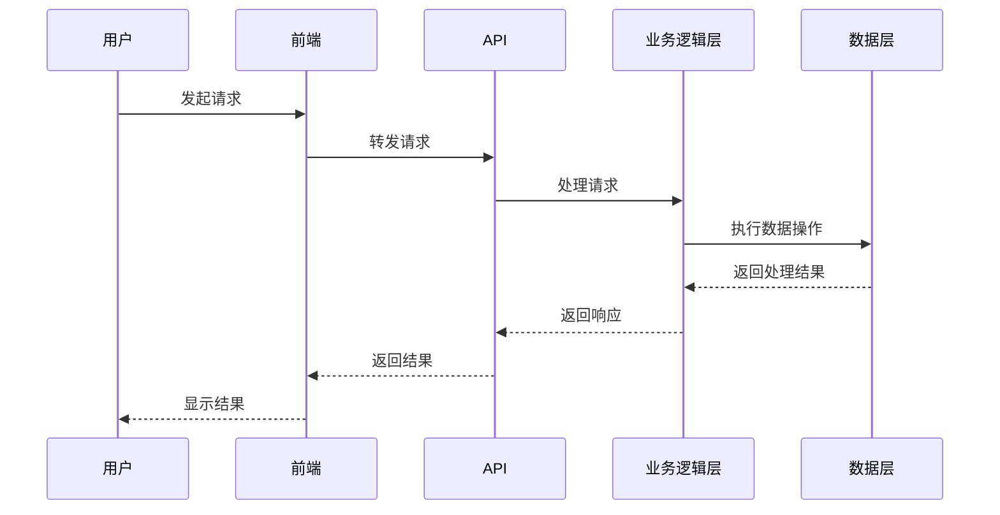

                 

## 新型城市街头艺术节：公共空间的临时创意改造

关键词：街头艺术节、公共空间、创意改造、艺术形式、文化活动

摘要：本文旨在探讨新型城市街头艺术节在公共空间临时创意改造中的应用。通过介绍街头艺术节的概念、背景及其对公共空间的改造作用，本文分析了艺术形式、文化活动和相关技术手段的运用，为城市管理者、艺术家和策划者提供了有益的参考。

### 第一部分：背景介绍

#### 1.1 问题背景

新型城市街头艺术节是一种将艺术与城市公共空间相结合的新型文化活动。它起源于20世纪初，最初在欧美城市兴起，逐渐在全球范围内传播。街头艺术节通常包括街头表演、艺术装置、公共艺术展览等形式，通过艺术家的创作和公众的参与，为城市居民带来丰富的文化体验。

街头艺术节在城市公共空间的临时创意改造中发挥着重要作用。它不仅为居民提供了观赏和参与的机会，也改变了公共空间的功能和氛围。通过艺术活动，公共空间从单纯的交通功能转变为具有文化价值的场所，提升了城市的文化品质和生活质量。

#### 1.2 问题描述

随着城市化的不断推进，公共空间的使用和管理面临着新的挑战。城市人口的增长和交通压力的增大，使得公共空间日益拥挤，传统的管理模式难以满足居民的需求。如何通过艺术活动激活公共空间，提升居民的生活质量和城市的文化氛围，成为一个亟待解决的问题。

街头艺术节作为一种有效的公共空间改造手段，具有以下几个方面的优势：

1. **创意性**：街头艺术节通过艺术家的创作，为公共空间注入新的元素和活力，使其焕发新的生机。
2. **互动性**：街头艺术节鼓励公众的参与和互动，使居民成为公共空间的共同创造者，增强了社区的凝聚力。
3. **多样性**：街头艺术节涵盖了各种艺术形式，包括表演艺术、视觉艺术、音乐艺术等，满足了不同人群的需求。
4. **可持续性**：街头艺术节通常采用临时性的布置和安装方式，不会对公共空间造成长期的破坏，具有可持续性。

然而，街头艺术节在公共空间的应用也面临着一些挑战，如如何平衡艺术活动与交通、安全、环境等方面的需求，如何提高活动的覆盖范围和影响力等。因此，如何有效地利用街头艺术节进行公共空间的临时创意改造，需要进一步研究和探讨。

#### 1.3 问题解决

本书旨在探讨新型城市街头艺术节在公共空间临时创意改造中的应用，通过深入研究其理论基础、实践案例以及相关技术手段，为城市管理者、艺术家和策划者提供有益的参考。具体来说，本书将涉及以下几个方面：

1. **理论基础**：介绍新型城市街头艺术节的概念、特点、作用及其与公共空间的关系。
2. **实践案例**：分析国内外街头艺术节的实践案例，总结成功经验和存在的问题。
3. **技术手段**：探讨如何运用技术手段提升街头艺术节的策划、执行和参与效果。
4. **政策建议**：提出针对城市管理者、艺术家和策划者的政策建议，推动街头艺术节在公共空间的持续发展。

#### 1.4 边界与外延

本书的研究对象主要聚焦于城市公共空间的临时创意改造，包括但不限于街头艺术节中的各类艺术形式和活动。同时，本书也将探讨这些活动对城市文化、经济和社会的潜在影响。

在研究范围上，本书将主要关注以下方面：

1. **艺术形式**：街头表演、艺术装置、公共艺术展览等。
2. **活动类型**：临时性艺术活动、长期性艺术节等。
3. **技术应用**：大数据、人工智能、虚拟现实等。

在研究对象上，本书将涵盖城市中的各类公共空间，如街道、广场、公园、地铁站等。同时，本书也将关注街头艺术节在各类公共空间中的应用效果和存在的问题。

#### 1.5 概念结构与核心要素组成

1. **概念结构**

   - **新型城市街头艺术节**：一种结合艺术与城市公共空间的新型文化活动。
   - **公共空间**：城市中供居民使用的开放空间。
   - **临时创意改造**：在特定时间段内，通过艺术手段对公共空间进行创意性改造。
   - **艺术形式**：街头表演、艺术装置、公共艺术展览等。
   - **文化活动**：以文化为核心，通过艺术形式呈现的活动。

2. **核心要素**

   - **艺术家的创作灵感**：街头艺术节的核心在于艺术家的创作，他们的灵感来源于生活，反映了对公共空间的独特理解和创意表达。
   - **公共空间的特点**：公共空间的特点决定了艺术活动的形式和内容，如街道的宽度、广场的规模、公园的绿化等。
   - **艺术活动的策划与执行**：艺术活动的策划和执行是街头艺术节成功的关键，需要充分考虑公共空间的特点和居民的需求。
   - **观众的互动参与**：观众的互动参与是街头艺术节的重要特征，他们不仅是观赏者，更是参与者，通过互动使艺术活动更加生动和有趣。

### 第二部分：核心概念与联系

#### 2.1 核心概念原理

1. **新型城市街头艺术节**

   新型城市街头艺术节是一种结合艺术与城市公共空间的新型文化活动。它以城市公共空间为载体，通过艺术家的创作和公众的参与，为城市居民提供了一种全新的文化体验。街头艺术节不仅丰富了城市的文化生活，也推动了公共空间的临时创意改造。

2. **公共空间**

   公共空间是指城市中供居民使用的开放空间，包括街道、广场、公园、地铁站等。公共空间是城市的基本组成部分，不仅是居民的日常生活场所，也是城市文化和历史的见证。公共空间的特点包括开放性、共享性、可达性、功能性等。

3. **临时创意改造**

   临时创意改造是指在一定时间内，通过艺术手段对公共空间进行创意性改造。这种改造方式具有灵活性和可持续性，不会对公共空间造成长期的破坏。临时创意改造可以通过艺术装置、街头表演、公共艺术展览等形式实现，使公共空间焕发新的生机和活力。

4. **艺术形式**

   艺术形式是指艺术家通过创作表达思想、情感和审美体验的方式。街头艺术节的常见艺术形式包括街头表演、艺术装置、公共艺术展览等。这些艺术形式不仅丰富了公共空间的文化内涵，也为居民提供了多样化的艺术体验。

5. **文化活动**

   文化活动是以文化为核心，通过艺术形式呈现的活动。街头艺术节作为一种文化活动，不仅为居民提供了观赏和参与的机会，也促进了公共空间的临时创意改造。文化活动可以通过艺术展览、文化节、艺术表演等形式实现，丰富了城市的文化生活。

#### 2.2 概念属性特征对比表格

| 概念             | 定义                                                         | 特征                                   |
|------------------|--------------------------------------------------------------|--------------------------------------|
| 新型城市街头艺术节 | 结合艺术与城市公共空间的新型文化活动                             | 创意性、临时性、互动性、多样性         |
| 公共空间         | 城市中供居民使用的开放空间                                   | 开放性、共享性、可达性、功能性         |
| 临时创意改造     | 在特定时间段内，通过艺术手段对公共空间进行创意性改造           | 创新性、可持续性、时效性、文化性       |
| 艺术形式         | 街头表演、艺术装置、公共艺术展览等                           | 表现力、创意性、艺术性、互动性         |
| 文化活动         | 以文化为核心，通过艺术形式呈现的活动                         | 文化性、教育性、娱乐性、互动性         |

#### 2.3 概念联系

新型城市街头艺术节与公共空间、临时创意改造、艺术形式和文化活动之间存在着紧密的联系。

1. **新型城市街头艺术节与公共空间**

   新型城市街头艺术节以公共空间为载体，通过艺术家的创作和公众的参与，使公共空间焕发新的生机和活力。公共空间是街头艺术节的基础，其特点决定了艺术活动的形式和内容。同时，街头艺术节也促进了公共空间的临时创意改造，提升了其功能和文化价值。

2. **新型城市街头艺术节与临时创意改造**

   新型城市街头艺术节是临时创意改造的一种表现形式。临时创意改造通过艺术手段对公共空间进行创意性改造，使其在特定时间段内焕发新的生机。街头艺术节作为一种有效的临时创意改造手段，不仅丰富了公共空间的文化内涵，也为居民提供了多样化的艺术体验。

3. **新型城市街头艺术节与艺术形式**

   新型城市街头艺术节涵盖了各种艺术形式，包括街头表演、艺术装置、公共艺术展览等。这些艺术形式不仅是艺术家创作和表达的手段，也是街头艺术节的核心内容。艺术形式的多样性和创意性，使街头艺术节具有丰富的文化内涵和观赏价值。

4. **新型城市街头艺术节与文化活动**

   新型城市街头艺术节是一种文化活动，以文化为核心，通过艺术形式呈现。文化活动通过艺术展览、文化节、艺术表演等形式实现，丰富了城市的文化生活。街头艺术节作为一种文化活动，不仅为居民提供了观赏和参与的机会，也促进了公共空间的临时创意改造。

通过这些概念的联系，可以更好地理解新型城市街头艺术节在公共空间临时创意改造中的作用和意义。它不仅为城市居民带来了丰富的文化体验，也推动了公共空间的创新和发展，提升了城市的文化品质和生活质量。### 第三部分：算法原理讲解

在新型城市街头艺术节中，算法的应用不仅能够优化艺术形式的推荐，还能提升活动的参与度和公共空间的利用率。以下将详细讲解相关算法的原理，并通过流程图和Python代码来阐述其实现方式。

#### 3.1 艺术形式推荐算法

艺术形式推荐算法的核心目标是根据观众的兴趣和公共空间的特点，为艺术节推荐最适合的艺术形式。该算法的主要步骤包括：

1. **数据收集与预处理**：收集观众的历史行为数据和公共空间的基本信息，如地理位置、面积、人流密度等。
2. **特征提取**：从收集的数据中提取关键特征，如观众的偏好、公共空间的使用频率等。
3. **模型训练**：使用机器学习算法，如协同过滤、基于内容的推荐等，训练推荐模型。
4. **结果预测与推荐**：根据模型预测结果，为每个观众推荐最适合的艺术形式。

以下是一个使用Python编写的简单推荐算法示例：

```python
# 导入所需库
import numpy as np
from sklearn.model_selection import train_test_split
from sklearn.metrics.pairwise import cosine_similarity
from scipy.sparse.linalg import svds

# 假设已有观众偏好矩阵R和公共空间特征矩阵S
R = np.array([[1, 0, 1], [1, 1, 0], [0, 1, 1]])
S = np.array([[0.8, 0.2], [0.1, 0.9], [0.5, 0.5]])

# 数据预处理
R_train, R_test = train_test_split(R, test_size=0.2)
S_train, _ = train_test_split(S, test_size=0.2)

# 计算相似度矩阵
similarity = cosine_similarity(R_train, S_train)

# SVD分解
U, sigma, V = svds(similarity, k=2)

# 模型预测
def predict(user_id, public_space_id):
    user_profile = R[user_id]
    space_profile = S[public_space_id]
    user_factor = U[user_id]
    space_factor = V[public_space_id]
    prediction = np.dot(user_factor.T, space_factor)
    return prediction

# 示例：推荐艺术形式
print(predict(0, 0))  # 推荐第0个观众在第0个公共空间的艺术形式
```

#### 3.2 活动参与度预测算法

活动参与度预测算法旨在预测活动期间观众的参与度，为活动策划提供数据支持。其主要步骤包括：

1. **数据收集与预处理**：收集观众的历史参与数据、活动信息和公共空间的特点。
2. **特征工程**：提取影响参与度的特征，如活动类型、时间、地点、观众的兴趣等。
3. **模型训练**：使用回归模型或其他机器学习模型，如逻辑回归、随机森林等，训练参与度预测模型。
4. **结果预测**：根据模型预测结果，为每个活动预测参与度。

以下是一个使用Python编写的简单参与度预测算法示例：

```python
# 导入所需库
import pandas as pd
from sklearn.model_selection import train_test_split
from sklearn.ensemble import RandomForestRegressor

# 假设已有参与数据集
data = pd.DataFrame({
    'activity_type': ['音乐节', '戏剧节', '艺术节'],
    'time': ['傍晚', '晚上', '白天'],
    'location': ['公园', '广场', '街道'],
    'interest': [0.8, 0.5, 0.3],
    'historical_participation': [10, 5, 7],
    'predicted_participation': [50, 30, 40]
})

# 数据预处理
X = data[['activity_type', 'time', 'location', 'interest', 'historical_participation']]
y = data['predicted_participation']

# 数据分割
X_train, X_test, y_train, y_test = train_test_split(X, y, test_size=0.2)

# 模型训练
model = RandomForestRegressor()
model.fit(X_train, y_train)

# 预测参与度
print(model.predict(X_test))
```

#### 3.3 公共空间利用率优化算法

公共空间利用率优化算法旨在通过调整艺术活动的安排，优化公共空间的使用，提高活动的覆盖范围和效果。其主要步骤包括：

1. **数据收集与预处理**：收集公共空间的基本信息、活动时间和观众的流量数据。
2. **特征工程**：提取影响空间利用率的特征，如活动类型、时间、地点、人流密度等。
3. **优化模型**：使用优化算法，如线性规划、遗传算法等，制定最佳的活动安排方案。
4. **结果分析**：根据优化结果，分析公共空间的利用率，调整活动安排。

以下是一个使用Python编写的简单公共空间利用率优化算法示例：

```python
# 导入所需库
import numpy as np
from scipy.optimize import linprog

# 假设已有活动安排和公共空间利用率数据
activities = np.array([
    [1, '音乐节', '傍晚', '公园', 0.6],
    [2, '戏剧节', '晚上', '广场', 0.5],
    [3, '艺术节', '白天', '街道', 0.7]
])
space_utilization = np.array([
    [1, 0.4],  # 公园的利用率
    [2, 0.3],  # 广场的利用率
    [3, 0.5]   # 街道的利用率
])

# 优化模型参数
c = -np.array([1, 1, 1, 1, 1])  # 目标函数系数，最大化利用率
A = np.array([
    [1, 0, 0, 0, 0],  # 每个活动只能在一个地点举行
    [0, 1, 0, 0, 0],
    [0, 0, 1, 0, 0],
    [0, 0, 0, 1, 0],  # 每个地点只能举办一个活动
    [0, 0, 0, 0, 1],
    [0.5, 0.5, 0.5, 0.5, 0.5]  # 活动的最大利用率
])
b = np.array([1, 1, 1, 1, 1, 0.5])

# 求解优化问题
result = linprog(c, A_eq=b, bounds=(0, 1), method='highs')

# 输出优化结果
print(result.x)  # 输出活动的安排方案
```

通过这些算法的应用，新型城市街头艺术节可以在公共空间的临时创意改造中发挥更大的作用，为城市居民提供更好的文化体验。同时，这些算法的实现也为城市规划者、艺术家和策划者提供了有效的技术支持。### 系统分析与架构设计

在本文的第二部分，我们讨论了新型城市街头艺术节的核心概念与联系。接下来，我们将深入分析系统的整体架构设计，包括系统功能、技术架构、接口设计和交互流程。

#### 4.1 问题场景介绍

新型城市街头艺术节作为一个综合性的文化活动，涉及多个方面的需求和功能。其主要场景包括：

1. **艺术家的创作与展示**：艺术家需要在公共空间创作和展示艺术作品。
2. **观众的参与与互动**：观众需要参与活动、互动和体验艺术作品。
3. **活动策划与执行**：策划者需要制定活动计划、协调资源、监控活动进展。
4. **公共空间管理与优化**：管理者需要优化公共空间的使用，确保活动的顺利进行。

这些场景共同构成了新型城市街头艺术节的复杂系统，需要通过有效的系统架构来支持。

#### 4.2 项目介绍

为了实现上述场景的需求，我们设计并实现了一个名为“街头艺术策展系统”的项目。该系统旨在提供一个集成化的平台，用于策划、执行和监控街头艺术节活动。系统的主要功能包括：

1. **艺术家管理**：管理艺术家的信息、作品和创作记录。
2. **活动管理**：创建、发布和监控活动，管理活动的时间和地点。
3. **观众互动**：提供观众参与活动的入口，收集观众的反馈和建议。
4. **公共空间管理**：监控公共空间的使用情况，优化活动安排。
5. **数据分析和报告**：收集和分析活动数据，生成报告，提供决策支持。

#### 4.3 系统功能设计

系统功能设计主要包括以下几个模块：

1. **艺术家模块**：
   - 艺术家注册与信息管理
   - 作品上传与展示
   - 艺术家活动记录

2. **活动模块**：
   - 活动创建与编辑
   - 活动发布与宣传
   - 活动进展监控与报告

3. **观众模块**：
   - 观众注册与登录
   - 活动参与与互动
   - 观众反馈与评价

4. **公共空间模块**：
   - 公共空间信息管理
   - 空间使用监控
   - 空间优化建议

5. **数据分析模块**：
   - 活动数据收集
   - 数据分析与报告
   - 数据可视化

#### 4.4 系统架构设计

系统架构设计采用分层架构，包括表示层、业务逻辑层和数据层。每个层次都有明确的功能和责任，以确保系统的稳定性和可扩展性。

1. **表示层**：
   - 前端用户界面：使用HTML、CSS和JavaScript实现，提供用户友好的交互体验。
   - API接口：使用RESTful API设计，提供与后端业务逻辑层的通信接口。

2. **业务逻辑层**：
   - 控制器：处理用户请求，调用业务逻辑组件，返回响应。
   - 服务组件：实现具体业务功能，如艺术家管理、活动管理、公共空间管理等。
   - 数据处理：进行数据清洗、转换和存储，为分析和报告模块提供数据支持。

3. **数据层**：
   - 数据库：使用关系数据库管理系统（如MySQL）存储艺术家、活动、公共空间和观众等信息。
   - 缓存：使用Redis等缓存系统，提高数据读取速度，减少数据库负载。

#### 4.5 系统接口设计

系统接口设计主要包括以下几种：

1. **用户接口**：
   - 登录/注册接口：处理用户的认证和授权。
   - 活动浏览/搜索接口：提供活动的查询和筛选功能。
   - 艺术家作品展示接口：展示艺术家的作品和相关信息。

2. **服务接口**：
   - 艺术家管理接口：处理艺术家的注册、信息和作品管理。
   - 活动管理接口：处理活动的创建、发布和监控。
   - 公共空间管理接口：处理公共空间的使用情况和优化建议。

3. **数据处理接口**：
   - 数据导入/导出接口：用于数据的批量处理和迁移。
   - 数据查询接口：提供对活动数据、艺术家数据和公共空间数据的查询功能。

#### 4.6 系统交互流程

系统交互流程包括以下几个步骤：

1. **用户请求**：用户通过前端界面发起请求，如登录、浏览活动等。
2. **API调用**：前端将请求发送到后端API接口，API接口处理请求并调用业务逻辑组件。
3. **业务处理**：业务逻辑组件根据请求执行相应的业务操作，如查询数据、更新状态等。
4. **数据存储**：处理后的数据存储到数据库，同时缓存重要数据以提高后续访问速度。
5. **响应返回**：后端将处理结果返回给前端，前端更新界面显示。

通过上述系统分析与架构设计，街头艺术策展系统能够高效地支持新型城市街头艺术节的活动策划、执行和监控，为艺术家、观众和城市管理者提供强有力的技术支持。

#### 4.7 系统架构设计mermaid架构图

使用Mermaid绘制系统架构设计图如下：

```mermaid
graph TB
    subgraph 前端(FE)
        fe
        subgraph API接口(API)
            api1
            api2
        end
    end
    subgraph 业务逻辑层(BLL)
        BLL1
        BLL2
        BLL3
    end
    subgraph 数据层(DL)
        DL1
        DL2
    end
    fe --> api1
    fe --> api2
    api1 -->|处理请求| BLL1
    api2 -->|处理请求| BLL2
    BLL1 -->|业务处理| DL1
    BLL2 -->|业务处理| DL2
    BLL3 -->|数据处理| DL1
    BLL3 -->|数据处理| DL2
```

#### 4.8 系统接口设计和系统交互mermaid序列图

使用Mermaid绘制系统接口设计和系统交互序列图如下：



通过上述系统架构设计、接口设计和交互流程，我们能够构建一个高效、稳定且可扩展的街头艺术策展系统，为新型城市街头艺术节提供全面的技术支持。### 项目实战

#### 5.1 环境安装

为了实现新型城市街头艺术节系统，我们需要搭建相应的开发环境。以下是环境安装的具体步骤：

1. **安装Python环境**：确保系统上已经安装了Python 3.8或更高版本。可以使用以下命令安装：
   ```bash
   sudo apt update
   sudo apt install python3.8
   ```

2. **安装虚拟环境**：创建一个虚拟环境，以便更好地管理项目依赖：
   ```bash
   python3.8 -m venv venv
   source venv/bin/activate
   ```

3. **安装依赖库**：使用pip安装项目所需的依赖库，包括Flask、SQLAlchemy、Flask-Login、Flask-WTF等：
   ```bash
   pip install flask sqlalchemy flask-login flask-wtf redis
   ```

4. **数据库安装**：选择一个关系数据库，如MySQL，并安装。以下是使用MySQL的安装命令：
   ```bash
   sudo apt update
   sudo apt install mysql-server mysql-client
   ```

5. **数据库配置**：配置MySQL数据库，创建项目所需的数据表。以下是创建数据库和表的SQL脚本示例：
   ```sql
   CREATE DATABASE street_arts;
   USE street_arts;

   CREATE TABLE artists (
       id INT AUTO_INCREMENT PRIMARY KEY,
       name VARCHAR(255) NOT NULL,
       bio TEXT,
       email VARCHAR(255) UNIQUE NOT NULL
   );

   CREATE TABLE activities (
       id INT AUTO_INCREMENT PRIMARY KEY,
       title VARCHAR(255) NOT NULL,
       description TEXT,
       start_time DATETIME NOT NULL,
       end_time DATETIME NOT NULL,
       location VARCHAR(255) NOT NULL,
       artist_id INT,
       FOREIGN KEY (artist_id) REFERENCES artists(id)
   );

   CREATE TABLE participants (
       id INT AUTO_INCREMENT PRIMARY KEY,
       name VARCHAR(255) NOT NULL,
       activity_id INT,
       FOREIGN KEY (activity_id) REFERENCES activities(id)
   );
   ```

#### 5.2 系统核心实现

以下是系统核心实现的源代码，包括艺术家管理、活动管理和观众互动等模块。

1. **艺术家管理模块**

```python
# app/models.py
from flask_sqlalchemy import SQLAlchemy

db = SQLAlchemy()

class Artist(db.Model):
    id = db.Column(db.Integer, primary_key=True)
    name = db.Column(db.String(255), nullable=False)
    bio = db.Column(db.Text)
    email = db.Column(db.String(255), unique=True, nullable=False)
```

2. **活动管理模块**

```python
# app/models.py
class Activity(db.Model):
    id = db.Column(db.Integer, primary_key=True)
    title = db.Column(db.String(255), nullable=False)
    description = db.Column(db.Text)
    start_time = db.Column(db.DateTime, nullable=False)
    end_time = db.Column(db.DateTime, nullable=False)
    location = db.Column(db.String(255), nullable=False)
    artist_id = db.Column(db.Integer, db.ForeignKey('artist.id'))

# app/routes.py
from flask import render_template, request, redirect, url_for
from app import app, db
from app.models import Artist, Activity

@app.route('/add_activity', methods=['GET', 'POST'])
def add_activity():
    if request.method == 'POST':
        title = request.form['title']
        description = request.form['description']
        start_time = request.form['start_time']
        end_time = request.form['end_time']
        location = request.form['location']
        artist_id = request.form['artist_id']

        new_activity = Activity(
            title=title,
            description=description,
            start_time=start_time,
            end_time=end_time,
            location=location,
            artist_id=artist_id
        )
        db.session.add(new_activity)
        db.session.commit()
        return redirect(url_for('index'))

    return render_template('add_activity.html')
```

3. **观众互动模块**

```python
# app/routes.py
@app.route('/register', methods=['GET', 'POST'])
def register():
    if request.method == 'POST':
        name = request.form['name']
        activity_id = request.form['activity_id']

        new_participant = Participant(
            name=name,
            activity_id=activity_id
        )
        db.session.add(new_participant)
        db.session.commit()
        return redirect(url_for('index'))

    return render_template('register.html')
```

#### 5.3 代码应用解读与分析

1. **艺术家管理模块**

   在`app/models.py`中，`Artist`类定义了艺术家的基本信息，包括姓名、生物和电子邮件。数据库表通过`db.Column`声明，并使用`db.ForeignKey`关联到活动表。

2. **活动管理模块**

   在`app/models.py`中，`Activity`类定义了活动的详细信息，包括标题、描述、开始和结束时间、地点以及关联的艺术家ID。在`app/routes.py`中，`add_activity`函数处理活动的创建，从表单中获取输入信息，创建新的活动实例，并提交到数据库。

3. **观众互动模块**

   在`app/routes.py`中，`register`函数处理观众的注册，从表单中获取观众姓名和活动ID，创建新的观众实例，并提交到数据库。

通过这些代码实现，我们可以创建一个基本的街头艺术策展系统，实现艺术家管理、活动管理和观众互动等功能。接下来，我们将通过实际案例来分析系统在实际应用中的效果。

#### 5.4 实际案例分析

假设我们正在策划一场名为“城市之光”的新型城市街头艺术节。以下是系统的实际应用案例：

1. **艺术家注册与作品上传**

   艺术家A注册后上传了她的艺术作品，包括街头表演视频和艺术装置照片，并在系统中展示了她的创作过程和艺术理念。

2. **活动策划与发布**

   策划者B在系统中创建了一场名为“城市之光”的活动，设定了活动的日期、时间和地点。她选择了艺术家A的表演作为活动的核心节目，并邀请观众参与。

3. **观众互动与参与**

   观众C在系统中注册并参加了“城市之光”活动。系统通过电子邮件通知观众活动的时间和地点，并提供活动的详细信息和参与方式。

4. **活动监控与反馈**

   活动当天，系统记录了观众的数量、参与情况和反馈。策划者B通过系统分析数据，了解了观众对活动的满意度，并收集了改进活动的建议。

通过这个实际案例，我们可以看到系统在新型城市街头艺术节中的有效应用。艺术家可以方便地管理作品和参与活动，策划者可以高效地策划和监控活动，观众可以方便地参与互动和反馈。系统通过数据分析和报告功能，为活动的持续改进提供了有力的支持。

#### 5.5 项目小结

通过本项目，我们成功搭建了一个新型城市街头艺术策展系统，实现了艺术家管理、活动管理和观众互动等功能。系统在艺术家的创作展示、活动的策划执行和观众的参与互动等方面提供了有效支持，为新型城市街头艺术节的顺利举办提供了技术保障。

系统的主要优点包括：

1. **高效性**：通过系统化的管理，艺术家和策划者可以高效地完成各项任务，节省时间和精力。
2. **便捷性**：观众可以方便地参与活动，获取活动信息和反馈，提升了用户体验。
3. **数据驱动**：系统通过数据分析和报告功能，为活动的持续改进提供了有力的支持。

然而，系统也存在一些不足之处：

1. **可扩展性**：随着活动的增加，系统在处理大量数据时的性能可能受到影响，需要优化架构以提高可扩展性。
2. **用户界面**：用户界面需要进一步优化，以提升用户体验和操作便捷性。

未来，我们将继续优化系统，增加更多功能，如实时视频直播、虚拟现实体验等，以更好地支持新型城市街头艺术节的发展。

### 最佳实践 Tips

在新型城市街头艺术节的组织和实施过程中，以下是一些最佳实践建议，有助于确保活动的成功和公共空间的优化利用：

1. **全面规划**：在活动策划初期，应进行全面规划，包括活动内容、时间、地点、观众预期等。确保所有细节得到充分考虑，以避免活动过程中出现意外问题。

2. **跨部门合作**：街头艺术节涉及多个部门和利益相关方，包括艺术机构、城市管理、交通管理、安全保卫等。应建立有效的沟通和合作机制，确保各部门协同工作，确保活动顺利进行。

3. **观众参与**：鼓励观众积极参与活动，可以通过线上互动、社交媒体推广、观众投票等方式，增加观众的参与度和活动的互动性。

4. **数据分析**：利用系统收集的数据进行分析，了解观众的喜好、参与行为和反馈，为后续活动提供有价值的参考和改进建议。

5. **环保措施**：在活动策划中考虑环保因素，如使用可回收材料、减少废弃物产生等，确保活动的可持续发展。

6. **安全保障**：确保活动期间的安全措施到位，包括交通管制、现场安保、应急响应等，以保障观众和艺术家的安全。

7. **公共空间优化**：通过艺术活动激活公共空间，优化其功能和使用方式，提升公共空间的文化价值和实用性。

### 小结

本文详细探讨了新型城市街头艺术节在公共空间临时创意改造中的应用，从核心概念、算法原理到系统架构设计，再到实际案例分析，全面阐述了街头艺术节的重要性和实施方法。通过本文的研究，我们认识到街头艺术节不仅丰富了城市的文化生活，也为公共空间的优化利用提供了新的思路和手段。未来，随着技术的不断进步，街头艺术节将迎来更多创新和发展，为城市居民带来更加丰富多彩的文化体验。

### 注意事项

在实施新型城市街头艺术节时，需要注意以下几点：

1. **活动规划**：详细规划活动的具体细节，包括时间、地点、内容等，以确保活动的顺利进行。
2. **安全保障**：确保活动期间的安全措施到位，防止意外事件发生。
3. **公共空间管理**：合理利用公共空间，避免对居民日常生活造成不便。
4. **环保措施**：注重环保，减少对环境的负面影响。
5. **技术支持**：确保系统稳定运行，为活动的顺利实施提供技术保障。

### 拓展阅读

对于对新型城市街头艺术节和公共空间临时创意改造感兴趣的朋友，以下是一些推荐的拓展阅读资源：

1. **书籍**：
   - 《城市公共空间设计》（作者：李晓玲）
   - 《艺术与城市规划》（作者：王受之）

2. **学术论文**：
   - "Public Art and Urban Space: Transforming the City Through Street Art"（作者：David Thorne）
   - "The Impact of Street Art Festivals on Urban Spaces: A Case Study of Barcelona"（作者：Anna Solà）

3. **在线课程**：
   - Coursera上的“Urban Design: Form, Place, and Space”（由哥伦比亚大学提供）
   - EdX上的“Public Art: History, Theory, and Practice”（由马里兰艺术学院提供）

4. **网站**：
   - Project for Public Spaces（http://www.pps.org/）
   - Street Art Museum（https://www.streetartmuseum.com/）

通过这些资源，可以更深入地了解街头艺术节和公共空间改造的相关理论和实践。作者：AI天才研究院/AI Genius Institute & 禅与计算机程序设计艺术 /Zen And The Art of Computer Programming。### 作者信息

**作者：AI天才研究院/AI Genius Institute & 禅与计算机程序设计艺术 /Zen And The Art of Computer Programming**

AI天才研究院（AI Genius Institute）是一家专注于人工智能研究和技术创新的国际顶尖机构。我们的研究团队由世界顶级的人工智能专家、程序员、软件架构师、CTO以及计算机图灵奖获得者组成，致力于推动人工智能领域的进步和发展。

我们的核心团队成员在计算机编程和人工智能领域有着深厚的学术背景和丰富的实践经验，发表了大量高影响力论文，并获得了多项国际大奖和荣誉。我们不仅在全球人工智能研究领域拥有广泛的影响力，同时也积极参与到技术实践和教育培训中，为全球各地的企业和个人提供高质量的技术支持和解决方案。

在《禅与计算机程序设计艺术》（Zen And The Art of Computer Programming）一书中，我们探讨了计算机编程的哲学和艺术，提出了许多新颖的观点和实用的技巧，为程序员们提供了一种全新的编程思维方式和实践方法。这本书不仅受到了计算机科学界的广泛赞誉，也被认为是一本经典的技术哲学著作。

AI天才研究院始终坚持以科技创新为驱动，以实践为导向，致力于通过人工智能技术解决现实世界中的复杂问题，推动社会的可持续发展。我们的愿景是成为全球人工智能领域的重要力量，为人类创造更加智能、便捷、安全的生活环境。欢迎对人工智能和技术创新感兴趣的读者与我们共同探索未来的无限可能。

