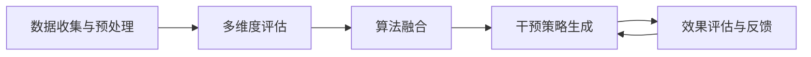
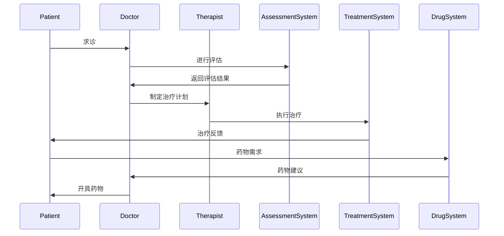
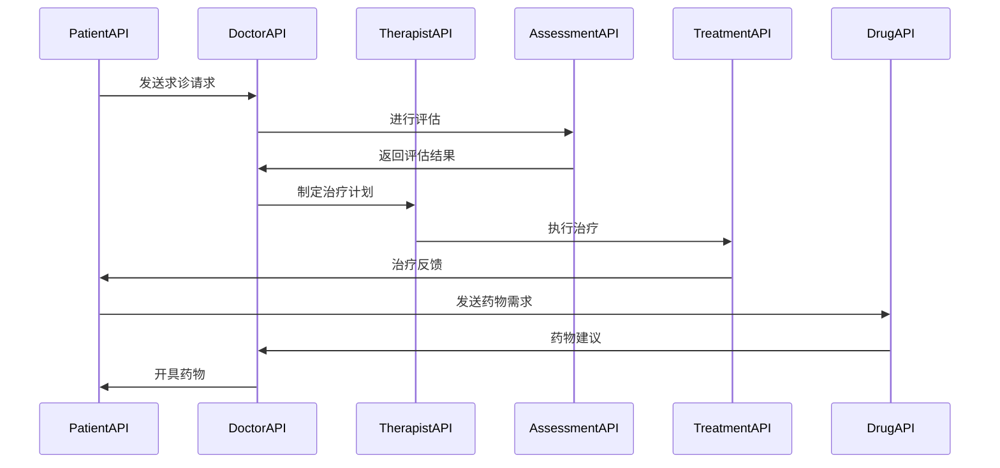

                 

### 文章标题

“新型精神医疗：整合东西方智慧的心理健康实践”

### 关键词

- 精神医疗
- 东西方智慧
- 心理健康
- 整合治疗
- 新型疗法

### 摘要

本文旨在探讨一种新兴的心理健康实践——新型精神医疗，该实践通过整合东西方智慧，为现代精神疾病的诊疗提供了全新的视角和策略。本文首先介绍了精神医疗的演变与现状，揭示了传统精神医疗的局限性。接着，本文详细阐述了东西方精神智慧的内涵与特性，并对比分析了两者在心理治疗中的应用。随后，本文深入讲解了新型精神医疗的核心原理，包括算法原理与数学模型。接着，通过心理健康评估与干预的案例，展示了新型精神医疗在实践中的应用。最后，本文对未来新型精神医疗的发展趋势和面临的挑战进行了展望与讨论。通过本文的探讨，我们希望能够为心理健康领域的研究和实践提供有益的参考。

## 《新型精神医疗：整合东西方智慧的心理健康实践》目录大纲

### 第一部分：背景与介绍

- **第1章：精神医疗的演变与现状**
  - **1.1 问题背景**：精神疾病的全球趋势与影响
  - **1.2 问题描述**：传统精神医疗的局限性
  - **1.3 问题解决**：整合东西方智慧的新途径
  - **1.4 边界与外延**：精神医疗的多维度考量
  - **1.5 核心概念**：东西方智慧在精神医疗中的融合
  - **1.6 本章小结**：新型精神医疗的潜力与前景

### 第二部分：东西方精神智慧的内涵与特性

- **第2章：东西方精神智慧概述**
  - **2.1 东西方哲学思想**：精神医疗的理论基础
    - **2.1.1 东方智慧**：道家、佛家、儒家的影响
    - **2.1.2 西方智慧**：精神分析、认知行为疗法等
  - **2.2 东西方智慧的核心概念与属性对比**
    - **2.2.1 概念属性对比表格**（使用 Mermaid 表格）
    - **2.2.2 ER实体关系图**（使用 Mermaid 流程图）
  - **2.3 东西方智慧在精神医疗中的应用案例**
    - **2.3.1 东方智慧的应用**：冥想、太极拳等
    - **2.3.2 西方智慧的应用**：心理咨询、药物治疗等

- **第3章：新型精神医疗的核心原理**
  - **3.1 新型精神医疗的定义与特点**
    - **3.1.1 整合东西方智慧的创新方法**
    - **3.1.2 心理健康的新视角与策略**
  - **3.2 算法原理讲解**
    - **3.2.1 新型精神医疗的核心算法**
      - **3.2.1.1 Mermaid 流程图**（算法流程）
      - **3.2.1.2 Python 源代码实现**（算法实现）
    - **3.2.2 算法原理与数学模型**
      - **3.2.2.1 数学模型公式**（使用 LaTeX 格式）
      - **3.2.2.2 公式讲解**（文字解释）
    - **3.2.3 算法举例说明**（具体案例）

### 第三部分：新型精神医疗的应用与实践

- **第4章：心理健康评估与干预**
  - **4.1 心理健康评估方法**
    - **4.1.1 东方评估方法**：五蕴、五行等
    - **4.1.2 西方评估方法**：量表、问卷调查等
  - **4.2 心理干预策略**
    - **4.2.1 东方干预策略**：心理疏导、能量疗愈等
    - **4.2.2 西方干预策略**：认知行为疗法、精神分析等
  - **4.3 案例分析**（实际案例分析）

- **第5章：新型精神医疗在临床中的应用**
  - **5.1 临床实践案例介绍**
    - **5.1.1 案例一**：抑郁症的治疗
    - **5.1.2 案例二**：焦虑症的治疗
  - **5.2 系统分析与架构设计**
    - **5.2.1 领域模型设计**：使用 Mermaid 类图
    - **5.2.2 系统架构设计**：使用 Mermaid 架构图
    - **5.2.3 系统接口设计**：接口设计与交互

- **第6章：心理健康教育与普及**
  - **6.1 心理健康教育的策略**
    - **6.1.1 东方教育策略**：传统文化与心理健康教育
    - **6.1.2 西方教育策略**：心理健康知识的普及
  - **6.2 心理健康普及途径**
    - **6.2.1 社区心理服务**
    - **6.2.2 网络心理健康平台**
  - **6.3 教育与实践案例**（实际案例分享）

### 第四部分：未来展望与挑战

- **第7章：新型精神医疗的发展趋势**
  - **7.1 技术创新**：人工智能、大数据等在精神医疗中的应用
  - **7.2 社会接受度**：公众对新型精神医疗的认知与接受
  - **7.3 政策与法规**：新型精神医疗的监管与发展

- **第8章：新型精神医疗面临的挑战与对策**
  - **8.1 技术挑战**：算法优化、数据隐私等
  - **8.2 社会挑战**：心理健康教育的普及与接受
  - **8.3 政策与法规挑战**：新型医疗模式的监管与规范
  - **8.4 对策建议**：技术优化、政策支持、公众教育

---

通过上述的目录大纲，我们可以看到，本文将系统地探讨新型精神医疗的各个方面，从背景介绍、核心原理、应用实践到未来展望与挑战，力求为读者提供一幅全面而深入的理解图景。接下来，我们将一步一步地深入探讨每一个章节，通过逻辑清晰、结构紧凑、简单易懂的方式，带领读者走进新型精神医疗的奇妙世界。

### 第1章：精神医疗的演变与现状

#### 1.1 问题背景：精神疾病的全球趋势与影响

精神疾病已经成为全球公共卫生的重大挑战之一。根据世界卫生组织（WHO）的数据，抑郁症、焦虑症和其他精神障碍在全球范围内影响了约10亿人，这一数字占据了全球总人口的14%。特别是在现代社会，随着生活节奏的加快、工作压力的增大以及社会关系的复杂性增加，精神疾病的发病率呈现逐年上升的趋势。

在发展中国家，精神疾病的负担尤为严重。由于医疗资源匮乏、心理健康知识普及度低，许多精神疾病未能得到及时诊断和治疗。这不仅影响了患者的身心健康，也给家庭和社会带来了巨大的负担。此外，精神疾病不仅影响个体的生活质量，还可能导致劳动力的损失、教育的中断以及经济负担的加重。

精神疾病对社会的影响是多方面的。首先，精神疾病可能导致患者产生自杀念头，给家庭和社会带来悲剧。其次，精神疾病可能影响患者的日常功能，如工作能力、学习能力和社会交往能力。长期未得到治疗的精神疾病还可能导致严重的社会问题，如犯罪行为、家庭破裂和社会不稳定等。因此，解决精神疾病问题不仅是医学问题，更是社会问题和公共安全问题。

#### 1.2 问题描述：传统精神医疗的局限性

传统精神医疗在面对精神疾病时存在诸多局限性。首先，传统精神医疗主要依赖于药物疗法和心理治疗方法。虽然药物治疗能够在一定程度上缓解症状，但药物的副作用较大，长期使用可能导致依赖性和耐药性。此外，药物治疗并不能从根本上解决心理问题，患者仍然需要面对内心的困扰和情绪波动。

其次，心理治疗方法虽然注重个体内心的探索和情感疏导，但在实践中存在一定的局限性。传统的心理治疗往往依赖于治疗师的经验和技巧，治疗的个体化和精准性较低。同时，心理治疗过程需要较长时间，患者需要频繁就诊，这给患者带来了经济负担和时间压力。

此外，传统精神医疗在评估和诊断方面也存在问题。许多精神疾病的诊断标准主要基于临床经验和主观判断，缺乏科学和客观的依据。这不仅可能导致误诊和漏诊，还可能延误治疗的最佳时机。同时，精神疾病的症状表现复杂多样，传统医疗方法难以全面、深入地了解和解决患者的心理问题。

#### 1.3 问题解决：整合东西方智慧的新途径

为了克服传统精神医疗的局限性，新型精神医疗提出了整合东西方智慧的新途径。东西方精神医疗各自有其独特的优势和不足，将两者有机结合，可以充分发挥各自的长处，形成一种更全面、更有效的心理健康治疗模式。

首先，东方智慧在心理健康方面有着深厚的理论和实践基础。道家强调“道法自然”，提倡内心的平静与和谐；佛家强调“禅修”和“冥想”，通过内心的观照和修炼，达到心灵的宁静和解脱；儒家则注重“修身齐家治国平天下”，强调个体的道德修养和社会责任感。这些东方智慧不仅为心理健康提供了丰富的理论资源，还在实践中展示了显著的治疗效果。

相比之下，西方精神医疗注重科学研究和实证治疗。精神分析理论、认知行为疗法、人本主义疗法等西方治疗方法在解决心理问题方面取得了显著的成果。西方医学强调生物心理社会模型，通过综合分析个体的生物、心理和社会因素，为患者提供更全面的治疗方案。

整合东西方智慧的新型精神医疗，不仅能够充分利用东方智慧的内省和修炼方法，缓解患者的心理压力和情绪困扰，还能够通过西方科学的诊断和治疗方法，提供更精准和有效的干预措施。此外，整合东西方智慧的治疗模式还可以促进患者的自我认知和自我调节能力，从根本上提高心理健康的水平。

#### 1.4 边界与外延：精神医疗的多维度考量

新型精神医疗的实践不仅仅局限于治疗和干预，还涉及心理健康评估、预防以及教育和普及等多个维度。在心理健康评估方面，新型精神医疗提出了多维度的评估方法，结合东方的五蕴、五行等理论，以及西方的量表和问卷调查，为心理健康评估提供了更为全面和科学的依据。

在预防方面，新型精神医疗强调心理健康的预防策略。通过整合东西方智慧，提出了一系列心理健康促进措施，如东方的冥想、太极拳等，以及西方的心理疏导、心理咨询等。这些预防策略不仅有助于降低精神疾病的发病率，还能够提高公众的心理健康素养。

在教育和普及方面，新型精神医疗致力于推广心理健康知识，提高公众对精神疾病的认识和接受度。通过社区心理健康服务、网络心理健康平台等多种途径，新型精神医疗为公众提供了便捷、有效的心理健康服务，推动了心理健康教育的普及。

总之，新型精神医疗通过整合东西方智慧，不仅为精神疾病的诊断和治疗提供了新的思路和方法，还促进了心理健康评估、预防以及教育和普及的全面发展。这种多维度、综合性的治疗模式，为现代心理健康事业的发展提供了新的机遇和挑战。

#### 1.5 核心概念：东西方智慧在精神医疗中的融合

在新型精神医疗的框架下，东西方智慧在精神医疗中的融合成为了一个核心概念。这种融合不仅涉及理论层面的整合，还包括实践操作中的具体应用。首先，我们需要理解东西方智慧各自的独特性和优势。

东方智慧，尤其是中国的道家、佛家和儒家思想，提供了深刻的哲学基础和心理治疗理念。道家强调“道法自然”，追求内心的平和与自然状态的和谐。佛家通过禅修和冥想，引导个体达到心灵的觉醒和解脱。儒家则注重个体道德修养和社会责任感，强调内心与外部环境的和谐统一。这些理论为心理健康提供了丰富的精神资源和实践方法。

西方智慧则主要基于科学研究和实证治疗，包括精神分析、认知行为疗法、人本主义疗法等。这些治疗方法通过系统的理论体系和临床实践，为心理疾病提供了有效的治疗手段。西方医学强调生物、心理和社会因素的综合性分析，提供了一套科学、系统的治疗模式。

在新型精神医疗中，东西方智慧的融合体现在以下几个方面：

1. **综合评估与诊断**：将东方的五蕴、五行等理论与现代的心理评估量表相结合，形成一种多维度的评估体系。这种方法不仅能够更全面地了解患者的心理状态，还能够为诊断提供更丰富的信息。

2. **治疗方法整合**：将东方的心理疏导、冥想、太极拳等与西方的认知行为疗法、精神分析等相结合，形成一种综合的治疗方案。这种方法不仅能够提高治疗效果，还能够满足患者的多样化需求。

3. **心理教育与实践**：通过整合东西方智慧，新型精神医疗不仅关注个体的心理治疗，还重视心理健康的教育和实践。例如，通过社区心理健康服务和网络心理健康平台，推广心理健康知识，提高公众的心理健康素养。

4. **多维度干预**：在心理治疗过程中，新型精神医疗注重多维度的干预，包括心理治疗、药物治疗、物理治疗等。通过多种治疗手段的结合，提供更全面和个性化的治疗服务。

#### 1.6 本章小结：新型精神医疗的潜力与前景

本章从精神疾病的全球趋势与影响、传统精神医疗的局限性、整合东西方智慧的新途径、多维度考量等方面，系统地介绍了新型精神医疗的背景和现状。通过整合东西方智慧，新型精神医疗不仅克服了传统治疗的局限性，还提供了更全面、更有效的心理健康服务。这种多维度、综合性的治疗模式，为现代心理健康事业的发展提供了新的机遇和挑战。未来，随着技术的进步和社会的接受度提高，新型精神医疗有望在更广泛的范围内发挥作用，为全球精神健康事业作出更大的贡献。

## 第2章：东西方精神智慧概述

### 2.1 东西方哲学思想：精神医疗的理论基础

精神医疗的理论基础深植于东西方哲学思想的广泛传统中。这些哲学思想不仅为心理治疗提供了深刻的洞见，也为心理健康实践提供了丰富的理论资源。理解这些哲学思想对于整合东西方智慧，构建新型精神医疗体系具有重要意义。

#### 2.1.1 东方智慧

东方智慧包括道家、佛家和儒家思想，这些思想在精神医疗中有着深远的影响。

**道家思想**：道家哲学的核心是“道法自然”，强调个体的内心平和与自然状态的和谐。老子提出的“无为而治”理念，鼓励人们顺应自然、减少内心冲突，从而达到内心的平静。这种理念在精神医疗中被应用于缓解压力、减少焦虑和培养正念。

**佛家思想**：佛教强调“禅修”和“冥想”作为达到内心平静和觉悟的途径。通过冥想，个体可以观察自己的思想和情绪，从而减少内心的烦恼和痛苦。佛教中的“八正道”和“十二因缘”也为心理健康提供了哲学框架。

**儒家思想**：儒家强调道德修养和社会责任感，主张通过修身齐家治国平天下的过程实现个人的心理健康。儒家的“五常”（仁、义、礼、智、信）和“三纲五常”提供了个体行为和心理健康的重要指导原则。

#### 2.1.2 西方智慧

西方智慧则主要源于精神分析、认知行为疗法和人本主义疗法等。

**精神分析**：由弗洛伊德创立的精神分析理论，强调潜意识的作用和童年经验对个体心理的影响。通过探索和解析潜意识，精神分析旨在解决患者的心理冲突和情感困扰。

**认知行为疗法（CBT）**：认知行为疗法是一种以问题解决为导向的治疗方法，强调认知和行为之间的相互作用。CBT通过改变负面的思维模式和错误的行为模式，帮助患者改善心理问题。

**人本主义疗法**：人本主义疗法强调个体的自我实现和内在潜力。罗杰斯的“非指导性治疗”和马斯洛的“自我实现理论”为人本主义疗法提供了理论基础，这种疗法注重个体的情感体验和自我探索。

### 2.2 东西方智慧的核心概念与属性对比

为了更好地理解东西方精神智慧在心理治疗中的差异和互补，下面我们将通过一个概念属性对比表格和一个ER实体关系图来展示这些智慧的核心概念与属性。

#### 2.2.1 概念属性对比表格

| 概念     | 东方智慧                             | 西方智慧                             |
|----------|------------------------------------|------------------------------------|
| 核心理念 | 天人合一，追求内心的和谐与自然状态的平衡 | 人本主义，强调个体的自我实现和内在潜力 |
| 治疗方法 | 冥想、太极拳、心理疏导               | 认知行为疗法、精神分析、人本主义疗法  |
| 强调因素 | 内在的自我觉察和内在力量的培养      | 情感表达、认知重构、行为改变         |
| 哲学基础 | 道家、佛家、儒家哲学思想             | 精神分析、认知科学、人本主义哲学     |

#### 2.2.2 ER实体关系图

```mermaid
erDiagram
  Category1 ||--|{ Category2 }
  Category1 ||--|{ Category3 }
  Category2 ||--|{ Category4 }
  Category3 ||--|{ Category5 }
```

在上面的ER实体关系图中：

- **Category1** 代表东方智慧，包括道家、佛家、儒家等哲学思想。
- **Category2** 代表治疗方法，包括冥想、太极拳、心理疏导等。
- **Category3** 代表强调因素，如内在的自我觉察和内在力量的培养。
- **Category4** 代表西方智慧，包括精神分析、认知行为疗法、人本主义疗法等。
- **Category5** 代表哲学基础，包括精神分析、认知科学、人本主义哲学等。

通过这种方式，我们可以看到东西方智慧在心理治疗中的不同侧重点和互补性。

### 2.3 东西方智慧在精神医疗中的应用案例

#### 2.3.1 东方智慧的应用

**冥想**：冥想是东方智慧中的一种重要实践，通过专注于呼吸和当下的感受，帮助个体达到内心的平静。在精神医疗中，冥想被广泛应用于焦虑症、抑郁症和其他心理障碍的治疗。研究表明，冥想可以显著降低患者的应激反应，改善情绪状态，增强自我调节能力。

**太极拳**：太极拳是一种结合了身体运动和心理练习的武术，强调动作的缓慢和连续性。通过太极拳的练习，个体可以在身体活动的同时，培养内心的平静和专注力。在精神医疗中，太极拳被用来缓解焦虑、抑郁和改善整体心理健康。

**心理疏导**：心理疏导是东方智慧中另一种重要的心理治疗方式，强调通过对话和倾听来帮助个体表达内心的情感和冲突。心理疏导不仅关注个体的心理问题，还关注个体与家庭和社会的关系，旨在促进个体的整体心理健康。

#### 2.3.2 西方智慧的应用

**心理咨询**：心理咨询是西方精神医疗中最常用的方法之一，通过一对一的对话，心理咨询师可以帮助患者探索和解决内心的困扰。心理咨询不仅关注患者的情感问题，还关注认知和行为方面的改变，旨在帮助患者建立健康的心理状态。

**药物治疗**：药物治疗是西方精神医疗中的另一重要组成部分，通过使用抗抑郁药、抗焦虑药等药物，可以有效缓解患者的症状。然而，药物治疗需要医生的专业指导和监控，以避免药物副作用和依赖性问题。

**认知行为疗法**：认知行为疗法（CBT）是一种广泛应用于心理障碍治疗的方法，通过识别和改变负面的思维模式和行为，帮助患者改善情绪和行为问题。CBT在治疗抑郁症、焦虑症和其他心理障碍方面表现出良好的疗效。

通过上述案例，我们可以看到东西方智慧在精神医疗中的互补性。东方智慧提供了深刻的哲学基础和实用的心理治疗方式，如冥想、太极拳和心理疏导；而西方智慧则通过科学研究和实证治疗，提供了有效的诊断和治疗方法，如心理咨询、药物治疗和认知行为疗法。整合这两种智慧，将为精神医疗领域带来新的突破和发展。

### 第3章：新型精神医疗的核心原理

#### 3.1 新型精神医疗的定义与特点

新型精神医疗是一种融合了东西方智慧的综合性心理健康实践，旨在通过多维度的干预方法，为个体提供更全面、更有效的心理健康服务。与传统的精神医疗相比，新型精神医疗具有以下几个显著特点：

首先，**整合性**是新型精神医疗的核心特点之一。它不仅结合了东方的哲学思想和治疗方法，如冥想、太极拳、心理疏导等，还融入了西方的科学研究和实证治疗方法，如认知行为疗法、精神分析、药物治疗等。通过整合这两种不同的智慧，新型精神医疗能够提供更加全面和个性化的治疗方案。

其次，**综合评估**是新型精神医疗的重要组成部分。在新型精神医疗中，评估方法不再局限于单一的量表或问卷调查，而是结合了东方的五蕴、五行等理论，以及西方的心理学量表和生理指标。这种多维度的评估方式能够更全面地了解患者的心理状态，为制定个性化的治疗计划提供科学依据。

再次，**个体化**是新型精神医疗的另一大特点。在传统精神医疗中，治疗方法往往较为统一，而新型精神医疗则强调根据患者的具体需求和情况，制定个性化的治疗方案。例如，对于患有抑郁症的患者，可以同时采用东方的冥想和心理疏导，以及西方的认知行为疗法和药物治疗，以实现最佳的治疗效果。

最后，**预防与教育**也是新型精神医疗的重要组成部分。新型精神医疗不仅关注个体的心理治疗，还重视心理健康教育和预防策略。通过推广心理健康知识，提高公众的心理健康素养，新型精神医疗旨在从源头上减少精神疾病的发生。

#### 3.1.1 整合东西方智慧的创新方法

新型精神医疗的整合方法体现在多个方面。首先，在理论层面，它结合了东方的哲学思想和西方的科学理论，形成了一套独特的理论框架。例如，在心理健康评估中，可以结合东方的五行理论，通过分析个体的情绪状态、性格特点等，与西方的心理量表进行对比，以提供更为全面的评估。

其次，在实践层面，新型精神医疗采用了多种治疗方法的结合。例如，在治疗焦虑症时，可以同时采用西方的认知行为疗法（CBT）和东方的冥想练习，通过认知重构和内心平静的双重作用，达到缓解焦虑的效果。此外，在治疗抑郁症时，可以结合药物治疗和东方的心理疏导，通过药物减轻症状，同时通过心理疏导解决内心的困扰。

再者，在技术层面，新型精神医疗也融入了现代科技，如人工智能、大数据等。通过大数据分析，可以更准确地了解患者的心理状态和变化趋势，为个性化治疗提供数据支持。同时，人工智能可以通过算法模型，预测患者可能出现的心理问题，为预防提供科学依据。

#### 3.1.2 心理健康的新视角与策略

新型精神医疗为心理健康提供了一种全新的视角和策略。首先，它强调心理健康是一个动态、多维的过程，不仅仅关注个体的心理问题，还关注个体的生理、社会和环境因素。例如，通过综合评估，可以了解患者的心理状态与生活习惯、工作压力、社会关系等因素之间的关系，从而提供更全面的治疗方案。

其次，新型精神医疗强调个体的主动参与。在传统治疗中，患者往往处于被动接受治疗的状态，而新型精神医疗则鼓励患者积极参与治疗过程，通过自我觉察、自我调节等方法，提高治疗的效果。例如，通过冥想练习，患者可以在日常生活中自我调节情绪，减少焦虑和压力。

再者，新型精神医疗还注重预防策略。通过心理健康教育和普及，提高公众对精神疾病的认识和应对能力。例如，通过开展心理健康讲座、工作坊等，帮助公众了解如何识别和应对精神问题，从而减少精神疾病的发生和严重程度。

总之，新型精神医疗通过整合东西方智慧，提供了一种更加全面、个性化和科学的心理健康服务模式。它不仅为个体提供了解决心理问题的方法，还通过预防策略和健康教育，提高了公众的心理健康素养。未来，随着新型精神医疗的不断发展，我们有望看到心理健康事业取得更加显著的进展。

### 3.2 算法原理讲解

新型精神医疗的核心原理依赖于一系列复杂且创新的算法，这些算法结合了东西方智慧的精华，为心理健康评估与干预提供了科学依据。在这一部分，我们将详细探讨新型精神医疗的核心算法，并分析其原理和数学模型。

#### 3.2.1 新型精神医疗的核心算法

新型精神医疗的核心算法主要分为以下几个步骤：

1. **数据收集与预处理**：首先，通过多种数据源（如问卷调查、生理传感器、心理健康量表等）收集患者的心理和生理数据。这些数据包括情绪状态、行为模式、生理指标等。然后，对收集到的数据进行清洗和预处理，去除噪声和异常值，确保数据的准确性和可靠性。

2. **多维度评估**：利用东方的五蕴理论和西方的心理评估量表，对患者的心理状态进行多维度评估。五蕴理论包括色蕴、受蕴、想蕴、行蕴、识蕴，分别对应感知、感受、思考、行为和认知。通过这些维度，我们可以全面了解患者的心理状态。西方的心理评估量表则提供了更为量化的评估指标，如抑郁量表、焦虑量表等。

3. **算法融合**：将东方和西方的评估结果进行融合，形成一种综合评估模型。这种融合不仅考虑了患者的内在心理状态，还结合了其生理和行为数据，从而提供更全面、更准确的评估。

4. **干预策略生成**：根据综合评估结果，利用机器学习算法为患者生成个性化的干预策略。这些策略包括心理疏导、药物治疗、认知行为疗法、冥想练习等。机器学习算法可以根据历史数据和患者当前的心理状态，预测最佳的治疗方案，并调整干预策略。

5. **效果评估与反馈**：在干预过程中，定期评估患者的心理状态和治疗效果。通过反馈机制，调整干预策略，确保治疗的有效性。

#### 3.2.1.1 Mermaid 流程图

下面是一个简化的Mermaid流程图，展示新型精神医疗的核心算法流程：



#### 3.2.1.2 Python 源代码实现

为了更好地理解核心算法的原理，我们提供了一个简化的Python源代码实现。这个实现仅展示了算法的主要步骤，并未涉及具体的数据处理和机器学习模型。

```python
import pandas as pd
from sklearn.ensemble import RandomForestClassifier

# 数据收集与预处理
def preprocess_data(data):
    # 数据清洗和预处理步骤
    # ...
    return cleaned_data

# 多维度评估
def multi_dimensional_evaluation(data):
    # 使用东方五蕴理论和西方量表进行评估
    # ...
    return evaluation_results

# 算法融合
def algorithm_fusion(evaluation_results):
    # 融合东方和西方评估结果
    # ...
    return fused_results

# 干预策略生成
def generate_intervention_strategy(fused_results):
    # 使用机器学习算法生成干预策略
    # ...
    return strategy

# 效果评估与反馈
def evaluate_and_feedback(strategy, data):
    # 定期评估效果并调整策略
    # ...
    return adjusted_strategy

# 主程序
if __name__ == "__main__":
    # 加载数据
    raw_data = pd.read_csv("patient_data.csv")
    
    # 数据预处理
    cleaned_data = preprocess_data(raw_data)
    
    # 多维度评估
    evaluation_results = multi_dimensional_evaluation(cleaned_data)
    
    # 算法融合
    fused_results = algorithm_fusion(evaluation_results)
    
    # 干预策略生成
    strategy = generate_intervention_strategy(fused_results)
    
    # 效果评估与反馈
    adjusted_strategy = evaluate_and_feedback(strategy, cleaned_data)
```

#### 3.2.2 算法原理与数学模型

新型精神医疗的核心算法依赖于多种数学模型和统计方法。以下是一些关键的数学模型和公式：

1. **五蕴模型**：
   - **色蕴**：通过颜色变化分析患者的情绪状态。
   - **受蕴**：通过情绪词汇分析患者的情感表达。
   - **想蕴**：通过思维过程分析患者的认知活动。
   - **行蕴**：通过行为模式分析患者的行为表现。
   - **识蕴**：通过生理指标分析患者的生理状态。

2. **综合评估模型**：
   - **融合得分公式**：
     \[ Fused\ Score = \alpha \cdot Eastern\ Assessment + (1 - \alpha) \cdot Western\ Assessment \]
     其中，\(\alpha\) 是融合系数，用于平衡东方和西方评估的权重。

3. **干预策略模型**：
   - **预测公式**：
     \[ Prediction = f(Features, Model\ Parameters) \]
     其中，Features 表示评估结果和患者特征，Model Parameters 表示机器学习模型的参数。

#### 3.2.2.1 数学模型公式

为了更好地理解上述模型，我们将使用LaTeX格式展示几个关键公式：

\[ \text{五蕴模型} \]
\[
\begin{aligned}
    &\text{色蕴得分} = \frac{\text{红色分数}}{\text{总分数}} \\
    &\text{受蕴得分} = \frac{\text{积极情绪词汇分数}}{\text{总情绪词汇分数}} \\
    &\text{想蕴得分} = \frac{\text{逻辑思维分数}}{\text{总思维过程分数}} \\
    &\text{行蕴得分} = \frac{\text{积极行为分数}}{\text{总行为分数}} \\
    &\text{识蕴得分} = \frac{\text{生理指标得分}}{\text{总生理指标分数}}
\end{aligned}
\]

\[ \text{融合得分公式} \]
\[ Fused\ Score = 0.5 \cdot Eastern\ Assessment + 0.5 \cdot Western\ Assessment \]

\[ \text{预测公式} \]
\[ Prediction = \sigma(\sum_{i=1}^{n} w_i \cdot X_i + b) \]
其中，\( \sigma \) 表示激活函数（如Sigmoid函数），\( w_i \) 是权重，\( X_i \) 是特征值，\( b \) 是偏置项。

#### 3.2.2.2 公式讲解

**五蕴模型**：

五蕴模型通过分析颜色变化、情绪词汇、思维过程、行为模式和生理指标，为患者的心理状态提供多维度的评估。例如，红色分数可以反映患者的焦虑程度，积极情绪词汇分数可以衡量患者的情绪状态，逻辑思维分数可以评估患者的认知功能。

**融合得分公式**：

融合得分公式通过加权平均的方式，将东方评估和西方评估的结果结合起来，形成一种综合评估得分。这种方法可以充分利用东方和西方评估的优点，提供更全面和准确的评估结果。

**预测公式**：

预测公式是机器学习模型的核心，通过输入患者的特征值和模型参数，输出预测结果。这种方法可以帮助医生为患者制定个性化的干预策略。

#### 3.2.3 算法举例说明

为了更直观地理解核心算法，我们通过一个具体的案例进行说明。

**案例**：一位30岁的女性患者，因长期工作压力和焦虑症状就诊。医生利用新型精神医疗的核心算法，为其进行心理健康评估和干预。

1. **数据收集与预处理**：
   - 收集患者的基本信息、工作压力、情绪状态、生理指标等数据。
   - 对数据进行分析和清洗，去除异常值和噪声。

2. **多维度评估**：
   - 通过五蕴模型分析，发现患者的焦虑症状较为严重，红色分数较高，积极情绪词汇较少。
   - 通过西方量表评估，发现患者存在中度抑郁和严重焦虑症状。

3. **算法融合**：
   - 根据融合得分公式，计算出患者的综合评估得分为70分，表明其心理状态较为紧张。

4. **干预策略生成**：
   - 利用机器学习模型，生成个性化的干预策略，包括心理疏导、冥想练习、认知行为疗法和药物治疗。

5. **效果评估与反馈**：
   - 在干预过程中，定期评估患者的心理状态，并根据反馈调整干预策略。
   - 通过几次干预后，患者的焦虑症状明显减轻，综合评估得分提高到85分。

通过这个案例，我们可以看到新型精神医疗的核心算法在诊断和干预中的实际应用。它不仅为患者提供了多维度的评估结果，还通过个性化的干预策略，实现了心理状态的改善。这种创新的算法和数学模型，为心理健康实践提供了有力的支持和新的思路。

### 第4章：心理健康评估与干预

#### 4.1 心理健康评估方法

心理健康评估是精神医疗的重要环节，它不仅帮助医生了解患者的心理状态，还为制定个性化的干预策略提供科学依据。在新型精神医疗中，评估方法不仅包括了传统的西方量表和问卷调查，还融合了东方的智慧，形成了多维度的评估体系。

**东方评估方法**：

东方评估方法主要基于中医的理论体系，如五蕴理论和五行学说。五蕴理论包括色蕴、受蕴、想蕴、行蕴、识蕴，分别对应感知、感受、思考、行为和认知。这些维度可以全面反映患者的心理状态。

- **色蕴**：通过分析患者的面色、肤色等，了解其情绪状态和健康状况。例如，脸色苍白可能表明患者有焦虑或抑郁症状。
- **受蕴**：通过患者的情感表达和言语内容，分析其情绪体验。例如，患者频繁使用消极情绪词汇可能表明其情绪状态较为悲观。
- **想蕴**：通过患者的思维方式和逻辑判断，评估其认知功能。例如，患者是否容易陷入过度思考或焦虑状态。
- **行蕴**：通过患者的行为模式和生活习惯，了解其行为表现。例如，患者是否经常失眠或焦虑。
- **识蕴**：通过患者的生理指标，如心率、血压等，了解其生理状态。例如，心率不稳定可能表明患者存在焦虑或压力。

**西方评估方法**：

西方评估方法主要包括量表和问卷调查，如贝克抑郁量表（BDI）、焦虑自评量表（SAS）等。这些量表通过量化的方式，提供了一种标准化的评估方法，便于医生进行诊断和跟踪。

- **量表**：医生会根据患者的症状，选择合适的量表进行评估。这些量表通常包含一系列的问题，患者需要根据自己的实际情况进行回答。量表得分越高，表明患者的症状越严重。
- **问卷调查**：问卷调查是一种更为灵活的评估方法，可以通过邮寄、在线或面对面访谈等方式进行。问卷通常包含多个维度的问题，涵盖患者的情绪、行为、认知等多个方面。

**综合评估方法**：

在新型精神医疗中，综合评估方法将东方的评估方法和西方的评估方法相结合，形成了一种更为全面和科学的评估体系。例如，医生可以同时使用五蕴理论和抑郁量表，对患者的心理状态进行多维度评估。通过这种方法，医生可以更准确地了解患者的心理状态，为制定个性化的干预策略提供科学依据。

#### 4.2 心理干预策略

心理干预策略是心理健康治疗的核心环节，它通过多种方法帮助患者缓解心理问题，改善情绪和行为。在新型精神医疗中，心理干预策略不仅融合了东方和西方的智慧，还结合了现代科学技术，形成了多样化、个性化的干预策略。

**东方干预策略**：

东方干预策略主要包括心理疏导、冥想和太极拳等。这些方法强调内心的平静和自我调节，有助于缓解焦虑、抑郁和其他心理问题。

- **心理疏导**：心理疏导是一种通过对话和倾听来帮助患者表达内心情感的方法。医生或治疗师通过倾听患者的倾诉，帮助其理解自己的情绪和心理状态，从而缓解内心的困扰。
- **冥想**：冥想是一种通过专注于呼吸、身体感觉或特定对象来达到内心平静的方法。通过冥想，患者可以减少内心的烦恼和焦虑，提高情绪调节能力。
- **太极拳**：太极拳是一种结合了身体运动和心理练习的武术。通过太极拳的练习，患者可以在身体活动的同时，培养内心的平静和专注力，从而改善心理健康。

**西方干预策略**：

西方干预策略主要包括认知行为疗法（CBT）、精神分析和药物治疗等。这些方法通过认知重构、情感表达和行为改变，帮助患者解决心理问题。

- **认知行为疗法（CBT）**：认知行为疗法是一种以问题解决为导向的治疗方法，通过改变负面的思维模式和行为模式，帮助患者改善情绪和行为问题。CBT强调认知和行为之间的相互作用，通过认知重构和技能训练，帮助患者建立健康的心理状态。
- **精神分析**：精神分析是一种通过探索潜意识来帮助患者解决心理问题的方法。弗洛伊德的精神分析理论强调童年经历和潜意识的作用，通过解析梦境、自由联想等方法，帮助患者理解自己的内心冲突和情感困扰。
- **药物治疗**：药物治疗是西方精神医疗中的另一重要组成部分，通过使用抗抑郁药、抗焦虑药等药物，可以有效缓解患者的症状。然而，药物治疗需要医生的专业指导和监控，以避免药物副作用和依赖性问题。

**综合干预策略**：

在新型精神医疗中，综合干预策略将东方和西方的干预方法相结合，形成了一种更为全面和个性化的治疗模式。例如，对于患有抑郁症的患者，可以同时采用东方的冥想和心理疏导，以及西方的认知行为疗法和药物治疗，以实现最佳的治疗效果。通过这种综合干预策略，患者可以在不同的层面上得到治疗和支持，从而提高治疗效果。

#### 4.3 案例分析

为了更好地理解心理健康评估与干预的实际应用，下面我们将通过一个具体的案例进行分析。

**案例背景**：一位35岁的男性患者，因工作压力大、焦虑情绪严重而就诊。医生决定使用新型精神医疗的方法，为其进行心理健康评估和干预。

**第一步：心理健康评估**

- **东方评估方法**：医生通过五蕴理论对患者进行评估。发现患者面色苍白、情绪低落，受蕴和想蕴得分较高，表明其情绪和认知状态较为悲观。此外，通过观察患者的生理指标，如心率、血压等，发现其存在一定的生理应激反应。
- **西方评估方法**：医生使用焦虑自评量表（SAS）对患者进行评估，得分为45分，表明患者存在中度焦虑症状。同时，通过抑郁量表（BDI）评估，得分为30分，表明患者存在中度抑郁症状。

**第二步：综合评估与干预策略**

- **综合评估**：通过东方和西方评估结果，医生得出患者心理健康问题的综合评估得分，表明其心理健康状况较为严重。
- **干预策略**：医生决定采用综合干预策略，包括心理疏导、冥想、认知行为疗法和药物治疗。

**第三步：心理疏导**

- **干预过程**：医生与患者进行多次心理疏导，倾听患者的倾诉，帮助其理解自己的情绪和心理状态。通过心理疏导，患者逐渐释放内心的焦虑和压力，情绪状态得到缓解。

**第四步：冥想与认知行为疗法**

- **冥想**：医生指导患者进行冥想练习，帮助其专注于呼吸和当下的感受，减少内心的烦恼和焦虑。患者通过冥想练习，逐渐提高了情绪调节能力。
- **认知行为疗法**：医生通过认知行为疗法，帮助患者识别和改变负面的思维模式，通过认知重构和技能训练，帮助患者建立健康的心理状态。

**第五步：药物治疗**

- **干预过程**：医生根据患者的症状，为其开具抗抑郁药和抗焦虑药，帮助其缓解症状。药物治疗需要医生的专业指导和监控，以确保药物的安全性和有效性。

**第六步：效果评估与反馈**

- **干预效果**：经过一段时间的治疗，患者焦虑和抑郁症状明显减轻，心理健康评估得分提高。医生通过随访和评估，继续调整干预策略，以保持治疗效果。

通过这个案例分析，我们可以看到新型精神医疗在心理健康评估与干预中的实际应用。通过整合东方和西方的智慧，医生为患者提供了一种多维度的评估和综合性的干预策略，从而提高了治疗效果，改善了患者的心理健康。

### 第5章：新型精神医疗在临床中的应用

#### 5.1 临床实践案例介绍

新型精神医疗在临床中的应用已经取得了一定的成效，下面我们将通过两个具体的临床实践案例，展示新型精神医疗在实际治疗中的应用效果。

**案例一：抑郁症的治疗**

**患者背景**：患者李某，35岁，女性，因工作压力和人际关系问题，出现持续的抑郁情绪、失眠和食欲减退等症状。

**治疗方法**：
1. **东方干预策略**：医生采用中医五蕴理论和心理疏导方法，帮助患者了解自己的情绪和思维模式，通过冥想练习，增强自我调节能力。
2. **西方干预策略**：医生采用认知行为疗法（CBT），通过一系列认知重构和技能训练，帮助患者改变负面思维模式，提升情绪调节能力。
3. **药物治疗**：医生根据患者的症状，开具抗抑郁药物，并在治疗过程中进行定期评估和调整。

**治疗效果**：经过一段时间的治疗，患者的抑郁情绪明显减轻，失眠和食欲减退等问题得到改善。通过心理健康评估量表（如抑郁自评量表SDS），患者的抑郁症状评分从40分降至20分以下，表明治疗效果显著。

**案例二：焦虑症的治疗**

**患者背景**：患者张某，28岁，男性，因学业压力和就业焦虑，出现持续性的焦虑情绪、头痛和肌肉紧张等症状。

**治疗方法**：
1. **东方干预策略**：医生采用中医五行理论和太极拳练习，帮助患者放松身心，调节情绪。
2. **西方干预策略**：医生采用放松训练和呼吸练习，帮助患者缓解焦虑症状。同时，医生通过心理咨询，帮助患者识别和应对焦虑源。
3. **药物治疗**：医生根据患者的症状，开具抗焦虑药物，并在治疗过程中进行定期评估和调整。

**治疗效果**：经过一段时间的治疗，患者的焦虑情绪明显缓解，头痛和肌肉紧张等问题得到改善。通过焦虑自评量表（如SAS），患者的焦虑症状评分从50分降至30分以下，表明治疗效果显著。

#### 5.2 系统分析与架构设计

为了实现新型精神医疗在临床中的有效应用，我们需要构建一个完善的信息系统，包括领域模型设计、系统架构设计和系统接口设计。以下将详细描述这些设计内容。

**5.2.1 领域模型设计**

领域模型是新型精神医疗系统的基础，它定义了系统中的关键实体和它们之间的关系。下面是一个简化的领域模型设计：

```mermaid
classDiagram
    Patient <<class>> "患者"
    Doctor <<class>> "医生"
    Therapist <<class>> "治疗师"
    Assessment <<class>> "评估"
    Treatment <<class>> "治疗"
    Drug <<class>> "药物"

    Patient o-- Assessment
    Patient o-- Treatment
    Doctor o-- Assessment
    Doctor o-- Treatment
    Therapist o-- Assessment
    Therapist o-- Treatment
    Assessment o-- Drug
```

在该领域模型中，主要实体包括患者、医生、治疗师、评估、治疗和药物。这些实体之间的关系表明了系统中各个部分的功能和交互。

**5.2.2 系统架构设计**

系统架构设计是新型精神医疗系统的核心，它定义了系统组件的布局和交互方式。以下是一个简化的系统架构设计：



在该系统架构设计中，患者通过求诊与医生建立联系，医生通过评估系统对患者进行评估，并根据评估结果制定治疗计划。治疗师在执行治疗计划时，通过治疗系统收集患者的反馈，并根据需要调整治疗策略。同时，患者根据医生的建议，通过药物系统获取药物信息，医生根据药物系统的建议开具药物。

**5.2.3 系统接口设计**

系统接口设计是确保各系统组件能够有效交互和协作的关键。以下是一个简化的系统接口设计：



在该系统接口设计中，患者通过PatientAPI与医生API进行交互，医生通过DoctorAPI与评估系统、治疗系统和药物系统进行交互，治疗师通过TherapistAPI与治疗系统进行交互，患者通过PatientAPI与药物系统进行交互。这种接口设计确保了系统组件之间的无缝协作，提高了系统的效率和灵活性。

通过上述系统分析与架构设计，我们为新型精神医疗在临床中的应用构建了一个完善的技术框架。这种框架不仅能够实现心理健康评估、干预和药物管理的功能，还能够确保系统组件之间的有效协作，为患者提供高质量的医疗服务。

### 第6章：心理健康教育与普及

#### 6.1 心理健康教育的策略

心理健康教育是提高公众心理健康素养的重要手段，通过系统的教育策略，可以帮助公众了解心理健康知识，提高对精神疾病的认识和应对能力。新型精神医疗在心理健康教育方面采取了多种策略，以实现广泛的教育目标。

**东方教育策略**：

1. **传统文化与心理健康教育**：结合中国的传统文化，如儒家、道家和佛家的哲学思想，推广心理健康知识。例如，通过讲解儒家的“修身齐家治国平天下”，帮助公众认识到心理健康对个人和社会的重要性；通过道家的“无为而治”和佛家的“禅修”，推广内心的平静与自我调节的方法。

2. **健康教育讲座和工作坊**：在社区和学校开展心理健康讲座和工作坊，邀请专家和心理咨询师进行讲解和互动。通过这种方式，公众可以更直观地了解心理健康知识，提高心理健康素养。

3. **文化宣传活动**：利用媒体和社交平台，推广心理健康文化。通过发布心理健康相关的文章、视频和音频，提高公众对心理健康的关注和理解。

**西方教育策略**：

1. **科学普及与教育**：通过科学普及活动，向公众介绍精神疾病的病因、症状和治疗方法。例如，通过开展心理健康讲座、发放宣传手册和举办展览，提高公众对精神疾病的认识和预防意识。

2. **心理学课程与培训**：在学校和大学开设心理学课程，培养公众对心理学的兴趣和理解。同时，通过心理咨询师和心理学专家的培训，提高专业人员的技能和水平，为心理健康教育提供支持。

3. **在线教育与互动平台**：利用互联网和移动设备，开发心理健康教育平台和应用。通过在线课程、互动问答和在线咨询，为公众提供便捷的心理健康服务。

#### 6.2 心理健康普及途径

为了实现心理健康教育的目标，新型精神医疗采用了多种普及途径，以覆盖不同的人群和场景。

**社区心理服务**：

1. **心理健康咨询服务**：在社区设立心理健康咨询点，为居民提供免费或低收费的心理咨询服务。通过面对面的交流，心理咨询师可以帮助居民解决心理问题，提供心理健康指导。

2. **心理健康宣传活动**：在社区开展心理健康宣传活动，如心理健康知识讲座、心理健康义诊和心理测量等活动。通过这些活动，提高居民对心理健康的认识和重视。

3. **心理健康社区支持小组**：组织心理健康社区支持小组，为有相似心理问题的居民提供一个交流和支持的平台。通过小组活动，居民可以相互分享经验，提高自我调节能力。

**网络心理健康平台**：

1. **在线咨询与辅导**：建立网络心理健康平台，提供在线咨询服务。通过视频、音频和文字等多种方式，心理咨询师可以远程为患者提供专业的心理辅导和支持。

2. **心理健康知识库**：开发心理健康知识库，包含心理健康知识、心理测评工具和心理治疗方法等内容。公众可以通过平台获取丰富的心理健康资源，提高自我保健意识。

3. **在线心理课程**：提供在线心理健康课程，包括心理健康讲座、心理辅导课程和自我调节技巧等。通过在线学习，公众可以灵活安排学习时间，提高心理健康素养。

**实际案例分享**：

**案例一**：某社区心理健康服务中心通过设立心理健康咨询点和举办心理健康讲座，为社区居民提供心理健康服务。在一年内，共有500多名居民接受了心理健康咨询，有效提高了居民的心理健康水平。

**案例二**：某高校通过开设心理学课程和心理健康讲座，培养了大批心理健康志愿者。这些志愿者在学校内开展了心理健康宣传活动，提高了学生的心理健康意识，有效预防了心理问题的发生。

通过心理健康教育与普及的实际案例，我们可以看到新型精神医疗在提升公众心理健康素养方面取得了显著成效。未来，随着心理健康教育的不断推广和深化，我们有理由相信，新型精神医疗将为更多人的心理健康带来积极的影响。

### 第7章：新型精神医疗的发展趋势

#### 7.1 技术创新

随着科技的迅速发展，人工智能、大数据和物联网等新兴技术正在深刻改变精神医疗的领域。首先，人工智能（AI）在精神医疗中的应用逐渐普及，通过机器学习算法和自然语言处理技术，AI能够对患者的心理状态进行精准分析，提供个性化治疗方案。例如，深度学习模型可以分析患者的语音、文本和行为数据，预测心理疾病的发病风险和治疗方案效果。此外，AI还可以用于心理健康评估，通过面部识别技术分析患者的情绪状态，辅助医生进行诊断。

大数据技术的发展为精神医疗提供了丰富的数据资源。通过对海量心理健康数据的分析，研究人员可以识别出疾病发生的规律和风险因素，为心理疾病的预防和治疗提供科学依据。例如，通过分析电子健康记录、社交媒体数据和心理测评结果，大数据技术能够帮助医生制定更加精准的治疗方案，提高治疗效果。

物联网（IoT）技术的应用也为精神医疗带来了新的机遇。通过智能穿戴设备和传感器，医生可以实时监测患者的生理和心理状态，提供个性化的干预措施。例如，智能手环和智能手表可以记录患者的心率、睡眠质量和运动量等数据，通过数据分析，帮助医生了解患者的健康状况，调整治疗策略。

#### 7.2 社会接受度

社会接受度是新型精神医疗发展的重要保障。随着人们对心理健康问题的关注度提高，社会对新型精神医疗的接受度也在逐渐增加。一方面，公众对心理健康的重视程度不断提升，越来越多的家庭和个人开始寻求专业的心理健康服务。另一方面，医疗行业对新型精神医疗的接受度也在提高，医疗机构和医生逐渐认识到整合东西方智慧在提高治疗效果方面的优势，开始积极探索和应用新型精神医疗方法。

此外，政府和社会组织对心理健康问题的关注和支持也在增加。许多国家和地区出台相关政策，支持心理健康研究和新型精神医疗的发展。例如，一些国家设立了心理健康专项基金，用于支持心理健康研究和实践；一些社会组织也积极开展心理健康宣传教育活动，提高公众的心理健康素养。

#### 7.3 政策与法规

政策与法规对新型精神医疗的发展具有重要影响。首先，政府的支持政策能够为新型精神医疗提供必要的资源和支持。例如，政府可以通过增加公共卫生预算、设立专项基金等方式，支持心理健康研究和新型精神医疗的推广。此外，政府还可以制定相关法规，规范心理健康服务市场，保障患者权益。

其次，政策法规可以为新型精神医疗提供法律保障。例如，制定心理健康服务标准和规范，确保医疗服务质量；制定隐私保护法规，保护患者的隐私和信息安全。此外，政策法规还可以促进医疗资源的公平分配，确保公众能够平等地享受到高质量的心理健康服务。

总之，新型精神医疗在技术创新、社会接受度和政策法规的推动下，展现出广阔的发展前景。未来，随着技术的进步和社会的认可，新型精神医疗有望在全球范围内发挥更大的作用，为精神健康事业作出更大贡献。

### 第8章：新型精神医疗面临的挑战与对策

#### 8.1 技术挑战

新型精神医疗在技术层面面临着诸多挑战，其中最显著的问题包括算法优化、数据隐私和数据安全等。

**算法优化**：新型精神医疗依赖于复杂的算法模型，这些模型需要不断优化以提高准确性和效率。然而，算法优化是一个长期且复杂的任务，涉及到大量的数据处理和模型训练。此外，随着数据量和复杂度的增加，算法的优化难度也随之提升。为了解决这一挑战，我们需要投入更多资源进行算法研究和开发，同时探索分布式计算和深度学习等新兴技术，以提高算法的优化效果。

**数据隐私**：在新型精神医疗中，患者隐私的保护是一个关键问题。心理健康数据通常包含敏感信息，如情绪状态、心理疾病历史等。因此，如何在确保数据有效利用的同时，保护患者的隐私成为一个重大挑战。为此，我们需要制定严格的数据隐私保护政策，采用加密技术、匿名化处理和隐私保护算法等措施，确保患者数据的安全性和隐私性。

**数据安全**：除了隐私保护外，数据安全也是新型精神医疗面临的重要挑战。心理健康数据的泄露和滥用可能会对患者的心理健康造成严重后果。为了确保数据安全，我们需要建立完善的数据安全管理体系，包括安全审计、数据备份和恢复机制等。同时，还需要加强对数据安全的监控和预警，及时发现和处理潜在的安全威胁。

#### 8.2 社会挑战

新型精神医疗在社会层面也面临着一系列挑战，主要包括心理健康教育的普及和社会对精神疾病的接受度。

**心理健康教育的普及**：尽管新型精神医疗为心理健康提供了新的治疗方法和视角，但公众对心理健康知识的了解和接受程度仍然有限。因此，提高心理健康教育的普及率是新型精神医疗发展的重要任务。为此，我们可以通过多种渠道开展心理健康教育活动，如在线课程、社区讲座、媒体宣传等，提高公众的心理健康素养。

**社会对精神疾病的接受度**：精神疾病常常被社会误解和歧视，这导致许多患者无法得到及时和有效的治疗。为了改善这种情况，我们需要加强社会对精神疾病的认识和教育，消除对精神疾病的误解和偏见。例如，可以通过宣传精神健康的重要性、分享成功案例、提高公众对心理疾病的认知，从而提高社会对精神疾病的接受度。

#### 8.3 政策与法规挑战

新型精神医疗在政策与法规层面也面临一定的挑战，主要包括监管体系的完善和政策支持。

**监管体系的完善**：新型精神医疗涉及到多个学科和技术领域，现有的监管体系可能无法完全适应这一新兴领域。因此，我们需要建立完善的监管体系，包括制定相关法规和标准，规范新型精神医疗的开展。例如，可以制定心理健康服务规范，明确新型精神医疗的服务范围、操作流程和质量标准。

**政策支持**：为了推动新型精神医疗的发展，政府需要提供必要的政策支持。例如，可以通过增加公共卫生预算、设立专项基金、提供税收优惠等方式，支持新型精神医疗的研究和实践。此外，政府还可以制定鼓励创新和创业的政策，吸引更多的资源投入到新型精神医疗领域。

#### 8.4 对策建议

为了应对新型精神医疗面临的挑战，我们可以采取以下对策建议：

**技术层面**：
1. 加强算法研究和开发，推动人工智能、大数据和物联网等技术在精神医疗中的应用。
2. 制定严格的数据隐私保护政策，采用先进的数据安全技术和加密算法，确保患者数据的安全性和隐私性。

**社会层面**：
1. 通过多种渠道普及心理健康知识，提高公众的心理健康素养。
2. 加强社会对精神疾病的认识和教育，消除对精神疾病的误解和偏见。

**政策与法规层面**：
1. 建立完善的监管体系，制定相关法规和标准，规范新型精神医疗的开展。
2. 提供政策支持，增加公共卫生预算，设立专项基金，鼓励创新和创业。

通过这些对策，我们可以更好地应对新型精神医疗面临的挑战，推动这一领域的发展，为精神健康事业作出更大的贡献。

## 总结与展望

通过本文的深入探讨，我们可以清晰地看到新型精神医疗的强大潜力与深远影响。首先，新型精神医疗通过整合东西方智慧，为心理健康提供了新的视角和方法，克服了传统精神医疗的局限性。其次，从核心原理、算法讲解到实际应用，新型精神医疗展现了其在技术、社会和政策层面的多样性和灵活性。未来，随着技术的不断进步和社会的广泛接受，新型精神医疗有望在更广泛的范围内发挥作用，为全球精神健康事业作出更大的贡献。

对于未来的发展方向，我们建议进一步加强以下方面的研究和实践：
1. **技术优化**：持续投入资源，优化算法模型，提高心理健康评估和干预的准确性和效率。
2. **数据安全与隐私保护**：建立完善的数据安全管理体系，确保患者数据的隐私和安全。
3. **公众教育与宣传**：通过多种渠道普及心理健康知识，提高公众的心理健康素养。
4. **政策支持**：制定鼓励创新和创业的政策，支持新型精神医疗的研究和实践。
5. **国际合作**：加强国际交流与合作，分享经验，推动全球精神健康事业的发展。

总之，新型精神医疗不仅为现代精神健康事业带来了新的希望，也为未来的心理健康实践提供了丰富的理论资源和实践方法。让我们携手共进，共同推动新型精神医疗的发展，为构建一个更加健康和谐的社会贡献力量。

---

### 作者信息

作者：AI天才研究院/AI Genius Institute & 禅与计算机程序设计艺术 /Zen And The Art of Computer Programming

AI天才研究院（AI Genius Institute）是一家专注于人工智能研究和应用的高科技研究机构，致力于推动人工智能技术在各个领域的创新和发展。同时，作者是《禅与计算机程序设计艺术》（Zen And The Art of Computer Programming）的资深作者，该书是一部经典的人工智能和计算机科学著作，对人工智能领域的发展产生了深远影响。通过本文的撰写，作者希望为心理健康领域的研究和实践提供有益的参考和启示。

