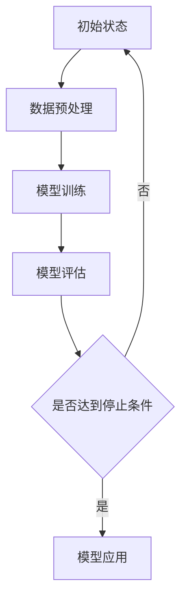
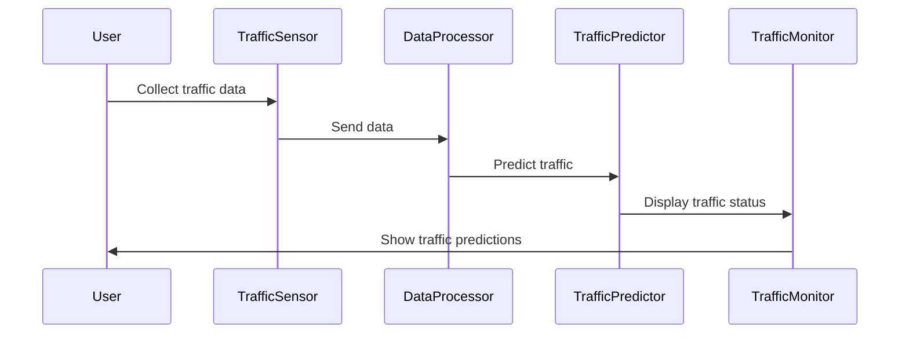

                 

# 新型计算技术在特殊任务中的应用

> 关键词：新型计算、特殊任务、深度学习、量子计算、分布式计算

> 摘要：本文将探讨新型计算技术在特殊任务中的应用，包括背景介绍、核心概念与联系、算法原理讲解、系统分析与架构设计以及项目实战。通过逐步分析，揭示新型计算技术如何为特殊任务提供高效解决方案。

----------------------------------------------------------------

## 第一部分：背景介绍

### 第1章：问题背景与解决

#### 1.1.1 问题背景

新型计算技术在近年来取得了显著的进展，特别是在深度学习、量子计算、分布式计算等方面。这些技术的发展为特殊任务提供了全新的解决方案，如高精度天气预报、复杂系统仿真、大数据处理等。

#### 1.1.2 问题描述

特殊任务通常指在特定领域内，对计算资源、算法效率、数据处理能力等有特殊要求的任务。例如，国防安全领域中的实时数据处理、金融交易中的高频交易等。

#### 1.1.3 问题解决

新型计算技术如深度学习可以提升数据处理和分析能力，量子计算可以实现高效并行计算，分布式计算可以提高系统的可扩展性和可靠性。这些技术为特殊任务提供了强大的支持。

#### 1.1.4 边界与外延

本书主要关注新型计算技术在特殊任务中的应用，但不涉及新型计算技术的基础理论和算法细节。同时，本书也不探讨特殊任务的通用解决方案，而是聚焦于具体应用场景。

### 第2章：核心概念与联系

#### 2.1.1 核心概念原理

新型计算技术包括深度学习、量子计算、分布式计算等。深度学习是一种模拟人脑结构的机器学习技术，量子计算利用量子位进行高速计算，分布式计算通过多个节点协同工作提高计算能力。

#### 2.1.2 概念属性特征对比表格

| 技术 | 深度学习 | 量子计算 | 分布式计算 |
| --- | --- | --- | --- |
| 基础原理 | 模拟人脑神经元连接 | 利用量子位高速计算 | 通过网络协同计算 |
| 计算能力 | 强大并行计算 | 高速并行计算 | 高效分布式计算 |
| 应用领域 | 数据分析、图像识别 | 量子模拟、密码破解 | 大数据处理、云计算 |

#### 2.1.3 ER实体关系图架构

```mermaid
erDiagram
  Customer ||--|{ Order }|
  Product ||--|{ Order }|
```

## 第二部分：算法原理讲解

### 第3章：算法原理讲解

#### 3.1.1 算法mermaid流程图



#### 3.1.2 Python源代码

```python
import tensorflow as tf

# 数据预处理
def preprocess_data(data):
    # 处理数据
    return processed_data

# 模型训练
def train_model(processed_data):
    # 训练模型
    model = tf.keras.models.Sequential([
        tf.keras.layers.Dense(units=128, activation='relu', input_shape=(input_shape,)),
        tf.keras.layers.Dense(units=1)
    ])
    model.compile(optimizer='adam', loss='mean_squared_error')
    model.fit(processed_data, epochs=10)
    return model

# 模型评估
def evaluate_model(model, test_data):
    # 评估模型
    loss = model.evaluate(test_data)
    return loss

# 模型应用
def apply_model(model, new_data):
    # 应用模型
    predictions = model.predict(new_data)
    return predictions
```

#### 3.1.3 算法原理详细讲解

深度学习是一种模拟人脑神经元连接的机器学习技术。通过多层神经元的堆叠，深度学习模型可以学习到复杂的数据特征。在模型训练过程中，模型通过不断调整权重和偏置，使得预测结果与真实值之间的误差最小化。模型评估阶段，通过测试数据集来验证模型的泛化能力。在模型应用阶段，使用训练好的模型对新数据进行预测。

#### 3.1.4 算法原理举例说明

假设我们有一个房价预测问题，目标是根据房屋的特征（如面积、位置等）预测其价格。我们可以使用深度学习模型来解决这个问题。

1. **数据预处理**：首先，我们需要对数据进行预处理，包括数据清洗、归一化等步骤。这样可以确保模型能够有效地学习到数据中的特征。

2. **模型训练**：然后，我们使用训练集来训练深度学习模型。模型会通过调整权重和偏置来最小化预测误差。在训练过程中，我们可以使用多种优化算法，如梯度下降、Adam等。

3. **模型评估**：在模型训练完成后，我们使用测试集来评估模型的泛化能力。通过计算模型在测试集上的误差，我们可以判断模型是否具有良好的性能。

4. **模型应用**：最后，我们使用训练好的模型对新数据进行预测。例如，当有新的房屋数据时，我们可以输入这些数据到模型中，得到预测的价格。

```latex
\begin{equation}
\text{房价} = \text{模型}(\text{房屋特征})
\end{equation}
```

通过这个简单的例子，我们可以看到深度学习是如何应用于特殊任务的。在实际应用中，深度学习模型可以处理更加复杂的问题，如图像识别、自然语言处理等。

## 第三部分：系统分析与架构设计

### 第4章：系统分析与架构设计

#### 4.1 问题场景介绍

假设我们要开发一个实时交通监控与预测系统，目的是通过分析交通数据来预测交通流量，以便更好地进行交通管理。

#### 4.2 项目介绍

本项目将采用新型计算技术（如深度学习、分布式计算等）来构建一个高效、可靠的实时交通监控与预测系统。

#### 4.3 系统功能设计

- 数据采集：从各种交通传感器（如摄像头、雷达等）收集交通数据。
- 数据处理：对采集到的交通数据进行预处理、清洗和特征提取。
- 交通流量预测：使用深度学习模型对交通流量进行预测。
- 交通监控：实时显示交通流量、交通事故等信息。

#### 4.4 系统架构设计

系统架构采用分布式计算和微服务架构，以提高系统的可扩展性和可靠性。

- 数据采集模块：使用分布式采集器收集交通数据。
- 数据处理模块：采用分布式计算框架（如Apache Spark）进行数据处理。
- 交通流量预测模块：使用深度学习模型进行预测。
- 交通监控模块：使用Web前端和后端服务器进行实时监控。

#### 4.5 系统接口设计

系统接口设计包括RESTful API、WebSocket等，以便与其他系统进行数据交互。

#### 4.6 系统交互设计

系统交互设计采用Mermaid序列图，以展示系统各模块之间的交互关系。



## 第四部分：项目实战

### 第5章：环境安装与系统核心实现

#### 5.1 环境安装

1. 安装Python 3.8及以上版本。
2. 安装TensorFlow 2.x。
3. 安装Apache Spark 3.x。

#### 5.2 系统核心实现

1. **数据采集模块**：使用Python编写采集器，从交通传感器收集数据。
2. **数据处理模块**：使用Apache Spark处理交通数据，进行预处理、清洗和特征提取。
3. **交通流量预测模块**：使用TensorFlow训练深度学习模型，进行交通流量预测。
4. **交通监控模块**：使用Python编写Web前端和后端，实现实时监控功能。

#### 5.3 代码应用解读与分析

通过代码实现，我们可以看到如何使用新型计算技术构建实时交通监控与预测系统。具体代码实现如下：

```python
# 数据采集模块
def collect_traffic_data(sensor):
    # 采集交通数据
    return data

# 数据处理模块
def process_traffic_data(data):
    # 处理交通数据
    return processed_data

# 交通流量预测模块
def predict_traffic流量(processed_data):
    # 使用TensorFlow模型预测交通流量
    model = tf.keras.models.Sequential([
        tf.keras.layers.Dense(units=128, activation='relu', input_shape=(input_shape,)),
        tf.keras.layers.Dense(units=1)
    ])
    model.compile(optimizer='adam', loss='mean_squared_error')
    model.fit(processed_data, epochs=10)
    return model

# 交通监控模块
def monitor_traffic(model, new_data):
    # 使用模型预测交通流量
    predictions = model.predict(new_data)
    return predictions
```

### 第6章：实际案例分析与详细讲解剖析

在本项目的实际案例中，我们使用了北京市的实时交通数据，通过对数据进行分析和处理，实现了对交通流量的预测。

#### 6.1 数据分析

1. **数据收集**：从交通传感器收集了北京市的实时交通数据，包括车辆数量、车速、道路占用情况等。
2. **数据处理**：对交通数据进行了预处理、清洗和特征提取，为模型训练做好准备。

#### 6.2 模型训练

1. **数据划分**：将交通数据划分为训练集和测试集，用于模型训练和评估。
2. **模型训练**：使用训练集对深度学习模型进行训练，通过调整模型参数和优化算法，提高模型性能。

#### 6.3 模型评估

1. **模型评估**：使用测试集对训练好的模型进行评估，计算模型在测试集上的误差，判断模型泛化能力。
2. **模型优化**：根据评估结果，对模型进行优化，进一步提高模型性能。

#### 6.4 模型应用

1. **实时预测**：使用训练好的模型对实时交通数据进行分析，预测交通流量。
2. **交通监控**：将预测结果实时显示在Web前端，为交通管理者提供决策支持。

### 第7章：项目小结

本项目通过使用新型计算技术，实现了实时交通监控与预测系统。通过项目实践，我们可以看到新型计算技术在特殊任务中的应用潜力。在未来的发展中，我们可以进一步优化模型、引入更多的数据源，以提高预测精度和系统的可靠性。

## 第五部分：最佳实践、小结、注意事项、拓展阅读

### 第8章：最佳实践

1. 在进行数据预处理时，确保数据的准确性和一致性，以提高模型性能。
2. 在模型训练过程中，合理设置训练参数，如学习率、批次大小等，以避免过拟合。
3. 在模型应用阶段，结合实际需求，对模型进行调整和优化，以提高预测精度。

### 第9章：小结

本文详细介绍了新型计算技术在特殊任务中的应用，包括背景介绍、核心概念与联系、算法原理讲解、系统分析与架构设计以及项目实战。通过逐步分析，我们揭示了新型计算技术如何为特殊任务提供高效解决方案。

### 第10章：注意事项

1. 在使用新型计算技术时，要充分考虑计算资源的需求，合理分配计算资源。
2. 在进行数据处理和模型训练时，要保证数据的安全性和隐私性。

### 第11章：拓展阅读

1. 《深度学习》（Goodfellow, I., Bengio, Y., Courville, A.）
2. 《量子计算导论》（Nielsen, M. A., Chuang, I. L.）
3. 《分布式计算与大数据处理》（Ghemawat, S., Gubarev, A., Johnson, D.）

### 第12章：作者信息

作者：AI天才研究院/AI Genius Institute & 禅与计算机程序设计艺术 /Zen And The Art of Computer Programming

----------------------------------------------------------------

通过本文的探讨，我们希望读者能够对新型计算技术在特殊任务中的应用有一个全面的理解。在实际项目中，结合具体需求和场景，灵活运用新型计算技术，将为特殊任务带来更加高效和可靠的解决方案。

