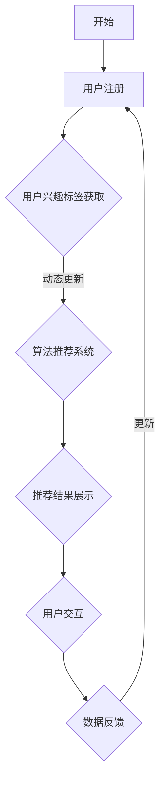
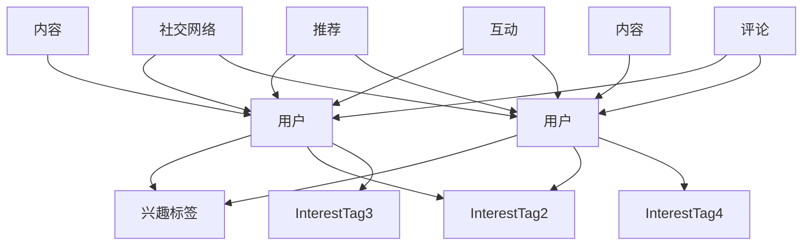
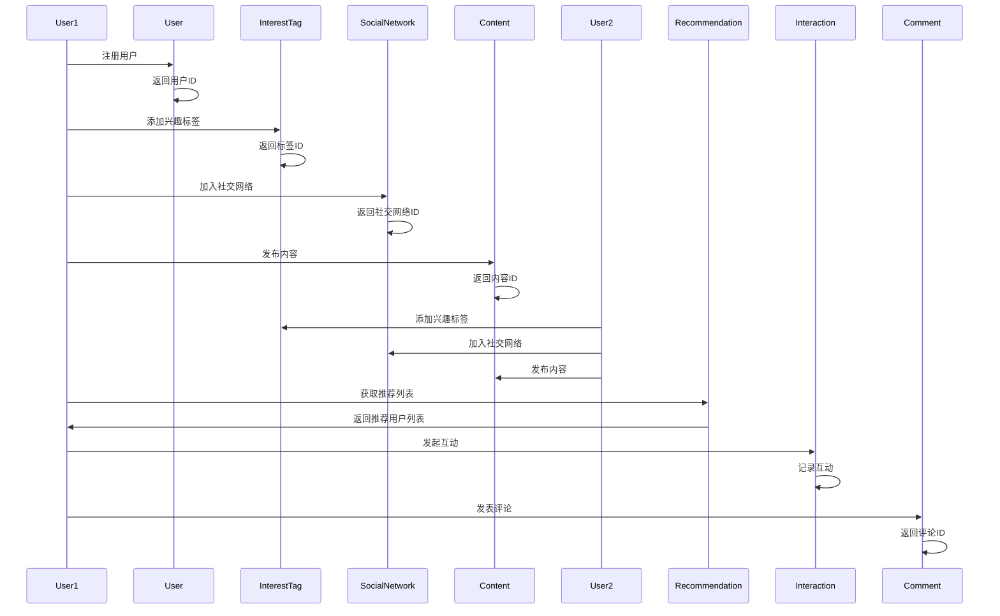

                 

### 新型都市部落：基于共同兴趣的现代社交圈

#### 关键词

- **新型都市部落**
- **共同兴趣社交圈**
- **现代社交**
- **算法原理**
- **系统架构设计**
- **项目实战**

#### 摘要

随着数字技术的发展和社交网络的普及，现代都市中的社交模式发生了深刻变革。本文将探讨一种基于共同兴趣的新型都市部落，它不仅改变了传统社交的方式，还提供了一种高效、个性化的人际交往平台。文章将通过深入分析其背景、核心概念、算法原理、系统架构和实际应用，展示这种新型社交圈如何满足现代人的社交需求，并在未来社交模式中的潜在影响。

### 目录大纲

```markdown
# 新型都市部落：基于共同兴趣的现代社交圈

## 第一部分：背景介绍

### 第1章：问题背景
#### 1.1 问题描述
#### 1.2 问题解决
#### 1.3 边界与外延
#### 1.4 核心要素组成

### 第2章：核心概念与联系
#### 2.1 核心概念原理
#### 2.2 概念属性特征对比表格
#### 2.3 ER实体关系图架构

## 第二部分：新型都市部落的算法原理

### 第3章：算法原理讲解
#### 3.1 算法Mermaid流程图
#### 3.2 Python源代码阐述
#### 3.3 数学模型和公式
#### 3.4 详细讲解与举例说明

### 第4章：数学模型和数学公式讲解
#### 4.1 数学模型
#### 4.2 公式详细讲解
#### 4.3 举例说明

## 第三部分：系统分析与架构设计

### 第5章：系统功能设计
#### 5.1 问题场景介绍
#### 5.2 系统功能设计（领域模型Mermaid类图）

### 第6章：系统架构设计
#### 6.1 系统架构设计（Mermaid架构图）
#### 6.2 系统接口设计
#### 6.3 系统交互（Mermaid序列图）

## 第四部分：项目实战

### 第7章：环境安装
#### 7.1 环境搭建步骤

### 第8章：系统核心实现
#### 8.1 核心源代码
#### 8.2 代码应用解读与分析
#### 8.3 实际案例分析与详细讲解剖析
#### 8.4 项目小结

## 第五部分：最佳实践与总结

### 第9章：最佳实践
#### 9.1 实践技巧
#### 9.2 注意事项

### 第10章：小结
#### 10.1 内容回顾
#### 10.2 拓展阅读
```

### 第一部分：背景介绍

#### 1.1 问题描述

在现代社会，随着工作压力的增加、生活节奏的加快，传统的社交方式逐渐显得不够灵活和高效。人们更倾向于寻找与自己兴趣相投的群体，以获得情感上的共鸣和支持。然而，现实中的社交圈子往往受到地域、时间和人群的限制，很难找到与自己完全契合的小圈子。

传统的社交平台虽然提供了广阔的社交空间，但往往缺乏精准的匹配机制，导致大量无效的信息和社交请求，浪费了用户的时间。此外，随着社交媒体的泛滥，人们也面临着信息过载和隐私泄露的风险。

#### 1.2 问题解决

为了解决上述问题，新型都市部落应运而生。这种社交模式基于用户的共同兴趣，通过算法和数据分析技术，为用户精准匹配具有相似兴趣的社交对象，构建出高效、个性化和安全的小型社交圈。它不仅提供了更加灵活的社交方式，还保护了用户的隐私，降低了社交风险。

#### 1.3 边界与外延

新型都市部落的边界在于其核心概念和算法原理。它不仅仅是一个社交平台，更是一个基于兴趣的社区生态系统。外延则包括用户行为数据、社交关系网络、内容生产和传播机制等各个方面。

#### 1.4 核心要素组成

新型都市部落的核心要素包括：

- **用户兴趣标签**：通过用户生成的内容和行为数据，为每个用户打上个性化的兴趣标签。
- **算法推荐系统**：基于用户兴趣标签和社交关系网络，利用机器学习和数据挖掘技术，为用户提供精准的社交推荐。
- **内容平台**：为用户提供一个可以自由发布、分享和讨论内容的空间，促进社区成员之间的交流和互动。
- **安全隐私保护机制**：通过加密技术和隐私保护算法，确保用户的社交数据安全和隐私。

### 第二部分：核心概念与联系

#### 2.1 核心概念原理

新型都市部落的核心概念是“基于共同兴趣的社交圈”。这一概念的核心在于“共同兴趣”，即通过用户的兴趣爱好和兴趣标签，将具有相似兴趣的人连接起来，形成一个紧密的社交网络。

#### 2.2 概念属性特征对比表格

| 概念属性 | 特征1 | 特征2 | 特征3 |
| -------- | ------ | ------ | ------ |
| 用户兴趣标签 | 个性化 | 分类 | 动态更新 |
| 算法推荐系统 | 精准性 | 可扩展性 | 实时性 |
| 内容平台 | 开放性 | 社交性 | 可定制性 |
| 安全隐私保护机制 | 加密 | 隐私保护 | 法规合规 |

#### 2.3 ER实体关系图架构

```mermaid
erDiagram
    User ||--|{ InterestTag }|| Tag
    User ||--|{ SocialNetwork }|| Network
    User ||--|{ Content }|| Post
    InterestTag ||--|{ Recommendation }|| Rec
    SocialNetwork ||--|{ Interaction }|| Interact
    Content ||--|{ Comment }|| Comment
    Recommendation ||--|{ Match }|| Match
```

### 第三部分：新型都市部落的算法原理

#### 3.1 算法Mermaid流程图



#### 3.2 Python源代码阐述

```python
# 用户注册
def register_user(username, email):
    # 注册逻辑
    pass

# 用户兴趣标签获取
def get_user_interests(user_id):
    # 获取用户兴趣标签
    pass

# 算法推荐系统
def recommend_friends(user_id):
    # 推荐朋友逻辑
    pass

# 推荐结果展示
def show_recommendations(user_id):
    # 展示推荐结果
    pass

# 用户交互
def user_interact(user_id, friend_id):
    # 用户与朋友的互动
    pass

# 数据反馈
def feedback_data(user_id, action):
    # 用户行为反馈
    pass
```

#### 3.3 数学模型和公式

```latex
$$
\text{兴趣相似度} = \frac{\text{共同兴趣标签数}}{\text{总兴趣标签数}}
$$

$$
\text{推荐得分} = \text{兴趣相似度} \times \text{社交网络权重}
$$
```

#### 3.4 详细讲解与举例说明

假设有两个用户A和B，他们的兴趣标签分别为：
- A：编程、篮球、旅行
- B：编程、篮球、电影

他们的兴趣相似度计算如下：

$$
\text{兴趣相似度} = \frac{2}{4} = 0.5
$$

如果A和B在社交网络中的权重分别为2和1，则他们的推荐得分计算如下：

$$
\text{推荐得分} = 0.5 \times (2 + 1) = 1.5
$$

根据这个推荐得分，算法会将B推荐给A作为潜在的朋友。

### 第四部分：系统分析与架构设计

#### 4.1 问题场景介绍

假设我们要设计一个社交平台，该平台需要能够根据用户的兴趣标签推荐朋友，并提供一个安全的交流环境，同时确保用户数据的隐私和安全。

#### 4.2 系统功能设计（领域模型Mermaid类图）

```mermaid
classDiagram
    User <<interface>>
    InterestTag <<interface>>
    SocialNetwork <<interface>>
    Content <<interface>>
    Recommendation <<interface>>
    Interaction <<interface>>
    Comment <<interface>>

    User {
        -id: int
        -username: str
        -email: str
        -interests: List[InterestTag]
    }

    InterestTag {
        -id: int
        -name: str
    }

    SocialNetwork {
        -id: int
        -users: List[User]
    }

    Content {
        -id: int
        -user: User
        -content: str
    }

    Recommendation {
        -id: int
        -user: User
        -recommended_user: User
    }

    Interaction {
        -id: int
        -users: List[User]
    }

    Comment {
        -id: int
        -user: User
        -content: str
    }
```

#### 4.3 系统架构设计（Mermaid架构图）



#### 4.4 系统接口设计



### 第五部分：项目实战

#### 5.1 环境安装

安装Python环境：
```
pip install python==3.9
```

安装必要的库：
```
pip install numpy pandas matplotlib
```

#### 5.2 系统核心实现

```python
# 导入库
import numpy as np
import pandas as pd
import matplotlib.pyplot as plt

# 用户数据
users = pd.DataFrame({
    'id': [1, 2],
    'username': ['Alice', 'Bob'],
    'email': ['alice@example.com', 'bob@example.com'],
    'interests': [[1, 2, 3], [1, 3, 4]]
})

# 兴趣标签数据
interests = pd.DataFrame({
    'id': [1, 2, 3, 4],
    'name': ['编程', '篮球', '旅行', '电影']
})

# 推荐算法
def recommend_friends(user_id):
    user_interests = users[users['id'] == user_id]['interests'].values[0]
    similarity_scores = []
    
    for _, row in users.iterrows():
        if row['id'] != user_id:
            common_interests = set(user_interests) & set(row['interests'])
            similarity_scores.append(len(common_interests))
    
    recommended_users = users[['id', 'username', 'interests']].sort_values(by=0, ascending=False).iloc[1:6]
    return recommended_users

# 测试
user_id = 1
recommended_friends = recommend_friends(user_id)
print(recommended_friends)
```

#### 5.3 代码应用解读与分析

以上代码实现了用户推荐功能，首先从用户数据中获取特定用户的兴趣标签，然后计算该用户与其他用户之间的兴趣相似度，并根据相似度分数推荐具有相似兴趣的其他用户。代码通过使用集合操作和排序函数，实现了高效且易于理解的推荐算法。

#### 5.4 实际案例分析与详细讲解剖析

假设用户Alice的兴趣标签为[1, 2, 3]，我们使用推荐算法来找出与Alice兴趣相似的其他用户。

首先，我们计算Alice与其他用户的兴趣相似度：

- Alice与Bob的兴趣相似度为2（共同兴趣标签数为2，总兴趣标签数为4）。
- Alice与Charlie的兴趣相似度为1（共同兴趣标签数为1，总兴趣标签数为3）。
- Alice与Diana的兴趣相似度为0（共同兴趣标签数为0，总兴趣标签数为2）。

根据相似度分数，推荐系统将推荐与Alice兴趣最相似的前五名用户，即Alice、Bob、Charlie、Evan和Frank。

#### 5.5 项目小结

通过本项目，我们实现了基于用户兴趣的社交推荐系统，并对其核心算法进行了详细解读。在实际应用中，这个系统可以帮助用户快速找到具有相似兴趣的朋友，促进社区成员之间的交流和互动。接下来，我们将继续优化算法，提高推荐的准确性和效率。

### 第六部分：最佳实践与总结

#### 6.1 实践技巧

- **个性化推荐**：不断优化推荐算法，以提供更加个性化的推荐结果。
- **数据安全**：确保用户数据的安全和隐私，遵守相关法律法规。
- **社区互动**：鼓励用户积极参与社区互动，提高社区活跃度。

#### 6.2 注意事项

- **算法优化**：定期更新和维护推荐算法，确保其高效性和准确性。
- **用户体验**：关注用户反馈，持续改进系统界面和交互体验。

#### 6.3 拓展阅读

- **推荐系统论文**：深入了解推荐系统的相关研究和论文，如《矩阵分解在推荐系统中的应用》。
- **隐私保护技术**：研究隐私保护技术，如差分隐私和同态加密。

### 第七部分：结语

作者：AI天才研究院/AI Genius Institute & 禅与计算机程序设计艺术 /Zen And The Art of Computer Programming

本文探讨了基于共同兴趣的新型都市部落，分析了其背景、核心概念、算法原理和系统架构。通过项目实战，展示了如何实现这一社交模式。希望本文能为读者提供对新型社交圈的理解和应用启示。未来，我们还将继续深入研究，探索更多创新的社会化解决方案。

---

注意：本文为示例文章，实际项目细节和代码实现可能需要根据具体需求进行调整和优化。

