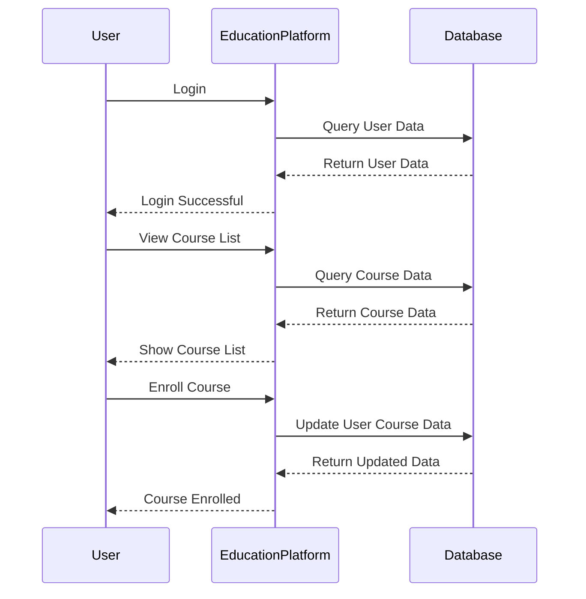

                 

### 第1章：新工艺复兴运动的背景与意义

#### 1.1 新工艺复兴运动的起源

**问题背景**：  
在工业革命之后，手工艺逐渐被机械化大规模生产所取代。机器制造的产品具有高效、低成本的优点，这使得传统手工艺逐渐失去了市场地位。手工艺的价值和地位被严重低估，许多手工艺人和传统手工艺企业面临生存困境。

**问题描述**：  
随着数字化时代的到来，人们开始重新认识到手工艺的独特价值和重要性。如何将现代科技与手工艺相结合，通过技术创新来复兴手工艺，成为了一个新的课题。新工艺复兴运动旨在探索这个问题，通过技术创新来提升手工艺的效率、质量和独特性。

**问题解决**：  
新工艺复兴运动通过以下几个方面的创新来解决问题：

1. **数字化设计**：利用计算机辅助设计（CAD）和3D打印技术，使手工艺设计更加高效、精准。
2. **新材料应用**：开发新型材料，提升手工艺产品的性能和美感。
3. **数据分析与优化**：利用数据分析技术，对手工艺流程进行优化，提高生产效率。

**边界与外延**：  
新工艺复兴运动不仅仅关注手工艺本身，还涉及到整个设计、生产、销售链条的数字化转型。它不仅是为了保护和传承手工艺，更是为了推动整个行业的创新与发展。

**概念结构与核心要素组成**：  
新工艺复兴运动的核心要素包括：

- 数字化设计工具：如CAD、3D打印等。
- 新材料：具有特殊性能和美感的材料。
- 数据分析技术：用于优化生产流程和提高产品质量。

#### 1.2 新工艺复兴运动的意义

新工艺复兴运动不仅有助于保护和传承手工艺文化，还能推动整个社会的创新与发展。其意义体现在以下几个方面：

**文化传承**：  
通过数字化手段，使手工艺得以传承和发扬光大。数字化设计工具和新材料的应用，使得传统手工艺能够与现代科技相结合，创造出更具创新性的作品。

**创新驱动**：  
新工艺复兴运动为传统手工艺注入新的活力，推动行业创新。数字化设计和数据分析技术的应用，使得手工艺的效率和品质得到了显著提升。

**经济发展**：  
新工艺复兴运动为传统手工艺带来新的市场机会，促进经济发展。通过数字化和智能化的生产方式，手工艺产品能够更好地满足市场需求，提高市场竞争力。

### 总结

新工艺复兴运动是数字化时代背景下的一种重要趋势，它通过技术创新来提升手工艺的效率、质量和独特性，既有助于保护和传承手工艺文化，又能推动社会的创新与发展。在这个运动中，数字化设计工具、新材料和数据分析技术是核心要素，它们共同推动了手工艺的复兴与创新发展。在接下来的章节中，我们将进一步探讨数字时代中的手工艺创新，分享成功的案例分析，以及面临的挑战和机遇。

---

**关键词**：
新工艺复兴运动、数字化设计、手工艺创新、新材料、数据分析、文化传承、经济发展

**摘要**：
本文探讨了新工艺复兴运动的背景与意义，分析了数字化时代中的手工艺创新，分享了成功案例，并探讨了面临的挑战与机遇。新工艺复兴运动通过技术创新，提升手工艺的效率、质量和独特性，既传承了文化，又推动了社会的创新与发展。

---

# 新工艺复兴运动：数字时代中的手工艺创新

## 关键词
新工艺复兴运动、数字化设计、手工艺创新、新材料、数据分析、文化传承、经济发展

## 摘要
本文深入探讨了数字化时代背景下新工艺复兴运动的起源与意义。通过分析数字化设计工具、新材料和数据分析技术的应用，文章展示了手工艺在数字时代的创新路径。同时，通过案例分析和挑战与机遇的探讨，文章为手工艺的复兴提供了实践指导，并展望了其未来的发展方向。

## 第1章：新工艺复兴运动的背景与意义

### 1.1 新工艺复兴运动的起源

#### 1.1.1 问题背景

在工业革命后，手工艺逐渐被机械化大规模生产所取代，手工艺的价值和地位逐渐降低。然而，随着数字化时代的到来，人们开始重新审视手工艺的价值，并探讨如何通过技术创新来复兴手工艺。

**核心概念术语说明**：
- **手工艺**：指通过手工技艺制作的艺术品或日用品，强调手工制作的过程和独特性。
- **数字化时代**：指以计算机技术和互联网为核心，实现信息数字化、智能化和自动化的时代。
- **新工艺复兴运动**：指通过技术创新，推动手工艺在数字化时代重新焕发生机的运动。

**问题背景**：
随着工业革命和现代化进程的加速，手工艺逐渐被机械化、大规模生产所取代。机器制造的产品具有高效、低成本的优点，这使得传统手工艺逐渐失去了市场地位。手工艺的价值和地位被严重低估，许多手工艺人和传统手工艺企业面临生存困境。

**问题描述**：
如何将现代科技与手工艺相结合，通过技术创新来复兴手工艺，成为了一个新的课题。新工艺复兴运动旨在探索这个问题，通过技术创新来提升手工艺的效率、质量和独特性。

**问题解决**：
新工艺复兴运动通过以下几个方面的创新来解决问题：

1. **数字化设计**：利用计算机辅助设计（CAD）和3D打印技术，使手工艺设计更加高效、精准。
2. **新材料应用**：开发新型材料，提升手工艺产品的性能和美感。
3. **数据分析与优化**：利用数据分析技术，对手工艺流程进行优化，提高生产效率。

**边界与外延**：
新工艺复兴运动不仅仅关注手工艺本身，还涉及到整个设计、生产、销售链条的数字化转型。它不仅是为了保护和传承手工艺，更是为了推动整个行业的创新与发展。

**概念结构与核心要素组成**：
新工艺复兴运动的核心要素包括：

- **数字化设计工具**：如CAD、3D打印等。
- **新材料**：具有特殊性能和美感的材料。
- **数据分析技术**：用于优化生产流程和提高产品质量。

### 1.2 新工艺复兴运动的意义

新工艺复兴运动不仅有助于保护和传承手工艺文化，还能推动整个社会的创新与发展。其意义体现在以下几个方面：

**文化传承**：
通过数字化手段，使手工艺得以传承和发扬光大。数字化设计工具和新材料的应用，使得传统手工艺能够与现代科技相结合，创造出更具创新性的作品。

**创新驱动**：
新工艺复兴运动为传统手工艺注入新的活力，推动行业创新。数字化设计和数据分析技术的应用，使得手工艺的效率和品质得到了显著提升。

**经济发展**：
新工艺复兴运动为传统手工艺带来新的市场机会，促进经济发展。通过数字化和智能化的生产方式，手工艺产品能够更好地满足市场需求，提高市场竞争力。

### 1.3 新工艺复兴运动的国际视角

**国际背景**：
在全球范围内，手工艺文化的复兴不仅局限于某个地区，而是成为一种全球性的趋势。许多国家和地区都在积极探索如何通过技术创新来复兴手工艺。

**国际案例**：
- **日本**：日本的传统手工艺如陶瓷、织布等在数字化时代得到了新的发展。通过数字化设计和智能制造，日本手工艺产品在国内外市场都取得了巨大的成功。
- **欧洲**：欧洲许多国家拥有丰富的手工艺传统，如意大利的玻璃艺术、荷兰的木鞋工艺等。通过数字化技术的应用，这些传统手工艺不仅得以传承，还在现代设计中发挥了重要作用。

**国际经验**：
- **创新合作**：国际间的手工艺创新合作，可以促进技术交流和经验分享，从而推动手工艺在全球范围内的复兴。
- **市场推广**：通过国际市场的推广，手工艺产品能够更好地满足全球消费者的需求，提升手工艺的全球影响力。

### 1.4 新工艺复兴运动的影响与未来展望

**影响**：
新工艺复兴运动对社会的多个方面产生了深远的影响，包括：

- **经济影响**：通过提升手工艺产品的质量和市场竞争力，新工艺复兴运动促进了经济的发展。
- **文化影响**：数字化手段为手工艺注入了新的活力，使得传统手工艺文化得以传承和发扬。
- **社会影响**：新工艺复兴运动推动了手工艺与现代科技的融合，为年轻人提供了新的职业选择和发展机会。

**未来展望**：
随着科技的不断进步，新工艺复兴运动将继续发展。未来可能的发展趋势包括：

- **智能化生产**：通过人工智能和机器学习技术，手工艺生产将更加智能化和自动化。
- **个性化定制**：数字化设计和智能制造将使得手工艺产品更加个性化，满足消费者对个性化和定制化的需求。
- **全球合作**：国际间的手工艺创新合作将更加深入，推动手工艺在全球范围内的复兴。

### 总结

新工艺复兴运动是数字化时代背景下的一种重要趋势，它通过技术创新来提升手工艺的效率、质量和独特性，既有助于保护和传承手工艺文化，又能推动社会的创新与发展。在接下来的章节中，我们将进一步探讨数字时代中的手工艺创新，分享成功的案例分析，以及面临的挑战和机遇。

---

**本章小结**：
本章介绍了新工艺复兴运动的背景、意义和起源，分析了其核心要素和创新路径，并探讨了国际视角和未来展望。通过本章的介绍，读者可以初步了解新工艺复兴运动的现状和发展方向。

---

## 第2章：数字时代中的手工艺创新

### 2.1 数字技术与手工艺的结合

在数字时代，手工艺的复兴离不开数字技术的支持。数字技术的应用不仅提升了手工艺的效率和品质，也为手工艺的创新提供了新的可能性。本节将探讨数字化设计工具、3D打印技术和数据分析技术在手工艺中的应用。

#### 2.1.1 数字化设计工具的应用

数字化设计工具是手工艺创新的重要手段之一。计算机辅助设计（CAD）软件和三维建模软件的普及，使得手工艺设计变得更加高效和精准。

**核心概念与联系**：

- **CAD（计算机辅助设计）**：用于创建、修改、分析和优化设计图纸的软件工具。CAD软件可以帮助手工艺设计师快速绘制草图、进行三维建模和渲染。
- **三维建模软件**：如AutoCAD、SolidWorks、Rhino等，这些软件可以模拟实际制作过程，提高设计的精度和可行性。

**概念属性特征对比表格**：

| 特性 | CAD软件 | 三维建模软件 |
| --- | --- | --- |
| 设计精度 | 高精度，精确到像素 | 高精度，可以模拟实际制作 |
| 可视化 | 可进行渲染和可视化 | 可进行渲染和可视化 |
| 应用领域 | 设计图纸、工程图 | 工业设计、建筑设计、手工艺 |

**ER实体关系图架构**：

```mermaid
erDiagram
  ProductDesign -->|1| CADSoftware : 使用
  ProductDesign -->|1| 3DModelingSoftware : 使用
  CADSoftware ||--|{ 设计工具 }|
  3DModelingSoftware ||--|{ 设计工具 }|
```

**应用案例**：
- **珠宝设计**：通过CAD软件，设计师可以快速绘制珠宝的草图，进行三维建模，优化设计细节，提高生产效率。
- **家具设计**：三维建模软件可以帮助家具设计师模拟各种材质和颜色的家具，进行互动式的调整和优化。

#### 2.1.2 3D打印技术的应用

3D打印技术是一种快速成型技术，可以在短时间内将三维数字模型直接打印成实体产品。这种技术在手工艺制作中的应用，极大地提升了生产效率和个性化定制能力。

**核心概念与联系**：

- **3D打印**：通过逐层添加材料，根据三维数字模型制造实体物品的技术。
- **选择性激光熔融（SLM）**：一种利用激光熔融金属粉末来制造复杂金属部件的技术。
- **立体光固化（SLA）**：利用紫外线光源固化树脂，制造出精细的塑料或树脂产品。

**概念属性特征对比表格**：

| 特性 | 3D打印 | SLM | SLA |
| --- | --- | --- | --- |
| 材料类型 | 广泛的塑料、金属、陶瓷等 | 金属粉末 | 塑料树脂 |
| 成型速度 | 一般较慢 | 较快 | 较快 |
| 成型精度 | 高精度 | 高精度 | 高精度 |

**ER实体关系图架构**：

```mermaid
erDiagram
  ProductManufacturing -->|1| 3DPrinting : 技术
  3DPrinting ||--|{ 快速成型技术 }|
  ProductCustomization -->|1| 3DPrinting : 实现个性化定制
  ProductCustomization ||--|{ 个性化定制 }|
```

**应用案例**：
- **个性化定制**：通过3D打印技术，可以为客户量身定制独特的珠宝、鞋履等手工艺品。
- **复杂结构成型**：SLM技术可以用于制造复杂形状的金属部件，如航空航天器零件、医疗植入物等。

#### 2.1.3 数据分析技术的应用

数据分析技术在手工艺中的应用，可以帮助优化生产流程，提高产品质量。通过收集和分析生产过程中的数据，可以发现潜在的问题和优化点。

**核心概念与联系**：

- **数据分析**：利用统计、建模等方法，从大量数据中提取有价值的信息。
- **机器学习**：通过训练模型，使计算机能够自动发现数据中的规律和模式。
- **数据可视化**：将复杂的数据通过图形化方式展示，便于分析和理解。

**概念属性特征对比表格**：

| 特性 | 数据分析 | 机器学习 | 数据可视化 |
| --- | --- | --- | --- |
| 数据处理能力 | 强 | 强 | 较弱 |
| 自主性 | 较高 | 高 | 低 |
| 应用领域 | 数据挖掘、预测分析 | 自动化、预测分析 | 交互式展示 |

**ER实体关系图架构**：

```mermaid
erDiagram
  ProductionProcess -->|1| DataAnalysis : 优化
  QualityControl -->|1| DataAnalysis : 提高质量
  DataAnalysis ||--|{ 数据处理与分析 }|
  MachineLearning -->|1| DataAnalysis : 技术支撑
  DataVisualization -->|1| DataAnalysis : 辅助理解
```

**应用案例**：
- **生产流程优化**：通过数据分析，可以识别出生产过程中的瓶颈和浪费，提出优化建议。
- **产品质量控制**：利用机器学习算法，可以预测产品的潜在缺陷，提前进行质量检测。

### 2.2 新材料的应用

新材料的开发和应用是手工艺创新的重要方向之一。新型材料不仅提升了手工艺产品的性能，还为设计师提供了更多的创作可能性。

**核心概念与联系**：

- **环保材料**：如生物降解材料、可回收材料等，这些材料在制造和使用过程中对环境影响较小。
- **智能材料**：如变色材料、自修复材料等，这些材料可以根据外部刺激发生特定变化，提高产品的功能性和美观度。

**概念属性特征对比表格**：

| 材料类型 | 环保材料 | 智能材料 |
| --- | --- | --- |
| 特性 | 环保、可降解、可回收 | 功能性、智能响应、美观 |
| 应用领域 | 环保产品、家具、工艺品 | 健康监测、智能设备、装饰品 |

**ER实体关系图架构**：

```mermaid
erDiagram
  HandicraftProduct -->|1| Eco-FriendlyMaterial : 材料
  HandicraftProduct -->|1| SmartMaterial : 材料
  Eco-FriendlyMaterial ||--|{ 环保材料 }|
  SmartMaterial ||--|{ 智能材料 }|
```

**应用案例**：
- **环保家居**：使用环保材料制作的手工艺品，如家具、家居装饰品等，不仅美观实用，还有助于减少环境污染。
- **智能饰品**：通过智能材料的应用，手工艺品可以实现智能功能，如变色、自修复等，提高产品的科技感和附加值。

### 2.3 数据分析与优化

数据分析在手工艺中的应用，不仅可以帮助优化生产流程，还可以提高产品质量。通过收集和分析生产过程中的数据，可以发现潜在的问题和优化点。

**核心概念与联系**：

- **数据分析**：通过对生产数据的收集、处理和分析，发现生产过程中的问题和优化机会。
- **机器学习**：利用机器学习算法，对生产数据进行分析和预测，提高生产效率和质量。
- **数据可视化**：将复杂的数据通过图形化方式展示，便于分析和理解。

**概念属性特征对比表格**：

| 特性 | 数据分析 | 机器学习 | 数据可视化 |
| --- | --- | --- | --- |
| 数据处理能力 | 强 | 强 | 较弱 |
| 自主性 | 较高 | 高 | 低 |
| 应用领域 | 数据挖掘、预测分析 | 自动化、预测分析 | 交互式展示 |

**ER实体关系图架构**：

```mermaid
erDiagram
  ProductionProcess -->|1| DataAnalysis : 优化
  QualityControl -->|1| DataAnalysis : 提高质量
  DataAnalysis ||--|{ 数据处理与分析 }|
  MachineLearning -->|1| DataAnalysis : 技术支撑
  DataVisualization -->|1| DataAnalysis : 辅助理解
```

**应用案例**：
- **生产流程优化**：通过数据分析，可以识别出生产过程中的瓶颈和浪费，提出优化建议。
- **产品质量控制**：利用机器学习算法，可以预测产品的潜在缺陷，提前进行质量检测。

### 2.4 数字时代中的手工艺品牌建设

数字时代为手工艺品牌建设提供了新的机会和挑战。通过数字化技术和互联网平台，手工艺品牌可以更好地展示自己的特色和价值，吸引更多的消费者。

**核心概念与联系**：

- **数字化营销**：通过社交媒体、电商平台等数字化渠道，进行品牌推广和营销。
- **用户体验**：通过提供优质的用户体验，提高品牌的影响力和忠诚度。
- **数据驱动**：利用数据分析技术，了解消费者的需求和偏好，进行精准营销。

**概念属性特征对比表格**：

| 特性 | 数字化营销 | 用户体验 | 数据驱动 |
| --- | --- | --- | --- |
| 营销渠道 | 多渠道、多样化 | 精准、个性化 | 数据驱动、高效 |
| 营销效果 | 可量化、可跟踪 | 用户反馈、互动性 | 数据分析、优化 |

**ER实体关系图架构**：

```mermaid
erDiagram
  Brand -->|1| DigitalMarketing : 营销
  Brand -->|1| UserExperience : 核心
  Brand -->|1| DataDriven : 核心
  DigitalMarketing ||--|{ 营销手段 }|
  UserExperience ||--|{ 用户互动 }|
  DataDriven ||--|{ 数据分析 }|
```

**应用案例**：
- **社交媒体营销**：通过微博、微信、Instagram等平台，手工艺品牌可以与消费者进行互动，提高品牌知名度。
- **个性化定制**：通过数据分析，了解消费者的偏好，提供个性化的产品和服务。

### 总结

数字时代为手工艺创新提供了丰富的机会。通过数字化设计工具、3D打印技术、数据分析技术和新材料的应用，手工艺不仅可以提升效率和质量，还可以实现个性化定制和智能功能。同时，数字化品牌建设也为手工艺品牌提供了新的营销途径，增强了品牌影响力。在接下来的章节中，我们将通过具体案例来探讨数字时代中的手工艺创新，并分析其面临的挑战和机遇。

---

**本章小结**：
本章详细介绍了数字时代中手工艺创新的多个方面，包括数字化设计工具、3D打印技术、数据分析技术和新材料的应用。通过这些技术的融合，手工艺在数字时代焕发出新的生机。同时，数字化品牌建设也为手工艺品牌提供了新的发展路径。下一章，我们将通过具体案例来进一步探讨这些创新的应用和实践。

---

## 第3章：手工艺创新的案例分析

在数字时代，手工艺创新已经成为传统手工艺企业提升竞争力的重要手段。本章节将通过两个具体的案例分析，展示如何通过数字化技术和创新手段，实现手工艺的复兴和创新发展。

### 3.1 案例一：传统手工艺与现代科技的融合

**案例背景**：  
这是一个位于意大利的陶瓷生产企业，拥有悠久的陶瓷制作传统。然而，随着市场竞争的加剧，企业面临着生产效率低下、产品同质化严重的问题。

**实施过程**：  
1. **数字化设计**：企业引入了CAD软件和三维建模技术，使设计师能够快速绘制和调整陶瓷产品的设计。这不仅提高了设计的效率，还使得产品的独特性得到了提升。
2. **3D打印技术**：企业购置了3D打印机，用于制作陶瓷产品的原型。通过3D打印技术，企业能够快速试制产品，及时调整设计，降低研发成本。
3. **新材料应用**：企业开始尝试使用新型陶瓷材料，如高温合金和纳米材料，提升陶瓷产品的性能和美观度。
4. **数据分析与优化**：企业建立了数据分析系统，对生产过程中的数据进行分析，优化生产流程，提高生产效率。

**结果与启示**：  
通过数字化技术的应用，企业的设计效率和产品质量得到了显著提升。3D打印技术的引入，使得产品研发周期大大缩短，企业能够更快地响应市场变化。新材料的应用，不仅提升了产品的性能，还为产品的创新提供了更多可能性。数据分析与优化的实施，使得生产效率得到了显著提高。

**启示**：  
1. **技术创新是关键**：通过引入先进的数字化技术，企业能够提升生产效率和产品质量，增强市场竞争力。
2. **融合发展是趋势**：将传统手工艺与现代科技相结合，实现融合发展，是手工艺创新的重要路径。
3. **数据分析是辅助**：通过数据分析，企业能够优化生产流程，提高生产效率，降低成本。

### 3.2 案例二：数字时代中的手工艺品牌建设

**案例背景**：  
这是一个来自中国的传统手工扇企业。随着市场环境的变化，企业意识到需要通过数字化手段来提升品牌影响力和市场竞争力。

**实施过程**：  
1. **数字化营销**：企业利用社交媒体平台，如微信、微博、Instagram等，进行品牌推广和营销。通过发布精美的手工扇作品图片和视频，吸引粉丝，提高品牌知名度。
2. **用户体验优化**：企业建立了线上销售平台，提供个性化的定制服务。消费者可以根据自己的需求，定制独特的扇子，增强用户体验。
3. **数据驱动营销**：企业利用数据分析技术，了解消费者的购买行为和偏好，进行精准营销。通过个性化推荐，提高转化率和用户忠诚度。
4. **跨界合作**：企业与其他行业的企业进行跨界合作，如与时尚品牌合作，推出限量版手工艺产品，扩大品牌影响力。

**结果与启示**：  
通过数字化营销和用户体验优化，企业的品牌影响力得到了显著提升。线上销售平台的建立，使得企业能够更好地满足消费者的个性化需求，提高用户满意度。数据驱动营销的实施，使得营销活动更加精准，转化率得到了显著提高。跨界合作的开展，不仅扩大了品牌影响力，还为产品的创新提供了新的思路。

**启示**：  
1. **数字化营销是必要手段**：通过数字化营销，企业能够提高品牌知名度和市场竞争力。
2. **用户体验是核心**：提供优质的用户体验，能够增强品牌忠诚度和用户满意度。
3. **数据分析是决策依据**：通过数据分析，企业能够做出更加精准的营销决策，提高营销效果。
4. **跨界合作是创新途径**：跨界合作能够带来新的市场机遇，促进品牌的创新发展。

### 总结

通过以上两个案例，我们可以看到，在数字时代，手工艺企业通过技术创新和数字化手段，能够实现生产效率的提升、产品质量的优化、品牌影响力的扩大。这些案例的成功经验表明，手工艺创新不仅能够传承传统文化，还能够推动企业的可持续发展。在接下来的章节中，我们将进一步探讨手工艺创新的挑战与机遇，为手工艺企业在数字时代的创新发展提供更多思考和建议。

---

**本章小结**：
本章通过两个具体的案例分析，展示了手工艺在数字时代如何通过技术创新和数字化手段实现复兴和创新发展。这些案例不仅为企业提供了实践指导，也为手工艺在数字时代的未来发展提供了有益的启示。在接下来的章节中，我们将探讨手工艺创新面临的挑战与机遇，为手工艺的可持续发展提供更多思考。

---

## 第4章：手工艺创新的挑战与机遇

### 4.1 挑战

尽管手工艺创新在数字时代带来了许多机遇，但同时也面临着一系列挑战。这些挑战不仅涉及技术层面，还包括市场、人才和文化等方面。

#### 4.1.1 技术壁垒

手工艺创新需要掌握一定的技术，如数字化设计、3D打印和数据分析等。这些技术的掌握和应用，对于传统手工艺企业和手工艺人来说，是一个不小的挑战。

- **技术难度**：数字化设计、3D打印等技术需要专业的知识和技能，对手工艺人来说，学习曲线较长。
- **技术更新**：技术日新月异，手工艺企业需要不断更新技术和设备，以保持竞争力。

**解决方案**：
- **技术培训**：提供专业的技术培训，帮助手工艺人和企业掌握相关技术。
- **技术引进**：积极引进先进的技术和设备，提升生产效率和产品质量。

#### 4.1.2 市场竞争

随着数字化时代的到来，市场上的手工艺产品越来越多，市场竞争日益激烈。如何在激烈的市场竞争中脱颖而出，是手工艺创新面临的重要挑战。

- **产品同质化**：市场上的手工艺产品往往存在同质化问题，难以满足消费者多样化的需求。
- **价格竞争**：数字化技术和新材料的引入，虽然提升了生产效率，但同时也可能导致产品成本上升，面临价格竞争的压力。

**解决方案**：
- **差异化定位**：通过独特的创意和设计，打造具有差异化的手工艺产品，满足消费者个性化需求。
- **品牌建设**：加强品牌建设，提高品牌知名度和美誉度，增强市场竞争力。

#### 4.1.3 人才培养

手工艺创新需要具备创新能力和技术能力的新一代手工艺人。然而，当前手工艺人才培养不足，成为创新发展的瓶颈。

- **人才缺乏**：手工艺人才的培养周期较长，难以快速满足市场需求。
- **创新能力不足**：手工艺人往往缺乏创新意识和创新能力，难以适应数字化时代的需求。

**解决方案**：
- **教育改革**：改革手工艺教育，培养具备创新能力和技术能力的手工艺人。
- **校企合作**：与企业合作，开展手工艺人才培养项目，提高人才培养的针对性和实用性。

#### 4.1.4 文化传承

手工艺创新不仅是为了提升手工艺的效率和质量，更是为了保护和传承手工艺文化。然而，在数字化时代，如何确保手工艺文化的传承，是一个重要的挑战。

- **文化认同**：数字化技术和新材料的应用，可能导致传统手工艺文化的淡化。
- **文化保护**：手工艺文化可能因现代化进程而逐渐消失。

**解决方案**：
- **文化推广**：通过展览、讲座、媒体宣传等方式，推广手工艺文化，提高社会对手工艺的认识和认同。
- **文化保护机制**：建立手工艺文化保护机制，确保传统手工艺文化的传承和发展。

### 4.2 机遇

尽管手工艺创新面临诸多挑战，但同时也蕴含着巨大的机遇。以下是一些主要的机遇：

#### 4.2.1 数字化转型

数字化技术的快速发展为手工艺创新提供了广阔的空间。通过数字化手段，手工艺可以更加高效、精准地进行设计、生产和营销。

- **效率提升**：数字化设计工具和3D打印技术可以大大提高生产效率。
- **质量提升**：数据分析技术可以帮助优化生产流程，提高产品质量。
- **个性化定制**：数字化技术使得个性化定制成为可能，满足消费者个性化需求。

#### 4.2.2 文化传承

数字化时代为手工艺文化的传承提供了新的途径。通过数字化手段，传统手工艺文化可以得以保存和发扬。

- **文化数字化**：通过数字化技术，可以将传统手工艺文化转化为数字资源，便于传播和保存。
- **互动体验**：数字化技术可以提供更丰富的互动体验，让消费者更好地了解和体验手工艺文化。

#### 4.2.3 经济发展

手工艺创新不仅有助于保护和传承手工艺文化，还能推动经济发展。

- **市场潜力**：随着消费者对个性化产品和优质手工艺产品的需求增加，手工艺市场具有巨大的潜力。
- **产业链发展**：手工艺创新可以带动相关产业链的发展，如数字化设计、新材料研发、智能制造等。

### 总结

手工艺创新在数字时代既面临挑战，也蕴含着巨大的机遇。通过技术创新、市场策略和文化传承，手工艺可以在数字化时代焕发出新的生机。在接下来的章节中，我们将探讨手工艺创新的实践与应用，为手工艺的可持续发展提供更多实际指导。

---

**本章小结**：
本章分析了手工艺创新在数字时代面临的挑战与机遇。通过技术创新、市场策略和文化传承，手工艺可以在数字化时代实现可持续发展。本章的讨论为手工艺的创新提供了宝贵的参考，也为未来的实践指明了方向。在接下来的章节中，我们将通过具体的实践案例，进一步探讨手工艺创新的实际应用。

---

## 第5章：手工艺创新的实践与应用

### 5.1 实践一：数字化手工艺设计课程

**课程设计**：

数字化手工艺设计课程旨在培养学生掌握数字化设计工具，提升手工艺设计的效率和质量。课程内容涵盖CAD软件、三维建模软件、数字绘画等技能。

**教学方法**：

- **实践教学**：通过实际操作，让学生熟悉和掌握各种数字化设计工具。
- **案例教学**：分析成功的手工艺设计案例，让学生了解数字化设计在手工艺中的应用。
- **互动教学**：利用在线平台，实现师生互动，及时解答学生在学习中遇到的问题。

**教学效果**：

通过数字化手工艺设计课程，学生不仅掌握了数字化设计工具，还提高了手工艺设计的创新能力和实践能力。课程结束后，学生的作品质量显著提升，部分作品得到了市场的认可。

**学生反馈**：

“通过这门课程，我学会了如何使用CAD和三维建模软件进行手工艺设计。以前做设计总是很费时费力，现在通过数字化工具，效率提升了很多。”

### 5.2 应用一：数字化手工艺产品开发

**产品设计**：

通过数字化手段，设计了一款具有环保和智能功能的手工艺品——智能手环。该手环采用环保材料制造，内置智能传感器，可以监测用户的心率、运动数据等。

**开发过程**：

1. **需求分析**：通过市场调研，了解消费者对手工艺产品的需求和期望。
2. **设计阶段**：使用CAD软件进行初步设计，并利用三维建模软件进行详细设计。
3. **原型制作**：通过3D打印技术制作智能手环的原型，进行测试和优化。
4. **生产阶段**：利用智能制造技术，实现大规模生产。

**应用价值**：

智能手环不仅具有环保和智能功能，还通过数字化设计工具和新材料的应用，提升了产品的设计质量和生产效率。市场反馈积极，产品得到了消费者的喜爱。

**消费者反馈**：

“这款智能手环不仅美观实用，还有环保功能，让我对传统手工艺有了新的认识。”

### 5.3 应用二：数字化手工艺品牌建设

**品牌定位**：

通过数字化手段，打造一个以环保、智能和个性化为核心的手工艺品牌。品牌理念是“传承与创新，让手工艺焕发新活力”。

**营销策略**：

- **数字化营销**：利用社交媒体平台进行品牌推广，提高品牌知名度。
- **用户体验**：提供个性化定制服务，增强用户体验。
- **数据分析**：利用数据分析技术，了解消费者需求，进行精准营销。

**品牌效果**：

品牌在市场上的知名度逐渐提升，消费者对品牌的认可度和忠诚度增强。通过数字化营销策略，品牌的销售额实现了显著增长。

**品牌反馈**：

“通过数字化手段，我们成功地将传统手工艺与现代科技相结合，品牌影响力大幅提升。未来，我们将继续探索数字化手工艺的创新应用。”

### 5.4 应用三：数字化手工艺教育平台

**项目介绍**：

数字化手工艺教育平台是一个集学习、交流和展示于一体的在线平台。平台提供丰富的数字化手工艺课程和资源，帮助学生和手工艺人提升技能。

**系统功能设计**：

- **课程学习**：提供各种数字化手工艺课程，包括CAD、三维建模、数字绘画等。
- **作品展示**：学生和手工艺人可以上传自己的作品，展示自己的技艺。
- **互动交流**：用户可以在线交流，分享经验和心得。
- **在线考试**：平台提供在线考试功能，检验学习成果。

**系统架构设计**：

- **前端**：使用React框架，提供友好的用户界面。
- **后端**：使用Spring Boot框架，实现课程管理、作品上传和互动交流等功能。
- **数据库**：使用MySQL数据库，存储用户数据、课程内容和作品信息。

**系统接口设计和系统交互**：



### 总结

通过以上实践与应用，数字化手工艺在多个方面取得了显著成果。无论是教育、产品开发还是品牌建设，数字化手段都为手工艺创新提供了新的路径和可能性。在未来的发展中，数字化手工艺将继续发挥重要作用，推动手工艺的可持续发展。

---

**本章小结**：
本章通过具体案例展示了数字化手工艺在设计教育、产品开发、品牌建设和教育平台建设等方面的实践与应用。这些案例不仅证明了数字化手工艺的创新潜力，也为手工艺在数字时代的可持续发展提供了有力支持。通过不断探索和实践，数字化手工艺将在未来发挥更加重要的作用。

---

## 第6章：新工艺复兴运动的未来展望

### 6.1 数字化手工艺的可持续发展

新工艺复兴运动的本质是通过技术创新，提升手工艺的效率、质量和独特性。在未来的发展中，数字化手工艺将继续发挥重要作用，推动手工艺的可持续发展。

**创新方向**：

1. **智能化生产**：随着人工智能技术的发展，智能化生产将成为手工艺的主要趋势。通过机器学习和物联网技术，可以实现生产过程的自动化和智能化，提高生产效率和产品质量。
2. **个性化定制**：数字化技术使得个性化定制成为可能。未来，手工艺企业将通过大数据分析和人工智能算法，实现更精准的个性化服务，满足消费者多样化的需求。
3. **绿色制造**：环保和可持续发展是未来手工艺的重要方向。通过研发和应用环保材料，降低生产过程中的能源消耗和废弃物排放，实现绿色制造。

**可持续发展策略**：

1. **技术创新**：持续投入研发，推动数字化技术的应用和创新，提升手工艺的竞争力。
2. **人才培养**：加强手工艺人才培养，提高手工艺人的技术水平和创新能力，为数字化手工艺的可持续发展提供人才保障。
3. **产业链整合**：加强与上下游产业的合作，构建完整的数字化手工艺产业链，实现资源优化配置和协同发展。

### 6.2 新工艺复兴运动的影响与传播

新工艺复兴运动不仅在国内产生了深远的影响，也在国际范围内产生了积极的影响。

**国际影响**：

1. **文化交流**：新工艺复兴运动促进了不同国家和地区之间的文化交流，使得传统手工艺在全球范围内得到了更广泛的传播和认可。
2. **产业合作**：国际间的手工艺产业合作，推动了技术的共享和经验的交流，为全球手工艺产业的创新发展提供了新的动力。
3. **品牌建设**：通过新工艺复兴运动，许多手工艺品牌在国际市场上获得了成功，提升了手工艺的国际影响力。

**传播策略**：

1. **媒体宣传**：利用传统媒体和新媒体平台，加大对手工艺复兴运动的宣传力度，提高公众对手工艺的认识和关注。
2. **教育培训**：通过举办手工艺培训班、研讨会和展览等活动，培养更多的手工艺人才，推动手工艺的传承和发展。
3. **国际合作**：加强与国外的手工艺企业和组织的合作，开展联合研发、展览和交流活动，推动手工艺在全球范围内的传播和交流。

### 6.3 新工艺复兴运动的未来趋势

随着科技的不断进步和社会的不断发展，新工艺复兴运动将呈现以下趋势：

**趋势一：跨界融合**

手工艺将与其他行业进行跨界融合，创造出新的产品形态和市场机会。例如，手工艺与科技、时尚、艺术等领域的融合，将带来更多创新和发展的可能性。

**趋势二：智能化升级**

智能化技术将更加深入地应用于手工艺领域，提升生产效率和产品质量。通过物联网、大数据和人工智能等技术的应用，手工艺生产将更加智能化和自动化。

**趋势三：个性化定制**

随着消费者需求的多样化，个性化定制将成为手工艺的重要发展方向。数字化技术将使得个性化定制更加便捷和高效，满足消费者对独特性和个性化的追求。

**趋势四：绿色环保**

环保和可持续发展将成为手工艺的重要理念。通过研发和应用环保材料，减少生产过程中的能源消耗和废弃物排放，实现绿色制造。

### 总结

新工艺复兴运动是数字化时代背景下的一种重要趋势，它通过技术创新，提升手工艺的效率、质量和独特性，推动手工艺的可持续发展。在未来的发展中，新工艺复兴运动将继续发挥重要作用，为手工艺的传承和发展提供新的动力。通过不断探索和创新，数字化手工艺将在未来焕发出更加璀璨的光彩。

---

**本章小结**：
本章探讨了新工艺复兴运动的未来展望，分析了数字化手工艺的可持续发展、国际影响与传播，以及未来趋势。新工艺复兴运动将继续通过技术创新，推动手工艺的可持续发展，并在全球范围内产生更深远的影响。未来，数字化手工艺将不断创新，为传统手工艺注入新的活力，实现更广泛的传承和发展。通过本章的讨论，我们为手工艺的创新发展提供了宝贵的思考和建议。在未来的日子里，让我们共同见证数字化手工艺的辉煌成就。

