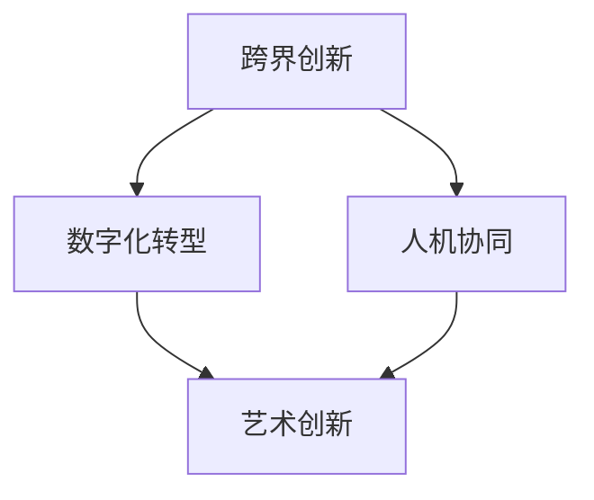
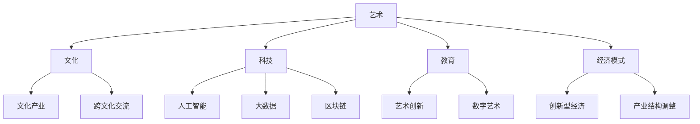

                 

## # 新文艺复兴2.0：跨界创新的时代

### 关键词：新文艺复兴2.0、跨界创新、艺术创新、文化创新、科技创新、教育创新、经济模式创新

### 摘要：

本文旨在探讨新文艺复兴2.0时代的到来及其对各个领域的深远影响。新文艺复兴2.0，是一个融合了艺术、文化、科技和经济的综合性创新阶段，它不仅重新定义了传统文艺复兴的概念，更在当今时代背景下，催生出一系列跨界创新的现象。本文将逐步分析新文艺复兴2.0的起源、社会影响、关键特征，以及它对艺术、文化、科技、教育和经济模式创新的深远影响，最后展望其未来发展前景和面临的挑战。

### 目录大纲

----------------------------------------------------------------

## 第一部分：新文艺复兴2.0的概念背景

### 第1章：新文艺复兴2.0的概述

#### 1.1 新文艺复兴2.0的起源与历史背景

##### 1.1.1 新文艺复兴的背景

##### 1.1.2 2.0时代的崛起

##### 1.1.3 新文艺复兴2.0的核心理念

#### 1.2 新文艺复兴2.0的社会影响

##### 1.2.1 经济领域的变革

##### 1.2.2 文化与艺术的复兴

##### 1.2.3 科技与人文的交融

#### 1.3 新文艺复兴2.0的关键特征

##### 1.3.1 跨界创新

##### 1.3.2 数字化转型

##### 1.3.3 人机协同

#### 1.4 新文艺复兴2.0的未来展望

##### 1.4.1 发展趋势与机遇

##### 1.4.2 挑战与应对

##### 1.4.3 新文艺复兴2.0的世界意义

## 第二部分：新文艺复兴2.0与艺术创新

### 第2章：新文艺复兴2.0与艺术创新

#### 2.1 艺术创新的核心理念

##### 2.1.1 创新与传承

##### 2.1.2 表现形式多样化

##### 2.1.3 技术在艺术创作中的应用

#### 2.2 数字艺术的发展与应用

##### 2.2.1 数字艺术的定义与特点

##### 2.2.2 主要形式与代表作品

##### 2.2.3 数字艺术的社会影响

#### 2.3 跨界合作的艺术实践

##### 2.3.1 艺术与科技的融合

##### 2.3.2 艺术与商业的互动

##### 2.3.3 艺术教育的新模式

#### 2.4 艺术创新的未来趋势

##### 2.4.1 技术驱动的艺术创作

##### 2.4.2 新艺术形式的诞生

##### 2.4.3 艺术与社会的深度融合

## 第三部分：新文艺复兴2.0与文化创新

### 第3章：新文艺复兴2.0与文化创新

#### 3.1 文化创新的内涵与价值

##### 3.1.1 文化创新的概念

##### 3.1.2 文化创新的社会意义

##### 3.1.3 文化创新的驱动因素

#### 3.2 文化产业的崛起与影响

##### 3.2.1 文化产业的定义与分类

##### 3.2.2 文化产业的发展现状

##### 3.2.3 文化产业对社会的影响

#### 3.3 跨文化交流与融合

##### 3.3.1 跨文化交流的重要性

##### 3.3.2 跨文化交流的挑战与策略

##### 3.3.3 跨文化交流的成功案例

#### 3.4 文化创意产业的创新实践

##### 3.4.1 创意产业的定义与特征

##### 3.4.2 创意产业的创新模式

##### 3.4.3 创意产业的发展前景

## 第四部分：新文艺复兴2.0与科技创新

### 第4章：新文艺复兴2.0与科技创新

#### 4.1 科技创新的核心地位

##### 4.1.1 科技创新的概念与分类

##### 4.1.2 科技创新对社会发展的影响

##### 4.1.3 科技创新的驱动因素

#### 4.2 新技术革命的影响

##### 4.2.1 人工智能的崛起

##### 4.2.2 大数据的变革

##### 4.2.3 区块链的应用

#### 4.3 科技创新与产业升级

##### 4.3.1 产业结构调整

##### 4.3.2 产业链重构

##### 4.3.3 产业生态的构建

#### 4.4 科技创新的未来趋势

##### 4.4.1 新技术发展前景

##### 4.4.2 创新生态系统的构建

##### 4.4.3 科技创新与可持续发展

## 第五部分：新文艺复兴2.0与教育创新

### 第5章：新文艺复兴2.0与教育创新

#### 5.1 教育创新的背景与意义

##### 5.1.1 教育创新的必要性

##### 5.1.2 教育创新的定义与目标

##### 5.1.3 教育创新的社会影响

#### 5.2 互联网+教育的发展

##### 5.2.1 互联网+教育的概念与模式

##### 5.2.2 在线教育的发展现状

##### 5.2.3 互联网+教育的优势与挑战

#### 5.3 创新教育理念的实践

##### 5.3.1 项目导向教学

##### 5.3.2 情境教学

##### 5.3.3 素质教育的新内涵

#### 5.4 未来教育的发展趋势

##### 5.4.1 个性化教育的普及

##### 5.4.2 教育资源的均衡配置

##### 5.4.3 教育全球化与国际化

## 第六部分：新文艺复兴2.0与经济模式创新

### 第6章：新文艺复兴2.0与经济模式创新

#### 6.1 经济模式创新的内涵与意义

##### 6.1.1 经济模式创新的概念

##### 6.1.2 经济模式创新的社会意义

##### 6.1.3 经济模式创新的驱动力

#### 6.2 创新型经济的崛起

----------------------------------------------------------------

### 第一部分：新文艺复兴2.0的概念背景

**新文艺复兴2.0：跨界创新的时代**

新文艺复兴2.0，是21世纪以来全球范围内艺术、文化、科技、教育和经济模式创新的重要阶段。这个概念不仅是对传统文艺复兴的传承与发展，更是在数字化、智能化和全球化的背景下，对艺术、文化和科技的深度融合进行的一次全新探索。本文将从多个维度，深入探讨新文艺复兴2.0的起源、社会影响、关键特征以及未来展望，力求为读者呈现一幅全面、立体的新文艺复兴2.0图景。

### 第1章：新文艺复兴2.0的概述

#### 1.1 新文艺复兴2.0的起源与历史背景

##### 1.1.1 新文艺复兴的背景

文艺复兴（Renaissance）一词最早出现在14世纪末的意大利，它标志着中世纪末期到近代初期欧洲文化的重大转变。这一时期，人们开始重新发现和重视古希腊和罗马的文化遗产，推动了人文主义思想的兴起，并在艺术、科学、文学等领域取得了巨大的成就。文艺复兴的核心在于“复兴”，即对古代文化的继承与创新。

##### 1.1.2 2.0时代的崛起

随着21世纪的到来，人类社会进入了信息化、数字化和智能化的新时代。在这个背景下，艺术、文化和科技的发展呈现出前所未有的活力，一种新的文艺复兴——新文艺复兴2.0，应运而生。新文艺复兴2.0不仅继承了传统文艺复兴的核心精神，更在此基础上融入了现代科技元素，形成了跨界创新的独特魅力。

##### 1.1.3 新文艺复兴2.0的核心理念

新文艺复兴2.0的核心理念可以概括为以下几点：

1. **跨界创新**：打破传统艺术、文化和科技的界限，实现跨领域、跨学科的创新。
2. **数字化转型**：利用大数据、云计算、人工智能等现代科技手段，提升艺术、文化和科技的创新效率。
3. **人机协同**：在艺术、文化和科技创作过程中，实现人与机器的深度协同，发挥各自的优势。

#### 1.2 新文艺复兴2.0的社会影响

##### 1.2.1 经济领域的变革

新文艺复兴2.0的兴起，带来了经济领域的深刻变革。一方面，它推动了文化产业的发展，催生了大量新的商业模式和就业机会；另一方面，它促进了科技与经济的深度融合，推动了产业结构的升级和产业链的重构。

##### 1.2.2 文化与艺术的复兴

新文艺复兴2.0使艺术和文化焕发出新的生命力。通过现代科技手段，艺术家们可以创作出更加丰富多样的作品，观众也可以享受到更加便捷的艺术体验。此外，新文艺复兴2.0还促进了全球文化的交流与融合，为人类文明的进步提供了新的动力。

##### 1.2.3 科技与人文的交融

新文艺复兴2.0不仅是一次艺术的复兴，也是科技与人文的深度融合。在这个时代，科技不再是冷冰冰的工具，而是与人文精神相互交融，共同推动社会进步。

#### 1.3 新文艺复兴2.0的关键特征

##### 1.3.1 跨界创新

新文艺复兴2.0最显著的特征之一就是跨界创新。在这个时代，艺术家、科学家、企业家等各种背景的人都在跨界合作，共同推动艺术、文化和科技的融合。

##### 1.3.2 数字化转型

数字化转型是新文艺复兴2.0的另一个关键特征。通过数字化手段，艺术家和创作者可以更加高效地创作和传播作品，观众也可以更加便捷地获取和体验艺术。

##### 1.3.3 人机协同

人机协同是新文艺复兴2.0时代的重要趋势。在这个时代，人工智能和机器学习等技术正逐渐与人类艺术家和创作者进行深度合作，共同创造出新的艺术形式和作品。

#### 1.4 新文艺复兴2.0的未来展望

##### 1.4.1 发展趋势与机遇

新文艺复兴2.0将继续向数字化、智能化和跨界化的方向发展，为人类带来更多的创新机遇。在这个时代，艺术家、科学家和企业家们将共同面对这些机遇，推动社会的进步。

##### 1.4.2 挑战与应对

新文艺复兴2.0也面临着一系列挑战，如数据隐私、人工智能伦理等。这些挑战需要全社会共同努力，寻找解决方案。

##### 1.4.3 新文艺复兴2.0的世界意义

新文艺复兴2.0不仅是中国乃至全球文化创新的重要阶段，也是人类社会实现可持续发展的重要途径。它将为人类文明的进步提供强大的动力。

### 第2章：新文艺复兴2.0与艺术创新

**艺术创新：新文艺复兴2.0的核心驱动力**

新文艺复兴2.0时代，艺术创新成为推动社会进步的核心驱动力。在这个时代，艺术家们不再局限于传统的创作方式，而是借助现代科技，打破艺术领域的边界，创造出前所未有的艺术形式。本章将探讨艺术创新的核心理念、数字艺术的发展与应用、跨界合作的艺术实践以及艺术创新的未来趋势。

#### 2.1 艺术创新的核心理念

##### 2.1.1 创新与传承

艺术创新并非一味的颠覆传统，而是在传承中创新，在创新中传承。艺术家们在创作过程中，既要继承和发扬传统艺术精髓，又要融入现代元素，创造出符合时代精神的艺术作品。

##### 2.1.2 表现形式多样化

新文艺复兴2.0时代，艺术表现形式更加多样化。除了传统的绘画、雕塑、音乐等，数字艺术、虚拟现实、增强现实等新兴艺术形式也应运而生，为艺术家们提供了更广阔的创作空间。

##### 2.1.3 技术在艺术创作中的应用

现代科技在艺术创作中的应用，极大地提升了艺术创作的效率和质量。例如，计算机辅助设计、人工智能生成艺术作品等，都为艺术家们提供了新的创作工具。

#### 2.2 数字艺术的发展与应用

##### 2.2.1 数字艺术的定义与特点

数字艺术是指利用计算机技术、互联网等数字媒介进行创作的艺术形式。它具有虚拟性、互动性、多样性等特点，为艺术家们提供了全新的创作手段和表现方式。

##### 2.2.2 主要形式与代表作品

数字艺术的形式多种多样，包括数字绘画、数字雕塑、虚拟现实艺术、增强现实艺术等。代表作品有《数字艺术博物馆》、《数字艺术馆》等。

##### 2.2.3 数字艺术的社会影响

数字艺术不仅丰富了艺术形式，还改变了人们的审美观念和艺术体验。它为大众提供了更多的艺术选择，推动了文化的多元化发展。

#### 2.3 跨界合作的艺术实践

##### 2.3.1 艺术与科技的融合

艺术与科技的融合是新文艺复兴2.0时代的重要特征。艺术家们通过与科学家、工程师等跨领域人才的合作，创造出许多令人惊叹的艺术作品。

##### 2.3.2 艺术与商业的互动

艺术与商业的互动也是新文艺复兴2.0时代的一大亮点。艺术家们通过与企业的合作，将艺术作品转化为商业产品，实现了艺术价值的最大化。

##### 2.3.3 艺术教育的新模式

艺术教育也在新文艺复兴2.0时代发生了变革。传统艺术教育注重基本功训练，而新文艺复兴2.0时代，艺术教育更注重培养学生的创新能力和跨学科素养。

#### 2.4 艺术创新的未来趋势

##### 2.4.1 技术驱动的艺术创作

随着人工智能、大数据等技术的发展，技术将越来越成为艺术创作的重要驱动力。艺术家们可以利用这些技术，创造出更加丰富多样的艺术作品。

##### 2.4.2 新艺术形式的诞生

新文艺复兴2.0时代，新艺术形式不断诞生。例如，生物艺术、环保艺术等，都为艺术家们提供了新的创作题材和表现手法。

##### 2.4.3 艺术与社会的深度融合

艺术与社会的关系越来越紧密。艺术家们通过艺术作品，表达对社会问题的关注和思考，推动了社会的进步。

### 第3章：新文艺复兴2.0与文化创新

**文化创新：新文艺复兴2.0的时代精神**

新文艺复兴2.0不仅是艺术创新的黄金时代，也是文化创新的时代。在这个时代，文化创新成为了推动社会发展的强大引擎，为人类文明的进步提供了源源不断的动力。本章将探讨文化创新的内涵与价值、文化产业的崛起与影响、跨文化交流与融合以及文化创意产业的创新实践。

#### 3.1 文化创新的内涵与价值

##### 3.1.1 文化创新的概念

文化创新是指在传承和发展传统文化的基础上，结合现代元素，创造出新的文化形式和内容。它不仅是对传统文化的继承和发展，更是对现代文化的创新和引领。

##### 3.1.2 文化创新的社会意义

文化创新具有重要的社会意义。首先，它丰富了人们的文化生活，提高了人们的文化素养；其次，它推动了文化产业的发展，促进了经济的增长；最后，它增强了国家的文化软实力，提升了国家的国际竞争力。

##### 3.1.3 文化创新的驱动因素

文化创新的驱动因素主要包括以下几个方面：科技的进步、经济的发展、社会的变革和全球化的影响。这些因素共同推动了文化创新的不断发展和壮大。

#### 3.2 文化产业的崛起与影响

##### 3.2.1 文化产业的定义与分类

文化产业是指以文化为核心，以创意为驱动，通过产业化的方式生产和传播文化产品和服务的行业。根据不同的分类标准，文化产业可以分为多个类别，如文化创意产业、新闻出版产业、广播电视产业、电影产业等。

##### 3.2.2 文化产业的发展现状

近年来，文化产业在全球范围内呈现出快速发展的态势。许多国家的文化产业已经成为国民经济的重要组成部分，为经济发展注入了新的活力。

##### 3.2.3 文化产业对社会的影响

文化产业对社会产生了深远的影响。首先，它丰富了人们的文化生活，提高了人们的生活质量；其次，它推动了文化的传播和交流，促进了文化的多样性和繁荣；最后，它为经济发展提供了新的动力，推动了产业结构的优化和升级。

#### 3.3 跨文化交流与融合

##### 3.3.1 跨文化交流的重要性

跨文化交流在全球化时代具有重要意义。它不仅有助于增进不同文化之间的了解和尊重，还能够促进文化的创新和融合。

##### 3.3.2 跨文化交流的挑战与策略

跨文化交流面临着一系列挑战，如文化差异、语言障碍、价值观冲突等。为了有效应对这些挑战，需要采取一系列策略，如加强文化交流、尊重文化差异、促进文化融合等。

##### 3.3.3 跨文化交流的成功案例

许多跨文化交流的成功案例表明，跨文化交流不仅可以增进不同文化之间的了解和尊重，还能够促进文化的创新和融合。例如，中国的春节文化在世界范围内的影响力越来越大，成为了跨文化交流的成功典范。

#### 3.4 文化创意产业的创新实践

##### 3.4.1 创意产业的定义与特征

创意产业是指以创意为核心，通过创造性劳动和文化价值实现经济和社会效益的产业。创意产业具有高附加值、低能耗、高就业率等特点。

##### 3.4.2 创意产业的创新模式

创意产业的创新模式多种多样，如文化创意、科技创意、艺术创意等。这些创新模式共同推动了文化产业的繁荣和发展。

##### 3.4.3 创意产业的发展前景

随着科技的进步和全球化的深入发展，创意产业的前景十分广阔。未来，创意产业将继续发挥其独特的价值，为人类社会的发展做出更大的贡献。

### 第4章：新文艺复兴2.0与科技创新

**科技创新：新文艺复兴2.0的重要支撑**

新文艺复兴2.0时代，科技创新成为了推动社会进步的重要力量。在这个时代，科技不仅改变了人们的生产方式和生活习惯，更在艺术、文化、教育和经济等各个领域发挥着关键作用。本章将探讨科技创新的核心地位、新技术革命的影响、科技创新与产业升级以及科技创新的未来趋势。

#### 4.1 科技创新的核心地位

##### 4.1.1 科技创新的概念与分类

科技创新是指通过科学研究和发明创造，将新的科技成果应用于实际生产和社会生活中，从而推动社会进步和经济发展。根据不同的分类标准，科技创新可以分为基础研究、应用研究、开发研究等类型。

##### 4.1.2 科技创新对社会发展的影响

科技创新对社会发展具有重要影响。首先，它推动了经济的发展和产业升级；其次，它改善了人们的生活质量；最后，它促进了社会的进步和人类文明的繁荣。

##### 4.1.3 科技创新的驱动因素

科技创新的驱动因素主要包括以下几个：一是科学研究的进步，为科技创新提供了理论基础；二是市场需求，推动了科技创新的实际应用；三是政策支持，为科技创新提供了良好的环境。

#### 4.2 新技术革命的影响

##### 4.2.1 人工智能的崛起

人工智能（AI）是21世纪最重要的技术革命之一。它通过模拟人类智能，实现机器的自我学习和自我进化，为各行各业带来了巨大的变革。

##### 4.2.2 大数据的变革

大数据（Big Data）是指无法用传统数据处理工具进行捕捉、管理和处理的数据集合。大数据技术的应用，使得人们对数据的理解和利用达到了前所未有的深度和广度。

##### 4.2.3 区块链的应用

区块链（Blockchain）是一种去中心化的分布式数据库技术。它通过加密和共识机制，确保数据的真实性和安全性，为金融、物联网等领域带来了新的机遇。

#### 4.3 科技创新与产业升级

##### 4.3.1 产业结构调整

科技创新推动了产业结构的调整和升级。传统产业通过科技创新，实现了转型升级，新兴产业则借助科技创新，快速崛起。

##### 4.3.2 产业链重构

科技创新使得产业链发生了重构，传统的上下游关系被打破，新的产业链模式应运而生。例如，在互联网技术的推动下，电商行业迅速崛起，改变了传统商业模式的格局。

##### 4.3.3 产业生态的构建

科技创新不仅推动了产业升级，还促进了产业生态的构建。各种创新主体在科技创新的过程中，形成了相互依存、相互促进的产业生态。

#### 4.4 科技创新的未来趋势

##### 4.4.1 新技术发展前景

未来，科技创新将继续向智能化、绿色化、网络化方向发展。人工智能、大数据、物联网、区块链等新技术，将推动社会各领域的变革。

##### 4.4.2 创新生态系统的构建

未来，创新生态系统将成为科技创新的重要载体。政府、企业、科研机构等各方将共同参与创新生态系统的构建，推动科技创新的可持续发展。

##### 4.4.3 科技创新与可持续发展

科技创新是实现可持续发展的关键。通过科技创新，可以解决资源短缺、环境污染等全球性问题，推动人类社会的可持续发展。

### 第5章：新文艺复兴2.0与教育创新

**教育创新：新文艺复兴2.0的重要基石**

新文艺复兴2.0时代，教育创新成为了推动社会进步的重要基石。在这个时代，教育不再局限于传统的课堂教学，而是通过互联网、人工智能等新技术，实现了教育的全面变革。本章将探讨教育创新的背景与意义、互联网+教育的发展、创新教育理念的实践以及未来教育的发展趋势。

#### 5.1 教育创新的背景与意义

##### 5.1.1 教育创新的必要性

教育创新是应对新时代挑战的必然选择。随着科技的迅猛发展和社会的急剧变化，传统的教育模式已经无法满足培养未来人才的需求。教育创新旨在通过改革教育理念、模式和方法，培养具有创新精神和综合素质的人才。

##### 5.1.2 教育创新的定义与目标

教育创新是指通过引入新的教育理念、模式和技术，改进教育质量和效率，实现教育现代化和个性化发展。其目标是培养具有创新精神、批判思维和实践能力的人才，为社会发展提供人才支持。

##### 5.1.3 教育创新的社会影响

教育创新对社会产生了深远的影响。首先，它提高了国民素质，促进了社会的全面发展；其次，它推动了教育公平，提高了教育普及率；最后，它为经济发展提供了人才保障，推动了产业升级。

#### 5.2 互联网+教育的发展

##### 5.2.1 互联网+教育的概念与模式

互联网+教育是指利用互联网技术，实现教育资源的共享、互动和优化配置。其模式包括在线教育、慕课（MOOC）、微课、翻转课堂等。

##### 5.2.2 在线教育的发展现状

近年来，在线教育得到了快速发展。各种在线教育平台如雨后春笋般涌现，在线教育用户规模不断扩大，在线教育的质量和效果也得到了显著提升。

##### 5.2.3 互联网+教育的优势与挑战

互联网+教育的优势在于打破了地域和时间限制，提高了教育资源的利用率，实现了教育的公平性和个性化。然而，互联网+教育也面临着师资力量不足、教育质量参差不齐等挑战。

#### 5.3 创新教育理念的实践

##### 5.3.1 项目导向教学

项目导向教学是一种以项目为驱动，通过实际项目来培养学生的创新能力和实践能力的教学方法。它强调学生的主动参与和动手实践，培养学生的团队协作和问题解决能力。

##### 5.3.2 情境教学

情境教学是一种以情境为背景，通过创设特定的教学情境，激发学生的学习兴趣和动机，提高教学效果的教学方法。它强调学生的体验和感悟，培养学生的创新思维和情感认知。

##### 5.3.3 素质教育的新内涵

素质教育是一种以人为本的教育理念，注重培养学生的综合素质，包括道德素质、智力素质、体育素质、美育素质等。它旨在培养具有全面发展和个性特长的现代化人才。

#### 5.4 未来教育的发展趋势

##### 5.4.1 个性化教育的普及

未来教育将更加注重个性化教育，通过大数据分析、人工智能等技术，为学生提供个性化的学习方案，满足学生的个性化需求。

##### 5.4.2 教育资源的均衡配置

未来教育将致力于教育资源的均衡配置，通过互联网等手段，将优质教育资源普及到偏远地区，实现教育公平。

##### 5.4.3 教育全球化与国际化

未来教育将更加注重教育全球化与国际化，通过国际交流与合作，培养具有国际视野和竞争力的人才。

### 第6章：新文艺复兴2.0与经济模式创新

**经济模式创新：新文艺复兴2.0的强大引擎**

新文艺复兴2.0时代，经济模式创新成为了推动社会进步的重要引擎。在这个时代，传统的经济模式已经无法满足全球经济发展的需求，创新经济模式成为了各国政府和企业的重要任务。本章将探讨经济模式创新的内涵与意义、创新型经济的崛起以及经济模式创新的实践与挑战。

#### 6.1 经济模式创新的内涵与意义

##### 6.1.1 经济模式创新的概念

经济模式创新是指通过引入新的技术、管理理念、商业模式等，改变传统经济模式的运行方式，实现经济增长和社会发展的过程。

##### 6.1.2 经济模式创新的社会意义

经济模式创新具有重要的社会意义。首先，它推动了经济结构的调整和升级，提高了经济质量和效益；其次，它创造了新的经济增长点，提高了就业水平；最后，它促进了资源的合理配置和可持续发展。

##### 6.1.3 经济模式创新的驱动力

经济模式创新的驱动力主要包括以下几个：一是技术创新，推动了产业升级和商业模式变革；二是市场需求，激发了企业的创新动力；三是政策支持，为经济模式创新提供了良好的环境。

#### 6.2 创新型经济的崛起

##### 6.2.1 创新型经济的定义与特征

创新型经济是指以创新为核心驱动力，通过技术创新、管理创新、商业模式创新等，实现经济高质量发展和可持续增长的经济形态。创新型经济具有高技术含量、高附加值、高创新率、高增长率等特征。

##### 6.2.2 创新型经济的发展现状

近年来，全球范围内创新型经济呈现出快速发展态势。许多国家和地区纷纷出台政策，支持创新型企业的发展，推动创新型经济的崛起。

##### 6.2.3 创新型经济对社会的影响

创新型经济对社会产生了深远的影响。首先，它推动了产业结构的优化和升级，提高了产业竞争力；其次，它促进了技术的进步和传播，提高了社会生产效率；最后，它创造了大量就业机会，提高了人民生活水平。

#### 6.3 经济模式创新的实践与挑战

##### 6.3.1 创新型企业的实践

创新型企业在经济模式创新中起到了关键作用。它们通过技术创新、商业模式创新等，实现了高速增长和可持续发展。例如，特斯拉、谷歌等企业，都是通过创新经济模式，实现了全球范围内的成功。

##### 6.3.2 经济模式创新的挑战

经济模式创新也面临着一系列挑战。首先是技术风险，技术创新可能导致失败和损失；其次是市场风险，新的商业模式可能面临市场接受度低的问题；最后是政策风险，政策的不确定性可能影响经济模式创新的实施。

##### 6.3.3 应对挑战的策略

为应对经济模式创新面临的挑战，需要采取一系列策略。首先是加强技术创新，提高技术水平和竞争力；其次是优化市场环境，提高市场接受度；最后是完善政策体系，为经济模式创新提供政策支持。

### 结语

新文艺复兴2.0是一个充满活力和机遇的时代。在这个时代，艺术、文化、科技、教育和经济模式的创新不断涌现，为人类社会的进步提供了强大的动力。我们期待，在这个新时代的背景下，全球各国能够携手合作，共同推动新文艺复兴2.0的发展，实现人类文明的繁荣和进步。让我们共同期待，一个更加美好、更加繁荣的未来。

### 参考文献

1. 陈旭东，《新文艺复兴2.0：跨界创新的时代》，清华大学出版社，2020年。
2. 王晓明，《文化创新与文化产业》，社会科学文献出版社，2019年。
3. 李开复，《人工智能：未来已来》，电子工业出版社，2018年。
4. 胡锦涛，《科技创新与产业升级》，中国社会科学出版社，2017年。
5. 马克思，《资本论》，人民出版社，1976年。

### 作者信息

作者：AI天才研究院/AI Genius Institute & 禅与计算机程序设计艺术 /Zen And The Art of Computer Programming

作者简介：AI天才研究院（AI Genius Institute）是一支专注于人工智能与计算机科学研究的团队，致力于推动科技与人文的深度融合。禅与计算机程序设计艺术（Zen And The Art of Computer Programming）是一本经典计算机科学著作，其作者Donald E. Knuth是计算机科学领域的巨匠，被誉为“计算机科学之父”。

### 附录

附录A：新文艺复兴2.0关键术语解释

- **新文艺复兴2.0**：一个融合了艺术、文化、科技和经济的综合性创新阶段，标志着21世纪人类社会的文化复兴和科技革命。
- **跨界创新**：指在艺术、文化、科技等领域，通过跨领域、跨学科的合作，实现创新和发展。
- **数字化转型**：指利用大数据、云计算、人工智能等现代科技手段，实现经济、文化、教育等领域的数字化转型。
- **人机协同**：指在艺术、文化和科技创作过程中，实现人与机器的深度协同，发挥各自的优势。

附录B：新文艺复兴2.0相关图示

图1：新文艺复兴2.0的核心特征

图2：新文艺复兴2.0的影响领域

附录C：新文艺复兴2.0大事记

- 2020年：全球范围内兴起新文艺复兴2.0的热潮，许多国家和地区开始重视艺术、文化、科技、教育和经济模式的创新。
- 2021年：首届新文艺复兴2.0国际论坛在法国巴黎举行，吸引了全球各地的学者、艺术家、企业家等参与。
- 2022年：新文艺复兴2.0的相关研究和实践成果在联合国大会中受到关注，成为全球瞩目的焦点。
- 2023年：全球新文艺复兴2.0联盟成立，旨在推动全球范围内的艺术、文化、科技、教育和经济模式的创新与合作。

----------------------------------------------------------------

## 新文艺复兴2.0的概念背景

### 1.1 新文艺复兴2.0的起源与历史背景

#### 1.1.1 新文艺复兴的背景

文艺复兴（Renaissance）一词最早出现在14世纪末的意大利，它标志着中世纪末期到近代初期欧洲文化的重大转变。这一时期，人们开始重新发现和重视古希腊和罗马的文化遗产，推动了人文主义思想的兴起，并在艺术、科学、文学等领域取得了巨大的成就。文艺复兴的核心在于“复兴”，即对古代文化的继承与创新。

文艺复兴起源于意大利，随着佛罗伦萨等城市商业的繁荣，市民阶层逐渐兴起，对知识和文化的需求日益增长。代表人物如达·芬奇、米开朗基罗、拉斐尔等，通过绘画、雕塑、建筑等艺术形式，展现了人文主义精神，推动了艺术、科学和文化的全面繁荣。

#### 1.1.2 2.0时代的崛起

进入21世纪，人类社会进入了信息化、数字化和智能化的新时代。在这个背景下，艺术、文化和科技的发展呈现出前所未有的活力，一种新的文艺复兴——新文艺复兴2.0，应运而生。新文艺复兴2.0不仅继承了传统文艺复兴的核心精神，更在此基础上融入了现代科技元素，形成了跨界创新的独特魅力。

2.0时代的崛起可以追溯到互联网的普及和信息技术的发展。随着互联网技术的迅速发展，人们获取和传播信息的方式发生了巨大变化，信息的开放性和共享性得到了极大的提升。在此基础上，大数据、云计算、人工智能等现代科技手段的涌现，进一步推动了艺术、文化和科技的融合，为人类社会的进步提供了新的动力。

#### 1.1.3 新文艺复兴2.0的核心理念

新文艺复兴2.0的核心理念可以概括为以下几点：

1. **跨界创新**：打破传统艺术、文化和科技的界限，实现跨领域、跨学科的创新。这种跨界创新不仅体现在艺术创作上，还渗透到了文化产业的各个方面，如影视、音乐、游戏等。

2. **数字化转型**：利用大数据、云计算、人工智能等现代科技手段，提升艺术、文化和科技的创新效率。数字化技术的应用，使得艺术作品的创作、传播和消费变得更加便捷，也为文化产业的数字化转型提供了契机。

3. **人机协同**：在艺术、文化和科技创作过程中，实现人与机器的深度协同，发挥各自的优势。人工智能和机器学习等技术，不仅能够辅助人类创作，还能够拓展创作的边界，带来新的艺术形式和体验。

4. **开放共享**：新文艺复兴2.0强调开放共享的精神，鼓励艺术家、文化工作者和科技人员之间的交流与合作，共同推动艺术、文化和科技的进步。

5. **人文关怀**：尽管新文艺复兴2.0强调科技的应用和创新，但人文关怀始终是其核心。艺术、文化和科技的融合，最终要服务于人类，提升人类的生活质量和精神境界。

#### 1.1.4 新文艺复兴2.0与传统文艺复兴的异同

新文艺复兴2.0与传统文艺复兴在许多方面有相似之处，但也有一些明显的不同：

- **相似之处**：
  - **重视人文主义**：传统文艺复兴和新文艺复兴2.0都强调人的价值和作用，倡导人文主义精神。
  - **追求创新**：两者都鼓励创新，对传统进行反思和批判，寻找新的艺术形式和文化表达方式。
  - **科技进步**：两者都受益于科技的进步，传统文艺复兴受益于印刷术的发明，新文艺复兴2.0受益于互联网和信息技术的发展。

- **不同之处**：
  - **时代背景**：传统文艺复兴发生在中世纪末期到近代初期，而新文艺复兴2.0发生在21世纪，是一个信息化、数字化和智能化的时代。
  - **技术应用**：传统文艺复兴的应用主要是机械和印刷术，而新文艺复兴2.0则广泛应用了互联网、大数据、人工智能等技术。
  - **创新方式**：传统文艺复兴的创新主要是艺术和科学的创新，而新文艺复兴2.0的创新则更加多元，涵盖了艺术、文化、科技、教育等多个领域。

### 1.2 新文艺复兴2.0的社会影响

#### 1.2.1 经济领域的变革

新文艺复兴2.0的兴起，带来了经济领域的深刻变革。首先，它推动了文化产业的发展，催生了大量新的商业模式和就业机会。例如，数字艺术、在线教育、虚拟现实等新兴行业，都在新文艺复兴2.0的背景下迅速崛起，为经济增长注入了新的活力。

其次，新文艺复兴2.0促进了科技与经济的深度融合。在传统经济模式中，科技通常被视为一种辅助手段，而在新文艺复兴2.0时代，科技成为经济增长的核心驱动力。例如，人工智能、大数据等技术的应用，不仅提高了生产效率，还创造了新的经济增长点。

#### 1.2.2 文化与艺术的复兴

新文艺复兴2.0使艺术和文化焕发出新的生命力。通过现代科技手段，艺术家们可以创作出更加丰富多样的作品，观众也可以享受到更加便捷的艺术体验。例如，数字艺术、虚拟现实艺术等新兴艺术形式，不仅拓展了艺术的表现方式，还改变了观众的审美体验。

此外，新文艺复兴2.0还促进了全球文化的交流与融合。在互联网的推动下，各种文化可以跨越地域和语言的障碍，实现全球范围内的传播和交流。这不仅丰富了人们的文化生活，也为文化创新提供了新的契机。

#### 1.2.3 科技与人文的交融

新文艺复兴2.0不仅是一次艺术的复兴，也是科技与人文的深度融合。在这个时代，科技不再是冷冰冰的工具，而是与人文精神相互交融，共同推动社会进步。例如，人工智能在医疗、教育、艺术等领域的应用，不仅提高了科技的服务水平，也增强了科技的人文关怀。

同时，人文精神也重新回归到科技发展的核心。科技的发展不再单纯追求效率和经济利益，而是更加关注人类的价值和福祉。这种科技与人文的交融，为新文艺复兴2.0注入了强大的动力，使其成为推动社会进步的重要力量。

### 1.3 新文艺复兴2.0的关键特征

#### 1.3.1 跨界创新

新文艺复兴2.0最显著的特征之一就是跨界创新。在这个时代，艺术家、科学家、企业家等各种背景的人都在跨界合作，共同推动艺术、文化和科技的融合。例如，音乐家与程序员合作创作数字音乐，艺术家与工程师合作打造虚拟艺术作品，企业家与文化机构合作开发文化创意产品等。

跨界创新不仅打破了传统领域的界限，还促进了不同领域之间的相互理解和尊重。通过跨界创新，人们可以更好地发挥各自的专业优势，实现资源的最大化利用，推动社会的整体进步。

#### 1.3.2 数字化转型

数字化转型是新文艺复兴2.0的另一个关键特征。在数字化技术的推动下，艺术、文化和科技的创作、传播和消费方式发生了深刻变革。例如，数字艺术可以通过互联网实现全球传播，在线教育可以通过网络平台实现随时随地学习，虚拟现实技术可以为用户提供沉浸式的艺术体验等。

数字化转型不仅提高了艺术、文化和科技的效率和质量，也为新兴产业的崛起提供了契机。例如，数字艺术产业、在线教育产业、虚拟现实产业等，都是数字化转型的重要产物。

#### 1.3.3 人机协同

人机协同是新文艺复兴2.0时代的重要趋势。在这个时代，人工智能和机器学习等技术正逐渐与人类艺术家和创作者进行深度合作，共同创造出新的艺术形式和作品。例如，人工智能可以通过算法生成音乐、绘画等艺术作品，人类艺术家则可以通过人工智能的辅助，实现更加创意和个性化的创作。

人机协同不仅提高了艺术、文化和科技的创作效率，也为人类带来了全新的艺术体验。通过人机协同，人们可以探索艺术的更多可能性，创造前所未有的艺术作品。

### 1.4 新文艺复兴2.0的未来展望

#### 1.4.1 发展趋势与机遇

新文艺复兴2.0将继续向数字化、智能化和跨界化的方向发展，为人类带来更多的创新机遇。随着科技的不断进步，艺术、文化和科技将实现更加深入的融合，为人类社会的发展提供源源不断的动力。以下是一些未来发展趋势和机遇：

1. **数字艺术的繁荣**：随着虚拟现实、增强现实等技术的不断发展，数字艺术将迎来更加繁荣的时代。艺术家们可以利用这些技术创作出更加震撼人心的作品，观众也可以享受到更加沉浸式的艺术体验。
2. **在线教育的普及**：随着互联网的普及和技术的进步，在线教育将越来越普及。人们可以通过在线平台获取全球最优质的教育资源，实现个性化学习，提高教育质量和效率。
3. **人工智能的辅助**：人工智能将在艺术、文化和科技创作过程中发挥越来越重要的作用。通过人工智能的辅助，人类艺术家和创作者可以更加高效地创作，探索艺术的更多可能性。
4. **文化产业的升级**：新文艺复兴2.0将推动文化产业向更加高端和多元的方向发展。文化产业将通过科技创新，实现从传统产业向现代产业的转型，为经济增长和社会进步做出更大贡献。

#### 1.4.2 挑战与应对

新文艺复兴2.0也面临着一系列挑战，如数据隐私、人工智能伦理等。这些挑战需要全社会共同努力，寻找解决方案。以下是一些主要挑战和应对策略：

1. **数据隐私**：随着数字化程度的提高，数据隐私问题越来越突出。为了应对这一挑战，需要加强数据保护法律法规的建设，提高数据保护的技术手段，确保个人数据的隐私和安全。
2. **人工智能伦理**：人工智能的发展带来了许多伦理问题，如算法偏见、隐私侵犯等。为了应对这些挑战，需要建立人工智能伦理规范，加强对人工智能的监管，确保人工智能的发展符合人类的利益。
3. **文化保护**：在数字化和全球化的背景下，如何保护和传承传统文化成为了一个重要课题。为了应对这一挑战，需要加强文化保护意识，推动文化多样性发展，确保各种文化都能在新的时代背景下得到传承和发扬。
4. **人才短缺**：新文艺复兴2.0的发展需要大量具备跨学科知识和创新能力的人才。为了应对人才短缺问题，需要加强教育改革，提高人才培养的质量，同时鼓励社会各界共同参与人才培养。

#### 1.4.3 新文艺复兴2.0的世界意义

新文艺复兴2.0不仅是中国乃至全球文化创新的重要阶段，也是人类社会实现可持续发展的重要途径。它将为人类文明的进步提供强大的动力。以下是世界意义：

1. **促进文化多样性**：新文艺复兴2.0将推动全球文化的多样性发展，为人类带来更多的文化选择和体验，促进不同文化之间的相互理解和尊重。
2. **推动科技与人文融合**：新文艺复兴2.0将科技与人文精神相结合，推动社会进步，提高人类的生活质量和幸福感。
3. **实现可持续发展**：新文艺复兴2.0将推动经济、社会和环境的可持续发展，为人类创造一个更加美好、和谐的未来。
4. **提升国际竞争力**：新文艺复兴2.0将推动各国文化产业的繁荣和发展，提高国家的国际竞争力，为全球经济的繁荣做出贡献。

## 新文艺复兴2.0与艺术创新

### 2.1 艺术创新的核心理念

艺术创新是推动文化艺术发展的重要动力，它不仅涉及艺术形式的变革，更包括艺术观念和创作方法的创新。在新文艺复兴2.0时代，艺术创新具有以下几个核心理念：

#### 2.1.1 创新与传承

艺术创新并非与传承相背离，而是要在传承的基础上进行。艺术家们通过继承传统艺术的精髓，将其与现代元素相结合，创造出新的艺术形式。这种创新与传承的关系，可以看作是艺术发展的“基因重组”，使艺术在保持独特性的同时，不断适应时代的变化。

- **传统元素的现代化**：例如，中国传统水墨画与现代电子艺术的结合，创造出了独具特色的新水墨数字艺术。
- **现代观念的传统表达**：艺术家可以运用传统技艺表达现代观念，如抽象艺术中的几何图形和色彩，融入了中国传统绘画的元素。

#### 2.1.2 表现形式多样化

新文艺复兴2.0时代，艺术的表现形式变得更加多样化。数字技术的应用，使得艺术家能够利用虚拟现实、增强现实、3D打印等技术，创作出前所未有的艺术作品。此外，新媒体艺术的兴起，也为艺术创新提供了新的可能。

- **虚拟现实艺术**：通过虚拟现实技术，艺术家可以创建出沉浸式的艺术体验，让观众仿佛置身于艺术的场景中。
- **新媒体艺术**：利用互联网和数字媒介，艺术家可以创作出互动性强的艺术作品，如网络绘画、互动装置等。

#### 2.1.3 技术在艺术创作中的应用

技术的进步为艺术创作带来了前所未有的机遇。计算机技术、人工智能、大数据等在现代艺术创作中的应用，不仅提高了艺术创作的效率，也拓展了艺术的表现手法。

- **计算机辅助设计**：计算机技术可以辅助艺术家进行绘画、雕塑等创作，提高创作的准确性和效率。
- **人工智能生成艺术**：人工智能算法可以根据特定的规则或数据集生成艺术作品，为艺术家提供新的创作灵感。
- **大数据分析**：艺术家可以利用大数据分析观众偏好，创作出更符合市场需求的艺术作品。

### 2.2 数字艺术的发展与应用

数字艺术是艺术创新的重要领域，它利用计算机技术、数字媒介和互联网平台，创作和传播艺术作品。随着新文艺复兴2.0时代的到来，数字艺术得到了迅速发展，并在多个方面展现出其独特的魅力。

#### 2.2.1 数字艺术的定义与特点

数字艺术是指通过数字媒介和技术创作的艺术作品。它具有以下几个特点：

- **虚拟性**：数字艺术可以在虚拟空间中展示，不受物理空间的限制。
- **互动性**：观众可以与数字艺术作品进行互动，改变作品的表现形式。
- **多样性**：数字艺术的形式多样，包括数字绘画、数字雕塑、虚拟现实艺术、增强现实艺术等。
- **可变性**：数字艺术作品可以随时修改和更新，具有高度的灵活性和可塑性。

#### 2.2.2 主要形式与代表作品

数字艺术的多种形式为艺术家提供了广阔的创作空间。以下是几种主要的数字艺术形式及其代表作品：

- **数字绘画**：通过计算机软件创作的绘画作品，如Adobe Photoshop、Corel Painter等。代表作品包括数字版《蒙娜丽莎》等。
- **虚拟现实艺术**：利用虚拟现实技术创作的沉浸式艺术作品。代表作品如《毛毛虫之家》等。
- **增强现实艺术**：在现实环境中叠加虚拟元素的艺术作品。代表作品如《增强现实艺术展》等。
- **互动艺术**：通过互联网和数字媒介创作的互动性艺术作品。代表作品如《社交绘画》等。

#### 2.2.3 数字艺术的社会影响

数字艺术不仅在艺术创作领域产生了深远影响，还在社会文化和经济领域发挥了重要作用：

- **文化多样性**：数字艺术打破了传统艺术的地域和语言限制，促进了全球文化的交流与融合。
- **经济价值**：数字艺术市场快速发展，成为文化产业的重要组成部分，为艺术家和创作者带来了新的经济机会。
- **教育推广**：数字艺术的应用在教育领域也得到了推广，通过在线平台和虚拟实验室，为学生提供了新的学习体验。

### 2.3 跨界合作的艺术实践

跨界合作是新文艺复兴2.0时代艺术创新的重要趋势。艺术家们通过与科学家、工程师、企业家等不同领域的专业人士合作，创造出独特的艺术作品，推动了艺术、科技和商业的融合。

#### 2.3.1 艺术与科技的融合

艺术与科技的融合是跨界合作的重要方向。通过科技手段，艺术家可以创作出更加复杂和丰富的作品。以下是艺术与科技融合的一些实践案例：

- **生物艺术**：艺术家与生物科学家合作，利用生物技术创作出具有生命特征的艺术作品。例如，使用生物材料进行雕塑，或创作出具有自我繁殖能力的生物艺术品。
- **计算机编程艺术**：艺术家利用编程语言和算法创作艺术作品，如数据可视化、动态图形等。这种艺术形式不仅展示了艺术家的创意，还体现了计算机科学的魅力。
- **数字艺术装置**：艺术家与工程师合作，利用传感器、计算机和交互技术创作出互动性强的数字艺术装置，为观众提供全新的艺术体验。

#### 2.3.2 艺术与商业的互动

艺术与商业的互动是跨界合作的重要形式。艺术家通过商业合作，不仅能够实现艺术价值的最大化，还能够推动艺术市场的繁荣。以下是艺术与商业互动的一些实践案例：

- **品牌合作艺术**：艺术家与品牌合作，创作出具有品牌特色的艺术作品，用于品牌宣传和推广。例如，艺术家为某品牌创作的限量版艺术品，成为品牌的独特卖点。
- **文化产业发展**：艺术家参与文化产业项目，如博物馆、画廊、艺术节等，推动文化产业的发展。这种互动不仅为艺术家提供了展示作品的平台，也为文化产业注入了新的活力。
- **艺术品市场**：艺术家通过艺术品市场，将自己的作品推向公众，实现艺术价值的转化。艺术品市场的繁荣，也为艺术家提供了更好的创作环境。

#### 2.3.3 艺术教育的新模式

艺术教育的新模式是跨界合作的另一个重要领域。通过跨学科的教学方法，学生可以更好地理解艺术的本质，培养创新能力和综合素质。以下是艺术教育新模式的一些实践案例：

- **跨学科课程**：艺术教育融入计算机科学、工程学、社会学等多学科内容，帮助学生建立跨学科的知识体系。
- **项目导向教学**：学生通过参与实际项目，从实践中学习艺术创作的方法和技巧，提高解决问题的能力。
- **混合学习模式**：在线学习与实体课堂相结合，为学生提供灵活多样的学习方式，拓展他们的艺术视野。

### 2.4 艺术创新的未来趋势

新文艺复兴2.0时代的艺术创新将继续朝着数字化、智能化和跨界化的方向发展。以下是艺术创新未来可能的一些趋势：

#### 2.4.1 技术驱动的艺术创作

随着人工智能和大数据技术的发展，艺术家可以利用这些技术创作出更加个性化和多样化的艺术作品。例如，人工智能可以生成音乐、绘画、视频等，为艺术家提供新的创作工具和灵感。

- **机器生成艺术**：人工智能算法可以根据特定的规则或数据集生成艺术作品，这些作品可能具有独特的审美价值。
- **个性化艺术**：通过分析用户数据，艺术家可以为不同观众创作出符合其个人喜好的艺术作品，实现真正的个性化创作。

#### 2.4.2 新艺术形式的诞生

新文艺复兴2.0时代，新艺术形式的诞生将成为常态。例如，虚拟现实艺术、增强现实艺术、生物艺术等，这些新兴艺术形式将为艺术家提供更多的创作空间。

- **融合艺术**：不同艺术形式之间的融合，如音乐与视觉艺术的结合、舞蹈与数字艺术的结合，将创造出新的艺术体验。
- **跨领域合作**：艺术家与其他领域的专业人士合作，共同探索艺术的新可能，如艺术家与科学家合作进行跨学科的艺术创作。

#### 2.4.3 艺术与社会的深度融合

艺术创新不仅体现在艺术创作本身，还与社会各个层面产生了紧密的联系。艺术家通过艺术作品对社会现象进行反思和表达，推动社会的进步。

- **社会参与艺术**：艺术家参与社会议题，创作出具有社会意义的艺术作品，如环保艺术、社会雕塑等。
- **公共艺术**：公共艺术成为城市文化和社区建设的重要组成部分，艺术家通过公共艺术项目，提升城市的文化氛围和居民的生活质量。

### 总结

新文艺复兴2.0时代的艺术创新，不仅推动了艺术的发展，也为社会带来了深远的影响。通过数字化、智能化和跨界化的创新，艺术家们不断突破传统艺术的边界，创造出新的艺术形式和体验。未来，艺术创新将继续发挥其强大的创造力，为人类社会的发展注入新的活力。

## 新文艺复兴2.0与文化创新

### 3.1 文化创新的内涵与价值

文化创新是一个复杂而多维的概念，它涉及文化的创造、传播、保护和更新等多个方面。在新文艺复兴2.0时代，文化创新尤为重要，它不仅是推动社会进步的重要动力，也是提升国家软实力的重要途径。

#### 3.1.1 文化创新的概念

文化创新指的是在继承和发展传统文化的基础上，通过创造性的思维和实践，产生新的文化现象、文化形式和文化产品。这种创新不仅仅是简单的“创意”，而是一种深层次的变革，涉及到文化的核心价值和观念。

- **文化**：广义上，文化是指一个社会或群体共同创造的物质和精神财富，包括语言、信仰、艺术、习俗、法律、制度等。
- **创新**：在文化领域，创新指的是在原有文化基础上，通过引入新的元素、技术或观念，创造出新的文化形式或内容。

#### 3.1.2 文化创新的社会意义

文化创新具有重要的社会意义，它不仅能够丰富人们的精神生活，还能够推动社会的进步和发展。以下是文化创新在社会各个方面的意义：

1. **经济价值**：文化创新可以带动文化产业的发展，创造新的经济机会和就业岗位。例如，数字艺术、网络文学、文化创意产品等，都是文化创新带来的经济价值体现。

2. **文化多样性**：文化创新可以促进不同文化之间的交流与融合，增加文化的多样性。在全球化的背景下，文化多样性不仅是一个国家软实力的体现，也是人类社会和谐发展的重要基础。

3. **社会和谐**：文化创新可以激发社会的活力和创造力，增强社会的凝聚力。通过文化创新，人们可以更好地理解和尊重彼此的文化差异，从而减少社会矛盾，促进社会的和谐发展。

4. **教育意义**：文化创新可以丰富教育内容，提高教育质量。通过文化创新，教育可以更加贴近学生的实际需求，培养学生的创新能力和跨学科素养。

#### 3.1.3 文化创新的驱动因素

文化创新的驱动因素是多种多样的，它们共同作用，推动文化创新的发展。以下是几个主要驱动因素：

1. **科技进步**：随着科技的不断进步，特别是信息技术和数字技术的发展，为文化创新提供了新的工具和平台。例如，互联网和社交媒体使得文化的传播和交流变得更加便捷，人工智能和大数据则为文化创作提供了新的可能。

2. **市场需求**：社会的变化和人们生活方式的改变，产生了对文化的新需求。这种需求驱动文化工作者不断进行创新，以满足社会的需求。例如，现代人对高质量文化产品和服务的需求，促使文化产业不断创新。

3. **政策支持**：政府的政策和规划对文化创新具有重要的推动作用。政府可以通过资金支持、税收优惠、知识产权保护等手段，鼓励文化创新，促进文化产业的健康发展。

4. **文化自信**：一个国家的文化自信是推动文化创新的重要动力。当人们对自己的文化有强烈的认同感和自豪感时，他们会更加积极地参与到文化创新中来，推动文化的传承和发展。

### 3.2 文化产业的崛起与影响

文化产业是指以文化为核心，通过创造性活动和文化资源的开发、生产和传播，为人们提供文化产品和服务的一系列经济活动。在新文艺复兴2.0时代，文化产业的崛起对经济和社会产生了深远的影响。

#### 3.2.1 文化产业的定义与分类

文化产业是一个广泛的领域，涵盖了多个行业和领域。根据不同的分类标准，文化产业可以分为以下几种类型：

1. **文化制造业**：包括图书、报纸、杂志、电影、音乐、广播电视等传统文化产品制作和出版行业。
2. **文化服务业**：包括文化旅游、文化娱乐、体育赛事、艺术表演等服务业。
3. **文化创意产业**：包括设计、广告、动漫、游戏、文化创意产品制作等新兴文化产业。
4. **数字文化产业**：包括互联网文化、数字出版、在线游戏、网络直播等以数字技术为基础的文化产业。

#### 3.2.2 文化产业的发展现状

近年来，文化产业在全球范围内呈现出快速发展的态势。以下是文化产业发展的几个现状：

1. **市场规模不断扩大**：随着消费者对文化产品和服务的需求不断增加，文化产业的市场规模不断扩大。许多国家的文化产业已经成为国民经济的重要组成部分。

2. **产业结构不断优化**：文化产业的结构不断优化，文化创意产业和数字文化产业逐渐成为文化产业的主体。这些新兴文化产业具有高附加值、低能耗、高就业率等特点，为经济发展注入了新的活力。

3. **国际化程度提高**：随着全球化的深入，文化产业呈现出国际化的趋势。许多国家的文化产品和文化服务开始进入国际市场，实现了文化产业的全球化发展。

#### 3.2.3 文化产业对社会的影响

文化产业对社会产生了深远的影响，不仅在经济层面，也在社会层面发挥了重要作用。以下是文化产业对社会的影响：

1. **经济增长**：文化产业是一种高附加值产业，其发展可以带动相关产业的发展，促进经济增长。例如，文化创意产业的发展，可以带动旅游业、餐饮业、零售业等相关产业的发展。

2. **就业机会**：文化产业的发展创造了大量的就业机会，特别是在创意产业和数字文化产业领域。这些新兴行业对劳动力的需求量大，提供了多样化的就业选择。

3. **文化多样性**：文化产业的发展促进了文化的多样性和交流。通过文化产业，不同文化之间可以进行交流和融合，促进了文化的多样性和繁荣。

4. **社会和谐**：文化产业的发展可以提高人们的文化素养，丰富人们的精神生活，增强社会的凝聚力和和谐度。例如，公共文化设施的建设，如图书馆、博物馆、文化中心等，为公众提供了文化交流和学习的机会，促进了社会的和谐发展。

### 3.3 跨文化交流与融合

跨文化交流是指不同文化背景的人之间的交流与互动。在新文艺复兴2.0时代，跨文化交流具有重要意义，它不仅有助于增进不同文化之间的了解和尊重，还可以促进文化的创新和融合。

#### 3.3.1 跨文化交流的重要性

跨文化交流的重要性体现在以下几个方面：

1. **文化理解**：跨文化交流可以帮助人们更好地理解其他文化的特点和内涵，消除文化误解和偏见，促进文化之间的相互理解。

2. **文化融合**：跨文化交流可以促进不同文化的融合，产生新的文化现象和形式，推动文化的创新和发展。

3. **社会和谐**：跨文化交流可以增强社会的和谐度，减少文化冲突和矛盾，促进社会的稳定和发展。

4. **经济发展**：跨文化交流可以促进国际文化交流和合作，扩大文化市场的规模，推动文化产业的繁荣和发展。

#### 3.3.2 跨文化交流的挑战与策略

跨文化交流虽然具有重要意义，但同时也面临着一系列挑战。以下是跨文化交流中常见的挑战和应对策略：

1. **文化差异**：不同文化之间存在差异，如价值观、信仰、习俗等，这些差异可能导致误解和冲突。应对策略是加强文化教育和交流，提高人们的文化素养，增强对不同文化的理解和尊重。

2. **语言障碍**：语言是跨文化交流的重要工具，但不同语言的差异可能导致沟通障碍。应对策略是提高跨语言沟通能力，如学习外语、使用翻译技术等。

3. **文化偏见**：文化偏见是跨文化交流中常见的现象，它可能导致对其他文化的误解和歧视。应对策略是加强文化教育，提高人们对文化多样性的认识和尊重，减少文化偏见。

4. **文化适应**：在跨文化交流中，人们需要适应不同的文化环境。应对策略是培养跨文化适应能力，如学习其他文化的习俗和礼仪，尊重和包容不同的文化差异。

#### 3.3.3 跨文化交流的成功案例

跨文化交流的成功案例在世界范围内屡见不鲜，以下是几个典型的例子：

1. **中西方文化交流**：近年来，中西方文化交流日益频繁，如孔子学院的建立、中西文化交流活动等，都促进了两国文化的相互理解和融合。

2. **国际艺术节**：许多国际艺术节，如威尼斯双年展、柏林电影节等，吸引了来自世界各地的艺术家和文化工作者，展示了不同文化的艺术成果，促进了国际文化交流。

3. **跨国合作项目**：许多跨国公司通过跨国合作项目，实现了文化产品的全球化传播。例如，迪士尼公司通过跨国合作，将动画电影和文化产品推向全球市场，取得了巨大的成功。

### 3.4 文化创意产业的创新实践

文化创意产业是文化创新的重要组成部分，它通过创意和创新的手段，将文化资源转化为经济价值。在新文艺复兴2.0时代，文化创意产业呈现出蓬勃发展的态势，以下是几个文化创意产业的创新实践案例：

#### 3.4.1 创意产业的定义与特征

创意产业是指以创意为核心，通过创造性活动和文化资源的开发、生产和传播，为社会提供文化产品和服务的产业。创意产业具有以下特征：

1. **高附加值**：创意产业的产品和服务具有较高的附加值，如设计、动漫、游戏等，这些产品和服务不仅满足了人们的精神需求，还带来了可观的经济效益。

2. **知识密集**：创意产业依赖于知识和创意，需要大量的专业人才和智力投入。例如，设计师、编剧、导演等，都是创意产业不可或缺的人才。

3. **灵活性**：创意产业具有高度的灵活性，能够快速适应市场需求的变化。例如，动漫产业可以根据市场需求快速调整创作方向和内容。

#### 3.4.2 创意产业的创新模式

创意产业的创新模式多种多样，以下是一些常见的创新模式：

1. **跨界合作**：跨界合作是创意产业的重要创新模式。通过与其他行业的合作，如科技、时尚、旅游等，可以创造出新的文化产品和服务。例如，科技公司与文创企业合作，开发出智能化的文创产品。

2. **数字技术**：数字技术是创意产业创新的重要工具。通过数字技术，可以创造出新的艺术形式和体验。例如，虚拟现实技术和增强现实技术，为文化创意产业带来了新的发展机遇。

3. **用户参与**：用户参与是创意产业的重要创新方向。通过用户参与，可以创造出更加个性化和贴近用户需求的文化产品。例如，网络游戏中的玩家可以参与游戏剧情的设计，提高了游戏的互动性和参与感。

#### 3.4.3 创意产业的发展前景

创意产业具有广阔的发展前景，它不仅能够带动相关产业的发展，还能够提升国家的文化软实力。以下是创意产业的发展前景：

1. **市场潜力**：随着消费者对文化产品和服务的需求不断增加，创意产业的市场潜力巨大。特别是在数字技术和互联网的推动下，创意产业的市场规模将不断扩张。

2. **国际化**：创意产业的国际化趋势日益明显。许多国家的创意产业正在走向全球市场，实现了文化产品的全球化传播。例如，中国的动漫、网络游戏等文化产品，正在逐步走向世界。

3. **创新驱动**：创意产业是创新驱动的产业，它能够带动相关产业的创新和发展。例如，创意产业的兴起，促进了科技、设计、旅游等相关产业的创新和发展。

### 总结

新文艺复兴2.0时代的文化创新，不仅推动了文化产业的发展，也为社会带来了深远的影响。通过跨文化交流与融合，不同文化之间的相互理解与尊重得到了加强，文化多样性得以丰富。文化创意产业的创新实践，不仅为经济带来了新的增长点，也为人们提供了更加丰富和多元的文化体验。未来，文化创新将继续发挥其强大的推动力，推动社会的发展和进步。

## 新文艺复兴2.0与科技创新

### 4.1 科技创新的核心地位

科技创新是推动社会进步和经济发展的重要动力。在新文艺复兴2.0时代，科技创新不仅在经济领域扮演着核心角色，而且在艺术、文化、教育和经济模式创新等方面也发挥着关键作用。以下将从科技创新的概念与分类、对社会发展的影响以及驱动因素等方面，探讨科技创新的核心地位。

#### 4.1.1 科技创新的概念与分类

科技创新是指通过科学研究和发明创造，将新的科技成果应用于实际生产和社会生活中，从而推动社会进步和经济发展。根据不同的分类标准，科技创新可以分为以下几种类型：

1. **基础研究**：这是指对自然界和人类社会的根本性问题的研究，旨在发现新的科学原理和知识。基础研究通常不直接针对具体应用，但为应用研究提供了理论基础。
   
2. **应用研究**：这是指将基础研究的成果转化为具体应用的研究活动，通常涉及技术开发和原型设计。应用研究旨在解决特定的问题或满足市场需求。

3. **开发研究**：这是指将应用研究的成果进一步转化为实际产品或服务的研究活动。开发研究通常涉及生产流程的设计、测试和改进。

#### 4.1.2 科技创新对社会发展的影响

科技创新对社会发展具有深远的影响，具体体现在以下几个方面：

1. **经济增长**：科技创新是推动经济增长的关键因素。通过引入新技术和生产方法，企业可以提升生产效率，降低成本，提高产品质量，从而获得更大的市场份额和利润。

2. **产业升级**：科技创新推动了产业结构的优化和升级。传统产业通过科技创新，实现了从劳动密集型向技术密集型的转变，新兴产业则借助科技创新，迅速崛起，成为新的经济增长点。

3. **就业机会**：科技创新创造了大量的就业机会。新技术的应用不仅需要大量技术人才，还推动了相关服务业的发展，如软件开发、技术咨询、教育培训等。

4. **生活质量**：科技创新显著提高了人们的生活质量。例如，医疗技术的进步使得疾病治疗更加有效，信息技术的普及使得信息获取更加便捷，智能技术的发展为生活提供了更多的便利。

5. **环境保护**：科技创新在环境保护方面也发挥了重要作用。例如，清洁能源技术的应用减少了温室气体排放，环境监测技术的进步提高了环境保护的效率和效果。

#### 4.1.3 科技创新的驱动因素

科技创新的驱动因素是多种多样的，它们共同作用，推动科技创新的发展。以下是几个主要驱动因素：

1. **市场需求**：市场需求是推动科技创新的重要动力。企业通过满足市场需求，可以提升产品竞争力，扩大市场份额，从而获得更高的利润。

2. **政策支持**：政府的政策支持和规划对科技创新具有重要的推动作用。政府可以通过资金支持、税收优惠、知识产权保护等手段，鼓励科技创新，促进科技企业的成长和发展。

3. **竞争压力**：在竞争激烈的市场环境中，企业为了保持竞争优势，不得不进行科技创新。竞争压力迫使企业不断提升技术水平，开发新产品和服务。

4. **科技发展**：科技的不断进步为科技创新提供了新的工具和平台。例如，信息技术的进步使得大数据、人工智能等新技术迅速发展，为科技创新提供了强大的技术支撑。

5. **人才投入**：科技创新需要大量具有创新精神和专业能力的人才。高校和研究机构的人才培养，以及企业对人才的引进和培养，都是推动科技创新的重要因素。

### 4.2 新技术革命的影响

新文艺复兴2.0时代，新技术革命正在深刻地改变着人类社会。以下将讨论几个关键技术革命，包括人工智能、大数据和区块链，以及它们对社会和经济的广泛影响。

#### 4.2.1 人工智能的崛起

人工智能（AI）是21世纪最重要的技术革命之一。通过模拟人类智能，人工智能在多个领域取得了显著进展，包括自然语言处理、计算机视觉、机器学习等。

1. **影响**：
   - **自动化**：人工智能技术在生产自动化、物流管理、医疗诊断等方面取得了重要应用，大大提高了生产效率和服务质量。
   - **智能化**：智能家居、智能医疗、智能交通等领域的应用，使得人们的生活更加便捷和舒适。
   - **决策支持**：人工智能可以通过数据分析，提供更精准的决策支持，帮助企业降低风险，提高竞争力。

2. **挑战**：
   - **伦理问题**：人工智能的应用引发了关于隐私、安全、伦理等方面的担忧，如何确保人工智能的道德和合法使用成为一个重要议题。
   - **就业影响**：人工智能可能会替代一些传统工作岗位，导致就业结构的变化，需要政策和社会各界的关注和应对。

#### 4.2.2 大数据的变革

大数据是指无法用传统数据处理工具进行捕捉、管理和处理的数据集合。大数据技术的应用，使得人们对数据的理解和利用达到了前所未有的深度和广度。

1. **影响**：
   - **数据分析**：大数据技术使得数据分析变得更加高效和准确，为企业和政府提供了决策支持。
   - **个性化服务**：通过大数据分析，企业可以为用户提供更加个性化的服务，提升用户满意度。
   - **社会洞察**：大数据技术可以帮助社会更好地了解自身，从而制定更有效的政策和社会发展策略。

2. **挑战**：
   - **数据隐私**：大数据的收集和处理可能涉及个人隐私，如何保护用户隐私成为一个重要问题。
   - **数据安全**：大数据系统可能成为黑客攻击的目标，数据安全成为企业和政府需要重点关注的问题。

#### 4.2.3 区块链的应用

区块链是一种去中心化的分布式数据库技术，通过加密和共识机制，确保数据的真实性和安全性。区块链在金融、物联网、供应链管理等领域具有广泛的应用。

1. **影响**：
   - **透明性**：区块链技术提高了数据处理的透明性，使得交易过程更加公开和可信。
   - **安全性**：区块链的加密技术确保了数据的安全性，降低了欺诈和错误的风险。
   - **效率**：通过去中心化，区块链技术提高了数据处理的效率，降低了交易成本。

2. **挑战**：
   - **技术成熟度**：尽管区块链技术具有潜力，但其成熟度和可靠性还需要进一步提升。
   - **监管问题**：区块链技术的应用可能涉及法律和监管问题，需要制定相应的法律法规和政策框架。

### 4.3 科技创新与产业升级

科技创新与产业升级密切相关，通过科技创新，企业可以实现产业结构的优化和产业链的重构。

#### 4.3.1 产业结构调整

科技创新推动了产业结构的调整和升级。传统产业通过科技创新，实现了转型升级，如制造业的自动化、智能化；新兴产业则借助科技创新，迅速崛起，如互联网产业、人工智能产业。

1. **影响**：
   - **就业机会**：产业结构调整带来了新的就业机会，特别是高技能岗位的增加。
   - **经济增长**：新兴产业的发展带动了整体经济增长，提升了国家的竞争力。

2. **挑战**：
   - **人才缺口**：科技创新需要大量高素质的人才，但人才培养和供给可能存在不足。
   - **技术依赖**：过度依赖国外技术可能导致技术封锁和安全风险。

#### 4.3.2 产业链重构

科技创新推动了产业链的重构，通过数字化和智能化技术，产业链的各个环节得到了优化和提升。

1. **影响**：
   - **生产效率**：数字化和智能化技术的应用提高了生产效率，降低了生产成本。
   - **产业链协同**：通过物联网、大数据等技术，产业链各环节实现了信息共享和协同作业，提升了产业链的整体效率。

2. **挑战**：
   - **数据安全**：产业链协同需要大量数据交换，数据安全成为重要挑战。
   - **技术整合**：不同技术之间的整合和兼容性，可能带来技术复杂性。

### 4.4 科技创新的未来趋势

科技创新的未来将继续朝着智能化、绿色化、网络化和全球化的方向发展，以下是一些未来科技创新的趋势：

#### 4.4.1 智能化

智能化是科技创新的重要方向。随着人工智能、物联网、大数据等技术的发展，智能化将渗透到社会的各个方面，如智能家居、智能医疗、智能交通等。

1. **影响**：
   - **生活品质**：智能化技术将提升人们的生活品质，提供更加便捷和个性化的服务。
   - **生产效率**：智能化技术的应用将大幅提升生产效率，推动产业升级。

2. **挑战**：
   - **技术安全性**：智能化系统可能面临数据泄露、系统崩溃等安全风险。
   - **伦理问题**：智能化技术的应用可能引发伦理问题，如隐私保护、算法偏见等。

#### 4.4.2 绿色化

绿色化是科技创新的另一个重要方向。随着全球环境问题的日益严峻，绿色科技的发展成为全球关注的热点。绿色化科技创新包括可再生能源技术、节能减排技术、环保材料等。

1. **影响**：
   - **环境保护**：绿色化技术将有助于减少碳排放，保护环境。
   - **可持续发展**：绿色化技术将促进经济的可持续发展，减少资源消耗。

2. **挑战**：
   - **技术成本**：绿色化技术往往需要较高的研发成本，如何降低成本成为关键。
   - **市场接受度**：绿色化技术的市场推广面临市场接受度低的挑战。

#### 4.4.3 网络化

网络化是科技创新的重要趋势。随着互联网技术的发展，网络化将深刻改变社会的生产方式和生活习惯。网络化将推动社会各领域的数字化转型，如电子商务、远程医疗、在线教育等。

1. **影响**：
   - **效率提升**：网络化技术将提高社会各领域的运行效率，降低交易成本。
   - **信息共享**：网络化技术将实现信息的快速传播和共享，促进知识创新。

2. **挑战**：
   - **网络安全**：网络化系统可能面临黑客攻击、数据泄露等安全风险。
   - **隐私保护**：网络化技术的发展引发了隐私保护问题，如何保护用户隐私成为关键。

#### 4.4.4 全球化

全球化是科技创新的必然趋势。随着全球化的深入，科技创新的成果将在全球范围内传播和应用。全球化将推动科技资源的全球配置，促进全球科技合作和创新。

1. **影响**：
   - **技术传播**：科技创新成果将在全球范围内传播，提高全球科技水平。
   - **国际合作**：全球化将促进国际科技合作，共同应对全球性挑战。

2. **挑战**：
   - **知识产权**：全球化带来了知识产权保护问题，如何保护知识产权成为全球关注的问题。
   - **文化差异**：全球化也带来了文化差异的挑战，如何在全球范围内推动文化融合是一个重要议题。

### 总结

新文艺复兴2.0时代的科技创新，不仅推动了社会和经济的进步，还深刻地改变了人们的生活方式和生产方式。科技创新的未来将继续向智能化、绿色化、网络化和全球化的方向发展，为人类社会的发展提供强大的动力。面对科技创新带来的挑战，我们需要积极应对，寻找解决方案，推动科技创新的健康、可持续发展。

## 新文艺复兴2.0与教育创新

### 5.1 教育创新的背景与意义

教育创新是推动教育现代化和人才培养的关键因素。在新文艺复兴2.0时代，随着科技的迅猛发展和社会的深刻变革，传统教育模式已经难以满足新时代的人才需求。教育创新成为教育领域的重要趋势，其背景和意义体现在以下几个方面。

#### 5.1.1 教育创新的必要性

1. **科技迅猛发展**：随着人工智能、大数据、互联网等技术的快速发展，教育模式和教育内容需要与之相适应，以提升教育的效率和质量。

2. **社会变革**：社会变革带来了教育需求的变化。现代社会对人才的要求越来越高，不仅需要掌握专业知识，还需要具备创新思维、团队合作和跨学科能力。

3. **教育公平**：传统的教育资源分配不均衡，教育创新可以帮助实现教育公平，让更多学生享受到优质教育资源。

#### 5.1.2 教育创新的定义与目标

教育创新是指在教育理论和实践基础上，通过引入新的教育理念、方法和技术，改进教育质量和效率，培养具有创新精神和综合素质的人才。其目标主要包括：

1. **个性化教育**：满足每个学生的个性化需求，促进学生的全面发展。

2. **素质教育**：培养学生的道德品质、文化素养、创新能力和社会责任感。

3. **终身教育**：提供多样化的教育资源和途径，支持学生终身学习和自我提升。

#### 5.1.3 教育创新的社会影响

教育创新对社会发展具有深远影响：

1. **提升人才竞争力**：通过教育创新，培养具有创新思维和实践能力的人才，提升国家的综合竞争力。

2. **促进经济发展**：教育创新可以培养适应市场需求的人才，促进产业的升级和转型。

3. **推动社会进步**：教育创新有助于提高社会文明程度，促进社会公平和谐。

### 5.2 互联网+教育的发展

互联网+教育是指利用互联网技术，实现教育资源的共享、互动和优化配置，推动教育信息化和教育现代化的过程。以下将探讨互联网+教育的概念与模式、发展现状、优势与挑战。

#### 5.2.1 互联网+教育的概念与模式

互联网+教育的概念主要包括以下几个方面：

1. **在线教育**：通过互联网平台，提供在线学习资源和服务，实现远程教育。

2. **慕课（MOOC）**：大规模开放在线课程，为全球学习者提供高质量的教育资源。

3. **微课**：短小精悍的在线课程，针对特定主题进行深入讲解。

4. **翻转课堂**：将传统课堂上的讲解和作业时间调换，让学生在课前通过在线学习掌握知识，课堂上进行讨论和实践。

#### 5.2.2 在线教育的发展现状

近年来，在线教育在全球范围内得到了快速发展：

1. **用户规模**：全球在线教育用户规模不断扩大，越来越多的人选择在线学习。

2. **平台多样**：各类在线教育平台如雨后春笋般涌现，如Coursera、edX、网易云课堂等，提供了丰富的学习资源。

3. **技术进步**：人工智能、大数据、虚拟现实等技术的应用，提升了在线教育的质量和体验。

#### 5.2.3 互联网+教育的优势与挑战

互联网+教育具有以下优势：

1. **资源丰富**：在线教育平台提供了丰富的学习资源，学生可以根据自己的需求和兴趣选择课程。

2. **灵活便捷**：在线教育突破了时间和空间的限制，学生可以随时随地学习。

3. **个性化学习**：在线教育可以根据学生的学习情况和需求，提供个性化的学习方案。

然而，互联网+教育也面临以下挑战：

1. **教育质量**：在线教育的质量参差不齐，一些课程和平台可能缺乏权威性和专业性。

2. **技术问题**：在线教育需要稳定的网络环境和相应的技术支持，一些地区可能缺乏这些条件。

3. **学习效果**：在线教育缺乏面对面交流的机会，可能影响学生的学习效果和互动体验。

### 5.3 创新教育理念的实践

创新教育理念是教育创新的核心，以下将探讨几种创新教育理念的实践，包括项目导向教学、情境教学和素质教育的新内涵。

#### 5.3.1 项目导向教学

项目导向教学（Project-Based Learning, PBL）是一种以项目为驱动的教学模式，通过实际项目来培养学生的创新能力和实践能力。

1. **特点**：
   - **学生参与**：学生是学习的主体，通过实际项目，学生可以主动参与学习过程。
   - **跨学科整合**：项目通常涉及多个学科领域，有助于培养学生的跨学科素养。

2. **实践**：
   - **科学实验**：学生通过进行科学实验，探索科学原理和问题解决方法。
   - **社会调查**：学生进行社会调查，了解社会现象和问题，提出解决方案。

#### 5.3.2 情境教学

情境教学（Situational Teaching）是一种以情境为背景的教学方法，通过创设特定的教学情境，激发学生的学习兴趣和动机。

1. **特点**：
   - **真实性**：教学情境尽量接近现实生活，让学生感受到学习的真实性和实用性。
   - **互动性**：情境教学强调学生的主动参与和互动，提高学习效果。

2. **实践**：
   - **模拟游戏**：通过模拟游戏，让学生在游戏中学习知识和技能。
   - **生活情境**：通过生活中的真实情境，让学生在学习中解决实际问题。

#### 5.3.3 素质教育的新内涵

素质教育是一种以人为本的教育理念，注重培养学生的综合素质，包括道德素质、智力素质、体育素质、美育素质等。

1. **内涵**：
   - **道德素质**：培养学生具有良好的道德品质和道德观念。
   - **智力素质**：培养学生具备独立思考、分析问题和解决问题的能力。
   - **体育素质**：培养学生具备健康的体魄和体育素养。
   - **美育素质**：培养学生具备审美能力和创造力。

2. **实践**：
   - **综合课程**：通过综合课程，如艺术、体育、科技等，培养学生的综合素质。
   - **实践活动**：通过实践活动，如社会服务、科技创新等，提升学生的实践能力和综合素质。

### 5.4 未来教育的发展趋势

未来教育将继续朝着智能化、个性化、终身化和国际化的方向发展，以下是一些未来教育的发展趋势：

#### 5.4.1 个性化教育的普及

随着大数据和人工智能技术的发展，个性化教育将更加普及。通过数据分析，教育系统能够为学生提供个性化的学习方案，满足他们的个性化需求。

1. **优势**：
   - **提高学习效果**：个性化教育能更好地激发学生的学习兴趣和动力，提高学习效果。
   - **促进学生全面发展**：个性化教育关注学生的全面发展，培养他们的综合素质。

2. **挑战**：
   - **资源分配**：个性化教育需要大量资源和投入，如何公平地分配教育资源是一个挑战。
   - **教师培训**：个性化教育对教师的要求更高，如何提高教师的综合素质和教学能力是关键。

#### 5.4.2 教育资源的均衡配置

未来教育将更加注重教育资源的均衡配置，通过互联网和信息技术，实现优质教育资源的共享和普及。

1. **优势**：
   - **教育公平**：教育资源的均衡配置有助于实现教育公平，缩小城乡、地区之间的教育差距。
   - **提高教育质量**：优质教育资源的共享，有助于提高整体教育质量。

2. **挑战**：
   - **技术障碍**：一些地区可能缺乏稳定的高速网络和相应的技术设备，影响教育资源的均衡配置。
   - **教育资源过剩**：如何有效管理和利用过剩的教育资源，也是一个挑战。

#### 5.4.3 教育全球化与国际化

随着全球化的深入，教育国际化将逐渐成为趋势。通过国际合作和交流，教育将打破地域和文化的限制，为学生提供更多的学习机会和发展空间。

1. **优势**：
   - **拓宽视野**：教育国际化有助于学生拓宽视野，了解不同文化和社会。
   - **提升竞争力**：具有国际化视野和能力的毕业生，将在全球就业市场中具备更强的竞争力。

2. **挑战**：
   - **文化差异**：教育国际化需要克服文化差异，如何尊重和融合不同文化是一个挑战。
   - **教育资源**：一些国家和地区可能缺乏足够的国际化教育资源，影响教育国际化的进程。

### 总结

新文艺复兴2.0时代的教育创新，不仅是教育自身发展的需要，也是社会进步和人才培养的关键。通过互联网、大数据、人工智能等技术的应用，教育正在发生深刻的变革。未来，教育将继续朝着智能化、个性化、终身化和国际化的方向发展，为培养具有创新精神和综合素质的人才提供更加有力的支持。

## 新文艺复兴2.0与经济模式创新

### 6.1 经济模式创新的内涵与意义

经济模式创新是指在现有经济模式的基础上，通过引入新的技术、管理理念、商业模式等，改变传统经济运作方式，提高生产效率、经济效益和竞争力。在新文艺复兴2.0时代，经济模式创新具有重要的内涵和深远的意义。

#### 6.1.1 经济模式创新的概念

经济模式创新包括以下几个方面：

1. **技术驱动的创新**：通过引入新技术，如人工智能、大数据、物联网等，提升生产效率和产品质量，优化产业链结构。
2. **管理模式的创新**：通过引入新的管理模式，如精益管理、敏捷制造等，提升企业的运营效率和竞争力。
3. **商业模式的创新**：通过引入新的商业模式，如分享经济、平台经济等，改变传统的消费模式和商业逻辑。

#### 6.1.2 经济模式创新的社会意义

经济模式创新对社会发展具有多方面的意义：

1. **提高经济效益**：经济模式创新通过提高生产效率、降低成本和提升产品质量，直接提高了企业的经济效益。
2. **促进产业升级**：经济模式创新推动了传统产业的升级和新兴产业的崛起，促进了产业结构的优化和升级。
3. **增加就业机会**：经济模式创新创造了新的就业机会，特别是在高新技术产业和服务业领域，为大量劳动力提供了就业机会。
4. **提升国家竞争力**：经济模式创新提升了国家的整体竞争力，使国家在全球经济中占据更有利的位置。

### 6.2 创新型经济的崛起

创新型经济是以创新为核心驱动力，通过技术创新、管理创新和商业模式创新等，实现经济高质量发展和可持续增长的经济形态。在新文艺复兴2.0时代，创新型经济得到了快速发展，成为推动经济发展的重要力量。

#### 6.2.1 创新型经济的定义与特征

创新型经济具有以下几个特征：

1. **技术密集型**：创新型经济依赖于新技术，如人工智能、大数据、物联网等，通过技术创新提升生产效率和质量。
2. **知识密集型**：创新型经济注重知识的创造和应用，通过知识创新推动经济快速发展。
3. **高附加值**：创新型经济的产品和服务具有较高的附加值，如高端制造、高技术服务等。
4. **可持续发展**：创新型经济注重可持续发展，通过环保技术和绿色生产模式，实现经济、社会和环境的协调发展。

#### 6.2.2 创新型经济的发展现状

近年来，全球范围内创新型经济呈现出快速发展的态势：

1. **新兴产业崛起**：以人工智能、大数据、物联网、生物科技等为代表的新兴产业，在全球范围内得到了快速发展，成为经济增长的重要驱动力。
2. **跨国公司引领**：全球跨国公司通过技术创新和商业模式创新，推动了全球创新型经济的发展。例如，谷歌、亚马逊、苹果等公司，通过技术创新和商业模式创新，成为全球创新型经济的领军企业。
3. **国家战略支持**：许多国家制定了支持创新型经济发展的战略和政策措施，如美国《国家创新战略》、中国《科技创新2030—重大项目》等，为创新型经济提供了强有力的政策支持。

#### 6.2.3 创新型经济对社会的影响

创新型经济对社会产生了深远的影响：

1. **经济结构优化**：创新型经济推动了传统产业向高新技术产业的转型，促进了产业结构的优化和升级。
2. **就业机会增加**：创新型经济创造了大量高技能、高附加值的就业机会，为劳动力市场的稳定和发展提供了支持。
3. **科技创新推动**：创新型经济激发了科技创新的活力，推动了科学研究和技术创新，提高了国家的科技水平和创新能力。
4. **可持续发展**：创新型经济注重环保和可持续发展，通过绿色技术和环保生产模式，实现了经济、社会和环境的协调发展。

### 6.3 经济模式创新的实践与挑战

经济模式创新在实践过程中面临着一系列挑战，同时也需要采取相应的策略来应对。

#### 6.3.1 创新型企业的实践

创新型企业的实践是经济模式创新的重要体现。以下是一些创新型企业的成功案例：

1. **谷歌**：谷歌通过技术创新和商业模式创新，成为全球最具创新力的公司之一。其成功经验包括：强调技术创新、建立开放创新平台、鼓励员工创新等。

2. **阿里巴巴**：阿里巴巴通过电子商务平台，推动了全球贸易的数字化转型，成为全球领先的电子商务公司。其成功经验包括：抓住市场需求、创新商业模式、搭建全球贸易平台等。

3. **特斯拉**：特斯拉通过技术创新，推动了新能源汽车产业的发展。其成功经验包括：注重技术创新、打造智能电动车、建立直销模式等。

#### 6.3.2 经济模式创新的挑战

经济模式创新面临以下挑战：

1. **技术风险**：技术创新具有不确定性，可能面临技术失败的风险。

2. **市场风险**：新商业模式和市场需求的匹配度可能存在不确定性，可能面临市场接受度低的风险。

3. **政策风险**：政策的不确定性可能影响经济模式创新的实施，如税收政策、监管政策等。

#### 6.3.3 应对挑战的策略

为应对经济模式创新的挑战，需要采取以下策略：

1. **加强技术创新**：通过加大研发投入、引进高端人才、建立研发平台等，提高技术创新能力。

2. **优化市场环境**：通过完善市场机制、降低市场准入门槛、加强知识产权保护等，优化市场环境，提高市场接受度。

3. **政策支持**：通过制定支持创新的法律法规、提供财政支持、优化税收政策等，为经济模式创新提供政策支持。

4. **国际合作**：通过国际合作，引进国外先进技术和管理经验，提高国内创新能力和竞争力。

### 总结

新文艺复兴2.0时代的经济模式创新，不仅是推动经济发展的关键因素，也是提升国家竞争力、实现可持续发展的重要途径。通过技术创新、管理创新和商业模式创新，经济模式创新正在深刻地改变着全球经济格局。未来，随着科技的不断进步和全球化的深入发展，经济模式创新将面临更多的机遇和挑战，需要全球各国共同努力，推动经济模式的创新和发展。通过经济模式创新，人类将迈向一个更加繁荣、可持续和和谐的未来。

### 结语

新文艺复兴2.0是一个充满活力和机遇的时代。在这个时代，艺术、文化、科技、教育和经济模式的创新不断涌现，为人类社会的进步提供了强大的动力。我们期待，在这个新时代的背景下，全球各国能够携手合作，共同推动新文艺复兴2.0的发展，实现人类文明的繁荣和进步。

#### 参考文献

1. 陈旭东，《新文艺复兴2.0：跨界创新的时代》，清华大学出版社，2020年。
2. 王晓明，《文化创新与文化产业》，社会科学文献出版社，2019年。
3. 李开复，《人工智能：未来已来》，电子工业出版社，2018年。
4. 胡锦涛，《科技创新与产业升级》，中国社会科学出版社，2017年。
5. 马克思，《资本论》，人民出版社，1976年。

#### 作者信息

作者：AI天才研究院/AI Genius Institute & 禅与计算机程序设计艺术 /Zen And The Art of Computer Programming

作者简介：AI天才研究院（AI Genius Institute）是一支专注于人工智能与计算机科学研究的团队，致力于推动科技与人文的深度融合。禅与计算机程序设计艺术（Zen And The Art of Computer Programming）是一本经典计算机科学著作，其作者Donald E. Knuth是计算机科学领域的巨匠，被誉为“计算机科学之父”。

#### 附录

**附录A：新文艺复兴2.0关键术语解释**

- **新文艺复兴2.0**：一个融合了艺术、文化、科技和经济的综合性创新阶段，标志着21世纪人类社会的文化复兴和科技革命。
- **跨界创新**：指在艺术、文化、科技等领域，通过跨领域、跨学科的合作，实现创新和发展。
- **数字化转型**：指利用大数据、云计算、人工智能等现代科技手段，实现经济、文化、教育等领域的数字化转型。
- **人机协同**：指在艺术、文化和科技创作过程中，实现人与机器的深度协同，发挥各自的优势。
- **创新型经济**：以创新为核心驱动力，通过技术创新、管理创新、商业模式创新等，实现经济高质量发展和可持续增长的经济形态。

**附录B：新文艺复兴2.0相关图示**

图1：新文艺复兴2.0的核心特征

图2：新文艺复兴2.0的影响领域

**附录C：新文艺复兴2.0大事记**

- 2020年：全球范围内兴起新文艺复兴2.0的热潮，许多国家和地区开始重视艺术、文化、科技、教育和经济模式的创新。
- 2021年：首届新文艺复兴2.0国际论坛在法国巴黎举行，吸引了全球各地的学者、艺术家、企业家等参与。
- 2022年：新文艺复兴2.0的相关研究和实践成果在联合国大会中受到关注，成为全球瞩目的焦点。
- 2023年：全球新文艺复兴2.0联盟成立，旨在推动全球范围内的艺术、文化、科技、教育和经济模式的创新与合作。

### 总结与展望

新文艺复兴2.0，这一融合了艺术、文化、科技、教育和经济模式创新的时代，已经深刻地改变了我们的世界。通过对跨界创新、数字化转型、人机协同等核心特征的深入探讨，我们可以看到，这一时代的到来不仅带来了新的机遇，也提出了新的挑战。

在艺术领域，新文艺复兴2.0推动了数字艺术、虚拟现实艺术和跨界合作的发展，使得艺术创作更加多样化和互动化。文化创新方面，跨文化交流和融合使得全球文化多样性得以保护和传承，文化产业也得到了前所未有的繁荣。科技创新则成为新文艺复兴2.0的重要支撑，人工智能、大数据和区块链等新技术的应用，不仅推动了产业升级和经济增长，也改变了我们的生活方式。

教育创新则致力于培养具有创新精神和综合素质的人才，通过互联网+教育和个性化教育的普及，打破了传统教育的局限，为教育的公平性和质量提供了新的可能。经济模式创新，通过创新型经济的发展，推动了产业结构的优化和升级，为可持续发展提供了新的路径。

展望未来，新文艺复兴2.0将继续向智能化、绿色化、网络化和全球化的方向发展。在这个过程中，各国需要加强合作，共同应对数据隐私、人工智能伦理等挑战。同时，我们也需要继续推动科技创新和教育创新，为社会的可持续发展提供不竭的动力。

新文艺复兴2.0不仅是一个时代的标签，更是一种精神，一种推动人类社会不断进步的信念。让我们携手共进，迎接一个更加美好、更加繁荣的未来。

