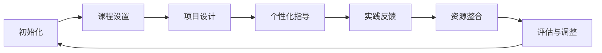

                 

### 第一部分：背景介绍

#### 1.1 问题背景

**新文艺复兴的浪潮与人才培养的挑战**

在全球化、技术革新和社会转型的背景下，现代社会对个人能力和素质提出了更高的要求。新文艺复兴的浪潮席卷全球，人们不仅追求专业知识的深度，更强调跨学科的综合素养和创新能力。这种变化对传统的教育体系提出了严峻的挑战。传统的教育体系往往注重知识的传授和学科的专业划分，而忽视了个体全面发展的重要性。在信息爆炸和知识快速更新的时代，单一的知识结构已经无法满足现代社会的需求。

**现代人才培养的需求**

现代社会的发展需要具备全方位能力的人才，他们不仅要有扎实的专业知识，还需要具备批判性思维、创新能力和跨文化交流能力。具体来说，现代人才培养的需求可以概括为以下几个方面：

1. **跨学科知识整合**：现代教育应注重跨学科的知识整合，培养学生在不同领域之间的迁移能力。
2. **创新能力培养**：教育应鼓励学生提出新观点、新思路，勇于挑战传统和权威。
3. **跨文化交流能力**：全球化背景下，国际视野和跨文化沟通能力变得尤为重要。
4. **实践能力培养**：教育应注重学生的实际操作能力和解决问题的能力，而不仅仅是理论知识的传授。

**新文艺复兴人才计划的必要性**

新文艺复兴人才计划正是在这种背景下提出的。这一计划旨在通过全新的教育理念和模式，培养具备跨学科知识、创新能力和实践能力的高素质人才。新文艺复兴人才计划的核心目标是实现个体全面发展的同时，促进社会的进步和创新。这一计划的提出，不仅回应了现代社会对人才培养的需求，也为教育改革提供了新的思路和方法。

#### 1.2 问题描述

**传统教育体系的问题**

传统教育体系主要存在以下几个问题：

1. **学科分割**：学科分割导致学生在知识结构上存在盲点，难以实现跨学科的整合和创新。
2. **知识陈旧**：传统教育注重知识的传授，但知识更新速度加快，陈旧的知识体系难以适应时代的发展。
3. **应试教育**：传统教育往往以考试成绩为导向，忽视了学生的兴趣和个性发展，导致学生的创新能力和实践能力不足。
4. **教育公平性**：传统教育体系往往存在地域、性别、经济水平等方面的不公平现象，限制了个体全面发展。

**全方位发展的现代人的需求**

现代社会对人才的需求不仅仅局限于专业知识，更强调综合素质的提升。全方位发展的现代人应具备以下能力：

1. **批判性思维**：能够独立思考、分析问题，提出有建设性的观点。
2. **创新能力**：能够勇于尝试、不断探索，提出新的想法和解决方案。
3. **跨文化交流能力**：能够适应不同文化背景，具备跨文化沟通和协作的能力。
4. **实践能力**：能够将理论知识应用到实际生活中，解决实际问题。

#### 1.3 问题解决

**新文艺复兴人才计划的核心理念**

新文艺复兴人才计划的核心在于打破传统教育体系的束缚，构建一个以个体全面发展为核心的新教育模式。该计划的核心理念包括：

1. **跨学科整合**：通过跨学科的教学和实践，培养学生的综合素养和创新能力。
2. **项目驱动学习**：以项目为导向，鼓励学生参与实际项目，培养实践能力和解决问题的能力。
3. **个性化教育**：尊重学生的个性差异，提供个性化的学习路径和指导。
4. **创新教育模式**：利用现代科技手段，如在线教育、虚拟现实等，提升教育质量和学习体验。

**新文艺复兴人才计划的具体措施**

为了实现全方位发展的目标，新文艺复兴人才计划采取了以下具体措施：

1. **课程设置**：设置跨学科课程，如人工智能与艺术、科技与哲学等，培养学生的跨学科思维。
2. **实践教学**：提供丰富的实践机会，如实习、项目竞赛等，让学生将理论知识应用到实际中。
3. **导师制度**：建立导师制度，为学生提供个性化的指导和支持，帮助他们实现个人发展目标。
4. **资源整合**：整合学校和社会资源，如企业、科研机构等，为学生提供更广阔的发展平台。

**预期效果**

新文艺复兴人才计划的实施，预计将产生以下效果：

1. **提高综合素质**：通过跨学科整合和实践教学，学生将获得更全面的知识结构和能力提升。
2. **培养创新能力**：通过项目驱动学习和个性化教育，学生将更加勇于探索和创造。
3. **促进教育公平**：通过资源整合和导师制度，缩小教育差距，实现教育公平。
4. **推动社会进步**：培养出更多具备创新能力和实践能力的人才，为社会的发展注入新的活力。

#### 1.4 边界与外延

**新文艺复兴人才计划的应用领域**

新文艺复兴人才计划不仅仅适用于高等教育，也可以推广到基础教育、职业教育等各个阶段。具体应用领域包括：

1. **高等教育**：通过跨学科课程设置和项目驱动学习，提高大学生的综合素质和创新能力。
2. **基础教育**：通过个性化教育和实践教学，培养学生的兴趣和创造力。
3. **职业教育**：通过实习和实践项目，提升职业人才的职业技能和综合素质。

**全方位发展的现代人应具备的素质和能力**

全方位发展的现代人应具备以下素质和能力：

1. **跨学科知识整合能力**：能够在不同学科之间进行知识整合和创新。
2. **创新思维能力**：能够勇于尝试、不断探索，提出新的想法和解决方案。
3. **跨文化交流能力**：能够适应不同文化背景，具备跨文化沟通和协作的能力。
4. **实践能力**：能够将理论知识应用到实际生活中，解决实际问题。

#### 1.5 概念结构与核心要素组成

**概念结构与核心要素组成**

新文艺复兴人才计划的概念结构可以概括为以下几个方面：

1. **教育理念**：以个体全面发展为核心，强调跨学科整合、创新能力和实践能力。
2. **课程设置**：设置跨学科课程，如人工智能与艺术、科技与哲学等。
3. **实践教学**：提供丰富的实践机会，如实习、项目竞赛等。
4. **导师制度**：建立导师制度，为学生提供个性化的指导和支持。
5. **资源整合**：整合学校和社会资源，为学生提供更广阔的发展平台。

**新文艺复兴人才计划的理论基础**

新文艺复兴人才计划的理论基础包括：

1. **人本主义教育理论**：强调个体的全面发展和自我实现。
2. **建构主义教育理论**：强调学生的主动学习和知识建构。
3. **创新教育理论**：强调培养学生的创新能力和实践能力。

**新文艺复兴人才计划的实践框架**

新文艺复兴人才计划的实践框架包括：

1. **跨学科教学**：通过跨学科课程设置，培养学生的综合素养和跨学科整合能力。
2. **项目驱动学习**：通过项目驱动学习，培养学生的实践能力和解决问题的能力。
3. **个性化教育**：通过个性化教育，尊重学生的个性差异，提供个性化的学习路径和指导。
4. **资源整合**：通过资源整合，为学生提供更广阔的发展平台和机会。

### 第一部分总结

通过本部分的介绍，我们了解了新文艺复兴人才计划的背景和必要性，分析了传统教育体系存在的问题，并提出了新文艺复兴人才计划的核心理念和实践框架。这一部分为后续章节的内容奠定了基础，使我们能够更深入地探讨新文艺复兴人才计划的各个方面。

---

## 第二部分：核心概念与联系

### 2.1 核心概念原理

在新文艺复兴人才计划中，核心概念原理是构建全方位发展教育模式的基础。以下是几个关键概念及其原理的详细说明：

**人本主义教育理论**

人本主义教育理论强调个体的全面发展和自我实现。其核心理念是尊重个体的自由意志和自我选择，通过提供多样化的学习环境和机会，帮助个体发现和实现自己的潜能。在实施过程中，人本主义教育理论倡导教育者与学生之间的互动与合作，鼓励学生自主学习，培养其批判性思维和创新能力。

**建构主义教育理论**

建构主义教育理论认为知识是通过个体与环境相互作用的过程建构起来的。学习不是被动接受信息，而是主动建构意义的过程。建构主义教育理论强调学习的社会性，提倡通过合作学习和互动学习来促进知识的建构。在教育实践中，教师应扮演引导者和促进者的角色，为学生提供支持和资源。

**创新教育理论**

创新教育理论关注如何培养学生的创新能力和实践能力。其核心是激发学生的好奇心和创造力，提供挑战性的问题和情境，让学生在实践中探索和创造。创新教育理论强调跨学科整合，鼓励学生将不同领域的知识融合，形成独特的观点和解决方案。

**跨学科整合**

跨学科整合是新文艺复兴人才计划的重要组成部分。通过将不同学科的知识和技能整合，学生能够获得更全面的认知和更丰富的解决问题的方法。跨学科整合不仅能够培养学生的综合素养，还能够激发他们的创新思维。在教育实践中，教师应设计跨学科项目，鼓励学生跨学科思考和合作。

**个性化教育**

个性化教育强调尊重学生的个性差异，提供个性化的学习路径和指导。通过个性化教育，学生可以根据自己的兴趣和能力选择合适的学习内容和方式，从而实现个性化发展。个性化教育有助于培养学生的自主学习能力和自我管理能力，提高他们的学习效果和满足感。

**实践导向**

实践导向强调将理论知识应用于实际情境中，培养学生的实践能力和解决问题的能力。通过实践导向的学习，学生能够在真实的情境中体验和应用知识，提高其实际操作能力和问题解决能力。实践导向的教育实践包括实习、项目研究、竞赛等。

**全脑教育**

全脑教育强调开发学生左右脑的潜能，培养其综合素质和创新能力。全脑教育理论认为，左右脑的协调工作能够提高学习效率和创新思维。在实施全脑教育时，教师应设计丰富多样的学习活动和课程，激发学生的创造力和思维能力。

#### 2.2 概念属性特征对比表格

为了更好地理解上述核心概念，我们可以通过一个对比表格来展示它们的属性特征和区别：

| 概念名称           | 定义                                                         | 主要特征                                                     | 应用实例                          |
|-------------------|--------------------------------------------------------------|------------------------------------------------------------|---------------------------------|
| 人本主义教育理论 | 强调个体的全面发展和自我实现                                 | 尊重个体自由意志，提倡自主学习，培养批判性思维               | 素质拓展课程，个性化辅导          |
| 建构主义教育理论 | 认为知识是通过个体与环境相互作用的过程建构起来的             | 强调学习的社会性和互动性，教师引导和支持，学生主动建构知识   | 项目式学习，团队合作项目         |
| 创新教育理论     | 关注如何培养学生的创新能力和实践能力                         | 激发好奇心和创造力，提供挑战性情境，跨学科整合               | 创新实验室，科学竞赛项目          |
| 跨学科整合       | 将不同学科的知识和技能整合，培养学生的综合素养和创新能力     | 多元化学习内容，跨学科项目，促进知识整合                     | 跨学科课程，跨学科团队项目        |
| 个性化教育       | 尊重学生的个性差异，提供个性化的学习路径和指导               | 自主选择学习内容，个性化教学策略，提高学习效果和满足感       | 个性化学习计划，个性化课程设计    |
| 实践导向         | 将理论知识应用于实际情境中，培养学生的实践能力和解决问题的能力 | 真实情境应用，实际操作，提高实践能力                         | 实习机会，项目研究，实践课程      |
| 全脑教育         | 开发学生左右脑的潜能，培养其综合素质和创新能力               | 左右脑协调工作，多元化学习活动，激发创造力                   | 多媒体教学，思维导图，创造性活动  |

通过这个对比表格，我们可以清晰地看到各个概念的定义、主要特征和应用实例，这有助于我们更好地理解和应用这些核心概念。

#### 2.3 ER实体关系图架构

为了更直观地展示新文艺复兴人才计划中的核心实体及其关系，我们可以使用ER（Entity-Relationship）图来描述。ER图是一种用于描述实体及其相互关系的数据库设计工具，它可以帮助我们清晰地理解系统的数据结构。

**核心实体**

在新文艺复兴人才计划中，核心实体包括学生、教师、课程、项目和资源。以下是对这些实体的简要描述：

1. **学生**：学习的主体，具有个性化的特点和需求。
2. **教师**：教育的实施者，负责指导学生的学习和提供资源。
3. **课程**：教育内容，提供系统的知识和技能培训。
4. **项目**：实践活动的载体，通过项目让学生将理论知识应用于实际情境。
5. **资源**：包括教材、设备、平台等，支持教育和学习活动的开展。

**实体关系**

以下是核心实体之间的关系：

1. **学生与课程**：学生选修课程，课程为学生提供知识。
2. **学生与项目**：学生参与项目，项目为学生提供实践机会。
3. **教师与课程**：教师教授课程，课程是教师的教学内容。
4. **教师与项目**：教师指导项目，项目是教师实践教育的平台。
5. **课程与资源**：课程需要资源支持，资源为课程提供必要保障。
6. **项目与资源**：项目需要资源支持，资源为项目提供必要保障。

**ER图描述**

以下是ER图的具体描述：

```
实体: 学生
属性: 学生ID，姓名，年龄，兴趣爱好

实体: 教师
属性: 教师ID，姓名，职称，研究领域

实体: 课程
属性: 课程ID，课程名称，课程描述，学分

实体: 项目
属性: 项目ID，项目名称，项目描述，项目类型

实体: 资源
属性: 资源ID，资源名称，资源类型，资源描述

关系: 学生与课程（选修）
- 学生ID（外键）
- 课程ID（外键）

关系: 学生与项目（参与）
- 学生ID（外键）
- 项目ID（外键）

关系: 教师与课程（教授）
- 教师ID（外键）
- 课程ID（外键）

关系: 教师与项目（指导）
- 教师ID（外键）
- 项目ID（外键）

关系: 课程与资源（依赖）
- 课程ID（外键）
- 资源ID（外键）

关系: 项目与资源（依赖）
- 项目ID（外键）
- 资源ID（外键）
```

通过上述ER图，我们可以清晰地看到各个实体及其相互关系。这有助于我们理解新文艺复兴人才计划的数据结构和运作机制，为后续的系统设计与实现提供基础。

### 第二部分总结

第二部分深入探讨了新文艺复兴人才计划中的核心概念原理，并通过对比表格和ER实体关系图进行了详细阐述。通过这些分析，我们不仅理解了各个核心概念的定义和特征，还了解了它们在实际应用中的关系和作用。这为后续的算法原理讲解和系统分析与架构设计方案奠定了坚实的理论基础。

---

## 第三部分：算法原理讲解

### 3.1 算法mermaid流程图

为了更好地展示新文艺复兴人才计划的实施流程，我们可以使用mermaid工具绘制一个流程图。mermaid是一种基于Markdown的语言，可以方便地绘制各种流程图和UML图。



在这个流程图中，我们定义了以下几个关键步骤：

1. **初始化**：计划启动，进行基础设置。
2. **课程设置**：根据培养目标设置跨学科课程。
3. **项目设计**：设计实际项目，提供实践机会。
4. **个性化指导**：根据学生特点提供个性化指导。
5. **实践反馈**：收集学生的实践反馈，进行调整。
6. **资源整合**：整合学校和社会资源，提供支持。
7. **评估与调整**：对计划进行评估，根据反馈进行调整。

### 3.2 Python源代码

为了具体说明新文艺复兴人才计划中的算法实现，我们可以通过一个Python代码示例来展示。以下是一个简化的代码实现，用于模拟课程设置和个性化指导的过程。

```python
import random

# 学生类
class Student:
    def __init__(self, name, interests):
        self.name = name
        self.interests = interests
        self.courses = []

# 课程类
class Course:
    def __init__(self, course_id, course_name, subjects):
        self.course_id = course_id
        self.course_name = course_name
        self.subjects = subjects

# 教师类
class Teacher:
    def __init__(self, teacher_id, name, subject):
        self.teacher_id = teacher_id
        self.name = name
        self.subject = subject

# 设置课程
def set_courses(teachers, students):
    courses = []
    for teacher in teachers:
        for subject in teacher.subject:
            course = Course(random.randint(1000, 9999), subject, [subject])
            courses.append(course)
            for student in students:
                if subject in student.interests:
                    student.courses.append(course)
    return courses

# 提供个性化指导
def provide_guidance(students):
    for student in students:
        print(f"{student.name}将会接受以下课程的个性化指导：")
        for course in student.courses:
            print(f"- {course.course_name}")

# 测试代码
if __name__ == "__main__":
    # 创建教师
    teachers = [
        Teacher(1, "张三", ["计算机科学", "人工智能"]),
        Teacher(2, "李四", ["数学", "哲学"]),
        Teacher(3, "王五", ["文学", "艺术"])
    ]

    # 创建学生
    students = [
        Student("小明", ["计算机科学", "哲学"]),
        Student("小红", ["数学", "文学"]),
        Student("小刚", ["人工智能", "艺术"])
    ]

    # 设置课程
    courses = set_courses(teachers, students)

    # 提供个性化指导
    provide_guidance(students)
```

在这段代码中，我们定义了学生、课程和教师三个类，然后通过函数`set_courses`设置课程，并根据学生的兴趣为他们分配课程。最后，通过`provide_guidance`函数输出学生的个性化指导信息。

### 3.3 数学模型和公式

在新文艺复兴人才计划中，数学模型和公式可以用于量化评估学生的学习效果和进展。以下是一些常用的数学模型和公式：

**1. 学习效果评估模型**

$$
E = f(I, P, G)
$$

其中，\(E\)表示学习效果，\(I\)表示学生兴趣，\(P\)表示项目参与度，\(G\)表示个性化指导的质量。这个模型通过综合考虑学生的兴趣、参与度和指导质量来评估学习效果。

**2. 项目参与度模型**

$$
P = \frac{C}{T}
$$

其中，\(P\)表示项目参与度，\(C\)表示学生参与的项目数量，\(T\)表示项目的总时间。这个模型通过计算学生参与项目的时间与总时间的比例来评估参与度。

**3. 个性化指导效果模型**

$$
G = \frac{S}{R}
$$

其中，\(G\)表示个性化指导效果，\(S\)表示学生对指导的满意度，\(R\)表示教师提供的指导资源。这个模型通过学生的满意度与教师提供的指导资源的比例来评估个性化指导的效果。

### 3.4 详细讲解与举例说明

**学习效果评估模型**

我们来看一个具体的例子来说明学习效果评估模型。假设小明对计算机科学和哲学都感兴趣，他参与了两个项目，分别花费了80小时和60小时。他的指导教师提供了100小时的个性化指导，并且小明对这些指导的满意度为90%。

首先，我们计算小明的项目参与度：

$$
P = \frac{80 + 60}{80 + 60 + 100} = \frac{140}{240} = 0.5833
$$

接下来，我们计算个性化指导效果：

$$
G = \frac{90}{100} = 0.9
$$

最后，我们计算小明的学习效果：

$$
E = f(I, P, G) = f(2, 0.5833, 0.9)
$$

为了简化计算，我们假设\(f(x, y, z)\)是一个线性函数，即：

$$
f(x, y, z) = 0.5x + 0.3y + 0.2z
$$

代入小明的参数：

$$
E = 0.5 \times 2 + 0.3 \times 0.5833 + 0.2 \times 0.9 = 1 + 0.175 + 0.18 = 1.355
$$

因此，小明的学习效果评分为1.355。

**项目参与度模型**

接下来，我们看一个项目参与度的例子。假设小红参与了3个项目，分别花费了50小时、70小时和90小时。项目总时间为50 + 70 + 90 = 210小时。

小红的参与度计算如下：

$$
P = \frac{50 + 70 + 90}{210} = \frac{210}{210} = 1
$$

这意味着小红完全参与了所有项目，参与度达到了100%。

**个性化指导效果模型**

最后，我们来看个性化指导效果的例子。假设小刚对人工智能和艺术都感兴趣，他参与了一个项目，花费了100小时。他的指导教师提供了150小时的个性化指导，小刚对这些指导的满意度为80%。

小刚的个性化指导效果计算如下：

$$
G = \frac{80}{150} = 0.5333
$$

这意味着小刚对个性化指导的满意度为53.33%。

通过这些具体的例子，我们能够清晰地看到数学模型和公式如何应用于新文艺复兴人才计划的实施中，帮助评估学生的学习效果和参与度，以及个性化指导的效果。

### 第三部分总结

第三部分详细讲解了新文艺复兴人才计划中的算法原理，通过mermaid流程图、Python源代码、数学模型和公式，以及具体的例子，使我们能够深入理解计划的实施步骤和评估方法。这一部分为后续的系统分析与架构设计方案提供了重要的理论基础和实践指导。

