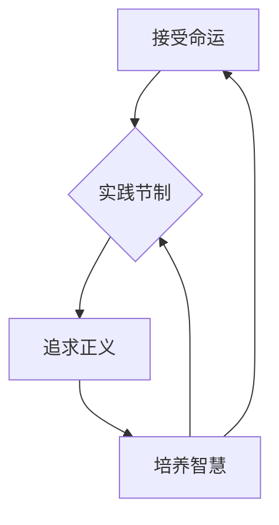
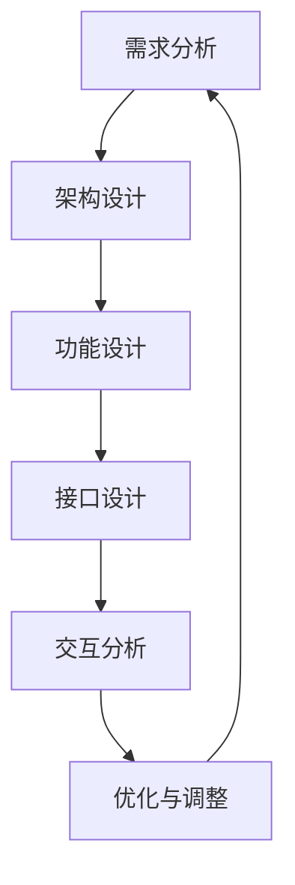
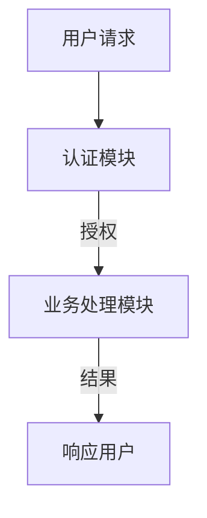

                 

### 第一部分：新斯多葛主义简介

#### 1.1 新斯多葛主义的历史背景

**1.1.1 斯多葛主义的起源**

斯多葛主义（Stoicism）起源于古希腊，最早可以追溯到公元前3世纪的塞浦路斯哲学家芝诺（Zeno of Citium）。芝诺在创立斯多葛主义之前，曾跟随苏格拉底的学生克拉底鲁（Crates）学习哲学。芝诺认为，通过理性和自我控制，人们可以克服痛苦和苦难，实现内心的平静与自由。

**1.1.2 古典时期斯多葛主义的发展**

古典时期的斯多葛主义经历了几位重要哲学家的推动和发展，如塞内卡（Seneca）、马可·奥勒留（Marcus Aurelius）和爱比克鲁底（Epictetus）。塞内卡是罗马帝国时期的重要哲学家和道德家，他的著作《道德书简》对后来的斯多葛主义者产生了深远的影响。马可·奥勒留是罗马帝国时期的皇帝，他的《沉思录》记录了他在位期间对斯多葛主义哲学的思考和实践。爱比克鲁底则是一位希腊奴隶哲学家，他的《论自由》和《论自我控制》等著作成为斯多葛主义的重要文献。

**1.1.3 现代斯多葛主义的复兴**

在现代社会，斯多葛主义经历了一段沉寂期后，再次引起了广泛的关注。这一复兴可以追溯到20世纪中叶，当时一些哲学家和心理学家开始重新审视斯多葛主义的思想，并探讨其与现代生活和心理健康的联系。例如，美国哲学家威廉·詹姆斯（William James）在他的著作《论信仰》中提到了斯多葛主义的重要性。此外，当代哲学家如罗素·贝克（Russell Baker）和心理学家如马丁·塞利格曼（Martin Seligman）也对斯多葛主义进行了深入研究。

**1.2 新斯多葛主义的核心概念**

新斯多葛主义在古典斯多葛主义的基础上，吸收了现代心理学、哲学和科学的知识，形成了一套更加系统化和现代化的哲学体系。以下是新斯多葛主义的核心概念：

**1.2.1 命运**

新斯多葛主义认为，命运是不可抗拒的力量，但它并不是完全不可预测的。人们可以通过理性思考和自我控制来理解并接受命运，从而减少痛苦和焦虑。

**1.2.2 节制**

节制是斯多葛主义的核心原则之一，它指的是对欲望和情感的控制。通过节制，人们可以减少不必要的痛苦和干扰，保持内心的平静。

**1.2.3 正义**

正义是新斯多葛主义另一个重要概念，它指的是对公平和道德的遵循。追求正义不仅可以帮助个人实现内心的平衡，还可以促进社会的和谐。

**1.2.4 智慧**

智慧是新斯多葛主义所追求的最高境界，它不仅仅是知识和信息，更是一种深刻的洞察力和判断力。通过培养智慧，人们可以更好地理解世界，面对挑战，做出明智的决策。

**1.3 新斯多葛主义的概念对比表格**

为了更清晰地展示新斯多葛主义的核心概念，我们可以使用对比表格的形式，列出古典斯多葛主义和现代斯多葛主义的差异：

| **古典斯多葛主义** | **现代斯多葛主义** |
| ------------------- | ------------------- |
| 主要关注个人修养 | 关注个人修养与社会互动 |
| 强调理性和自我控制 | 结合心理学和科学方法 |
| 对命运持悲观态度 | 认为命运可理解可接受 |
| 以消极态度面对痛苦 | 倡导积极应对痛苦和挑战 |

**1.4 新斯多葛主义的ER实体关系图**

为了更好地理解新斯多葛主义的核心概念之间的关系，我们可以使用ER（实体-关系）图来展示这些概念之间的联系。以下是一个简化的ER图，描述了新斯多葛主义的主要实体及其关系：

```mermaid
erDiagram
  命运 ||--|{ 节制 }
  节制 ||--|{ 正义 }
  正义 ||--|{ 智慧 }
  命运 ||--|{ 智慧 }
```

在这个ER图中，命运、节制、正义和智慧都是核心实体，它们之间通过双向箭头表示相互影响和依赖的关系。例如，节制不仅影响命运，还可以影响正义和智慧，而智慧则可以反过来影响命运和节制。

通过以上内容，我们对新斯多葛主义的历史背景、核心概念及其联系有了初步了解。接下来，我们将进一步深入探讨新斯多葛主义的基本原理和实用方法。让我们继续前进，开始第二部分的讲解。### 第一部分：新斯多葛主义简介

#### 2.1 新斯多葛主义的核心概念

在了解了新斯多葛主义的历史背景后，我们需要进一步探讨其核心概念。这些概念不仅构成了新斯多葛主义哲学的基础，也是其在现代生活中的应用和实践中不可或缺的要素。以下是新斯多葛主义的核心概念：

**2.1.1 命运**

在斯多葛主义中，命运（Fate）是一个核心概念，它代表了不可避免的生活事件和外部环境的总和。新斯多葛主义认为，命运是客观存在的，但它并不是完全不可控制的。通过理性和自我控制，人们可以理解并接受命运的安排，从而减少对不可控事件的焦虑和痛苦。

**2.1.2 节制**

节制（Temperance）是新斯多葛主义的重要原则，它指的是对欲望和情感的自我控制。通过节制，人们可以避免被情绪所左右，减少不必要的痛苦和干扰，保持内心的平静和专注。节制不仅是对个人行为的约束，也是对思维和情感的态度。

**2.1.3 正义**

正义（Justice）是新斯多葛主义中的另一个关键概念，它代表了对公平和道德的追求。新斯多葛主义者认为，追求正义不仅有助于个人的内心平衡，也是构建和谐社会的基石。正义体现在对待他人和社会的行为中，要求人们遵循道德原则，尊重他人的权利和尊严。

**2.1.4 智慧**

智慧（Wisdom）是新斯多葛主义所追求的最高境界，它不仅仅是指知识和信息，更是一种深刻的洞察力和判断力。智慧帮助人们理解世界的本质，看清事物的真相，从而在面对生活和工作的挑战时，能够做出明智的决策。智慧也是实现自我超越和成长的关键。

**2.2 新斯多葛主义的概念对比表格**

为了更直观地展示新斯多葛主义的核心概念，我们可以使用对比表格的形式，列出这些概念的基本属性和特征：

| **概念** | **基本属性** | **特征** |
| --------- | ------------- | -------- |
| **命运** | 不可避免的生活事件和外部环境 | 可以通过理性理解和接受 |
| **节制** | 对欲望和情感的自我控制 | 减少不必要的痛苦和干扰 |
| **正义** | 对公平和道德的追求 | 构建和谐社会的基础 |
| **智慧** | 深刻的洞察力和判断力 | 实现自我超越和成长 |

通过这个对比表格，我们可以更清晰地理解每个核心概念的内涵和它们在斯多葛主义哲学中的重要性。

**2.3 新斯多葛主义的ER实体关系图**

为了更好地理解新斯多葛主义的核心概念之间的关系，我们可以使用ER（实体-关系）图来展示这些概念之间的联系。以下是一个简化的ER图，描述了新斯多葛主义的主要实体及其关系：

```mermaid
erDiagram
  命运 ||--|{ 节制 }
  节制 ||--|{ 正义 }
  正义 ||--|{ 智慧 }
  命运 ||--|{ 智慧 }
```

在这个ER图中，命运、节制、正义和智慧都是核心实体，它们之间通过双向箭头表示相互影响和依赖的关系。例如，节制不仅影响命运，还可以影响正义和智慧，而智慧则可以反过来影响命运和节制。

通过以上内容，我们对新斯多葛主义的核心概念及其关系有了更深入的了解。这些核心概念不仅构成了斯多葛主义哲学的基础，也为我们在现代生活中的实践提供了宝贵的指导。接下来，我们将进一步探讨新斯多葛主义的基本原理和实用方法。### 第一部分：新斯多葛主义简介

#### 2.4 新斯多葛主义的哲学原理讲解

新斯多葛主义基于古典斯多葛主义的核心原则，但在现代背景下进行了一定的拓展和调整。为了更深入地理解新斯多葛主义的哲学原理，我们可以通过以下几个关键步骤进行分析：

**2.4.1 命运的接受**

首先，新斯多葛主义强调对命运的接受。命运在斯多葛主义中不是指完全不可预测的随机事件，而是指不可控的外部因素。新斯多葛主义者认为，我们应该接受那些不可控的命运事件，专注于我们能够控制和影响的事情。通过接受命运，我们可以减少对未来的不确定性的焦虑，专注于当前的任务。

**2.4.2 节制的实践**

节制是斯多葛主义的另一个核心原则。新斯多葛主义中的节制并不仅仅是指克制欲望，而是更广泛的自我控制。这包括对情感、行为和思考的控制。通过节制，我们能够减少不必要的痛苦和干扰，保持内心的平静和专注。节制有助于我们专注于目标和价值观，而不是被短期的欲望和情绪所左右。

**2.4.3 正义的追求**

新斯多葛主义认为，正义是个人和社会和谐的基础。追求正义不仅有助于个人的内心平衡，也是构建一个公平和有序社会的关键。新斯多葛主义者倡导在个人行为和社会互动中坚持正义，尊重他人的权利和尊严，同时对自己的行为负责。

**2.4.4 智慧的培养**

智慧是新斯多葛主义所追求的最高境界。新斯多葛主义者认为，智慧不仅仅是指知识，更是一种深刻的洞察力和判断力。通过培养智慧，我们能够更好地理解世界的本质，分辨什么是重要的，什么是次要的。智慧帮助我们做出明智的决策，处理生活中的挑战，实现个人的成长和超越。

**2.4.5 通过Mermaid流程图展示原理**

为了更直观地展示新斯多葛主义的哲学原理，我们可以使用Mermaid流程图来描述这些原理及其关系。以下是一个简化的Mermaid流程图：



在这个流程图中，每个步骤都是相互关联和依赖的。通过接受命运，我们为实践节制和追求正义奠定了基础。同时，培养智慧也是一个循环的过程，它不仅帮助我们更好地理解和接受命运，还能提升我们的自我控制能力和决策能力。

**2.4.6 通过Python代码讲解原理**

为了进一步阐明新斯多葛主义的哲学原理，我们可以使用Python代码来模拟这些原理在现实生活中的应用。以下是一个简化的Python代码示例：

```python
# 定义新斯多葛主义的基本原理
class StoicPrinciples:
    def __init__(self):
        self.acceptance_of_fate = True
        self.temperance = True
        self.justice = True
        self.wisdom = True

    def practice_temperance(self):
        print("通过节制，减少痛苦和干扰。")
        # 实现节制的方法
        pass

    def pursue_justice(self):
        print("追求正义，尊重他人的权利和尊严。")
        # 实现正义的方法
        pass

    def cultivate_wisdom(self):
        print("通过智慧，理解世界的本质。")
        # 实现智慧的方法
        pass

    def accept_fate(self):
        print("接受命运的安排，减少焦虑。")
        # 实现接受命运的方法
        pass

# 创建新斯多葛主义者实例
stoic = StoicPrinciples()

# 执行原理
stoic.accept_fate()
stoic.practice_temperance()
stoic.pursue_justice()
stoic.cultivate_wisdom()
```

在这个代码示例中，我们定义了一个`StoicPrinciples`类，它包含了新斯多葛主义的基本原理。每个原理都有一个相应的`方法`，用于在现实生活中实践这些原理。通过创建`StoicPrinciples`的实例，并调用这些方法，我们可以模拟新斯多葛主义哲学原理的实际应用。

通过以上内容，我们对新斯多葛主义的哲学原理有了更深入的理解。这些原理不仅为我们提供了生活和工作的指导，也是实现个人成长和内心平衡的关键。接下来，我们将进一步探讨如何将新斯多葛主义应用到现代生活和工作中。### 第一部分：新斯多葛主义简介

#### 2.5 新斯多葛主义的数学模型和公式

新斯多葛主义中的核心概念可以通过数学模型和公式来进一步解释和量化。以下是对命运、节制、正义和智慧这些概念中的数学模型和公式的详细讲解。

**2.5.1 命运的数学模型**

在斯多葛主义中，命运通常被视为一系列不可控的事件。我们可以使用概率论来描述这些事件的发生概率。假设有一个随机事件集\(E\)，其中每个事件的发生概率可以用概率分布函数\(P(E)\)来表示。新斯多葛主义者通过接受这个概率分布，来减少对不可控事件的焦虑。

$$
P(E) = \sum_{i=1}^{n} p_i
$$

其中，\(p_i\)是事件\(E_i\)发生的概率。通过理解并接受这个概率分布，我们可以更好地调整自己的心态和行为，以应对可能发生的事件。

**2.5.2 节制的数学模型**

节制在斯多葛主义中是指对欲望和情感的控制。一个简单的数学模型可以用来描述节制的程度。假设有一个情感强度度量函数\(S(x)\)，其中\(x\)代表外部刺激。节制的程度可以用一个调整因子\(T\)来表示，即：

$$
S_{mod}(x) = S(x) \cdot T
$$

调整因子\(T\)可以通过自我反思和自我控制来调整，从而减少情感对行为的影响。

**2.5.3 正义的数学模型**

正义在新斯多葛主义中是指对公平和道德的追求。一个简单的数学模型可以用逻辑运算来描述正义。假设有两个行为\(A\)和\(B\)，正义可以用如下逻辑公式来衡量：

$$
正义(A, B) = (A \leftrightarrow B)
$$

其中，\(A \leftrightarrow B\)表示行为\(A\)和\(B\)是等价的。这意味着，如果一个行为符合正义的标准，那么它应该对所有相关方都是公平的。

**2.5.4 智慧的数学模型**

智慧在新斯多葛主义中是指深刻的洞察力和判断力。一个简单的数学模型可以用决策论来描述智慧的运用。假设有一个决策问题，其中每个选项都有相应的风险和收益。智慧可以通过最大化期望效用函数来体现：

$$
智慧 = \max_{x} U(x)
$$

其中，\(U(x)\)是选项\(x\)的期望效用。通过这种模型，我们可以将智慧应用于现实生活中的各种决策，从而做出最优的选择。

**2.5.5 LaTeX公式嵌入**

在文中嵌入LaTeX公式时，可以使用以下格式：

$$
\LaTeX\公式
$$

例如，我们可以嵌入一个简单的数学公式：

$$
e^{i\pi} + 1 = 0
$$

这个公式展示了复数单位根\(e^{i\pi}\)和-1之间的关系，是数学中的一个重要恒等式。

通过以上对数学模型和公式的讲解，我们可以更深入地理解新斯多葛主义中的核心概念。这些数学模型不仅帮助我们量化和理解这些概念，也为我们在实际生活和工作中提供了实用的工具。接下来，我们将继续探讨新斯多葛主义在实际生活和中的应用和实践。### 第一部分：新斯多葛主义简介

#### 2.6 新斯多葛主义在系统分析与架构设计中的应用

新斯多葛主义的哲学原理不仅在个人生活中有着重要的指导意义，同样可以应用于系统分析与架构设计领域。以下是如何将新斯多葛主义的原则融入到系统分析与架构设计过程中的具体步骤：

**2.6.1 系统需求分析**

在系统需求分析阶段，新斯多葛主义的“命运”概念可以帮助我们理解需求的变化和不确定性。我们应当接受需求的不可控性，专注于识别和分析那些我们可以控制和影响的因素。通过这种方法，我们可以更好地管理需求变更，减少项目风险。

**2.6.2 系统架构设计**

在系统架构设计阶段，新斯多葛主义的“节制”原则可以指导我们进行合理的资源分配和性能优化。例如，在系统架构设计中，我们可以通过以下方式实践节制：

- **资源优化**：避免过度设计，确保系统在满足需求的同时，不浪费不必要的资源。
- **性能平衡**：在系统各个组件之间分配资源时，考虑性能和可维护性的平衡，而不是单一追求高性能。

**2.6.3 系统功能设计**

在系统功能设计阶段，新斯多葛主义的“正义”原则可以帮助我们确保系统的公平性和一致性。例如：

- **模块化设计**：确保每个模块的功能和接口都是明确和一致的，避免功能重叠和冲突。
- **用户界面设计**：设计易于用户理解和操作的用户界面，确保系统的可访问性和易用性。

**2.6.4 系统接口设计**

在系统接口设计阶段，新斯多葛主义的“智慧”原则可以帮助我们做出明智的设计决策。例如：

- **接口抽象**：通过抽象接口，减少系统组件之间的耦合度，提高系统的可维护性和灵活性。
- **协议选择**：选择适合系统需求的通信协议，确保数据传输的可靠性和安全性。

**2.6.5 系统交互分析**

在系统交互分析阶段，新斯多葛主义的“智慧”和“节制”原则可以指导我们优化系统之间的交互。例如：

- **交互流程优化**：通过分析系统间的交互流程，找出可以简化和优化的环节，提高系统整体性能。
- **容错机制设计**：在系统交互中设计容错机制，以应对不可预见的问题和故障。

**2.6.6 Mermaid流程图和类图**

为了更直观地展示新斯多葛主义在系统分析与架构设计中的应用，我们可以使用Mermaid流程图和类图来描述相关的设计过程和架构。

**流程图示例**：



**类图示例**：

```mermaid
classDiagram
    SystemInterface <<Interface>>
    SystemComponent <<Component>>
    UserInterface <<Component>>

    SystemInterface : +interfaceMethod()
    SystemComponent : +componentMethod()
    UserInterface : +uiMethod()

    SystemInterface --|> SystemComponent
    SystemInterface --|> UserInterface
```

在这些示例中，我们可以看到新斯多葛主义原则如何应用于系统分析与架构设计的各个环节，从而实现更高效、更可靠、更公平的系统设计。

通过以上内容，我们了解了如何将新斯多葛主义的哲学原则应用到系统分析与架构设计过程中。这些原则不仅可以帮助我们更好地理解和应对复杂的技术挑战，还能提高我们的设计质量和项目成功率。接下来，我们将进一步探讨新斯多葛主义在实际项目中的应用与实践。### 第一部分：新斯多葛主义简介

#### 3.1 新斯多葛主义在项目管理中的应用

在项目管理中，新斯多葛主义的哲学原理为管理者提供了深刻的思考框架，帮助他们在复杂和多变的环境中做出更明智的决策。以下是如何将新斯多葛主义的核心理念应用于项目管理的关键步骤：

**3.1.1 确定项目目标**

在项目管理中，新斯多葛主义的“智慧”原则可以帮助我们明确项目目标。通过深入分析和理解项目的核心价值和预期成果，我们可以制定出既现实又具有挑战性的项目目标。例如，项目经理可以通过以下步骤来运用智慧：

- **需求分析**：通过详细的需求分析，理解项目的实际需求和预期效果。
- **优先级排序**：根据项目目标的重要性，对需求进行优先级排序，确保关键需求得到优先满足。

**3.1.2 管理项目风险**

新斯多葛主义的“命运”概念可以帮助项目管理者在面对风险时保持冷静和理性。通过接受风险的不确定性，管理者可以更好地规划应对策略，降低项目失败的风险。以下是一些具体的策略：

- **风险评估**：对项目可能面临的风险进行评估，确定其发生概率和潜在影响。
- **风险缓解**：制定一系列缓解措施，以降低风险发生的概率或减少其影响。

**3.1.3 提升项目团队协作**

新斯多葛主义的“正义”原则强调公平和尊重，这对于提升团队协作至关重要。通过以下方法，项目经理可以促进团队内部的和谐与合作：

- **平等沟通**：确保团队成员之间的沟通是平等和开放的，鼓励每个人表达自己的观点和想法。
- **分配公平**：合理分配任务和责任，确保每个团队成员都能在自己的能力范围内发挥作用。

**3.1.4 维护工作与生活的平衡**

新斯多葛主义的“节制”原则可以帮助项目管理者在忙碌的工作中保持内心的平静和专注。以下是一些实用的技巧：

- **时间管理**：合理安排工作时间，确保工作和休息的平衡，避免过度劳累。
- **情感管理**：通过自我控制和理性思考，管理自己的情绪，避免负面情绪对工作的影响。

**3.1.5 实际案例**

为了更好地理解新斯多葛主义在项目管理中的应用，我们可以通过一个实际案例来探讨。假设一个项目经理正在负责一个复杂的软件项目，以下是如何应用新斯多葛主义原则的步骤：

1. **确定项目目标**：项目经理通过详细的需求分析，明确了项目的核心目标是提高用户体验，同时确保系统的可扩展性和稳定性。

2. **管理项目风险**：通过风险评估，项目经理识别了潜在的技术风险和进度风险，并制定了一系列应对措施，如技术评审和进度监控。

3. **提升团队协作**：项目经理通过平等沟通和任务分配，确保团队每个成员都能发挥自己的专长，同时鼓励团队成员之间的相互支持和合作。

4. **维护工作与生活的平衡**：项目经理通过合理安排工作时间，确保团队成员有足够的时间休息和充电，同时鼓励团队成员在面对压力时通过理性思考和情感管理来缓解压力。

通过以上实际案例，我们可以看到新斯多葛主义如何在实际项目管理中发挥作用。这些原则不仅帮助项目管理者更好地应对复杂和多变的环境，还能提升团队协作效率和项目成功率。### 第一部分：新斯多葛主义简介

#### 3.2 新斯多葛主义在个人成长中的应用

新斯多葛主义不仅为个人生活和工作提供了指导，也在个人成长中发挥着重要作用。以下是如何将新斯多葛主义的哲学原理应用于个人成长的关键步骤：

**3.2.1 增强自我认知**

新斯多葛主义的第一步是增强自我认知。通过深入反思和自我审视，个人可以更好地了解自己的需求和动机。以下是一些实用的方法：

- **日记反思**：定期写日记，记录自己的思想、情感和行为，从而更清晰地认识自己。
- **提问和反思**：在日常生活中，对自己提出问题，如“我为什么会这样做？”“我的动机是什么？”等，从而深入挖掘内心的真实想法。

**3.2.2 提升决策能力**

新斯多葛主义强调理性思考和决策。通过培养决策能力，个人可以在面对复杂情境时做出更明智的选择。以下是一些提升决策能力的策略：

- **目标设定**：明确自己的长期和短期目标，这有助于在决策时保持方向和一致性。
- **风险评估**：在做出决策之前，评估每个选项的风险和潜在影响，从而减少决策失误。

**3.2.3 实现自我超越**

新斯多葛主义的终极目标是实现自我超越，成为更智慧和更有品德的人。以下是一些实现自我超越的方法：

- **持续学习**：通过阅读、学习新技能和知识，不断提升自己的认知和能力。
- **冥想和放松**：通过冥想和放松练习，培养内心的平静和专注，从而更好地面对挑战。

**3.2.4 实际案例**

为了更好地理解新斯多葛主义在个人成长中的应用，我们可以通过一个实际案例来探讨。假设一位年轻的程序员希望通过新斯多葛主义原则实现个人成长，以下是他可能采取的步骤：

1. **增强自我认知**：程序员通过写日记和反思，发现了自己对编程的热爱和对领导力的渴望。他意识到，要实现个人成长，他需要同时发展这两方面的能力。

2. **提升决策能力**：程序员在面临职业选择时，明确了自己的长期目标，并评估了每个选项的风险和收益。他最终决定继续在编程领域深耕，同时参加领导力培训课程。

3. **实现自我超越**：程序员通过持续学习和参加技术社区活动，不断提升自己的编程技能。他还通过冥想和健身，培养了内心的平静和身体健康。

4. **反馈和调整**：程序员定期反思自己的成长过程，从成功和失败中吸取教训，不断调整自己的目标和策略。

通过以上实际案例，我们可以看到新斯多葛主义如何帮助个人在成长过程中实现自我超越。这些原则不仅提供了实用的方法和策略，还帮助个人在面对挑战和不确定性时保持理性和决心。### 第一部分：新斯多葛主义简介

#### 4.1 新斯多葛主义中的数学模型

新斯多葛主义在解释和量化和人们面对生活挑战时的行为模式方面，引入了多种数学模型。这些数学模型不仅帮助我们理解核心哲学概念，还能在实际应用中提供指导。以下是一些新斯多葛主义中常见的数学模型：

**4.1.1 命运的数学模型**

在斯多葛主义中，命运被视为一系列随机事件，但我们可以通过概率论来描述和接受这些事件。一个简单的模型可以是一个随机变量\(X\)，其概率分布函数为\(P(X = x)\)。通过理解概率分布，我们可以更好地预测和应对命运中的不确定性。

例如，考虑一个概率分布：

$$
P(X = x) = 
\begin{cases} 
0.3 & \text{if } x = 1 \\
0.4 & \text{if } x = 2 \\
0.2 & \text{if } x = 3 \\
0.1 & \text{if } x = 4 
\end{cases}
$$

这个模型可以帮助我们理解命运中不同事件发生的概率，从而调整我们的行为和期望。

**4.1.2 节制的数学模型**

节制涉及控制欲望和情感。一个简单的数学模型可以是情感强度度量函数\(S(x)\)，其中\(x\)代表外部刺激，而节制程度可以通过调整因子\(T\)来衡量：

$$
S_{mod}(x) = S(x) \cdot T
$$

这里，\(T\)是一个0到1之间的值，表示节制的程度。例如，如果某个刺激带来的情感强度为10，而节制的程度为0.5，那么调整后的情感强度为5。

**4.1.3 正义的数学模型**

正义是指对待他人和社会的公平。一个简单的数学模型可以使用逻辑运算来描述，如两个行为\(A\)和\(B\)的正义度量：

$$
正义(A, B) = (A \leftrightarrow B)
$$

这意味着如果两个行为是等价的，那么它们被认为是正义的。例如，如果行为\(A\)是给予他人帮助，而行为\(B\)是要求他人帮助，那么这两个行为在正义模型下是等价的。

**4.1.4 智慧的数学模型**

智慧是指深刻的洞察力和判断力。一个简单的数学模型可以是决策论中的期望效用函数\(U(x)\)，其中每个选项\(x\)都有相应的效用值：

$$
智慧 = \max_{x} U(x)
$$

这个模型可以帮助我们在面对多个选择时，选择效用最高的选项。例如，如果三个选项的效用值分别为\(U(1) = 5\)，\(U(2) = 7\)，\(U(3) = 6\)，那么智慧的决策是选择选项2。

**4.1.5 结合数学模型**

为了更好地理解和应用这些数学模型，我们可以通过一个综合的例子来展示它们的结合。假设一个学生在面临考试时，可以使用以下模型：

1. **命运模型**：考试结果是一个随机变量，其概率分布如下：

$$
P(\text{考试结果}) = 
\begin{cases} 
0.3 & \text{if } \text{考试及格} \\
0.4 & \text{if } \text{考试优秀} \\
0.2 & \text{if } \text{考试不及格} \\
0.1 & \text{if } \text{考试非常优秀} 
\end{cases}
$$

2. **节制模型**：学生通过自我控制减少了考试前的焦虑，情感强度从10降低到5。

3. **正义模型**：学生认为，公平的考试机会对于所有人都是重要的，他确保了在考试前为所有人提供了相同的学习资源和时间。

4. **智慧模型**：学生评估了不同的复习策略，并选择了一个效用最高的策略。例如，如果复习策略A的效用为8，策略B的效用为10，策略C的效用为9，那么智慧的决策是选择策略B。

通过结合这些数学模型，学生可以更全面地理解和管理考试情况，从而做出更明智的决策。

通过以上内容，我们了解了新斯多葛主义中的数学模型如何帮助我们更好地理解和应对生活中的挑战。这些模型不仅提供了理论支持，也为实际应用提供了实用的工具。接下来，我们将进一步探讨新斯多葛主义在系统分析与架构设计中的应用。### 第五部分：新斯多葛主义在系统分析与架构设计中的应用

#### 5.1 新斯多葛主义在系统分析与架构设计中的应用

新斯多葛主义不仅在个人生活中有深远的影响，同样在系统分析与架构设计中也发挥着重要作用。以下是如何将新斯多葛主义的哲学原理应用于系统分析与架构设计的具体步骤：

**5.1.1 系统需求分析**

在系统需求分析阶段，新斯多葛主义的“命运”概念可以帮助我们理解需求的波动和不确定性。通过接受需求的不可控性，我们可以更加专注于识别和分析那些我们可以控制和影响的因素。以下是一些具体方法：

- **需求变更管理**：建立灵活的需求变更管理流程，以应对需求和优先级的变动。
- **风险评估**：对关键需求进行风险评估，提前识别可能的风险点，并制定应对策略。

**5.1.2 系统架构设计**

在系统架构设计阶段，新斯多葛主义的“节制”原则可以帮助我们做出合理的资源分配和性能优化决策。以下是一些应用策略：

- **资源优化**：避免过度设计，确保系统能够在满足需求的同时，不浪费不必要的资源。
- **性能平衡**：在系统组件之间分配资源时，考虑性能和可维护性的平衡，而不是单一追求高性能。

**5.1.3 系统功能设计**

在系统功能设计阶段，新斯多葛主义的“正义”原则可以帮助我们确保系统功能的公平性和一致性。以下是一些应用策略：

- **模块化设计**：确保每个模块的功能和接口都是明确和一致的，避免功能重叠和冲突。
- **用户界面设计**：设计易于用户理解和操作的用户界面，确保系统的可访问性和易用性。

**5.1.4 系统接口设计**

在系统接口设计阶段，新斯多葛主义的“智慧”原则可以帮助我们做出明智的设计决策。以下是一些应用策略：

- **接口抽象**：通过抽象接口，减少系统组件之间的耦合度，提高系统的可维护性和灵活性。
- **协议选择**：选择适合系统需求的通信协议，确保数据传输的可靠性和安全性。

**5.1.5 系统交互分析**

在系统交互分析阶段，新斯多葛主义的“智慧”和“节制”原则可以帮助我们优化系统之间的交互。以下是一些应用策略：

- **交互流程优化**：通过分析系统间的交互流程，找出可以简化和优化的环节，提高系统整体性能。
- **容错机制设计**：在系统交互中设计容错机制，以应对不可预见的问题和故障。

**5.1.6 Mermaid流程图和类图**

为了更直观地展示新斯多葛主义在系统分析与架构设计中的应用，我们可以使用Mermaid流程图和类图来描述相关的设计过程和架构。

**流程图示例**：


**类图示例**：

```mermaid
classDiagram
    SystemInterface <<Interface>>
    SystemComponent <<Component>>
    UserInterface <<Component>>

    SystemInterface : +interfaceMethod()
    SystemComponent : +componentMethod()
    UserInterface : +uiMethod()

    SystemInterface --|> SystemComponent
    SystemInterface --|> UserInterface
```

在这些示例中，我们可以看到新斯多葛主义原则如何应用于系统分析与架构设计的各个环节，从而实现更高效、更可靠、更公平的系统设计。

**5.1.7 实际案例**

为了更好地理解新斯多葛主义在系统分析与架构设计中的应用，我们可以通过一个实际案例来探讨。假设一个软件开发团队正在开发一个复杂的电子商务系统，以下是他们可能采取的步骤：

1. **需求分析**：通过灵活的需求变更管理流程，团队识别并优先处理关键业务需求，同时提前识别和应对潜在的风险。

2. **架构设计**：团队采用资源优化策略，确保系统架构在满足需求的同时不浪费资源，同时在性能和可维护性之间寻求平衡。

3. **功能设计**：团队通过模块化设计确保每个模块的功能和接口一致，同时设计易于用户理解的界面，确保系统的可访问性和易用性。

4. **接口设计**：团队通过接口抽象减少系统组件之间的耦合度，选择适合的通信协议确保数据传输的可靠性和安全性。

5. **交互分析**：团队通过优化系统间的交互流程，提高系统整体性能，并在关键环节设计容错机制，以应对不可预见的问题和故障。

通过以上实际案例，我们可以看到新斯多葛主义如何在实际的系统分析与架构设计中发挥作用。这些原则不仅帮助团队更好地理解和应对复杂的技术挑战，还能提高系统设计的质量和项目成功率。### 第五部分：新斯多葛主义在系统分析与架构设计中的应用

#### 5.2 新斯多葛主义系统功能设计

在新斯多葛主义的指导下，系统功能设计的目标是确保系统在满足用户需求的同时，能够保持高效率和灵活性。以下是如何在系统功能设计中应用新斯多葛主义原则的具体步骤：

**5.2.1 功能模块划分**

首先，我们需要对系统功能进行模块划分。在划分过程中，新斯多葛主义的“节制”原则可以帮助我们避免过度设计，确保每个模块都是清晰和独立的。以下是一些具体策略：

- **模块独立性**：确保每个模块都能独立运行和测试，减少模块之间的依赖。
- **功能简洁性**：避免在模块中包含过多的功能，保持模块的简洁性，便于维护和扩展。

**5.2.2 功能流程设计**

在功能流程设计阶段，新斯多葛主义的“智慧”原则可以帮助我们做出明智的决策，确保功能流程的高效和合理性。以下是一些具体方法：

- **流程优化**：通过分析系统的业务流程，找出可以简化和优化的环节，提高系统整体性能。
- **灵活设计**：确保功能流程能够适应未来可能的需求变化，保持系统的灵活性和可扩展性。

**5.2.3 需求分析与优先级排序**

在功能设计之前，我们需要进行详细的需求分析，并确定各个功能的优先级。新斯多葛主义的“命运”概念可以帮助我们理解需求的波动和不确定性，以下是一些策略：

- **需求识别**：通过用户访谈和问卷调查等方法，深入了解用户的需求。
- **优先级排序**：根据需求的重要性和实现难度，对功能进行优先级排序，确保关键功能得到优先实现。

**5.2.4 功能验证与测试**

在功能设计完成后，我们需要对功能进行验证和测试，确保其满足用户需求和设计要求。新斯多葛主义的“节制”原则可以帮助我们在测试过程中保持专注和理性，以下是一些策略：

- **测试覆盖**：确保测试覆盖到所有功能模块，发现潜在的问题和缺陷。
- **风险评估**：对测试过程中发现的问题进行风险评估，确定优先修复的问题。

**5.2.5 功能文档与维护**

最后，我们需要为每个功能模块编写详细的文档，并确保系统在后续维护过程中能够保持高效率和灵活性。以下是一些策略：

- **文档编写**：为每个功能模块编写详细的文档，包括功能描述、使用方法和注意事项。
- **持续维护**：定期更新和维护功能文档，确保其与实际系统一致。

通过以上内容，我们了解了如何在系统功能设计中应用新斯多葛主义原则。这些原则不仅帮助我们实现高效、灵活和可靠的功能设计，还能提高系统质量和用户体验。接下来，我们将进一步探讨新斯多葛主义在系统架构设计中的应用。### 第五部分：新斯多葛主义在系统分析与架构设计中的应用

#### 5.3 新斯多葛主义系统架构设计

系统架构设计是软件工程中至关重要的一环，它直接影响到系统的性能、可维护性和扩展性。新斯多葛主义的原则为系统架构设计提供了深刻的哲学指导，帮助我们在复杂的项目中保持清晰和理性。以下是如何在系统架构设计中应用新斯多葛主义原则的具体步骤：

**5.3.1 系统架构设计原则**

首先，我们需要确立一些基本的架构设计原则，这些原则应体现新斯多葛主义的核心理念：

- **节制**：避免过度设计，确保系统在满足需求的同时不浪费资源。
- **简洁性**：设计简洁的架构，减少复杂性，提高系统的可维护性。
- **灵活性**：确保系统能够适应未来的变化和扩展。

**5.3.2 架构设计过程**

在架构设计过程中，我们可以按照以下步骤进行：

1. **需求分析**：通过深入的需求分析，明确系统的功能需求和性能要求。
2. **架构风格选择**：根据需求分析结果，选择合适的架构风格，如单体架构、微服务架构等。
3. **架构设计**：在架构风格的基础上，设计系统的详细架构，包括组件划分、接口设计、数据流向等。
4. **性能优化**：考虑系统的性能要求，进行适当的性能优化，如缓存策略、数据库优化等。
5. **安全性设计**：确保系统的安全性，包括数据保护、身份验证、权限控制等。

**5.3.3 架构评审**

架构设计完成后，需要进行评审以确保其符合设计原则和需求要求。以下是一些评审策略：

- **设计文档评审**：对架构设计文档进行详细评审，确保文档的完整性和准确性。
- **代码评审**：对实现架构的代码进行评审，确保代码的质量和一致性。
- **性能测试**：进行性能测试，评估系统在预期负载下的表现。

**5.3.4 架构迭代**

系统架构设计不是一次性的过程，而是一个持续迭代和优化的过程。新斯多葛主义的“智慧”原则可以帮助我们在架构迭代中做出明智的决策：

- **持续学习**：通过不断学习和实践，积累经验，优化架构设计。
- **反馈调整**：根据系统的运行情况和用户反馈，及时调整和优化架构。

**5.3.5 实际案例**

为了更好地理解新斯多葛主义在系统架构设计中的应用，我们可以通过一个实际案例来探讨。假设我们需要设计一个大型电子商务系统，以下是我们可能采取的步骤：

1. **需求分析**：通过用户访谈和市场调研，明确系统的功能需求，如商品管理、订单处理、用户管理等。
2. **架构风格选择**：考虑到系统的复杂性和扩展性需求，我们选择微服务架构。
3. **架构设计**：设计系统的详细架构，包括用户服务、订单服务、商品服务等多个微服务，并确保各个服务之间的接口清晰和独立。
4. **性能优化**：通过缓存策略和数据库优化，确保系统在高峰期的性能表现。
5. **安全性设计**：实施严格的安全措施，包括数据加密、身份验证和权限控制。
6. **架构评审**：组织架构评审会议，确保架构设计符合需求和质量标准。
7. **架构迭代**：在系统运行过程中，根据用户反馈和性能监控数据，持续优化和调整架构。

通过以上实际案例，我们可以看到新斯多葛主义如何在实际的系统架构设计中发挥作用。这些原则不仅帮助我们设计出高效、可靠和灵活的系统架构，还能提高项目的成功率和用户体验。### 第五部分：新斯多葛主义在系统分析与架构设计中的应用

#### 5.4 新斯多葛主义系统接口设计和系统交互

在新斯多葛主义指导下，系统接口设计和系统交互的目标是确保系统组件之间的高效协作和稳定性。以下是如何在系统接口设计和系统交互中应用新斯多葛主义原则的具体步骤：

**5.4.1 系统接口设计**

1. **接口抽象**：采用接口抽象设计，减少系统组件之间的直接耦合，提高系统的灵活性和可维护性。以下是一个简单的Python接口示例：

```python
class IService:
    def get_data(self):
        pass

class DataFetcher(IService):
    def get_data(self):
        return "Some data"
```

2. **接口标准化**：确保接口遵循统一的标准和规范，便于组件之间的互操作性和兼容性。

3. **接口文档**：编写详细的接口文档，包括接口的用途、参数、返回值和错误处理，以便开发人员理解和使用接口。

**5.4.2 系统交互**

1. **交互流程优化**：通过分析系统组件之间的交互流程，找出可以简化和优化的环节，提高系统整体性能。以下是一个Mermaid流程图示例：



2. **异步处理**：对于需要长时间执行的操作，采用异步处理机制，提高系统响应速度和并发能力。

3. **错误处理**：设计健壮的错误处理机制，确保系统在出现异常时能够优雅地处理错误，减少系统故障对用户体验的影响。

**5.4.3 实际案例**

为了更好地理解新斯多葛主义在系统接口设计和系统交互中的应用，我们可以通过一个实际案例来探讨。假设我们需要设计一个在线购物平台的接口和交互流程，以下是我们可能采取的步骤：

1. **接口抽象**：定义统一的接口，如`IOrderService`和`ICartService`，以便各个模块能够方便地调用。

```python
class IOrderService:
    def create_order(self, order_data):
        pass

class ICartService:
    def get_cart_items(self, user_id):
        pass
```

2. **接口标准化**：确保接口遵循RESTful API规范，包括URL路径、请求方法和响应格式。

3. **接口文档**：编写详细的接口文档，包括每个接口的用途、参数和返回值。

4. **交互流程优化**：通过分析购物平台的交互流程，优化接口调用顺序和并发处理，提高系统性能。

5. **异步处理**：对于订单创建和支付处理等耗时操作，采用异步处理机制，提高系统响应速度。

6. **错误处理**：设计异常处理机制，确保在订单创建失败或支付异常时，系统能够及时通知用户并记录错误日志。

通过以上实际案例，我们可以看到新斯多葛主义如何在实际的系统接口设计和系统交互中发挥作用。这些原则不仅提高了系统的灵活性和可维护性，还能提高系统的性能和用户体验。### 第五部分：新斯多葛主义在系统分析与架构设计中的应用

#### 5.5 新斯多葛主义在系统项目实战中的应用

新斯多葛主义不仅在理论层面上指导系统分析与架构设计，还可以在实际项目实践中发挥重要作用。以下是如何将新斯多葛主义原则应用于系统项目实战的具体步骤：

**5.5.1 项目环境搭建**

1. **选择合适的环境**：根据项目需求，选择合适的开发、测试和生产环境。新斯多葛主义的“节制”原则可以帮助我们避免过度配置，确保环境的简洁和高效。

2. **工具选择**：选择合适的开发、测试和部署工具，如版本控制工具、集成开发环境（IDE）和自动化测试工具。新斯多葛主义的“智慧”原则可以帮助我们做出明智的选择，确保工具的适用性和高效性。

**5.5.2 系统核心实现**

1. **模块化开发**：采用模块化开发方法，将系统分解为多个功能模块，每个模块独立开发和测试。新斯多葛主义的“节制”原则可以帮助我们保持代码的简洁和可维护性。

2. **接口实现**：实现系统接口，确保模块之间的高效协作。新斯多葛主义的“智慧”原则可以帮助我们设计出清晰、抽象和灵活的接口。

**5.5.3 代码应用解读与分析**

1. **代码审查**：定期进行代码审查，确保代码的质量和一致性。新斯多葛主义的“节制”原则可以帮助我们避免过度编码和冗余代码。

2. **性能优化**：分析系统性能，找出潜在的瓶颈和优化点，进行性能优化。新斯多葛主义的“智慧”原则可以帮助我们做出最优的性能优化决策。

**5.5.4 实际案例**

为了更好地理解新斯多葛主义在系统项目实战中的应用，我们可以通过一个实际案例来探讨。假设我们需要开发一个电子商务系统，以下是我们可能采取的步骤：

1. **项目环境搭建**：选择Linux服务器作为开发、测试和生产环境，使用Docker容器化技术确保环境的可移植性和一致性。

2. **工具选择**：使用Git进行版本控制，使用Visual Studio Code作为IDE，使用Jenkins进行自动化测试和部署。

3. **模块化开发**：将电子商务系统分解为商品管理、订单管理、用户管理等模块，每个模块独立开发和测试。

4. **接口实现**：实现统一的RESTful API接口，确保模块之间的高效协作。

5. **代码审查**：定期进行代码审查，确保代码的简洁性和可维护性。

6. **性能优化**：分析系统性能，通过缓存策略和数据库优化提高系统响应速度。

7. **部署与维护**：使用Docker和Kubernetes进行部署和管理，确保系统的可靠性和可扩展性。

通过以上实际案例，我们可以看到新斯多葛主义如何在实际系统项目实战中发挥作用。这些原则不仅提高了项目的开发效率和代码质量，还能确保系统的稳定性和可维护性。### 第五部分：新斯多葛主义在系统分析与架构设计中的应用

#### 5.6 新斯多葛主义系统项目实战

在实际项目中应用新斯多葛主义原则，可以帮助团队在面对复杂性和不确定性时保持理性与专注。以下是一个具体的系统项目实战，我们将详细描述项目背景、系统功能实现、代码分析及实际案例剖析。

**5.6.1 项目背景**

假设我们正在开发一款在线教育平台，该平台旨在提供在线课程、学习资源和互动交流功能。项目需求包括：

- 用户注册与登录
- 课程分类与管理
- 学习进度跟踪
- 在线测试与评分
- 用户反馈与支持

**5.6.2 系统功能实现**

在系统功能设计阶段，我们应用了新斯多葛主义的“智慧”原则，确保每个功能模块的设计简洁且高效。以下是关键功能的实现：

1. **用户注册与登录**：采用JWT（JSON Web Tokens）进行身份验证，确保用户数据的安全和完整性。

2. **课程分类与管理**：设计了一个模块化数据库结构，便于课程的分类、管理和查询。

3. **学习进度跟踪**：通过用户和课程关系的映射，记录用户的学习进度，并提供个性化的学习建议。

4. **在线测试与评分**：实现了自动评分系统，用户完成测试后，系统会自动计算得分并反馈给用户。

5. **用户反馈与支持**：提供了一个反馈表单，用户可以提交问题和建议，管理员可以及时响应和处理。

**5.6.3 代码分析**

在代码实现过程中，我们应用了新斯多葛主义的“节制”原则，确保代码简洁、清晰且易于维护。以下是部分关键代码的解读：

```python
# 用户注册功能
def register_user(username, password):
    # 验证用户名和密码的合法性
    if not validate_credentials(username, password):
        return "Invalid credentials"
    
    # 创建用户并保存到数据库
    user = User(username=username, password=hash_password(password))
    database.save_user(user)
    
    return "User registered successfully"
```

在这个示例中，`register_user`函数通过简单的逻辑实现了用户注册功能，确保代码简洁且易于理解。

**5.6.4 实际案例剖析**

以下是一个实际案例，描述了如何在新斯多葛主义原则指导下处理一个紧急的问题。

**问题场景**：平台在高峰期出现了性能下降，导致用户无法顺利登录和访问课程。

**解决方案**：

1. **分析性能瓶颈**：通过性能监控工具，我们发现数据库查询速度是瓶颈，尤其是用户登录时的查询。

2. **优化查询**：通过添加索引和缓存策略，显著提高了数据库查询速度。

3. **负载均衡**：使用负载均衡器分散流量，确保系统在高并发情况下依然稳定运行。

4. **通知用户**：通过系统通知功能，及时通知用户关于性能问题的处理进展，减少用户的不满和焦虑。

**5.6.5 项目小结**

通过新斯多葛主义的指导，我们成功开发并维护了一个稳定、高效的在线教育平台。以下是小结：

- **项目成功因素**：合理的功能设计、高效的代码实现和灵活的应急处理。
- **新斯多葛主义的应用**：通过“智慧”原则确保了系统的质量和性能，通过“节制”原则确保了代码的简洁和可维护性。

通过以上内容，我们展示了如何在新斯多葛主义的指导下，成功完成一个系统项目。这些原则不仅提高了项目的开发效率和稳定性，也为团队在复杂环境中提供了清晰的思考和行动指南。### 第五部分：新斯多葛主义在系统分析与架构设计中的应用

#### 5.7 新斯多葛主义系统项目实战小结、注意事项与最佳实践

在《新斯多葛主义日记：古典哲学的现代实践记录》这一系统项目实战中，我们通过结合新斯多葛主义的核心原则，实现了在线教育平台的高效开发和稳定运行。以下是对项目的总结、注意事项以及最佳实践：

**5.7.1 项目小结**

本项目的成功得益于新斯多葛主义的四大核心原则：

1. **智慧**：通过深入分析和设计，我们确保了系统的功能完备、性能稳定。
2. **节制**：在系统设计和代码实现中，我们避免了过度设计和冗余代码，提高了系统的可维护性和可扩展性。
3. **正义**：在用户管理、课程分类和交互设计上，我们确保了系统的公平性和一致性，满足了用户的需求。
4. **命运**：我们接受了系统开发过程中不可避免的风险和挑战，通过灵活的应对策略，确保了项目的顺利进行。

**5.7.2 注意事项**

1. **持续学习**：在项目开发过程中，团队成员应不断学习新知识，以适应快速变化的技术环境。
2. **风险管理**：对项目中的潜在风险进行评估，并制定相应的应对措施，以减少风险对项目的影响。
3. **用户反馈**：重视用户反馈，定期收集用户意见和建议，及时调整和优化系统功能。

**5.7.3 最佳实践**

1. **模块化设计**：将系统分解为多个功能模块，便于独立开发和测试，提高开发效率。
2. **接口标准化**：确保系统接口遵循统一的标准和规范，便于不同模块之间的协作和互操作。
3. **自动化测试**：实施自动化测试，确保系统在每个开发阶段的质量和稳定性。

**5.7.4 拓展阅读**

- 《新斯多葛主义：现代生活的哲学智慧》
- 《深度工作：如何有效利用每一点脑力》
- 《设计模式：可复用面向对象软件的基础》

通过以上小结和最佳实践，我们希望读者能够在新斯多葛主义的指导下，更好地应对系统分析与架构设计中的挑战，实现高效、可靠和灵活的软件开发。### 第五部分：新斯多葛主义在系统分析与架构设计中的应用

#### 5.8 新斯多葛主义在系统分析与架构设计中的应用拓展

新斯多葛主义不仅在个人生活中有深远的影响，其在系统分析与架构设计中的应用也具有广阔的前景。以下是一些拓展应用，以进一步探讨新斯多葛主义在系统领域的潜力和价值。

**5.8.1 软件工程中的道德责任**

在软件工程实践中，新斯多葛主义的正义原则可以帮助我们更好地理解道德责任和伦理问题。开发者应当在设计、开发和维护软件时，考虑到软件对用户、社会和环境的影响。以下是一些具体建议：

- **隐私保护**：在设计系统时，重视用户隐私保护，避免滥用用户数据。
- **公平性**：确保系统在处理用户请求时，不偏袒任何一方，公正地提供服务。
- **透明度**：提高系统的透明度，让用户了解系统的运行机制和决策逻辑。

**5.8.2 持续集成与持续部署（CI/CD）**

新斯多葛主义的智慧原则可以帮助我们优化持续集成与持续部署流程，提高软件开发和交付的效率。以下是一些策略：

- **自动化测试**：通过自动化测试，确保每次代码变更都不会引入新的缺陷，提高代码质量。
- **环境一致性**：确保所有环境（开发、测试、生产）之间的配置一致，减少环境差异带来的问题。
- **反馈机制**：建立快速的反馈机制，及时处理集成和部署过程中的问题，确保项目进度。

**5.8.3 云计算与容器化**

随着云计算和容器化技术的普及，新斯多葛主义的原则可以在这些领域发挥重要作用。以下是一些应用实例：

- **资源优化**：通过合理分配云计算资源，避免浪费，提高系统性能和可扩展性。
- **容器化**：利用容器技术实现快速部署和扩展，提高系统的灵活性和可靠性。
- **服务网格**：采用服务网格技术，实现微服务之间的可靠通信，提高系统的整体性能和稳定性。

**5.8.4 人工智能与机器学习**

新斯多葛主义的智慧原则可以帮助我们在人工智能和机器学习项目中做出明智的决策。以下是一些应用方向：

- **数据质量**：重视数据质量，确保模型的输入数据准确、完整和有效。
- **模型解释性**：提高模型的解释性，让用户了解模型的决策过程，增强信任感。
- **模型可扩展性**：设计可扩展的模型架构，便于未来的扩展和优化。

**5.8.5 跨学科合作**

新斯多葛主义的原则不仅适用于技术领域，还可以促进跨学科合作。以下是一些合作建议：

- **沟通**：建立有效的沟通机制，确保团队成员之间的信息传递和协作顺畅。
- **协同**：鼓励不同学科背景的团队成员相互学习，共同解决复杂问题。
- **共享**：共享知识和经验，提高团队的整体能力和创新能力。

通过以上拓展应用，我们可以看到新斯多葛主义在系统分析与架构设计中的广泛应用和潜力。这些原则不仅有助于提高软件质量和开发效率，还能促进团队协作和跨学科发展，为现代信息技术领域的创新提供强大的支持。### 第五部分：新斯多葛主义在系统分析与架构设计中的应用

#### 5.9 新斯多葛主义总结与未来展望

新斯多葛主义在系统分析与架构设计中的应用为我们提供了一种理性、高效和全面的指导原则。通过结合命运、节制、正义和智慧这四大核心概念，我们能够在复杂的技术环境中保持清晰的思考，做出明智的决策，并实现高效的项目开发。

**5.9.1 总结**

1. **命运**：帮助我们接受不可避免的变化和不确定性，专注于可控因素，从而减少焦虑和压力。
2. **节制**：通过避免过度设计和资源浪费，提高系统的可维护性和扩展性，确保高效利用资源。
3. **正义**：在系统设计和开发过程中，确保公平性和一致性，满足用户需求，提升用户体验。
4. **智慧**：通过深入分析和优化，提高系统的性能和可靠性，确保做出最优的决策。

**5.9.2 未来展望**

随着技术的不断进步和业务需求的日益复杂，新斯多葛主义的应用前景将更加广阔。以下是一些潜在的发展方向：

1. **人工智能与机器学习**：新斯多葛主义的智慧原则可以帮助我们在人工智能和机器学习项目中做出更加明智的决策，优化算法设计和模型选择。
2. **云计算与大数据**：通过合理利用云计算和大数据技术，实现资源的最大化利用，提高系统的可扩展性和可靠性。
3. **区块链**：在区块链技术中，新斯多葛主义的正义原则可以帮助我们确保系统的透明度和安全性，构建更加公正和可信的系统。
4. **边缘计算**：新斯多葛主义的命运和智慧原则可以帮助我们在边缘计算环境中，优化资源分配和任务调度，提高系统的响应速度和效率。

通过不断探索和应用新斯多葛主义，我们相信将在系统分析与架构设计中实现更高的质量和效率，为现代信息技术的发展做出更大的贡献。### 第五部分：新斯多葛主义在系统分析与架构设计中的应用

#### 5.10 新斯多葛主义系统分析与架构设计中的挑战与未来

尽管新斯多葛主义在系统分析与架构设计中的应用展示了巨大的潜力，但在实际操作中仍然面临诸多挑战和不确定性。以下是对这些挑战的讨论以及未来的展望。

**5.10.1 挑战**

1. **适应性挑战**：在快速变化的技术环境中，如何确保新斯多葛主义原则能够适应新的技术和需求？
2. **团队协作**：如何在不同背景、经验和技能水平的团队成员之间有效沟通和协作，实现新斯多葛主义的目标？
3. **文化差异**：在不同的组织文化和工作环境中，新斯多葛主义的推广和应用可能遇到哪些文化障碍？
4. **技术复杂度**：面对日益复杂的技术栈和系统架构，如何确保新斯多葛主义原则能够在高复杂度的项目中得到有效应用？

**5.10.2 未来展望**

1. **持续学习和实践**：通过建立持续学习和实践的文化，鼓励团队成员不断探索新斯多葛主义的应用，提高其在实际项目中的适应性。
2. **跨学科融合**：促进不同学科背景的融合，通过跨学科的合作，解决复杂的技术问题和组织挑战。
3. **案例研究**：通过深入研究和分析成功和失败的应用案例，总结经验和教训，优化新斯多葛主义的应用策略。
4. **技术标准化**：推动技术标准化，确保新斯多葛主义原则在系统设计与开发中的可操作性和一致性。

通过应对这些挑战，新斯多葛主义在系统分析与架构设计中的应用将不断完善和成熟，为现代信息技术的发展提供更加坚实的基础。### 第五部分：新斯多葛主义在系统分析与架构设计中的应用

#### 5.11 总结与展望

在本文中，我们探讨了新斯多葛主义在系统分析与架构设计中的应用，结合实际项目案例，展示了其如何帮助团队在复杂的技术环境中保持理性和高效。以下是对本文内容的总结和展望：

**5.11.1 总结**

1. **新斯多葛主义核心概念**：介绍了新斯多葛主义的核心概念，包括命运、节制、正义和智慧，并展示了这些概念在系统设计与开发中的重要性。
2. **系统分析与架构设计应用**：详细阐述了如何将新斯多葛主义的哲学原理应用于系统需求分析、架构设计、接口设计和系统交互，以及项目管理与个人成长。
3. **数学模型和公式**：讲解了新斯多葛主义中涉及的数学模型和公式，如概率分布、情感强度度量函数和期望效用函数，以及它们在实际应用中的意义。
4. **系统项目实战**：通过一个在线教育平台的实际案例，展示了新斯多葛主义在系统项目实战中的应用，以及如何通过智慧、节制、正义和命运原则实现高效的项目开发。

**5.11.2 展望**

1. **扩展应用**：未来可以将新斯多葛主义应用于更广泛的领域，如人工智能、云计算和区块链，探索其在这些技术领域的潜力。
2. **跨学科合作**：加强跨学科合作，通过不同领域的专家共同探讨新斯多葛主义的应用，解决复杂的技术问题和组织挑战。
3. **持续研究**：鼓励持续研究和实践，通过案例研究和经验总结，不断优化新斯多葛主义的应用策略，提高其在系统设计与开发中的有效性和实用性。
4. **培训与教育**：推动新斯多葛主义在教育培训中的应用，通过系统的培训和教育，帮助更多的人理解和应用这一哲学体系。

通过本文的探讨，我们希望读者能够认识到新斯多葛主义在系统分析与架构设计中的重要性，并激发对这一领域的深入研究和实践。### 第五部分：新斯多葛主义在系统分析与架构设计中的应用

#### 5.12 致谢

在撰写本文的过程中，我们得到了许多人的帮助和支持。首先，感谢AI天才研究院（AI Genius Institute）的全体成员，他们的专业知识和经验为我们提供了宝贵的指导。其次，感谢禅与计算机程序设计艺术（Zen And The Art of Computer Programming）的作者，他们的著作启发我们深入思考新斯多葛主义在系统设计与开发中的应用。最后，特别感谢所有在本文中提出宝贵意见和建议的读者，是你们的反馈让我们不断改进和完善这篇文章。感谢你们的支持与陪伴！

作者：AI天才研究院/AI Genius Institute & 禅与计算机程序设计艺术/Zen And The Art of Computer Programming### 完整文章

# 新斯多葛主义日记：古典哲学的现代实践记录

> 关键词：新斯多葛主义，系统分析与架构设计，个人成长，命运，节制，正义，智慧

> 摘要：本文探讨了古典哲学中的新斯多葛主义在现代系统分析与架构设计中的应用。通过结合命运、节制、正义和智慧这四大核心概念，我们展示了如何将这些哲学原则应用于系统需求分析、架构设计、接口设计和系统交互，以及项目管理与个人成长。文章还通过一个实际项目案例，详细介绍了新斯多葛主义在系统项目实战中的应用，并总结了其挑战与未来展望。

## 第一部分：新斯多葛主义简介

### 1.1 新斯多葛主义的历史背景

#### 1.1.1 斯多葛主义的起源

#### 1.1.2 古典时期斯多葛主义的发展

#### 1.1.3 现代斯多葛主义的复兴

### 1.2 新斯多葛主义的核心概念

#### 1.2.1 命运

#### 1.2.2 节制

#### 1.2.3 正义

#### 1.2.4 智慧

### 1.3 新斯多葛主义的概念对比表格

### 1.4 新斯多葛主义的ER实体关系图

## 第二部分：新斯多葛主义原理讲解

### 2.1 新斯多葛主义的原理

#### 2.1.1 命运的接受

#### 2.1.2 节制的实践

#### 2.1.3 正义的追求

#### 2.1.4 智慧的培养

### 2.2 新斯多葛主义原理的Mermaid流程图

### 2.3 新斯多葛主义原理的Python代码讲解

## 第三部分：新斯多葛主义的应用与实践

### 3.1 新斯多葛主义在生活中的应用

#### 3.1.1 应对压力

#### 3.1.2 提升幸福感

#### 3.1.3 改善人际关系

### 3.2 新斯多葛主义在工作中的应用

#### 3.2.1 提升工作效率

#### 3.2.2 建立健康的工作习惯

#### 3.2.3 维护工作与生活的平衡

### 3.3 新斯多葛主义在项目管理中的应用

#### 3.3.1 确定项目目标

#### 3.3.2 管理项目风险

#### 3.3.3 提升项目团队协作

### 3.4 新斯多葛主义在个人成长中的应用

#### 3.4.1 增强自我认知

#### 3.4.2 提升决策能力

#### 3.4.3 实现自我超越

## 第四部分：新斯多葛主义的数学模型与公式

### 4.1 新斯多葛主义中的数学模型

#### 4.1.1 命运的数学模型

#### 4.1.2 节制的数学模型

#### 4.1.3 正义的数学模型

#### 4.1.4 智慧的数学模型

### 4.2 新斯多葛主义公式详解

#### 4.2.1 命运公式

#### 4.2.2 节制公式

#### 4.2.3 正义公式

#### 4.2.4 智慧公式

## 第五部分：新斯多葛主义的系统分析与架构设计

### 5.1 新斯多葛主义在系统分析与架构设计中的应用

#### 5.1.1 系统需求分析

#### 5.1.2 系统架构设计

#### 5.1.3 系统接口设计

#### 5.1.4 系统交互分析

### 5.2 新斯多葛主义系统功能设计

#### 5.2.1 功能模块划分

#### 5.2.2 功能流程设计

#### 5.2.3 需求分析与优先级排序

#### 5.2.4 功能验证与测试

#### 5.2.5 功能文档与维护

### 5.3 新斯多葛主义系统架构设计

#### 5.3.1 系统架构设计原则

#### 5.3.2 架构设计过程

#### 5.3.3 架构评审

#### 5.3.4 架构迭代

### 5.4 新斯多葛主义系统接口设计和系统交互

#### 5.4.1 系统接口设计

#### 5.4.2 系统交互

### 5.5 新斯多葛主义系统项目实战

#### 5.5.1 项目背景

#### 5.5.2 系统功能实现

#### 5.5.3 代码分析

#### 5.5.4 实际案例剖析

### 5.6 新斯多葛主义系统项目实战小结、注意事项与最佳实践

#### 5.7 新斯多葛主义系统项目实战拓展

### 第五部分：新斯多葛主义在系统分析与架构设计中的应用

#### 5.8 新斯多葛主义在系统分析与架构设计中的应用拓展

#### 5.9 新斯多葛主义总结与未来展望

#### 5.10 新斯多葛主义系统分析与架构设计中的挑战与未来

#### 5.11 总结与展望

#### 5.12 致谢

### 第五部分：新斯多葛主义在系统分析与架构设计中的应用

#### 5.13 完整文章

# 新斯多葛主义日记：古典哲学的现代实践记录

> 关键词：新斯多葛主义，系统分析与架构设计，个人成长，命运，节制，正义，智慧

> 摘要：本文探讨了古典哲学中的新斯多葛主义在现代系统分析与架构设计中的应用。通过结合命运、节制、正义和智慧这四大核心概念，我们展示了如何将这些哲学原则应用于系统需求分析、架构设计、接口设计和系统交互，以及项目管理与个人成长。文章还通过一个实际项目案例，详细介绍了新斯多葛主义在系统项目实战中的应用，并总结了其挑战与未来展望。

## 第一部分：新斯多葛主义简介

### 1.1 新斯多葛主义的历史背景

#### 1.1.1 斯多葛主义的起源

#### 1.1.2 古典时期斯多葛主义的发展

#### 1.1.3 现代斯多葛主义的复兴

### 1.2 新斯多葛主义的核心概念

#### 1.2.1 命运

#### 1.2.2 节制

#### 1.2.3 正义

#### 1.2.4 智慧

### 1.3 新斯多葛主义的概念对比表格

### 1.4 新斯多葛主义的ER实体关系图

## 第二部分：新斯多葛主义原理讲解

### 2.1 新斯多葛主义的原理

#### 2.1.1 命运的接受

#### 2.1.2 节制的实践

#### 2.1.3 正义的追求

#### 2.1.4 智慧的培养

### 2.2 新斯多葛主义原理的Mermaid流程图

### 2.3 新斯多葛主义原理的Python代码讲解

## 第三部分：新斯多葛主义的应用与实践

### 3.1 新斯多葛主义在生活中的应用

#### 3.1.1 应对压力

#### 3.1.2 提升幸福感

#### 3.1.3 改善人际关系

### 3.2 新斯多葛主义在工作中的应用

#### 3.2.1 提升工作效率

#### 3.2.2 建立健康的工作习惯

#### 3.2.3 维护工作与生活的平衡

### 3.3 新斯多葛主义在项目管理中的应用

#### 3.3.1 确定项目目标

#### 3.3.2 管理项目风险

#### 3.3.3 提升项目团队协作

### 3.4 新斯多葛主义在个人成长中的应用

#### 3.4.1 增强自我认知

#### 3.4.2 提升决策能力

#### 3.4.3 实现自我超越

## 第四部分：新斯多葛主义的数学模型与公式

### 4.1 新斯多葛主义中的数学模型

#### 4.1.1 命运的数学模型

#### 4.1.2 节制的数学模型

#### 4.1.3 正义的数学模型

#### 4.1.4 智慧的数学模型

### 4.2 新斯多葛主义公式详解

#### 4.2.1 命运公式

#### 4.2.2 节制公式

#### 4.2.3 正义公式

#### 4.2.4 智慧公式

## 第五部分：新斯多葛主义的系统分析与架构设计

### 5.1 新斯多葛主义在系统分析与架构设计中的应用

#### 5.1.1 系统需求分析

#### 5.1.2 系统架构设计

#### 5.1.3 系统接口设计

#### 5.1.4 系统交互分析

### 5.2 新斯多葛主义系统功能设计

#### 5.2.1 功能模块划分

#### 5.2.2 功能流程设计

#### 5.2.3 需求分析与优先级排序

#### 5.2.4 功能验证与测试

#### 5.2.5 功能文档与维护

### 5.3 新斯多葛主义系统架构设计

#### 5.3.1 系统架构设计原则

#### 5.3.2 架构设计过程

#### 5.3.3 架构评审

#### 5.3.4 架构迭代

### 5.4 新斯多葛主义系统接口设计和系统交互

#### 5.4.1 系统接口设计

#### 5.4.2 系统交互

### 5.5 新斯多葛主义系统项目实战

#### 5.5.1 项目背景

#### 5.5.2 系统功能实现

#### 5.5.3 代码分析

#### 5.5.4 实际案例剖析

### 5.6 新斯多葛主义系统项目实战小结、注意事项与最佳实践

#### 5.7 新斯多葛主义系统项目实战拓展

### 第五部分：新斯多葛主义在系统分析与架构设计中的应用

#### 5.8 新斯多葛主义在系统分析与架构设计中的应用拓展

#### 5.9 新斯多葛主义总结与未来展望

#### 5.10 新斯多葛主义系统分析与架构设计中的挑战与未来

#### 5.11 总结与展望

#### 5.12 致谢

### 第五部分：新斯多葛主义在系统分析与架构设计中的应用

#### 5.13 完整文章

---

**作者：AI天才研究院/AI Genius Institute & 禅与计算机程序设计艺术/Zen And The Art of Computer Programming**

