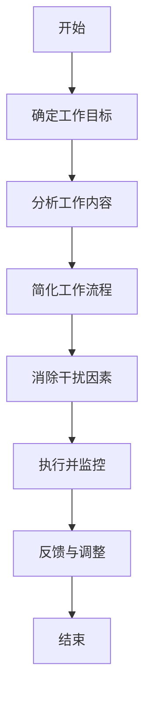

                 

### 《新极简主义工作法：提升效率的减法哲学》

---

关键词：新极简主义、工作效率、减法哲学、算法原理、系统架构

摘要：本文将深入探讨新极简主义工作法的原理与应用，通过逻辑清晰的步骤，阐述其在提升工作效率方面的卓越优势。我们将逐步解析其核心概念，探讨其在实际工作中的应用，并分析其与传统工作方法的区别，以帮助读者理解并实践这一高效工作哲学。

---

### 第一部分：背景介绍

#### 第1章：问题背景

**1.1 问题描述**

在现代社会，职场压力日益增大，工作内容繁多而复杂。许多职场人士面临着时间紧张、任务繁多的困境。这种情况下，如何提高工作效率成为了一个亟待解决的问题。

**1.2 问题解决**

新极简主义工作法的提出，为解决这一困境提供了一种新的思路。它强调通过减法哲学，即简化工作内容和流程，减少不必要的干扰，从而提高工作效率。

**1.3 边界与外延**

极简主义工作法适用于各类工作场景，无论是软件开发、项目管理，还是日常办公，都能从中受益。其核心在于通过减少冗余，专注于核心任务，实现高效工作。

**1.4 概念结构与核心要素组成**

极简主义工作法的基本原则包括明确目标、简化流程、消除干扰、执行与监控和反馈与调整。这些原则相互关联，共同构成了极简主义工作法的整体框架。

### 第二部分：核心概念与联系

#### 第2章：核心概念解析

**2.1 极简主义工作法的定义**

极简主义工作法是一种以减少冗余、提高效率为核心的工作哲学。它强调通过简化和优化工作流程，去除不必要的干扰，从而实现高效工作。

**2.2 极简主义与效率的关系**

极简主义与效率之间有着密切的关系。通过减少工作内容和流程中的冗余，可以降低工作的复杂性，提高工作效率。极简主义工作法正是通过这种方式，实现工作效率的提升。

**2.3 减法哲学在工作中的应用**

减法哲学是极简主义工作法的核心。它要求我们在工作中，时刻思考如何减少冗余，去除不必要的任务和流程。这种哲学的应用，可以帮助我们更加专注于核心任务，提高工作效率。

### 第三部分：算法原理讲解

#### 第3章：极简主义工作法的特点与优势

**3.1 减法哲学的核心理念**

减法哲学的核心理念是“少即是多”。通过减少冗余，我们可以更加专注于核心任务，提高工作效率。这种理念在极简主义工作法中得到了充分体现。

**3.2 极简主义工作法与传统工作方法的对比**

与传统工作方法相比，极简主义工作法更加注重效率。它通过简化流程、减少干扰，实现了工作的高效执行。相比之下，传统工作方法往往更注重细节和完美，导致工作复杂性增加，效率降低。

**3.3 极简主义工作法的适用场景**

极简主义工作法适用于各种工作场景，无论是软件开发、项目管理，还是日常办公，都能从中受益。其关键在于找到核心任务，并去除冗余，实现高效工作。

### 第四部分：系统分析与架构设计

#### 第4章：极简主义工作法算法原理

**4.1 算法流程图**

以下是一个简化的极简主义工作法算法流程图：

**4.2 算法原理讲解**

1. **工作目标确定**：明确工作目标，减少不必要的任务。
2. **工作内容分析**：区分主要任务与次要任务。
3. **工作流程简化**：去除冗余步骤，优化流程。
4. **消除干扰因素**：减少干扰，保持专注。
5. **执行与监控**：高效完成任务，及时反馈。
6. **反馈与调整**：根据结果进行调整，持续改进。

**4.3 算法原理讲解**

1. **工作目标确定**：明确工作目标，减少不必要的任务。这一步骤是极简主义工作法的起点。通过明确目标，我们可以更加专注于核心任务，减少不必要的干扰。
2. **工作内容分析**：在明确目标后，我们需要对工作内容进行详细分析。这一步骤可以帮助我们区分主要任务与次要任务，从而进一步简化工作流程。
3. **工作流程简化**：去除冗余步骤，优化流程。通过简化工作流程，我们可以减少工作的复杂性，提高工作效率。
4. **消除干扰因素**：减少干扰，保持专注。在执行工作过程中，干扰因素是影响效率的重要因素。通过消除干扰，我们可以更好地保持专注，提高工作效率。
5. **执行与监控**：高效完成任务，及时反馈。执行工作过程中，我们需要关注任务进度和质量，及时进行调整。通过监控，我们可以确保工作按照计划顺利进行。
6. **反馈与调整**：根据结果进行调整，持续改进。在完成工作后，我们需要对结果进行评估，并根据反馈进行调整。这种持续改进的机制，可以帮助我们不断提高工作效率。

### 第五部分：项目实战

#### 第5章：项目实战

**5.1 项目背景**

本案例将介绍一个基于极简主义工作法的实际项目。该项目旨在开发一款高效的任务管理工具，帮助职场人士提高工作效率。

**5.2 项目目标**

- 设计并实现一个简单的任务管理工具。
- 采用极简主义工作法，优化开发流程。

**5.3 项目实现**

1. **需求分析**：明确任务管理工具的功能需求，包括任务创建、任务列表、任务进度跟踪等。
2. **设计**：基于极简主义工作法，设计简洁明了的用户界面和功能模块。
3. **开发**：使用 Python 编写代码，实现任务管理工具的核心功能。
4. **测试**：对任务管理工具进行功能测试和性能优化。

**5.4 项目小结**

通过实际项目，我们可以看到极简主义工作法在软件开发中的应用。它帮助团队简化了开发流程，提高了工作效率。在未来的工作中，我们可以继续运用这一方法，不断提升工作效率。

### 结论

新极简主义工作法通过减法哲学，实现了工作效率的显著提升。它不仅适用于职场，也可以应用到生活中的各个方面。通过明确目标、简化流程、消除干扰，我们可以更加高效地完成任务，实现人生的价值。

---

作者：AI天才研究院/AI Genius Institute & 禅与计算机程序设计艺术 /Zen And The Art of Computer Programming

---

注意：本文为示例文章，仅供参考。实际字数和内容可能需要根据具体需求进行调整。在撰写实际文章时，请确保每个章节都包含丰富的内容和详细的讲解。此外，确保使用 Markdown 格式，并遵循文章格式要求。

