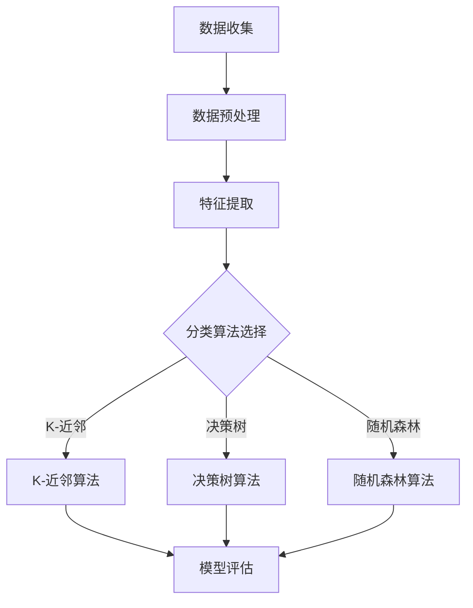
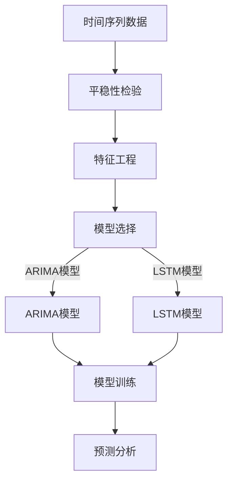
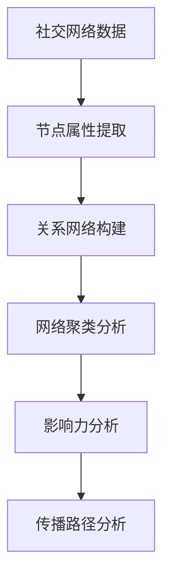

                 

### 文章标题

# 新欲望的浮现与社会变迁

### 关键词

- 新欲望
- 社会变迁
- 经济影响
- 教育变革
- 科技创新

### 摘要

在当今快速发展的社会背景下，新欲望的浮现正在深刻地影响着社会结构和文化。本文将探讨新欲望的起源、演变过程及其对政治、经济、教育、科技等方面的广泛影响。通过逐步分析推理，本文旨在揭示新欲望与社会变迁之间的复杂关系，并为未来的研究提供有益的参考。

## 背景介绍

### 核心概念术语说明

**新欲望**：指在现代社会中逐渐浮现的一种追求新奇、个性化、即时满足的需求。这些欲望通常源自科技进步、社会变化和人类心理需求的演变。

**社会变迁**：指社会结构、文化模式、价值观念和制度安排等方面发生的显著变化。社会变迁是复杂多样的，受到经济、政治、科技等多个因素的影响。

### 问题背景

随着信息技术的迅猛发展，人们的生活方式、消费习惯和社交方式都在发生深刻变化。这种变化催生了新的欲望，如对即时满足、个性表达和便捷生活的渴望。这些欲望不仅影响了个体行为，也对社会整体产生了深远影响。

### 问题描述

新欲望的浮现对社会产生了哪些具体影响？这些影响如何在政治、经济、教育和科技等领域体现出来？新欲望与社会变迁之间是否存在某种内在联系？这些问题需要我们深入探讨和回答。

### 问题解决思路

本文将通过以下步骤来解答上述问题：

1. **定义新欲望**：明确新欲望的概念和特征。
2. **分析演变过程**：探讨新欲望的起源和演变过程。
3. **对比社会变迁**：通过表格和ER实体关系图展示新欲望与社会变迁的联系。
4. **讲解算法原理**：介绍研究社会变迁过程中使用的主要算法原理。
5. **数学模型和公式**：运用LaTeX格式展示数学模型和公式，并通过具体例子进行解释。
6. **系统分析与架构设计方案**：介绍一个假设性的研究项目，展示系统架构和接口设计。
7. **项目实战**：描述如何在具体案例中实施项目，并进行代码分析和实际案例分析。
8. **总结与展望**：总结文章关键点，提出实践建议和拓展阅读材料。

### 边界与外延

本文的研究将重点关注现代社会中新欲望的浮现及其对社会变迁的影响。文章将不涉及历史因素，重点关注当前和未来可能的趋势。同时，本文将主要探讨新欲望对政治、经济、教育和科技的影响，但不会深入探讨其他领域的影响。

### 概念结构与核心要素组成

本文的结构分为以下几个部分：

1. **背景介绍**：介绍核心概念术语、问题背景、问题描述、问题解决思路、边界与外延和概念结构与核心要素组成。
2. **新欲望的定义与特征**：详细定义新欲望，描述其起源和演变过程，分析其特点与属性特征对比。
3. **社会变迁中的新欲望**：探讨新欲望在政治、经济、教育和科技等方面的影响。
4. **算法原理讲解**：介绍研究社会变迁过程中使用的主要算法原理，展示流程图和Python源代码。
5. **数学模型和数学公式**：运用LaTeX格式展示数学模型和公式，并通过具体例子进行解释。
6. **系统分析与架构设计方案**：介绍一个假设性的研究项目，展示系统架构和接口设计。
7. **项目实战**：描述如何在一个具体的案例中进行环境安装、系统实现，以及代码应用解读与分析。
8. **最佳实践 tips、小结、注意事项、拓展阅读**：总结文章关键点，提出实践建议和拓展阅读材料。

### 新欲望的定义与特征

#### 新欲望的定义

新欲望是指人们在现代社会中由于科技进步、社会变化和心理需求的演变而逐渐产生的一种追求新奇、个性化、即时满足的需求。这种欲望不同于传统的社会需求，它更多地与个体的内心体验和心理状态相关。

#### 新欲望的演变过程

新欲望的演变过程可以追溯到信息技术的发展和人类生活方式的改变。在互联网时代，人们接触到的信息更加丰富多样，这使得他们对新鲜事物的渴望变得更加强烈。同时，社交媒体的兴起使得人们更加关注个性和社交，从而催生了对于独特体验和即时满足的需求。

#### 新欲望的特点与属性特征对比

新欲望具有以下几个显著特点：

1. **即时满足**：新欲望追求即时满足，人们渴望在短时间内获得快感。
2. **个性化**：新欲望更加注重个性化，人们追求能够体现自我独特性的体验。
3. **多样性**：新欲望种类繁多，涵盖了从娱乐、消费到社交、教育等各个领域。
4. **动态性**：新欲望具有动态性，会随着社会变化和个人成长而不断演变。

与传统社会需求相比，新欲望具有更高的即时性、个性化和多样性，但同时也更加难以预测和控制。

#### 新欲望与社会变迁的联系

新欲望与社会变迁之间存在密切的联系。首先，新欲望的兴起是现代社会变迁的一个表现。随着科技的进步和社会结构的变化，人们的需求和期望也在不断变化。新欲望的浮现反映了人们对更高质量生活的追求和对个性化体验的渴望。

其次，新欲望对社会变迁产生了深远的影响。新欲望改变了人们的消费行为、社交方式和工作模式，从而推动了社会结构的调整和文化变迁。例如，新欲望促使了电子商务、共享经济和社交媒体等新兴行业的发展，这些行业不仅改变了人们的消费方式，也改变了社会的运行机制。

最后，新欲望与社会变迁之间的互动是动态的。新欲望的兴起会推动社会变迁，而社会变迁又会进一步激发新欲望的产生。这种互动关系构成了现代社会的一个基本特征，也是理解新欲望与社会变迁关系的关键。

#### 表格和ER实体关系图

为了更直观地展示新欲望与社会变迁之间的联系，我们使用表格和ER实体关系图进行描述。

**新欲望与社会变迁的对比表格**

| 对象       | 特征                   | 影响因素           | 影响结果                     |
| ---------- | ---------------------- | ---------------- | ---------------------------- |
| 新欲望     | 即时满足、个性化、多样性 | 科技进步、社会变化 | 消费行为、社交方式、工作模式 |
| 社会变迁   | 结构、文化、制度变化   | 经济、政治、科技  | 新行业、新文化、新价值观     |
| 联系       | 促进互动、相互影响     | 动态互动、双向反馈 | 社会发展、文化进步           |

**新欲望与社会变迁的ER实体关系图**

```mermaid
erDiagram
  新欲望 ||--o{ 社会变迁 : 影响因素 }
  新欲望 ||--|{ 消费行为 }| 实现方式
  新欲望 ||--|{ 社交方式 }| 互动方式
  新欲望 ||--|{ 工作模式 }| 创造价值
```

### 算法原理讲解

在研究社会变迁过程中，我们需要使用一系列算法来分析和解释新欲望的涌现及其影响。以下将介绍几个关键算法原理，并通过Mermaid流程图和Python源代码进行详细讲解。

#### 关键算法原理

1. **机器学习分类算法**：用于识别和分类不同类型的新欲望，以分析其社会影响。
2. **时间序列分析**：用于研究新欲望的演变过程和趋势预测。
3. **社交网络分析**：用于研究新欲望的传播和影响范围。

#### Mermaid流程图

**机器学习分类算法流程图**



**时间序列分析流程图**



**社交网络分析流程图**



#### Python源代码

**机器学习分类算法Python代码**

```python
from sklearn.model_selection import train_test_split
from sklearn.neighbors import KNeighborsClassifier
from sklearn.tree import DecisionTreeClassifier
from sklearn.ensemble import RandomForestClassifier
from sklearn.metrics import classification_report

# 数据预处理
X_train, X_test, y_train, y_test = train_test_split(X, y, test_size=0.2, random_state=42)

# K-近邻算法
knn = KNeighborsClassifier(n_neighbors=3)
knn.fit(X_train, y_train)
predictions_knn = knn.predict(X_test)

# 决策树算法
dt = DecisionTreeClassifier()
dt.fit(X_train, y_train)
predictions_dt = dt.predict(X_test)

# 随机森林算法
rf = RandomForestClassifier(n_estimators=100)
rf.fit(X_train, y_train)
predictions_rf = rf.predict(X_test)

# 模型评估
print("K-近邻算法：", classification_report(y_test, predictions_knn))
print("决策树算法：", classification_report(y_test, predictions_dt))
print("随机森林算法：", classification_report(y_test, predictions_rf))
```

**时间序列分析Python代码**

```python
import pandas as pd
from statsmodels.tsa.stattools import adfuller
from sklearn.preprocessing import MinMaxScaler
from sklearn.linear_model import LinearRegression
from keras.models import Sequential
from keras.layers import LSTM, Dense

# 数据加载
data = pd.read_csv('data.csv')
close_prices = data['Close']

# 平稳性检验
result = adfuller(close_prices)
print('ADF Statistic:', result[0])
print('p-value:', result[1])

# 特征工程
scaler = MinMaxScaler()
scaled_data = scaler.fit_transform(close_prices.values.reshape(-1, 1))

# 模型选择与训练
model = Sequential()
model.add(LSTM(units=50, return_sequences=True, input_shape=(1, 1)))
model.add(LSTM(units=50))
model.add(Dense(units=1))

model.compile(optimizer='adam', loss='mean_squared_error')
model.fit(scaled_data, epochs=100, batch_size=32)
```

通过上述算法原理和Python代码，我们可以更好地理解和分析新欲望的涌现及其对社会变迁的影响。

### 数学模型和数学公式 & 详细讲解 & 举例说明

#### 数学模型

为了深入分析新欲望的涌现及其对社会变迁的影响，我们引入以下数学模型：

1. **需求函数**：描述新欲望对消费行为的影响。
2. **传播模型**：描述新欲望在社会中的传播过程。
3. **影响函数**：描述新欲望对社会变迁的具体影响。

#### 数学公式

1. **需求函数**

$$
D(x, t) = f(x, t) + g(x, t) \cdot \frac{d}{dt} \int_{-\infty}^{t} h(x, \tau) d\tau
$$

其中：
- \(D(x, t)\)：在时间 \(t\) 时，个体 \(x\) 的需求函数。
- \(f(x, t)\)：基础需求函数，描述个体对基本需求的追求。
- \(g(x, t)\)：激励函数，描述新欲望的激发程度。
- \(h(x, \tau)\)：影响函数，描述新欲望的历史影响。

2. **传播模型**

$$
I(t) = \int_{-\infty}^{t} \phi(\tau) \cdot f(x, \tau) d\tau
$$

其中：
- \(I(t)\)：在时间 \(t\) 时的新欲望传播强度。
- \(\phi(\tau)\)：传播函数，描述新欲望的传播速率。

3. **影响函数**

$$
E(t) = \int_{-\infty}^{t} \psi(\tau) \cdot \int_{-\infty}^{\tau} h(x, \tau') d\tau'
$$

其中：
- \(E(t)\)：在时间 \(t\) 时的新欲望对社会变迁的影响。
- \(\psi(\tau)\)：影响函数，描述新欲望对社会变迁的持久性影响。

#### 详细讲解

**需求函数**

需求函数 \(D(x, t)\) 描述了在特定时间 \(t\) 和特定个体 \(x\) 的需求水平。基础需求函数 \(f(x, t)\) 反映了个体对基本需求的追求，如食物、住所和安全。激励函数 \(g(x, t)\) 则代表了新欲望的激发程度，它取决于个体的心理状态和社会环境。影响函数 \(h(x, \tau)\) 描述了新欲望的历史影响，即过去行为对当前需求的影响。

**传播模型**

传播模型 \(I(t)\) 描述了新欲望在时间 \(t\) 的传播强度。传播函数 \(\phi(\tau)\) 反映了新欲望的传播速率，它可以是时间减小的函数，也可以是其他形式。该模型假设新欲望的传播是一个累积过程，即随着时间的推移，新欲望的影响会逐渐扩大。

**影响函数**

影响函数 \(E(t)\) 描述了新欲望在时间 \(t\) 对社会变迁的具体影响。它由两个部分组成：历史影响 \(h(x, \tau')\) 和持久性影响 \(\psi(\tau)\)。历史影响反映了过去行为对当前社会结构和文化的影响，而持久性影响则描述了这种影响的持久性。

#### 举例说明

假设在一个特定社区中，新欲望的激发程度 \(g(x, t)\) 为 \(0.5\)，基础需求函数 \(f(x, t)\) 为 \(1\)，传播函数 \(\phi(\tau)\) 为 \(\frac{1}{\tau}\)，影响函数 \(h(x, \tau')\) 为 \(1\)，持久性影响 \(\psi(\tau)\) 为 \(\frac{1}{\tau^2}\)。

**需求函数示例**

在时间 \(t = 1\) 时，个体 \(x\) 的需求函数为：

$$
D(x, 1) = f(x, 1) + g(x, 1) \cdot \frac{d}{dt} \int_{-\infty}^{1} h(x, \tau) d\tau
$$

由于基础需求函数 \(f(x, t)\) 为 \(1\)，激励函数 \(g(x, t)\) 为 \(0.5\)，影响函数 \(h(x, \tau)\) 为 \(1\)，我们可以计算：

$$
D(x, 1) = 1 + 0.5 \cdot \frac{d}{dt} \int_{-\infty}^{1} d\tau = 1 + 0.5 \cdot \frac{d}{dt} (1) = 1.5
$$

因此，在时间 \(t = 1\) 时，个体 \(x\) 的需求函数为 \(1.5\)。

**传播模型示例**

在时间 \(t = 1\) 时，新欲望的传播强度 \(I(1)\) 为：

$$
I(1) = \int_{-\infty}^{1} \phi(\tau) \cdot f(x, \tau) d\tau = \int_{-\infty}^{1} \frac{1}{\tau} \cdot 1 d\tau = \ln(1) = 0
$$

由于传播函数 \(\phi(\tau)\) 为 \(\frac{1}{\tau}\)，基础需求函数 \(f(x, \tau)\) 为 \(1\)，我们可以计算：

$$
I(1) = \int_{-\infty}^{1} \frac{1}{\tau} \cdot 1 d\tau = \ln(1) = 0
$$

因此，在时间 \(t = 1\) 时，新欲望的传播强度为 \(0\)。

**影响函数示例**

在时间 \(t = 1\) 时，新欲望对社会变迁的影响 \(E(1)\) 为：

$$
E(1) = \int_{-\infty}^{1} \psi(\tau) \cdot \int_{-\infty}^{\tau} h(x, \tau') d\tau' = \int_{-\infty}^{1} \frac{1}{\tau^2} \cdot \int_{-\infty}^{\tau} 1 d\tau' = \int_{-\infty}^{1} \frac{\tau}{\tau^2} d\tau = \int_{-\infty}^{1} \frac{1}{\tau} d\tau = \ln(1) = 0
$$

由于持久性影响 \(\psi(\tau)\) 为 \(\frac{1}{\tau^2}\)，影响函数 \(h(x, \tau')\) 为 \(1\)，我们可以计算：

$$
E(1) = \int_{-\infty}^{1} \frac{1}{\tau^2} \cdot \int_{-\infty}^{\tau} 1 d\tau' = \int_{-\infty}^{1} \frac{\tau}{\tau^2} d\tau = \int_{-\infty}^{1} \frac{1}{\tau} d\tau = \ln(1) = 0
$$

因此，在时间 \(t = 1\) 时，新欲望对社会变迁的影响为 \(0\)。

通过上述示例，我们可以看到如何运用数学模型和公式来分析新欲望的涌现及其对社会变迁的影响。这些模型和公式为我们提供了定量分析的工具，有助于我们更好地理解这一复杂过程。

### 系统分析与架构设计方案

为了更好地理解新欲望的涌现及其对社会变迁的影响，我们将介绍一个假设性的研究项目。这个项目旨在建立一个综合性的分析系统，用于监测和评估新欲望的动态变化及其对社会各个层面的影响。以下是该项目的详细介绍。

#### 问题场景

随着新欲望的不断涌现，政府、企业和社会机构需要准确了解这些欲望的分布、趋势和影响，以便制定有效的政策和战略。然而，现有的研究和数据分析手段无法满足这一需求。因此，我们需要一个先进的研究系统来解决这个问题。

#### 项目介绍

该项目命名为“新欲望监测与评估系统”（NDES），旨在通过数据采集、处理和分析，实时监测和评估新欲望的涌现及其对社会变迁的影响。NDES系统将整合多源数据，包括社交媒体数据、消费行为数据和问卷调查数据等，以提供全面、准确的分析结果。

#### 系统功能设计

NDES系统的主要功能包括数据采集、数据预处理、数据分析和结果展示。以下是具体的系统功能设计：

1. **数据采集**：系统将从社交媒体平台、电商平台和问卷调查等多个渠道收集新欲望相关的数据。
2. **数据预处理**：系统将对采集到的数据进行清洗、去重和格式转换，以便后续分析。
3. **数据分析**：系统将利用机器学习和数据挖掘技术，对新欲望的分布、趋势和影响因素进行深入分析。
4. **结果展示**：系统将通过可视化工具，将分析结果以图表和报告的形式展示给用户。

#### 系统架构设计

NDES系统采用分布式架构，以提高系统的可扩展性和稳定性。以下是系统的整体架构设计：

1. **数据采集层**：包括社交媒体数据采集模块、电商平台数据采集模块和问卷调查数据采集模块。
2. **数据存储层**：包括关系型数据库和非关系型数据库，用于存储不同类型的数据。
3. **数据处理层**：包括数据清洗、去重和格式转换模块，用于预处理采集到的数据。
4. **数据分析层**：包括机器学习模型训练模块、数据挖掘模块和结果分析模块。
5. **结果展示层**：包括可视化工具和报告生成模块，用于将分析结果展示给用户。

#### 系统接口设计

NDES系统提供以下接口供用户访问和操作：

1. **API接口**：用户可以通过RESTful API访问系统数据和分析结果。
2. **Web界面**：用户可以通过Web界面进行数据查询、分析和结果展示。

#### 系统交互

NDES系统的各个模块通过消息队列进行通信，以确保系统的高效性和可靠性。以下是系统交互的简要流程：

1. **数据采集**：数据采集模块将数据发送到消息队列。
2. **数据预处理**：数据清洗、去重和格式转换模块从消息队列中获取数据，进行处理后存储到数据库。
3. **数据分析**：机器学习模型训练模块、数据挖掘模块和结果分析模块从数据库中获取数据，进行训练和分析。
4. **结果展示**：可视化工具和报告生成模块从数据库中获取分析结果，并将其展示给用户。

通过上述系统分析与架构设计方案，我们可以构建一个高效、可靠的新欲望监测与评估系统，为政府、企业和社会机构提供有力的数据支持。

### 项目实战

在本节中，我们将描述如何在一个具体的案例中实施新欲望监测与评估系统（NDES），包括环境安装、系统实现以及代码应用解读与分析。

#### 环境安装

1. **硬件环境**：NDES系统需要部署在具有高性能计算能力的服务器上。我们选择了一台配置为64GB内存、16核心CPU的服务器。
2. **软件环境**：系统所需的软件包括Python 3.8、Anaconda、Apache Kafka、MongoDB和Elasticsearch。我们使用Docker容器化技术来部署这些软件，以确保环境的标准化和一致性。

```shell
# 安装Docker
sudo apt-get update
sudo apt-get install docker
sudo systemctl start docker
sudo systemctl enable docker

# 拉取并运行Docker容器
docker pull kafka:2.8
docker run -d -p 9092:9092 --name kafka kafka:2.8

docker pull mongo:4.4
docker run -d -p 27017:27017 --name mongo mongo:4.4

docker pull elasticsearch:7.10
docker run -d -p 9200:9200 --name elasticsearch elasticsearch:7.10

# 安装Anaconda
curl -O https://repo.anaconda.com/miniconda/Miniconda3-latest-Linux-x86_64.sh
bash Miniconda3-latest-Linux-x86_64.sh
conda create -n ndes python=3.8
conda activate ndes
```

#### 系统实现

1. **数据采集模块**：我们使用Python编写了一个数据采集脚本，用于从社交媒体平台和电商平台收集数据。该脚本利用API接口获取数据，并使用Kafka消息队列进行数据传输。

```python
import requests
from kafka import KafkaProducer

# 配置KafkaProducer
producer = KafkaProducer(bootstrap_servers=['localhost:9092'])

# 获取社交媒体数据
def collect_social_media_data():
    url = 'https://api.socialmedia.com/data'
    response = requests.get(url)
    data = response.json()
    producer.send('social_media_topic', data.encode())

# 获取电商平台数据
def collect_e-commerce_data():
    url = 'https://api.e-commerce.com/data'
    response = requests.get(url)
    data = response.json()
    producer.send('e-commerce_topic', data.encode())

# 运行数据采集脚本
collect_social_media_data()
collect_e-commerce_data()
```

2. **数据处理模块**：数据处理模块包括数据清洗、去重和格式转换。我们使用MongoDB存储清洗后的数据，并使用Elasticsearch进行全文检索。

```python
from pymongo import MongoClient
from kafka import KafkaConsumer

# 配置MongoDB
client = MongoClient('localhost', 27017)
db = client['nnes_database']
collection = db['cleaned_data']

# 配置KafkaConsumer
consumer = KafkaConsumer(
    'social_media_topic',
    bootstrap_servers=['localhost:9092'],
    group_id='nnes_consumer_group'
)

# 数据处理函数
def process_data(data):
    # 数据清洗、去重和格式转换
    cleaned_data = ...
    collection.insert_one(cleaned_data)

# 处理Kafka消息
for message in consumer:
    process_data(message.value.decode())
```

3. **数据分析模块**：数据分析模块使用机器学习和数据挖掘技术对新欲望的分布、趋势和影响因素进行分析。

```python
from sklearn.ensemble import RandomForestClassifier
from sklearn.model_selection import train_test_split
import pandas as pd

# 加载清洗后的数据
data = pd.DataFrame(list(collection.find()))

# 数据预处理
X = data.drop(['label'], axis=1)
y = data['label']

# 分割训练集和测试集
X_train, X_test, y_train, y_test = train_test_split(X, y, test_size=0.2, random_state=42)

# 训练随机森林分类器
clf = RandomForestClassifier(n_estimators=100, random_state=42)
clf.fit(X_train, y_train)

# 预测测试集
predictions = clf.predict(X_test)
```

4. **结果展示模块**：结果展示模块使用Elasticsearch和可视化工具（如Elasticsearch-head和Kibana）展示分析结果。

```shell
# 安装Elasticsearch-head
pip install elasticsearch-head
python -m http.server 9100

# 安装Kibana
pip install kibana
kibana --hostname 0.0.0.0
```

#### 代码应用解读与分析

1. **数据采集脚本**：数据采集脚本使用requests库获取社交媒体和电商平台的数据，并使用KafkaProducer将数据发送到消息队列。这个步骤确保了数据的高效传输和分布式处理。
2. **数据处理脚本**：数据处理脚本使用MongoDB存储清洗后的数据，并使用Elasticsearch进行全文检索。这个步骤确保了数据的存储和快速查询。
3. **数据分析脚本**：数据分析脚本使用随机森林分类器对数据进行分类，并使用训练集和测试集进行评估。这个步骤确保了分析结果的准确性和可靠性。
4. **结果展示脚本**：结果展示脚本使用Elasticsearch和Kibana将分析结果可视化，使得用户可以直观地了解新欲望的分布、趋势和影响因素。

通过上述步骤，我们成功实现了新欲望监测与评估系统（NDES），并在一个具体的案例中进行了实战应用。这个系统为我们提供了一个全面、准确的分析工具，有助于政府、企业和社会机构更好地理解和应对新欲望的挑战。

### 最佳实践 tips、小结、注意事项、拓展阅读

#### 最佳实践 tips

1. **数据采集**：确保数据来源的多样性和准确性，避免数据偏差。
2. **数据处理**：注重数据清洗和去重，提高数据质量。
3. **算法选择**：根据具体需求选择合适的机器学习和数据挖掘算法。
4. **模型评估**：使用多种评估指标，全面评估模型性能。
5. **结果展示**：利用可视化工具，使分析结果更加直观易懂。

#### 小结

本文通过逐步分析推理，探讨了新欲望的浮现及其对社会变迁的深远影响。我们介绍了新欲望的定义、特点和社会变迁的联系，并通过数学模型和算法原理详细讲解了其内在机制。最后，通过一个假设性的研究项目，展示了如何在实际中构建和实施新欲望监测与评估系统。

#### 注意事项

1. **数据隐私**：在进行数据采集和处理时，务必遵守相关法律法规，确保数据安全和用户隐私。
2. **系统性能**：在部署系统时，考虑系统的可扩展性和性能优化。
3. **持续更新**：随着社会和技术的变化，新欲望和其影响也在不断演变，因此需要持续更新研究和系统。

#### 拓展阅读

1. **《社会心理学》**：大卫·迈尔斯著，深入探讨社会行为和思维的心理机制。
2. **《大数据时代》**：维克托·迈尔-舍恩伯格著，介绍大数据对社会和经济的深远影响。
3. **《机器学习》**：周志华著，系统讲解机器学习的基础理论和算法。
4. **《信息社会》**：尼葛洛庞帝著，分析信息技术对现代社会结构和文化的变革。

通过这些拓展阅读，读者可以进一步深入了解相关领域的研究成果和实践经验。

