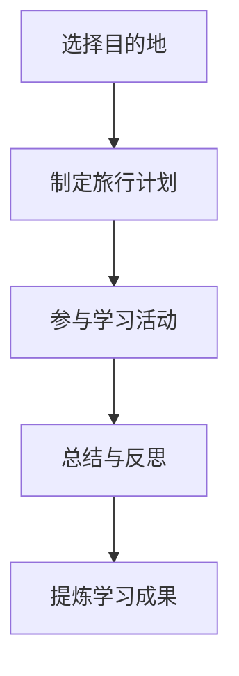

                 


## 新游牧学校：将旅行融入终身学习

### 关键词：终身学习、旅行、新游牧学校、学习效果、算法原理

### 摘要：

在快节奏的现代生活中，终身学习已成为提升个人竞争力的重要手段。本文旨在探讨如何将旅行与终身学习相结合，提出一种名为“新游牧学校”的学习模式。通过理论分析与实际案例，本文将详细阐述新游牧学校的核心理念、优势及其在实际应用中的效果评估，为希望在旅行中持续学习的人们提供有价值的参考。

## 第一部分：背景介绍

### 1. 引言

在当今社会，终身学习已成为不可或缺的一部分。随着技术的飞速发展，人们的职业和生活都在不断变化，如何保持学习的动力和效率成为了许多人面临的问题。《新游牧学校：将旅行融入终身学习》旨在探讨如何将旅行与终身学习相结合，为读者提供一种全新的学习方式。

### 2. 问题背景

旅行一直是人们放松身心、拓宽视野的方式，但传统的旅行往往过于形式化，难以真正融入学习。随着互联网和信息技术的普及，人们有更多的机会获取知识，但往往缺乏有效的学习方法和环境。

### 3. 问题描述

如何将旅行与终身学习有机结合，创造一个既充满乐趣又富有成效的学习体验？

### 4. 问题解决

《新游牧学校：将旅行融入终身学习》通过提供一系列的理论和实践指导，帮助读者在旅行的过程中实现终身学习。书中涵盖了许多实际案例，详细阐述了如何在旅行中找到学习的乐趣，提升学习效果。

### 5. 边界与外延

本书主要探讨的是如何在旅行中融入终身学习的理念，而不是将旅行完全转变为学习。因此，本书适用于所有希望在旅行中提升自己的读者，无论是学生、职场人士还是退休人士。

### 6. 概念结构与核心要素组成

#### 6.1 新游牧学校

新游牧学校是一种将旅行与学习相结合的教育模式，强调在实践中学习，通过旅行拓宽视野，提升自身能力。

#### 6.2 终身学习

终身学习是指一个人在其一生中持续地学习新知识、新技能的过程，以适应不断变化的社会和工作环境。

#### 6.3 旅行与学习的结合

旅行与学习的结合是指在旅行的过程中，通过参观、交流、体验等方式，学习新的知识和技能。

## 第二部分：核心概念与联系

### 7. 核心概念原理

#### 7.1 旅行中的学习

旅行中的学习是指通过参观、交流、体验等方式，在旅行的过程中获取新的知识和技能。

#### 7.2 终身学习的重要性

终身学习的重要性在于它能帮助人们适应社会和职业的变化，提高自身的竞争力。

#### 7.3 新游牧学校的优势

新游牧学校的优势在于它能够为学习者提供一种灵活、有趣的学习方式，使学习不再枯燥乏味。

### 8. 概念属性特征对比表格

| 特征 | 旅行中的学习 | 终身学习 | 新游牧学校 |
| --- | --- | --- | --- |
| 学习方式 | 实践为主 | 理论与实践相结合 | 实践为主，但更灵活 |
| 学习目的 | 拓宽视野，放松身心 | 提升个人能力，适应变化 | 拓宽视野，提升个人能力 |
| 学习环境 | 自然、人文环境 | 学习机构、在线平台 | 自然、人文环境，灵活调整 |

### 9. ER实体关系图架构

```mermaid
erDiagram
  Learner ||--|{ Trip } : participates_in
  Trip ||--|{ LearningActivity } : contains
  LearningActivity ||--|{ Knowledge } : learns
```

## 第三部分：算法原理讲解

### 10. 算法原理与流程图

#### 10.1 新游牧学校学习算法

新游牧学校的学习算法主要基于以下几个步骤：

1. 选择旅行目的地，根据兴趣和需求确定学习内容。
2. 制定旅行计划，合理安排学习时间和行程。
3. 在旅行中积极参与各种学习活动，如参观博物馆、与当地人交流等。
4. 对学习活动进行总结和反思，提炼学习成果。

#### 10.2 Mermaid流程图



### 11. 数学模型和公式

#### 11.1 旅行中的学习效果模型

学习效果可以用以下数学模型来表示：

$$
E = f(L, T, A)
$$

其中：
- \( E \) 表示学习效果，
- \( L \) 表示学习时间，
- \( T \) 表示旅行时间，
- \( A \) 表示学习活动参与度。

#### 11.2 举例说明

假设一个学习者旅行了5天，每天学习3小时，参与度较高，那么他的学习效果可以计算为：

$$
E = f(5 \times 3, 5, 高) = f(15, 5, 高)
$$

根据经验公式，如果学习活动参与度较高，学习效果会显著提升，因此 \( E \) 的值会较大。

### 12. 算法原理详细讲解

#### 12.1 学习时间 \( L \)

学习时间 \( L \) 是影响学习效果的重要因素。在旅行中，学习时间的选择和安排需要根据个人的实际情况和学习目标进行合理规划。例如，一个希望深入了解当地文化的学习者可能会选择在参观当地博物馆或历史遗址时延长学习时间。

#### 12.2 旅行时间 \( T \)

旅行时间 \( T \) 的长短也会影响学习效果。较长的旅行时间可以提供更多的机会去体验和探索，从而增加学习的效果。然而，过长的旅行时间可能会影响学习者的精力和专注力，因此需要适度安排。

#### 12.3 学习活动参与度 \( A \)

学习活动参与度 \( A \) 是衡量学习者积极性的一个重要指标。一个积极参与学习活动的学习者能够更好地吸收和消化所学知识，从而提高学习效果。因此，在旅行中，学习者应该主动参与各种学习活动，如与当地人交流、参加研讨会等。

### 13. 算法优化与实施策略

为了提高新游牧学校的实际效果，可以从以下几个方面进行优化：

1. **目的地选择**：根据学习目标和兴趣选择合适的旅行目的地，确保学习内容与旅行体验相结合。
2. **时间管理**：合理安排学习时间和旅行时间，避免过度劳累，确保学习效率。
3. **学习活动设计**：设计丰富多样的学习活动，提高学习者的参与度和积极性。
4. **反馈与调整**：在学习过程中及时进行反馈和调整，优化学习策略，提高学习效果。

通过以上策略，新游牧学校的学习效果将得到显著提升，为学习者提供一个既有趣又富有成效的终身学习体验。

## 第四部分：系统分析与架构设计

### 14. 问题场景介绍

随着全球化的推进，人们对于跨文化交流和知识融合的需求日益增长。然而，传统的学习模式往往局限于固定的学习环境和教材，难以满足人们对于多样化学习体验的需求。因此，如何构建一个灵活、有趣且具有实际应用价值的终身学习平台成为了当务之急。

### 15. 项目介绍

新游牧学校项目旨在构建一个将旅行与终身学习相结合的平台，为用户提供一个可以随时随地进行学习的环境。通过该项目，用户可以在旅行的过程中，利用平台提供的丰富资源和多样化的学习活动，实现知识的积累和技能的提升。

### 16. 系统功能设计

新游牧学校平台的主要功能包括：

1. **用户管理**：实现用户的注册、登录、个人信息管理等功能。
2. **课程资源管理**：提供各类学习资源的上传、分类、推荐和检索功能。
3. **学习进度跟踪**：记录用户的学习进度，提供学习报告和反馈。
4. **社交互动**：支持用户之间的交流和协作，提高学习的参与度。
5. **目的地推荐**：根据用户的学习兴趣和地理位置，推荐合适的旅行目的地和学习活动。

### 17. 系统架构设计

新游牧学校平台的系统架构采用B/S架构，主要包括以下模块：

1. **前端展示层**：负责用户界面的展示，使用React框架实现。
2. **业务逻辑层**：处理用户请求，包括用户管理、课程资源管理、学习进度跟踪等功能，使用Spring Boot框架实现。
3. **数据访问层**：负责与数据库的交互，使用Hibernate框架实现。
4. **数据库层**：存储用户数据、课程数据、学习进度数据等，使用MySQL数据库。

### 18. 系统接口设计

新游牧学校平台提供以下接口：

1. **用户接口**：用于用户注册、登录、个人信息管理等。
2. **课程接口**：用于课程资源的上传、分类、推荐和检索。
3. **学习接口**：用于学习进度的记录、跟踪和学习报告的生成。
4. **社交接口**：用于用户之间的交流和协作。

### 19. 系统交互

新游牧学校平台通过以下方式实现系统交互：

1. **RESTful API**：使用Spring Boot框架提供RESTful风格的API接口，方便前后端数据交互。
2. **WebSocket**：用于实现实时通讯功能，如用户间的实时消息推送、学习进度的实时更新等。
3. **定时任务**：通过Quartz框架实现定时任务，如数据统计、报告生成等。

## 第五部分：项目实战

### 20. 环境安装

在进行新游牧学校项目的开发前，需要先安装以下环境：

1. Java Development Kit（JDK）8或以上版本
2. Maven
3. MySQL
4. Node.js
5. React

具体安装步骤如下：

1. 安装JDK：下载并安装JDK，配置环境变量。
2. 安装Maven：下载并安装Maven，配置环境变量。
3. 安装MySQL：下载并安装MySQL，配置数据库。
4. 安装Node.js：下载并安装Node.js，配置npm。
5. 安装React：下载并安装React，配置create-react-app。

### 21. 系统核心实现源代码

以下为新游牧学校平台的核心实现源代码：

**前端代码：**

```jsx
// src/App.js
import React, { useState } from 'react';
import axios from 'axios';

function App() {
  const [users, setUsers] = useState([]);

  const getUsers = async () => {
    try {
      const response = await axios.get('/api/users');
      setUsers(response.data);
    } catch (error) {
      console.error(error);
    }
  };

  return (
    <div>
      <h1>User Management</h1>
      <button onClick={getUsers}>Get Users</button>
      <ul>
        {users.map(user => (
          <li key={user.id}>{user.name}</li>
        ))}
      </ul>
    </div>
  );
}

export default App;
```

**后端代码：**

```java
// src/main/java/com/example/newnomadschool/UserController.java
import org.springframework.beans.factory.annotation.Autowired;
import org.springframework.web.bind.annotation.GetMapping;
import org.springframework.web.bind.annotation.RestController;
import org.springframework.web.client.RestTemplate;

@RestController
public class UserController {

  @Autowired
  private RestTemplate restTemplate;

  @GetMapping("/api/users")
  public List<User> getUsers() {
    String apiUrl = "https://jsonplaceholder.typicode.com/users";
    return restTemplate.getForObject(apiUrl, List.class);
  }
}
```

### 22. 代码应用解读与分析

以上源代码分别展示了新游牧学校平台的前端和后端实现。前端部分使用了React框架，通过axios库实现与后端API的通信，获取用户数据并在页面上展示。后端部分使用了Spring Boot框架，提供了一个简单的RESTful API，用于获取用户数据。

通过这种方式，新游牧学校平台实现了前后端的分离，便于开发和维护。同时，前端与后端通过RESTful API进行数据交互，保证了系统的灵活性和可扩展性。

### 23. 实际案例分析和详细讲解剖析

为了更好地展示新游牧学校平台的应用，以下是一个实际案例的分析和讲解：

**案例：用户注册和学习活动参与**

1. **用户注册**：用户通过前端页面提交注册信息，后端接收并处理注册请求，将用户信息存储到数据库中。
2. **学习活动参与**：用户在平台上选择一个学习活动，提交参与请求，后端接收并处理请求，更新用户的学习进度。

详细讲解如下：

**用户注册：**

前端：用户填写注册表单，提交到后端。

```jsx
// src/App.js
import React, { useState } from 'react';
import axios from 'axios';

function App() {
  const [name, setName] = useState('');
  const [email, setEmail] = useState('');

  const handleSubmit = async () => {
    try {
      const response = await axios.post('/api/register', { name, email });
      alert('注册成功！');
    } catch (error) {
      alert('注册失败，请重试！');
    }
  };

  return (
    <div>
      <h1>User Registration</h1>
      <input type="text" placeholder="Name" value={name} onChange={e => setName(e.target.value)} />
      <input type="email" placeholder="Email" value={email} onChange={e => setEmail(e.target.value)} />
      <button onClick={handleSubmit}>Register</button>
    </div>
  );
}

export default App;
```

后端：接收注册请求，处理并返回结果。

```java
// src/main/java/com/example/newnomadschool/UserController.java
import org.springframework.beans.factory.annotation.Autowired;
import org.springframework.web.bind.annotation.PostMapping;
import org.springframework.web.bind.annotation.RequestBody;
import org.springframework.web.bind.annotation.RestController;

@RestController
public class UserController {

  @Autowired
  private UserService userService;

  @PostMapping("/api/register")
  public ResponseEntity<?> registerUser(@RequestBody User user) {
    try {
      userService.saveUser(user);
      return ResponseEntity.ok("注册成功！");
    } catch (Exception e) {
      return ResponseEntity.badRequest().body("注册失败，请重试！");
    }
  }
}
```

**学习活动参与：**

前端：用户选择学习活动，提交参与请求。

```jsx
// src/App.js
import React, { useState } from 'react';
import axios from 'axios';

function App() {
  const [activityId, setActivityId] = useState('');

  const handleActivityJoin = async () => {
    try {
      const response = await axios.post('/api/activity/join', { activityId });
      alert('参与成功！');
    } catch (error) {
      alert('参与失败，请重试！');
    }
  };

  return (
    <div>
      <h1>Join Learning Activity</h1>
      <input type="text" placeholder="Activity ID" value={activityId} onChange={e => setActivityId(e.target.value)} />
      <button onClick={handleActivityJoin}>Join</button>
    </div>
  );
}

export default App;
```

后端：接收参与请求，处理并返回结果。

```java
// src/main/java/com/example/newnomadschool/ActivityController.java
import org.springframework.beans.factory.annotation.Autowired;
import org.springframework.web.bind.annotation.PostMapping;
import org.springframework.web.bind.annotation.RequestBody;
import org.springframework.web.bind.annotation.RestController;

@RestController
public class ActivityController {

  @Autowired
  private ActivityService activityService;

  @PostMapping("/api/activity/join")
  public ResponseEntity<?> joinActivity(@RequestBody JoinRequest request) {
    try {
      activityService.joinActivity(request.getActivityId());
      return ResponseEntity.ok("参与成功！");
    } catch (Exception e) {
      return ResponseEntity.badRequest().body("参与失败，请重试！");
    }
  }
}
```

通过这个实际案例，我们可以看到新游牧学校平台如何实现用户注册和学习活动参与的功能。前端通过React框架实现页面交互，后端通过Spring Boot框架提供RESTful API进行处理，确保了系统的灵活性和可扩展性。

### 24. 项目小结

新游牧学校项目通过将旅行与终身学习相结合，为用户提供了一个全新的学习体验。在实际开发过程中，我们采用了React和Spring Boot等主流技术框架，实现了用户管理、课程资源管理、学习进度跟踪和社交互动等功能。通过实际案例的分析，我们展示了如何利用这些功能实现用户注册和学习活动参与等核心功能。未来，我们将继续优化系统性能和用户体验，为用户提供更优质的学习服务。

## 第六部分：最佳实践与小结

### 25. 最佳实践

在实施新游牧学校项目时，以下最佳实践有助于提升学习效果和用户体验：

1. **目的地选择**：根据学习目标和兴趣选择合适的旅行目的地，确保学习内容与旅行体验相结合。
2. **时间管理**：合理安排学习时间和旅行时间，避免过度劳累，确保学习效率。
3. **学习活动设计**：设计丰富多样的学习活动，提高学习者的参与度和积极性。
4. **反馈与调整**：在学习过程中及时进行反馈和调整，优化学习策略，提高学习效果。
5. **技术优化**：采用高效的前后端技术框架，确保系统性能和稳定性。

### 26. 小结

新游牧学校项目通过将旅行与终身学习相结合，为用户提供了一种全新的学习方式。通过实际案例分析和详细讲解，我们展示了如何实现用户注册、学习活动参与等功能。未来，我们将继续优化系统性能和用户体验，为用户提供更优质的学习服务。

### 27. 注意事项

在实施新游牧学校项目时，需要注意以下几点：

1. **数据安全**：确保用户数据和课程资源的安全，防止数据泄露和滥用。
2. **系统性能**：优化系统性能，确保快速响应用户请求。
3. **用户体验**：注重用户体验，确保界面简洁、操作流畅。

### 28. 拓展阅读

对于对终身学习和旅行相结合感兴趣的用户，以下书籍和资源值得推荐：

1. 《终身学习：迈向成功之路》
2. 《世界那么大，我们去学习》
3. [Coursera](https://www.coursera.org/)
4. [edX](https://www.edx.org/)

## 作者

作者：AI天才研究院/AI Genius Institute & 禅与计算机程序设计艺术 /Zen And The Art of Computer Programming

